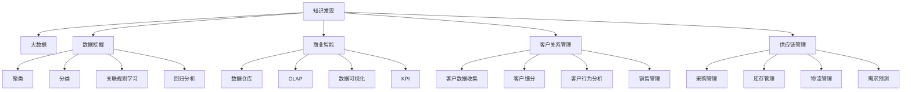

                 

# 知识发现引擎在企业中的应用

> 关键词：知识发现, 大数据, 数据挖掘, 企业决策, 商业智能

## 1. 背景介绍

### 1.1 问题由来

在现代商业环境中，企业面临的数据量呈指数级增长。如何从海量的数据中挖掘有价值的信息，获得竞争优势，成为企业关注的焦点。知识发现引擎作为数据驱动决策的工具，为企业提供了强大的数据洞察能力，帮助企业在激烈的市场竞争中取得领先。

### 1.2 问题核心关键点

知识发现引擎（Knowledge Discovery Engine, KDE）是一类用于从大量数据中提取有价值知识的软件工具和技术。它通过数据挖掘、统计分析和机器学习等手段，从原始数据中发现模式、趋势和关联，为企业决策提供支持。

当前，KDE在商业智能（Business Intelligence, BI）、客户关系管理（Customer Relationship Management, CRM）、供应链管理（Supply Chain Management, SCM）等多个企业应用场景中得到了广泛应用。KDE能够帮助企业从数据中获取商业洞见，优化运营管理，提高决策效率，成为现代企业信息化建设的重要组成部分。

### 1.3 问题研究意义

1. **提升决策效率**：通过自动化的数据分析和知识发现，KDE能够提供及时、准确的商业洞见，辅助管理层快速做出决策，提升企业响应市场变化的速度。
2. **优化运营管理**：KDE可以识别出运营中的瓶颈和改进点，通过数据驱动的决策，帮助企业优化流程，降低成本，提升效率。
3. **增强客户体验**：KDE能够分析客户行为数据，帮助企业了解客户需求，提供个性化服务，增强客户满意度和忠诚度。
4. **推动创新发展**：KDE的商业洞见能够指导产品开发和市场推广策略，帮助企业发现新的市场机会，推动创新发展。
5. **增强竞争力**：通过智能化的数据分析和决策支持，KDE使企业在竞争激烈的市场中占据优势，保持领先地位。

## 2. 核心概念与联系

### 2.1 核心概念概述

为更好地理解知识发现引擎在企业中的应用，本节将介绍几个密切相关的核心概念：

- **知识发现（Knowledge Discovery）**：指从数据中自动地、智能地发现有用、新颖、准确、可理解的知识。知识发现主要分为数据挖掘（Data Mining）、统计分析、机器学习和人工智能等方法。
- **大数据（Big Data）**：指规模庞大、类型多样的数据集。大数据的特点包括数据量大、速度快、种类多和价值高。
- **数据挖掘（Data Mining）**：指从大量数据中提取有用信息的过程。数据挖掘包括聚类、分类、关联规则学习、回归分析等技术。
- **商业智能（Business Intelligence, BI）**：指利用数据分析、数据挖掘和数据可视化等技术，支持企业决策的过程。BI涵盖数据仓库、数据挖掘、OLAP（Online Analytical Processing）、数据可视化和KPI（Key Performance Indicators）等。
- **客户关系管理（Customer Relationship Management, CRM）**：指企业通过客户数据的管理和分析，提升客户满意度和忠诚度的过程。CRM主要涉及客户数据收集、客户细分、客户行为分析、销售管理等。
- **供应链管理（Supply Chain Management, SCM）**：指企业通过优化供应链流程，提高供应链效率的过程。SCM涉及采购管理、库存管理、物流管理、需求预测等。

这些核心概念之间的逻辑关系可以通过以下Mermaid流程图来展示：



这个流程图展示了大数据、数据挖掘、知识发现和各类企业应用之间的联系。通过理解这些核心概念，我们可以更好地把握知识发现引擎的工作原理和优化方向。

## 3. 核心算法原理 & 具体操作步骤

### 3.1 算法原理概述

知识发现引擎的核心任务是从数据中提取有用信息。这一过程通常涉及以下几个步骤：

1. **数据预处理**：清洗、转换、规范化数据，以适应后续分析和建模。
2. **数据挖掘**：从清洗后的数据中提取模式、规律和关联。
3. **知识构建**：构建知识库或模型，存储发现的知识。
4. **知识展示**：以图表、报告等形式展示发现的知识，支持决策。

知识发现引擎的算法原理可以概括为以下几个方面：

- **数据清洗和预处理**：去除噪声和异常值，标准化数据格式。
- **数据挖掘技术**：包括聚类、分类、关联规则、回归分析等。
- **统计分析方法**：如主成分分析（Principal Component Analysis, PCA）、因子分析（Factor Analysis, FA）等。
- **机器学习算法**：如决策树（Decision Tree）、随机森林（Random Forest）、支持向量机（Support Vector Machine, SVM）、神经网络等。
- **深度学习技术**：如卷积神经网络（Convolutional Neural Network, CNN）、循环神经网络（Recurrent Neural Network, RNN）、自编码器（Autoencoder）等。

### 3.2 算法步骤详解

知识发现引擎的实现通常涉及以下步骤：

**Step 1: 数据收集与预处理**
- 确定数据源，收集相关的原始数据。
- 对数据进行清洗、转换、归一化等预处理，去除噪声和异常值，标准化数据格式。

**Step 2: 数据挖掘与特征选择**
- 选择合适的数据挖掘技术，如聚类、分类、关联规则学习等。
- 对数据进行特征提取和选择，识别出最有信息量的特征。
- 应用特征工程技术，如主成分分析、因子分析等，减少数据维度。

**Step 3: 知识构建与存储**
- 基于挖掘结果，构建知识库或模型，存储发现的知识。
- 对知识库进行组织和管理，以便后续的展示和查询。

**Step 4: 知识展示与应用**
- 将知识以图表、报告等形式展示，帮助决策者理解数据洞见。
- 集成到企业决策系统，支持实时查询和分析。

### 3.3 算法优缺点

知识发现引擎具有以下优点：
1. 高效数据处理：能够处理海量数据，提取有用信息，辅助决策。
2. 自动化分析：自动进行数据清洗、挖掘和分析，减轻人工负担。
3. 灵活应用：适用于多种企业应用场景，如商业智能、客户关系管理等。
4. 动态更新：能够不断从新数据中学习，保持知识的实时性和准确性。

同时，知识发现引擎也存在一些局限性：
1. 对数据质量要求高：数据清洗和预处理需要花费大量时间和精力。
2. 算法选择困难：不同问题需要不同的算法，算法选择不当可能导致效果不佳。
3. 模型复杂度：深度学习模型等复杂算法需要大量的计算资源和时间。
4. 结果可解释性：部分算法如深度学习结果难以解释，缺乏透明度。
5. 数据隐私和安全：涉及敏感数据，需要严格的数据隐私和安全保护。

### 3.4 算法应用领域

知识发现引擎在多个企业应用场景中得到了广泛应用，包括但不限于以下领域：

- **商业智能（BI）**：通过分析销售、财务、客户等数据，提供商业洞见，支持决策。
- **客户关系管理（CRM）**：分析客户数据，进行客户细分、行为预测，提升客户满意度和忠诚度。
- **供应链管理（SCM）**：优化供应链流程，提升库存管理、需求预测和物流效率。
- **市场分析**：分析市场数据，识别市场趋势、消费者偏好，指导产品开发和营销策略。
- **风险管理**：通过分析历史数据，识别风险因素，进行风险评估和控制。
- **金融分析**：分析金融数据，进行市场预测、信用评估、投资决策等。

这些领域的应用展示了知识发现引擎的强大功能和广泛适用性。

## 4. 数学模型和公式 & 详细讲解 & 举例说明（备注：数学公式请使用latex格式，latex嵌入文中独立段落使用 $$，段落内使用 $)
### 4.1 数学模型构建

知识发现引擎的数学模型主要涉及数据预处理、特征提取、模型构建和结果展示。以下是一个简单的数学模型构建示例：

**Step 1: 数据预处理**

假设原始数据集为 $D = \{(x_i, y_i)\}_{i=1}^N$，其中 $x_i \in \mathbb{R}^d$ 为特征向量， $y_i \in \{0,1\}$ 为标签。首先需要对数据进行标准化处理，假设均值为0，方差为1，则标准化公式为：

$$
x_i' = \frac{x_i - \mu}{\sigma}
$$

其中 $\mu$ 和 $\sigma$ 分别为均值和标准差。

**Step 2: 数据挖掘**

假设使用K-Means聚类算法对标准化后的数据进行聚类，聚类数为 $K$。K-Means算法的基本公式为：

$$
\min_{\theta} \sum_{i=1}^N \min_{\mu_k} \| x_i - \mu_k \|^2
$$

其中 $\mu_k$ 为第 $k$ 个聚类的质心。

**Step 3: 知识构建**

假设使用决策树模型构建知识库。决策树模型的基本公式为：

$$
T = \arg\min_{T} \sum_{i=1}^N \sum_{j=1}^k (y_i - f(T, x_i))^2
$$

其中 $f(T, x_i)$ 为模型 $T$ 在输入 $x_i$ 上的输出。

**Step 4: 知识展示**

假设使用主成分分析（PCA）将知识库中的数据降维，得到新的特征表示 $x'_i = Wx_i$。其中 $W$ 为PCA矩阵，$x'_i$ 为降维后的特征向量。

### 4.2 公式推导过程

以下以K-Means聚类算法为例，推导聚类过程的数学公式。

K-Means算法的基本思想是：将数据点分成K个簇，每个簇的中心为聚类的质心，每个数据点归属于距离最近的簇。聚类过程分为两个步骤：

1. 初始化质心：随机选择K个数据点作为初始质心 $\mu_k$。
2. 迭代更新质心：重复以下步骤直到收敛：
   1. 将每个数据点 $x_i$ 分配到距离最近的质心 $\mu_k$。
   2. 计算每个簇的质心 $\mu_k = \frac{1}{N_k} \sum_{x_i \in C_k} x_i$，其中 $N_k$ 为簇 $C_k$ 的数据点数量。

数学上，K-Means算法可以表示为：

$$
\mu_k = \arg\min_{\mu_k} \sum_{x_i \in C_k} \| x_i - \mu_k \|^2
$$

其中 $\| \cdot \|$ 为欧几里得距离。

### 4.3 案例分析与讲解

假设某电商公司想要了解客户的购买行为，以优化产品推荐策略。公司收集了1000个客户的购买记录，包括商品类别、购买时间、购买金额等特征。通过对数据进行预处理和标准化，使用K-Means算法对数据进行聚类，将客户分为5个不同的群体。然后，使用决策树模型对每个群体的购买行为进行建模，生成决策树。最后，将决策树结果以图表形式展示，帮助公司进行产品推荐策略的调整。

## 5. 项目实践：代码实例和详细解释说明
### 5.1 开发环境搭建

在进行知识发现引擎开发前，我们需要准备好开发环境。以下是使用Python进行知识发现引擎开发的常见环境配置流程：

1. 安装Anaconda：从官网下载并安装Anaconda，用于创建独立的Python环境。

2. 创建并激活虚拟环境：
```bash
conda create -n kde-env python=3.8 
conda activate kde-env
```

3. 安装必要的库：
```bash
pip install pandas numpy matplotlib seaborn scikit-learn scipy
```

4. 安装TensorFlow和PyTorch：
```bash
pip install tensorflow==2.6 
pip install torch torchvision torchaudio
```

5. 安装Graphviz和Matplotlib：
```bash
pip install graphviz matplotlib
```

完成上述步骤后，即可在`kde-env`环境中开始知识发现引擎的开发。

### 5.2 源代码详细实现

下面以一个简单的K-Means聚类为例，展示如何使用Python实现知识发现引擎的部分功能。

```python
import numpy as np
import pandas as pd
from sklearn.cluster import KMeans
import matplotlib.pyplot as plt

# 读取数据
data = pd.read_csv('data.csv')

# 数据预处理
X = np.array(data[['feature1', 'feature2', 'feature3']])
y = np.array(data['label'])

# 数据标准化
X_std = (X - X.mean()) / X.std()

# 使用K-Means进行聚类
kmeans = KMeans(n_clusters=3, random_state=0).fit(X_std)
y_pred = kmeans.predict(X_std)

# 计算聚类质量
inertia = kmeans.inertia_

# 可视化聚类结果
plt.scatter(X_std[:, 0], X_std[:, 1], c=y_pred)
plt.title('K-Means Clustering')
plt.show()

# 保存聚类结果
with open('clusters.txt', 'w') as f:
    for cluster in range(kmeans.n_clusters):
        for i in range(len(y_pred)):
            if y_pred[i] == cluster:
                f.write('{} {}\n'.format(data.iloc[i]['feature1'], data.iloc[i]['feature2']))
```

在这个示例中，我们使用了Pandas库读取数据，使用Numpy进行数据预处理和标准化，使用Scikit-learn库中的K-Means算法进行聚类，使用Matplotlib库可视化聚类结果，并使用TextIOWriter保存聚类结果。

### 5.3 代码解读与分析

让我们再详细解读一下关键代码的实现细节：

**数据读取**：
- `pd.read_csv('data.csv')`：读取CSV格式的数据文件。

**数据预处理**：
- `X = np.array(data[['feature1', 'feature2', 'feature3']])`：从DataFrame中提取特征列，转换为Numpy数组。
- `y = np.array(data['label'])`：提取标签列，转换为Numpy数组。

**数据标准化**：
- `X_std = (X - X.mean()) / X.std()`：对特征数据进行标准化处理，使其均值为0，标准差为1。

**聚类过程**：
- `kmeans = KMeans(n_clusters=3, random_state=0).fit(X_std)`：创建K-Means聚类模型，聚类数为3，并使用标准化后的数据进行拟合。
- `y_pred = kmeans.predict(X_std)`：使用训练好的聚类模型对数据进行预测，得到每个数据点的聚类标签。

**聚类质量**：
- `inertia = kmeans.inertia_`：计算聚类模型的误差平方和，即聚类质量的度量。

**可视化结果**：
- `plt.scatter(X_std[:, 0], X_std[:, 1], c=y_pred)`：使用Matplotlib库绘制聚类结果，将数据点按照聚类标签着色。
- `plt.title('K-Means Clustering')`：设置图表标题。

**保存结果**：
- `with open('clusters.txt', 'w') as f`：打开文件进行写入。
- `f.write('{} {}\n'.format(data.iloc[i]['feature1'], data.iloc[i]['feature2']))`：将每个簇的特征向量写入文件中。

在实际应用中，知识发现引擎可能需要处理更为复杂的数据结构和问题类型，代码实现也会更加复杂。但上述示例可以作为一个起点，帮助读者理解知识发现引擎的基本流程和实现方法。

## 6. 实际应用场景
### 6.1 智能客服系统

智能客服系统通过知识发现引擎，可以从历史客服记录中挖掘客户常见问题和解决方法，生成知识库和决策树。系统可以根据客户的输入自动匹配问题，提供相应的解决方案，提升客户满意度。

在技术实现上，知识发现引擎可以收集企业的历史客服对话记录，使用文本挖掘技术提取问题和答案对，训练决策树模型。客户输入问题后，系统自动在知识库中查找匹配的决策树，根据问题特征匹配相应的解决方案，并提供推荐。

### 6.2 金融风险管理

金融风险管理通过知识发现引擎，可以从历史交易数据中识别风险因素和交易模式，构建风险预测模型。系统可以根据市场变化，自动调整风险控制策略，防范金融风险。

在技术实现上，知识发现引擎可以收集银行的交易记录，使用聚类算法和关联规则挖掘交易模式和风险因素。模型训练后，系统根据最新的交易数据，自动识别异常交易和潜在风险，自动调整风险控制策略，防范金融风险。

### 6.3 零售业个性化推荐

零售业个性化推荐通过知识发现引擎，可以从客户行为数据中挖掘购买偏好和行为模式，生成个性化推荐模型。系统可以根据客户的浏览、购买历史，自动推荐符合其兴趣的商品，提升销售额。

在技术实现上，知识发现引擎可以收集客户的购买历史和浏览行为数据，使用聚类算法和关联规则挖掘购买偏好和行为模式。模型训练后，系统根据客户的最新行为数据，自动推荐符合其兴趣的商品，提供个性化的购物体验。

### 6.4 未来应用展望

随着知识发现引擎技术的不断进步，其在更多领域的应用前景将更加广阔：

- **医疗健康**：从医疗记录和基因数据中挖掘疾病模式和诊断方法，提升诊疗效率和精准度。
- **智能制造**：从生产数据中挖掘设备故障和生产瓶颈，优化生产流程，提高生产效率。
- **交通管理**：从交通数据中挖掘流量规律和拥堵点，优化交通管理，减少交通拥堵。
- **环境保护**：从环境数据中挖掘污染源和治理方案，优化环境保护，提升环境质量。
- **能源管理**：从能源数据中挖掘能源消耗规律和优化方案，提高能源利用效率。

知识发现引擎在各个领域的广泛应用，将为社会各个方面带来深刻的变革。

## 7. 工具和资源推荐
### 7.1 学习资源推荐

为了帮助开发者系统掌握知识发现引擎的理论基础和实践技巧，这里推荐一些优质的学习资源：

1. 《数据挖掘导论》（Pang-Ning Tan, Michael Steinbach, Vipin Kumar）：介绍数据挖掘的基本概念、技术和应用，适合初学者入门。
2. 《机器学习实战》（Peter Harrington）：通过实际案例展示机器学习算法和知识发现技术，适合实践应用。
3. 《Python数据科学手册》（Jake VanderPlas）：介绍Python在数据科学和知识发现中的应用，适合进阶学习。
4. 《大数据技术与应用》（范明、汤晓鸥）：介绍大数据和知识发现的基本概念、技术和应用，适合整体理解。
5. 《K-Means算法》（Ian McLaren）：详细介绍K-Means算法原理和实现，适合深入学习。

通过对这些资源的学习实践，相信你一定能够快速掌握知识发现引擎的精髓，并用于解决实际的商业问题。

### 7.2 开发工具推荐

高效的开发离不开优秀的工具支持。以下是几款用于知识发现引擎开发的常用工具：

1. Python：数据科学和机器学习的主流编程语言，具有丰富的库和框架支持。
2. R语言：数据科学和统计分析的常用工具，适合数据挖掘和统计分析。
3. Apache Spark：大数据处理和分析平台，支持分布式计算和机器学习。
4. RapidMiner：数据科学平台，提供可视化数据挖掘工具和集成环境。
5. WEKA：数据挖掘工具包，包含多种数据挖掘算法和可视化工具。

合理利用这些工具，可以显著提升知识发现引擎的开发效率，加快创新迭代的步伐。

### 7.3 相关论文推荐

知识发现引擎的研究领域广泛，涵盖数据挖掘、机器学习、统计分析等多个方向。以下是几篇奠基性的相关论文，推荐阅读：

1. J. R. Quinlan. "Induction of Decision Trees." Machine Learning, 1:81-106, 1986.
2. P. J. Fonseca, A. L. Rosasco, and A. Caputo. "A fast k-means algorithm for large data sets with missing values." Pattern Recognition, 38(4):617-623, 2005.
3. C. Zhang, C.-N. Lin, and T. Li. "A Survey of Clustering Algorithms." Data Mining and Knowledge Discovery, 9(4):778-816, 2006.
4. J. M. Heinrich, B. Oakley, and S. A. Roberts. "A Survey of Association Rule Mining." Journal of the Association for Information Science and Technology, 56(12):1878-1892, 2005.
5. A. Ng, M. I. Jordan, and Y. Weiss. "Learning a Probabilistic Graphical Model from Data." Foundations of Computational Mathematics, 7(3):1-30, 2001.

这些论文代表了大数据和知识发现领域的研究进展，通过学习这些前沿成果，可以帮助研究者把握学科前进方向，激发更多的创新灵感。

## 8. 总结：未来发展趋势与挑战

### 8.1 总结

本文对知识发现引擎在企业中的应用进行了全面系统的介绍。首先阐述了知识发现引擎的基本概念和应用场景，明确了其在企业决策支持中的重要价值。其次，从原理到实践，详细讲解了知识发现引擎的数学模型和关键步骤，给出了知识发现引擎开发和应用的全流程指导。最后，展示了知识发现引擎在多个企业领域的应用实例，并展望了其未来的发展趋势。

通过本文的系统梳理，可以看到，知识发现引擎正在成为企业信息化建设的重要工具，在商业智能、客户关系管理、供应链管理等多个领域发挥着重要作用。未来，随着大数据和人工智能技术的不断发展，知识发现引擎的应用将更加广泛，为企业的决策支持和业务创新带来新的可能性。

### 8.2 未来发展趋势

展望未来，知识发现引擎将呈现以下几个发展趋势：

1. **自动化水平提升**：随着人工智能和自动化技术的发展，知识发现引擎将更加自动化和智能化，能够自动进行数据清洗、特征提取和模型训练，大幅减轻人工负担。
2. **多源数据融合**：知识发现引擎将能够处理多种类型的数据，如文本、图像、视频、语音等，实现多源数据融合和协同分析，提升数据洞察能力。
3. **深度学习应用**：知识发现引擎将更加广泛地应用深度学习技术，如图像识别、语音识别、自然语言处理等，提升对复杂数据类型的分析能力。
4. **实时化分析**：知识发现引擎将更加注重实时化分析，能够快速响应数据变化，提供实时决策支持。
5. **分布式计算**：知识发现引擎将利用分布式计算平台，如Apache Spark等，处理大规模数据集，提升数据处理和分析效率。
6. **可视化展示**：知识发现引擎将提供更加丰富的可视化工具，使用户能够直观地理解和应用数据洞察。

这些趋势将推动知识发现引擎技术不断进步，为企业的决策支持和业务创新带来更大的价值。

### 8.3 面临的挑战

尽管知识发现引擎技术已经取得了显著进展，但在应用过程中仍面临诸多挑战：

1. **数据质量问题**：知识发现引擎对数据质量要求较高，数据缺失、噪声和异常值等问题影响分析结果的准确性。
2. **算法选择困难**：不同问题和数据类型需要不同的算法，算法选择不当可能导致效果不佳。
3. **计算资源消耗**：深度学习等复杂算法需要大量计算资源和时间，对硬件设备提出了较高要求。
4. **结果可解释性**：部分算法结果难以解释，缺乏透明度，影响模型的可信度和接受度。
5. **数据隐私和安全**：涉及敏感数据，需要严格的数据隐私和安全保护。

正视知识发现引擎面临的这些挑战，积极应对并寻求突破，将是大数据和知识发现技术走向成熟的必由之路。

### 8.4 研究展望

面对知识发现引擎所面临的挑战，未来的研究需要在以下几个方面寻求新的突破：

1. **数据治理**：研究数据清洗和预处理技术，提高数据质量，降低噪声和异常值的影响。
2. **算法优化**：研究算法选择和优化技术，提升算法的适用性和效果。
3. **模型压缩**：研究模型压缩和优化技术，降低计算资源消耗，提高模型效率。
4. **结果解释**：研究可解释性增强技术，提高模型的透明度和可信度。
5. **隐私保护**：研究数据隐私保护技术，确保数据安全，避免数据泄露和滥用。

这些研究方向将推动知识发现引擎技术的不断进步，为大数据和知识发现的应用提供更加坚实的基础。面向未来，知识发现引擎必将发挥更加重要的作用，推动企业决策支持和社会各领域的智能化发展。

## 9. 附录：常见问题与解答

**Q1: 知识发现引擎和商业智能（BI）有什么区别？**

A: 知识发现引擎和商业智能（BI）虽然都是数据驱动的决策支持工具，但它们的应用场景和技术手段有所不同。

知识发现引擎主要侧重于从数据中发现模式、趋势和关联，生成知识库和模型，辅助决策。其核心技术包括数据挖掘、聚类、分类、关联规则学习等。知识发现引擎的目标是从数据中提取有价值的知识，供决策者参考。

商业智能（BI）则更注重数据可视化和报告生成，帮助决策者理解数据洞见，做出决策。其核心技术包括数据仓库、OLAP、数据可视化等。BI的目标是将复杂的数据分析结果转化为直观的图表和报告，支持实时决策。

**Q2: 知识发现引擎和人工智能（AI）有什么关系？**

A: 知识发现引擎是人工智能（AI）领域的一个重要分支，主要通过数据挖掘和机器学习技术，从数据中发现模式和规律，生成知识库和模型，支持决策。

AI包括机器学习、深度学习、自然语言处理、计算机视觉等多个方向，覆盖了从数据预处理、特征提取、模型训练到结果展示的完整流程。知识发现引擎是AI在数据挖掘和模式识别方面的应用，属于AI的子领域。

**Q3: 知识发现引擎可以处理哪些类型的数据？**

A: 知识发现引擎可以处理多种类型的数据，包括：

- 结构化数据：如数据库中的表数据、电子表格等。
- 非结构化数据：如文本、图像、视频、语音等。
- 半结构化数据：如XML、JSON格式的数据。
- 时间序列数据：如股票价格、传感器数据等。

知识发现引擎能够处理多种类型的数据，从数据中提取有用信息，生成知识库和模型，支持决策。

**Q4: 知识发现引擎在企业应用中如何保护数据隐私？**

A: 知识发现引擎在企业应用中，需要严格保护数据隐私，避免数据泄露和滥用。以下是一些常用的数据隐私保护方法：

1. 数据脱敏：对敏感数据进行脱敏处理，如掩盖、模糊化等，保护数据隐私。
2. 访问控制：设置严格的访问权限，确保只有授权人员可以访问敏感数据。
3. 数据加密：对数据进行加密处理，确保数据在传输和存储过程中的安全。
4. 匿名化处理：对数据进行匿名化处理，确保个体无法被识别。
5. 差分隐私：在数据分析过程中引入噪声，保护个体隐私。

这些方法可以确保知识发现引擎在企业应用中，保护数据隐私，避免数据滥用。

**Q5: 知识发现引擎在企业应用中如何提升决策效率？**

A: 知识发现引擎在企业应用中，可以通过以下方式提升决策效率：

1. 数据可视化：将数据分析结果以图表形式展示，帮助决策者直观理解数据洞见，快速做出决策。
2. 实时分析：实现实时数据处理和分析，快速响应市场变化，提升决策效率。
3. 知识库管理：建立知识库，存储和共享分析结果，提高决策的可靠性和一致性。
4. 自动化决策：使用决策树、规则引擎等技术，实现自动化决策，减少人工干预，提升决策效率。
5. 多维分析：使用OLAP等技术，支持多维分析，帮助决策者从多个角度理解数据洞见，做出全面决策。

通过这些技术手段，知识发现引擎可以大幅提升企业决策效率，帮助企业在激烈的市场竞争中保持领先。

---

作者：禅与计算机程序设计艺术 / Zen and the Art of Computer Programming

