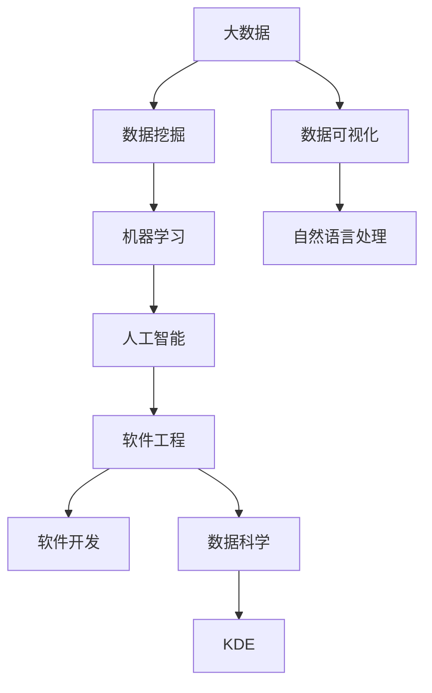

                 

# 知识发现引擎如何改变程序员的工作模式

> 关键词：知识发现引擎, 大数据, 数据挖掘, 数据可视化, 自然语言处理(NLP), 机器学习, 人工智能(AI), 软件工程, 软件开发, 数据科学

## 1. 背景介绍

### 1.1 问题由来

在当今信息爆炸的时代，数据的重要性日益凸显。企业、政府、科研机构等组织积累的海量数据中蕴含着无尽的知识与洞察。然而，传统的数据处理和分析方式难以有效利用这些数据，造成了信息孤岛和知识浪费。这不仅阻碍了决策的科学化、智能化，也浪费了大量的计算资源和时间成本。

为了解决这一问题，知识发现引擎(Knowledge Discovery Engine, KDE)应运而生。KDE是一种先进的数据分析工具，通过智能算法和大数据技术，从海量数据中提取有价值的知识和洞见，助力企业和组织做出更加科学、精准的决策。本文将深入探讨KDE的原理与应用，并分析其如何改变程序员的工作模式。

### 1.2 问题核心关键点

KDE的核心在于其高度自动化和智能化的数据分析能力。通过先进的机器学习、数据挖掘和自然语言处理(NLP)技术，KDE能够自动识别数据中的关键模式、趋势和异常，为用户提供直观的可视化报表和洞察。其关键特点包括：

- 自动化数据处理：KDE可以自动清洗、筛选和转换数据，无需人工干预。
- 智能模式识别：利用机器学习算法自动识别数据中的模式和趋势。
- 知识可视化：将分析结果以图表、报告等形式直观呈现，便于理解和使用。
- 多领域应用：支持金融、医疗、电商、政府等多个行业的数据分析需求。

KDE的出现，显著提升了数据处理和分析的效率与准确性，让程序员能够更专注于业务逻辑和算法优化，从而大幅提升软件开发效率和工作质量。

## 2. 核心概念与联系

### 2.1 核心概念概述

为了更好地理解KDE的工作原理和应用场景，本节将介绍几个密切相关的核心概念：

- 大数据(Big Data)：指规模巨大、类型多样、增长迅速的数据集合。其典型的特征包括：Volume大、Velocity快、Variety多、Veracity高。
- 数据挖掘(Data Mining)：从大量数据中自动发现有用的模式、规律和知识的过程。常见的数据挖掘任务包括分类、聚类、关联规则等。
- 数据可视化(Data Visualization)：将数据通过图形、图表等形式直观呈现，便于理解和分析。数据可视化是大数据技术的重要组成部分，能够帮助决策者快速获取关键洞察。
- 自然语言处理(NLP)：研究如何让计算机理解和生成人类语言的技术。NLP在大数据处理、知识发现中发挥着重要作用。
- 机器学习(Machine Learning)：通过数据训练模型，使计算机自动进行预测、分类等任务。KDE的核心算法基于机器学习。
- 人工智能(AI)：旨在使计算机具备人类智能，包括学习、推理、感知等能力。KDE是一种典型的AI应用。
- 软件工程(Software Engineering)：研究软件系统的开发、测试、维护等过程。KDE的应用促进了软件开发的智能化和自动化。
- 软件开发(Software Development)：指从需求分析、设计、实现到测试、部署的全过程。KDE通过智能化数据分析，助力软件开发各个环节的优化。
- 数据科学(Data Science)：研究数据获取、处理、分析和建模的全流程，旨在从数据中提取有价值的信息和知识。KDE是大数据科学的重要工具之一。

这些核心概念之间的逻辑关系可以通过以下Mermaid流程图来展示：



这个流程图展示了大数据技术通过数据挖掘和机器学习，提取有价值的信息，再通过数据可视化、自然语言处理等技术，将知识转化为洞察，从而服务于软件工程和数据科学各个环节。

## 3. 核心算法原理 & 具体操作步骤
### 3.1 算法原理概述

KDE的算法原理基于数据挖掘和机器学习技术。其核心思想是通过数据预处理、特征提取、模型训练和结果可视化等步骤，自动从大量数据中发现有用的模式和知识。

- 数据预处理：清洗、筛选和转换数据，使其符合分析要求。
- 特征提取：自动选择和提取数据中的关键特征，以便进行模型训练。
- 模型训练：利用机器学习算法训练数据模型，自动识别数据中的模式和趋势。
- 结果可视化：将分析结果以图表、报告等形式呈现，帮助用户理解洞察。

KDE的算法流程可以概括为：

1. 数据预处理
2. 特征选择和提取
3. 模型训练
4. 结果可视化

### 3.2 算法步骤详解

KDE的具体操作步骤如下：

**Step 1: 数据预处理**
- 收集和整合各类数据源，确保数据质量和完整性。
- 进行数据清洗，去除噪声和异常值，确保数据质量。
- 数据转换，如归一化、标准化等，使之符合模型训练要求。

**Step 2: 特征选择和提取**
- 根据业务需求，自动选择和提取关键特征，如时间序列、分类特征、数值特征等。
- 使用PCA、LDA等降维技术，减少特征维度，提高模型效率。
- 进行特征工程，构造新的特征，如组合特征、交互特征等，提升模型性能。

**Step 3: 模型训练**
- 选择合适的机器学习算法，如回归、分类、聚类等，训练数据模型。
- 利用交叉验证、网格搜索等技术，调优模型参数，提升模型精度。
- 采用集成学习、模型融合等方法，提升模型鲁棒性和泛化能力。

**Step 4: 结果可视化**
- 将分析结果转换为图表、报表等形式，直观展示关键洞察。
- 利用BI工具如Tableau、Power BI等，实时监控和展示分析结果。
- 将分析结果转化为业务报告，支持决策和优化。

### 3.3 算法优缺点

KDE具有以下优点：
1. 自动化数据处理：自动清洗、筛选和转换数据，减少了人工干预，提高了效率。
2. 智能化分析：利用先进算法自动识别数据中的模式和趋势，提高了分析精度。
3. 可视化展现：通过直观的图表和报表，便于用户理解和应用分析结果。
4. 多领域适用：支持多个行业的数据分析需求，具有广泛的应用前景。

同时，KDE也存在一些局限性：
1. 数据质量要求高：对于数据质量差、缺失值多、噪声多的数据，KDE的性能可能受到影响。
2. 模型复杂度高：KDE涉及多领域的技术，模型复杂度高，对算力和资源要求较高。
3. 应用场景受限：对于一些特殊领域的数据分析需求，KDE可能无法直接应用。

尽管存在这些局限性，但KDE在大多数情况下依然表现出色，被广泛应用于各个行业的数据分析和决策支持。

### 3.4 算法应用领域

KDE在多个行业领域得到了广泛应用，具体包括：

- 金融：通过分析交易数据、市场趋势等，辅助金融决策，提升风险管理能力。
- 医疗：从电子病历、临床数据中提取关键洞察，支持临床决策和治疗优化。
- 电商：通过分析用户行为、交易数据等，优化商品推荐、价格策略，提升用户体验和销售额。
- 政府：从公共数据中提取社会经济、环境、安全等关键信息，支持政策制定和应急响应。
- 能源：分析能源消耗、供应链数据等，优化能源利用，提升能源管理效率。
- 制造业：通过分析生产数据、设备状态等，预测设备故障、优化生产流程。
- 农业：利用农业数据，分析气候变化、作物生长等，提升农业生产效率和产量。

## 4. 数学模型和公式 & 详细讲解 & 举例说明

### 4.1 数学模型构建

KDE的数学模型通常基于机器学习算法构建。以回归模型为例，其基本数学模型为：

$$
y = \theta_0 + \sum_{i=1}^n \theta_i x_i
$$

其中 $y$ 为输出值，$x_i$ 为输入特征，$\theta_0$ 为截距，$\theta_i$ 为特征权重。通过最小化均方误差等损失函数，求解 $\theta_0$ 和 $\theta_i$。

### 4.2 公式推导过程

以线性回归模型为例，其目标是最小化预测值与真实值之间的均方误差：

$$
L(y, \hat{y}) = \frac{1}{N} \sum_{i=1}^N (y_i - \hat{y}_i)^2
$$

其中 $y_i$ 为真实值，$\hat{y}_i$ 为预测值。通过梯度下降算法求解模型参数 $\theta_0, \theta_i$：

$$
\frac{\partial L}{\partial \theta_0} = -\frac{2}{N} \sum_{i=1}^N (y_i - \hat{y}_i)
$$

$$
\frac{\partial L}{\partial \theta_i} = -\frac{2}{N} \sum_{i=1}^N (x_{i,i}(y_i - \hat{y}_i))
$$

$$
\theta_j \leftarrow \theta_j - \eta \frac{\partial L}{\partial \theta_j}
$$

其中 $\eta$ 为学习率。

### 4.3 案例分析与讲解

假设某电商公司希望优化其用户推荐系统，可以使用KDE构建预测模型。首先收集用户浏览、点击、购买等行为数据，然后进行数据预处理和特征选择，得到一个包含用户行为特征和商品特征的矩阵 $X$ 和一个标签向量 $y$。接着，利用线性回归模型对 $X$ 和 $y$ 进行拟合，得到模型参数 $\theta$。最后，利用训练好的模型对新用户行为进行预测，生成推荐列表。

## 5. 项目实践：代码实例和详细解释说明

### 5.1 开发环境搭建

为了实现KDE的实际应用，我们需要搭建一个开发环境。以下是使用Python进行KDE开发的环境配置流程：

1. 安装Anaconda：从官网下载并安装Anaconda，用于创建独立的Python环境。

2. 创建并激活虚拟环境：
```bash
conda create -n kde-env python=3.8 
conda activate kde-env
```

3. 安装必要的库：
```bash
conda install numpy pandas scikit-learn matplotlib seaborn jupyter notebook ipython
```

完成上述步骤后，即可在`kde-env`环境中开始KDE项目的开发。

### 5.2 源代码详细实现

以下是一个使用Python进行KDE的线性回归模型实现的示例代码：

```python
import pandas as pd
import numpy as np
import matplotlib.pyplot as plt
from sklearn.linear_model import LinearRegression
from sklearn.model_selection import train_test_split
from sklearn.metrics import mean_squared_error

# 加载数据
data = pd.read_csv('data.csv')
X = data.drop(['label'], axis=1)
y = data['label']

# 分割数据集
X_train, X_test, y_train, y_test = train_test_split(X, y, test_size=0.2, random_state=42)

# 训练模型
model = LinearRegression()
model.fit(X_train, y_train)

# 预测并评估模型
y_pred = model.predict(X_test)
mse = mean_squared_error(y_test, y_pred)
print('均方误差:', mse)

# 可视化结果
plt.scatter(y_test, y_pred)
plt.xlabel('真实值')
plt.ylabel('预测值')
plt.show()
```

### 5.3 代码解读与分析

让我们再详细解读一下关键代码的实现细节：

- **数据加载**：使用Pandas加载CSV格式的数据文件，将其转换为Pandas DataFrame。
- **数据分割**：将数据集分割为训练集和测试集，使用`train_test_split`函数，保持20%的数据作为测试集。
- **模型训练**：使用Scikit-learn库的`LinearRegression`类训练线性回归模型，调用`fit`方法拟合数据。
- **模型评估**：使用均方误差作为评估指标，计算模型预测值与真实值之间的误差。
- **结果可视化**：使用Matplotlib库绘制散点图，直观展示模型预测结果与真实值之间的差异。

## 6. 实际应用场景

### 6.1 智能推荐系统

KDE在智能推荐系统中的应用非常广泛。通过分析用户行为和商品属性，KDE可以预测用户对不同商品的兴趣，从而实现个性化推荐。

在实际应用中，可以将用户历史行为数据、商品属性、标签等信息作为输入，使用KDE训练推荐模型。模型能够自动提取关键特征，识别用户偏好，生成个性化的推荐列表。对于新用户或新商品，模型能够根据其特征进行预测，生成合适的推荐结果。

### 6.2 风险管理

金融行业对风险管理的需求日益增长。KDE可以从交易数据中提取关键洞察，识别风险因素，辅助决策制定。

具体而言，可以收集金融市场的历史交易数据，使用KDE识别市场趋势和波动。例如，通过回归模型预测股票价格，评估市场风险，提前采取防范措施。对于贷款申请等高风险业务，KDE可以识别申请人的信用风险，降低坏账率。

### 6.3 智能客服

智能客服系统通过自然语言处理(NLP)技术与用户进行交互，并提供自动化解决方案。KDE可以通过分析用户问题，自动匹配最合适的回答，提升客户体验。

在实际应用中，可以收集历史客服对话记录，使用KDE训练模型。模型能够自动理解用户意图，匹配最合适的回答模板，生成自然流畅的响应。对于新用户或新问题，模型能够根据其特征进行预测，生成合适的回答。

## 7. 工具和资源推荐

### 7.1 学习资源推荐

为了帮助开发者系统掌握KDE的理论基础和实践技巧，这里推荐一些优质的学习资源：

1. 《机器学习实战》系列博文：由KDE技术专家撰写，深入浅出地介绍了机器学习的基本原理和应用案例。
2. KDE官方文档：KDE的官方文档，提供了完整的算法介绍和样例代码，是上手实践的必备资料。
3. CS229《机器学习》课程：斯坦福大学开设的机器学习明星课程，有Lecture视频和配套作业，带你入门KDE领域的基本概念和经典模型。
4. Kaggle KDE竞赛：Kaggle举办的KDE竞赛，提供海量真实数据和优秀案例，助力KDE技能提升。

通过对这些资源的学习实践，相信你一定能够快速掌握KDE的精髓，并用于解决实际的NLP问题。

### 7.2 开发工具推荐

高效的开发离不开优秀的工具支持。以下是几款用于KDE开发的常用工具：

1. Python：KDE的核心语言，灵活、强大、生态丰富，适合快速迭代研究。
2. R：KDE的另一主流语言，具有丰富的统计分析和可视化工具，特别适合数据科学领域。
3. Scikit-learn：基于Python的机器学习库，提供了丰富的算法和工具，是KDE开发的基础。
4. TensorFlow：由Google主导开发的深度学习框架，可以与KDE深度集成，实现更复杂的模型和应用。
5. PyTorch：基于Python的深度学习框架，灵活高效，支持GPU加速，适合复杂计算任务。
6. Jupyter Notebook：用于编写和执行Python脚本的交互式工具，方便代码调试和展示。
7. Tableau：强大的数据可视化工具，支持实时监控和报告，非常适合KDE的可视化应用。

合理利用这些工具，可以显著提升KDE的开发效率，加快创新迭代的步伐。

### 7.3 相关论文推荐

KDE的研究源于学界的持续探索。以下是几篇奠基性的相关论文，推荐阅读：

1. R. O. Duda, P. E. Hart, D. G. Stork. Pattern Recognition and Machine Learning (3rd Edition)。这本书全面介绍了机器学习的基本理论和算法，是KDE研究的基础。
2. T. Hastie, R. Tibshirani, J. Friedman. The Elements of Statistical Learning: Data Mining, Inference, and Prediction (2nd Edition)。这本书深入浅出地介绍了统计学习和数据挖掘的基本方法，适合初学者阅读。
3. J. Friedman, T. Hastie, R. Tibshirani. Statistical Learning with Sparsity: The Lasso and Generalizations (With Discussion). Annals of Statistics, 1998。这篇论文是Lasso算法的奠基之作，对KDE模型训练具有重要参考价值。
4. C. B. Chang, C. J. Lin. LIBSVM: A Library for Support Vector Machines. Journal of Machine Learning Research, 2001。这篇论文介绍了支持向量机(SVM)算法，是KDE模型的常用算法之一。
5. A. Ng, M. Jordan, Y. Weiss. Machine Learning: A Probabilistic Perspective. MIT Press, 2011。这本书详细介绍了机器学习的基本理论和算法，是KDE研究的重要参考。

这些论文代表了大数据技术的发展脉络，通过学习这些前沿成果，可以帮助研究者把握学科前进方向，激发更多的创新灵感。

## 8. 总结：未来发展趋势与挑战

### 8.1 总结

本文对KDE的原理与应用进行了全面系统的介绍。首先阐述了KDE在数据处理和分析中的重要作用，明确了KDE在提升数据处理效率和决策支持能力方面的独特价值。其次，从原理到实践，详细讲解了KDE的数学模型和操作步骤，给出了KDE任务开发的完整代码实例。同时，本文还探讨了KDE在多个行业领域的应用场景，展示了KDE范式的广泛应用前景。最后，本文精选了KDE学习的各类资源，力求为读者提供全方位的技术指引。

通过本文的系统梳理，可以看到，KDE作为先进的数据分析工具，已经在各个行业领域广泛应用，显著提升了数据处理和决策的效率和质量。未来，伴随KDE技术的不断演进，其应用范围将进一步拓展，成为各个领域智能化发展的强大引擎。

### 8.2 未来发展趋势

展望未来，KDE技术将呈现以下几个发展趋势：

1. 自动化程度提升：随着AI技术的不断进步，KDE将更加智能化和自动化，能够自动从数据中提取更深入、更全面的洞察。
2. 多领域应用扩展：KDE将在更多领域得到广泛应用，如医疗、金融、教育等，推动各行业的智能化发展。
3. 数据质量优化：KDE将更加注重数据清洗和质量提升，确保分析结果的准确性和可靠性。
4. 模型复杂度降低：KDE将更加注重模型简化和高效化，提高模型的可解释性和鲁棒性。
5. 数据可视化升级：KDE将提供更加智能和交互式的数据可视化工具，帮助用户更直观地理解洞察。

这些趋势凸显了KDE技术的广阔前景，必将为各行各业的数据分析和决策支持带来新的突破。

### 8.3 面临的挑战

尽管KDE技术已经取得了瞩目成就，但在迈向更加智能化、普适化应用的过程中，它仍面临一些挑战：

1. 数据质量问题：数据质量差、缺失值多、噪声多的情况，可能影响KDE的性能。
2. 模型复杂度高：KDE涉及多领域的技术，模型复杂度高，对算力和资源要求较高。
3. 应用场景受限：对于一些特殊领域的数据分析需求，KDE可能无法直接应用。
4. 可解释性不足：KDE的模型往往复杂，难以解释其内部工作机制和决策逻辑。
5. 安全性问题：KDE的分析结果可能受到数据偏见和算法的干扰，影响决策的公正性和安全性。
6. 数据隐私保护：KDE的分析过程中，可能涉及敏感数据的处理，如何保护用户隐私和数据安全是一个重要问题。

尽管存在这些挑战，但通过不断优化算法、提高数据质量、增强可解释性等措施，KDE必将克服这些难题，继续推动各行业的智能化发展。

### 8.4 研究展望

未来，KDE技术需要在以下几个方面进行深入研究：

1. 自动化数据处理：进一步提升数据清洗和转换的自动化程度，减少人工干预。
2. 模型简化与优化：开发更加简单高效的模型，降低计算成本，提高模型效率。
3. 多领域应用研究：探索KDE在更多领域的应用，推动各行业的智能化发展。
4. 可解释性和透明度：增强KDE的模型可解释性，使其更容易被理解和接受。
5. 安全性与隐私保护：加强KDE分析过程的安全性和隐私保护，确保数据和算法的公正性。
6. 跨领域数据融合：探索KDE与其他AI技术的融合，实现多模态数据的协同分析。

这些研究方向将推动KDE技术向更深层次、更广领域发展，为各行业的智能化决策提供更加有力支持。总之，KDE技术将继续发挥其独特优势，成为数据驱动智能化的重要引擎。

## 9. 附录：常见问题与解答

**Q1: KDE在大数据处理中的应用场景有哪些？**

A: KDE在大数据处理中的应用场景非常广泛，具体包括：
1. 金融风险管理：从交易数据中提取关键洞察，辅助决策制定。
2. 电商推荐系统：分析用户行为和商品属性，生成个性化推荐列表。
3. 智能客服系统：通过自然语言处理(NLP)技术与用户进行交互，提升客户体验。
4. 医疗数据分析：从电子病历、临床数据中提取关键洞察，支持临床决策和治疗优化。
5. 政府数据治理：从公共数据中提取社会经济、环境、安全等关键信息，支持政策制定和应急响应。

**Q2: KDE的核心算法是什么？**

A: KDE的核心算法基于机器学习，主要包括回归、分类、聚类等。以回归模型为例，其基本数学模型为：
$$
y = \theta_0 + \sum_{i=1}^n \theta_i x_i
$$
其中 $y$ 为输出值，$x_i$ 为输入特征，$\theta_0$ 为截距，$\theta_i$ 为特征权重。通过最小化均方误差等损失函数，求解 $\theta_0$ 和 $\theta_i$。

**Q3: KDE在软件开发中的应用有哪些？**

A: KDE在软件开发中的应用主要体现在以下几个方面：
1. 自动化数据处理：自动清洗、筛选和转换数据，减少人工干预。
2. 智能化分析：利用先进算法自动识别数据中的模式和趋势，提高分析精度。
3. 可视化展现：通过直观的图表和报表，帮助用户理解和应用分析结果。
4. 多领域应用：支持多个行业的数据分析需求，具有广泛的应用前景。

**Q4: KDE如何提高数据处理和分析的效率？**

A: KDE通过自动化数据处理、智能模式识别和可视化展现等手段，显著提高了数据处理和分析的效率。具体来说，KDE可以自动清洗、筛选和转换数据，减少人工干预，提高处理效率。通过智能算法自动识别数据中的模式和趋势，提高了分析精度。通过可视化工具将分析结果直观呈现，便于用户理解和应用，提高了决策效率。

**Q5: KDE在实际应用中需要注意哪些问题？**

A: KDE在实际应用中需要注意以下几个问题：
1. 数据质量问题：数据质量差、缺失值多、噪声多的情况，可能影响KDE的性能。
2. 模型复杂度高：KDE涉及多领域的技术，模型复杂度高，对算力和资源要求较高。
3. 应用场景受限：对于一些特殊领域的数据分析需求，KDE可能无法直接应用。
4. 可解释性不足：KDE的模型往往复杂，难以解释其内部工作机制和决策逻辑。
5. 安全性问题：KDE的分析结果可能受到数据偏见和算法的干扰，影响决策的公正性和安全性。
6. 数据隐私保护：KDE的分析过程中，可能涉及敏感数据的处理，如何保护用户隐私和数据安全是一个重要问题。

**Q6: KDE的未来发展方向是什么？**

A: KDE的未来发展方向主要包括以下几个方面：
1. 自动化数据处理：进一步提升数据清洗和转换的自动化程度，减少人工干预。
2. 模型简化与优化：开发更加简单高效的模型，降低计算成本，提高模型效率。
3. 多领域应用研究：探索KDE在更多领域的应用，推动各行业的智能化发展。
4. 可解释性和透明度：增强KDE的模型可解释性，使其更容易被理解和接受。
5. 安全性与隐私保护：加强KDE分析过程的安全性和隐私保护，确保数据和算法的公正性。
6. 跨领域数据融合：探索KDE与其他AI技术的融合，实现多模态数据的协同分析。

这些研究方向将推动KDE技术向更深层次、更广领域发展，为各行业的智能化决策提供更加有力支持。

---

作者：禅与计算机程序设计艺术 / Zen and the Art of Computer Programming

