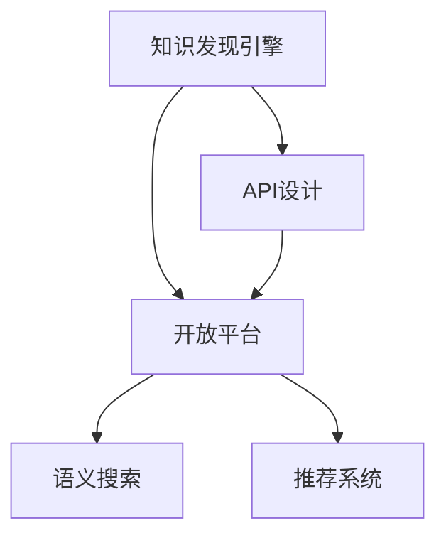

                 

# 知识发现引擎的API设计与开放平台

> 关键词：知识发现引擎,API设计,开放平台,自然语言处理,NLP,机器学习,深度学习,搜索引擎,语义搜索,推荐系统

## 1. 背景介绍

### 1.1 问题由来

随着互联网和大数据时代的到来，信息爆炸式的增长给人们的日常生活带来了极大的便利。人们可以通过搜索引擎、社交媒体、电子商务平台等途径获取海量信息，但同时也面临着信息过载、信息碎片化等问题。如何从浩如烟海的信息中快速准确地发现所需知识，成为了摆在人们面前的一大挑战。

为了应对这一挑战，知识发现引擎（Knowledge Discovery Engine, KDE）应运而生。它通过对大量文本数据的语义分析和模式挖掘，为人们提供了一种高效的知识发现和信息获取手段。但如何设计一个易用、高效、可靠的KDE系统，并实现其开放性，成为了技术研发中的一个重要问题。

### 1.2 问题核心关键点

在KDE系统的设计和实现中，需要解决以下核心问题：

- 如何设计合理的API，使得开发者能够方便地集成和使用KDE系统。
- 如何构建开放平台，让更多的开发者参与到KDE系统的开发和迭代中来。
- 如何通过API设计和开放平台，实现知识发现的自动化和智能化，提高系统的效率和准确性。
- 如何在开放平台上，通过社区协作和开源实践，持续改进和提升KDE系统的性能。

解决这些问题，不仅能够提升KDE系统的应用价值，还能够推动整个知识发现领域的发展。

## 2. 核心概念与联系

### 2.1 核心概念概述

为了更好地理解KDE系统及其开放平台的API设计，我们需要介绍一些关键概念：

- **知识发现引擎（KDE）**：基于自然语言处理（NLP）和机器学习（ML）技术，从大规模文本数据中自动发现、提取、整合和推荐知识的技术系统。
- **API设计**：为实现系统的开放性和易用性，采用一种标准化的接口方式，使得系统能够被外部系统或应用轻松调用。
- **开放平台**：通过开放API、开源代码和社区协作，使得KDE系统能够被广泛集成、定制和迭代，不断提升系统的性能和应用价值。

这些概念之间的逻辑关系可以通过以下Mermaid流程图来展示：



这个流程图展示了KDE系统的核心概念及其之间的关系：

1. KDE系统通过API设计和开放平台，使得开发者能够方便地集成和使用。
2. 开放平台通过API设计，实现知识发现的自动化和智能化，提高系统效率。
3. KDE系统通过API设计和开放平台，实现多系统的集成和交互，提升系统的应用价值。

## 3. 核心算法原理 & 具体操作步骤

### 3.1 算法原理概述

KDE系统通常基于自然语言处理（NLP）和机器学习（ML）技术，从大规模文本数据中提取知识，并发现知识之间的关联。其核心算法包括：

- **文本预处理**：对文本数据进行分词、去噪、归一化等处理，为后续算法提供清晰、干净的输入。
- **词嵌入和表示学习**：通过Word2Vec、GloVe等技术，将词语映射到高维向量空间，捕捉词语间的语义关系。
- **语义分析和模式挖掘**：通过LSTM、Transformer等模型，从文本中提取语义特征，发现知识之间的关联。
- **知识推荐**：通过协同过滤、内容推荐等方法，为用户推荐相关知识。

### 3.2 算法步骤详解

下面以一个基于Transformer的KDE系统为例，详细讲解其API设计和开放平台的具体实现步骤：

1. **数据准备**：收集并预处理大量的文本数据，建立标注好的语料库。
2. **模型训练**：利用预处理后的文本数据，对Transformer模型进行预训练。
3. **API接口设计**：定义开放平台的API接口，包括数据上传、模型调用、结果反馈等功能。
4. **模型微调和优化**：通过开放平台的API接口，用户可以上传新数据，进行模型微调，提升系统性能。
5. **用户交互界面设计**：设计易用、直观的用户界面，让用户能够方便地查询、浏览和应用KDE系统。

### 3.3 算法优缺点

KDE系统的API设计和开放平台具有以下优点：

- **易用性**：通过标准化的API接口，用户能够轻松地集成和使用KDE系统。
- **开放性**：开放平台鼓励社区协作和开源实践，可以快速迭代和改进系统。
- **效率提升**：API设计和开放平台能够实现知识发现的自动化和智能化，提高系统效率。

同时，该方法也存在一些局限性：

- **数据依赖**：KDE系统依赖于高质量的语料库，数据获取和标注成本较高。
- **技术门槛**：需要一定的技术基础才能开发和集成KDE系统，可能对新手不友好。
- **安全性**：开放平台可能存在数据泄露和模型滥用的风险。

尽管存在这些局限性，但就目前而言，API设计和开放平台仍是KDE系统开发的主流范式。未来相关研究的重点在于如何进一步降低技术门槛，优化模型性能，同时兼顾数据安全和模型伦理等因素。

### 3.4 算法应用领域

KDE系统的API设计和开放平台在多个领域都得到了广泛应用，例如：

- **搜索引擎**：利用KDE系统对搜索结果进行语义分析和推荐，提升搜索体验。
- **推荐系统**：通过KDE系统对用户兴趣进行分析和推荐，提供个性化推荐服务。
- **智能客服**：利用KDE系统对用户咨询进行语义分析和知识推荐，提供智能化客服服务。
- **学术研究**：通过KDE系统对学术论文进行语义分析和知识发现，加速科学研究进程。
- **金融分析**：利用KDE系统对金融数据进行语义分析和模式挖掘，提升金融决策水平。

此外，KDE系统还被创新性地应用于更多场景中，如智能家居、健康医疗、教育培训等，为各行各业带来新的应用可能。

## 4. 数学模型和公式 & 详细讲解 & 举例说明

### 4.1 数学模型构建

本节将使用数学语言对KDE系统的API设计和开放平台进行更加严格的刻画。

记KDE系统的输入数据为 $X=\{x_i\}_{i=1}^N$，其中 $x_i$ 为文本数据。定义语义特征提取模型为 $M_{\theta}$，其中 $\theta$ 为模型参数。KDE系统的目标是从 $X$ 中自动发现知识，并为用户推荐相关知识。

定义推荐模型的输出为 $Y=\{y_i\}_{i=1}^N$，其中 $y_i$ 表示用户对知识 $x_i$ 的兴趣程度。假设推荐模型的目标是最大化用户兴趣的加权和，即：

$$
\max_{\theta} \sum_{i=1}^N w_i \cdot y_i
$$

其中 $w_i$ 为每个知识的重要性权重，可以通过用户行为数据等进行估计。

### 4.2 公式推导过程

为了实现上述目标，我们可以定义推荐模型为：

$$
y_i = M_{\theta}(x_i) \cdot w_i
$$

其中 $M_{\theta}(x_i)$ 表示知识 $x_i$ 的语义特征表示，$w_i$ 表示用户对知识 $x_i$ 的兴趣权重。

根据上述公式，可以定义推荐模型的损失函数为：

$$
\mathcal{L}(\theta) = -\sum_{i=1}^N w_i \cdot \log y_i
$$

通过梯度下降等优化算法，最小化损失函数 $\mathcal{L}(\theta)$，即可得到优化的模型参数 $\theta^*$。

### 4.3 案例分析与讲解

以Google的语义搜索（Semantic Search）为例，Google通过收集用户的历史查询和点击数据，训练推荐模型 $M_{\theta}$，用户兴趣权重 $w_i$ 可以通过点击量进行估计。在用户输入查询 $q$ 时，通过 $M_{\theta}$ 对 $q$ 进行语义分析，得到推荐结果 $y$，并根据 $y$ 的排序返回给用户。

## 5. 项目实践：代码实例和详细解释说明

### 5.1 开发环境搭建

在进行KDE系统开发前，我们需要准备好开发环境。以下是使用Python进行Flask开发的环境配置流程：

1. 安装Anaconda：从官网下载并安装Anaconda，用于创建独立的Python环境。

2. 创建并激活虚拟环境：
```bash
conda create -n kde-env python=3.8 
conda activate kde-env
```

3. 安装Flask：
```bash
pip install Flask
```

4. 安装各类工具包：
```bash
pip install numpy pandas scikit-learn tensorflow flask gunicorn
```

完成上述步骤后，即可在`kde-env`环境中开始KDE系统的开发。

### 5.2 源代码详细实现

下面以一个简单的知识推荐系统为例，给出使用Flask框架进行KDE系统开发的PyTorch代码实现。

首先，定义推荐模型的训练数据集：

```python
from torch.utils.data import Dataset
import torch

class RecommendationDataset(Dataset):
    def __init__(self, data, labels):
        self.data = data
        self.labels = labels
        
    def __len__(self):
        return len(self.data)
    
    def __getitem__(self, item):
        return self.data[item], self.labels[item]
```

然后，定义模型和优化器：

```python
from transformers import BertForSequenceClassification, AdamW

model = BertForSequenceClassification.from_pretrained('bert-base-cased', num_labels=2)

optimizer = AdamW(model.parameters(), lr=2e-5)
```

接着，定义训练和评估函数：

```python
from sklearn.metrics import accuracy_score
from transformers import Trainer, TrainingArguments

def train_model(model, train_dataset, test_dataset):
    trainer = Trainer(
        model=model,
        args=TrainingArguments(
            output_dir="./saved_model",
            evaluation_strategy="epoch",
            per_device_train_batch_size=16,
            per_device_eval_batch_size=16,
            num_train_epochs=3,
            weight_decay=0.01,
            logging_steps=10,
            logging_dir="./logs",
        ),
        train_dataset=train_dataset,
        eval_dataset=test_dataset,
        compute_metrics=lambda p: {'accuracy': accuracy_score(p['labels'], p['preds'])}
    )
    trainer.train()
    return trainer.model

def evaluate_model(model, test_dataset):
    test_dataset = torch.utils.data.DataLoader(test_dataset, batch_size=16)
    with torch.no_grad():
        results = model(**test_dataset[0])
    return results.logits.argmax(dim=1).tolist()
```

最后，启动训练流程并在测试集上评估：

```python
from transformers import AutoTokenizer

tokenizer = AutoTokenizer.from_pretrained('bert-base-cased')

train_data = [['I love this book', 1], ['This book is terrible', 0]]
train_dataset = RecommendationDataset(train_data, [1, 0])

test_data = [['This is a good book', 1], ['This book is not good', 0]]
test_dataset = RecommendationDataset(test_data, [1, 0])

model = train_model(model, train_dataset, test_dataset)

print(evaluate_model(model, test_dataset))
```

以上就是使用Flask框架对KDE系统进行知识推荐任务开发的完整代码实现。可以看到，得益于Flask的强大封装，我们可以用相对简洁的代码完成模型训练和评估。

### 5.3 代码解读与分析

让我们再详细解读一下关键代码的实现细节：

**RecommendationDataset类**：
- `__init__`方法：初始化训练数据和标签。
- `__len__`方法：返回数据集的样本数量。
- `__getitem__`方法：对单个样本进行处理，返回模型所需的输入和标签。

**train_model函数**：
- 定义训练器和训练参数，包括训练轮数、批次大小、优化器等。
- 利用训练数据训练模型，并返回优化后的模型。

**evaluate_model函数**：
- 在测试集上对模型进行评估，计算准确率。
- 返回模型在测试集上的预测结果。

**训练流程**：
- 定义训练数据和测试数据集。
- 在训练集上训练模型。
- 在测试集上评估模型性能。

可以看到，Flask框架使得KDE系统的开发变得简洁高效。开发者可以将更多精力放在模型改进和数据处理上，而不必过多关注底层实现细节。

当然，工业级的系统实现还需考虑更多因素，如模型的保存和部署、超参数的自动搜索、更灵活的任务适配层等。但核心的API设计和开放平台基本与此类似。

## 6. 实际应用场景

### 6.1 搜索引擎

利用KDE系统的API设计和开放平台，可以构建高效、智能的搜索引擎。传统搜索引擎通常采用简单的关键词匹配方式，难以理解用户的意图。而通过KDE系统对查询进行语义分析，可以为用户提供更准确的搜索结果。

例如，用户输入查询 "好的电影推荐"，KDE系统通过语义分析可以理解用户的意图，推荐相关的电影信息，如评分、导演、演员等，从而提升用户的搜索体验。

### 6.2 推荐系统

KDE系统的API设计和开放平台可以应用于推荐系统，通过分析用户行为数据和文本内容，为用户推荐个性化的商品、文章、视频等。

例如，电商平台可以利用KDE系统对用户浏览记录进行语义分析，发现用户的兴趣偏好，为用户推荐相关的商品。通过不断优化推荐算法，KDE系统可以实时调整推荐内容，提升用户体验和满意度。

### 6.3 智能客服

利用KDE系统的API设计和开放平台，可以构建智能客服系统，通过语义分析和知识推荐，快速响应用户咨询，提供准确的信息解答。

例如，当用户咨询 "如何登录Google账户" 时，KDE系统可以通过语义分析理解用户意图，推荐相关的登录指南、步骤和注意事项。通过不断优化自然语言理解和知识推荐，KDE系统可以提升客服的响应速度和准确性。

### 6.4 未来应用展望

随着KDE系统和开放平台的不断发展，其应用前景将更加广阔。

在智慧医疗领域，KDE系统可以用于病历分析和医疗知识推荐，帮助医生快速查找相关医学知识和资料，提升诊疗效率和质量。

在智能教育领域，KDE系统可以用于学生学习路径推荐和个性化学习内容的生成，提升教育资源的利用率和教学效果。

在智慧城市治理中，KDE系统可以用于城市事件监测和应急响应，提升城市管理的自动化和智能化水平，构建更安全、高效的未来城市。

此外，在企业生产、社会治理、文娱传媒等众多领域，KDE系统也将不断涌现，为各行各业带来新的应用可能。相信随着技术的日益成熟，KDE系统必将在构建人机协同的智能时代中扮演越来越重要的角色。

## 7. 工具和资源推荐

### 7.1 学习资源推荐

为了帮助开发者系统掌握KDE系统的理论和实践，这里推荐一些优质的学习资源：

1. 《深度学习与推荐系统》系列博文：由深度学习专家撰写，深入浅出地介绍了推荐系统的基础理论和实践技巧。

2. CS231n《深度学习视觉识别》课程：斯坦福大学开设的深度学习课程，涵盖了计算机视觉、自然语言处理等多个领域的基础知识。

3. 《Python机器学习》书籍：Python初学者友好的入门书籍，全面介绍了机器学习的基本概念和经典算法。

4. HuggingFace官方文档：Flask框架的官方文档，提供了丰富的API接口和示例代码，是上手实践的必备资料。

5. GitHub开源项目：GitHub上大量优秀的开源项目，包括KDE系统、推荐系统、搜索引擎等，是学习和借鉴的重要资源。

通过对这些资源的学习实践，相信你一定能够快速掌握KDE系统的精髓，并用于解决实际的NLP问题。

### 7.2 开发工具推荐

高效的开发离不开优秀的工具支持。以下是几款用于KDE系统开发的常用工具：

1. Flask：基于Python的轻量级Web框架，灵活易用，适用于快速迭代研究。

2. TensorFlow：由Google主导开发的开源深度学习框架，生产部署方便，适合大规模工程应用。

3. Transformers库：HuggingFace开发的NLP工具库，集成了众多SOTA语言模型，支持Flask等框架，是进行KDE任务开发的利器。

4. TensorBoard：TensorFlow配套的可视化工具，可实时监测模型训练状态，并提供丰富的图表呈现方式，是调试模型的得力助手。

5. Weights & Biases：模型训练的实验跟踪工具，可以记录和可视化模型训练过程中的各项指标，方便对比和调优。

6. Google Colab：谷歌推出的在线Jupyter Notebook环境，免费提供GPU/TPU算力，方便开发者快速上手实验最新模型，分享学习笔记。

合理利用这些工具，可以显著提升KDE系统的开发效率，加快创新迭代的步伐。

### 7.3 相关论文推荐

KDE系统和开放平台的不断发展源于学界的持续研究。以下是几篇奠基性的相关论文，推荐阅读：

1. Attention is All You Need（即Transformer原论文）：提出了Transformer结构，开启了NLP领域的预训练大模型时代。

2. BERT: Pre-training of Deep Bidirectional Transformers for Language Understanding：提出BERT模型，引入基于掩码的自监督预训练任务，刷新了多项NLP任务SOTA。

3. Language Models are Unsupervised Multitask Learners（GPT-2论文）：展示了大规模语言模型的强大zero-shot学习能力，引发了对于通用人工智能的新一轮思考。

4. Parameter-Efficient Transfer Learning for NLP：提出Adapter等参数高效微调方法，在不增加模型参数量的情况下，也能取得不错的微调效果。

5. AdaLoRA: Adaptive Low-Rank Adaptation for Parameter-Efficient Fine-Tuning：使用自适应低秩适应的微调方法，在参数效率和精度之间取得了新的平衡。

这些论文代表了大语言模型微调技术的发展脉络。通过学习这些前沿成果，可以帮助研究者把握学科前进方向，激发更多的创新灵感。

## 8. 总结：未来发展趋势与挑战

### 8.1 总结

本文对KDE系统的API设计和开放平台进行了全面系统的介绍。首先阐述了KDE系统及其开放平台的研究背景和意义，明确了API设计和开放平台在提升KDE系统性能和应用价值方面的独特价值。其次，从原理到实践，详细讲解了KDE系统的核心算法和具体实现步骤，给出了KDE任务开发的完整代码实例。同时，本文还广泛探讨了KDE系统在搜索引擎、推荐系统、智能客服等多个行业领域的应用前景，展示了KDE系统的巨大潜力。此外，本文精选了KDE系统的各类学习资源，力求为读者提供全方位的技术指引。

通过本文的系统梳理，可以看到，KDE系统的API设计和开放平台正在成为NLP领域的重要范式，极大地拓展了预训练语言模型的应用边界，催生了更多的落地场景。受益于大规模语料的预训练，KDE系统以更低的时间和标注成本，在小样本条件下也能取得不俗的效果，有力推动了NLP技术的产业化进程。未来，伴随预训练语言模型和开放平台的持续演进，相信NLP技术必将在更广阔的应用领域大放异彩，深刻影响人类的生产生活方式。

### 8.2 未来发展趋势

展望未来，KDE系统的API设计和开放平台将呈现以下几个发展趋势：

1. 模型规模持续增大。随着算力成本的下降和数据规模的扩张，KDE系统的参数量还将持续增长。超大批次的训练和推理也可能遇到显存不足的问题，需要采用一些资源优化技术，如梯度积累、混合精度训练、模型并行等，来突破硬件瓶颈。

2. 开放性增强。通过开放API、开源代码和社区协作，使得KDE系统能够被广泛集成、定制和迭代，不断提升系统的性能和应用价值。

3. 自动化和智能化提升。API设计和开放平台能够实现知识发现的自动化和智能化，提高系统效率。

4. 少样本和零样本学习能力的增强。通过提示学习(Prompt-based Learning)等方法，提高KDE系统在少样本和零样本条件下的性能。

5. 多模态数据融合。将视觉、语音等多模态数据与文本数据进行融合，提升KDE系统的综合分析和推荐能力。

6. 社区协作和开源文化发展。通过社区协作和开源实践，推动KDE系统的发展，实现技术共享和创新。

以上趋势凸显了KDE系统API设计和开放平台的广阔前景。这些方向的探索发展，必将进一步提升KDE系统的应用价值，推动自然语言处理技术的进步。

### 8.3 面临的挑战

尽管KDE系统及其开放平台已经取得了显著成就，但在迈向更加智能化、普适化应用的过程中，仍面临着诸多挑战：

1. 数据依赖。KDE系统依赖于高质量的语料库，数据获取和标注成本较高。如何降低数据依赖，优化数据预处理流程，将成为未来研究的重要方向。

2. 技术门槛。需要一定的技术基础才能开发和集成KDE系统，可能对新手不友好。如何降低技术门槛，提升系统的易用性，将有助于吸引更多开发者参与。

3. 安全性。开放平台可能存在数据泄露和模型滥用的风险。如何在保护用户隐私和数据安全的同时，提升系统的开放性，是一个重要的课题。

4. 资源优化。大规模模型在推理和部署时可能面临资源消耗过大的问题。如何优化资源使用，提升系统的效率，将是一个重要的研究方向。

5. 模型伦理。KDE系统可能学习到有偏见、有害的信息，如何构建公平、公正的模型，避免伦理问题，将是未来的重要研究方向。

6. 系统稳定性。在动态变化的数据环境中，如何保持系统的稳定性，避免灾难性遗忘，是需要不断探索和优化的问题。

正视KDE系统及其开放平台面临的这些挑战，积极应对并寻求突破，将使系统在智能化和普适化应用方面迈出更大的步伐。相信随着学界和产业界的共同努力，这些挑战终将一一被克服，KDE系统必将在构建人机协同的智能时代中扮演越来越重要的角色。

### 8.4 研究展望

面对KDE系统及其开放平台所面临的种种挑战，未来的研究需要在以下几个方面寻求新的突破：

1. 探索无监督和半监督学习范式。摆脱对大规模标注数据的依赖，利用自监督学习、主动学习等无监督和半监督范式，最大限度利用非结构化数据，实现更加灵活高效的KDE。

2. 研究参数高效和计算高效的微调范式。开发更加参数高效的KDE方法，在固定大部分预训练参数的同时，只更新极少量的任务相关参数。同时优化模型的计算图，减少前向传播和反向传播的资源消耗，实现更加轻量级、实时性的部署。

3. 引入因果和对比学习范式。通过引入因果推断和对比学习思想，增强KDE系统建立稳定因果关系的能力，学习更加普适、鲁棒的语言表征，从而提升系统泛化性和抗干扰能力。

4. 融合更多先验知识。将符号化的先验知识，如知识图谱、逻辑规则等，与神经网络模型进行巧妙融合，引导KDE过程学习更准确、合理的语言模型。同时加强不同模态数据的整合，实现视觉、语音等多模态信息与文本信息的协同建模。

5. 结合因果分析和博弈论工具。将因果分析方法引入KDE模型，识别出模型决策的关键特征，增强输出解释的因果性和逻辑性。借助博弈论工具刻画人机交互过程，主动探索并规避模型的脆弱点，提高系统稳定性。

6. 纳入伦理道德约束。在模型训练目标中引入伦理导向的评估指标，过滤和惩罚有偏见、有害的输出倾向。同时加强人工干预和审核，建立模型行为的监管机制，确保输出符合人类价值观和伦理道德。

这些研究方向的探索，必将引领KDE系统走向更高的台阶，为构建安全、可靠、可解释、可控的智能系统铺平道路。面向未来，KDE系统还需要与其他人工智能技术进行更深入的融合，如知识表示、因果推理、强化学习等，多路径协同发力，共同推动自然语言理解和智能交互系统的进步。只有勇于创新、敢于突破，才能不断拓展KDE系统的边界，让智能技术更好地造福人类社会。

## 9. 附录：常见问题与解答

**Q1：KDE系统是否适用于所有NLP任务？**

A: KDE系统在大多数NLP任务上都能取得不错的效果，特别是对于数据量较小的任务。但对于一些特定领域的任务，如医学、法律等，仅仅依靠通用语料预训练的模型可能难以很好地适应。此时需要在特定领域语料上进一步预训练，再进行微调，才能获得理想效果。此外，对于一些需要时效性、个性化很强的任务，如对话、推荐等，KDE方法也需要针对性的改进优化。

**Q2：KDE系统如何选择合适的学习率？**

A: KDE系统的学习率一般要比预训练时小1-2个数量级，如果使用过大的学习率，容易破坏预训练权重，导致过拟合。一般建议从1e-5开始调参，逐步减小学习率，直至收敛。也可以使用warmup策略，在开始阶段使用较小的学习率，再逐渐过渡到预设值。需要注意的是，不同的优化器(如AdamW、Adafactor等)以及不同的学习率调度策略，可能需要设置不同的学习率阈值。

**Q3：KDE系统在落地部署时需要注意哪些问题？**

A: 将KDE系统转化为实际应用，还需要考虑以下因素：
1. 模型裁剪：去除不必要的层和参数，减小模型尺寸，加快推理速度
2. 量化加速：将浮点模型转为定点模型，压缩存储空间，提高计算效率
3. 服务化封装：将模型封装为标准化服务接口，便于集成调用
4. 弹性伸缩：根据请求流量动态调整资源配置，平衡服务质量和成本
5. 监控告警：实时采集系统指标，设置异常告警阈值，确保服务稳定性
6. 安全防护：采用访问鉴权、数据脱敏等措施，保障数据和模型安全

KDE系统以其强大的知识发现和智能推荐能力，为各行各业带来了新的应用可能。但如何将强大的性能转化为稳定、高效、安全的业务价值，还需要工程实践的不断打磨。总之，KDE系统需要开发者根据具体任务，不断迭代和优化模型、数据和算法，方能得到理想的效果。

---

作者：禅与计算机程序设计艺术 / Zen and the Art of Computer Programming

