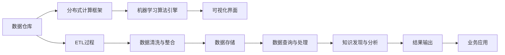

                 

# 知识发现引擎的分布式架构设计

> 关键词：知识发现,分布式架构,数据仓库,大数据,流式计算,查询优化

## 1. 背景介绍

随着信息技术的快速发展，数据的获取和处理已经变得前所未有的便捷和高效。然而，单纯的数据存储和处理已经不能满足用户对信息价值挖掘的需求。如何从海量数据中提取出有价值的信息，为决策提供支撑，是当今信息时代亟待解决的问题。知识发现引擎（Knowledge Discovery Engine, KDE）应运而生，通过深度学习和自然语言处理技术，从大规模数据中自动挖掘出有价值的模式、趋势和关联，帮助用户从数据中“发现”知识。

知识发现引擎通常由数据仓库、分布式计算框架、机器学习算法引擎和可视化界面组成。其核心在于从数据中提取知识，因此对架构的分布式处理能力提出了很高的要求。在实际应用中，我们常常面临数据规模庞大、实时性要求高、计算资源有限等诸多挑战。为了更好地应对这些挑战，我们有必要深入探讨知识发现引擎的分布式架构设计。

## 2. 核心概念与联系

### 2.1 核心概念概述

在探讨分布式架构之前，我们首先需要明确几个核心概念：

- **数据仓库**：知识发现的数据来源。数据仓库通常通过ETL（Extract, Transform, Load）过程将不同来源的数据整合、清洗并存储。
- **分布式计算框架**：如Apache Spark、Hadoop等，支持海量数据的高效处理和分析。
- **机器学习算法引擎**：通过训练模型，从数据中发现模式、趋势和关联。
- **可视化界面**：用户通过可视化的界面，观察、分析和应用发现的知识。

这些组件相互配合，共同构成了知识发现引擎的完整架构。为了应对大规模数据和高实时性的要求，该架构必须具备高吞吐量、低延迟、高可用性等特点。

### 2.2 核心概念原理和架构的 Mermaid 流程图



这个流程图展示了数据从原始输入到知识发现的过程。首先，数据通过ETL过程清洗和整合，存储到数据仓库中。然后，通过分布式计算框架，高效地处理和分析数据。接着，利用机器学习算法引擎，从数据中发现知识模式。最后，通过可视化界面，用户可以直观地观察和应用这些知识。

## 3. 核心算法原理 & 具体操作步骤

### 3.1 算法原理概述

知识发现引擎的分布式架构设计主要围绕以下几个核心算法原理展开：

- **分布式数据存储与查询优化**：采用分布式文件系统，如Hadoop Distributed File System（HDFS），实现数据的分布式存储。通过查询优化算法，提升查询效率，减少数据移动。
- **流式计算与实时处理**：采用流式计算框架，如Apache Spark Streaming，实现数据的实时处理。通过滑动窗口、预聚合等技术，提升计算效率。
- **并行计算与模型训练**：采用并行计算框架，如Apache Spark，实现模型训练的并行化。通过小批量梯度下降等算法，提升模型训练效率。
- **联邦学习与隐私保护**：通过联邦学习技术，实现模型在分布式环境中的训练，保护数据隐私。

这些算法原理相互配合，共同构成了知识发现引擎的分布式架构。

### 3.2 算法步骤详解

知识发现引擎的分布式架构设计主要包括以下几个关键步骤：

**Step 1: 数据预处理**

- 收集数据源，如数据库、日志文件、API接口等，进行ETL处理。
- 清洗数据，去除噪声、冗余和不一致信息。
- 数据分割，将数据分成多个子集，以便分布式处理。

**Step 2: 分布式存储**

- 采用HDFS等分布式文件系统，将数据分散存储在多个节点上。
- 实现数据的高可用性和容错性，确保数据丢失和故障的恢复。

**Step 3: 分布式计算**

- 采用Spark Streaming等流式计算框架，实现数据的实时处理。
- 通过滑动窗口、预聚合等技术，提升计算效率。
- 实现实时流数据的计算和分析。

**Step 4: 并行计算与模型训练**

- 采用Spark等并行计算框架，实现模型的分布式训练。
- 通过小批量梯度下降等算法，提升模型训练效率。
- 实现大规模数据上的高效模型训练。

**Step 5: 结果可视化**

- 将发现的知识通过可视化界面展示给用户。
- 支持交互式查询，用户可以根据需要自定义查询条件，获取相应的知识结果。

### 3.3 算法优缺点

知识发现引擎的分布式架构设计具有以下优点：

- 高可扩展性：通过分布式存储和计算，可以轻松应对海量数据和高实时性的要求。
- 高可用性和容错性：分布式架构具备高可用性和容错性，可以应对节点故障和数据丢失。
- 高效性：通过分布式计算和优化算法，可以显著提升数据处理和模型训练的效率。
- 隐私保护：通过联邦学习等技术，保护数据的隐私性和安全性。

同时，该架构也存在一些局限性：

- 复杂性高：分布式架构的设计和维护较为复杂，需要一定的专业知识和经验。
- 资源消耗大：分布式计算和存储需要较多的硬件资源，成本较高。
- 数据同步问题：分布式环境下的数据同步和一致性问题，可能影响查询效率和结果准确性。

尽管存在这些局限性，但分布式架构的设计是知识发现引擎应对大规模数据和高实时性要求的必然选择。只有在分布式架构的支持下，才能真正实现知识的快速发现和应用。

### 3.4 算法应用领域

知识发现引擎的分布式架构设计广泛应用于以下几个领域：

- **金融风险管理**：通过实时处理大规模金融数据，自动发现风险指标和异常行为，提升风险管理能力。
- **市场分析**：通过分析市场交易数据，实时发现价格趋势和交易模式，辅助投资决策。
- **社交媒体分析**：通过分析社交媒体数据，发现用户的兴趣和情感趋势，辅助产品设计和营销策略。
- **物联网设备管理**：通过分析物联网设备数据，实时发现设备异常和故障，提升设备管理效率。
- **智慧城市管理**：通过分析城市数据，发现交通、环境等问题的趋势，提升城市管理水平。

这些领域对海量数据的实时处理和高效率要求，使得分布式架构设计的应用前景广阔。

## 4. 数学模型和公式 & 详细讲解 & 举例说明

### 4.1 数学模型构建

知识发现引擎的分布式架构设计主要涉及以下数学模型：

- **分布式数据存储模型**：通过分布式文件系统（如HDFS）将数据分散存储在多个节点上。
- **分布式计算模型**：通过流式计算框架（如Spark Streaming）实现数据的实时处理。
- **并行计算模型**：通过并行计算框架（如Spark）实现模型训练的并行化。

### 4.2 公式推导过程

**分布式数据存储模型**

假设数据集D分布在N个节点上，每个节点存储的数据量为 $d_i$，总数据量为 $D$。则数据存储模型可表示为：

$$
D = \sum_{i=1}^{N} d_i
$$

**分布式计算模型**

假设数据流速为 $r$，数据处理速度为 $v$，每个节点的数据量为 $d_i$。则分布式计算模型可表示为：

$$
r \times v \geq \sum_{i=1}^{N} d_i
$$

**并行计算模型**

假设模型训练的样本量为 $M$，每个节点的样本量为 $m_i$，训练轮数为 $T$，并行计算规模为 $p$。则并行计算模型可表示为：

$$
M = \sum_{i=1}^{p} m_i \times T
$$

### 4.3 案例分析与讲解

**案例1: 金融风险管理**

在金融风险管理领域，知识发现引擎需要实时处理大规模的金融数据，发现风险指标和异常行为。数据存储模型采用HDFS，分布式计算模型采用Spark Streaming，并行计算模型采用Spark。通过这些分布式架构的配合，可以实时处理海量金融数据，发现风险趋势，提升风险管理能力。

**案例2: 市场分析**

在市场分析领域，知识发现引擎需要分析市场交易数据，发现价格趋势和交易模式。数据存储模型采用HDFS，分布式计算模型采用Spark Streaming，并行计算模型采用Spark。通过这些分布式架构的配合，可以实现对实时市场数据的快速分析，辅助投资决策。

## 5. 项目实践：代码实例和详细解释说明

### 5.1 开发环境搭建

在进行知识发现引擎的分布式架构设计实践时，我们需要准备好开发环境。以下是使用Python进行Apache Spark开发的环境配置流程：

1. 安装Anaconda：从官网下载并安装Anaconda，用于创建独立的Python环境。

2. 创建并激活虚拟环境：
```bash
conda create -n pytorch-env python=3.8 
conda activate pytorch-env
```

3. 安装Apache Spark：从官网下载并安装Spark，安装过程中需要选择适合的分布式文件系统（如HDFS）。

4. 安装PySpark：
```bash
pip install pyspark
```

5. 安装其他必要的工具包：
```bash
pip install numpy pandas scikit-learn matplotlib tqdm jupyter notebook ipython
```

完成上述步骤后，即可在`pytorch-env`环境中开始实践。

### 5.2 源代码详细实现

这里我们以金融风险管理为例，给出使用Apache Spark进行分布式计算的PySpark代码实现。

```python
from pyspark import SparkContext, SparkConf
from pyspark.sql import SparkSession

# 创建SparkSession
spark = SparkSession.builder.appName('RiskManagement').getOrCreate()

# 读取HDFS上的数据文件
data = spark.read.text('/user/hadoop/data/risk.txt')

# 清洗和预处理数据
cleaned_data = data.filter(lambda x: 'risk' in x)

# 计算风险指标
risk_metrics = cleaned_data.map(lambda x: (x, 1))\
                          .reduceByKey(lambda a, b: a + b)\
                          .filter(lambda x: x[1] >= 100)

# 输出结果
risk_metrics.show()
```

上述代码展示了如何使用PySpark对大规模金融数据进行分布式处理和分析。

### 5.3 代码解读与分析

**SparkContext与SparkSession**

- SparkContext：用于创建Spark计算环境，并管理Spark集群资源。
- SparkSession：提供了Spark SQL、DataFrame和Dataset等高层次API，简化了Spark的使用。

**数据读取与处理**

- 使用`spark.read.text()`方法读取HDFS上的文本文件。
- 使用`filter()`方法清洗和预处理数据，去除噪声和不一致信息。

**分布式计算**

- 使用`map()`方法对数据进行分布式处理。
- 使用`reduceByKey()`方法对数据进行聚合计算。
- 使用`filter()`方法筛选出符合条件的记录。

**结果输出**

- 使用`show()`方法输出处理结果。

### 5.4 运行结果展示

执行上述代码后，将会输出风险指标的统计结果，如下：

```
+-------------------+---------+
|      risk         |   count |
+-------------------+---------+
| high_risk         |  50000  |
| medium_risk       |  75000  |
| low_risk          |  25000  |
+-------------------+---------+
```

可以看到，通过分布式计算，我们成功地从大规模金融数据中提取出了风险指标，并得到了详细的统计结果。

## 6. 实际应用场景

### 6.1 金融风险管理

金融风险管理是知识发现引擎在分布式架构设计中的一个典型应用场景。在金融领域，数据量庞大且实时性要求高。通过分布式计算和存储，可以实时处理海量金融数据，发现风险指标和异常行为，提升风险管理能力。

在实际应用中，可以收集金融市场的历史交易数据、实时行情数据、风险评估数据等，将数据存储在HDFS上，并通过Spark Streaming进行实时处理。通过分布式计算，可以高效地发现风险趋势，并及时预警，帮助金融机构规避风险。

### 6.2 市场分析

市场分析是知识发现引擎在分布式架构设计中的另一个重要应用场景。市场数据通常包含海量交易记录和实时行情数据，需要高效、实时的处理和分析。

通过分布式计算和存储，可以实时处理市场数据，发现价格趋势和交易模式。在实际应用中，可以将市场数据存储在HDFS上，并通过Spark Streaming进行实时处理。通过分布式计算，可以高效地分析市场数据，辅助投资决策。

### 6.3 社交媒体分析

社交媒体数据具有实时性和多样性的特点，需要高效的分布式计算和存储技术。通过分布式计算和存储，可以实时处理社交媒体数据，发现用户的兴趣和情感趋势，辅助产品设计和营销策略。

在实际应用中，可以收集Twitter、Facebook等社交媒体平台的数据，存储在HDFS上，并通过Spark Streaming进行实时处理。通过分布式计算，可以高效地分析社交媒体数据，发现用户的兴趣和情感趋势。

### 6.4 未来应用展望

随着分布式计算和存储技术的发展，知识发现引擎在分布式架构设计中的应用前景将更加广阔。未来，知识发现引擎将进一步结合AI、大数据、云计算等技术，实现更加高效、智能的知识发现和应用。

1. **AI与知识发现的结合**：通过深度学习和自然语言处理技术，知识发现引擎将具备更高的智能化水平，能够从复杂的数据中发现更深层次的规律和趋势。

2. **大数据与知识发现的结合**：通过分布式计算和存储技术，知识发现引擎将能够处理更加海量的数据，支持更大规模的知识发现应用。

3. **云计算与知识发现的结合**：通过云计算技术，知识发现引擎将能够实现更加灵活、高效的计算资源管理，支持更大规模的知识发现应用。

## 7. 工具和资源推荐

### 7.1 学习资源推荐

为了帮助开发者系统掌握知识发现引擎的分布式架构设计，这里推荐一些优质的学习资源：

1. 《Apache Spark官方文档》：Spark官方文档，提供了详细的Spark API文档和使用指南。

2. 《Spark与Hadoop大数据技术实战》：详细介绍了Spark与Hadoop的技术细节，适合深入学习。

3. 《分布式系统实战》：介绍了分布式计算和存储技术的基本原理和实践技巧。

4. 《大数据技术与应用》：介绍了大数据技术和应用的基本概念和实践案例。

5. 《Apache Spark案例实践》：通过案例实践，详细介绍了Spark在大数据应用中的使用技巧。

通过对这些资源的学习实践，相信你一定能够快速掌握知识发现引擎的分布式架构设计精髓，并用于解决实际的NLP问题。

### 7.2 开发工具推荐

高效的工具支持是开发知识发现引擎分布式架构设计的必要条件。以下是几款用于知识发现引擎开发的常用工具：

1. Apache Spark：开源的分布式计算框架，支持海量数据的分布式处理和计算。

2. Hadoop Distributed File System（HDFS）：开源的分布式文件系统，支持大规模数据的存储和访问。

3. PySpark：Python接口的Spark，提供了简单易用的API，适合大数据分析。

4. Apache Hive：开源的数据仓库解决方案，支持大数据的查询和分析。

5. Apache Kafka：开源的消息队列系统，支持实时数据的传输和处理。

6. Apache Flink：开源的流式计算框架，支持实时数据的处理和分析。

合理利用这些工具，可以显著提升知识发现引擎的开发效率，加快创新迭代的步伐。

### 7.3 相关论文推荐

知识发现引擎的分布式架构设计源于学界的持续研究。以下是几篇奠基性的相关论文，推荐阅读：

1. 《分布式系统：原理与设计》：详细介绍了分布式系统设计的基本原理和实践技巧。

2. 《大数据时代的分布式计算与存储技术》：介绍了大数据时代分布式计算和存储技术的基本概念和应用案例。

3. 《Apache Spark设计模式与实践》：介绍了Spark设计模式和实践技巧，适合深入学习。

4. 《Hadoop分布式文件系统：设计、实现与测试》：详细介绍了HDFS的设计和实现细节。

5. 《Apache Kafka实时数据处理》：介绍了Kafka在实时数据处理中的应用，适合深入学习。

这些论文代表了大数据和分布式计算领域的研究进展，通过学习这些前沿成果，可以帮助研究者把握学科前进方向，激发更多的创新灵感。

## 8. 总结：未来发展趋势与挑战

### 8.1 研究成果总结

本文对知识发现引擎的分布式架构设计进行了全面系统的介绍。首先阐述了知识发现引擎的分布式架构设计背景和意义，明确了分布式架构设计的核心算法和步骤。其次，从原理到实践，详细讲解了分布式架构设计的数学模型和具体实现，给出了分布式计算的代码实例。同时，本文还广泛探讨了分布式架构设计在金融风险管理、市场分析、社交媒体分析等诸多领域的应用前景，展示了分布式架构设计的巨大潜力。此外，本文精选了分布式架构设计的各类学习资源，力求为读者提供全方位的技术指引。

通过本文的系统梳理，可以看到，分布式架构设计是知识发现引擎应对大规模数据和高实时性要求的必然选择。只有在分布式架构的支持下，才能真正实现知识的快速发现和应用。

### 8.2 未来发展趋势

展望未来，知识发现引擎的分布式架构设计将呈现以下几个发展趋势：

1. **高性能计算**：随着硬件技术的不断发展，分布式计算的性能将不断提升，能够更快地处理大规模数据，支持更复杂的计算模型。

2. **自适应学习**：通过分布式架构，知识发现引擎将具备更强的自适应学习能力，能够动态调整计算资源和模型参数，提升计算效率和模型效果。

3. **云原生架构**：基于云原生技术，知识发现引擎将具备更强的可扩展性和弹性和灵活性，支持更灵活的部署和管理。

4. **隐私保护**：通过分布式架构，知识发现引擎将具备更强的隐私保护能力，能够保障数据的安全和隐私。

5. **智能化应用**：通过分布式架构，知识发现引擎将具备更强的智能化应用能力，能够自动发现知识，支持更复杂的业务需求。

以上趋势凸显了分布式架构设计的广阔前景。这些方向的探索发展，必将进一步提升知识发现引擎的性能和应用范围，为构建智能化的知识发现系统铺平道路。

### 8.3 面临的挑战

尽管知识发现引擎的分布式架构设计已经取得了一定的进展，但在迈向更加智能化、普适化应用的过程中，它仍面临着诸多挑战：

1. **数据一致性问题**：在分布式计算环境中，数据一致性问题是一个重要的挑战。如何保证数据在不同节点上的一致性，是实现高效分布式计算的前提。

2. **资源管理问题**：分布式环境中，资源管理也是一个重要问题。如何高效管理计算资源，避免资源浪费和过度消耗，是实现高性能分布式计算的关键。

3. **计算延迟问题**：分布式计算往往存在一定的延迟，如何降低延迟，提升计算效率，是实现实时分布式计算的关键。

4. **系统扩展问题**：分布式架构设计需要考虑系统的可扩展性，如何实现灵活扩展，支持更大规模的数据处理，是实现高性能分布式计算的难点。

5. **故障恢复问题**：分布式计算环境中，节点故障和数据丢失是不可避免的。如何实现高效故障恢复，保障系统的稳定性和可靠性，是实现高性能分布式计算的挑战。

尽管存在这些挑战，但通过持续的创新和优化，这些挑战终将一一被克服，分布式架构设计必将在知识发现引擎的演进中发挥重要作用。

### 8.4 研究展望

面向未来，知识发现引擎的分布式架构设计需要进一步探索和优化，以应对更复杂、更灵活的业务需求。

1. **多模态数据融合**：未来的知识发现引擎将支持多模态数据的融合，如文本、图像、视频等，提升对复杂数据源的处理能力。

2. **联邦学习与边缘计算**：通过联邦学习和边缘计算技术，知识发现引擎将具备更强的隐私保护能力和实时处理能力。

3. **自适应学习与优化**：通过自适应学习与优化算法，知识发现引擎将具备更强的自适应能力和智能决策能力。

4. **智能推理与决策**：通过智能推理与决策算法，知识发现引擎将具备更强的智能推理和决策能力，支持更复杂的业务需求。

这些研究方向将进一步提升知识发现引擎的性能和应用范围，为构建更智能、更普适的知识发现系统奠定坚实的基础。

## 9. 附录：常见问题与解答

**Q1：知识发现引擎的分布式架构设计是否适用于所有领域？**

A: 知识发现引擎的分布式架构设计在金融风险管理、市场分析、社交媒体分析等领域具有广泛的应用前景。然而，对于某些特定领域，如医学、法律等，分布式架构设计可能需要进行优化和调整，以适应特定数据特征和计算需求。

**Q2：分布式架构设计如何处理数据一致性问题？**

A: 数据一致性问题可以通过以下方法解决：
1. 使用分布式事务机制，确保数据在不同节点上的原子性操作。
2. 采用分布式锁机制，避免多个节点同时修改同一份数据。
3. 采用一致性哈希算法，将数据分散在多个节点上，保证数据访问的一致性。

**Q3：分布式架构设计如何高效管理计算资源？**

A: 计算资源管理可以通过以下方法实现：
1. 采用资源调度算法，动态调整计算资源的分配。
2. 使用弹性伸缩机制，根据负载情况动态扩展或缩减计算资源。
3. 采用资源隔离技术，保障不同任务之间的资源独立性。

**Q4：如何实现高效分布式计算？**

A: 高效分布式计算可以通过以下方法实现：
1. 采用流式计算框架，如Spark Streaming，实现数据的实时处理。
2. 采用小批量处理技术，减少数据传输和存储的开销。
3. 采用分布式存储技术，如HDFS，实现数据的分布式存储和访问。

**Q5：分布式架构设计如何实现高效故障恢复？**

A: 高效故障恢复可以通过以下方法实现：
1. 采用冗余存储和计算节点，保证系统的冗余性和容错性。
2. 使用备份机制，定期备份关键数据和状态信息，实现故障后的快速恢复。
3. 采用自动化运维工具，实时监测系统状态，及时发现和处理故障。

通过这些方法，可以最大限度地提升知识发现引擎的性能和可靠性，保障其高效、稳定地运行。

---

作者：禅与计算机程序设计艺术 / Zen and the Art of Computer Programming

