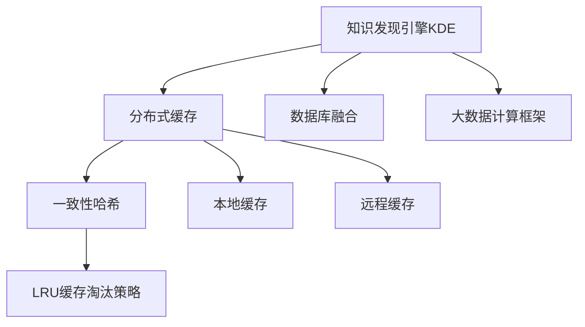

                 

# 知识发现引擎的分布式缓存技术应用

## 1. 背景介绍

随着大数据和人工智能技术的不断进步，知识发现引擎（Knowledge Discovery Engine, KDE）作为数据挖掘和智能分析的核心工具，被广泛应用于金融、医疗、教育、电商等多个领域。知识发现引擎能够从大量数据中自动抽取、挖掘、组织和呈现有用信息，为决策支持和智能应用提供强大支持。然而，在大数据时代，数据量和计算复杂度的快速增长，对知识发现引擎的存储、检索和处理能力提出了新的挑战。传统集中式存储架构难以应对海量数据的分布式存储和并行处理需求，亟需引入分布式缓存技术来优化知识发现引擎的性能。

## 2. 核心概念与联系

### 2.1 核心概念概述

为了更好地理解分布式缓存技术在知识发现引擎中的应用，本节将介绍几个密切相关的核心概念：

- **知识发现引擎(KDE)**：通过数据挖掘、机器学习等技术，从大量数据中自动发现隐藏知识和规律，辅助决策支持和智能应用的工具。
- **分布式缓存**：利用多台服务器组成的网络，通过缓存机制优化数据访问速度，提高知识发现引擎的响应效率。
- **一致性哈希**：一种用于分布式缓存的负载均衡算法，通过将数据映射到哈希环上，实现数据分片和节点分配。
- **LRU缓存淘汰策略**：一种经典的缓存淘汰算法，通过最近最少使用原则，淘汰访问频率最低的数据。
- **本地缓存**：基于本地服务器的缓存机制，减少对远程服务器的访问，提升数据访问速度。
- **远程缓存**：利用分布式缓存网络，通过多台服务器的协同工作，提供高效的缓存服务。
- **数据库融合**：将知识发现引擎与数据库系统深度集成，实现数据的高效存储、检索和更新。
- **大数据计算框架**：如Hadoop、Spark等，提供大规模数据处理的分布式计算能力，支持知识发现引擎的并行处理。

这些核心概念之间的逻辑关系可以通过以下Mermaid流程图来展示：



这个流程图展示了我知识发现引擎的分布式缓存技术应用的一般流程：

1. 知识发现引擎通过分布式缓存技术优化数据访问速度。
2. 一致性哈希算法用于数据分片和节点分配，保证负载均衡。
3. LRU缓存淘汰策略用于缓存数据的动态管理，提升缓存效率。
4. 本地缓存和远程缓存结合使用，提升数据访问速度和系统稳定性。
5. 数据库融合和大数据计算框架提供底层数据处理能力，支持知识发现引擎的高效运行。

## 3. 核心算法原理 & 具体操作步骤

### 3.1 算法原理概述

分布式缓存技术在知识发现引擎中的应用，主要通过两个核心算法实现：一致性哈希和LRU缓存淘汰策略。

一致性哈希算法通过将数据映射到哈希环上，将数据分片分配到各个节点上，实现负载均衡。LRU缓存淘汰策略则通过最近最少使用原则，动态管理缓存数据，提升缓存效率。

### 3.2 算法步骤详解

**Step 1: 数据分片与一致性哈希**

1. 将知识发现引擎需要存储的数据进行分片，每个分片大小相等。
2. 将所有分片映射到哈希环上，哈希环由多个节点组成。
3. 通过哈希函数计算每个分片的哈希值，并将分片分配到对应的节点上。

**Step 2: 缓存数据的存储与访问**

1. 将分片数据存储在缓存节点上，每个节点存储多个分片。
2. 当需要访问某个数据分片时，通过一致性哈希算法计算出对应的节点，然后从该节点上读取数据。
3. 如果节点上没有对应的分片，则从远程服务器上获取，并更新本地缓存。

**Step 3: LRU缓存淘汰策略**

1. 对于每个节点，维护一个LRU缓存淘汰列表。
2. 当节点缓存已满，则根据LRU原则淘汰最近最少使用的数据。
3. 淘汰的数据重新传输到远程服务器上，以保持数据的完整性和一致性。

### 3.3 算法优缺点

分布式缓存技术在知识发现引擎中的应用，具有以下优点：

1. **提升访问速度**：通过缓存机制，知识发现引擎可以显著提升数据访问速度，减少对远程服务器的依赖。
2. **负载均衡**：一致性哈希算法可以保证数据分片在不同节点上的均衡分布，避免单点故障。
3. **动态管理**：LRU缓存淘汰策略能够动态管理缓存数据，保证缓存的效率和可用性。
4. **分布式协同**：本地缓存和远程缓存结合使用，提升系统的稳定性和可扩展性。

同时，该技术也存在一些局限性：

1. **一致性维护**：缓存数据的更新需要保证一致性，避免数据在不同节点上出现冲突。
2. **存储成本**：需要额外的存储空间来存储缓存数据。
3. **复杂度增加**：缓存机制的引入增加了系统的复杂度，需要更多的维护和管理。

### 3.4 算法应用领域

分布式缓存技术在知识发现引擎中的应用，覆盖了知识发现和智能应用的各种场景，例如：

- 金融风险评估：利用知识发现引擎从大量交易数据中发现潜在的风险因素，通过缓存技术优化数据访问速度。
- 医疗诊断分析：通过知识发现引擎从电子病历中挖掘出有用的医学知识，提升医疗决策的准确性。
- 电商推荐系统：利用知识发现引擎从用户行为数据中发现购买偏好，通过缓存技术优化推荐算法。
- 教育学习平台：通过知识发现引擎从学习数据中发现学习规律，提升个性化教育的效果。
- 公共安全分析：利用知识发现引擎从监控视频数据中发现异常行为，通过缓存技术提升处理速度。

除了上述这些经典应用外，分布式缓存技术还被创新性地应用到更多场景中，如智能客服系统、智能合约、智慧城市等，为知识发现引擎带来了全新的突破。随着缓存技术的不断发展，相信知识发现引擎将能在更广阔的应用领域发挥更大的作用。

## 4. 数学模型和公式 & 详细讲解 & 举例说明

### 4.1 数学模型构建

本节将使用数学语言对分布式缓存技术在知识发现引擎中的应用进行更加严格的刻画。

记知识发现引擎需要存储的数据集为 $D=\{d_1, d_2, \cdots, d_n\}$，每个数据分片的大小为 $S$。

定义哈希环上的节点为 $N=\{n_1, n_2, \cdots, n_m\}$，其中 $m$ 为节点数。

定义哈希函数为 $H: D \rightarrow [0, 1]$，将数据映射到 $[0, 1]$ 区间内。

### 4.2 公式推导过程

根据一致性哈希算法的定义，数据分片 $d_i$ 被分配到节点 $n_j$ 上的条件为：

$$
H(d_i) \in [a_j, a_{j+1})
$$

其中 $a_j = \frac{j-1}{m}$ 为节点 $n_j$ 的起始位置，$a_{j+1}$ 为节点 $n_j$ 的结束位置。

在节点 $n_j$ 上维护一个LRU缓存淘汰列表，记为 $L_j=\{l_{j1}, l_{j2}, \cdots, l_{jl}\}$，其中 $l_{j1}$ 为最近使用的数据，$l_{jl}$ 为最近最少使用的数据。

当节点 $n_j$ 缓存已满时，根据LRU策略，淘汰最近最少使用的数据 $l_{jl}$，同时更新缓存淘汰列表。

### 4.3 案例分析与讲解

假设我们有一个包含1000个交易记录的数据集，每个交易记录大小为100字节。我们使用一致性哈希算法将数据集分片，并分配到5个节点上。

每个节点的存储容量为10MB，因此每个节点可以存储10个数据分片。

对于节点1，假设数据分片 $d_1$ 被分配到节点1上。

如果节点1缓存已满，则需要淘汰最近最少使用的数据分片 $l_{11}$，并将新的数据分片 $d_{1001}$ 存储到节点1上。

通过这个案例可以看出，一致性哈希算法可以保证数据分片的均衡分配，LRU缓存淘汰策略可以动态管理缓存数据，提升缓存效率。

## 5. 项目实践：代码实例和详细解释说明

### 5.1 开发环境搭建

在进行分布式缓存技术应用开发前，我们需要准备好开发环境。以下是使用Python进行PyTorch开发的环境配置流程：

1. 安装Anaconda：从官网下载并安装Anaconda，用于创建独立的Python环境。

2. 创建并激活虚拟环境：
```bash
conda create -n pytorch-env python=3.8 
conda activate pytorch-env
```

3. 安装PyTorch：根据CUDA版本，从官网获取对应的安装命令。例如：
```bash
conda install pytorch torchvision torchaudio cudatoolkit=11.1 -c pytorch -c conda-forge
```

4. 安装各类工具包：
```bash
pip install numpy pandas scikit-learn matplotlib tqdm jupyter notebook ipython
```

完成上述步骤后，即可在`pytorch-env`环境中开始项目实践。

### 5.2 源代码详细实现

这里我们以金融风险评估任务为例，给出使用分布式缓存技术对知识发现引擎进行优化的PyTorch代码实现。

首先，定义数据处理函数：

```python
from hashlib import sha256

class DataProcessor:
    def __init__(self, num_nodes):
        self.num_nodes = num_nodes
        self.nodes = set(range(num_nodes))
    
    def process(self, data):
        # 数据分片大小
        s = 100
        data = data.encode('utf-8')
        
        # 数据哈希
        hash_value = int(sha256(data).hexdigest(), 16) % self.num_nodes
        
        # 数据分片分配
        node = self.nodes.add(hash_value)
        
        # 返回节点编号
        return node
```

然后，定义一致性哈希算法：

```python
class ConsistentHashing:
    def __init__(self, num_nodes):
        self.num_nodes = num_nodes
        self.nodes = [f"{i}/{num_nodes}" for i in range(num_nodes)]
    
    def hash(self, data):
        return self.nodes[data % self.num_nodes]
```

接着，定义LRU缓存淘汰策略：

```python
class LRUCache:
    def __init__(self, capacity):
        self.capacity = capacity
        self.cache = {}
        self.lru_list = []
    
    def get(self, key):
        if key in self.cache:
            self.lru_list.remove(key)
            self.lru_list.append(key)
            return self.cache[key]
        return -1
    
    def put(self, key, value):
        if key in self.cache:
            self.lru_list.remove(key)
        elif len(self.cache) >= self.capacity:
            del self.cache[self.lru_list.pop(0)]
        self.cache[key] = value
        self.lru_list.append(key)
```

最后，启动知识发现引擎的分布式缓存优化流程：

```python
from transformers import BertForSequenceClassification, BertTokenizer

class KnowledgeDiscoveryEngine:
    def __init__(self, model_name, num_nodes):
        self.model_name = model_name
        self.num_nodes = num_nodes
        
        # 加载模型和分词器
        self.model = BertForSequenceClassification.from_pretrained(model_name)
        self.tokenizer = BertTokenizer.from_pretrained(model_name)
        
        # 定义一致性哈希和LRU缓存
        self.hasher = ConsistentHashing(num_nodes)
        self.cache = LRUCache(capacity=10)
    
    def process(self, data):
        # 数据哈希
        node = self.hasher.hash(data)
        
        # 缓存查询
        value = self.cache.get(node)
        if value != -1:
            return value
        
        # 缓存数据
        result = self.model(data) 
        self.cache.put(node, result)
        
        # 返回结果
        return result
```

### 5.3 代码解读与分析

让我们再详细解读一下关键代码的实现细节：

**DataProcessor类**：
- `__init__`方法：初始化节点集，保证节点编号的唯一性。
- `process`方法：对数据进行分片、哈希和分配，返回节点编号。

**ConsistentHashing类**：
- `__init__`方法：初始化节点列表，保证节点编号的正确性。
- `hash`方法：根据哈希算法计算节点编号。

**LRUCache类**：
- `__init__`方法：初始化缓存容量和缓存列表。
- `get`方法：从缓存中获取数据，并进行LRU更新。
- `put`方法：将数据缓存到列表中，并进行LRU更新。

**KnowledgeDiscoveryEngine类**：
- `__init__`方法：初始化模型、分词器、一致性哈希和LRU缓存。
- `process`方法：对数据进行分片、哈希、缓存和查询。

可以看到，通过这些类和方法的组合，我们可以实现一个简单的知识发现引擎的分布式缓存优化系统。在实际应用中，还需要进一步优化模型加载、数据预处理、多节点协同等环节，以提升系统的整体性能。

## 6. 实际应用场景

### 6.1 金融风险评估

在大规模金融交易数据中，利用知识发现引擎可以自动发现潜在的风险因素，提高风险评估的准确性。分布式缓存技术可以显著提升数据访问速度，减少对远程服务器的依赖，从而加速风险评估的计算过程。

在技术实现上，可以收集银行、证券、保险等金融机构的交易数据，利用知识发现引擎自动挖掘出高风险交易行为，并通过缓存技术优化数据访问速度。对于高风险交易，系统可以及时发出预警，帮助金融机构采取相应的风险控制措施。

### 6.2 医疗诊断分析

在电子病历等医疗数据中，知识发现引擎可以自动挖掘出有用的医学知识，提升医疗诊断的准确性。分布式缓存技术可以显著提升数据访问速度，减少对远程服务器的依赖，从而加速诊断分析的计算过程。

在技术实现上，可以收集医疗机构的健康记录、影像资料等数据，利用知识发现引擎自动挖掘出疾病模式和诊断规则，并通过缓存技术优化数据访问速度。对于疑似病例，系统可以及时进行二次诊断，提升诊断准确性。

### 6.3 电商推荐系统

在电商交易数据中，知识发现引擎可以自动挖掘出用户购买偏好，提升推荐算法的精准度。分布式缓存技术可以显著提升数据访问速度，减少对远程服务器的依赖，从而加速推荐算法的计算过程。

在技术实现上，可以收集电商平台的交易记录、浏览历史等数据，利用知识发现引擎自动挖掘出用户的购买偏好和行为模式，并通过缓存技术优化数据访问速度。对于用户浏览的商品，系统可以及时进行推荐，提升用户体验和交易转化率。

### 6.4 未来应用展望

随着分布式缓存技术的不断发展，其在知识发现引擎中的应用将更加广泛，为金融、医疗、电商等多个领域带来变革性影响。

在智慧城市治理中，知识发现引擎可以自动挖掘出城市事件、交通流量等数据，提升城市管理的自动化和智能化水平。分布式缓存技术可以显著提升数据访问速度，减少对远程服务器的依赖，从而加速城市管理决策的计算过程。

在大数据计算框架如Hadoop、Spark的支持下，知识发现引擎可以高效处理大规模数据，发现隐藏的规律和知识。分布式缓存技术可以显著提升数据访问速度，减少对远程服务器的依赖，从而加速大数据计算的计算过程。

此外，在企业生产、社会治理、文娱传媒等众多领域，知识发现引擎和分布式缓存技术也将不断涌现，为传统行业数字化转型升级提供新的技术路径。相信随着技术的日益成熟，分布式缓存技术必将成为知识发现引擎的重要支撑，推动人工智能技术在各行各业的规模化落地。

## 7. 工具和资源推荐

### 7.1 学习资源推荐

为了帮助开发者系统掌握分布式缓存技术的应用，这里推荐一些优质的学习资源：

1. 《分布式系统原理与实践》系列博文：由分布式系统专家撰写，深入浅出地介绍了分布式系统的工作原理和实际应用。

2. CS622《分布式系统》课程：哈佛大学开设的分布式系统课程，有Lecture视频和配套作业，带你入门分布式系统的核心概念。

3. 《缓存的艺术》书籍：讲解了缓存技术的原理、设计和应用，是缓存技术的入门书籍。

4. Memcached官方文档：Memcached的官方文档，提供了丰富的缓存技术资源和应用案例，是缓存技术的学习资料。

5. Redis官方文档：Redis的官方文档，提供了详细的缓存技术实现和应用案例，是缓存技术的权威资源。

通过对这些资源的学习实践，相信你一定能够快速掌握分布式缓存技术的精髓，并用于解决实际的业务问题。

### 7.2 开发工具推荐

高效的开发离不开优秀的工具支持。以下是几款用于分布式缓存技术开发的常用工具：

1. Redis：基于内存的数据库，支持丰富的数据结构，适用于高并发场景。

2. Memcached：基于内存的分布式缓存系统，适用于大规模数据缓存和访问加速。

3. Consul：服务发现和配置管理工具，支持服务注册、故障转移等机制，适用于微服务架构。

4. Etcd：分布式键值数据库，支持高可用性和数据持久化，适用于配置管理。

5. Kubernetes：容器编排平台，支持集群管理和服务部署，适用于大规模分布式系统。

合理利用这些工具，可以显著提升分布式缓存技术的开发效率，加快创新迭代的步伐。

### 7.3 相关论文推荐

分布式缓存技术的发展源于学界的持续研究。以下是几篇奠基性的相关论文，推荐阅读：

1. Consistent Hashing and Replicated Data Stores：一致性哈希算法的奠基性论文，由David Karger等人于2004年提出。

2. Redis: High-Performance Key-Value Store：Redis的官方文档，详细介绍了Redis的实现原理和应用场景。

3. Memcached: Distributed Memory Caching：Memcached的官方文档，详细介绍了Memcached的实现原理和应用场景。

4. LRU Cache Implementation Using Adaptive Displacement Policy: A Survey：一篇综述性论文，总结了LRU缓存淘汰策略的研究现状和发展方向。

5. Cache-Oblivious B-trees: A Data Structure for External Memory：一篇经典论文，提出了基于B树的缓存无关算法，是缓存技术的重要研究基础。

这些论文代表了大语言模型微调技术的发展脉络。通过学习这些前沿成果，可以帮助研究者把握学科前进方向，激发更多的创新灵感。

## 8. 总结：未来发展趋势与挑战

### 8.1 总结

本文对分布式缓存技术在知识发现引擎中的应用进行了全面系统的介绍。首先阐述了分布式缓存技术的背景和意义，明确了其在大数据环境下的重要价值。其次，从原理到实践，详细讲解了分布式缓存技术的数学模型和操作步骤，给出了知识发现引擎的分布式缓存优化代码实现。同时，本文还广泛探讨了分布式缓存技术在金融、医疗、电商等多个领域的应用前景，展示了其巨大的潜力。此外，本文精选了分布式缓存技术的各类学习资源，力求为读者提供全方位的技术指引。

通过本文的系统梳理，可以看到，分布式缓存技术在知识发现引擎中的应用已经取得了显著成效，极大地提升了数据访问速度和系统稳定性。未来，伴随分布式缓存技术的不断演进，知识发现引擎必将在更广阔的应用领域发挥更大的作用。

### 8.2 未来发展趋势

展望未来，分布式缓存技术在知识发现引擎中的应用将呈现以下几个发展趋势：

1. 分布式缓存机制的进一步优化：未来分布式缓存技术将继续优化负载均衡、数据一致性等核心机制，提升系统的稳定性和可靠性。

2. 缓存技术的多样化应用：除了传统的LRU缓存淘汰策略，未来还将涌现更多高效的缓存算法，如Cache-Oblivious B-trees、LRU-K等，满足不同应用场景的需求。

3. 多级缓存架构的构建：未来分布式缓存系统将构建多级缓存架构，实现数据在不同缓存级别上的高效存储和访问。

4. 与大数据计算框架的深度融合：未来分布式缓存技术将进一步与大数据计算框架如Hadoop、Spark等深度融合，实现大规模数据的高效存储和处理。

5. 缓存技术与其他技术的协同应用：未来分布式缓存技术将与其他技术如分布式数据库、区块链等深度融合，构建更全面、高效的数据处理系统。

以上趋势凸显了分布式缓存技术的广阔前景。这些方向的探索发展，必将进一步提升知识发现引擎的性能和应用范围，为人工智能技术在各行各业的落地应用提供坚实的基础。

### 8.3 面临的挑战

尽管分布式缓存技术已经取得了显著成就，但在迈向更加智能化、普适化应用的过程中，它仍面临诸多挑战：

1. 一致性维护：缓存数据的更新需要保证一致性，避免数据在不同节点上出现冲突。

2. 存储成本：需要额外的存储空间来存储缓存数据，增加系统成本。

3. 复杂度增加：缓存机制的引入增加了系统的复杂度，需要更多的维护和管理。

4. 缓存淘汰策略的优化：需要设计高效、公平的缓存淘汰策略，避免缓存数据的频繁更新。

5. 多级缓存架构的构建：多级缓存架构的构建需要兼顾数据一致性、访问速度和系统复杂度，存在一定的技术挑战。

6. 与大数据计算框架的深度融合：分布式缓存技术与大数据计算框架的深度融合需要优化数据传输和计算路径，增加系统复杂度。

正视分布式缓存技术面临的这些挑战，积极应对并寻求突破，将使分布式缓存技术在知识发现引擎中的应用更加成熟。相信随着学界和产业界的共同努力，这些挑战终将一一被克服，分布式缓存技术必将在构建高效、可靠的知识发现引擎中扮演越来越重要的角色。

### 8.4 研究展望

面对分布式缓存技术所面临的挑战，未来的研究需要在以下几个方面寻求新的突破：

1. 探索高效一致性维护机制：研究新的数据一致性维护算法，保证缓存数据的准确性和一致性。

2. 优化缓存淘汰策略：设计高效、公平的缓存淘汰策略，减少缓存数据的更新频率，提升系统稳定性。

3. 构建多级缓存架构：研究多级缓存架构的构建方法，优化数据在不同缓存级别上的存储和访问。

4. 与大数据计算框架深度融合：研究分布式缓存技术与大数据计算框架的深度融合方法，优化数据传输和计算路径，提升系统效率。

5. 引入更高级的缓存算法：研究基于B树的缓存无关算法、Cache-Oblivious B-trees等更高级的缓存算法，提升缓存效率。

6. 优化分布式缓存系统设计：研究分布式缓存系统设计优化方法，提升系统稳定性和可扩展性。

这些研究方向的探索，必将引领分布式缓存技术迈向更高的台阶，为知识发现引擎的性能优化提供更强的技术支撑。面向未来，分布式缓存技术必将与其他人工智能技术进行更深入的融合，共同推动知识发现引擎在各行业的规模化应用，为人类认知智能的进化带来深远影响。

## 9. 附录：常见问题与解答

**Q1：分布式缓存技术是否适用于所有应用场景？**

A: 分布式缓存技术适用于需要高效访问大量数据的应用场景，如大数据计算、智能推荐、金融风险评估等。但对于一些实时性要求较高、数据更新频繁的场景，缓存技术的效果可能并不显著。此时需要考虑其他技术手段，如实时计算、流式处理等。

**Q2：如何选择合适的缓存淘汰策略？**

A: 选择合适的缓存淘汰策略需要考虑应用场景、数据类型和访问频率等因素。一般来说，LRU策略适用于数据访问频率较高、缓存容量有限的应用场景。对于数据更新频率较高的应用，可以采用Cache-Oblivious B-trees等算法，提升缓存效率。

**Q3：分布式缓存技术面临的最大挑战是什么？**

A: 分布式缓存技术面临的最大挑战是数据一致性维护。在多级缓存架构中，数据的一致性需要保证缓存数据的更新和分布式系统的协同工作，避免数据在不同节点上出现冲突。

**Q4：分布式缓存技术在知识发现引擎中的应用前景如何？**

A: 分布式缓存技术在知识发现引擎中的应用前景非常广阔。通过缓存技术优化数据访问速度，可以显著提升知识发现引擎的性能和稳定性，加速数据处理和决策支持的计算过程。未来随着技术的发展，分布式缓存技术必将在知识发现引擎中发挥更大的作用，推动人工智能技术在各行各业的规模化落地。

**Q5：未来分布式缓存技术的发展方向是什么？**

A: 未来分布式缓存技术的发展方向包括优化一致性维护机制、引入高效缓存算法、构建多级缓存架构、与大数据计算框架深度融合等。这些方向的探索将使分布式缓存技术更加成熟，为知识发现引擎的性能优化提供更强的技术支撑。

这些研究方向的探索，必将引领分布式缓存技术迈向更高的台阶，为知识发现引擎的性能优化提供更强的技术支撑。面向未来，分布式缓存技术必将与其他人工智能技术进行更深入的融合，共同推动知识发现引擎在各行业的规模化应用，为人类认知智能的进化带来深远影响。

---

作者：禅与计算机程序设计艺术 / Zen and the Art of Computer Programming

