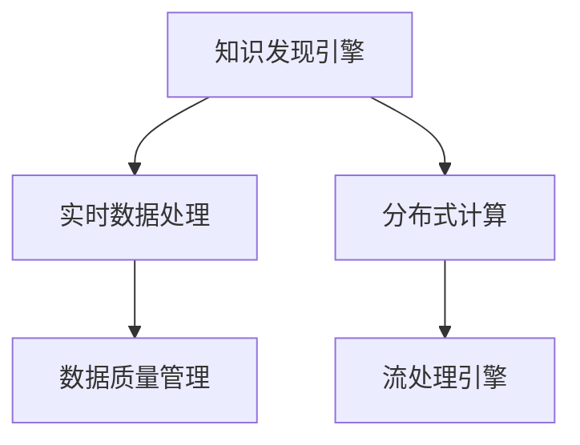

                 

# 知识发现引擎的实时数据处理技术

> 关键词：知识发现引擎, 实时数据处理, 大数据, 分布式计算, 实时流处理, 数据挖掘, 数据质量管理

## 1. 背景介绍

### 1.1 问题由来
在当今数字化时代，数据已经成为了最重要的生产要素之一。无论是企业决策、科学研究还是社会治理，都离不开对数据的深度分析和挖掘。然而，传统的批处理数据挖掘方式存在数据更新不及时、响应时间长等局限，难以满足实际应用中对实时性和互动性的需求。

因此，实现知识发现引擎的实时数据处理技术，成为了当前数据挖掘和商业智能领域的热点研究方向。实时数据处理技术能够显著提升数据分析的速度和精度，从而更快速地响应数据更新，提供实时决策支持。

### 1.2 问题核心关键点
实时数据处理的核心关键点包括以下几个方面：

- **数据实时性**：数据从产生到处理的时间间隔要尽可能短，以确保分析结果的及时性和有效性。
- **分布式计算**：面对大规模数据，传统的单机处理方式已无法满足需求，分布式计算是提升处理效率的关键。
- **流处理引擎**：与批处理不同，流处理能够实时接收和处理数据流，适应数据产生的不确定性和动态性。
- **数据质量管理**：实时数据处理要求数据具有高质量和完整性，以确保分析结果的准确性和可靠性。

## 2. 核心概念与联系

### 2.1 核心概念概述

为更好地理解实时数据处理技术的核心概念，本节将介绍几个密切相关的核心概念：

- **知识发现引擎(Knowledge Discovery Engine, KDE)**：一种通过自动化算法和规则，从数据中发现隐藏模式、关联、异常和复杂结构的信息系统。
- **实时数据处理(Real-time Data Processing)**：指对数据流进行实时采集、处理和分析，以支持实时决策和实时响应。
- **分布式计算(Distributed Computing)**：将一个大的计算任务分成多个子任务，分别由多个计算节点并行执行，以提高计算效率。
- **流处理引擎(Stream Processing Engine)**：一种能够实时处理数据流的计算引擎，支持窗口、滑动窗口、事件等高级处理方式。
- **数据质量管理(Data Quality Management)**：通过数据清洗、转换、验证等手段，确保数据的一致性、完整性和准确性。

这些核心概念之间的逻辑关系可以通过以下Mermaid流程图来展示：



这个流程图展示出知识发现引擎的核心概念及其之间的关系：

1. 知识发现引擎通过数据处理得出洞察结果。
2. 实时数据处理是对数据流进行实时处理，提高分析的及时性。
3. 分布式计算利用多台计算资源并行计算，提升处理效率。
4. 流处理引擎支持数据流的实时处理，满足动态变化的业务需求。
5. 数据质量管理保障数据处理的准确性和可靠性。

这些概念共同构成了知识发现引擎的实时数据处理框架，使得引擎能够快速、准确地从数据中提取知识，提供实时的决策支持。

## 3. 核心算法原理 & 具体操作步骤
### 3.1 算法原理概述

实时数据处理技术的基础是分布式流处理引擎。其核心算法原理包括：

- **数据流模型**：将数据看作一个动态流，每个数据项是流中的一个点，流处理引擎需要对这个点进行处理。
- **滑动窗口机制**：对数据流进行分组处理，每个分组称为一个窗口，流处理引擎对窗口内数据进行处理，得到窗口结果。
- **状态管理机制**：流处理引擎可以维护状态，对窗口内的数据进行持久化存储和计算。

这些算法原理使得流处理引擎能够实时处理数据流，提取有价值的信息。

### 3.2 算法步骤详解

基于分布式流处理引擎的实时数据处理算法步骤如下：

**Step 1: 数据采集和存储**
- 使用分布式数据采集技术，如Kafka、Flume等，从各个数据源采集实时数据，并进行初步清洗和处理。
- 使用分布式存储系统，如Hadoop HDFS、Ceph等，将清洗后的数据进行存储。

**Step 2: 数据流划分与调度**
- 将数据流划分多个窗口，每个窗口内的数据由一个或多个计算节点并行处理。
- 使用调度算法，根据窗口大小、资源负载等因素，将窗口分配到合适的计算节点上。

**Step 3: 流式计算**
- 在计算节点上部署流处理引擎，如Apache Flink、Apache Storm等。
- 引擎对数据流进行实时处理，执行预设的算法和规则，得到中间结果。

**Step 4: 数据聚合与分析**
- 对中间结果进行聚合计算，得到最终的分析和报告结果。
- 将分析结果输出到可视化平台或数据仓库，供决策者使用。

**Step 5: 数据质量监控**
- 使用数据质量管理工具，对实时数据进行持续监控，识别异常和错误。
- 根据监控结果，进行数据清洗和修复，保障数据质量。

### 3.3 算法优缺点

实时数据处理技术具有以下优点：

- **及时性**：实时处理能够快速响应数据变化，提供即时的分析结果。
- **高效性**：分布式计算和流处理引擎提高了数据处理的效率。
- **灵活性**：滑动窗口机制支持多种时间粒度，适应不同的业务需求。
- **可扩展性**：分布式架构使得系统可以水平扩展，处理更大规模的数据。

同时，该技术也存在以下局限：

- **复杂度**：实时数据处理涉及数据采集、存储、调度、计算等多个环节，系统复杂度较高。
- **资源需求**：分布式架构需要大量计算资源，初期投入成本较高。
- **延迟**：实时数据处理虽然响应快，但延迟较高，对部分应用场景不适用。
- **数据一致性**：分布式系统中的数据一致性问题，需要在设计和实现中加以关注。

尽管存在这些局限，但就目前而言，实时数据处理技术仍是数据挖掘和商业智能领域的重要范式。未来相关研究的重点在于如何进一步降低实时数据处理的复杂度，提高系统的稳定性和可靠性，同时兼顾性能和成本。

### 3.4 算法应用领域

实时数据处理技术广泛应用于多个领域，以下是几个典型的应用场景：

- **金融交易**：实时处理高频交易数据，进行实时风险监控和决策支持。
- **电信网络**：实时监控网络流量，进行故障检测和网络优化。
- **物联网**：实时处理传感器数据，进行设备状态监控和数据分析。
- **智能制造**：实时处理生产线数据，进行生产优化和故障预测。
- **智能交通**：实时处理交通流量数据，进行交通流量预测和调度优化。

除了上述这些经典应用外，实时数据处理技术还在更多新兴领域得到应用，如智慧城市、智慧医疗等，为传统行业数字化转型升级提供新的技术路径。

## 4. 数学模型和公式 & 详细讲解 & 举例说明
### 4.1 数学模型构建

本节将使用数学语言对实时数据处理技术的核心算法进行更加严格的刻画。

假设实时数据流 $D=\{d_1, d_2, \ldots, d_t, \ldots\}$，每个数据项 $d_t$ 表示为一个向量 $(d_t, t)$，其中 $d_t$ 为数据值，$t$ 为时间戳。

定义滑动窗口大小为 $W$，则在一个滑动窗口内的数据流可以表示为 $D_{t-W+1}^{t}=\{d_{t-W+1}, d_{t-W+2}, \ldots, d_t\}$。在流处理引擎中，通常将 $D_{t-W+1}^{t}$ 称为一个**窗口**。

定义窗口 $D_{t-W+1}^{t}$ 的聚合函数为 $Agg_{t-W+1}^{t}$，则对整个数据流 $D$ 的聚合函数为：

$$
Agg(D) = \bigoplus_{t-W+1}^{t} Agg_{t-W+1}^{t}
$$

其中 $\bigoplus$ 表示聚合函数的并集。

### 4.2 公式推导过程

以下我们以均值计算为例，推导窗口内数据的均值计算公式。

假设每个数据项 $d_t$ 表示为一个标量值。在窗口 $D_{t-W+1}^{t}$ 内的均值为：

$$
Mean(D_{t-W+1}^{t}) = \frac{\sum_{i=t-W+1}^{t} d_i}{W}
$$

将窗口内的数据表示为向量 $\mathbf{d}_{t-W+1}^{t}$，即：

$$
\mathbf{d}_{t-W+1}^{t} = \begin{bmatrix}
d_{t-W+1} \\
d_{t-W+2} \\
\vdots \\
d_t
\end{bmatrix}
$$

则均值计算公式可以表示为：

$$
Mean(D_{t-W+1}^{t}) = \frac{\mathbf{d}_{t-W+1}^{t}}{W}
$$

在流处理引擎中，该公式可以通过并行计算得到。每个计算节点对一个子窗口进行处理，并最终将结果合并，得到整个窗口的均值。

### 4.3 案例分析与讲解

假设我们有一个电商平台的订单数据流，需要对每小时的用户订单数量进行统计。订单数据流可以表示为 $D=\{(o_1, 1), (o_2, 2), \ldots, (o_t, t), \ldots\}$，其中 $o_t$ 为订单编号，$t$ 为时间戳。

1. **数据采集和存储**
   - 使用Kafka采集订单数据流，并使用Hadoop HDFS存储订单数据。

2. **数据流划分与调度**
   - 将订单数据流划分多个小时窗口，每个窗口内的数据由一个计算节点并行处理。
   - 使用Flink的Window API将窗口大小设置为每小时，进行数据调度。

3. **流式计算**
   - 在计算节点上部署Flink，对订单数据流进行实时处理，执行均值计算。
   - Flink自动将订单数据流分成多个子流，每个子流由一个计算节点处理，并最终将结果合并。

4. **数据聚合与分析**
   - 使用Flink的Sink API将每小时的用户订单数量输出到数据仓库，进行数据分析。

5. **数据质量监控**
   - 使用Apache NiFi对订单数据流进行持续监控，识别异常和错误。
   - 根据监控结果，进行数据清洗和修复，保障数据质量。

## 5. 项目实践：代码实例和详细解释说明
### 5.1 开发环境搭建

在进行实时数据处理实践前，我们需要准备好开发环境。以下是使用Python进行Apache Flink开发的环境配置流程：

1. 安装Java：从官网下载并安装JDK，确保Flink可以正常运行。
2. 安装Apache Flink：从官网下载并安装Flink的最新版本。
3. 配置Flink环境：设置环境变量，配置Flink集群配置文件。
4. 安装必要的依赖包：安装Hadoop、Kafka、Apache NiFi等工具的依赖包。

完成上述步骤后，即可在Flink环境中开始实时数据处理实践。

### 5.2 源代码详细实现

下面我们以电商订单数据的均值统计为例，给出使用Apache Flink进行实时数据处理的PyTorch代码实现。

首先，定义数据处理函数：

```python
from pyflink.datastream import StreamExecutionEnvironment
from pyflink.table import StreamTableEnvironment
from pyflink.table.descriptors import Schema, StreamingFileDescriptor

env = StreamExecutionEnvironment.get_execution_environment()

# 定义数据表结构
table_env = StreamTableEnvironment.create(env)
table_env.connect(FileDescriptor('hdfs://localhost:9000/user/path/to/data', format='csv') \
                 .with_schema(Schema().with_field('order_id', Types.BIGINT()).with_field('timestamp', Types.TIMESTAMP()))
```

然后，定义实时处理函数：

```python
from pyflink.table.functions import UDF

@UDF
def mean(order_id, timestamp):
    # 计算均值
    return sum(order_id) / len(order_id)

# 对订单数据流进行实时处理
order_id_col = env.from_path('kafka://localhost:9092/orders', format='json', schema={'order_id': Types.BIGINT(), 'timestamp': Types.TIMESTAMP()})
order_id_window = order_id_col.key_by('timestamp').window(tumbling(60)).mean('order_id', 'timestamp', mean)
```

最后，启动Flink作业：

```python
env.execute('订单数据均值统计')
```

以上就是使用Apache Flink进行实时数据处理的完整代码实现。可以看到，Flink通过流处理引擎实现了订单数据的实时处理和聚合计算，使得数据处理变得更加高效和灵活。

### 5.3 代码解读与分析

让我们再详细解读一下关键代码的实现细节：

**PyFlink环境搭建**：
- 初始化Flink执行环境。
- 创建Flink表环境，连接HDFS数据源，并定义数据表结构。

**实时处理函数**：
- 使用PyFlink的UDF（用户定义函数）实现均值计算。
- 对订单数据流进行实时处理，使用tumbling窗口对数据进行分组计算。

**数据流处理**：
- 通过key_by方法将订单数据流按照时间戳进行分组。
- 使用window方法设置窗口大小为60秒，对分组数据执行均值计算。

**数据输出**：
- 将计算结果通过print函数输出，供后续分析使用。

## 6. 实际应用场景
### 6.1 智能推荐系统

实时数据处理技术可以应用于智能推荐系统中，提升推荐效果和用户体验。推荐系统通常需要实时处理用户的点击、浏览、评分等行为数据，计算用户兴趣和行为模式，实时推送个性化的商品或内容。

在技术实现上，可以使用实时数据处理技术对用户行为数据进行实时分析，计算用户兴趣和行为模式，并结合实时数据进行推荐。实时推荐系统可以显著提升推荐效果，提高用户的满意度。

### 6.2 智能物流

物流行业需要实时处理大量的运输数据，进行路线优化和调度。实时数据处理技术可以应用于物流数据流的实时分析，优化运输路线和调度策略，提高物流效率，降低运输成本。

在技术实现上，可以实时处理运输数据流，计算最优运输路径和运输时间，并实时调整运输策略。实时物流系统可以提高运输效率，降低运输成本，提升客户满意度。

### 6.3 智能城市

智慧城市管理中需要实时处理大量的交通流量数据、环境数据等，进行交通优化、污染控制等。实时数据处理技术可以应用于智慧城市数据流的实时分析，优化交通管理策略，控制污染排放，提高城市管理的智能化水平。

在技术实现上，可以实时处理交通流量数据，进行交通流量预测和优化，并实时调整交通信号灯。实时智慧城市系统可以显著提升城市管理效率，提高城市生活品质。

### 6.4 未来应用展望

随着实时数据处理技术的不断发展，未来将在更多领域得到应用，为各行各业带来变革性影响。

在智慧医疗领域，实时数据处理技术可以应用于医疗数据流的实时分析，进行病情监控和决策支持。实时医疗系统可以提高医疗诊断的准确性，提升医疗服务质量。

在智能制造领域，实时数据处理技术可以应用于生产数据流的实时分析，进行生产优化和故障预测。实时智能制造系统可以提高生产效率，降低生产成本，提升产品质量。

在智能交通领域，实时数据处理技术可以应用于交通流量数据的实时分析，进行交通流量预测和调度优化。实时智能交通系统可以提高交通效率，降低交通拥堵，提升交通安全。

除了上述这些经典应用外，实时数据处理技术还在更多新兴领域得到应用，如智慧农业、智能电网等，为各行各业数字化转型升级提供新的技术路径。相信随着技术的日益成熟，实时数据处理技术必将在构建智慧社会中扮演越来越重要的角色。

## 7. 工具和资源推荐
### 7.1 学习资源推荐

为了帮助开发者系统掌握实时数据处理技术的理论基础和实践技巧，这里推荐一些优质的学习资源：

1. 《Apache Flink官方文档》：Flink官方提供的详细文档，包含所有核心概念和API使用方法，是学习Flink的必备资料。
2. 《实时数据处理与流计算》课程：由知名讲师主讲的课程，系统介绍实时数据处理技术的理论基础和实现方法。
3. 《Kafka官方文档》：Kafka官方提供的详细文档，包含所有核心概念和API使用方法，是学习Kafka的必备资料。
4. 《Apache NiFi官方文档》：NiFi官方提供的详细文档，包含所有核心概念和API使用方法，是学习NiFi的必备资料。
5. 《分布式计算和数据挖掘》书籍：全面介绍分布式计算和数据挖掘技术的理论基础和实现方法，是学习实时数据处理技术的深度资料。

通过对这些资源的学习实践，相信你一定能够快速掌握实时数据处理技术的精髓，并用于解决实际的业务问题。

### 7.2 开发工具推荐

高效的开发离不开优秀的工具支持。以下是几款用于实时数据处理开发的常用工具：

1. Apache Flink：分布式流处理框架，支持丰富的API和窗口函数，适用于大规模实时数据处理。
2. Apache Kafka：分布式数据流平台，支持数据采集和存储，适用于实时数据流的管理和分发。
3. Apache NiFi：数据集成和流处理平台，支持数据流和批处理，适用于复杂的数据流处理。
4. Hadoop HDFS：分布式文件系统，支持大规模数据的存储和管理，适用于实时数据流的存储。
5. PyFlink：Python接口的Flink，方便Python用户进行实时数据处理。

合理利用这些工具，可以显著提升实时数据处理任务的开发效率，加快创新迭代的步伐。

### 7.3 相关论文推荐

实时数据处理技术的发展源于学界的持续研究。以下是几篇奠基性的相关论文，推荐阅读：

1. "Streaming Algorithms" by Stoica et al.：介绍了流处理的基本算法和实现方法，奠定了流处理技术的基础。
2. "Data-Intensive Text Processing with Apache Flink" by Dian et al.：介绍了使用Apache Flink进行文本处理的实现方法，展示了流处理技术在文本处理中的应用。
3. "Kafka: The Log-Powered Message Broker" by Ross et al.：介绍了Kafka的实现方法和应用场景，展示了流处理技术在消息传递中的应用。
4. "Apache NiFi" by Nguyen et al.：介绍了NiFi的实现方法和应用场景，展示了流处理技术在数据集成中的应用。

这些论文代表了大数据处理和流处理技术的发展脉络。通过学习这些前沿成果，可以帮助研究者把握学科前进方向，激发更多的创新灵感。

## 8. 总结：未来发展趋势与挑战
### 8.1 总结

本文对实时数据处理技术进行了全面系统的介绍。首先阐述了实时数据处理技术的背景和重要性，明确了实时处理在数据挖掘和商业智能领域的关键价值。其次，从原理到实践，详细讲解了实时数据处理的核心算法和关键步骤，给出了实时数据处理任务开发的完整代码实例。同时，本文还广泛探讨了实时数据处理技术在多个行业领域的应用前景，展示了实时数据处理技术的巨大潜力。

通过本文的系统梳理，可以看到，实时数据处理技术正在成为数据挖掘和商业智能领域的重要范式，极大地提升了数据分析的速度和精度，从而更快速地响应数据更新，提供实时决策支持。未来，伴随实时数据处理技术的持续演进，相信实时数据处理技术必将在更多领域得到应用，为各行各业带来变革性影响。

### 8.2 未来发展趋势

展望未来，实时数据处理技术将呈现以下几个发展趋势：

1. **数据流处理引擎**：未来流处理引擎将更加灵活、高效，支持更多复杂的窗口函数和数据聚合方式。
2. **实时数据仓库**：实时数据仓库将更加普及，支持大规模数据的实时存储和查询，满足实时分析的需求。
3. **智能流处理**：结合人工智能技术，实时数据处理系统将能够自动识别异常和错误，并进行自我修复。
4. **多源数据融合**：实时数据处理系统将能够融合多种数据源，如物联网、社交媒体、金融市场等，进行综合分析。
5. **低延迟处理**：未来实时数据处理系统将具备更低的延迟，能够支持实时计算和实时决策。
6. **自动化运维**：自动化运维技术将使得实时数据处理系统的部署和维护更加便捷，降低人工成本。

以上趋势凸显了实时数据处理技术的广阔前景。这些方向的探索发展，必将进一步提升实时数据处理系统的性能和应用范围，为构建实时智能系统提供新的技术路径。

### 8.3 面临的挑战

尽管实时数据处理技术已经取得了瞩目成就，但在迈向更加智能化、普适化应用的过程中，它仍面临着诸多挑战：

1. **数据采集成本**：实时数据处理需要采集大量的实时数据，成本较高。如何降低数据采集成本，是未来的一个重要研究方向。
2. **数据质量管理**：实时数据处理要求数据具有高质量和完整性，如何提高数据质量，确保数据的准确性和可靠性，还需要进一步研究。
3. **计算资源需求**：分布式架构需要大量计算资源，如何降低计算资源需求，提升系统的可扩展性和性能，是未来的一个重要研究方向。
4. **延迟和吞吐量**：实时数据处理需要同时满足低延迟和高吞吐量的需求，如何平衡延迟和吞吐量，满足不同业务需求，还需要进一步研究。
5. **数据一致性**：分布式系统中数据的强一致性问题，需要在设计和实现中加以关注，如何保证数据一致性，还需要进一步研究。

尽管存在这些挑战，但相信随着学界和产业界的共同努力，这些问题终将一一被克服，实时数据处理技术必将在构建实时智能系统，推动各行各业数字化转型升级中扮演越来越重要的角色。

### 8.4 研究展望

面对实时数据处理技术所面临的种种挑战，未来的研究需要在以下几个方面寻求新的突破：

1. **数据采集技术**：研究低成本、高效率的数据采集技术，如IoT、边缘计算等，降低数据采集成本。
2. **数据质量管理**：研究数据清洗、转换、验证等手段，提高数据的一致性、完整性和准确性，保障数据质量。
3. **分布式架构优化**：研究分布式架构优化技术，提升系统的可扩展性和性能，降低计算资源需求。
4. **延迟优化**：研究低延迟处理技术，提升系统的实时处理能力，满足不同业务需求。
5. **数据一致性保障**：研究分布式系统中数据的强一致性问题，保证数据一致性，提升系统的可靠性和稳定性。

这些研究方向的探索，必将引领实时数据处理技术迈向更高的台阶，为构建实时智能系统提供新的技术路径。面向未来，实时数据处理技术还需要与其他人工智能技术进行更深入的融合，如知识表示、因果推理、强化学习等，多路径协同发力，共同推动实时数据处理系统的进步。只有勇于创新、敢于突破，才能不断拓展实时数据处理技术的边界，让智能技术更好地造福人类社会。

## 9. 附录：常见问题与解答

**Q1：实时数据处理技术是否适用于所有应用场景？**

A: 实时数据处理技术适用于需要实时响应和实时决策的应用场景，如金融交易、智能推荐、智能制造等。但对于一些批处理任务，如历史数据分析、大数据统计等，不适合使用实时数据处理技术。

**Q2：如何优化实时数据处理系统的性能？**

A: 优化实时数据处理系统的性能可以从以下几个方面入手：
1. 数据压缩：采用数据压缩技术，减少数据传输和存储的资源消耗。
2. 数据分片：将大数据分成多个小数据分片，并行处理，提高处理效率。
3. 任务调度：优化任务调度算法，平衡负载，提高系统效率。
4. 缓存技术：使用缓存技术，减少频繁的数据读写，提升系统响应速度。
5. 异构计算：利用异构计算资源，如GPU、TPU等，提升计算效率。

**Q3：实时数据处理系统如何保证数据一致性？**

A: 实时数据处理系统通常采用分布式一致性协议，如Paxos、Raft等，保证数据一致性。
1. 分布式一致性协议：采用分布式一致性协议，保证多个节点之间的数据一致性。
2. 数据校验：通过数据校验技术，如哈希校验、数字签名等，检测数据的一致性。
3. 数据副本管理：使用数据副本管理技术，保证数据的高可用性和一致性。

**Q4：实时数据处理系统如何处理数据异常？**

A: 实时数据处理系统通常采用数据异常检测和修复技术，处理数据异常。
1. 异常检测：使用数据异常检测技术，如统计分析、机器学习等，检测数据异常。
2. 异常修复：通过数据修复技术，如数据填充、数据插值等，修复数据异常。
3. 异常告警：通过异常告警技术，及时发现并处理数据异常。

这些优化和处理技术，将进一步提升实时数据处理系统的性能和稳定性，保障数据处理的准确性和可靠性。

---

作者：禅与计算机程序设计艺术 / Zen and the Art of Computer Programming

