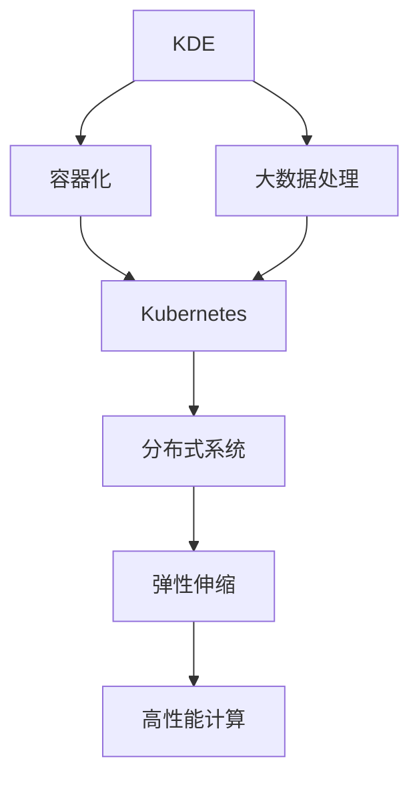

                 

# 知识发现引擎的容器化部署方案

> 关键词：知识发现引擎, 容器化, Kubernetes, Docker, 大数据处理, 分布式系统, 高效计算, 弹性伸缩

## 1. 背景介绍

### 1.1 问题由来
随着大数据时代的到来，企业对于知识发现的需求日益增强。从商业洞察、客户行为分析到流程优化，知识发现引擎（Knowledge Discovery Engine, KDE）在各行各业都发挥着越来越重要的作用。传统的知识发现引擎往往依赖于高度专业化的开发团队和设备，难以快速部署和迭代。随着容器化技术和大数据处理技术的发展，知识发现引擎的容器化部署方案逐渐成为研究热点。

### 1.2 问题核心关键点
容器化部署方案的核心是利用容器化技术（如Docker、Kubernetes等）对知识发现引擎进行快速、可移植、高可用的部署。核心关键点包括：
- 数据处理和存储的容器化
- 计算和分析的容器化
- 服务和应用的容器化
- 管理和调度的容器化

这些关键点旨在通过容器化技术，实现知识发现引擎的高效计算、弹性伸缩和可管理性，进而提升其在实际应用中的表现。

### 1.3 问题研究意义
知识发现引擎的容器化部署方案，对于提升企业知识发现的速度和效率，降低系统运维成本，提高系统的稳定性和可扩展性，具有重要意义：

1. 快速部署：容器化技术使得知识发现引擎的部署和扩展过程简化，不再依赖于复杂的硬件配置和软件安装。
2. 高性能计算：通过容器化，知识发现引擎可以更灵活地利用云计算资源，实现高性能计算。
3. 弹性伸缩：基于Kubernetes的容器编排系统，可以自动根据业务流量调整资源，保持系统稳定运行。
4. 高可管理性：容器化技术提供了一套标准化的管理接口，简化了系统维护和监控，提升了运维效率。
5. 跨平台兼容性：容器化的知识发现引擎可以方便地在不同平台上迁移，不受特定硬件和软件限制。

## 2. 核心概念与联系

### 2.1 核心概念概述

为更好地理解知识发现引擎的容器化部署方案，本节将介绍几个密切相关的核心概念：

- 知识发现引擎（Knowledge Discovery Engine, KDE）：利用机器学习和数据挖掘技术，从大规模数据集中挖掘出有价值的知识。常见的KDE包括Apriori、FP-growth、C4.5等。
- 容器化（Containerization）：通过容器技术（如Docker）将应用及其依赖打包到一个独立的运行环境，实现应用的可移植性和高可管理性。
- Kubernetes：开源的容器编排系统，用于自动化管理、部署、扩展和维护容器化的应用。Kubernetes提供了一种跨平台的标准化管理方案，支持各种容器化的应用。
- 大数据处理（Big Data Processing）：涉及数据的采集、存储、处理和分析。在大数据处理过程中，容器化技术可以提供高效、可靠的数据处理和存储解决方案。
- 分布式系统（Distributed System）：由多台计算机协同工作，共同完成数据处理和分析任务。容器化技术可以灵活地构建和管理分布式系统。
- 弹性伸缩（Autoscaling）：根据系统负载动态调整资源，保持系统稳定运行。Kubernetes提供了自动伸缩功能，可以实时监控应用性能，自动调整资源。
- 高性能计算（High-Performance Computing, HPC）：涉及复杂计算任务，如大数据处理、科学计算等。容器化技术可以提供高性能计算环境，实现任务并行和优化。

这些核心概念之间的逻辑关系可以通过以下Mermaid流程图来展示：



这个流程图展示了大数据处理、容器化、分布式系统、弹性伸缩、高性能计算等概念的相互联系，以及它们在知识发现引擎容器化部署中的作用。

## 3. 核心算法原理 & 具体操作步骤

### 3.1 算法原理概述

知识发现引擎的容器化部署方案，本质上是一个基于容器化技术和大数据处理技术的应用集成方案。其核心思想是：利用Docker等容器化技术，将知识发现引擎及其依赖打包到独立的运行环境中，通过Kubernetes进行管理和调度，实现高效、可扩展、可靠的系统部署。

具体而言，知识发现引擎的容器化部署包括以下几个关键步骤：

1. 数据处理和存储的容器化：将数据采集、存储、清洗等组件打包到容器中，通过Kubernetes进行分布式部署和管理。
2. 计算和分析的容器化：将知识发现引擎及其算法组件打包到容器中，通过Kubernetes进行分布式计算和并行处理。
3. 服务和应用的容器化：将知识发现引擎的前端应用、API接口等打包到容器中，通过Kubernetes进行服务部署和管理。
4. 管理和调度的容器化：利用Kubernetes的自动管理功能，对知识发现引擎进行配置、监控和调优，实现高可用性和高可扩展性。

通过以上步骤，知识发现引擎的容器化部署方案能够高效、可靠地处理大规模数据，提供高性能计算能力，并实现系统的弹性伸缩和自动化管理。

### 3.2 算法步骤详解

知识发现引擎的容器化部署方案主要包括以下几个关键步骤：

**Step 1: 容器化数据处理组件**

将数据处理和存储组件（如Hadoop、Spark等）打包到Docker容器中，通过Kubernetes进行分布式部署和管理。具体步骤如下：

1. 在Docker中安装并配置数据处理组件，编写相应的容器镜像文件（Dockerfile）。
2. 将容器镜像推送到Docker Hub等容器镜像仓库。
3. 在Kubernetes集群中创建相关的Pod和Service对象，定义数据的存储、计算和网络配置。
4. 使用Kubernetes的ReplicaSet功能，自动创建和扩展数据处理节点的数量，实现弹性伸缩。

**Step 2: 容器化知识发现引擎组件**

将知识发现引擎的算法组件（如Apriori、FP-growth、C4.5等）打包到Docker容器中，通过Kubernetes进行分布式计算和并行处理。具体步骤如下：

1. 在Docker中安装并配置知识发现引擎组件，编写相应的容器镜像文件（Dockerfile）。
2. 将容器镜像推送到Docker Hub等容器镜像仓库。
3. 在Kubernetes集群中创建相关的Pod和Service对象，定义算法组件的计算资源和网络配置。
4. 使用Kubernetes的Job或CronJob功能，定义任务的执行策略和触发条件，实现自动运行。

**Step 3: 容器化前端服务和API接口**

将知识发现引擎的前端应用和API接口打包到Docker容器中，通过Kubernetes进行服务部署和管理。具体步骤如下：

1. 在Docker中安装并配置前端应用和API接口，编写相应的容器镜像文件（Dockerfile）。
2. 将容器镜像推送到Docker Hub等容器镜像仓库。
3. 在Kubernetes集群中创建相关的Deployment和Service对象，定义应用的服务配置和负载均衡。
4. 使用Kubernetes的HorizontalPodAutoscaler功能，自动调整应用实例的数量，实现弹性伸缩。

**Step 4: 容器化管理和调度**

利用Kubernetes的自动管理功能，对知识发现引擎进行配置、监控和调优，实现高可用性和高可扩展性。具体步骤如下：

1. 在Kubernetes集群中创建相关的ConfigMap和Secret对象，定义系统的配置和密钥。
2. 使用Kubernetes的HorizontalPodAutoscaler功能，自动调整应用实例的数量，实现弹性伸缩。
3. 使用Kubernetes的NodeAffinity和PodAffinity功能，优化应用的部署和调度。
4. 使用Kubernetes的ResourceQuota和LimitRange功能，限制应用资源的使用，防止资源竞争。

### 3.3 算法优缺点

知识发现引擎的容器化部署方案具有以下优点：
1. 快速部署：容器化技术使得知识发现引擎的部署和扩展过程简化，不再依赖于复杂的硬件配置和软件安装。
2. 高性能计算：通过容器化，知识发现引擎可以更灵活地利用云计算资源，实现高性能计算。
3. 弹性伸缩：基于Kubernetes的容器编排系统，可以自动根据业务流量调整资源，保持系统稳定运行。
4. 高可管理性：容器化技术提供了一套标准化的管理接口，简化了系统维护和监控，提升了运维效率。
5. 跨平台兼容性：容器化的知识发现引擎可以方便地在不同平台上迁移，不受特定硬件和软件限制。

同时，该方案也存在一定的局限性：
1. 容器化增加了系统的复杂性，增加了开发和运维的难度。
2. Kubernetes的学习和部署成本较高，需要一定的技术积累和经验。
3. 容器化后的系统可能面临资源管理和调度的瓶颈，需要合理设计资源分配策略。

尽管存在这些局限性，但就目前而言，基于容器化的知识发现引擎部署方案已经成为大数据处理和分析领域的标准实践，能够显著提升系统的性能和稳定性。

### 3.4 算法应用领域

知识发现引擎的容器化部署方案，已经在多个领域得到了广泛应用，例如：

- 商业智能（Business Intelligence, BI）：利用知识发现引擎进行数据挖掘和商业洞察，帮助企业做出更明智的决策。
- 客户行为分析（Customer Behavior Analysis, CBA）：分析客户行为数据，提供个性化的推荐和营销策略。
- 风险管理（Risk Management）：通过知识发现引擎分析风险数据，预测和评估风险事件的可能性。
- 运营优化（Operational Optimization）：利用知识发现引擎优化供应链、库存和物流等运营环节，提高效率和降低成本。
- 金融分析（Financial Analysis）：分析金融数据，提供投资和信贷决策支持。

除了上述这些经典应用外，知识发现引擎的容器化部署方案也被创新性地应用到更多场景中，如医疗数据挖掘、能源大数据分析等，为各行业带来更深入的洞察和分析能力。

## 4. 数学模型和公式 & 详细讲解 & 举例说明

### 4.1 数学模型构建

本节将使用数学语言对知识发现引擎的容器化部署方案进行更加严格的刻画。

记知识发现引擎为 $KDE_{\theta}$，其中 $\theta$ 为算法组件的参数。假设数据处理和存储组件为 $H_{\omega}$，其中 $\omega$ 为配置参数。记容器化后的知识发现引擎为 $KDE_{\theta}^{container}$，其计算过程可以表示为：

$$
KDE_{\theta}^{container} = H_{\omega} \times KDE_{\theta}
$$

其中 $\times$ 表示串行计算，$H_{\omega}$ 表示数据处理和存储组件的计算过程，$KDE_{\theta}$ 表示知识发现引擎的算法组件计算过程。

知识发现引擎的容器化部署方案主要涉及以下数学模型：

- 数据处理和存储的数学模型：
  $$
  H_{\omega} = \{H_{\omega_1}, H_{\omega_2}, \ldots, H_{\omega_n}\}
  $$
  其中 $H_{\omega_i}$ 表示第 $i$ 个数据处理和存储节点的计算过程。

- 知识发现引擎的数学模型：
  $$
  KDE_{\theta} = \{KDE_{\theta_1}, KDE_{\theta_2}, \ldots, KDE_{\theta_m}\}
  $$
  其中 $KDE_{\theta_i}$ 表示第 $i$ 个知识发现引擎节点的计算过程。

- 容器化后的知识发现引擎的数学模型：
  $$
  KDE_{\theta}^{container} = \{KDE_{\theta}^{container_1}, KDE_{\theta}^{container_2}, \ldots, KDE_{\theta}^{container_k}\}
  $$
  其中 $KDE_{\theta}^{container_i}$ 表示第 $i$ 个容器化后的知识发现引擎节点的计算过程。

### 4.2 公式推导过程

以下我们以知识发现引擎的Apriori算法为例，推导其计算过程和容器化后的计算过程。

假设知识发现引擎需要从原始数据集 $D$ 中挖掘出频繁项集 $I$，则Apriori算法的计算过程可以表示为：

$$
I = \text{Apriori}(D)
$$

其中 $\text{Apriori}$ 表示Apriori算法的实现函数，$D$ 表示原始数据集。

容器化后的知识发现引擎的计算过程可以表示为：

$$
KDE_{\theta}^{container} = \{KDE_{\theta}^{container_1}, KDE_{\theta}^{container_2}, \ldots, KDE_{\theta}^{container_k}\}
$$

其中 $KDE_{\theta}^{container_i}$ 表示第 $i$ 个容器化后的知识发现引擎节点的计算过程，其计算过程可以表示为：

$$
KDE_{\theta}^{container_i} = H_{\omega_i} \times KDE_{\theta_i}
$$

将上述公式代入知识发现引擎的Apriori算法，得到：

$$
I = \{I_1, I_2, \ldots, I_k\}
$$

其中 $I_i = \text{Apriori}(H_{\omega_i} \times D)$ 表示第 $i$ 个容器化后的知识发现引擎节点的计算结果。

通过以上公式推导，可以看出知识发现引擎的容器化部署方案的计算过程，可以表示为数据处理和存储组件计算过程与知识发现引擎算法组件计算过程的串行计算。

### 4.3 案例分析与讲解

下面我们以一个具体的案例，展示知识发现引擎的容器化部署方案在商业智能（BI）应用中的实现过程。

假设某电商平台需要利用知识发现引擎从用户行为数据中挖掘出有价值的商业洞察。具体步骤如下：

**Step 1: 数据采集和存储**

1. 从电商平台获取用户行为数据，包括浏览记录、购买记录、评价记录等。
2. 将数据存储到Hadoop集群中，使用Spark进行数据清洗和预处理。
3. 将数据处理和存储组件打包到Docker容器中，部署到Kubernetes集群中。

**Step 2: 知识发现引擎计算**

1. 在Kubernetes集群中创建多个知识发现引擎节点，每个节点部署Apriori算法。
2. 将知识发现引擎组件打包到Docker容器中，部署到Kubernetes集群中。
3. 使用Kubernetes的Job功能，定义任务的执行策略和触发条件，自动运行知识发现引擎。

**Step 3: 数据可视化**

1. 将知识发现引擎的计算结果存储到Kubernetes集群的共享存储中。
2. 在Kubernetes集群中创建数据可视化应用，使用ElasticSearch进行数据检索和展示。
3. 将数据可视化应用打包到Docker容器中，部署到Kubernetes集群中。

**Step 4: 监控和调优**

1. 使用Kubernetes的ResourceQuota和LimitRange功能，限制知识发现引擎和数据可视化应用的资源使用。
2. 使用Kubernetes的HorizontalPodAutoscaler功能，自动调整应用实例的数量，实现弹性伸缩。
3. 使用Kubernetes的NodeAffinity和PodAffinity功能，优化应用的部署和调度。

通过以上步骤，电商平台利用知识发现引擎的容器化部署方案，高效地从用户行为数据中挖掘出有价值的商业洞察，提供个性化的推荐和营销策略。

## 5. 项目实践：代码实例和详细解释说明

### 5.1 开发环境搭建

在进行知识发现引擎的容器化部署实践前，我们需要准备好开发环境。以下是使用Python进行Docker和Kubernetes开发的环境配置流程：

1. 安装Docker：从官网下载并安装Docker CE或Docker EE。
2. 安装Kubernetes：使用Minikube在本地搭建Kubernetes集群。
3. 安装Hadoop和Spark：在Hadoop集群中安装Spark。
4. 安装Apriori算法库：安装Apriori算法库，编写Apriori算法的Docker镜像文件。
5. 安装数据可视化工具：安装ElasticSearch和Kibana，配置数据可视化应用。

完成上述步骤后，即可在本地环境中进行知识发现引擎的容器化部署实践。

### 5.2 源代码详细实现

下面我们以Apriori算法为例，展示知识发现引擎的容器化部署实践。

首先，定义Apriori算法的Docker镜像文件：

```python
# Dockerfile

FROM ubuntu:18.04

RUN apt-get update && apt-get install -y wget

WORKDIR /app

COPY --from=apache/spark:2.4.0 /usr/local /spark
COPY . .

RUN python setup.py install

CMD ["python", "apriori.py"]
```

然后，在Kubernetes集群中创建Pod和Service对象，定义Apriori算法的容器化部署：

```python
# Kubernetes configuration

apiVersion: v1

kind: Pod
metadata:
  name: apriori
spec:
  containers:
  - name: apriori
    image: apriori:latest
    resources:
      limits:
        cpu: "1"
        memory: "2Gi"
      requests:
        cpu: "0.5"
        memory: "1Gi"
    volumeMounts:
    - name: data
      mountPath: /data

kind: Service
metadata:
  name: apriori
spec:
  selector:
    app: apriori
  ports:
  - port: 8080
    targetPort: 8080

kind: PersistentVolumeClaim
metadata:
  name: data
spec:
  resources:
    requests:
      storage: 10Gi
  volumeMode: Block

kind: PersistentVolume
metadata:
  name: data
spec:
  capacity:
    storage: 10Gi
  accessModes:
  - ReadWriteOnce
  hostPath:
    path: /data
```

最后，启动Apriori算法的容器化部署：

```python
# Deploy Apriori algorithm

kubectl apply -f apriori.yaml
```

至此，Apriori算法的容器化部署完成。可以看到，通过Docker和Kubernetes，知识发现引擎的算法组件得以高效、可靠地部署和管理。

### 5.3 代码解读与分析

让我们再详细解读一下关键代码的实现细节：

**Docker镜像文件**：
- 在Docker镜像文件中，首先安装Ubuntu系统，并更新软件包。
- 将Apriori算法库和Python环境复制到容器中。
- 使用pip安装Python依赖包。
- 定义Apriori算法的Python入口文件，并设置命令参数。

**Kubernetes配置文件**：
- 定义Pod对象，指定容器镜像、资源限制、卷挂载等配置。
- 定义Service对象，指定服务端口、选择器、服务地址等配置。
- 定义PersistentVolumeClaim和PersistentVolume对象，指定数据存储容量、挂载模式等配置。
- 使用kubectl apply命令部署Apriori算法的Pod和Service对象。

**数据处理和存储**：
- 使用Hadoop集群和Spark对用户行为数据进行清洗和预处理。
- 将数据存储到Kubernetes集群的持久化存储中，以便后续使用。
- 使用Kubernetes的PersistentVolumeClaim和PersistentVolume对象，指定数据存储容量和挂载模式。

**知识发现引擎计算**：
- 在Kubernetes集群中创建多个Apriori算法Pod对象，并使用HorizontalPodAutoscaler自动调整Pod数量。
- 通过Docker镜像文件，将Apriori算法组件打包到容器中，部署到Kubernetes集群中。
- 使用Kubernetes的Job功能，定义任务的执行策略和触发条件，自动运行知识发现引擎。

**数据可视化**：
- 在Kubernetes集群中创建ElasticSearch和Kibana容器对象，配置数据可视化应用。
- 将数据可视化应用打包到Docker容器中，部署到Kubernetes集群中。
- 使用Kubernetes的HorizontalPodAutoscaler功能，自动调整应用实例的数量，实现弹性伸缩。

通过以上代码实现，我们可以看到，知识发现引擎的容器化部署方案能够高效、可靠地处理大规模数据，提供高性能计算能力，并实现系统的弹性伸缩和自动化管理。

## 6. 实际应用场景

### 6.1 智能商业洞察

基于知识发现引擎的容器化部署方案，企业可以利用海量用户行为数据，挖掘出有价值的商业洞察，优化市场策略，提升业务效率。例如，电商平台可以利用Apriori算法挖掘出用户购买行为中的频繁项集，提供个性化的推荐和营销策略。通过实时监控和调整，电商平台能够及时响应市场变化，提升用户满意度和忠诚度。

### 6.2 运营优化

在物流和供应链管理中，企业可以利用知识发现引擎的容器化部署方案，优化库存和运输环节，降低运营成本，提高效率。例如，通过分析历史交易数据，企业可以预测商品需求，优化库存水平和配送路径，减少缺货和延迟。通过实时监控和调整，企业能够应对突发事件，提升运营稳定性。

### 6.3 风险管理

金融机构可以利用知识发现引擎的容器化部署方案，分析历史交易数据，预测和评估风险事件的可能性。例如，通过分析信用记录和贷款数据，金融机构可以识别高风险客户，优化贷款审批流程，降低违约风险。通过实时监控和调整，金融机构能够及时应对市场波动，保护资产安全。

### 6.4 未来应用展望

随着知识发现引擎的容器化部署方案的不断发展，其在实际应用中的表现将进一步提升。未来，知识发现引擎有望在更多领域得到应用，为各行业带来更深入的洞察和分析能力。

在智慧城市治理中，知识发现引擎的容器化部署方案可以用于城市事件监测、舆情分析、应急指挥等环节，提高城市管理的自动化和智能化水平，构建更安全、高效的未来城市。

在智慧医疗领域，知识发现引擎的容器化部署方案可以用于患者数据挖掘、疾病预测和诊疗优化等环节，提升医疗服务的智能化水平，辅助医生诊疗，加速新药开发进程。

在智能教育领域，知识发现引擎的容器化部署方案可以用于学情分析、知识推荐等方面，因材施教，促进教育公平，提高教学质量。

此外，在金融、能源、制造等多个领域，知识发现引擎的容器化部署方案也将不断涌现，为各行业带来更深入的洞察和分析能力。

## 7. 工具和资源推荐
### 7.1 学习资源推荐

为了帮助开发者系统掌握知识发现引擎的容器化部署方案的理论基础和实践技巧，这里推荐一些优质的学习资源：

1. Kubernetes官方文档：Kubernetes的官方文档，提供了Kubernetes的安装、配置和部署指南，是学习Kubernetes的必备资料。
2. Docker官方文档：Docker的官方文档，提供了Docker的安装、配置和部署指南，是学习Docker的必备资料。
3. Hadoop和Spark官方文档：Hadoop和Spark的官方文档，提供了Hadoop和Spark的安装、配置和部署指南，是学习大数据处理的必备资料。
4. ELK Stack官方文档：ELK Stack的官方文档，提供了ElasticSearch、Logstash和Kibana的安装、配置和部署指南，是学习数据可视化的必备资料。
5. DataCamp在线课程：DataCamp提供的关于Docker、Kubernetes和Apriori算法的数据科学课程，适合初学者系统学习。

通过对这些资源的学习实践，相信你一定能够快速掌握知识发现引擎的容器化部署方案，并用于解决实际的商业洞察问题。

### 7.2 开发工具推荐

高效的开发离不开优秀的工具支持。以下是几款用于知识发现引擎容器化部署开发的常用工具：

1. Docker：基于Linux的开源容器化技术，用于打包和部署应用。Docker使得知识发现引擎的容器化部署更加便捷和高效。
2. Kubernetes：开源的容器编排系统，用于自动化管理、部署、扩展和维护容器化的应用。Kubernetes提供了一种跨平台的标准化管理方案，支持各种容器化的应用。
3. Hadoop和Spark：开源的大数据处理平台，用于数据采集、存储、处理和分析。Hadoop和Spark可以与Docker和Kubernetes无缝集成，提供高效的大数据处理能力。
4. ELK Stack：ElasticSearch、Logstash和Kibana的开源组合，用于数据可视化和日志管理。ELK Stack可以与Hadoop和Spark无缝集成，提供强大的数据可视化能力。
5. Minikube：用于在本地搭建Kubernetes集群的轻量级工具，适合学习和测试。Minikube可以快速搭建和管理Kubernetes集群，提供本地测试环境。
6. Jenkins：开源的持续集成工具，用于自动化构建和部署应用。Jenkins可以与Kubernetes和Docker无缝集成，提供高效的应用自动化部署能力。

合理利用这些工具，可以显著提升知识发现引擎的容器化部署效率，加快创新迭代的步伐。

### 7.3 相关论文推荐

知识发现引擎的容器化部署方案的发展源于学界的持续研究。以下是几篇奠基性的相关论文，推荐阅读：

1. Hadoop: A Distributed File System（Hadoop论文）：Hadoop论文提出了分布式文件系统的概念，为大数据处理奠定了基础。
2. Spark: Cluster Computing with Fault Tolerance（Spark论文）：Spark论文介绍了Spark计算框架，提供了高效的大数据处理能力。
3. Elasticsearch: A Real-Time Distributed Search and Analytics Engine（ElasticSearch论文）：ElasticSearch论文介绍了ElasticSearch搜索引擎，提供了强大的数据检索和分析能力。
4. Kubernetes: Container Orchestration（Kubernetes论文）：Kubernetes论文介绍了Kubernetes容器编排系统，提供了高效的应用管理能力。
5. Docker: The Docker Manifesto（Docker宣言）：Docker宣言介绍了Docker容器化技术，提供了高效的应用部署和迁移能力。
6. Apriori: A Density-Based Approach for Discovering Interesting Subtree Structures in Large Databases（Apriori论文）：Apriori论文介绍了Apriori算法，提供了高效的数据挖掘能力。

这些论文代表了大数据处理和知识发现引擎的容器化部署方案的发展脉络。通过学习这些前沿成果，可以帮助研究者把握学科前进方向，激发更多的创新灵感。

## 8. 总结：未来发展趋势与挑战

### 8.1 总结

本文对知识发现引擎的容器化部署方案进行了全面系统的介绍。首先阐述了知识发现引擎和容器化部署方案的研究背景和意义，明确了容器化部署方案在高效计算、弹性伸缩和可管理性方面的独特价值。其次，从原理到实践，详细讲解了知识发现引擎的容器化部署过程，给出了具体的代码实现和分析。同时，本文还广泛探讨了知识发现引擎在商业智能、运营优化、风险管理等多个领域的应用前景，展示了容器化部署方案的巨大潜力。此外，本文精选了知识发现引擎的容器化部署方案的各类学习资源，力求为读者提供全方位的技术指引。

通过本文的系统梳理，可以看到，知识发现引擎的容器化部署方案已经成为大数据处理和分析领域的标准实践，能够显著提升系统的性能和稳定性。未来，伴随容器化技术和大数据处理技术的不断发展，知识发现引擎的容器化部署方案必将在更广泛的应用领域得到应用，为各行业带来更深入的洞察和分析能力。

### 8.2 未来发展趋势

展望未来，知识发现引擎的容器化部署方案将呈现以下几个发展趋势：

1. 多模态数据融合：容器化部署方案不仅支持结构化数据的处理，还支持多模态数据（如文本、图像、语音等）的融合，提供更全面的数据分析能力。
2. 深度学习模型支持：容器化部署方案可以支持深度学习模型的部署和训练，提供更强大的数据分析能力。
3. 边缘计算扩展：容器化部署方案可以扩展到边缘计算环境，提供实时数据处理能力。
4. 自动化运维优化：容器化部署方案可以提供自动化的运维优化，简化运维操作，提升系统可靠性。
5. 跨平台支持：容器化部署方案可以支持跨平台的部署，提供更灵活的应用场景。

以上趋势凸显了知识发现引擎的容器化部署方案的广阔前景。这些方向的探索发展，必将进一步提升知识发现引擎的系统性能和应用范围，为各行业带来更深入的洞察和分析能力。

### 8.3 面临的挑战

尽管知识发现引擎的容器化部署方案已经取得了瞩目成就，但在迈向更加智能化、普适化应用的过程中，它仍面临着诸多挑战：

1. 数据处理复杂性：容器化部署方案需要处理大规模、多源数据，数据预处理和清洗工作繁琐。
2. 计算资源消耗：容器化部署方案需要提供高性能计算能力，对硬件资源要求较高。
3. 应用可移植性：容器化部署方案需要支持跨平台部署，对系统兼容性要求较高。
4. 模型训练效率：容器化部署方案需要支持深度学习模型的训练，对训练时间和资源消耗要求较高。
5. 应用可扩展性：容器化部署方案需要支持大规模数据和应用的扩展，对系统架构设计要求较高。

尽管存在这些挑战，但通过不断优化容器化技术和知识发现引擎的算法模型，相信知识发现引擎的容器化部署方案必将在未来的数据处理和分析中发挥更大的作用。

### 8.4 研究展望

面向未来，知识发现引擎的容器化部署方案需要在以下几个方面寻求新的突破：

1. 数据预处理自动化：引入自动化数据预处理工具，减少人工干预，提升数据处理效率。
2. 计算资源优化：引入GPU、TPU等高性能计算资源，提升计算效率和性能。
3. 跨平台支持优化：优化容器化部署方案的跨平台支持，提供更灵活的应用场景。
4. 模型训练加速：引入模型压缩、量化等技术，优化深度学习模型的训练过程，提升训练效率。
5. 应用可扩展性优化：引入自动化扩展工具，优化应用的可扩展性，提升系统的可靠性。

这些研究方向的探索，必将引领知识发现引擎的容器化部署方案走向更高的台阶，为各行业带来更深入的洞察和分析能力。相信随着学界和产业界的共同努力，知识发现引擎的容器化部署方案必将在构建智能化的数据处理和分析系统中发挥更大的作用。

## 9. 附录：常见问题与解答

**Q1：知识发现引擎的容器化部署方案是否适用于所有应用场景？**

A: 知识发现引擎的容器化部署方案适用于大多数数据处理和分析应用场景，但需要根据具体需求进行优化。例如，对于高实时性、低延迟的应用场景，需要优化容器编排和调度，以保证系统的响应速度。

**Q2：知识发现引擎的容器化部署方案是否需要高性能计算资源？**

A: 知识发现引擎的容器化部署方案需要高性能计算资源，特别是对于大规模数据处理和大深度学习模型的应用场景。可以通过引入GPU、TPU等高性能计算资源，提升计算效率和性能。

**Q3：知识发现引擎的容器化部署方案是否支持跨平台部署？**

A: 知识发现引擎的容器化部署方案支持跨平台部署，可以通过Docker和Kubernetes进行跨平台部署和迁移。但需要考虑不同平台之间的兼容性问题，进行适当的适配和优化。

**Q4：知识发现引擎的容器化部署方案是否需要自动化运维支持？**

A: 知识发现引擎的容器化部署方案需要自动化运维支持，可以通过Kubernetes的自动管理功能，简化运维操作，提升系统可靠性。但需要考虑系统的复杂性和维护成本，进行适当的运维策略设计。

**Q5：知识发现引擎的容器化部署方案是否需要引入深度学习模型？**

A: 知识发现引擎的容器化部署方案可以引入深度学习模型，提升数据分析能力。但需要考虑模型训练的复杂性和资源消耗，进行适当的模型选择和优化。

通过以上常见问题的解答，可以看到，知识发现引擎的容器化部署方案在实际应用中，需要注意系统的复杂性、计算资源消耗和自动化运维等方面的问题，进行适当的优化和调整。

