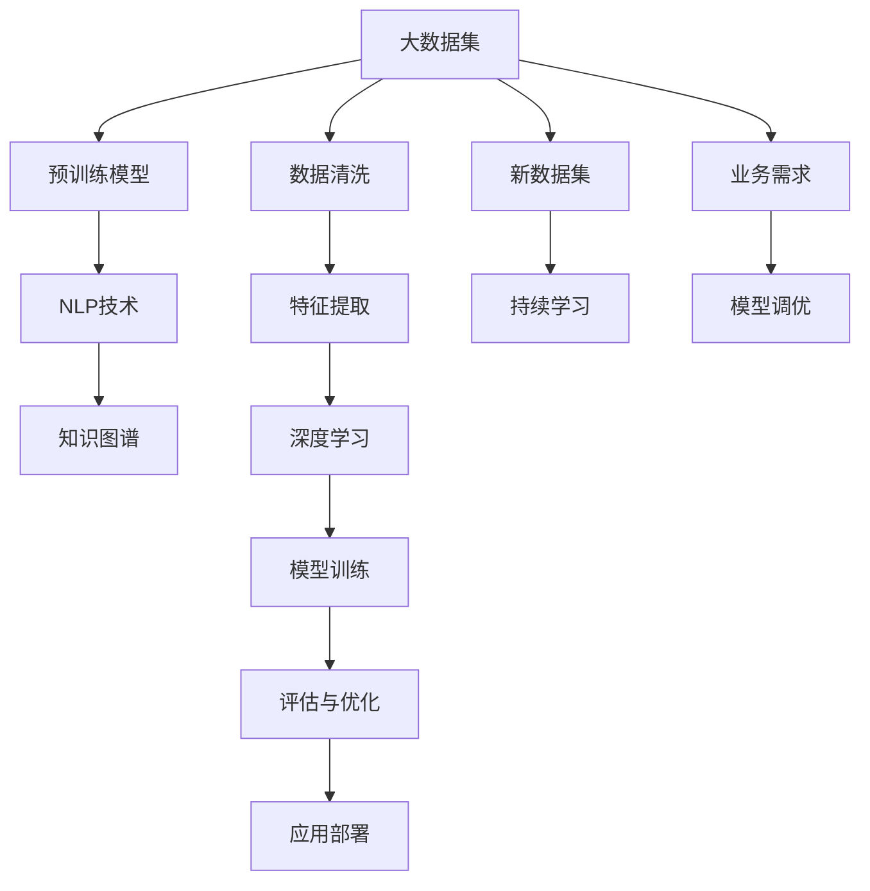

                 

## 1. 背景介绍

### 1.1 问题由来

当前，人类知识总量呈爆炸式增长，仅需数秒即可生成海量数据。然而，知识本身无法直接转化为现实生产力和竞争力，需要通过有效的技术手段来发现、理解和应用。传统的信息检索和知识管理技术，如关系型数据库、搜索引擎等，已无法满足现代知识应用场景的需求。基于人工智能的知识发现引擎，通过深度学习、自然语言处理等技术，挖掘大数据中的潜在知识，从而助力企业及科研机构快速响应市场变化，提升核心竞争力。

### 1.2 问题核心关键点

- **数据质量**：知识发现的质量很大程度上依赖于数据的质量和代表性，因此数据清洗和预处理是关键。
- **算法选择**：选择合适的算法是知识发现的另一核心问题，不同的算法适用于不同的数据特性和业务场景。
- **模型训练**：模型需要充分训练，并能够泛化到新数据。
- **结果评估**：如何客观评估知识发现结果的准确性和实用性，是检验模型性能的重要指标。

### 1.3 问题研究意义

知识发现引擎的研发与应用，对于企业知识管理、科研知识挖掘、智慧城市建设等领域具有重要意义：

- 降低知识管理成本。通过自动化技术，将知识管理从手动操作转变为智能决策，大幅降低人力成本。
- 提升知识应用效率。发现隐藏在数据中的知识，转化为有用的决策信息，提高业务响应速度。
- 促进知识创新。知识发现引擎能够识别和整合跨学科的知识，助力创新。
- 赋能智慧决策。通过大数据分析，辅助决策者发现潜在规律，进行科学决策。
- 驱动产业升级。提升知识应用水平，促进产业数字化转型，驱动经济高质量发展。

## 2. 核心概念与联系

### 2.1 核心概念概述

- **知识发现引擎**：基于人工智能技术的自动化知识发现系统，可以从海量数据中自动抽取、整理、融合知识，生成结构化、易于利用的知识库。
- **预训练模型**：使用大规模无标签数据进行预训练，学习通用知识表示的模型，如BERT、GPT等。
- **自然语言处理(NLP)**：使用深度学习模型处理和分析文本数据的自然语言处理技术。
- **深度学习**：通过多层神经网络结构，自动学习数据特征并进行分类、回归、聚类等任务。
- **知识图谱**：将数据结构化表示为图的形式，可视化知识之间的关联。

### 2.2 核心概念原理和架构的 Mermaid 流程图



这个流程图展示了知识发现引擎的核心工作流程：

1. 从大数据集中清洗数据，并进行特征提取。
2. 利用预训练模型进行知识抽取和表示。
3. 通过NLP技术对文本进行处理和分析。
4. 应用深度学习模型对特征进行建模，构建知识图谱。
5. 通过模型训练和评估优化模型，并进行持续学习。
6. 将训练好的模型应用到业务场景中。

## 3. 核心算法原理 & 具体操作步骤

### 3.1 算法原理概述

知识发现引擎的核心原理是深度学习和自然语言处理，通过预训练模型进行特征提取，再通过深度学习模型对特征进行建模，最终构建知识图谱并输出结果。这一过程包括数据预处理、特征表示、模型训练和结果评估四个主要步骤。

### 3.2 算法步骤详解

**步骤1：数据预处理**

- **清洗数据**：去除缺失值、重复数据、错误信息等，保证数据质量。
- **归一化**：对数值型数据进行归一化，便于后续处理。
- **标注数据**：对文本数据进行分词、词性标注、命名实体识别等。

**步骤2：特征表示**

- **嵌入**：使用词嵌入或预训练模型，将文本转换为向量表示。
- **编码**：使用深度学习模型对向量进行编码，得到更高级的特征表示。
- **融合**：将不同来源的知识进行融合，构建综合特征。

**步骤3：模型训练**

- **构建网络结构**：选择合适的深度学习模型，如卷积神经网络(CNN)、循环神经网络(RNN)、Transformer等。
- **定义损失函数**：根据业务需求，定义合适的损失函数，如交叉熵损失、均方误差等。
- **训练模型**：使用优化器如Adam、SGD等，最小化损失函数，训练模型参数。
- **正则化**：应用L2正则化、Dropout等技术，避免过拟合。

**步骤4：结果评估**

- **交叉验证**：使用交叉验证技术评估模型性能，确保泛化能力。
- **指标计算**：计算准确率、召回率、F1-score等指标，评估模型效果。
- **可视化**：将结果可视化，便于业务人员理解。

### 3.3 算法优缺点

**优点：**

- **自动发现知识**：能够自动识别和发现数据中的潜在知识，无需手动提取。
- **高效性**：算法并行化程度高，适用于大规模数据处理。
- **易于部署**：模型训练和推理过程标准化，易于部署到生产环境中。

**缺点：**

- **数据依赖性高**：数据质量直接影响结果，数据预处理耗时较多。
- **算法复杂度高**：深度学习模型计算量大，训练时间长。
- **结果可解释性不足**：模型复杂，难以解释和调试。

### 3.4 算法应用领域

知识发现引擎可以应用于多个领域，包括但不限于：

- **金融知识管理**：挖掘金融市场数据中的投资策略、风险评估信息。
- **医疗知识发现**：从医疗记录中提取疾病诊断、治疗方案等知识。
- **科学研究**：发现科学论文中的关键结论和引用关系，加速研究进展。
- **智能客服**：分析客户咨询记录，提炼常见问题和解决方案。
- **智慧城市**：分析城市数据，发现城市运行规律，优化资源配置。

## 4. 数学模型和公式 & 详细讲解 & 举例说明

### 4.1 数学模型构建

以金融知识发现为例，假设输入数据为交易记录，输出为投资策略、风险评估等知识。知识发现引擎的数学模型可以表示为：

- **输入**：$x \in \mathbb{R}^d$，表示交易记录特征。
- **输出**：$y \in \mathbb{R}^k$，表示投资策略或风险评估。

### 4.2 公式推导过程

使用Transformer模型进行特征编码和知识表示，以解决非线性关系和多模态数据处理问题。Transformer模型由多个自注意力机制和前馈神经网络组成。设编码器输入为$x$，编码器输出为$h$，解码器输出为$y$。

**编码器部分**：

$$
h = \text{Transformer}(x)
$$

其中$\text{Transformer}$表示自注意力和前馈神经网络的序列建模过程。

**解码器部分**：

$$
y = \text{Transformer}(h)
$$

解码器同样由多个自注意力机制和前馈神经网络组成，对输入特征$h$进行进一步处理。

**知识图谱构建**：

$$
\text{KGE}(h, y)
$$

其中$\text{KGE}$表示知识图谱嵌入模型，将特征$h$和输出$y$映射到知识图谱中的节点。

### 4.3 案例分析与讲解

以医疗知识发现为例，使用医疗电子病历数据，提取疾病诊断信息。输入为病历文本，输出为诊断结果。

假设病历文本$x$表示为$x = (x_1, x_2, \dots, x_n)$，其中$x_i$为文本的第$i$个词。

**预处理**：
- **分词**：将文本分词，得到词汇列表$W$。
- **词嵌入**：使用预训练模型如BERT，将词汇列表$W$转换为向量表示$E$。

**编码**：
- **自注意力机制**：使用Transformer模型，将向量表示$E$输入编码器，得到特征表示$h$。
- **多模态融合**：将临床数据、实验室数据等补充信息与文本特征$h$进行融合，得到综合特征$H$。

**解码**：
- **分类器**：使用全连接神经网络对综合特征$H$进行分类，得到诊断结果$y$。

**评估**：
- **交叉验证**：使用交叉验证评估模型性能，确保泛化能力。
- **指标计算**：计算准确率、召回率、F1-score等指标。

## 5. 项目实践：代码实例和详细解释说明

### 5.1 开发环境搭建

- **Python环境**：安装Python 3.7及以上版本，安装必要的依赖包如numpy、pandas、scikit-learn等。
- **深度学习框架**：安装TensorFlow或PyTorch，以及对应的模型库如TensorFlow Hub、HuggingFace Transformers等。
- **数据处理工具**：安装pandas、NumPy、nltk等，用于数据清洗、特征提取等。

### 5.2 源代码详细实现

以下是一个使用PyTorch进行医疗知识发现的代码示例：

```python
import torch
import torch.nn as nn
import torch.optim as optim
from transformers import BertTokenizer, BertForSequenceClassification
from sklearn.model_selection import train_test_split

class BertForMedicalClassification(nn.Module):
    def __init__(self, num_classes):
        super(BertForMedicalClassification, self).__init__()
        self.bert = BertForSequenceClassification.from_pretrained('bert-base-cased', num_labels=num_classes)
        self.dropout = nn.Dropout(0.1)
        self.classifier = nn.Linear(768, num_classes)
        
    def forward(self, input_ids, attention_mask, token_type_ids):
        outputs = self.bert(input_ids, attention_mask=attention_mask, token_type_ids=token_type_ids)
        pooled_output = outputs.pooler_output
        pooled_output = self.dropout(pooled_output)
        logits = self.classifier(pooled_output)
        return logits

# 加载预训练模型和分词器
tokenizer = BertTokenizer.from_pretrained('bert-base-cased')
model = BertForMedicalClassification(num_classes=num_classes)

# 定义损失函数和优化器
criterion = nn.CrossEntropyLoss()
optimizer = optim.Adam(model.parameters(), lr=0.001)

# 训练模型
for epoch in range(num_epochs):
    for batch in train_loader:
        input_ids, attention_mask, token_type_ids, labels = batch
        input_ids = input_ids.to(device)
        attention_mask = attention_mask.to(device)
        token_type_ids = token_type_ids.to(device)
        labels = labels.to(device)
        optimizer.zero_grad()
        logits = model(input_ids, attention_mask, token_type_ids)
        loss = criterion(logits, labels)
        loss.backward()
        optimizer.step()

# 评估模型
with torch.no_grad():
    accuracy = evaluate(model, test_loader)
    print(f"Accuracy: {accuracy:.2f}")
```

### 5.3 代码解读与分析

- **模型定义**：自定义BertForMedicalClassification模型，继承nn.Module，并在其中定义Transformer模型和线性分类器。
- **前向传播**：通过BertForSequenceClassification模型进行前向传播，得到分类结果。
- **损失计算**：使用交叉熵损失计算预测结果与真实标签之间的误差。
- **反向传播**：计算梯度并更新模型参数。
- **评估**：在测试集上计算模型准确率。

## 6. 实际应用场景

### 6.1 金融知识管理

在金融领域，知识发现引擎可以用于识别市场趋势、发现异常交易、预测投资策略等。通过分析历史交易数据和市场新闻，自动提取投资策略和风险评估信息，辅助决策者做出科学投资决策。

### 6.2 医疗知识发现

在医疗领域，知识发现引擎可以用于疾病诊断、治疗方案优化等。通过分析电子病历数据，自动提取疾病诊断信息和治疗方法，提高医生诊断效率和治疗效果。

### 6.3 科学研究

在科学研究领域，知识发现引擎可以用于文献引用分析、科学发现预测等。通过分析科学论文数据，自动提取论文之间的引用关系，加速科学研究和知识传播。

### 6.4 智慧城市建设

在智慧城市建设中，知识发现引擎可以用于城市运行数据分析、资源优化配置等。通过分析城市交通、环境等数据，自动提取城市运行规律，优化资源配置和应急响应。

### 6.5 智能客服

在智能客服中，知识发现引擎可以用于自动生成客服对话，提高客服效率和客户满意度。通过分析客户咨询记录，自动提取常见问题和解决方案，辅助客服快速响应客户需求。

## 7. 工具和资源推荐

### 7.1 学习资源推荐

- **《深度学习》（Ian Goodfellow等著）**：全面介绍深度学习理论和应用，适合初学者和进阶者。
- **《自然语言处理综论》（Daniel Jurafsky等著）**：系统讲解自然语言处理的基本概念和技术，涵盖NLP、知识发现等多个方面。
- **HuggingFace Transformers官方文档**：详细介绍了Transformer模型的实现和应用，适合深度学习初学者和实践者。
- **Kaggle竞赛平台**：提供大量数据集和竞赛题目，通过实践提升数据处理和模型构建能力。

### 7.2 开发工具推荐

- **PyTorch**：强大的深度学习框架，易于使用，适用于各种深度学习任务。
- **TensorFlow**：由Google开发的深度学习框架，适用于大规模分布式计算。
- **TensorFlow Hub**：Google提供的预训练模型库，提供了大量现成的模型，方便快速搭建知识发现系统。
- **HuggingFace Transformers**：提供了丰富的预训练模型和工具，支持多种深度学习任务。

### 7.3 相关论文推荐

- **Attention is All You Need**：Transformer模型的原论文，介绍了自注意力机制的原理和实现。
- **BERT: Pre-training of Deep Bidirectional Transformers for Language Understanding**：介绍BERT模型的预训练方法和效果。
- **Knowledge-Graph Embeddings**：介绍知识图谱嵌入模型的理论和技术。
- **Long Short-Term Memory**：介绍循环神经网络的基本原理和应用。

## 8. 总结：未来发展趋势与挑战

### 8.1 研究成果总结

本文从背景、核心概念、算法原理、操作步骤等方面详细介绍了知识发现引擎的理论和实践。重点分析了预训练模型、NLP技术、深度学习等核心算法，并通过具体案例和代码实例展示了知识发现引擎的实现方法。

### 8.2 未来发展趋势

知识发现引擎的未来发展趋势包括：

- **多模态融合**：结合文本、图像、语音等多种数据类型，构建更加全面的知识图谱。
- **跨领域迁移学习**：通过知识迁移，将知识发现引擎应用于更多领域。
- **自监督学习**：通过未标注数据进行自监督学习，提高模型泛化能力。
- **在线学习**：通过实时数据流进行在线学习，动态更新知识图谱。

### 8.3 面临的挑战

知识发现引擎面临的挑战包括：

- **数据质量问题**：数据清洗和预处理耗时较长，数据质量直接影响结果。
- **算法复杂性**：深度学习模型计算量大，训练时间长，模型复杂难以解释。
- **资源消耗**：大规模数据处理和深度学习模型的推理需要大量计算资源。

### 8.4 研究展望

未来，知识发现引擎将在多个领域得到广泛应用，成为人工智能技术的重要组成部分。通过持续优化算法和提高数据质量，知识发现引擎将不断提升其在不同场景中的表现。同时，跨领域知识迁移、在线学习等技术的发展，将进一步推动知识发现引擎的普及和应用。

## 9. 附录：常见问题与解答

### Q1：知识发现引擎的预训练模型如何选择？

A: 预训练模型应根据具体任务和数据特点选择。例如，处理自然语言数据，可以使用BERT、GPT等；处理图像数据，可以使用ResNet、VGG等；处理时间序列数据，可以使用LSTM、GRU等。

### Q2：如何评估知识发现引擎的模型性能？

A: 评估指标包括准确率、召回率、F1-score、AUC等。一般使用交叉验证评估模型泛化能力，在测试集上计算评估指标。

### Q3：知识发现引擎在实际应用中需要注意哪些问题？

A: 需要注意数据质量、算法复杂度、资源消耗等问题。需要定期清理数据，选择合适算法，优化计算资源。

### Q4：知识发现引擎如何融合多源数据？

A: 可以将不同来源的数据进行预处理和特征提取，通过融合技术如特征拼接、加权平均等，构建综合特征，输入到模型中进行训练。

### Q5：知识发现引擎的部署和优化有哪些建议？

A: 部署时需要进行模型裁剪、量化加速等优化，确保模型在生产环境中运行流畅。定期进行模型更新和性能评估，优化模型性能。

---

作者：禅与计算机程序设计艺术 / Zen and the Art of Computer Programming

