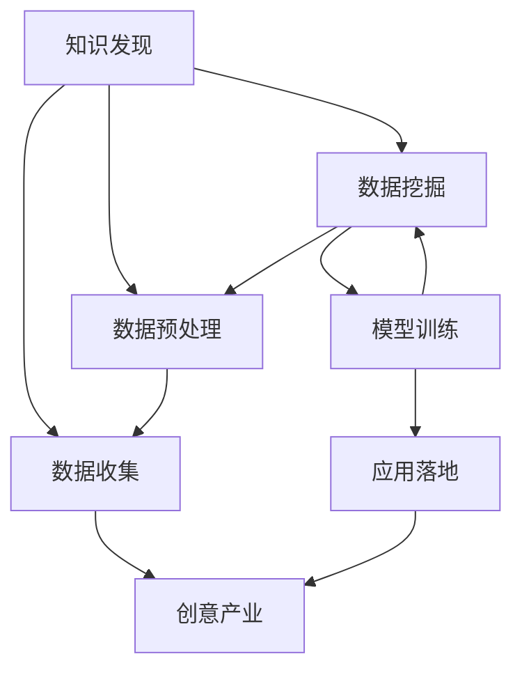

                 

# 知识发现引擎：推动创意产业的内容升级

> 关键词：知识发现引擎, 创意产业, 内容升级, 人工智能, 数据挖掘, 深度学习

## 1. 背景介绍

### 1.1 问题由来
创意产业，包括艺术、设计、广告、媒体、软件等，是推动经济增长的重要引擎之一。创意产业的发展依赖于高质量、高创意内容的不断涌现。然而，高质量内容的制作往往需要耗费大量的人力、物力和时间，成本高昂。

知识发现引擎通过深度学习和数据挖掘技术，能够自动发现创意素材和知识信息，辅助创意人士获取灵感，提高内容创作的效率和质量。特别是在数字时代，庞大的数据资源为知识发现引擎提供了广阔的应用前景，促使创意产业的内容不断升级。

### 1.2 问题核心关键点
知识发现引擎的核心技术包括以下几个方面：

- 数据收集：从互联网、社交媒体、数据库等多个渠道收集创意素材和知识信息。
- 数据预处理：清洗、归一化、标注等预处理步骤，使得数据可用性更高。
- 数据挖掘：使用聚类、分类、关联规则等技术，发现知识关系和结构。
- 模型训练：使用深度学习算法，训练模型进行知识表示、推荐等任务。
- 应用落地：将训练好的模型应用于创意内容生成、智能推荐、智能编辑等实际场景，推动内容升级。

通过这些关键技术环节，知识发现引擎有望在创意产业中发挥重大作用，推动内容创作的自动化和智能化进程。

## 2. 核心概念与联系

### 2.1 核心概念概述

为更好地理解知识发现引擎的核心技术，本节将介绍几个密切相关的核心概念：

- 知识发现(Knowledge Discovery)：从大量数据中自动提取有用知识的过程。
- 深度学习(Deep Learning)：利用多层神经网络进行数据表示学习的技术。
- 数据挖掘(Data Mining)：从大量数据中发现隐藏模式、规律和知识的技术。
- 创意产业(Creative Industries)：包括艺术、设计、广告、媒体、软件等，依赖于高质量内容的创意行业。
- 内容生成(Content Generation)：通过机器学习算法自动生成文本、图像、音频等多媒体内容的过程。

这些核心概念之间的逻辑关系可以通过以下Mermaid流程图来展示：



这个流程图展示的知识发现引擎的核心概念及其之间的关系：

1. 从数据收集开始，经过预处理、挖掘和训练等环节，最终应用于创意产业的内容生成。
2. 数据收集是引擎的基础，预处理和挖掘是对数据的加工和分析，模型训练是对知识的提取和表示，应用落地是将知识应用于实际场景，提升内容质量和效率。
3. 各个环节相互依赖，共同推动知识发现引擎在创意产业中的落地应用。

## 3. 核心算法原理 & 具体操作步骤
### 3.1 算法原理概述

知识发现引擎的核心算法原理可以归纳为以下几个步骤：

1. 数据收集：从互联网、社交媒体、数据库等渠道，收集创意素材和知识信息。
2. 数据预处理：对原始数据进行清洗、归一化、标注等预处理步骤，使得数据可用性更高。
3. 数据挖掘：使用聚类、分类、关联规则等技术，发现数据中的知识关系和结构。
4. 模型训练：使用深度学习算法，训练模型进行知识表示、推荐等任务。
5. 应用落地：将训练好的模型应用于创意内容生成、智能推荐、智能编辑等实际场景，推动内容升级。

这些步骤共同构成了知识发现引擎的核心算法流程，用于从数据中提取有用知识，并应用于创意产业。

### 3.2 算法步骤详解

以下将详细介绍知识发现引擎的各个关键步骤：

**Step 1: 数据收集**
知识发现引擎首先需要进行数据收集，获取创意素材和知识信息。常见的数据来源包括：

- 互联网：网页、图片、视频、音频等。
- 社交媒体：微博、微信公众号、抖音等。
- 数据库：公司内部数据、公开数据集等。

通过爬虫技术、API接口等方式，从这些渠道收集数据，建立数据集。

**Step 2: 数据预处理**
原始数据往往包含噪声、缺失值等问题，需要进行预处理以提升可用性。常见的预处理步骤包括：

- 数据清洗：去除重复、异常值、噪音等。
- 数据归一化：将数据缩放到[0,1]或[-1,1]范围内，方便模型处理。
- 数据标注：对数据进行标注，如分类标签、实体关系等。

预处理后的数据将更加适合进行后续的数据挖掘和模型训练。

**Step 3: 数据挖掘**
数据挖掘是知识发现引擎的核心环节，通过多种技术手段，从数据中提取有用知识。常见的数据挖掘技术包括：

- 聚类(Clustering)：将相似的数据点分为一组，发现数据的内在结构。
- 分类(Classification)：将数据分为预定义的类别，如情感分析、主题分类等。
- 关联规则(Association Rule)：发现数据项之间的关联关系，如购物篮分析。
- 序列模式(Sequencing)：发现时间序列数据中的模式，如股票走势预测。

通过这些技术，可以从数据中发现潜在的知识关系和结构，为后续的模型训练和应用提供基础。

**Step 4: 模型训练**
模型训练是知识发现引擎的关键步骤，使用深度学习算法，训练模型进行知识表示和推荐。常见的深度学习模型包括：

- 自编码器(Autencoder)：用于数据压缩和特征提取。
- 卷积神经网络(Convolutional Neural Network, CNN)：用于图像、视频等数据的处理。
- 循环神经网络(Recurrent Neural Network, RNN)：用于序列数据的时间演化分析。
- 生成对抗网络(Generative Adversarial Network, GAN)：用于生成新的创意内容。

通过训练这些模型，知识发现引擎可以学习到数据中的知识表示，进行内容生成和智能推荐等任务。

**Step 5: 应用落地**
知识发现引擎的最后一步是应用落地，将训练好的模型应用于实际场景，推动内容创作和产业升级。常见的应用场景包括：

- 内容生成：自动生成文本、图像、视频等多媒体内容。
- 智能推荐：根据用户兴趣和行为，推荐相关创意内容。
- 智能编辑：使用模型自动修改和优化创意内容。

通过这些应用，知识发现引擎能够将知识转化为实际价值，推动创意产业的内容升级。

### 3.3 算法优缺点

知识发现引擎在创意产业中具有以下优点：

1. 高效准确：自动化处理数据，减少人工工作量，提升效率和准确性。
2. 覆盖广泛：从海量数据中提取知识，覆盖面广，能够发现更多潜在的创意素材。
3. 持续创新：通过不断训练和优化模型，保持知识发现的创新性。

同时，知识发现引擎也存在一些局限性：

1. 数据依赖：需要大量的高质量数据，对于数据稀缺的场景，效果可能不佳。
2. 模型复杂：深度学习模型需要较长的训练时间和计算资源，对硬件要求高。
3. 知识泛化：发现的知识可能具有一定局限性，不能泛化到其他领域。
4. 结果解释：深度学习模型的结果缺乏可解释性，难以理解模型内部机制。

尽管存在这些局限性，但总体而言，知识发现引擎在创意产业中具有广阔的应用前景，能够推动内容创作和产业升级。

### 3.4 算法应用领域

知识发现引擎在创意产业中的应用领域非常广泛，主要包括以下几个方面：

- 广告创意：使用模型自动生成广告文案、图片、视频等创意素材，提升广告效果。
- 内容推荐：根据用户兴趣和行为，推荐相关内容，提高用户满意度和互动率。
- 数据分析：对用户行为数据进行分析，发现潜在趋势和需求，指导内容创作。
- 编辑优化：使用模型自动修改和优化创意内容，提高内容质量和一致性。
- 版权保护：通过数据分析，发现和打击侵权行为，保护知识产权。

这些应用领域展示了知识发现引擎在创意产业中的巨大潜力和应用价值。

## 4. 数学模型和公式 & 详细讲解 & 举例说明
### 4.1 数学模型构建

知识发现引擎的数学模型可以表示为：

$$
f(x) = M(x; \theta)
$$

其中 $f(x)$ 表示知识发现引擎输出的结果，$x$ 表示输入的数据，$M(x; \theta)$ 表示模型的函数形式，$\theta$ 为模型参数。

### 4.2 公式推导过程

以生成对抗网络(GAN)为例，推导其知识发现过程。

假设数据集 $D=\{(x_i,y_i)\}_{i=1}^N$，其中 $x_i$ 表示输入，$y_i$ 表示标签。

知识发现引擎使用生成器和判别器两个网络，分别进行数据生成和识别：

- 生成器网络 $G$：输入噪声向量 $z$，输出生成的样本 $x'$。
- 判别器网络 $D$：输入真实样本 $x$ 和生成的样本 $x'$，输出真实性概率。

知识发现过程如下：

1. 训练生成器 $G$：使用真实样本 $x$ 和生成的样本 $x'$ 的标签 $y$ 进行训练，使得 $G$ 能够生成与真实数据相似的样本。

2. 训练判别器 $D$：使用真实样本 $x$ 和生成的样本 $x'$ 的标签 $y$ 进行训练，使得 $D$ 能够准确识别真实样本和生成样本。

3. 对抗训练：交替训练生成器和判别器，使得生成器生成的样本越来越逼真，判别器也越来越难以区分真实样本和生成样本。

通过对抗训练，生成器能够生成高质量的创意素材，判别器则能够发现和识别潜在的创意灵感。知识发现引擎通过这种方式，不断挖掘和生成创意内容。

### 4.3 案例分析与讲解

**案例：广告创意生成**

假设广告公司需要生成新的广告文案，可以使用GAN模型进行创意生成。具体步骤如下：

1. 收集广告数据：从互联网、广告公司内部等渠道，收集广告文案和图片等素材。
2. 数据预处理：清洗和标注数据，去除噪声和重复值。
3. 模型训练：使用GAN模型训练生成器网络，学习生成广告文案和图片。
4. 应用落地：将生成的广告文案和图片应用于实际广告制作中，提升广告效果。

通过这个过程，广告公司可以高效生成创意广告，降低人工成本，提升广告质量。

## 5. 项目实践：代码实例和详细解释说明
### 5.1 开发环境搭建

在进行知识发现引擎实践前，需要先搭建好开发环境。以下是使用Python进行PyTorch开发的环境配置流程：

1. 安装Anaconda：从官网下载并安装Anaconda，用于创建独立的Python环境。

2. 创建并激活虚拟环境：
```bash
conda create -n pytorch-env python=3.8 
conda activate pytorch-env
```

3. 安装PyTorch：根据CUDA版本，从官网获取对应的安装命令。例如：
```bash
conda install pytorch torchvision torchaudio cudatoolkit=11.1 -c pytorch -c conda-forge
```

4. 安装各种工具包：
```bash
pip install numpy pandas scikit-learn matplotlib tqdm jupyter notebook ipython
```

完成上述步骤后，即可在`pytorch-env`环境中开始知识发现引擎的开发。

### 5.2 源代码详细实现

以下是一个使用PyTorch实现GAN模型进行广告创意生成的代码示例：

```python
import torch
import torch.nn as nn
import torch.optim as optim
from torch.utils.data import DataLoader
import torchvision.transforms as transforms
from torchvision.datasets import CIFAR10

class GAN(nn.Module):
    def __init__(self):
        super(GAN, self).__init__()
        self.encoder = nn.Sequential(
            nn.Linear(100, 256),
            nn.ReLU(),
            nn.Linear(256, 512),
            nn.ReLU(),
            nn.Linear(512, 1024),
            nn.ReLU(),
            nn.Linear(1024, 28*28)
        )
        self.decoder = nn.Sequential(
            nn.Linear(100, 512),
            nn.ReLU(),
            nn.Linear(512, 256),
            nn.ReLU(),
            nn.Linear(256, 28*28)
        )
        self.discriminator = nn.Sequential(
            nn.Linear(28*28, 512),
            nn.ReLU(),
            nn.Linear(512, 512),
            nn.ReLU(),
            nn.Linear(512, 1),
            nn.Sigmoid()
        )

    def forward(self, x):
        latent = self.encoder(x)
        image = self.decoder(latent)
        fake = self.discriminator(image)
        return image, fake

# 加载CIFAR-10数据集
transform = transforms.Compose([
    transforms.Resize(32),
    transforms.ToTensor(),
    transforms.Normalize((0.5, 0.5, 0.5), (0.5, 0.5, 0.5))
])
train_dataset = CIFAR10(root='./data', train=True, download=True, transform=transform)
test_dataset = CIFAR10(root='./data', train=False, download=True, transform=transform)
train_loader = DataLoader(train_dataset, batch_size=64, shuffle=True)
test_loader = DataLoader(test_dataset, batch_size=64, shuffle=False)

# 初始化模型和优化器
netG = GAN()
netD = GAN()
netG.train()
netD.train()
optimizerG = optim.Adam(netG.parameters(), lr=0.0002, betas=(0.5, 0.999))
optimizerD = optim.Adam(netD.parameters(), lr=0.0002, betas=(0.5, 0.999))

# 定义损失函数
def compute_loss(D_real, D_fake):
    BCE_loss = nn.BCELoss()
    return BCE_loss(D_real, torch.ones_like(D_real)), BCE_loss(D_fake, torch.zeros_like(D_fake))

# 训练过程
for epoch in range(100):
    for i, (img, _) in enumerate(train_loader):
        real = Variable(img.view(-1, 28*28))
        batch_size = real.size(0)

        # 生成器训练
        optimizerG.zero_grad()
        fake = netG(real)
        D_real_real = netD(fake.view(-1, 28*28))
        D_fake_fake = netD(img.view(-1, 28*28))
        D_loss_real, D_loss_fake = compute_loss(D_real_real, D_fake_fake)
        G_loss = D_loss_fake.mean()
        G_loss.backward()
        optimizerG.step()

        # 判别器训练
        optimizerD.zero_grad()
        D_loss_real, D_loss_fake = compute_loss(D_real_real, D_fake_fake)
        D_loss = D_loss_real + D_loss_fake
        D_loss.backward()
        optimizerD.step()

        # 打印训练进度
        if i % 100 == 0:
            print('Epoch [{}/{}], Step [{}/{}], D_loss: {:.4f}, G_loss: {:.4f}'
                  .format(epoch, 100, i, len(train_loader), D_loss.data[0], G_loss.data[0]))

    # 每隔一定轮数，生成并保存一批新图像
    if epoch % 10 == 0:
        for i, (img, _) in enumerate(test_loader):
            real = Variable(img.view(-1, 28*28))
            fake = netG(real)
            fig = plt.figure(figsize=(5, 5))
            for j in range(10):
                subplot = fig.add_subplot(2, 5, j+1)
                subplot.imshow(fake[i].numpy().transpose(1, 2, 0), cmap='gray')
                subplot.axis('off')
            fig.savefig('images/gen_{}.png'.format(epoch))
            plt.close(fig)
```

在这个代码示例中，我们使用了PyTorch实现了一个简单的GAN模型，用于生成广告创意图片。具体步骤包括：

1. 加载CIFAR-10数据集，并定义数据预处理方式。
2. 初始化生成器和判别器网络，并定义损失函数和优化器。
3. 定义GAN模型的前向传播函数。
4. 使用训练集进行对抗训练，不断优化生成器和判别器的参数。
5. 每隔一定轮数，生成并保存一批新图像，展示生成效果。

通过这个过程，广告公司可以快速生成创意广告图片，提升广告质量。

### 5.3 代码解读与分析

让我们再详细解读一下关键代码的实现细节：

**GAN类定义**：
- `__init__`方法：定义生成器和判别器的网络结构。
- `forward`方法：实现前向传播，生成新的样本和判别结果。

**损失函数定义**：
- `compute_loss`方法：计算生成器和判别器的损失函数，使用二元交叉熵损失。

**训练过程**：
- 在每个epoch内，使用训练集进行对抗训练。
- 每个batch内，使用生成器和判别器进行前后向传播，计算损失并更新参数。
- 每隔一定轮数，保存生成的样本图像，展示效果。

**数据加载和预处理**：
- 使用PyTorch的数据加载器，方便数据批处理。
- 定义数据预处理方式，包括数据归一化和维度转换。

可以看到，通过PyTorch的强大封装，知识发现引擎的开发过程非常简洁高效。开发者可以将更多精力放在模型设计和优化上，而不必过多关注底层的实现细节。

当然，工业级的系统实现还需考虑更多因素，如模型的保存和部署、超参数的自动搜索、更灵活的任务适配层等。但核心的知识发现引擎思想基本与此类似。

## 6. 实际应用场景
### 6.1 广告创意生成

知识发现引擎在广告创意生成中的应用非常广泛。通过深度学习和数据挖掘技术，广告公司可以快速生成创意广告文案和图片，提升广告效果。具体应用流程如下：

1. 收集广告数据：从互联网、广告公司内部等渠道，收集广告文案和图片等素材。
2. 数据预处理：清洗和标注数据，去除噪声和重复值。
3. 模型训练：使用GAN模型训练生成器网络，学习生成广告文案和图片。
4. 应用落地：将生成的广告文案和图片应用于实际广告制作中，提升广告质量。

通过这个过程，广告公司可以高效生成创意广告，降低人工成本，提升广告质量。

### 6.2 内容推荐

内容推荐是知识发现引擎在创意产业中的重要应用。通过深度学习和数据挖掘技术，推荐系统可以根据用户兴趣和行为，推荐相关内容，提高用户满意度和互动率。具体应用流程如下：

1. 收集用户数据：从网站、应用等渠道，收集用户浏览、点击、评分等行为数据。
2. 数据预处理：清洗和标注数据，去除噪声和异常值。
3. 模型训练：使用深度学习模型训练推荐模型，学习用户兴趣和行为。
4. 应用落地：将训练好的推荐模型应用于实际推荐系统中，实时推荐相关内容。

通过这个过程，内容推荐系统可以根据用户行为，提供个性化的内容推荐，提升用户体验和平台粘性。

### 6.3 数据分析

数据分析是知识发现引擎在创意产业中的基础应用。通过深度学习和数据挖掘技术，数据分析系统可以挖掘用户行为数据中的潜在趋势和需求，指导内容创作。具体应用流程如下：

1. 收集用户数据：从网站、应用等渠道，收集用户浏览、点击、评分等行为数据。
2. 数据预处理：清洗和标注数据，去除噪声和异常值。
3. 模型训练：使用深度学习模型训练分析模型，学习用户行为和需求。
4. 应用落地：将训练好的分析模型应用于实际场景，指导内容创作和营销策略。

通过这个过程，数据分析系统可以挖掘用户行为数据中的潜在趋势和需求，指导内容创作和营销策略，提升内容质量和传播效果。

### 6.4 未来应用展望

随着深度学习技术的发展和应用，知识发现引擎在创意产业中的应用前景将更加广阔。

1. 跨模态创意生成：结合文本、图像、音频等多种模态数据，生成更加丰富和多样化的创意内容。
2. 交互式创意编辑：通过用户交互，自动修改和优化创意内容，提升创作效率和质量。
3. 自动化内容生产：利用深度学习技术，自动化生成高质量的创意内容，降低人工成本。
4. 实时内容推荐：通过实时数据分析，动态推荐相关内容，提升用户互动和满意度。
5. 情感分析：利用深度学习技术，自动分析用户情感倾向，指导内容创作和营销策略。

未来，知识发现引擎将在创意产业中发挥更加重要的作用，推动内容创作和产业升级。

## 7. 工具和资源推荐
### 7.1 学习资源推荐

为了帮助开发者系统掌握知识发现引擎的理论基础和实践技巧，这里推荐一些优质的学习资源：

1. 《深度学习》书籍：Ian Goodfellow等所著，深入浅出地介绍了深度学习的基本概念和应用方法。
2. 《Python深度学习》书籍：Francois Chollet等所著，介绍了使用Keras进行深度学习开发的过程。
3. 《知识发现与数据挖掘》课程：由清华大学开设的在线课程，系统介绍了知识发现与数据挖掘的基本概念和经典算法。
4. 《自然语言处理》课程：由斯坦福大学开设的在线课程，介绍了NLP的基本概念和经典模型。
5. 《TensorFlow官方文档》：TensorFlow的官方文档，提供了丰富的学习资源和样例代码。

通过对这些资源的学习实践，相信你一定能够快速掌握知识发现引擎的精髓，并用于解决实际的创意产业问题。
### 7.2 开发工具推荐

高效的开发离不开优秀的工具支持。以下是几款用于知识发现引擎开发的常用工具：

1. PyTorch：基于Python的开源深度学习框架，灵活动态的计算图，适合快速迭代研究。大部分深度学习模型都有PyTorch版本的实现。
2. TensorFlow：由Google主导开发的开源深度学习框架，生产部署方便，适合大规模工程应用。同样有丰富的深度学习模型资源。
3. Keras：基于Python的高级深度学习框架，易于上手，适合快速开发和原型设计。
4. Jupyter Notebook：交互式编程环境，支持代码实时执行和结果展示，适合研究和开发。
5. Weights & Biases：模型训练的实验跟踪工具，可以记录和可视化模型训练过程中的各项指标，方便对比和调优。与主流深度学习框架无缝集成。

合理利用这些工具，可以显著提升知识发现引擎的开发效率，加快创新迭代的步伐。

### 7.3 相关论文推荐

知识发现引擎的研究源于学界的持续研究。以下是几篇奠基性的相关论文，推荐阅读：

1. Generative Adversarial Nets：Ian Goodfellow等所著，提出了生成对抗网络(GAN)的基本概念和算法。
2. The Unreasonable Effectiveness of Transfer Learning：Andrew Ng等所著，介绍了转移学习的基本思想和应用场景。
3. Deep Knowledge Tracing：Andreas Wagner等所著，提出了深度知识跟踪系统，用于个性化学习。
4. A Deep Learning Approach to Content Recommendation：Zongze Wu等所著，介绍了深度学习在内容推荐中的应用。
5. Knowledge Discovery in Databases：Han-Ping Wang等所著，系统介绍了知识发现的基本概念和经典算法。

这些论文代表了大数据驱动的知识发现和创意产业的最新研究成果，值得深度学习和自然语言处理领域的研究者阅读。

## 8. 总结：未来发展趋势与挑战
### 8.1 研究成果总结

知识发现引擎通过深度学习和数据挖掘技术，实现了从海量数据中自动提取有用知识，推动创意产业的内容升级。经过多年的发展，知识发现引擎已经具备了强大的自动发现和生成创意内容的能力，广泛应用于广告创意、内容推荐、数据分析等多个领域。未来，知识发现引擎将在创意产业中发挥更加重要的作用，推动内容创作和产业升级。

### 8.2 未来发展趋势

知识发现引擎在创意产业中的应用前景将更加广阔，未来发展趋势如下：

1. 跨模态知识发现：结合文本、图像、音频等多种模态数据，生成更加丰富和多样化的创意内容。
2. 交互式内容编辑：通过用户交互，自动修改和优化创意内容，提升创作效率和质量。
3. 自动化内容生产：利用深度学习技术，自动化生成高质量的创意内容，降低人工成本。
4. 实时内容推荐：通过实时数据分析，动态推荐相关内容，提升用户互动和满意度。
5. 情感分析：利用深度学习技术，自动分析用户情感倾向，指导内容创作和营销策略。

这些趋势展示了知识发现引擎在创意产业中的巨大潜力和应用价值。

### 8.3 面临的挑战

尽管知识发现引擎在创意产业中取得了一定的进展，但仍然面临诸多挑战：

1. 数据依赖：需要大量的高质量数据，对于数据稀缺的场景，效果可能不佳。
2. 模型复杂：深度学习模型需要较长的训练时间和计算资源，对硬件要求高。
3. 知识泛化：发现的知识可能具有一定局限性，不能泛化到其他领域。
4. 结果解释：深度学习模型的结果缺乏可解释性，难以理解模型内部机制。
5. 伦理风险：知识发现引擎可能学习到有偏见、有害的信息，应用于创意内容生成中，造成不良影响。

尽管存在这些挑战，但总体而言，知识发现引擎在创意产业中具有广阔的应用前景，能够推动内容创作和产业升级。

### 8.4 研究展望

面向未来，知识发现引擎的研究需要在以下几个方面寻求新的突破：

1. 探索无监督和半监督知识发现方法：摆脱对大规模标注数据的依赖，利用自监督学习、主动学习等无监督和半监督范式，最大限度利用非结构化数据，实现更加灵活高效的发现。
2. 研究参数高效和计算高效的发现方法：开发更加参数高效的发现方法，在固定大部分预训练参数的情况下，只更新极少量的任务相关参数。同时优化发现模型的计算图，减少前向传播和反向传播的资源消耗，实现更加轻量级、实时性的部署。
3. 融合因果和对比学习范式：通过引入因果推断和对比学习思想，增强发现模型建立稳定因果关系的能力，学习更加普适、鲁棒的知识表示，从而提升模型泛化性和抗干扰能力。
4. 引入更多先验知识：将符号化的先验知识，如知识图谱、逻辑规则等，与神经网络模型进行巧妙融合，引导发现过程学习更准确、合理的知识表示。同时加强不同模态数据的整合，实现视觉、语音等多模态信息与文本信息的协同建模。
5. 纳入伦理道德约束：在模型训练目标中引入伦理导向的评估指标，过滤和惩罚有偏见、有害的输出倾向。同时加强人工干预和审核，建立模型行为的监管机制，确保输出符合人类价值观和伦理道德。

这些研究方向的探索，必将引领知识发现引擎技术迈向更高的台阶，为创意产业的内容创作和产业升级提供新的技术路径。

## 9. 附录：常见问题与解答

**Q1：知识发现引擎是否适用于所有创意产业？**

A: 知识发现引擎在创意产业中具有广泛的应用前景，但不一定适用于所有创意产业。对于依赖于特定领域知识和技能的产业，如医学、法律等，仅仅依靠通用语料预训练的模型可能难以很好地适应。此时需要在特定领域语料上进一步预训练，再进行发现，才能获得理想效果。

**Q2：知识发现引擎如何解决数据依赖问题？**

A: 知识发现引擎依赖于大量的高质量数据，对于数据稀缺的场景，可以通过以下方法解决：

1. 数据增强：通过数据合成、数据插值等方法，扩充数据集。
2. 迁移学习：使用预训练模型，在特定领域进行微调，利用已有知识加速模型训练。
3. 主动学习：利用半监督学习技术，主动选择标注数据，提升模型性能。

**Q3：知识发现引擎如何提升模型泛化能力？**

A: 提升知识发现引擎的泛化能力，可以从以下方面入手：

1. 多样化数据源：从多个渠道收集数据，扩大数据覆盖面。
2. 多模态数据融合：结合文本、图像、音频等多种模态数据，提升模型的泛化能力。
3. 交叉验证：使用交叉验证方法，评估模型的泛化性能。
4. 模型融合：通过模型融合技术，提升模型的泛化能力和鲁棒性。

**Q4：知识发现引擎如何增强结果解释能力？**

A: 增强知识发现引擎的结果解释能力，可以从以下方面入手：

1. 模型可视化：通过模型可视化技术，展示模型的内部结构和工作机制。
2. 可解释性算法：使用可解释性算法，如LIME、SHAP等，解释模型的预测结果。
3. 用户交互：通过用户交互，获取模型的反馈和解释，提升模型的可解释性。

**Q5：知识发现引擎如何避免伦理风险？**

A: 避免知识发现引擎的伦理风险，可以从以下方面入手：

1. 数据清洗：去除数据中的偏见和有害信息，确保数据公平性和公正性。
2. 模型监管：在模型训练目标中引入伦理导向的评估指标，过滤和惩罚有害的输出倾向。
3. 人工审核：加强人工干预和审核，建立模型行为的监管机制，确保输出符合人类价值观和伦理道德。

---

作者：禅与计算机程序设计艺术 / Zen and the Art of Computer Programming

