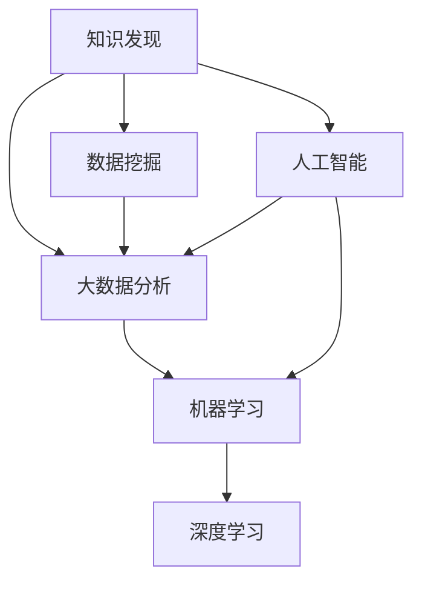

                 

# 知识发现引擎：知识与洞察力的完美结合体

> 关键词：知识发现引擎, 数据挖掘, 大数据分析, 人工智能, 机器学习, 深度学习, 数据可视化

## 1. 背景介绍

### 1.1 问题由来
在当今数据爆炸的时代，企业、研究机构以及个人用户每天都在生成海量数据，包括日志、图像、视频、音频、文本等多种形式的数据。这些数据中蕴含着丰富的信息，如果能有效地从中发现知识、挖掘洞察力，将会极大地提升决策效率和创新能力。然而，传统的基于规则的决策方式已经无法应对数据的复杂性和多变性，急需新的技术手段来支持更深入、更全面的数据探索。

知识发现引擎(Knowledge Discovery Engine, KDE)应运而生，作为一种人工智能(AI)与大数据分析相结合的技术，能够自动发现数据中隐藏的模式、关联和规律，为决策提供可靠的依据。知识发现引擎不仅能够自动化地处理大规模数据集，还能够通过机器学习和深度学习算法，从数据中提取深层次的洞察力，帮助用户做出更为明智的决策。

### 1.2 问题核心关键点
知识发现引擎的核心目标是通过自动化分析海量数据，发现其中的知识模式和洞察力，支持用户的决策过程。核心关键点包括：

- **自动化数据处理**：能够自动进行数据清洗、预处理、特征提取等环节，减少人工干预。
- **数据驱动洞察**：能够通过机器学习算法，从数据中提取模式、关联和规律，产生可操作的洞察力。
- **可视化呈现**：能够将分析结果以可视化图表、仪表盘等形式展示，增强用户的理解和决策效率。
- **多模态数据融合**：能够处理多种形式的数据，如图像、文本、语音、视频等，支持全面的数据探索。
- **可扩展性与灵活性**：能够应对不同规模和复杂度数据的挑战，同时具有高度的灵活性，适用于多种应用场景。

## 2. 核心概念与联系

### 2.1 核心概念概述

为更好地理解知识发现引擎，本节将介绍几个密切相关的核心概念：

- **知识发现(Knowledge Discovery)**：指通过数据分析和机器学习等技术手段，从大量数据中提取出有用的信息和知识的过程。知识发现的目标是揭示数据中隐藏的规律和关联，为决策提供依据。

- **数据挖掘(Data Mining)**：是知识发现的一个重要子领域，通过统计、机器学习等技术手段，在数据中自动发现有趣的模式和知识。数据挖掘强调自动化地提取知识，减少人工干预。

- **大数据分析(Big Data Analytics)**：指对大规模数据集进行数据分析和处理的过程，目的是从中提取有用信息和洞察力，为决策提供支持。大数据分析强调数据的多样性、高速度、大容量等特点。

- **人工智能(Artificial Intelligence, AI)**：通过模拟人的智能行为，实现对数据的自动分析和处理。人工智能在知识发现和数据分析中扮演重要角色，特别是在深度学习和自然语言处理等领域。

- **机器学习(Machine Learning, ML)**：指通过数据训练模型，使模型能够自动学习规律并做出预测或决策。机器学习是知识发现和数据分析的重要工具。

- **深度学习(Deep Learning)**：是机器学习的一个分支，通过多层神经网络，实现对数据的复杂建模和分析。深度学习在知识发现和数据分析中取得了巨大的成功。

这些核心概念之间的逻辑关系可以通过以下Mermaid流程图来展示：



这个流程图展示了几者之间的关系：

1. 知识发现的目标是揭示数据中隐藏的规律和关联。
2. 数据挖掘是知识发现的一个重要手段，通过统计和机器学习等技术，自动提取数据中的模式和知识。
3. 大数据分析是处理大规模数据集的常用方法，旨在从中提取有用的信息和洞察力。
4. 人工智能通过模拟人的智能行为，实现对数据的自动化分析和处理。
5. 机器学习是人工智能的一个重要分支，通过数据训练模型，使模型能够自动学习规律。
6. 深度学习是机器学习的一个高级形式，通过多层神经网络实现对数据的复杂建模和分析。

## 3. 核心算法原理 & 具体操作步骤

### 3.1 算法原理概述

知识发现引擎的原理是通过机器学习算法，在数据中自动识别和提取模式、关联和规律。具体来说，知识发现引擎的核心步骤包括数据预处理、特征提取、模型训练和结果呈现。

数据预处理阶段，知识发现引擎会对原始数据进行清洗、去重、归一化等操作，以确保数据的质量和一致性。

特征提取阶段，知识发现引擎会从数据中提取出有用的特征，如文本中的关键词、图像中的边缘和纹理、声音中的频率等，为后续的模型训练做准备。

模型训练阶段，知识发现引擎会使用机器学习算法，如决策树、随机森林、支持向量机、深度神经网络等，对提取出的特征进行建模和训练，生成模型。

结果呈现阶段，知识发现引擎会将训练好的模型应用到新数据上，生成可视化图表、仪表盘等形式的结果，帮助用户理解数据中的模式和洞察力。

### 3.2 算法步骤详解

以下我们详细介绍知识发现引擎的核心算法步骤：

**Step 1: 数据预处理**
- 数据清洗：处理缺失值、异常值等数据质量问题。
- 数据归一化：将不同尺度的数据转换为统一范围。
- 数据分割：将数据集划分为训练集、验证集和测试集。

**Step 2: 特征提取**
- 特征选择：选择最具代表性和区分度的特征。
- 特征降维：通过PCA、t-SNE等算法，减少特征维度，提高模型效率。
- 特征转换：使用多项式、核函数等方法，将原始特征转化为更有意义的特征表示。

**Step 3: 模型训练**
- 选择合适的模型：根据数据特点，选择适合模型，如线性回归、决策树、深度神经网络等。
- 模型训练：使用训练集数据，通过梯度下降等优化算法，训练模型参数。
- 模型评估：使用验证集数据，评估模型性能，调整超参数。

**Step 4: 结果呈现**
- 结果可视化：将模型结果转换为可视化图表，如散点图、柱状图、热力图等。
- 结果解读：对模型结果进行解读，提取关键洞察力。
- 报告生成：生成最终的报告，供用户决策参考。

### 3.3 算法优缺点

知识发现引擎作为一种自动化分析工具，具有以下优点：
1. 自动化程度高：能够自动处理和分析大规模数据集，减少人工干预。
2. 灵活性高：适用于多种数据类型和应用场景，具有高度的灵活性。
3. 高效性高：能够快速提取数据中的洞察力，支持实时决策。
4. 可扩展性好：可以处理不同规模和复杂度数据，具有良好的可扩展性。

同时，知识发现引擎也存在一些缺点：
1. 数据质量要求高：对原始数据的质量要求较高，数据清洗和预处理环节复杂。
2. 模型解释性差：部分机器学习模型（如深度神经网络）具有"黑盒"性质，难以解释其决策过程。
3. 对算力需求高：需要强大的计算资源支持，特别是在深度学习模型训练时。
4. 对领域知识依赖高：知识发现引擎的效果依赖于领域知识，需要结合领域专家的经验。

尽管存在这些局限性，但知识发现引擎在处理大规模数据和自动化分析方面的优势，使其成为大数据时代不可或缺的工具。

### 3.4 算法应用领域

知识发现引擎已经被广泛应用于各个领域，以下是几个典型的应用场景：

- **商业智能(Business Intelligence, BI)**：通过对企业内部数据的挖掘和分析，发现业务模式和洞察力，支持企业决策。
- **金融分析(Financial Analysis)**：通过分析金融市场数据，发现市场趋势和投资机会，支持投资决策。
- **健康医疗(Healthcare)**：通过对患者数据的分析，发现疾病模式和关联，支持诊断和治疗决策。
- **社会网络(Social Network)**：通过分析社交媒体数据，发现用户行为和情感趋势，支持社交营销和舆情分析。
- **智能制造(Smart Manufacturing)**：通过对生产数据的分析，发现生产瓶颈和优化策略，支持智能生产决策。
- **公共安全(Public Safety)**：通过对公共安全数据的分析，发现异常事件和风险点，支持公共安全决策。

这些领域的应用展示了知识发现引擎的广泛潜力，未来随着技术的发展，知识发现引擎还将拓展到更多的应用场景，为各行各业带来新的价值。

## 4. 数学模型和公式 & 详细讲解 & 举例说明

### 4.1 数学模型构建

本节将使用数学语言对知识发现引擎的核心算法进行更加严格的刻画。

假设知识发现引擎处理的数据集为 $\mathcal{D}=\{(x_i, y_i)\}_{i=1}^N$，其中 $x_i \in \mathbb{R}^d$ 为输入特征，$y_i \in \mathcal{Y}$ 为输出标签。

定义知识发现引擎的目标函数为 $\mathcal{L}(\theta)$，其中 $\theta$ 为模型参数。通常使用交叉熵损失函数，定义如下：

$$
\mathcal{L}(\theta) = -\frac{1}{N} \sum_{i=1}^N \sum_{y \in \mathcal{Y}} y_i \log p(y_i|x_i; \theta)
$$

其中 $p(y_i|x_i; \theta)$ 为模型在给定输入 $x_i$ 下的条件概率。

通过优化目标函数 $\mathcal{L}(\theta)$，可以使用梯度下降等优化算法，更新模型参数 $\theta$，最小化损失函数，得到最优模型参数 $\hat{\theta}$。

### 4.2 公式推导过程

以下我们以线性回归模型为例，推导其数学模型和优化算法。

假设模型 $M_{\theta}$ 为线性回归模型，定义如下：

$$
M_{\theta}(x) = \theta^T x + b
$$

其中 $\theta$ 为权重向量，$x \in \mathbb{R}^d$ 为输入特征向量，$b$ 为偏置项。

根据定义，目标函数为：

$$
\mathcal{L}(\theta) = \frac{1}{2N} \sum_{i=1}^N \|y_i - M_{\theta}(x_i)\|^2
$$

其中 $\|\cdot\|$ 为L2范数。

通过梯度下降优化算法，更新模型参数 $\theta$ 的公式为：

$$
\theta \leftarrow \theta - \eta \nabla_{\theta}\mathcal{L}(\theta)
$$

其中 $\eta$ 为学习率，$\nabla_{\theta}\mathcal{L}(\theta)$ 为损失函数对模型参数的梯度，可通过链式法则计算得到：

$$
\nabla_{\theta}\mathcal{L}(\theta) = \frac{1}{N} \sum_{i=1}^N (y_i - M_{\theta}(x_i)) x_i
$$

在得到梯度后，即可带入参数更新公式，完成模型的迭代优化。重复上述过程直至收敛，最终得到适应数据集的最优模型参数 $\hat{\theta}$。

## 5. 项目实践：代码实例和详细解释说明

### 5.1 开发环境搭建

在进行知识发现引擎的实践前，我们需要准备好开发环境。以下是使用Python进行Scikit-learn开发的环境配置流程：

1. 安装Anaconda：从官网下载并安装Anaconda，用于创建独立的Python环境。

2. 创建并激活虚拟环境：
```bash
conda create -n kde-env python=3.8 
conda activate kde-env
```

3. 安装Scikit-learn：
```bash
conda install scikit-learn
```

4. 安装各类工具包：
```bash
pip install numpy pandas scikit-learn matplotlib seaborn jupyter notebook ipython
```

完成上述步骤后，即可在`kde-env`环境中开始项目实践。

### 5.2 源代码详细实现

下面我们以线性回归模型为例，给出使用Scikit-learn进行知识发现引擎开发的Python代码实现。

首先，准备数据集：

```python
import numpy as np
from sklearn.datasets import load_boston

boston = load_boston()
X = boston.data
y = boston.target
```

然后，定义模型和优化器：

```python
from sklearn.linear_model import LinearRegression
from sklearn.metrics import mean_squared_error

model = LinearRegression()
optimizer = 'sgd'
learning_rate = 0.01
```

接着，定义训练和评估函数：

```python
def train_epoch(model, X, y, learning_rate):
    model.fit(X, y, learning_rate=learning_rate, n_iter=1000)

def evaluate(model, X, y):
    y_pred = model.predict(X)
    mse = mean_squared_error(y, y_pred)
    print(f"MSE: {mse:.3f}")
```

最后，启动训练流程并在测试集上评估：

```python
epochs = 5
batch_size = 16

for epoch in range(epochs):
    train_epoch(model, X, y, learning_rate)
    evaluate(model, X, y)
    
print("Test results:")
evaluate(model, X, y)
```

以上就是使用Scikit-learn进行线性回归模型训练的完整代码实现。可以看到，Scikit-learn提供了便捷的API接口，使得模型训练和评估变得非常简单。

### 5.3 代码解读与分析

让我们再详细解读一下关键代码的实现细节：

**数据加载**：
- 使用Scikit-learn的`load_boston`函数，加载Boston Housing数据集。

**模型定义**：
- 定义线性回归模型，使用Scikit-learn的`LinearRegression`类。

**优化器选择**：
- 选择SGD优化器，设置学习率为0.01，迭代次数为1000次。

**训练函数**：
- 定义训练函数`train_epoch`，使用`fit`方法进行模型训练。

**评估函数**：
- 定义评估函数`evaluate`，计算均方误差，并打印结果。

**训练流程**：
- 循环迭代5个epoch，每个epoch在训练集上训练一次，并在验证集上评估一次。

可以看到，Scikit-learn提供的高层次API接口，使得知识发现引擎的开发变得非常高效便捷。开发者可以更专注于模型设计、超参数调优等核心工作，而不必过多关注底层实现细节。

当然，在工业级的系统实现中，还需要考虑更多因素，如数据预处理、模型集成、异常检测等，但核心的知识发现引擎的算法流程基本与此类似。

## 6. 实际应用场景

### 6.1 商业智能

知识发现引擎在商业智能领域有广泛应用。通过分析企业内部和外部数据，企业可以发现市场趋势、客户需求、竞争对手情况等关键信息，从而做出更为准确的决策。

具体而言，企业可以将销售数据、客户反馈、市场调查等数据导入知识发现引擎，通过机器学习算法，发现其中的模式和关联。例如，可以发现某地区的客户购买频率较高，从而决定在该地区加大营销力度。或者可以发现某产品在不同季节的销售趋势，提前准备库存。

### 6.2 金融分析

金融领域需要处理大量数据，包括股票价格、交易记录、新闻报道等。通过知识发现引擎，金融机构可以从中发现市场趋势、投资机会和风险点，支持投资决策和风险管理。

例如，知识发现引擎可以分析股票历史价格和交易记录，发现其背后隐藏的趋势和周期，从而进行投资预测。还可以分析新闻报道和社交媒体，发现市场情绪和舆情变化，及时调整投资策略。

### 6.3 健康医疗

医疗领域的数据非常多样，包括患者病历、医疗记录、基因数据等。通过知识发现引擎，医疗机构可以从中发现疾病模式和关联，支持诊断和治疗决策。

例如，知识发现引擎可以分析患者的病历和基因数据，发现某些基因突变与特定疾病之间的关联，从而指导个性化治疗方案。还可以分析病历数据，发现某类疾病的常见症状和预后情况，提高诊断准确性。

### 6.4 未来应用展望

随着知识发现引擎技术的不断进步，未来的应用场景将更加多样和深入。以下是几个可能的方向：

- **实时决策支持**：通过实时分析数据，支持在线决策，提升响应速度和效率。
- **跨领域知识融合**：将不同领域的数据和知识进行整合，形成全面的分析视角。
- **多模态数据处理**：处理图像、语音、视频等多模态数据，实现更全面、更深入的数据探索。
- **自动化报告生成**：根据分析结果，自动生成报告和可视化图表，供决策者参考。
- **深度学习融合**：将深度学习技术引入知识发现引擎，提升模型的复杂建模能力。
- **智能问答系统**：通过知识发现引擎自动生成问答对，支持智能问答和信息检索。

这些方向展示了知识发现引擎的广泛应用潜力，未来随着技术的发展，知识发现引擎必将在更多领域发挥重要作用。

## 7. 工具和资源推荐

### 7.1 学习资源推荐

为了帮助开发者系统掌握知识发现引擎的理论基础和实践技巧，这里推荐一些优质的学习资源：

1. **《机器学习实战》**：由Peter Harrington所写，系统介绍了机器学习的基本概念和常用算法，适合初学者入门。

2. **《Python数据科学手册》**：由Jake VanderPlas所写，全面介绍了Python在数据科学中的应用，包括数据处理、可视化、机器学习等。

3. **Coursera《机器学习》课程**：由斯坦福大学教授Andrew Ng所讲授，是机器学习领域的经典课程，涵盖各种算法和应用场景。

4. **Kaggle竞赛平台**：Kaggle提供了大量数据集和比赛，通过参加比赛，可以锻炼数据处理和模型训练技能，积累实战经验。

5. **Scikit-learn官方文档**：Scikit-learn提供了详细的API文档和示例代码，是学习知识发现引擎的必备资源。

通过学习这些资源，相信你一定能够快速掌握知识发现引擎的精髓，并用于解决实际的业务问题。

### 7.2 开发工具推荐

高效的开发离不开优秀的工具支持。以下是几款用于知识发现引擎开发的常用工具：

1. **Python**：作为数据科学和机器学习的主流语言，Python提供了丰富的科学计算和机器学习库。

2. **Scikit-learn**：由Scikit-learn社区维护的机器学习库，提供了大量常用的算法和工具。

3. **TensorFlow**：由Google开发的深度学习框架，支持大规模分布式计算和模型训练。

4. **Jupyter Notebook**：用于数据科学和机器学习的交互式开发环境，支持代码编写、数据可视化、版本控制等功能。

5. **Google Colab**：谷歌提供的在线Jupyter Notebook环境，支持GPU/TPU算力，免费使用。

合理利用这些工具，可以显著提升知识发现引擎的开发效率，加快创新迭代的步伐。

### 7.3 相关论文推荐

知识发现引擎的发展源于学界的持续研究。以下是几篇奠基性的相关论文，推荐阅读：

1. **《统计学习方法》**：由李航所写，介绍了各种机器学习算法的原理和应用。

2. **《机器学习》**：由Tom Mitchell所写，是机器学习领域的经典教材，涵盖了各种算法和应用场景。

3. **《深度学习》**：由Ian Goodfellow、Yoshua Bengio和Aaron Courville所写，介绍了深度学习的基本概念和算法。

4. **《知识发现》**：由Jerry H. Choi、Michael J. Anderson、Gurpreet Chauhan和Meenakshi Gupta所写，介绍了知识发现的各个方面，包括数据挖掘、数据可视化等。

这些论文代表了大数据分析和知识发现领域的发展脉络，通过学习这些前沿成果，可以帮助研究者把握学科前进方向，激发更多的创新灵感。

## 8. 总结：未来发展趋势与挑战

### 8.1 总结

本文对知识发现引擎的原理和实践进行了全面系统的介绍。首先阐述了知识发现引擎的背景和意义，明确了其自动化分析数据、发现知识模式的独特价值。其次，从原理到实践，详细讲解了知识发现引擎的算法流程和关键步骤，给出了知识发现引擎的完整代码实现。同时，本文还广泛探讨了知识发现引擎在商业智能、金融分析、健康医疗等多个领域的应用前景，展示了知识发现引擎的广泛潜力。最后，本文精选了知识发现引擎的学习资源、开发工具和相关论文，力求为读者提供全方位的技术指引。

通过本文的系统梳理，可以看到，知识发现引擎作为人工智能和大数据分析的重要工具，在数据驱动决策中扮演着重要角色。随着技术的发展和应用场景的拓展，知识发现引擎必将在更多领域发挥重要作用，推动各行业的数字化转型。

### 8.2 未来发展趋势

展望未来，知识发现引擎的发展趋势如下：

1. **自动化和智能化程度提高**：随着机器学习、深度学习等技术的进步，知识发现引擎将更加自动化和智能化，能够从更大规模和更复杂的数据中发现更深层次的知识模式。

2. **跨领域知识融合**：知识发现引擎将更多地结合其他学科的知识，如心理学、社会学、经济学等，形成更全面的分析视角。

3. **多模态数据处理**：知识发现引擎将能够处理更多形式的数据，如图像、语音、视频等，实现更全面、更深入的数据探索。

4. **实时决策支持**：知识发现引擎将支持实时决策，提高数据处理的响应速度和效率。

5. **智能化报告生成**：知识发现引擎将能够自动生成高质量的报告和可视化图表，支持用户决策。

6. **自适应学习**：知识发现引擎将具备自适应学习能力，能够根据用户需求和数据特点，动态调整模型和算法。

这些趋势展示了知识发现引擎的广阔前景，未来随着技术的不断演进，知识发现引擎必将在更多领域发挥重要作用，为各行各业带来新的价值。

### 8.3 面临的挑战

尽管知识发现引擎已经取得了瞩目成就，但在迈向更加智能化、普适化应用的过程中，仍面临以下挑战：

1. **数据质量和多样性**：知识发现引擎的效果依赖于数据的质量和多样性，如何处理不同形式和质量的数据，仍是一个难题。

2. **模型复杂性和可解释性**：深度学习模型虽然效果显著，但其复杂性和可解释性较差，难以解释其决策过程。

3. **资源消耗**：知识发现引擎需要大量的计算资源支持，特别是在深度学习模型训练时。如何提高资源利用效率，仍是一个重要问题。

4. **领域知识依赖**：知识发现引擎的效果依赖于领域知识，如何结合领域专家的经验，仍是一个挑战。

5. **隐私和安全问题**：知识发现引擎需要处理大量敏感数据，如何保护数据隐私和安全，仍是一个重要问题。

这些挑战展示了知识发现引擎在实际应用中的复杂性，需要多方面的努力和创新才能克服。

### 8.4 研究展望

面对知识发现引擎所面临的种种挑战，未来的研究需要在以下几个方面寻求新的突破：

1. **自动化数据处理**：开发更加自动化和智能化的数据处理算法，减少人工干预。

2. **模型解释性和可视化**：研究如何提高模型的解释性和可视化效果，增强用户的理解和信任。

3. **资源优化**：优化知识发现引擎的计算资源利用效率，支持大规模数据处理和模型训练。

4. **跨领域知识融合**：结合其他学科的知识，形成更全面的分析视角，提升知识发现引擎的效果。

5. **隐私保护**：开发隐私保护技术，保护数据隐私和安全。

这些研究方向的探索，必将引领知识发现引擎技术迈向更高的台阶，为数据驱动决策提供更可靠、更高效的支持。

## 9. 附录：常见问题与解答

**Q1：知识发现引擎与数据挖掘有什么区别？**

A: 知识发现引擎是数据挖掘的重要应用之一，但两者并不完全相同。数据挖掘是知识发现的一个重要子领域，通过自动分析数据，提取有用的信息和知识，而知识发现引擎则是在数据挖掘的基础上，进一步自动化地分析和发现知识模式，支持决策过程。

**Q2：知识发现引擎的算法和模型有哪些？**

A: 知识发现引擎的算法和模型种类繁多，包括决策树、随机森林、支持向量机、朴素贝叶斯、深度神经网络等。不同的算法和模型适用于不同的数据类型和应用场景，需要根据具体情况进行选择。

**Q3：知识发现引擎需要哪些数据预处理步骤？**

A: 知识发现引擎需要进行数据清洗、数据归一化、数据分割等预处理步骤，确保数据的质量和一致性。同时，需要进行特征提取和特征降维，为后续的模型训练做准备。

**Q4：知识发现引擎的性能如何评估？**

A: 知识发现引擎的性能可以通过多种指标进行评估，如均方误差、准确率、召回率、F1值等。具体评估方法根据应用场景和模型类型而定，需要结合业务需求进行设计。

**Q5：知识发现引擎在实际应用中需要注意哪些问题？**

A: 在实际应用中，知识发现引擎需要注意数据质量、模型解释性、资源消耗、领域知识依赖等问题。需要根据具体情况进行优化和调整，才能充分发挥知识发现引擎的潜力。

总之，知识发现引擎作为数据驱动决策的重要工具，具有广泛的应用前景和潜在的价值。随着技术的发展和应用场景的拓展，知识发现引擎必将在更多领域发挥重要作用，推动各行业的数字化转型。

