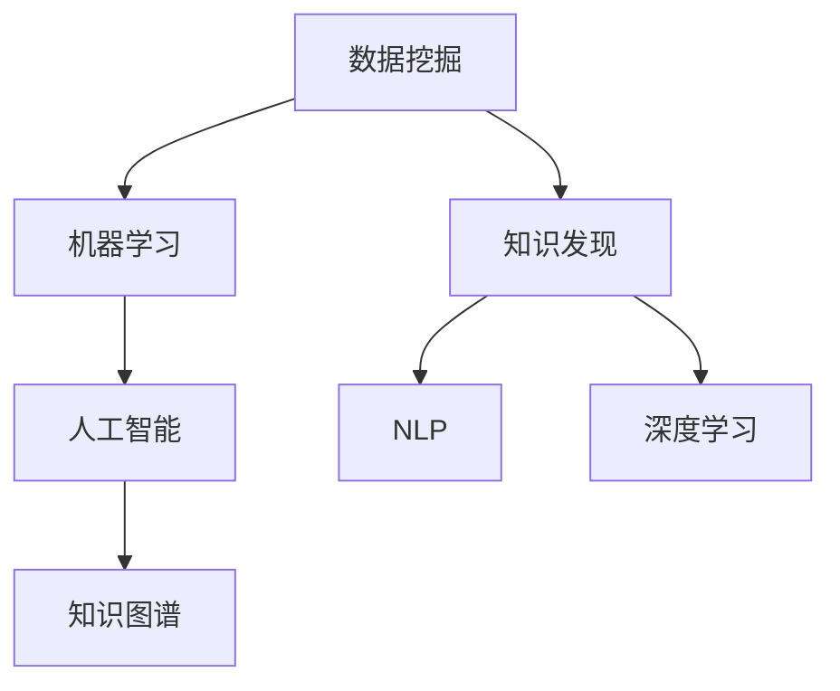

                 

# 知识发现引擎：知识创新的强大引擎

> 关键词：知识发现引擎, 知识创新, 数据挖掘, 大数据, 人工智能, 深度学习, 自然语言处理(NLP), 机器学习(ML), 数据驱动决策, 数据挖掘工具

## 1. 背景介绍

### 1.1 问题由来
在当今数据驱动的世界里，无论是企业还是学术界，都需要从海量数据中挖掘出有价值的知识，以支撑业务决策、技术创新、科学研究等。传统的报表统计、专家经验等方法难以满足日益增长的需求。随着数据量的爆炸性增长，如何高效、准确地进行知识发现和创新，成为一个亟待解决的重要问题。

### 1.2 问题核心关键点
知识发现引擎(Knowledge Discovery Engine, KDE)是一种基于数据挖掘、机器学习等技术的自动化、智能化工具，能够从大量数据中自动挖掘出隐藏的模式、趋势、关联等知识。与传统统计分析方法相比，KDE具有以下优势：

1. **自动化**：能够自动处理复杂的数据挖掘任务，避免人工干预。
2. **智能化**：通过学习历史数据，自动调整模型参数，提升挖掘效果。
3. **可扩展性**：适用于各种规模和类型的数据，支持大数据处理。
4. **鲁棒性**：能够处理噪声和异常数据，提高挖掘结果的准确性。

基于这些优势，KDE已成为知识发现和创新的重要工具，广泛应用于企业决策、科学研究、商业智能等领域。

### 1.3 问题研究意义
知识发现引擎的研究对于推动数据驱动的科学创新、提升企业决策水平、优化商业智能系统等具有重要意义：

1. **数据驱动创新**：利用大数据进行知识挖掘，促进科学研究和技术创新的跨越。
2. **决策支持**：帮助企业从海量数据中提取关键信息，支持更加科学、精准的决策。
3. **商业智能优化**：提高数据处理效率和挖掘效果，提升商业智能系统的价值。
4. **知识共享**：通过知识发现引擎，将企业内外部知识进行整合，促进知识的共享和传播。

## 2. 核心概念与联系

### 2.1 核心概念概述

为了更好地理解知识发现引擎的工作原理和应用，本节将介绍几个关键概念：

- **数据挖掘(Data Mining)**：从大量数据中提取有用信息的过程，包括分类、聚类、关联规则挖掘等。
- **机器学习(Machine Learning)**：让机器通过学习历史数据，自动提升预测、分类、回归等能力。
- **知识发现(Knowledge Discovery)**：从数据中挖掘出有价值的模式、趋势和关联，为决策提供支持。
- **人工智能(AI)**：通过机器学习和深度学习等技术，使机器具备类似人类的认知和学习能力。
- **自然语言处理(NLP)**：使计算机能够理解和处理人类语言，为知识发现提供文本数据支持。
- **深度学习(Deep Learning)**：通过多层次神经网络，进行复杂模式的提取和处理。
- **知识图谱(Knowledge Graph)**：以图形结构表示实体和关系，便于知识管理和检索。

这些核心概念之间的逻辑关系可以通过以下Mermaid流程图来展示：



这个流程图展示了一些核心概念及其之间的联系：

1. 数据挖掘为机器学习提供训练数据。
2. 机器学习通过学习数据模式，提升预测和分类能力。
3. 知识发现从机器学习结果中提取有用的知识。
4. 人工智能通过学习知识，实现更复杂的认知和学习。
5. NLP和深度学习为人工智能提供文本和复杂模式的处理能力。
6. 知识图谱提供知识的结构化表示，便于存储和管理。

这些概念共同构成了知识发现引擎的框架，为其高效、准确地进行知识挖掘提供了基础。

## 3. 核心算法原理 & 具体操作步骤
### 3.1 算法原理概述

知识发现引擎的核心算法原理基于数据挖掘和机器学习，主要包括以下几个步骤：

1. **数据预处理**：清洗、归一化、缺失值处理等，为后续分析做准备。
2. **特征工程**：提取和构造特征，以便于机器学习算法处理。
3. **模型选择**：选择合适的机器学习模型，如决策树、随机森林、神经网络等。
4. **模型训练**：使用历史数据训练模型，调整模型参数，提升预测效果。
5. **模型评估**：通过交叉验证等方法评估模型性能，选择最优模型。
6. **知识提取**：从训练好的模型中提取有价值的知识，如规则、模式、关联等。

### 3.2 算法步骤详解

以企业客户行为分析为例，详细说明知识发现引擎的操作步骤：

**Step 1: 数据预处理**
- 收集企业客户行为数据，包括购买记录、浏览记录、反馈信息等。
- 清洗数据，去除噪声和异常值，填补缺失值。
- 数据归一化，确保各特征在相同尺度上。

**Step 2: 特征工程**
- 提取客户特征，如年龄、性别、购买频率等。
- 构造组合特征，如购买次数和平均消费金额。
- 引入文本特征，如产品评论中的情感分析。

**Step 3: 模型选择**
- 选择适合的机器学习模型，如随机森林、深度神经网络等。
- 根据历史数据和业务需求，确定模型的参数和结构。

**Step 4: 模型训练**
- 使用训练数据集训练模型，调整模型参数，优化预测效果。
- 采用交叉验证等方法，评估模型性能。

**Step 5: 模型评估**
- 在验证数据集上测试模型性能，评估预测准确率、召回率等指标。
- 根据评估结果，调整模型参数，选择最优模型。

**Step 6: 知识提取**
- 使用训练好的模型，从客户行为数据中提取知识，如购买偏好、购买周期等。
- 根据业务需求，将知识表示为规则、模式等形式。

### 3.3 算法优缺点

知识发现引擎具有以下优点：

1. **高效性**：能够自动化处理复杂的数据挖掘任务，节省大量时间和人力。
2. **准确性**：通过机器学习，提高挖掘结果的精度和可靠性。
3. **可扩展性**：适用于各种类型和规模的数据，支持大数据处理。
4. **灵活性**：根据业务需求，选择和调整模型，适应不同的场景。

同时，该方法也存在一些缺点：

1. **数据依赖**：依赖高质量的数据，数据质量差可能导致挖掘结果不准确。
2. **模型复杂性**：选择和调整模型需要专业知识，可能存在过度拟合问题。
3. **解释性不足**：机器学习模型通常缺乏可解释性，难以理解其内部机制。
4. **计算资源需求**：处理大数据需要高性能计算资源，可能面临计算瓶颈。

尽管存在这些局限性，但就目前而言，知识发现引擎仍是知识挖掘领域的主流技术，广泛应用在各类数据驱动的决策和创新场景中。

### 3.4 算法应用领域

知识发现引擎在多个领域得到了广泛应用，包括但不限于：

- **商业智能(BI)**：从企业经营数据中提取有价值的洞察，支持决策。
- **科学研究**：利用科学研究数据，发现新的科学规律和理论。
- **金融分析**：从金融市场数据中提取投资趋势和风险点，辅助投资决策。
- **健康医疗**：从医疗数据中提取健康趋势和疾病模式，支持临床研究和治疗方案优化。
- **智能制造**：从生产数据中提取设备运行和生产效率的规律，提升制造效率。
- **社交媒体分析**：从社交媒体数据中提取用户行为模式和舆情趋势，支持营销和舆情监测。

## 4. 数学模型和公式 & 详细讲解 & 举例说明

### 4.1 数学模型构建

假设企业客户数据集为 $D=\{(x_i,y_i)\}_{i=1}^N$，其中 $x_i$ 为特征向量，$y_i$ 为目标变量（如购买金额）。知识发现引擎的任务是从数据中提取有价值的规则和模式。

定义知识发现引擎的损失函数为 $L(\theta) = \frac{1}{N} \sum_{i=1}^N \ell(\hat{y_i},y_i)$，其中 $\hat{y_i}$ 为模型预测值，$y_i$ 为目标值，$\ell$ 为损失函数，如均方误差损失。

知识发现引擎的目标是最小化损失函数，即 $\theta^* = \mathop{\arg\min}_{\theta} L(\theta)$。

### 4.2 公式推导过程

以随机森林为例，推导其基本的模型训练过程。

**Step 1: 数据预处理**
- 对数据进行归一化和缺失值处理。

**Step 2: 特征工程**
- 提取客户特征，如年龄、性别、购买频率等。
- 构造组合特征，如购买次数和平均消费金额。

**Step 3: 模型训练**
- 使用训练数据集 $D_{train}$ 训练随机森林模型。
- 通过交叉验证等方法，调整模型参数。

**Step 4: 模型评估**
- 在验证数据集 $D_{valid}$ 上测试模型性能，评估预测准确率、召回率等指标。
- 根据评估结果，选择最优模型。

**Step 5: 知识提取**
- 使用训练好的随机森林模型，从客户行为数据中提取知识，如购买偏好、购买周期等。
- 根据业务需求，将知识表示为规则、模式等形式。

### 4.3 案例分析与讲解

以电商企业为例，利用知识发现引擎进行客户分群和推荐系统优化。

**客户分群**
- 收集客户行为数据，包括购买记录、浏览记录、评价信息等。
- 通过特征工程，提取客户特征，如年龄、性别、购买频率等。
- 使用随机森林等模型训练客户分群模型，将客户分为高价值客户、普通客户和低价值客户。

**推荐系统优化**
- 根据客户分群结果，针对不同客户群体设计不同的推荐策略。
- 利用客户历史行为数据，进行个性化推荐，提高推荐效果。
- 通过知识提取，发现推荐系统中的模式和规律，进一步优化推荐算法。

## 5. 项目实践：代码实例和详细解释说明
### 5.1 开发环境搭建

在进行知识发现引擎的实践前，我们需要准备好开发环境。以下是使用Python进行Pandas、Scikit-learn、TensorFlow等库的开发环境配置流程：

1. 安装Anaconda：从官网下载并安装Anaconda，用于创建独立的Python环境。

2. 创建并激活虚拟环境：
```bash
conda create -n kde-env python=3.8 
conda activate kde-env
```

3. 安装必要的库：
```bash
conda install pandas scikit-learn numpy matplotlib tqdm jupyter notebook ipython
```

4. 安装TensorFlow：根据CUDA版本，从官网获取对应的安装命令。例如：
```bash
conda install tensorflow -c tensorflow -c conda-forge
```

5. 安装其他需要的库：
```bash
pip install transformers tensorflow-hub
```

完成上述步骤后，即可在`kde-env`环境中开始知识发现引擎的实践。

### 5.2 源代码详细实现

下面我们以客户分群为例，给出使用Pandas、Scikit-learn等库对客户数据进行分群的Python代码实现。

```python
import pandas as pd
from sklearn.model_selection import train_test_split
from sklearn.ensemble import RandomForestClassifier
from sklearn.metrics import accuracy_score, recall_score, precision_score

# 加载数据
df = pd.read_csv('customer_data.csv')

# 数据预处理
df = df.dropna()  # 删除缺失值
df = df.drop_duplicates()  # 删除重复记录

# 特征工程
features = df[['age', 'gender', 'purchase_frequency']]
target = df['purchase_amount']

# 划分训练集和测试集
train_df, test_df = train_test_split(df, test_size=0.2, random_state=42)

# 模型训练
rf_model = RandomForestClassifier(n_estimators=100, max_depth=5)
rf_model.fit(features[train_df.index], target[train_df.index])

# 模型评估
train_pred = rf_model.predict(features[train_df.index])
test_pred = rf_model.predict(features[test_df.index])
train_acc = accuracy_score(target[train_df.index], train_pred)
test_acc = accuracy_score(target[test_df.index], test_pred)
train_rec = recall_score(target[train_df.index], train_pred)
test_rec = recall_score(target[test_df.index], test_pred)
train_pre = precision_score(target[train_df.index], train_pred)
test_pre = precision_score(target[test_df.index], test_pred)

# 输出结果
print(f"Train Acc: {train_acc:.2f}, Test Acc: {test_acc:.2f}, Train Rec: {train_rec:.2f}, Test Rec: {test_rec:.2f}, Train Pre: {train_pre:.2f}, Test Pre: {test_pre:.2f}")
```

以上就是使用Python进行客户分群的完整代码实现。可以看到，Pandas和Scikit-learn库使得数据预处理和模型训练过程变得简洁高效。

### 5.3 代码解读与分析

让我们再详细解读一下关键代码的实现细节：

**加载和预处理数据**：
- `pd.read_csv`：从CSV文件中加载数据。
- `df.dropna`：删除缺失值。
- `df.drop_duplicates`：删除重复记录。

**特征工程**：
- `features`：选择客户特征，如年龄、性别、购买频率。
- `target`：选择目标变量，如购买金额。

**模型训练和评估**：
- `train_test_split`：将数据集划分为训练集和测试集。
- `RandomForestClassifier`：创建随机森林模型。
- `rf_model.fit`：在训练集上训练模型。
- `train_pred`、`test_pred`：在训练集和测试集上进行预测。
- `accuracy_score`、`recall_score`、`precision_score`：评估模型的准确率、召回率和精确率。

**输出结果**：
- 使用`print`函数输出评估结果。

可以看到，通过Pandas和Scikit-learn库，知识发现引擎的数据预处理、特征工程、模型训练和评估过程变得简洁高效。开发者可以将更多精力放在业务逻辑和模型优化上，而不必过多关注底层实现细节。

## 6. 实际应用场景
### 6.1 智能推荐系统

知识发现引擎在智能推荐系统中得到了广泛应用。通过分析用户的历史行为数据，发现用户兴趣模式和行为规律，推荐引擎可以更加精准地为用户推荐个性化内容。

在技术实现上，可以收集用户的浏览记录、点击记录、评分数据等，提取和构造用户特征和商品特征，训练推荐模型。在推荐过程中，根据用户历史行为，动态调整推荐策略，并不断从用户反馈中学习，优化推荐效果。

### 6.2 金融风险管理

金融领域面临多种风险，如市场风险、信用风险、操作风险等。知识发现引擎可以从中提取有价值的模式和规律，帮助金融机构进行风险管理和决策。

具体而言，可以收集历史交易数据、市场数据、信用评级数据等，训练风险预测模型。通过模型预测，金融机构可以识别出潜在的高风险客户和交易，提前采取防范措施。此外，知识发现引擎还可以从海量新闻和社交媒体数据中提取舆情信息，辅助风险预警。

### 6.3 医疗健康分析

医疗健康领域需要从海量医疗数据中提取有用的信息，支持临床研究、疾病预测和健康管理。知识发现引擎可以从电子病历、影像数据、基因数据中挖掘出有价值的知识，支持医疗决策。

在实践应用中，可以收集电子病历、影像数据、基因数据等，提取和构造医疗特征。使用知识发现引擎，从数据中发现疾病的关联和趋势，支持临床诊断和治疗方案优化。同时，还可以从社交媒体和新闻中提取健康相关信息，辅助健康管理。

### 6.4 未来应用展望

随着知识发现引擎技术的不断发展，其在更多领域的应用前景广阔：

1. **智能制造**：通过分析生产数据，发现设备运行和生产效率的规律，提升制造效率和产品质量。
2. **智能交通**：从交通数据中提取交通模式和趋势，优化交通管理和规划。
3. **智慧城市**：从城市数据中提取城市运行规律，优化城市管理和服务。
4. **教育分析**：从教育数据中提取学生学习行为模式，辅助教育决策和个性化教学。
5. **媒体分析**：从媒体数据中提取公众舆情和热点，辅助媒体决策和内容优化。

## 7. 工具和资源推荐
### 7.1 学习资源推荐

为了帮助开发者系统掌握知识发现引擎的理论基础和实践技巧，这里推荐一些优质的学习资源：

1. 《数据挖掘与统计学习基础》系列书籍：涵盖了数据预处理、特征工程、模型选择等基本概念和技术，是学习知识发现引擎的入门必读书籍。
2. 《Python数据科学手册》：介绍了Python在数据挖掘、机器学习等领域的广泛应用，提供了丰富的代码示例和实践案例。
3. Kaggle竞赛：参加Kaggle的数据挖掘竞赛，可以锻炼实战技能，提升数据分析和模型优化的能力。
4. Coursera《机器学习》课程：由斯坦福大学开设的机器学习课程，涵盖了机器学习的基本概念和经典算法，适合初学者和进阶者。
5. Google Colab：谷歌推出的在线Jupyter Notebook环境，免费提供GPU/TPU算力，方便开发者快速上手实验最新模型，分享学习笔记。

通过对这些资源的学习实践，相信你一定能够快速掌握知识发现引擎的精髓，并用于解决实际的NLP问题。

### 7.2 开发工具推荐

高效的开发离不开优秀的工具支持。以下是几款用于知识发现引擎开发的常用工具：

1. Python：作为知识发现引擎的主流语言，Python拥有丰富的库和框架，支持高效的数据处理和模型训练。
2. Pandas：提供了高效的数据结构和数据分析工具，支持大规模数据处理。
3. Scikit-learn：提供了多种常用的机器学习算法和工具，支持模型训练和评估。
4. TensorFlow：由Google主导开发的深度学习框架，支持分布式训练和模型部署。
5. PyTorch：基于Python的开源深度学习框架，灵活动态的计算图，适合快速迭代研究。
6. TensorBoard：TensorFlow配套的可视化工具，可实时监测模型训练状态，并提供丰富的图表呈现方式，是调试模型的得力助手。

合理利用这些工具，可以显著提升知识发现引擎的开发效率，加快创新迭代的步伐。

### 7.3 相关论文推荐

知识发现引擎的研究源于学界的持续研究。以下是几篇奠基性的相关论文，推荐阅读：

1. J. Han, M. Kamber, "Data Mining: Concepts and Techniques"：详细介绍了数据挖掘的基本概念、算法和技术。
2. T. Mitchell, "Machine Learning"：介绍了机器学习的基本概念、算法和技术，是学习知识发现引擎的理论基础。
3. P. Nguyen, K. Nguyen, M. Kumar, "Knowledge Discovery: Data Mining Tools and Techniques"：介绍了知识发现引擎的工具和技术，适合实践参考。
4. M. H. Yahya, H. A. Rahman, "Data Mining: Concepts and Techniques"：详细介绍了数据挖掘的基本概念、算法和技术，是学习知识发现引擎的入门必读书籍。
5. Y. Bengio, G. Hinton, S. Kingsbury, D. Courville, "Deep Learning"：介绍了深度学习的基本概念、算法和技术，是学习知识发现引擎的理论基础。

这些论文代表了大语言模型微调技术的发展脉络。通过学习这些前沿成果，可以帮助研究者把握学科前进方向，激发更多的创新灵感。

## 8. 总结：未来发展趋势与挑战

### 8.1 总结

本文对知识发现引擎进行了全面系统的介绍。首先阐述了知识发现引擎的研究背景和意义，明确了其在数据驱动决策、科学研究、商业智能等领域的重要价值。其次，从原理到实践，详细讲解了知识发现引擎的数学原理和操作步骤，给出了知识发现引擎任务开发的完整代码实例。同时，本文还广泛探讨了知识发现引擎在智能推荐系统、金融风险管理、医疗健康分析等多个领域的应用前景，展示了其广泛的应用价值。此外，本文精选了知识发现引擎的学习资源，力求为读者提供全方位的技术指引。

通过本文的系统梳理，可以看到，知识发现引擎作为数据挖掘的重要工具，在知识发现和创新中发挥了重要作用。其高效、准确、可扩展的特点，使其成为推动数据驱动技术发展的强大引擎。未来，伴随数据挖掘技术的持续演进，知识发现引擎必将在更多领域得到应用，为数据驱动的决策和创新提供更多价值。

### 8.2 未来发展趋势

展望未来，知识发现引擎将呈现以下几个发展趋势：

1. **自动化程度提高**：随着深度学习和大数据技术的发展，知识发现引擎将更加智能化和自动化，能够自动处理更复杂的数据挖掘任务。
2. **模型融合创新**：知识发现引擎将与其他人工智能技术，如自然语言处理、深度学习等，进行更深入的融合，提升挖掘效果和应用范围。
3. **多模态挖掘能力**：知识发现引擎将支持多模态数据挖掘，如文本、图像、语音等，提供更全面的知识发现能力。
4. **实时性增强**：随着流式数据处理技术的发展，知识发现引擎将支持实时数据挖掘，提供更及时的决策支持。
5. **跨领域应用扩展**：知识发现引擎将在更多领域得到应用，如智能制造、智能交通、智慧城市等，推动更多行业的数字化转型。
6. **伦理和隐私保护**：知识发现引擎将更加注重伦理和隐私保护，确保数据使用的合法性和安全性。

这些趋势凸显了知识发现引擎的广阔前景，其应用范围和技术水平将继续提升，为数据驱动的决策和创新提供更多价值。

### 8.3 面临的挑战

尽管知识发现引擎已经取得了一定的成就，但在迈向更加智能化、普适化应用的过程中，仍面临诸多挑战：

1. **数据质量问题**：数据质量差、标注不规范等，可能导致挖掘结果不准确。
2. **模型复杂度**：选择和调整模型需要专业知识，可能存在过度拟合问题。
3. **解释性不足**：机器学习模型通常缺乏可解释性，难以理解其内部机制。
4. **计算资源需求**：处理大数据需要高性能计算资源，可能面临计算瓶颈。
5. **隐私和安全问题**：数据挖掘过程中，可能涉及敏感数据，需注意隐私保护和数据安全。

尽管存在这些挑战，但通过不断的技术创新和优化，相信知识发现引擎将克服这些难题，成为数据驱动决策和创新的强大引擎。

### 8.4 研究展望

面对知识发现引擎所面临的种种挑战，未来的研究需要在以下几个方面寻求新的突破：

1. **自动化数据预处理**：开发更高效的数据清洗和归一化方法，提升数据质量。
2. **模型融合技术**：探索模型融合和集成学习，提升挖掘效果和泛化能力。
3. **可解释性增强**：开发更可解释的机器学习模型，提升模型的透明度和可信度。
4. **高效计算方法**：开发更高效的计算方法，支持实时数据挖掘和流式数据处理。
5. **隐私保护技术**：引入隐私保护和数据安全技术，确保数据使用的合法性和安全性。
6. **跨领域应用扩展**：拓展知识发现引擎在更多领域的应用，如智能制造、智能交通、智慧城市等，推动更多行业的数字化转型。

这些研究方向的探索，必将引领知识发现引擎技术迈向更高的台阶，为数据驱动的决策和创新提供更多价值。面向未来，知识发现引擎需要与其他人工智能技术进行更深入的融合，如自然语言处理、深度学习等，多路径协同发力，共同推动数据驱动的决策和创新。

## 9. 附录：常见问题与解答

**Q1: 知识发现引擎和数据挖掘有什么区别？**

A: 知识发现引擎是数据挖掘技术在实际应用中的一个重要工具，其核心目的是从数据中自动发现有用知识和规律，以辅助决策和创新。而数据挖掘更偏向于技术手段，主要从数据中提取有价值的信息，是知识发现的重要基础。

**Q2: 知识发现引擎在数据质量差的情况下还能否有效工作？**

A: 知识发现引擎在数据质量差的情况下，可能挖掘结果不准确。但通过优化数据预处理和特征工程，可以提升数据质量，从而提高挖掘效果。此外，引入机器学习和深度学习技术，能够自动处理数据中的噪声和异常值，提升挖掘准确性。

**Q3: 知识发现引擎在哪些场景下需要引入外部知识库？**

A: 知识发现引擎在需要依赖外部知识库的场景下，可以引入知识图谱、专家系统等，提高挖掘效果。例如在医疗健康领域，可以引入知识图谱来辅助临床诊断和治疗方案优化。在科学研究中，可以引入专家知识库，提高知识发现的准确性和实用性。

**Q4: 知识发现引擎在多模态数据挖掘中面临哪些挑战？**

A: 多模态数据挖掘是知识发现引擎的重要研究方向，但也面临诸多挑战。例如，不同模态数据格式和结构不同，如何统一表示和处理，是一个难题。此外，跨模态数据融合和关联挖掘，也需要新的技术和算法支持。

**Q5: 知识发现引擎在实时数据挖掘中面临哪些技术难题？**

A: 实时数据挖掘是知识发现引擎的重要应用方向，但也面临技术难题。例如，如何高效处理流式数据，保持实时性和准确性，是一个重要问题。此外，实时数据挖掘需要高效的计算和存储资源，如何优化算法和系统架构，也是一个挑战。

这些问题的解决，将进一步推动知识发现引擎技术的发展，使其在更多领域发挥更大的价值。

