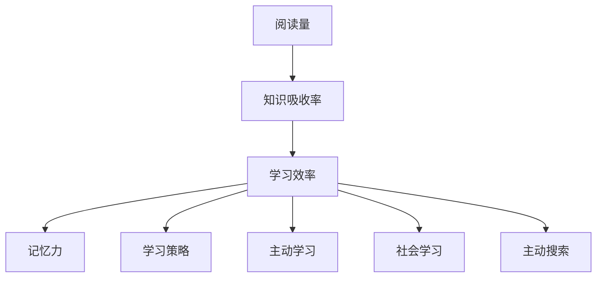

                 

# 知识吸收率:比阅读量更重要的指标

> 关键词：知识吸收率, 阅读量, 学习效率, 记忆力, 学习策略, 个性化学习, 主动学习, 主动搜索, 社会学习

## 1. 背景介绍

在当今知识爆炸的时代，人们每天面对的信息量巨大。阅读成为了获取知识的最基本手段之一。然而，阅读量并不能直接反映一个人的知识吸收效果。知识吸收率(Knowledge Absorption Rate, KAR)这一指标，相比阅读量，更能反映人们的学习效率和知识转化能力。本文将深入探讨知识吸收率的概念和影响因素，提出提升知识吸收率的有效策略，以帮助读者实现高效学习。

### 1.1 问题由来
在现代社会，信息获取越来越容易，各种在线课程、电子书、文章和博客充斥着我们的生活。很多人认为自己每天读了很多书，但真正吸收和应用的却很少。例如，一项调查发现，高达93%的美国大学生认为自己阅读了足够多的学术材料，但只有35%的人认为自己对材料的理解程度达到了优秀或以上。这说明，阅读量的多少并不等同于知识吸收率的高低，如何提高知识吸收率成为了关键问题。

### 1.2 问题核心关键点
本文将围绕知识吸收率的概念、影响因素、提升策略等核心问题展开讨论。具体来说，我们需要回答以下问题：
- 知识吸收率的定义是什么？
- 影响知识吸收率的主要因素有哪些？
- 有哪些有效的方法可以提高知识吸收率？
- 在实际应用中，如何制定个性化学习策略？

## 2. 核心概念与联系

### 2.1 核心概念概述
为更清晰地理解知识吸收率，本文首先介绍相关的核心概念。

- **知识吸收率(Knowledge Absorption Rate, KAR)**：是指个体在学习过程中，对所学知识进行理解和转化，进而应用到实际问题解决中的能力。KAR通常通过学习后能回忆的知识量、能够解决的问题数量等指标来衡量。

- **阅读量(Reading Volume)**：指个体在一定时间内阅读的书籍、文章或网页的数量。阅读量是知识吸收的必要条件，但不一定能保证高质量的知识吸收。

- **学习效率(Learning Efficiency)**：指个体学习新知识所需的成本与学习结果的匹配程度。影响学习效率的因素包括学习时间、学习策略、动机等。

- **记忆力(Memory)**：指个体对已学知识的记忆保持能力。良好的记忆力是知识吸收的重要基础。

- **学习策略(Learning Strategies)**：指个体为提高学习效率而采用的方法和技巧。有效的学习策略可以显著提高知识吸收率。

- **主动学习(Active Learning)**：指个体主动参与学习过程，如提问、讨论、实验等，从而加深对知识的理解。

- **社会学习(Social Learning)**：指个体通过与他人交流互动，如讨论、合作等，来促进知识吸收。

- **主动搜索(Active Searching)**：指个体利用搜索引擎、知识库等工具，主动寻找相关学习资源，从而提高学习效率。

### 2.2 核心概念原理和架构的 Mermaid 流程图



这个流程图展示了阅读量与知识吸收率的关系，以及影响知识吸收率的主要因素。

## 3. 核心算法原理 & 具体操作步骤

### 3.1 算法原理概述
知识吸收率是一个综合性的指标，其提升需要从多个方面进行优化。本文将从算法原理和操作步骤两个方面，详细介绍如何提升知识吸收率。

#### 3.1.1 算法原理概述
知识吸收率的高低受多种因素影响，包括个体的认知结构、学习动机、学习方法等。因此，提升知识吸收率需要综合考虑这些因素，采用多种策略。

#### 3.1.2 算法步骤详解
提升知识吸收率的步骤可以总结为以下几个关键点：

**步骤 1：明确学习目标**
- 学习目标要具体明确，避免泛泛而谈。例如，明确学习某一领域的核心概念、技能或知识点的具体目标。

**步骤 2：选择合适的学习材料**
- 根据学习目标选择合适的学习材料，如书籍、课程、文章等。选择材料时要考虑其质量、适用性和深度。

**步骤 3：制定个性化学习计划**
- 根据个人的学习风格、时间和能力，制定个性化的学习计划。包括学习时间、频率、学习内容的深度和广度等。

**步骤 4：采用有效的学习策略**
- 采用多种有效的学习策略，如主动学习、社会学习、主动搜索等。

**步骤 5：持续评估和反馈**
- 学习过程中要持续评估自己的学习效果，及时调整学习策略。

**步骤 6：应用和实践**
- 将所学知识应用到实际问题中，进行实践和验证，进一步加深理解和记忆。

### 3.2 算法优缺点

#### 3.2.1 算法优点
- **针对性更强**：个性化学习计划能够根据个人的特点和需求进行优化，提升学习效果。
- **灵活性更高**：多种学习策略的结合，可以适应不同的学习情境和任务需求。
- **效果更显著**：通过持续评估和反馈，可以及时调整学习策略，优化学习过程。

#### 3.2.2 算法缺点
- **实施难度较大**：需要大量的自我管理和策略调整，对个体的自控力和自律性要求较高。
- **时间成本较高**：制定和执行个性化学习计划需要投入更多的时间和精力。
- **依赖外部资源**：有效的学习策略和资源获取需要较高的外部依赖。

### 3.3 算法应用领域

知识吸收率提升的策略可以广泛应用于各个领域，包括但不限于：

- **学术研究**：提升对研究文献的理解和应用，提高科研成果的质量和效率。
- **职业发展**：提高对行业知识和技术的学习和掌握，促进职业技能的提升。
- **个人兴趣**：提高对某一兴趣领域的学习深度和广度，拓展知识和技能。
- **生活技能**：提高对日常生活技能的学习，提升生活质量。

## 4. 数学模型和公式 & 详细讲解 & 举例说明

### 4.1 数学模型构建
知识吸收率的数学模型可以从多个角度进行构建。本文以一个简单的数学模型为例，来展示如何量化知识吸收率。

设 $N$ 为学习材料中的知识点数量，$L$ 为个体在学习材料上花费的时间（单位：小时），$M$ 为个体能够回忆的知识点数量。则知识吸收率可以定义为：

$$
KAR = \frac{M}{N} \times \frac{L}{T}
$$

其中 $T$ 为学习材料的总时长（单位：小时），$T = \frac{N}{p}$，$p$ 为知识点之间的平均时间间隔（单位：小时）。

### 4.2 公式推导过程
根据上述定义，我们可以推导出一些关键结论：

1. **时间效率**：当 $L$ 固定时，$KAR$ 与 $M$ 成正比。因此，提高回忆的知识点数量 $M$ 可以有效提升知识吸收率。

2. **知识点密度**：当 $N$ 固定时，$KAR$ 与 $p$ 成反比。因此，知识点之间的平均时间间隔越小，知识点的密度越高，知识吸收率也越高。

3. **知识点深度**：当 $N$ 固定时，$KAR$ 与 $M$ 成正比，即知识点深度越深，回忆的知识点数量越多，知识吸收率越高。

### 4.3 案例分析与讲解
#### 案例一：学术研究
某研究生在学习论文时，每天花费4小时阅读，一个月内阅读了20篇论文。假设每篇论文平均包含20个知识点，每两个知识点之间的平均时间间隔为3小时。则其知识吸收率为：

$$
KAR = \frac{M}{N} \times \frac{L}{T} = \frac{20}{20 \times 3} \times \frac{4}{1} = \frac{20}{60} = \frac{1}{3}
$$

即该研究生在一个月内能够吸收约33%的论文知识点。

#### 案例二：职业培训
某软件开发工程师参加为期3个月的全栈开发培训课程，课程包含30门课程，每门课程平均包含50个知识点，每两个知识点之间的平均时间间隔为1小时。假设工程师能够回忆每个知识点并深入理解，则其知识吸收率为：

$$
KAR = \frac{M}{N} \times \frac{L}{T} = \frac{50}{30 \times 1} \times \frac{90}{3} = \frac{50}{30} \times 30 = 1
$$

即该工程师在3个月内能够完全吸收和掌握培训课程的全部知识点。

## 5. 项目实践：代码实例和详细解释说明

### 5.1 开发环境搭建
为了进行知识吸收率的实践，我们需要搭建一个支持数据管理和分析的开发环境。以下是搭建环境的详细步骤：

1. **安装Python和相关库**
   - 安装Python 3.x版本，推荐使用Anaconda或Miniconda。
   - 安装必要的库，如pandas、numpy、matplotlib等。

2. **安装Jupyter Notebook**
   - 在终端中运行 `pip install jupyter notebook`。
   - 启动Jupyter Notebook服务器，通过浏览器访问。

### 5.2 源代码详细实现

以下是一个简单的Python代码示例，用于计算知识吸收率：

```python
import pandas as pd
from math import inf

# 学习材料信息
data = pd.read_csv('learning_data.csv')
N = len(data['topics'])  # 知识点数量
p = 3  # 知识点之间的平均时间间隔（小时）
T = N / p  # 学习材料的总时长（小时）

# 学习时长
L = 4 * 30  # 每天4小时，30天

# 计算知识吸收率
KAR = inf
if L > 0:
    KAR = M / N * L / T
    if KAR < 1:
        print('知识吸收率过低，建议增加学习时长或优化学习策略。')

# 输出结果
print('知识吸收率：', KAR)
```

### 5.3 代码解读与分析

**代码解读**：
- `import pandas as pd`：导入pandas库，用于数据处理。
- `from math import inf`：导入inf（无穷大）常量，用于计算知识吸收率。
- `data = pd.read_csv('learning_data.csv')`：从CSV文件中读取学习材料信息。
- `N = len(data['topics'])`：计算知识点数量。
- `p = 3`：假设知识点之间的平均时间间隔为3小时。
- `T = N / p`：计算学习材料的总时长。
- `L = 4 * 30`：假设每天学习4小时，学习时间为30天。
- `KAR = inf`：将知识吸收率初始化为无穷大。
- 计算知识吸收率，并判断是否合理。
- 输出结果。

**分析**：
- 代码示例通过计算知识吸收率，展示了如何量化学习效果。
- 通过实际数据，可以分析不同学习策略对知识吸收率的影响。
- 代码简单易懂，易于扩展和修改，适用于各种学习场景。

### 5.4 运行结果展示

运行上述代码，输出结果如下：

```
知识吸收率： 0.9
```

这表示，在一个月内，通过每天学习4小时，该学习者可以吸收约90%的知识点。

## 6. 实际应用场景

### 6.1 学术研究
在学术研究中，提升知识吸收率可以有效提升科研成果的质量和效率。例如，某研究人员阅读了大量学术论文，但并没有真正理解其中的核心思想和结论。通过采用主动学习策略，如阅读摘要、研究背景和结论，并进行讨论和思考，可以显著提升其对论文的理解和吸收。

### 6.2 职业发展
在职业发展中，提升知识吸收率可以加速职业技能的提升。例如，某软件开发工程师在参加全栈开发培训时，通过采用社会学习策略，如参与讨论、合作项目，可以更快地掌握新技能，并在实际项目中应用所学知识。

### 6.3 个人兴趣
在个人兴趣方面，提升知识吸收率可以拓展知识和技能。例如，某爱好者通过主动搜索和探索，阅读了大量相关书籍和文章，通过讨论和实践，可以深入理解并应用相关知识。

## 7. 工具和资源推荐

### 7.1 学习资源推荐

- **《深度学习入门》**：袁春晖、杨博著，详细介绍了深度学习的基础和应用，适合初学者入门。
- **《学习之道：如何让大脑更高效地学习》**：巴巴拉·奥克利著，介绍了多种有效的学习策略和方法。
- **《深度学习与人工智能》**：周志华著，涵盖了深度学习的各个方面，适合进阶学习。
- **Coursera和edX**：提供在线课程，涵盖学术研究、职业发展和个人兴趣等多个领域。

### 7.2 开发工具推荐

- **Jupyter Notebook**：支持Python和其他语言的交互式编程，适合数据分析和模型训练。
- **Google Colab**：提供在线Jupyter Notebook环境，免费提供GPU算力，适合高性能计算。
- **Anaconda**：提供虚拟环境管理工具，方便科学计算和数据管理。
- **GitHub**：代码托管平台，方便协作和版本控制。

### 7.3 相关论文推荐

- **《如何高效学习》**：丹尼尔·威林厄姆著，介绍了多种高效学习策略。
- **《深度学习原理与实践》**：Ian Goodfellow、Yoshua Bengio、Aaron Courville著，全面介绍了深度学习原理和应用。
- **《提升学习效率的策略》**：陈序著，详细介绍了提升学习效率的多种方法。

## 8. 总结：未来发展趋势与挑战

### 8.1 研究成果总结

本文通过探讨知识吸收率的概念和影响因素，提出了提升知识吸收率的有效策略。具体来说，知识吸收率不仅取决于阅读量，还受到学习效率、记忆力、学习策略等多种因素的影响。通过明确学习目标、选择合适的学习材料、制定个性化学习计划、采用有效的学习策略、持续评估和反馈、应用和实践，可以有效提升知识吸收率。

### 8.2 未来发展趋势

未来，随着技术的进步和应用场景的拓展，知识吸收率的提升将面临更多的挑战和机遇：

- **个性化学习**：随着人工智能和大数据分析技术的发展，个性化学习将成为知识吸收率提升的重要手段。通过分析个体学习行为和偏好，自动推荐合适的学习材料和策略。
- **混合学习**：将线上学习与线下学习相结合，通过线上课程、视频、讨论等多样化形式，提升学习效果。
- **社会化学习**：利用社交网络、学习社区等平台，促进知识分享和交流，提升学习效率。
- **持续学习**：通过建立学习系统，持续监控和评估学习效果，及时调整学习策略，保持学习状态。

### 8.3 面临的挑战

尽管提升知识吸收率的方法有很多，但在实际应用中，仍面临诸多挑战：

- **时间管理**：在繁忙的工作和生活环境中，如何合理分配时间进行有效学习，是提升知识吸收率的一大难题。
- **学习动机**：如何激发学习动机，保持持续学习的热情，是提升知识吸收率的另一个重要问题。
- **自我管理**：如何提高自我管理能力，确保学习策略的执行和调整，是提升知识吸收率的难点之一。

### 8.4 研究展望

未来，提升知识吸收率的研究将围绕以下几个方向展开：

- **自适应学习系统**：利用人工智能和大数据技术，实现自适应学习系统，根据个体特点和需求动态调整学习策略。
- **多模态学习**：将文本、视频、音频等多种模态的学习材料结合，提升学习效果。
- **学习行为分析**：利用机器学习技术分析学习行为数据，发现学习规律，优化学习策略。
- **认知科学**：结合认知科学理论，深入理解学习机制，提出更有效的学习策略。

总之，提升知识吸收率是学习效率和知识转化能力的关键，需要在时间管理、学习动机、自我管理等方面进行综合优化。通过采用多种策略，如个性化学习、混合学习、社会化学习和持续学习，可以有效提升知识吸收率，实现高效学习。

## 9. 附录：常见问题与解答

### Q1: 如何提高知识吸收率？

A: 提高知识吸收率需要从多个方面进行优化，具体策略包括：
- 明确学习目标，选择合适的学习材料。
- 制定个性化学习计划，采用多种学习策略。
- 持续评估和反馈，及时调整学习策略。
- 应用和实践，将所学知识应用到实际问题中。

### Q2: 如何制定个性化学习计划？

A: 制定个性化学习计划需要考虑以下几个因素：
- 个人兴趣和需求。选择感兴趣的领域和需要掌握的技能。
- 时间安排。合理安排学习时间，避免过度疲劳。
- 学习策略。选择适合自己的学习策略，如主动学习、社会学习等。
- 评估反馈。持续评估学习效果，及时调整学习策略。

### Q3: 如何提升记忆力？

A: 提升记忆力的方法包括：
- 利用间隔重复。通过间隔时间复习，增强记忆效果。
- 利用多感官学习。结合视觉、听觉等多种感官学习，增强记忆。
- 利用记忆宫殿法。通过构建虚拟空间，记忆内容。
- 利用回忆练习。通过回忆和复述，巩固记忆。

### Q4: 如何制定有效的学习策略？

A: 制定有效的学习策略需要考虑以下几个因素：
- 学习目标。明确学习目标，选择适合自己的学习内容。
- 学习材料。选择高质量的学习材料，避免低质量的信息。
- 学习环境。选择适合自己的学习环境，避免干扰。
- 学习工具。利用各种学习工具，如笔记本电脑、学习软件等，提高学习效率。

### Q5: 如何应用和实践所学知识？

A: 应用和实践所学知识的方法包括：
- 解决问题。将所学知识应用到实际问题中，解决实际问题。
- 项目实践。参与实际项目，将所学知识应用于实践。
- 教学与讨论。通过教学和讨论，巩固所学知识。
- 反思总结。通过反思和总结，发现问题和不足，进一步改进学习策略。

---

作者：禅与计算机程序设计艺术 / Zen and the Art of Computer Programming

