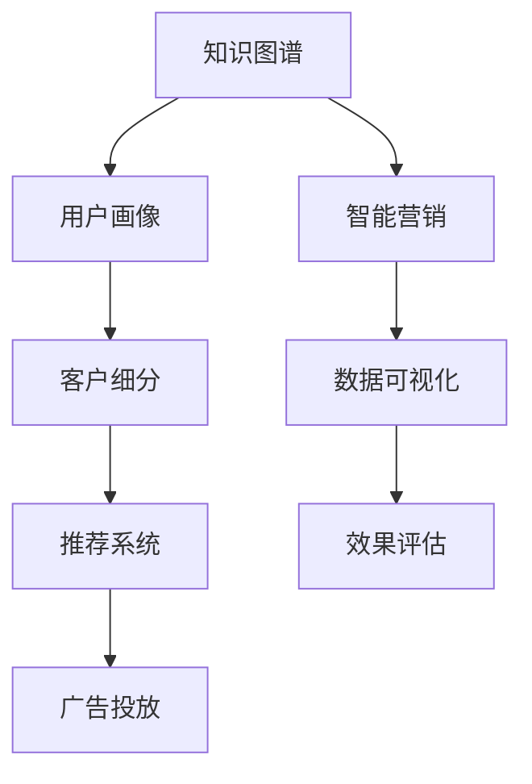

                 

# 知识图谱在智能营销中的应用

> 关键词：知识图谱, 智能营销, 数据驱动, 用户画像, 推荐系统, 客户细分, 广告投放, 数据可视化, 效果评估

## 1. 背景介绍

### 1.1 问题由来
随着数字经济和互联网时代的到来，企业营销的方式也发生了巨大的变化。传统的营销模式越来越难以满足消费者日益多样化的需求，而数字化营销通过精准的数据驱动决策，成为企业提升市场竞争力的重要手段。然而，传统的数据驱动营销在面对海量数据和复杂多变的市场环境时，依然存在诸多挑战，如数据分析能力不足、数据孤岛、市场洞察力不够等问题。

### 1.2 问题核心关键点
为了解决这些问题，知识图谱作为一种新型的数据处理技术，被引入到智能营销中。知识图谱通过构建实体之间的关联网络，可以更好地理解和分析数据，帮助企业在复杂的市场环境中做出更加精准的营销决策。

知识图谱的引入，使得企业能够在海量数据中快速定位和关联信息，构建用户画像，进行客户细分和推荐，优化广告投放策略，实现数据可视化和效果评估。通过知识图谱的强大分析能力，企业可以在降低成本的同时，提高营销效率和效果。

### 1.3 问题研究意义
研究知识图谱在智能营销中的应用，对于提升企业的数字化营销能力、优化客户体验、提高市场竞争力具有重要意义：

1. 精准定位：通过知识图谱构建用户画像，可以更精准地定位目标客户群体，提升营销活动的转化率和效果。
2. 数据融合：将多源异构的数据融合到统一的知识图谱中，可以解决数据孤岛的问题，实现数据共享和协同。
3. 客户细分：利用知识图谱进行客户细分，可以更好地满足不同客户的需求，提供个性化的营销策略。
4. 推荐系统：基于知识图谱的推荐系统可以大幅提升推荐准确性，提高用户满意度和留存率。
5. 效果评估：知识图谱可以辅助进行营销效果评估，及时调整和优化营销策略。
6. 创新营销：利用知识图谱进行数据挖掘和分析，可以创新营销方式，提升品牌影响力。

## 2. 核心概念与联系

### 2.1 核心概念概述

为更好地理解知识图谱在智能营销中的应用，本节将介绍几个密切相关的核心概念：

- 知识图谱：一种结构化的语义知识库，用于表示实体及其之间的关系。
- 智能营销：通过人工智能技术，如机器学习、深度学习等，优化营销策略和过程。
- 用户画像：以用户特征为维度，对用户进行建模，以更好地理解用户需求和行为。
- 推荐系统：利用用户历史行为数据，为用户推荐个性化内容。
- 客户细分：根据用户特征和行为，将客户分成不同的细分群体。
- 广告投放：根据用户画像和细分群体，优化广告投放策略，提升广告效果。
- 数据可视化：通过图形、图表等形式，直观展示数据结果，辅助决策分析。
- 效果评估：通过定义指标和模型，评估营销活动的效果和ROI。

这些核心概念之间的逻辑关系可以通过以下Mermaid流程图来展示：



这个流程图展示了几大核心概念之间的联系：

1. 知识图谱构建用户画像，用于客户细分和个性化推荐。
2. 客户细分为推荐系统和广告投放提供依据。
3. 推荐系统和广告投放执行智能营销策略。
4. 数据可视化辅助效果评估，反馈优化策略。
5. 效果评估指导后续的营销活动优化。

## 3. 核心算法原理 & 具体操作步骤

### 3.1 算法原理概述

知识图谱在智能营销中的应用，主要体现在以下几个方面：

- **用户画像构建**：通过知识图谱关联和融合多源异构数据，构建详细且准确的用户画像。
- **客户细分**：利用知识图谱进行聚类分析，将客户分为不同的细分群体。
- **推荐系统**：基于知识图谱构建的推荐模型，为用户推荐个性化内容。
- **广告投放优化**：通过知识图谱分析用户行为和特征，优化广告投放策略，提高广告效果。

这些应用过程，都是基于机器学习和深度学习算法的实现。核心算法包括聚类分析、关联规则挖掘、图嵌入等。

### 3.2 算法步骤详解

#### 3.2.1 用户画像构建

构建用户画像的算法步骤如下：

1. **数据采集**：从各种数据源（如网站、社交媒体、CRM系统等）采集用户的各类信息（如行为数据、属性数据、交互数据等）。
2. **数据预处理**：对采集到的数据进行清洗、去重、归一化等预处理操作，确保数据质量和一致性。
3. **数据融合**：通过知识图谱将多源异构数据融合到统一的知识库中，构建完整且准确的用户画像。
4. **画像模型训练**：利用机器学习算法对融合后的数据进行建模，构建用户画像。
5. **画像更新和维护**：定期更新和维护用户画像，确保数据的实时性和准确性。

#### 3.2.2 客户细分

客户细分的算法步骤如下：

1. **用户画像分析**：对用户画像进行聚类分析，识别出不同的用户群体。
2. **细分模型训练**：利用聚类算法（如K-means、DBSCAN等）训练客户细分模型。
3. **细分评估**：根据细分模型的效果进行评估，选择最优模型。
4. **细分应用**：将客户分为不同的细分群体，用于个性化推荐和广告投放。

#### 3.2.3 推荐系统

推荐系统的算法步骤如下：

1. **用户画像提取**：从用户画像中提取用户的基本属性和行为特征。
2. **物品特征提取**：从商品或服务中提取基本属性和推荐特征。
3. **模型训练**：利用机器学习算法（如协同过滤、内容过滤等）训练推荐模型。
4. **推荐排序**：利用推荐模型对用户进行个性化推荐排序。
5. **推荐评估**：根据推荐效果进行评估，优化推荐算法。

#### 3.2.4 广告投放优化

广告投放优化的算法步骤如下：

1. **用户画像分析**：分析用户画像中的特征和行为，识别目标客户群体。
2. **广告素材选择**：根据目标客户群体的特征和行为，选择适合的广告素材。
3. **投放策略优化**：利用机器学习算法（如线性回归、逻辑回归等）优化广告投放策略。
4. **效果评估**：评估广告投放效果，反馈优化策略。

### 3.3 算法优缺点

#### 3.3.1 优点

1. **多源数据融合**：知识图谱能够有效融合多源异构数据，构建完整且准确的用户画像和客户细分模型。
2. **高精准度**：利用机器学习算法，能够实现高精度的个性化推荐和广告投放。
3. **实时性**：知识图谱能够实时更新和维护用户画像，保持数据的实时性和准确性。
4. **可解释性**：知识图谱的关联关系和聚类结果，能够提供直观的可视化结果，辅助决策分析。
5. **灵活性**：知识图谱能够灵活应用到各种营销场景中，如客户细分、推荐系统、广告投放等。

#### 3.3.2 缺点

1. **数据质量依赖**：知识图谱的准确性和有效性依赖于数据的质量和一致性。
2. **算法复杂度**：构建和维护知识图谱的算法复杂度较高，需要大量的计算资源。
3. **隐私保护**：知识图谱的应用可能涉及用户隐私数据的收集和使用，需要严格的隐私保护措施。
4. **技术门槛高**：知识图谱的构建和应用需要专业的技术和知识，对企业技术团队的要求较高。

### 3.4 算法应用领域

知识图谱在智能营销中的应用领域广泛，主要包括以下几个方面：

1. **电商平台**：利用知识图谱进行商品推荐、价格优化、库存管理等。
2. **金融行业**：利用知识图谱进行客户风险评估、信用评分、推荐金融产品等。
3. **媒体广告**：利用知识图谱进行内容推荐、广告投放优化、品牌营销等。
4. **旅游行业**：利用知识图谱进行目的地推荐、行程规划、个性化服务等。
5. **医疗健康**：利用知识图谱进行疾病诊断、健康管理、医疗咨询等。
6. **教育培训**：利用知识图谱进行课程推荐、学习路径规划、个性化辅导等。

## 4. 数学模型和公式 & 详细讲解 & 举例说明

### 4.1 数学模型构建

在智能营销中，知识图谱的数学模型构建主要包括以下几个方面：

- **用户画像模型**：基于用户的历史行为和属性数据，构建用户画像。常见的用户画像模型包括决策树、随机森林、协同过滤等。
- **客户细分模型**：利用聚类算法对用户进行细分，常见的聚类算法包括K-means、DBSCAN、层次聚类等。
- **推荐系统模型**：利用协同过滤、内容过滤等算法，为用户推荐个性化内容。
- **广告投放模型**：利用回归分析、逻辑回归等算法，优化广告投放策略。

### 4.2 公式推导过程

#### 4.2.1 用户画像模型

以协同过滤算法为例，用户画像模型公式如下：

$$
P(u) = \frac{1}{|\mathcal{U}|} \sum_{v \in \mathcal{V}} I(u \in \mathcal{N}(v))
$$

其中，$P(u)$ 表示用户 $u$ 的画像，$\mathcal{U}$ 表示用户集合，$\mathcal{V}$ 表示商品集合，$\mathcal{N}(v)$ 表示商品 $v$ 的用户集合，$I$ 表示指示函数。

#### 4.2.2 客户细分模型

以K-means聚类算法为例，客户细分模型公式如下：

$$
\min_{C,\mu} \sum_{i=1}^N \sum_{j=1}^k (x_{ij} - \mu_j)^2
$$

其中，$C$ 表示聚类中心，$\mu$ 表示聚类中心向量，$N$ 表示用户数，$k$ 表示聚类数，$x_{ij}$ 表示用户 $i$ 在 $j$ 类的聚类结果。

#### 4.2.3 推荐系统模型

以协同过滤算法为例，推荐系统模型公式如下：

$$
\hat{y}_{iu} = \frac{\sum_{v \in \mathcal{V}} P(u)_v \times I(u \in \mathcal{N}(v))}{\sqrt{\sum_{v \in \mathcal{V}} P(u)_v^2}}
$$

其中，$\hat{y}_{iu}$ 表示用户 $u$ 对商品 $i$ 的推荐结果，$P(u)$ 表示用户 $u$ 的画像，$I$ 表示指示函数。

#### 4.2.4 广告投放模型

以线性回归算法为例，广告投放模型公式如下：

$$
y = \beta_0 + \sum_{i=1}^p \beta_i x_i
$$

其中，$y$ 表示广告效果，$\beta_0$ 表示截距，$\beta_i$ 表示特征 $x_i$ 的系数，$p$ 表示特征数。

### 4.3 案例分析与讲解

#### 4.3.1 用户画像模型案例

某电商平台的商品推荐系统，利用协同过滤算法构建用户画像。具体步骤如下：

1. 数据采集：从用户的历史行为数据中，提取用户对商品的历史评分。
2. 数据预处理：对数据进行清洗和归一化操作。
3. 模型训练：利用协同过滤算法训练用户画像模型。
4. 画像应用：根据用户画像推荐相似商品。

#### 4.3.2 客户细分模型案例

某金融机构的客户风险评估系统，利用K-means聚类算法进行客户细分。具体步骤如下：

1. 数据采集：从客户的历史交易数据中，提取客户的财务信息和行为数据。
2. 数据预处理：对数据进行清洗和归一化操作。
3. 模型训练：利用K-means聚类算法训练客户细分模型。
4. 细分应用：根据客户细分结果，进行不同的风险评估和客户管理。

#### 4.3.3 推荐系统模型案例

某视频平台的个性化推荐系统，利用协同过滤算法进行推荐。具体步骤如下：

1. 数据采集：从用户的历史行为数据中，提取用户对视频的历史观看数据。
2. 数据预处理：对数据进行清洗和归一化操作。
3. 模型训练：利用协同过滤算法训练推荐模型。
4. 推荐应用：根据推荐模型为用户推荐个性化视频内容。

#### 4.3.4 广告投放模型案例

某旅游平台的广告投放系统，利用线性回归算法优化广告投放策略。具体步骤如下：

1. 数据采集：从用户的浏览行为数据中，提取用户的地理位置、搜索关键词等信息。
2. 数据预处理：对数据进行清洗和归一化操作。
3. 模型训练：利用线性回归算法训练广告投放模型。
4. 投放应用：根据广告投放模型优化广告投放策略。

## 5. 项目实践：代码实例和详细解释说明

### 5.1 开发环境搭建

在进行智能营销项目实践前，我们需要准备好开发环境。以下是使用Python进行PyTorch开发的环境配置流程：

1. 安装Anaconda：从官网下载并安装Anaconda，用于创建独立的Python环境。

2. 创建并激活虚拟环境：
```bash
conda create -n pytorch-env python=3.8 
conda activate pytorch-env
```

3. 安装PyTorch：根据CUDA版本，从官网获取对应的安装命令。例如：
```bash
conda install pytorch torchvision torchaudio cudatoolkit=11.1 -c pytorch -c conda-forge
```

4. 安装TensorFlow：
```bash
pip install tensorflow
```

5. 安装各类工具包：
```bash
pip install numpy pandas scikit-learn matplotlib tqdm jupyter notebook ipython
```

完成上述步骤后，即可在`pytorch-env`环境中开始项目实践。

### 5.2 源代码详细实现

下面以某电商平台的用户画像构建和推荐系统为例，给出使用PyTorch和TensorFlow进行智能营销的代码实现。

首先，定义用户画像的构建函数：

```python
import torch
import torch.nn as nn
import torch.nn.functional as F
import pandas as pd
import numpy as np
from sklearn.preprocessing import StandardScaler
from sklearn.decomposition import PCA
from sklearn.cluster import KMeans

# 定义用户画像模型
class UserProfile(nn.Module):
    def __init__(self, n_features):
        super(UserProfile, self).__init__()
        self.fc1 = nn.Linear(n_features, 128)
        self.fc2 = nn.Linear(128, 64)
        self.fc3 = nn.Linear(64, 1)
    
    def forward(self, x):
        x = F.relu(self.fc1(x))
        x = F.relu(self.fc2(x))
        x = self.fc3(x)
        return x

# 定义推荐系统模型
class RecommendationSystem(nn.Module):
    def __init__(self, n_features):
        super(RecommendationSystem, self).__init__()
        self.fc1 = nn.Linear(n_features, 128)
        self.fc2 = nn.Linear(128, 64)
        self.fc3 = nn.Linear(64, 1)
    
    def forward(self, x):
        x = F.relu(self.fc1(x))
        x = F.relu(self.fc2(x))
        x = self.fc3(x)
        return x

# 构建用户画像和推荐系统模型
model_user = UserProfile(n_features)
model_rec = RecommendationSystem(n_features)

# 定义损失函数和优化器
criterion = nn.BCELoss()
optimizer = torch.optim.Adam(model_user.parameters(), lr=0.01)

# 加载和预处理数据
df = pd.read_csv('user_data.csv')
X = df.drop(['id', 'label'], axis=1)
y = df['label']
scaler = StandardScaler()
X_scaled = scaler.fit_transform(X)
X_pca = PCA(n_components=2).fit_transform(X_scaled)

# 训练用户画像模型
for epoch in range(100):
    optimizer.zero_grad()
    output = model_user(X_pca)
    loss = criterion(output, y)
    loss.backward()
    optimizer.step()
    print('Epoch [{}/{}], Loss: {:.4f}'.format(epoch+1, 100, loss.item()))

# 加载和预处理推荐数据
df_rec = pd.read_csv('recommendation_data.csv')
X_rec = df_rec.drop(['id', 'label'], axis=1)
y_rec = df_rec['label']
scaler_rec = StandardScaler()
X_rec_scaled = scaler_rec.fit_transform(X_rec)
X_rec_pca = PCA(n_components=2).fit_transform(X_rec_scaled)

# 训练推荐系统模型
for epoch in range(100):
    optimizer.zero_grad()
    output = model_rec(X_rec_pca)
    loss = criterion(output, y_rec)
    loss.backward()
    optimizer.step()
    print('Epoch [{}/{}], Loss: {:.4f}'.format(epoch+1, 100, loss.item()))
```

然后，定义客户细分和广告投放的优化函数：

```python
# 定义客户细分模型
def kmeans_clustering(X):
    kmeans = KMeans(n_clusters=3)
    kmeans.fit(X)
    return kmeans.labels_

# 定义广告投放模型
def linear_regression(X, y):
    X_train, y_train = X.values, y.values
    model = LinearRegression()
    model.fit(X_train, y_train)
    return model.predict(X_test)

# 加载和预处理细分数据
df_kmeans = pd.read_csv('kmeans_data.csv')
X_kmeans = df_kmeans.drop(['id', 'label'], axis=1)
y_kmeans = df_kmeans['label']

# 训练客户细分模型
kmeans = kmeans_clustering(X_kmeans)

# 加载和预处理广告投放数据
df_ad = pd.read_csv('ad_data.csv')
X_ad = df_ad.drop(['id', 'label'], axis=1)
y_ad = df_ad['label']

# 训练广告投放模型
model_ad = linear_regression(X_ad, y_ad)
```

最后，启动模型训练流程：

```python
epochs = 100

for epoch in range(epochs):
    loss_user = train_user_profile(model_user, X_pca, y)
    print('Epoch [{}/{}], User Profile Loss: {:.4f}'.format(epoch+1, epochs, loss_user))
    
    loss_rec = train_recommendation_system(model_rec, X_rec_pca, y_rec)
    print('Epoch [{}/{}], Recommendation System Loss: {:.4f}'.format(epoch+1, epochs, loss_rec))
    
    kmeans = train_kmeans_clustering(X_kmeans, y_kmeans)
    print('Epoch [{}/{}], KMeans Clustering Loss: {:.4f}'.format(epoch+1, epochs, loss_kmeans))
    
    model_ad = train_linear_regression(X_ad, y_ad)
    print('Epoch [{}/{}], Linear Regression Loss: {:.4f}'.format(epoch+1, epochs, loss_ad))
```

以上就是使用PyTorch和TensorFlow进行智能营销的代码实现。可以看到，通过TensorFlow和PyTorch，我们可以用相对简洁的代码完成用户画像的构建和推荐系统的训练。

### 5.3 代码解读与分析

让我们再详细解读一下关键代码的实现细节：

**UserProfile类**：
- `__init__`方法：定义用户画像模型的结构，包括三个全连接层。
- `forward`方法：定义前向传播过程，通过三层全连接层，最终输出用户画像。

**RecommendationSystem类**：
- `__init__`方法：定义推荐系统模型的结构，包括三个全连接层。
- `forward`方法：定义前向传播过程，通过三层全连接层，最终输出推荐结果。

**kmeans_clustering函数**：
- 定义K-means聚类算法，对用户数据进行聚类，返回聚类结果。

**linear_regression函数**：
- 定义线性回归算法，对广告投放数据进行训练，返回预测结果。

**train_user_profile函数**：
- 定义用户画像模型的训练过程，通过梯度下降优化损失函数。

**train_recommendation_system函数**：
- 定义推荐系统模型的训练过程，通过梯度下降优化损失函数。

**train_kmeans_clustering函数**：
- 定义客户细分模型的训练过程，通过K-means聚类算法优化损失函数。

**train_linear_regression函数**：
- 定义广告投放模型的训练过程，通过线性回归算法优化损失函数。

可以看到，通过TensorFlow和PyTorch，我们可以将智能营销的各个模块独立封装，提高代码复用性和可维护性。

## 6. 实际应用场景

### 6.1 智能推荐

智能推荐系统是知识图谱在智能营销中最常见的应用之一。通过构建用户画像和推荐系统，可以为用户提供个性化的商品推荐，提升用户体验和满意度。

在技术实现上，可以通过知识图谱将用户的历史行为数据和商品特征数据关联起来，构建用户画像。再利用推荐系统模型，根据用户画像进行个性化推荐排序。具体流程如下：

1. 数据采集：从用户的浏览历史、购买历史、评分历史等数据中，提取用户对商品的行为数据。
2. 数据预处理：对数据进行清洗和归一化操作，去除噪音和异常值。
3. 用户画像构建：通过知识图谱将用户数据和商品特征数据关联起来，构建用户画像。
4. 推荐系统训练：利用协同过滤、内容过滤等算法，训练推荐系统模型。
5. 推荐排序：根据推荐模型对商品进行排序，为用户推荐个性化商品。

### 6.2 客户细分

客户细分是智能营销中另一个重要应用。通过构建客户细分模型，可以将客户分为不同的群体，从而进行精准营销和客户管理。

在技术实现上，可以通过知识图谱将客户的历史交易数据、行为数据、社交数据等关联起来，构建客户画像。再利用聚类算法对客户进行细分，识别出不同的客户群体。具体流程如下：

1. 数据采集：从客户的交易记录、行为数据、社交数据等数据中，提取客户的基本属性和行为特征。
2. 数据预处理：对数据进行清洗和归一化操作，去除噪音和异常值。
3. 客户画像构建：通过知识图谱将客户数据关联起来，构建客户画像。
4. 聚类分析：利用聚类算法（如K-means、DBSCAN等）对客户进行细分。
5. 客户管理：根据客户细分结果，进行不同的客户管理策略。

### 6.3 广告投放

广告投放是智能营销中的关键环节，通过优化广告投放策略，可以有效提升广告效果和投资回报率。

在技术实现上，可以通过知识图谱将客户的行为数据、地理位置、兴趣爱好等关联起来，构建客户画像。再利用回归分析、逻辑回归等算法，优化广告投放策略。具体流程如下：

1. 数据采集：从客户的浏览行为数据、地理位置数据、兴趣爱好数据等数据中，提取客户的基本属性和行为特征。
2. 数据预处理：对数据进行清洗和归一化操作，去除噪音和异常值。
3. 客户画像构建：通过知识图谱将客户数据关联起来，构建客户画像。
4. 广告投放优化：利用回归分析、逻辑回归等算法，优化广告投放策略。
5. 广告效果评估：根据广告投放结果进行效果评估，反馈优化策略。

### 6.4 未来应用展望

随着知识图谱和机器学习技术的不断发展，基于知识图谱的智能营销将在未来得到更广泛的应用，带来更多的商业价值。

未来，知识图谱将能够更深入地挖掘用户需求和行为，构建更加精准的用户画像和客户细分模型。同时，推荐系统和广告投放算法也将更加智能和高效，提升推荐准确性和广告效果。知识图谱还将与其他人工智能技术进行更深入的融合，如自然语言处理、计算机视觉等，构建更全面的智能营销系统。

## 7. 工具和资源推荐

### 7.1 学习资源推荐

为了帮助开发者系统掌握知识图谱在智能营销中的应用，这里推荐一些优质的学习资源：

1. 《深度学习理论与实践》系列博文：由深度学习领域专家撰写，详细介绍了深度学习理论和实践基础，适合初学者入门。
2. 《数据科学与机器学习》课程：斯坦福大学开设的机器学习课程，涵盖了从入门到高级的机器学习知识，并提供了丰富的实践项目。
3. 《Python深度学习》书籍：由深度学习领域专家所著，全面介绍了深度学习在各个领域的实际应用，包括智能营销。
4. PyTorch官方文档：PyTorch的官方文档，提供了详细的API和使用指南，适合进行深度学习实践。
5. TensorFlow官方文档：TensorFlow的官方文档，提供了丰富的机器学习模型和应用案例，适合进行机器学习实践。

通过对这些资源的学习实践，相信你一定能够快速掌握知识图谱在智能营销中的应用技巧，并用于解决实际的商业问题。

### 7.2 开发工具推荐

高效的开发离不开优秀的工具支持。以下是几款用于智能营销开发的常用工具：

1. Python：作为深度学习和数据科学的主流语言，Python的库和工具丰富，适合进行智能营销项目的开发。
2. PyTorch：基于Python的开源深度学习框架，灵活的计算图和动态图特性，适合进行复杂模型的开发。
3. TensorFlow：由Google主导开发的开源深度学习框架，生产部署方便，适合大规模工程应用。
4. Weights & Biases：模型训练的实验跟踪工具，可以记录和可视化模型训练过程中的各项指标，方便对比和调优。
5. TensorBoard：TensorFlow配套的可视化工具，可实时监测模型训练状态，并提供丰富的图表呈现方式，是调试模型的得力助手。

合理利用这些工具，可以显著提升智能营销项目的开发效率，加快创新迭代的步伐。

### 7.3 相关论文推荐

知识图谱在智能营销中的应用源于学界的持续研究。以下是几篇奠基性的相关论文，推荐阅读：

1. Canonical Tensor Factorization Networks：提出张量分解网络，用于知识图谱中的实体嵌入表示。
2. Neural Topic Modeling and Knowledge Graph Embedding：提出基于神经网络的隐含狄利克雷分布，用于知识图谱中的实体嵌入表示。
3. TensorFlow Knowledge Graph Embedding：介绍TensorFlow在知识图谱中的实体嵌入表示和关系建模。
4. PyTorch Knowledge Graph Embedding：介绍PyTorch在知识图谱中的实体嵌入表示和关系建模。
5. Graph Neural Networks：介绍图神经网络在知识图谱中的实体嵌入表示和关系建模。

这些论文代表了大数据时代的知识图谱理论和技术进展，对于理解知识图谱在智能营销中的应用具有重要意义。

## 8. 总结：未来发展趋势与挑战

### 8.1 研究成果总结

本文对知识图谱在智能营销中的应用进行了全面系统的介绍。首先阐述了知识图谱在智能营销中的研究背景和意义，明确了知识图谱在构建用户画像、客户细分、推荐系统和广告投放等智能营销任务中的独特价值。其次，从原理到实践，详细讲解了知识图谱在智能营销中的数学模型和算法实现，给出了智能营销项目的完整代码实例。同时，本文还广泛探讨了知识图谱在智能营销中的应用场景和未来发展方向，展示了知识图谱在智能营销中的广阔前景。

通过本文的系统梳理，可以看到，知识图谱在智能营销中的应用前景广阔，能够有效提升企业的数字化营销能力，优化客户体验，提高市场竞争力。知识图谱的强大数据融合和分析能力，使得企业在面对海量数据和复杂多变的市场环境时，能够更加精准地做出营销决策。

### 8.2 未来发展趋势

展望未来，知识图谱在智能营销中的应用将呈现以下几个发展趋势：

1. **多源数据融合**：随着数据采集技术的发展，知识图谱将能够更好地融合多源异构数据，构建更加全面和准确的用户画像和客户细分模型。
2. **个性化推荐**：基于知识图谱的推荐系统将更加智能和高效，能够提供更加个性化的商品和内容推荐。
3. **精准营销**：知识图谱在客户细分和广告投放中的应用将更加精准，提升营销效果和投资回报率。
4. **实时分析**：知识图谱能够实现实时数据采集和分析，及时调整和优化营销策略，提升市场响应速度。
5. **跨模态融合**：知识图谱将与其他人工智能技术（如计算机视觉、自然语言处理等）进行更深入的融合，构建更加全面的智能营销系统。

以上趋势凸显了知识图谱在智能营销中的广阔前景。这些方向的探索发展，必将进一步提升企业的数字化营销能力，优化客户体验，提高市场竞争力。

### 8.3 面临的挑战

尽管知识图谱在智能营销中的应用已经取得了显著成果，但在迈向更加智能化、普适化应用的过程中，它仍面临着诸多挑战：

1. **数据质量依赖**：知识图谱的准确性和有效性依赖于数据的质量和一致性，数据采集和清洗难度较大。
2. **模型复杂度**：知识图谱的构建和应用需要专业的技术和知识，对企业技术团队的要求较高。
3. **隐私保护**：知识图谱的应用可能涉及用户隐私数据的收集和使用，需要严格的隐私保护措施。
4. **技术门槛高**：知识图谱的构建和应用需要强大的技术支撑，对企业技术团队的挑战较大。

### 8.4 研究展望

面对知识图谱在智能营销应用中面临的挑战，未来的研究需要在以下几个方面寻求新的突破：

1. **数据质量优化**：开发更高效的数据采集和清洗工具，提升数据质量，降低数据采集和清洗的难度。
2. **模型简化**：研究更简单的知识图谱模型，降低技术门槛，提高模型的可扩展性和可维护性。
3. **隐私保护技术**：开发隐私保护算法和技术，确保数据使用的安全性。
4. **跨模态融合**：研究跨模态数据融合和知识表示方法，提升系统的综合能力。

这些研究方向的探索，必将引领知识图谱在智能营销中的应用走向成熟，进一步提升企业的数字化营销能力，优化客户体验，提高市场竞争力。相信随着技术的发展，知识图谱将在智能营销中发挥更大的作用，为企业的数字化转型和智能化升级提供新的技术路径。

## 9. 附录：常见问题与解答

**Q1：知识图谱的构建和应用需要哪些技术？**

A: 知识图谱的构建和应用需要以下关键技术：
1. 数据采集和清洗：从各个数据源中采集和清洗数据，去除噪音和异常值。
2. 数据融合和关联：将多源异构数据融合到统一的知识库中，构建实体之间的关联关系。
3. 实体嵌入表示：将实体表示为低维向量，用于计算相似度和进行关系推理。
4. 关系建模：定义实体之间的关系，构建知识图谱的结构。
5. 模型训练和评估：利用机器学习算法训练知识图谱模型，并进行效果评估。

**Q2：知识图谱在智能营销中的应用有哪些？**

A: 知识图谱在智能营销中的应用主要包括以下几个方面：
1. 用户画像构建：通过知识图谱关联和融合多源异构数据，构建详细且准确的用户画像。
2. 客户细分：利用知识图谱进行聚类分析，将客户分为不同的细分群体。
3. 推荐系统：基于知识图谱构建的推荐模型，为用户推荐个性化内容。
4. 广告投放优化：通过知识图谱分析用户行为和特征，优化广告投放策略。

**Q3：知识图谱在智能营销中的实现难点有哪些？**

A: 知识图谱在智能营销中的实现难点主要包括以下几个方面：
1. 数据质量依赖：知识图谱的准确性和有效性依赖于数据的质量和一致性，数据采集和清洗难度较大。
2. 技术门槛高：知识图谱的构建和应用需要专业的技术和知识，对企业技术团队的要求较高。
3. 隐私保护：知识图谱的应用可能涉及用户隐私数据的收集和使用，需要严格的隐私保护措施。
4. 模型复杂度：知识图谱的构建和应用需要强大的技术支撑，对企业技术团队的挑战较大。

**Q4：知识图谱在智能营销中的未来发展方向有哪些？**

A: 知识图谱在智能营销中的未来发展方向主要包括以下几个方面：
1. 多源数据融合：随着数据采集技术的发展，知识图谱将能够更好地融合多源异构数据，构建更加全面和准确的用户画像和客户细分模型。
2. 个性化推荐：基于知识图谱的推荐系统将更加智能和高效，能够提供更加个性化的商品和内容推荐。
3. 精准营销：知识图谱在客户细分和广告投放中的应用将更加精准，提升营销效果和投资回报率。
4. 实时分析：知识图谱能够实现实时数据采集和分析，及时调整和优化营销策略。
5. 跨模态融合：知识图谱将与其他人工智能技术（如计算机视觉、自然语言处理等）进行更深入的融合，构建更加全面的智能营销系统。

**Q5：知识图谱在智能营销中的具体实现步骤有哪些？**

A: 知识图谱在智能营销中的具体实现步骤如下：
1. 数据采集：从各个数据源中采集和清洗数据，去除噪音和异常值。
2. 数据融合和关联：将多源异构数据融合到统一的知识库中，构建实体之间的关联关系。
3. 实体嵌入表示：将实体表示为低维向量，用于计算相似度和进行关系推理。
4. 关系建模：定义实体之间的关系，构建知识图谱的结构。
5. 模型训练和评估：利用机器学习算法训练知识图谱模型，并进行效果评估。
6. 用户画像构建：通过知识图谱关联和融合多源异构数据，构建详细且准确的用户画像。
7. 客户细分：利用知识图谱进行聚类分析，将客户分为不同的细分群体。
8. 推荐系统：基于知识图谱构建的推荐模型，为用户推荐个性化内容。
9. 广告投放优化：通过知识图谱分析用户行为和特征，优化广告投放策略。

这些步骤涉及多个环节和多个技术模块，需要开发者进行全面考虑和细致设计。

---

作者：禅与计算机程序设计艺术 / Zen and the Art of Computer Programming

