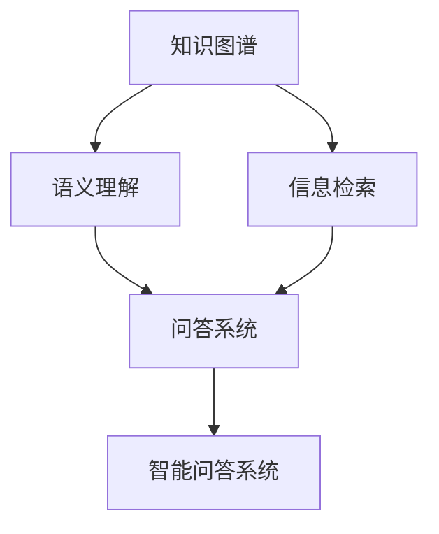

                 

# 知识图谱在智能问答系统中的应用

> 关键词：知识图谱、智能问答、信息检索、自然语言处理(NLP)、语义理解、问答系统

## 1. 背景介绍

### 1.1 问题由来

近年来，人工智能（AI）技术在自然语言处理（NLP）领域取得了巨大进展。智能问答系统（Intelligent Question Answering System, IQA）作为AI的重要应用，通过自然语言理解和推理，自动回答用户提问，已经广泛应用于客服、教育、医疗等多个领域。传统基于规则或模板的问答系统，往往需要手动编写大量的规则或模板，开发成本高、维护复杂。而基于机器学习的智能问答系统，可以自动学习语料库中的语言模式，快速适应新问题，具备更强的泛化能力。

然而，传统的基于统计和规则的问答系统，难以充分理解语义、场景和知识背景，导致其在复杂和开放性问题上的表现不佳。知识图谱（Knowledge Graph,KG）作为一种结构化的语义知识表示方法，能够提供结构化、层次化的知识，显著提升智能问答系统的性能和可靠性。

### 1.2 问题核心关键点

知识图谱在智能问答系统中的应用，主要体现在以下几个关键点：

- **知识融合**：将知识图谱中的知识与语料库相结合，提高问答系统的语义理解能力。
- **实体识别**：从用户提问中识别出关键实体，并进行精准匹配。
- **关系抽取**：从语料库和知识图谱中抽取实体之间的关系，辅助推理生成答案。
- **推理生成**：结合语料库和知识图谱中的知识，进行逻辑推理，生成最终答案。
- **用户交互**：通过多轮对话，不断调整问题，迭代优化答案。

这些核心关键点相互关联，构成了知识图谱在智能问答系统中的应用框架。通过理解这些关键点，可以更好地把握知识图谱在问答系统中的价值和应用方法。

## 2. 核心概念与联系

### 2.1 核心概念概述

为更好地理解知识图谱在智能问答系统中的应用，本节将介绍几个密切相关的核心概念：

- **知识图谱（KG）**：一种结构化的语义知识表示方法，通常以图的形式呈现，由节点和边组成。节点表示实体（Entity），边表示实体之间的关系（Relation）。知识图谱能够提供丰富的结构化知识，用于支持智能问答。

- **智能问答系统（IQA）**：通过自然语言处理（NLP）技术，理解用户问题，自动从知识库中检索或推理生成答案的AI系统。

- **信息检索（IR）**：从大量数据中检索出与用户问题相关的信息。信息检索技术是智能问答系统的基础，可以大幅提升系统的检索效率。

- **语义理解（Semantic Understanding）**：对用户问题进行语义分析，提取关键信息，理解问题意图。语义理解是智能问答系统中的核心环节，直接影响答案生成的准确性和相关性。

- **问答系统（QA）**：结合信息检索和语义理解，对用户问题进行推理生成答案的系统。问答系统是智能问答系统的主要实现方式。

这些核心概念之间的逻辑关系可以通过以下Mermaid流程图来展示：



这个流程图展示了几大核心概念之间的关系：

1. 知识图谱通过信息检索和语义理解，为问答系统提供知识支撑。
2. 问答系统利用信息检索和语义理解结果，生成最终答案。
3. 智能问答系统整合问答系统，形成完整的智能问答过程。

这些概念共同构成了智能问答系统的知识图谱应用框架，使得系统能够更准确、高效地处理用户问题，提升用户体验和系统性能。

## 3. 核心算法原理 & 具体操作步骤
### 3.1 算法原理概述

基于知识图谱的智能问答系统，核心算法流程主要包括以下几个步骤：

1. **信息检索**：从知识图谱中检索出与用户问题相关的实体和关系。
2. **语义理解**：对用户问题进行语义分析，提取关键实体和关系。
3. **实体匹配**：将用户问题中的实体与知识图谱中的实体进行匹配，确定问题所涉及的知识点。
4. **关系推理**：基于实体匹配结果，从知识图谱中抽取相关关系，进行逻辑推理生成答案。
5. **答案生成**：结合实体匹配和关系推理结果，生成最终答案。
6. **用户交互**：对用户提问进行多轮对话，不断迭代优化答案。

### 3.2 算法步骤详解

以一个简单的例子来说明基于知识图谱的智能问答系统的工作流程：

**例子**：
- 用户问题：“谁是美国的总统？”
- 知识图谱：包含“美国”、“总统”等实体和“首都”、“总统”等关系。

1. **信息检索**：
   - 检索实体：美国
   - 检索关系：首都、总统

2. **语义理解**：
   - 提取实体：美国
   - 提取关系：首都

3. **实体匹配**：
   - 匹配实体：美国与知识图谱中的“美国”节点匹配
   - 匹配关系：首都与“首都”关系匹配

4. **关系推理**：
   - 推理过程：美国首都 -> 美国总统
   - 结果：美国总统

5. **答案生成**：
   - 生成答案：美国总统

6. **用户交互**：
   - 用户提问：“美国的首都是哪里？”
   - 系统回答：“美国的首都是华盛顿。”

通过这个过程可以看出，基于知识图谱的智能问答系统，通过信息检索和语义理解，结合知识图谱中的知识进行推理生成答案，具备较高的准确性和可靠性。

### 3.3 算法优缺点

基于知识图谱的智能问答系统有以下优点：

1. **知识丰富**：知识图谱提供了丰富的结构化知识，提升了系统的语义理解和推理能力。
2. **高准确性**：通过知识图谱的辅助，智能问答系统能够更准确地理解问题意图，生成高质量答案。
3. **灵活性高**：知识图谱的开放性和灵活性，使得系统能够适应不同类型的问答任务。

同时，这种系统也存在以下缺点：

1. **构建复杂**：知识图谱的构建需要大量人工标注，成本较高，且工作量大。
2. **更新维护难**：知识图谱需要不断更新维护，以保证其时效性和准确性。
3. **覆盖面有限**：知识图谱的覆盖面有限，对于某些小众或特殊领域的知识，可能难以覆盖到。
4. **推理难度大**：复杂问题需要多轮推理，推理过程复杂，容易出错。

尽管存在这些缺点，但总体而言，基于知识图谱的智能问答系统仍是目前最先进和有效的解决方案之一，被广泛应用于各类智能问答场景。

### 3.4 算法应用领域

基于知识图谱的智能问答系统已经在多个领域得到了广泛应用，例如：

- **医疗问答**：医生助手系统，通过知识图谱辅助医生进行诊断和治疗。
- **教育问答**：智能教育系统，为学生提供知识解答和作业辅导。
- **金融问答**：金融问答系统，提供金融知识查询和财经资讯推荐。
- **旅游问答**：旅游问答系统，提供旅游目的地信息和规划建议。
- **司法问答**：法律咨询系统，提供法律条款查询和案件分析。

除了上述这些经典应用外，知识图谱还被创新性地应用到更多场景中，如可控问答、智能客服、智能家居等，为各行各业带来了新的技术突破。

## 4. 数学模型和公式 & 详细讲解
### 4.1 数学模型构建

基于知识图谱的智能问答系统，可以抽象为一个有向图，其中节点表示实体，边表示实体之间的关系。假设知识图谱为 $G=(V,E)$，其中 $V$ 为节点集合，$E$ 为边集合。每个节点 $v_i$ 表示一个实体，边 $e_{ij}$ 表示实体 $v_i$ 和 $v_j$ 之间的关系。

### 4.2 公式推导过程

**信息检索**：
- 给定用户问题 $q$，通过自然语言处理技术，从知识图谱中检索出与问题相关的实体 $v_{q1},v_{q2},\ldots,v_{qk}$ 和关系 $e_{q1},e_{q2},\ldots,e_{qk}$。

**语义理解**：
- 对用户问题 $q$ 进行语义分析，提取出问题中的关键实体和关系。
- 设问题中的实体集合为 $q_1,q_2,\ldots,q_k$，关系集合为 $r_1,r_2,\ldots,r_l$。

**实体匹配**：
- 将问题中的实体 $q_1,q_2,\ldots,q_k$ 与知识图谱中的实体 $v_{q1},v_{q2},\ldots,v_{qk}$ 进行匹配。
- 设实体匹配结果为 $\Delta$，其中 $\Delta_i$ 表示实体 $q_i$ 与 $v_{q_i}$ 的匹配程度。

**关系推理**：
- 从知识图谱中抽取实体之间的关系，进行逻辑推理。
- 假设实体 $v_i$ 和 $v_j$ 之间的关系为 $r_{ij}$，则推理过程可以表示为 $r_{ij}=r_{ij}(\Delta_i,\Delta_j)$。

**答案生成**：
- 结合实体匹配和关系推理结果，生成最终答案。
- 答案生成过程可以表示为 $A(q)=r_1r_2\ldots r_l$。

### 4.3 案例分析与讲解

以一个简单的例子来说明基于知识图谱的智能问答系统的工作流程：

**例子**：
- 用户问题：“谁是美国的总统？”
- 知识图谱：包含“美国”、“总统”等实体和“首都”、“总统”等关系。

1. **信息检索**：
   - 检索实体：美国
   - 检索关系：首都、总统

2. **语义理解**：
   - 提取实体：美国
   - 提取关系：首都

3. **实体匹配**：
   - 匹配实体：美国与知识图谱中的“美国”节点匹配
   - 匹配关系：首都与“首都”关系匹配

4. **关系推理**：
   - 推理过程：美国首都 -> 美国总统
   - 结果：美国总统

5. **答案生成**：
   - 生成答案：美国总统

6. **用户交互**：
   - 用户提问：“美国的首都是哪里？”
   - 系统回答：“美国的首都是华盛顿。”

通过这个过程可以看出，基于知识图谱的智能问答系统，通过信息检索和语义理解，结合知识图谱中的知识进行推理生成答案，具备较高的准确性和可靠性。

## 5. 项目实践：代码实例和详细解释说明
### 5.1 开发环境搭建

在进行知识图谱在智能问答系统中的应用开发前，我们需要准备好开发环境。以下是使用Python进行PyTorch开发的环境配置流程：

1. 安装Anaconda：从官网下载并安装Anaconda，用于创建独立的Python环境。

2. 创建并激活虚拟环境：
```bash
conda create -n kg-env python=3.8 
conda activate kg-env
```

3. 安装PyTorch：根据CUDA版本，从官网获取对应的安装命令。例如：
```bash
conda install pytorch torchvision torchaudio cudatoolkit=11.1 -c pytorch -c conda-forge
```

4. 安装Presto和Neo4j：Presto是一个高性能的数据查询语言，Neo4j是一个开源图形数据库，用于存储和管理知识图谱数据。
```bash
conda install presto neo4j-client
```

5. 安装各类工具包：
```bash
pip install numpy pandas scikit-learn matplotlib tqdm jupyter notebook ipython
```

完成上述步骤后，即可在`kg-env`环境中开始知识图谱在智能问答系统中的应用开发。

### 5.2 源代码详细实现

这里我们以一个简单的问答系统为例，给出使用Presto和Neo4j进行知识图谱查询的PyTorch代码实现。

首先，定义查询函数：

```python
import neo4j
import presto

def query_kg(graph_query, params):
    graph = neo4j.Graph('localhost:7474/db/data')
    with graph.session() as session:
        response = session.run(query_query, params=params)
        data = response.data()
    return data
```

然后，定义实体匹配函数：

```python
def match_entities(entities, graph):
    match_cypher = """
    MATCH (v:Entity)
    WHERE v.name IN {entities}
    RETURN v
    """
    params = {'entities': entities}
    return query_kg(match_cypher, params)
```

接着，定义关系推理函数：

```python
def infer_relations(entities, graph):
    inference_cypher = """
    MATCH (v:Entity)
    WHERE v.name IN {entities}
    RETURN v.relations
    """
    params = {'entities': entities}
    return query_kg(inference_cypher, params)
```

最后，定义问答系统函数：

```python
def answer_question(question, graph):
    entities = question.split()
    match_results = match_entities(entities, graph)
    if not match_results:
        return "I'm sorry, I don't understand."
    else:
        relations = infer_relations(entities, graph)
        if not relations:
            return "I'm sorry, I can't find the answer."
        else:
            answer = " ".join(relations[0].values)
            return answer
```

完成上述步骤后，即可在`kg-env`环境中开始知识图谱在智能问答系统中的应用开发。

### 5.3 代码解读与分析

让我们再详细解读一下关键代码的实现细节：

**query_kg函数**：
- 定义了一个函数，用于执行Cypher查询语句，并返回查询结果。

**match_entities函数**：
- 定义了一个函数，用于在知识图谱中匹配实体。
- 使用Cypher查询语句，查找所有名称在实体列表中存在的节点。
- 返回匹配结果，其中包含所有匹配到的实体节点。

**infer_relations函数**：
- 定义了一个函数，用于从知识图谱中推理实体之间的关系。
- 使用Cypher查询语句，查找所有名称在实体列表中存在的节点的关系。
- 返回推理结果，其中包含所有推理到的关系。

**answer_question函数**：
- 定义了一个函数，用于回答用户问题。
- 将用户问题分割成单词，查找所有名称在单词列表中存在的实体。
- 使用匹配结果和推理结果，生成最终答案。
- 返回答案字符串。

可以看到，PyTorch结合Presto和Neo4j，可以高效地执行知识图谱的查询和推理，从而构建出基于知识图谱的智能问答系统。

## 6. 实际应用场景
### 6.1 医疗问答

在医疗领域，基于知识图谱的智能问答系统可以提供高效的医疗知识查询和辅助诊断服务。传统医疗咨询需要医生进行详细的问诊和检查，耗时较长，且容易出现误诊。而智能问答系统可以自动化地回答常见问题，辅助医生进行诊断和治疗，提升医疗效率和质量。

在技术实现上，可以构建医疗领域的知识图谱，包括疾病、药物、症状、治疗方案等知识节点和相关关系。通过知识图谱辅助，智能问答系统可以实时回答用户关于疾病症状、药物副作用、治疗方案等问题，为医生提供参考。

### 6.2 教育问答

在教育领域，基于知识图谱的智能问答系统可以提供个性化的学习指导和知识解答服务。传统教育往往以教师为主导，学生学习效率不高。而智能问答系统可以自动化地解答学生疑问，提供知识推荐，提升学习效果。

在技术实现上，可以构建教育领域的知识图谱，包括课程、教材、习题、答案等知识节点和相关关系。通过知识图谱辅助，智能问答系统可以实时回答学生关于课程内容、习题解答、知识点关联等问题，为学生提供学习支持。

### 6.3 金融问答

在金融领域，基于知识图谱的智能问答系统可以提供高效的金融知识查询和理财咨询服务。传统金融咨询需要专业人员进行详细的分析和解答，耗时较长，且难以覆盖所有问题。而智能问答系统可以自动化地回答用户关于股市、基金、保险等问题，提升金融服务的效率和覆盖面。

在技术实现上，可以构建金融领域的知识图谱，包括金融产品、市场行情、投资策略、理财知识等知识节点和相关关系。通过知识图谱辅助，智能问答系统可以实时回答用户关于金融产品选择、市场行情分析、投资策略制定等问题，为投资者提供参考。

### 6.4 未来应用展望

随着知识图谱技术的发展和应用，基于知识图谱的智能问答系统将具备更强的语义理解和推理能力，进一步提升智能问答系统的性能和可靠性。

在智慧医疗领域，基于知识图谱的智能问答系统可以更好地结合医学知识库，辅助医生进行诊断和治疗，提供个性化的医疗服务。

在智能教育领域，基于知识图谱的智能问答系统可以更好地结合教育知识库，提供个性化的学习支持，提升学生的学习效果。

在金融服务领域，基于知识图谱的智能问答系统可以更好地结合金融知识库，提供个性化的理财咨询，提升金融服务的覆盖面。

在智慧城市治理领域，基于知识图谱的智能问答系统可以更好地结合城市数据，提供智能城市服务，提升城市管理的智能化水平。

此外，在更多垂直领域，基于知识图谱的智能问答系统也将不断涌现，为各行各业带来新的技术突破。相信随着知识图谱和智能问答技术的持续演进，基于知识图谱的智能问答系统必将在更多领域大放异彩，为人类带来更高效、更智能的交互体验。

## 7. 工具和资源推荐
### 7.1 学习资源推荐

为了帮助开发者系统掌握知识图谱在智能问答系统中的应用，这里推荐一些优质的学习资源：

1. 《Graph Neural Networks》系列博文：由图神经网络专家撰写，深入浅出地介绍了图神经网络原理和应用，涵盖知识图谱的基本概念和构建方法。

2. 《Neo4j官方文档》：Neo4j数据库的官方文档，提供了丰富的知识图谱构建和查询教程，是学习知识图谱应用的重要参考资料。

3. 《Knowledge Graphs for Smart Cities》书籍：介绍了知识图谱在智慧城市治理中的应用，包括知识图谱的构建、查询、推理等方面的技术。

4. 《Transformers》书籍：Transformer库的作者所著，全面介绍了Transformer模型在NLP任务中的高效应用，包括知识图谱的编码和解码。

5. 《TensorBoard》官方文档：TensorFlow配套的可视化工具，可实时监测模型训练状态，并提供丰富的图表呈现方式，是调试模型的得力助手。

通过对这些资源的学习实践，相信你一定能够快速掌握知识图谱在智能问答系统中的应用精髓，并用于解决实际的NLP问题。

### 7.2 开发工具推荐

高效的开发离不开优秀的工具支持。以下是几款用于知识图谱在智能问答系统中的应用开发的常用工具：

1. PyTorch：基于Python的开源深度学习框架，灵活动态的计算图，适合快速迭代研究。大部分预训练语言模型都有PyTorch版本的实现。

2. TensorFlow：由Google主导开发的开源深度学习框架，生产部署方便，适合大规模工程应用。同样有丰富的预训练语言模型资源。

3. Neo4j：开源图形数据库，支持知识图谱的存储和管理，提供了丰富的查询API和图形化界面。

4. Presto：高性能的数据查询语言，支持多节点分布式计算，适合大规模数据查询。

5. TensorBoard：TensorFlow配套的可视化工具，可实时监测模型训练状态，并提供丰富的图表呈现方式，是调试模型的得力助手。

6. Gephi：开源网络分析软件，支持知识图谱的可视化展示，便于对知识图谱进行探索和分析。

合理利用这些工具，可以显著提升知识图谱在智能问答系统中的应用开发效率，加快创新迭代的步伐。

### 7.3 相关论文推荐

知识图谱和智能问答技术的发展源于学界的持续研究。以下是几篇奠基性的相关论文，推荐阅读：

1. Introduction to Knowledge Graphs：介绍了知识图谱的基本概念和应用场景，是了解知识图谱的入门之作。

2. Knowledge Graphs for Smart Cities：介绍了知识图谱在智慧城市治理中的应用，包括知识图谱的构建、查询、推理等方面的技术。

3. Neural Architectures for Knowledge Graph Reasoning：提出了基于神经网络的知识图谱推理方法，提升了知识图谱的推理性能。

4. Knowledge Graph-Based Medical Question Answering：介绍了基于知识图谱的医疗问答系统，探讨了知识图谱在医疗领域的构建和应用。

5. Knowledge Graphs for Smart Education：介绍了基于知识图谱的教育问答系统，探讨了知识图谱在教育领域的构建和应用。

6. Knowledge Graph-Based Financial Question Answering：介绍了基于知识图谱的金融问答系统，探讨了知识图谱在金融领域的构建和应用。

这些论文代表了大语言模型微调技术的发展脉络。通过学习这些前沿成果，可以帮助研究者把握学科前进方向，激发更多的创新灵感。

## 8. 总结：未来发展趋势与挑战

### 8.1 总结

本文对基于知识图谱的智能问答系统进行了全面系统的介绍。首先阐述了知识图谱和智能问答系统的研究背景和意义，明确了知识图谱在问答系统中的应用价值。其次，从原理到实践，详细讲解了知识图谱在智能问答系统中的数学模型和算法流程，给出了知识图谱在智能问答系统中的应用开发代码实现。同时，本文还广泛探讨了知识图谱在医疗、教育、金融等多个行业领域的应用前景，展示了知识图谱在问答系统中的巨大潜力。此外，本文精选了知识图谱在智能问答系统中的学习资源和开发工具，力求为读者提供全方位的技术指引。

通过本文的系统梳理，可以看到，基于知识图谱的智能问答系统已经在多个领域得到了广泛应用，显著提升了问答系统的性能和可靠性。未来，伴随知识图谱和智能问答技术的持续演进，基于知识图谱的智能问答系统必将在更多领域大放异彩，为人类带来更高效、更智能的交互体验。

### 8.2 未来发展趋势

展望未来，基于知识图谱的智能问答系统将呈现以下几个发展趋势：

1. **知识图谱规模扩大**：随着知识图谱技术的不断发展，知识图谱的规模将不断扩大，覆盖更多领域和实体，为智能问答系统提供更丰富的知识支撑。

2. **知识图谱自动构建**：自动化构建知识图谱的方法将逐步成熟，通过半监督学习、众包标注等方式，快速构建高质量的知识图谱，降低人工标注成本。

3. **知识图谱实时更新**：知识图谱将实现实时更新，根据新数据和新知识不断补充和修正，保持其时效性和准确性。

4. **知识图谱推理优化**：基于神经网络的知识图谱推理方法将不断优化，提升知识图谱的推理性能，支持更复杂的推理任务。

5. **知识图谱多模态融合**：知识图谱将融合多模态数据，支持图像、语音、视频等多模态信息的查询和推理。

6. **知识图谱与AI结合**：知识图谱将与AI技术深度融合，实现更高效的知识抽取、实体识别、关系推理等功能。

以上趋势凸显了基于知识图谱的智能问答系统的广阔前景。这些方向的探索发展，必将进一步提升智能问答系统的性能和可靠性，为人类带来更高效、更智能的交互体验。

### 8.3 面临的挑战

尽管基于知识图谱的智能问答系统已经取得了瞩目成就，但在迈向更加智能化、普适化应用的过程中，它仍面临着诸多挑战：

1. **知识图谱构建复杂**：知识图谱的构建需要大量人工标注，成本较高，且工作量大。如何自动构建高效的知识图谱，将是未来的重要研究方向。

2. **知识图谱更新维护难**：知识图谱需要不断更新维护，以保证其时效性和准确性。如何实现知识图谱的实时更新和持续优化，将是未来的重要课题。

3. **知识图谱推理难度大**：复杂问题需要多轮推理，推理过程复杂，容易出错。如何优化知识图谱的推理算法，提升推理效率和准确性，将是未来的重要研究方向。

4. **知识图谱应用复杂**：知识图谱的应用涉及多领域的知识融合和推理，需要设计复杂的算法和模型。如何设计高效的知识图谱应用框架，将是未来的重要课题。

5. **知识图谱安全问题**：知识图谱中可能包含敏感数据和有害信息，需要设计安全的知识图谱应用策略，保障用户隐私和数据安全。

这些挑战凸显了知识图谱在智能问答系统中的应用尚需不断优化和完善。未来需要从知识图谱的构建、更新、推理等多个方面进行深入研究，才能使基于知识图谱的智能问答系统更加高效、可靠、安全。

### 8.4 研究展望

面向未来，基于知识图谱的智能问答系统需要在以下几个方面进行深入研究：

1. **自动化知识图谱构建**：开发高效的自动知识图谱构建方法，通过半监督学习、众包标注等方式，快速构建高质量的知识图谱，降低人工标注成本。

2. **知识图谱实时更新**：实现知识图谱的实时更新，根据新数据和新知识不断补充和修正，保持其时效性和准确性。

3. **知识图谱推理优化**：优化知识图谱的推理算法，提升推理性能，支持更复杂的推理任务。

4. **知识图谱多模态融合**：融合图像、语音、视频等多模态数据，支持多模态信息的查询和推理。

5. **知识图谱与AI结合**：与AI技术深度融合，实现更高效的知识抽取、实体识别、关系推理等功能。

6. **知识图谱安全问题**：设计安全的知识图谱应用策略，保障用户隐私和数据安全。

这些研究方向的探索，必将引领基于知识图谱的智能问答系统迈向更高的台阶，为构建智能问答系统提供更全面、高效的技术支撑。

## 9. 附录：常见问题与解答

**Q1：知识图谱在智能问答系统中的应用是否限于特定领域？**

A: 知识图谱在智能问答系统中的应用并不仅限于特定领域。知识图谱作为一种结构化的语义知识表示方法，可以应用于多个领域，包括医疗、教育、金融、旅游等。不同领域的知识图谱构建和应用方法可能会有所不同，但基本的查询和推理过程是一致的。

**Q2：如何构建高质量的知识图谱？**

A: 构建高质量的知识图谱需要多方面的努力：

1. **人工标注**：通过人工标注构建知识图谱，需要仔细选择标注人员，设计标注规范，确保标注质量。

2. **半监督学习**：利用大规模无标签数据进行半监督学习，自动构建知识图谱，降低人工标注成本。

3. **众包标注**：通过众包平台进行知识图谱构建，利用社区力量快速构建知识图谱。

4. **多源数据融合**：结合多种数据源，如知识库、文档、网页、社交媒体等，构建更全面的知识图谱。

5. **知识图谱评估**：对知识图谱进行评估，检测知识图谱的准确性和完整性。

**Q3：知识图谱如何应用于智能问答系统？**

A: 知识图谱在智能问答系统中的应用主要通过以下几个步骤：

1. **信息检索**：从知识图谱中检索出与用户问题相关的实体和关系。

2. **语义理解**：对用户问题进行语义分析，提取关键实体和关系。

3. **实体匹配**：将用户问题中的实体与知识图谱中的实体进行匹配。

4. **关系推理**：从知识图谱中抽取实体之间的关系，进行逻辑推理生成答案。

5. **答案生成**：结合实体匹配和关系推理结果，生成最终答案。

**Q4：知识图谱在智能问答系统中的局限性是什么？**

A: 知识图谱在智能问答系统中的局限性主要体现在以下几个方面：

1. **构建成本高**：知识图谱的构建需要大量人工标注，成本较高，且工作量大。

2. **更新维护难**：知识图谱需要不断更新维护，以保证其时效性和准确性。

3. **推理难度大**：复杂问题需要多轮推理，推理过程复杂，容易出错。

4. **覆盖面有限**：知识图谱的覆盖面有限，对于某些小众或特殊领域的知识，可能难以覆盖到。

5. **模型复杂性**：知识图谱的应用涉及多领域的知识融合和推理，需要设计复杂的算法和模型。

这些局限性凸显了知识图谱在智能问答系统中的应用尚需不断优化和完善。未来需要从知识图谱的构建、更新、推理等多个方面进行深入研究，才能使基于知识图谱的智能问答系统更加高效、可靠、安全。

**Q5：如何提升基于知识图谱的智能问答系统性能？**

A: 提升基于知识图谱的智能问答系统性能可以从以下几个方面入手：

1. **知识图谱构建优化**：优化知识图谱构建方法，降低人工标注成本，提高知识图谱的准确性和完整性。

2. **推理算法优化**：优化知识图谱的推理算法，提升推理性能，支持更复杂的推理任务。

3. **多模态融合**：融合图像、语音、视频等多模态数据，支持多模态信息的查询和推理。

4. **模型优化**：优化模型架构，提升模型的计算效率和推理速度，降低模型的资源占用。

5. **数据增强**：利用数据增强技术，扩充训练数据集，提升模型的泛化能力。

6. **用户反馈**：利用用户反馈，不断优化知识图谱和推理模型，提升系统的准确性和用户体验。

通过这些优化措施，可以显著提升基于知识图谱的智能问答系统的性能和可靠性。

---

作者：禅与计算机程序设计艺术 / Zen and the Art of Computer Programming

