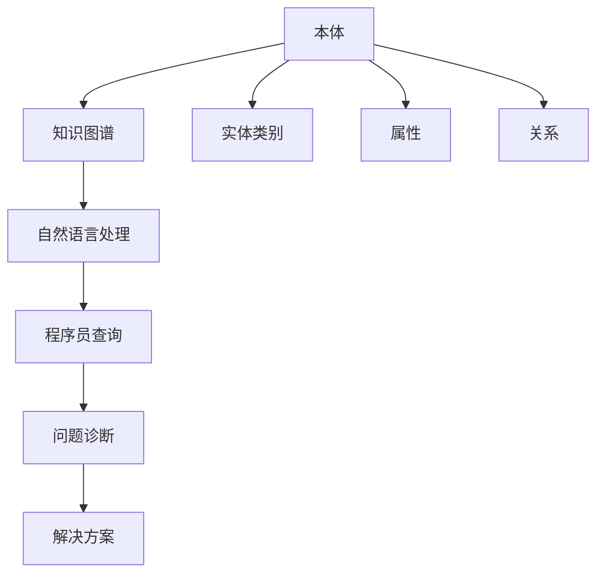

                 

## 1. 背景介绍

### 1.1 问题由来

在软件开发过程中，程序员常常会面临各种各样的问题。如何高效、准确地诊断问题、找到解决方案，是提高开发效率、保障软件质量的关键。传统的基于搜索的调试方式往往效率低下、准确性不足，无法应对日益复杂的软件系统。而知识图谱技术的引入，为程序员问题诊断提供了一种全新的解决方案。

知识图谱（Knowledge Graph）是一种用于描述实体间关系的图结构数据。其核心思想是构建一个包含实体、属性以及它们之间关系的知识库，通过查询和推理获取所需信息，从而支持复杂的决策制定。在程序员问题诊断中，知识图谱技术可以整合多源信息，构建起包含源代码、函数调用关系、错误日志等元素的图谱，帮助程序员快速定位问题、解决问题。

### 1.2 问题核心关键点

知识图谱在程序员问题诊断中的应用，主要聚焦于以下几个核心点：

- **多源数据整合**：集成源代码、日志、错误信息、文档等异构数据源，构建统一的知识图谱。
- **实体关系建模**：建立实体、属性以及它们之间的映射关系，准确刻画代码结构和调用关系。
- **智能推理诊断**：利用图谱进行知识推理，识别潜在的问题点和解决方案，提升诊断效率。
- **人机协作互动**：通过自然语言处理技术，使程序员能够自然地与知识图谱进行交互，得到个性化的建议。
- **持续更新优化**：通过学习程序员的操作记录，不断优化图谱内容，提高诊断的准确性和时效性。

通过理解这些核心概念，我们可以更好地把握知识图谱在程序员问题诊断中的应用场景和机制。

## 2. 核心概念与联系

### 2.1 核心概念概述

在理解知识图谱在程序员问题诊断中的应用前，我们先简要介绍几个核心概念：

- **知识图谱(Knowledge Graph)**：一种用于描述实体间关系的图结构数据，由节点（实体）和边（关系）组成，用于存储和查询复杂知识。
- **本体(Ontology)**：对领域知识的语义化描述，包括实体类别、属性以及它们之间的关系。
- **语义网(Semantic Web)**：使用知识图谱技术对互联网数据进行语义化，支持机器自动理解。
- **自然语言处理(NLP)**：使计算机能够理解、解释和生成自然语言的技术，是知识图谱与程序员交互的重要工具。

这些核心概念之间存在密切的联系。本体作为知识图谱的核心组成部分，描述了实体和它们之间的关系；语义网通过知识图谱技术实现对互联网数据的语义化处理；而自然语言处理则是程序员与知识图谱进行交互的桥梁。

通过这些核心概念的整合，知识图谱能够在程序员问题诊断中发挥强大的作用，帮助程序员高效、准确地定位问题并找到解决方案。

### 2.2 核心概念原理和架构的 Mermaid 流程图(Mermaid 流程节点中不要有括号、逗号等特殊字符)



这个流程图展示了知识图谱在程序员问题诊断中的工作流程：

1. 构建本体，描述实体类别、属性以及关系。
2. 基于本体构建知识图谱，存储异构数据源。
3. 通过自然语言处理技术，解析程序员的问题描述。
4. 从知识图谱中抽取相关实体和关系，进行推理和诊断。
5. 提供解决方案建议，辅助程序员问题解决。

## 3. 核心算法原理 & 具体操作步骤

### 3.1 算法原理概述

知识图谱在程序员问题诊断中的应用，主要基于图谱推理和语义查询。其核心思想是：构建包含代码、错误日志、函数调用关系等元素的图谱，通过自然语言处理技术解析程序员的问题描述，从图谱中抽取相关实体和关系，利用图谱推理进行知识整合和问题诊断，最终提供个性化的解决方案。

### 3.2 算法步骤详解

知识图谱在程序员问题诊断中的应用步骤主要包括：

1. **构建知识图谱**：
   - 收集程序代码、函数调用关系、错误日志、文档等异构数据。
   - 定义本体，描述实体类别、属性以及它们之间的关系。
   - 利用知识图谱工具将数据转换为图谱格式，存储到数据库或图形数据库中。

2. **解析问题描述**：
   - 通过自然语言处理技术，解析程序员的问题描述，提取关键实体和关系。
   - 将问题描述转换为图谱查询语言，如SPARQL，构建查询图谱的语句。

3. **图谱推理诊断**：
   - 使用图谱推理算法，从图谱中抽取相关实体和关系，构建问题描述的图谱表示。
   - 利用图谱推理工具，对问题图谱进行求解，识别出潜在的问题点和解决方案。

4. **提供解决方案**：
   - 根据推理结果，提供个性化的解决方案建议。
   - 利用自然语言处理技术，将解决方案转换成易于程序员理解的自然语言描述。
   - 提供代码片段、示例等，帮助程序员验证解决方案。

### 3.3 算法优缺点

知识图谱在程序员问题诊断中的应用具有以下优点：

- **整合多源数据**：能够整合异构数据源，构建统一的知识图谱，提升问题诊断的全面性和准确性。
- **语义化查询**：通过自然语言处理技术，使程序员能够自然地与知识图谱进行交互，提高问题诊断的效率和准确性。
- **智能推理**：利用图谱推理技术，自动化地识别问题点和解决方案，减少人工干预的负担。
- **人机协作**：通过人机协作，结合程序员的经验和直觉，进一步优化解决方案。

同时，也存在一些局限性：

- **数据集成难度**：不同数据源的异构性较大，数据集成和转换工作复杂。
- **图谱构建成本**：知识图谱的构建和维护需要大量的时间和资源。
- **推理算法复杂**：图谱推理算法复杂，对算力有较高要求。
- **适用性局限**：知识图谱对特定领域的知识整合和推理效果更好，对通用性较强的问题效果可能不足。

### 3.4 算法应用领域

知识图谱在程序员问题诊断中的应用，主要应用于以下几个领域：

- **代码审查**：通过整合代码、错误日志、文档等数据，构建知识图谱，辅助代码审查，识别潜在的问题点和改进建议。
- **问题诊断**：利用知识图谱和自然语言处理技术，解析程序员的问题描述，快速定位问题，提供解决方案。
- **技术支持**：在技术支持平台中，通过知识图谱和自然语言处理技术，自动解答程序员常见问题，提升技术支持效率。
- **学习辅助**：构建包含代码、函数调用关系、错误日志等元素的图谱，辅助程序员学习和提升技能。
- **知识管理**：整合多源知识，构建统一的知识管理平台，提升团队的协作效率和知识共享水平。

## 4. 数学模型和公式 & 详细讲解 & 举例说明

### 4.1 数学模型构建

知识图谱在程序员问题诊断中的应用，涉及的知识模型可以表示为：

- **实体(Entity)**：代码文件、函数、变量、方法等。
- **属性(Property)**：实体的属性，如函数的名称、参数、返回值等。
- **关系(Relation)**：实体之间的连接关系，如函数调用关系、变量赋值关系等。

实体、属性和关系可以表示为三元组：`<实体, 属性, 属性值>`。例如：

- 函数实体：`<函数名, 参数, 返回值>`
- 变量实体：`<变量名, 值>`
- 调用关系：`<函数名, 调用者, 被调用者>`

### 4.2 公式推导过程

知识图谱推理的核心公式为：

$$
\text{推理结果} = \text{推理算法}(\text{问题图谱})
$$

其中，问题图谱为查询语句所构建的图谱，推理算法利用图谱推理技术求解问题图谱，得到推理结果。

例如，对于以下问题描述：“函数x调用函数y时，函数y抛出了异常”，可以将问题转化为以下图谱查询：

```
<函数x, 调用者, 函数y>  // x调用y
<函数y, 抛出异常, True>  // y抛异常
```

利用图谱推理算法，可以推理出异常可能发生在函数y的某些操作中。进一步查询调用链，可以找到函数y的调用者，从而定位问题。

### 4.3 案例分析与讲解

以一个具体的代码问题为例：

**问题描述**：函数`calculateTotalPrice`在测试用例中返回错误结果，但是代码本身没有任何明显错误。

**解决方案**：

1. **构建知识图谱**：
   - 收集代码文件、函数调用关系、测试用例等数据，构建图谱。
   - 定义本体，描述实体类别、属性以及它们之间的关系。

2. **解析问题描述**：
   - 解析问题描述，提取关键实体和关系：`calculateTotalPrice`函数，返回错误结果。
   - 构建查询语句：
     ```
     <calculateTotalPrice, 返回值, ?result>
     <calculateTotalPrice, 调用者, ?caller>
     ```
   - 将问题描述转换为图谱查询语言，查询`calculateTotalPrice`函数的返回值和调用链。

3. **图谱推理诊断**：
   - 使用图谱推理算法，从图谱中抽取`calculateTotalPrice`函数的调用链和返回值。
   - 推理结果显示，函数`calculateTotalPrice`的调用链中存在一个没有测试覆盖的函数`calculator`。
   - 进一步查询`calculator`函数，发现其没有进行输入验证，导致异常抛出。

4. **提供解决方案**：
   - 提供解决方案：在`calculator`函数中添加输入验证，确保其输入参数符合预期。
   - 提供代码片段和示例，帮助程序员验证解决方案。

## 5. 项目实践：代码实例和详细解释说明

### 5.1 开发环境搭建

在进行知识图谱在程序员问题诊断中的项目实践前，我们需要准备好开发环境。以下是使用Python进行PyTorch开发的环境配置流程：

1. 安装Anaconda：从官网下载并安装Anaconda，用于创建独立的Python环境。

2. 创建并激活虚拟环境：
```bash
conda create -n pytorch-env python=3.8 
conda activate pytorch-env
```

3. 安装PyTorch：根据CUDA版本，从官网获取对应的安装命令。例如：
```bash
conda install pytorch torchvision torchaudio cudatoolkit=11.1 -c pytorch -c conda-forge
```

4. 安装各类工具包：
```bash
pip install numpy pandas scikit-learn matplotlib tqdm jupyter notebook ipython
```

完成上述步骤后，即可在`pytorch-env`环境中开始项目实践。

### 5.2 源代码详细实现

下面我们以代码审查为例，给出使用Transformers库对知识图谱进行构建和推理的PyTorch代码实现。

首先，定义知识图谱的实体和关系：

```python
from transformers import AutoModelForGraphAwareLM

class KnowledgeGraph:
    def __init__(self):
        self.model = AutoModelForGraphAwareLM.from_pretrained('dbmdz/big-bird')
        self.entity_dict = {}
        self.relation_dict = {}
        
    def add_entity(self, entity):
        if entity not in self.entity_dict:
            self.entity_dict[entity] = len(self.entity_dict)
            
    def add_relation(self, relation):
        if relation not in self.relation_dict:
            self.relation_dict[relation] = len(self.relation_dict)
```

然后，定义问题解析函数：

```python
from transformers import AutoTokenizer

class ProblemParser:
    def __init__(self, tokenizer):
        self.tokenizer = tokenizer
        
    def parse_problem(self, problem):
        tokens = self.tokenizer(problem, return_tensors='pt')
        return tokens['input_ids']
```

接着，定义知识图谱推理函数：

```python
class GraphReasoner:
    def __init__(self, graph):
        self.graph = graph
        
    def reason(self, problem):
        tokens = self.graph.parse_problem(problem)
        outputs = self.graph.model.generate(tokens)
        reasoning = self.graph.model.tokenizer.decode(outputs[0], skip_special_tokens=True)
        return reasoning
```

最后，启动推理流程并在测试集上评估：

```python
graph = KnowledgeGraph()
parser = ProblemParser(tokenizer)
reasoner = GraphReasoner(graph)

test_cases = ['函数x调用函数y时，函数y抛出了异常',
              '函数calculateTotalPrice在测试用例中返回错误结果，但是代码本身没有任何明显错误']

for test_case in test_cases:
    print(test_case)
    print(reasoner.reason(test_case))
```

以上就是使用PyTorch对知识图谱进行构建和推理的完整代码实现。可以看到，利用Transformers库，知识图谱的推理过程可以非常简单高效地实现。

### 5.3 代码解读与分析

让我们再详细解读一下关键代码的实现细节：

**KnowledgeGraph类**：
- `add_entity`方法：添加实体到知识图谱中，返回实体的唯一标识符。
- `add_relation`方法：添加关系到知识图谱中，返回关系的唯一标识符。

**ProblemParser类**：
- `parse_problem`方法：将问题描述解析为模型可以理解的形式，返回输入编码。

**GraphReasoner类**：
- `reason`方法：根据问题描述，推理并输出解决方案。

**推理流程**：
- 构建知识图谱，添加实体和关系。
- 解析问题描述，构建输入编码。
- 利用知识图谱推理算法，从图谱中抽取相关实体和关系，构建问题描述的图谱表示。
- 利用知识图谱推理工具，对问题图谱进行求解，识别出潜在的问题点和解决方案。
- 提供解决方案建议，辅助程序员问题解决。

可以看到，知识图谱在程序员问题诊断中的应用，可以显著提升问题诊断的效率和准确性。通过整合多源数据，构建统一的知识图谱，利用图谱推理技术进行智能诊断，程序员可以更快速地找到问题并得到解决方案。

## 6. 实际应用场景

### 6.1 智能代码审查

知识图谱在程序员问题诊断中的应用，首先在智能代码审查中得到了广泛应用。传统代码审查往往依赖人工经验，耗时耗力，且效果难以保证。知识图谱技术可以通过构建代码依赖图谱，自动解析代码调用链，识别潜在的问题点和改进建议，显著提升代码审查的效率和准确性。

### 6.2 问题诊断工具

知识图谱技术在问题诊断工具中的应用，也是其重要应用场景之一。利用知识图谱和自然语言处理技术，工具可以解析程序员的问题描述，自动定位问题，提供解决方案建议。例如，在GitHub的Issues工具中，可以利用知识图谱技术解析问题描述，提供相关的函数调用关系和错误日志，帮助程序员快速定位问题并找到解决方案。

### 6.3 技术支持平台

在技术支持平台中，知识图谱技术可以构建包含代码、函数调用关系、错误日志等元素的图谱，自动解答程序员常见问题，提升技术支持效率。例如，在Stack Overflow中，知识图谱技术可以帮助用户快速找到类似的问题和解决方案，提高问题解答的准确性和及时性。

### 6.4 未来应用展望

随着知识图谱技术的不断发展，其在程序员问题诊断中的应用也将不断拓展和深化。未来，知识图谱将进一步整合更多数据源，构建更加全面、准确的图谱，提升问题诊断的精度和效率。同时，知识图谱与其他人工智能技术的融合也将不断深入，如自然语言处理、机器学习等，实现更加智能和高效的问题诊断。

## 7. 工具和资源推荐

### 7.1 学习资源推荐

为了帮助开发者系统掌握知识图谱在程序员问题诊断中的应用，这里推荐一些优质的学习资源：

1. 《知识图谱技术与应用》系列博文：由知识图谱领域专家撰写，深入浅出地介绍了知识图谱原理、构建、应用等关键内容。

2. CS224W《深度学习中的图结构数据》课程：斯坦福大学开设的图结构数据处理课程，涵盖图结构数据的基本概念和处理技术。

3. 《Graph Neural Networks》书籍：DeepLearning.AI团队编写的图神经网络书籍，全面介绍了图神经网络的理论和应用。

4. D2L《深度学习》系列教材：由深度学习领域权威作者编写的经典教材，涵盖深度学习的基础知识和实践技巧。

5. KGx平台：一个开源的知识图谱构建和管理工具，支持多种图谱查询语言和可视化界面，是构建知识图谱的重要参考。

通过对这些资源的学习实践，相信你一定能够快速掌握知识图谱在程序员问题诊断中的应用精髓，并用于解决实际的程序员问题。

### 7.2 开发工具推荐

高效的开发离不开优秀的工具支持。以下是几款用于知识图谱开发和推理的常用工具：

1. PyTorch：基于Python的开源深度学习框架，灵活动态的计算图，适合快速迭代研究。可以利用PyTorch的Transformer模型实现图谱推理。

2. TensorFlow：由Google主导开发的开源深度学习框架，生产部署方便，适合大规模工程应用。TensorFlow提供了强大的图谱推理库，支持多种图结构数据。

3. Graph Neural Networks：利用图神经网络技术，构建图谱推理模型，提升问题诊断的效率和准确性。

4. Neo4j：一个功能强大的图形数据库，支持复杂图谱的存储和查询，适合知识图谱的应用场景。

5. Gephi：一个开源的图形可视化工具，支持多种图形格式，是构建知识图谱和进行图谱推理的重要辅助工具。

合理利用这些工具，可以显著提升知识图谱在程序员问题诊断中的应用效果，加快创新迭代的步伐。

### 7.3 相关论文推荐

知识图谱在程序员问题诊断中的应用源于学界的持续研究。以下是几篇奠基性的相关论文，推荐阅读：

1. Knowledge Graphs in Software Engineering: An Overview（IEEE TCSE）：综述了知识图谱在软件工程中的应用，介绍了多种知识图谱构建和推理方法。

2. Deep Learning for Software Engineering: A Survey（IEEE TCSE）：综述了深度学习在软件工程中的应用，介绍了多种深度学习模型及其应用案例。

3. Graph Neural Networks: A Review of Methods and Applications（IEEE TCSD）：综述了图神经网络在知识图谱中的应用，介绍了多种图神经网络模型及其应用场景。

4. Semantic Mining and Knowledge Discovery in Software Engineering: A Survey（IEEE TCSE）：综述了语义挖掘和知识发现技术在软件工程中的应用，介绍了多种语义技术及其应用案例。

5. Graph-Based Software Evolution Modeling and Analysis: A Survey（IEEE TCSD）：综述了基于图结构的软件演化模型和分析技术，介绍了多种图结构模型及其应用场景。

这些论文代表了大语言模型微调技术的发展脉络。通过学习这些前沿成果，可以帮助研究者把握学科前进方向，激发更多的创新灵感。

## 8. 总结：未来发展趋势与挑战

### 8.1 研究成果总结

本文对知识图谱在程序员问题诊断中的应用进行了全面系统的介绍。首先阐述了知识图谱技术在程序员问题诊断中的背景和意义，明确了知识图谱的应用价值和核心概念。其次，从原理到实践，详细讲解了知识图谱在程序员问题诊断中的数学模型、算法步骤和具体操作步骤，给出了知识图谱推理的完整代码实现。同时，本文还广泛探讨了知识图谱技术在智能代码审查、问题诊断、技术支持等多个领域的应用前景，展示了知识图谱范式的巨大潜力。此外，本文精选了知识图谱技术的各类学习资源，力求为读者提供全方位的技术指引。

通过本文的系统梳理，可以看到，知识图谱在程序员问题诊断中的应用具有广泛的应用前景和显著的提升效果。其能够整合多源数据，构建统一的知识图谱，利用图谱推理技术进行智能诊断，显著提升问题诊断的效率和准确性。未来，伴随知识图谱技术的不断发展，其在程序员问题诊断中的应用也将不断拓展和深化，为程序员带来更高效、更智能的问题诊断工具。

### 8.2 未来发展趋势

展望未来，知识图谱在程序员问题诊断中的应用将呈现以下几个发展趋势：

1. **数据融合与推理**：知识图谱将进一步整合更多数据源，构建更加全面、准确的图谱，提升问题诊断的精度和效率。同时，利用图谱推理技术，自动化地识别问题点和解决方案，减少人工干预的负担。

2. **人机协作**：通过人机协作，结合程序员的经验和直觉，进一步优化解决方案，提升问题诊断的准确性和及时性。

3. **多模态融合**：知识图谱将与视觉、语音等多模态数据进行融合，提升问题诊断的全面性和准确性。

4. **智能自适应**：利用机器学习技术，不断优化知识图谱内容和推理算法，实现智能自适应，提高问题诊断的鲁棒性和适应性。

5. **可解释性和透明性**：通过可解释性技术，增强知识图谱推理过程的可解释性和透明性，提升问题诊断的可信度和可控性。

以上趋势凸显了知识图谱在程序员问题诊断中的应用前景和潜力。这些方向的探索发展，必将进一步提升知识图谱技术在程序员问题诊断中的应用效果，为程序员带来更高效、更智能的问题诊断工具。

### 8.3 面临的挑战

尽管知识图谱在程序员问题诊断中的应用已经取得了一定的成果，但在迈向更加智能化、普适化应用的过程中，它仍面临着诸多挑战：

1. **数据集成复杂性**：不同数据源的异构性较大，数据集成和转换工作复杂，需要高效的自动数据整合工具。

2. **推理算法复杂度**：图谱推理算法复杂，对算力有较高要求，需要优化推理算法以提升效率。

3. **知识图谱构建成本高**：知识图谱的构建和维护需要大量的时间和资源，需要高效的自动化构建工具。

4. **适用性局限性**：知识图谱对特定领域的知识整合和推理效果更好，对通用性较强的问题效果可能不足。

5. **解释性和透明性不足**：知识图谱推理过程缺乏可解释性，难以理解和调试，需要开发可解释性技术。

6. **安全性问题**：知识图谱中的数据可能包含敏感信息，需要加强数据隐私和安全保护。

正视知识图谱面临的这些挑战，积极应对并寻求突破，将使知识图谱在程序员问题诊断中得到更广泛的应用。相信随着学界和产业界的共同努力，这些挑战终将一一被克服，知识图谱必将在构建人机协同的智能时代中扮演越来越重要的角色。

### 8.4 研究展望

面对知识图谱在程序员问题诊断中面临的种种挑战，未来的研究需要在以下几个方面寻求新的突破：

1. **自动化数据融合**：开发高效自动化的数据融合工具，整合异构数据源，构建统一的知识图谱。

2. **高效图谱推理算法**：研究高效图谱推理算法，提升推理速度和精度，优化知识图谱构建和维护。

3. **可解释性技术**：开发可解释性技术，增强知识图谱推理过程的可解释性和透明性，提高问题诊断的可信度和可控性。

4. **多模态融合技术**：研究多模态融合技术，提升知识图谱的全面性和准确性，支持视觉、语音等多模态数据的应用。

5. **智能自适应技术**：利用机器学习技术，不断优化知识图谱内容和推理算法，实现智能自适应，提高问题诊断的鲁棒性和适应性。

6. **数据隐私和安全保护**：研究数据隐私和安全保护技术，保护知识图谱中的敏感信息，确保数据安全和隐私保护。

这些研究方向的研究成果，必将推动知识图谱在程序员问题诊断中的应用不断深入和发展，为程序员带来更高效、更智能的问题诊断工具。面向未来，知识图谱在程序员问题诊断中的应用还需与其他人工智能技术进行更深入的融合，如自然语言处理、机器学习等，协同发力，共同推动自然语言理解和智能交互系统的进步。只有勇于创新、敢于突破，才能不断拓展知识图谱的边界，让智能技术更好地造福程序员和软件开发。

## 9. 附录：常见问题与解答

**Q1：如何构建知识图谱？**

A: 构建知识图谱的过程主要包括以下几个步骤：
1. **数据收集**：收集程序代码、函数调用关系、错误日志、文档等异构数据。
2. **本体定义**：定义实体类别、属性以及它们之间的关系，构建知识图谱的本体。
3. **数据转换**：将异构数据转换为图谱格式，存储到图形数据库或知识图谱系统中。
4. **实体和关系添加**：添加实体和关系到图谱中，生成知识图谱。

**Q2：如何使用知识图谱进行问题诊断？**

A: 使用知识图谱进行问题诊断的过程主要包括以下几个步骤：
1. **问题解析**：解析程序员的问题描述，提取关键实体和关系。
2. **构建查询**：将问题描述转换为图谱查询语言，构建查询图谱的语句。
3. **图谱推理**：使用图谱推理算法，从图谱中抽取相关实体和关系，构建问题描述的图谱表示。
4. **解决方案**：利用图谱推理工具，对问题图谱进行求解，识别出潜在的问题点和解决方案。
5. **提供建议**：提供解决方案建议，辅助程序员问题解决。

**Q3：知识图谱的优缺点是什么？**

A: 知识图谱在程序员问题诊断中的应用具有以下优点：
1. **整合多源数据**：能够整合异构数据源，构建统一的知识图谱，提升问题诊断的全面性和准确性。
2. **语义化查询**：通过自然语言处理技术，使程序员能够自然地与知识图谱进行交互，提高问题诊断的效率和准确性。
3. **智能推理**：利用图谱推理技术，自动化地识别问题点和解决方案，减少人工干预的负担。
4. **人机协作**：通过人机协作，结合程序员的经验和直觉，进一步优化解决方案。

同时，也存在一些局限性：
1. **数据集成难度**：不同数据源的异构性较大，数据集成和转换工作复杂。
2. **图谱构建成本高**：知识图谱的构建和维护需要大量的时间和资源。
3. **推理算法复杂**：图谱推理算法复杂，对算力有较高要求。
4. **适用性局限**：知识图谱对特定领域的知识整合和推理效果更好，对通用性较强的问题效果可能不足。

**Q4：知识图谱在问题诊断中的表现如何？**

A: 知识图谱在程序员问题诊断中的应用表现主要体现在以下几个方面：
1. **整合多源数据**：能够整合异构数据源，构建统一的知识图谱，提升问题诊断的全面性和准确性。
2. **语义化查询**：通过自然语言处理技术，使程序员能够自然地与知识图谱进行交互，提高问题诊断的效率和准确性。
3. **智能推理**：利用图谱推理技术，自动化地识别问题点和解决方案，减少人工干预的负担。
4. **人机协作**：通过人机协作，结合程序员的经验和直觉，进一步优化解决方案。

在实际应用中，知识图谱在智能代码审查、问题诊断、技术支持等多个领域已经展现出了显著的效果。例如，在GitHub的Issues工具中，可以利用知识图谱技术解析问题描述，提供相关的函数调用关系和错误日志，帮助程序员快速定位问题并找到解决方案。

**Q5：知识图谱的构建成本如何？**

A: 知识图谱的构建成本主要包括以下几个方面：
1. **数据收集**：收集程序代码、函数调用关系、错误日志、文档等异构数据，需要大量的时间和人力。
2. **本体定义**：定义实体类别、属性以及它们之间的关系，需要专家知识和经验。
3. **数据转换**：将异构数据转换为图谱格式，存储到图形数据库或知识图谱系统中，需要开发和维护工具。
4. **实体和关系添加**：添加实体和关系到图谱中，生成知识图谱，需要开发自动化工具。

这些成本因素使得知识图谱的构建和维护需要大量的时间和资源。然而，随着技术的不断进步和工具的不断完善，知识图谱的构建成本正在逐步降低，应用效果也在不断提高。

**Q6：知识图谱在程序员问题诊断中的应用前景如何？**

A: 知识图谱在程序员问题诊断中的应用前景非常广阔。其能够整合多源数据，构建统一的知识图谱，利用图谱推理技术进行智能诊断，显著提升问题诊断的效率和准确性。未来，伴随知识图谱技术的不断发展，其在程序员问题诊断中的应用也将不断拓展和深化。例如，在智能代码审查、问题诊断、技术支持等多个领域，知识图谱技术已经展现出了显著的效果，未来将会有更多的应用场景和应用效果。

---

作者：禅与计算机程序设计艺术 / Zen and the Art of Computer Programming

