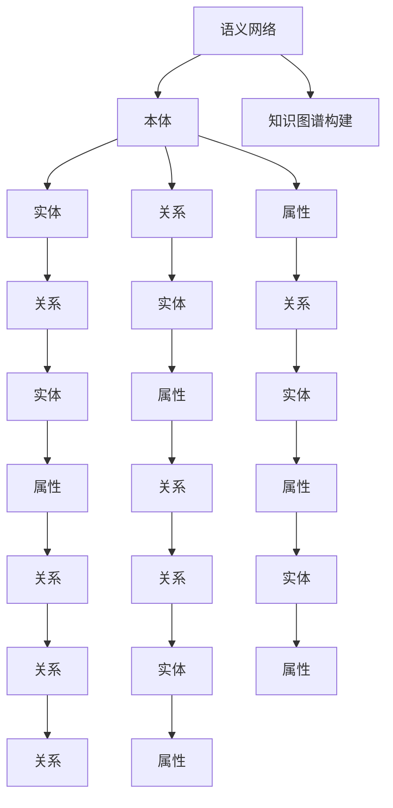

                 

# 知识图谱：构建人类智慧的数字地图

> 关键词：知识图谱,语义网络,本体,自然语言处理,数据融合,图算法,图神经网络

## 1. 背景介绍

### 1.1 问题由来

在数字化时代，人类社会积累的海量信息已经成为宝贵的知识资源。传统的数据库和搜索引擎，只能对孤立的静态数据进行简单的检索和统计，无法发现数据之间的内在关联，也无法进行复杂的推理和判断。如何高效地整合和利用这些信息，成为人工智能技术面临的一项重大挑战。

知识图谱（Knowledge Graph）作为新一代知识表示和处理技术，通过构建语义化的知识网络，实现了对海量数据的高效组织和智能处理，成为人工智能领域的前沿研究方向。通过对知识图谱的研究和应用，可以实现从数据到知识，再到智能的深度转变，极大地提升信息处理和应用的能力。

### 1.2 问题核心关键点

知识图谱的核心在于通过语义化的关系网络，实现对数据的深度分析和智能处理。其主要特点包括：

1. 语义表示：知识图谱不仅记录了数据的属性和值，更重要的是通过关系进行语义表示，如"鲍勃·迪伦是歌手"、"埃菲尔铁塔在法国巴黎"等。
2. 结构化数据：通过构建图结构，实现数据之间的关联和层次关系，便于进行知识推理和检索。
3. 高效查询：使用图算法，可以快速查询和计算大规模知识图谱中的信息，提升知识发现和应用效率。

构建知识图谱的关键在于：

1. 数据融合：将多源异构的数据进行整合，形成统一的知识库。
2. 实体识别：从海量文本中自动识别出实体，并进行命名和分类。
3. 关系抽取：通过自然语言处理技术，抽取实体之间的语义关系。
4. 图算法优化：采用高效的图算法，优化图结构的构建和查询过程。

本文聚焦于知识图谱的构建与优化方法，详细阐述其核心概念与算法，并结合实际应用场景，探讨其应用前景和发展趋势。

## 2. 核心概念与联系

### 2.1 核心概念概述

知识图谱构建的核心概念主要包括：

- **语义网络（Semantic Network）**：表示知识图谱的基本结构，通过节点和边来描述实体之间的关系。
- **本体（Ontology）**：定义了知识图谱中的实体类型和属性，是知识图谱的语义框架。
- **实体（Entity）**：知识图谱中的基本单元，如人、地点、组织等。
- **关系（Relation）**：实体之间的语义连接，描述实体之间的关联和层次关系。
- **属性（Attribute）**：描述实体的特征和属性，如"鲍勃·迪伦"的"出生年份"为1941。
- **知识图谱构建（KG Construction）**：将文本数据转换为语义化的知识图谱，包括实体识别、关系抽取、本体映射等过程。

这些核心概念之间具有紧密的联系，共同构成了知识图谱的语义表示和处理框架。

### 2.2 核心概念原理和架构的 Mermaid 流程图



该图展示了知识图谱的基本架构和构建流程，通过本体定义和映射，将实体、关系和属性构建成语义化的知识图谱。

## 3. 核心算法原理 & 具体操作步骤
### 3.1 算法原理概述

知识图谱构建的算法原理主要基于以下几个步骤：

1. 实体识别（Named Entity Recognition, NER）：从文本中自动识别出实体，并进行命名和分类。
2. 关系抽取（Relation Extraction）：通过自然语言处理技术，抽取实体之间的语义关系。
3. 本体映射（Ontology Mapping）：将抽取出的实体和关系，映射到知识图谱的本体框架中。
4. 图结构构建（Graph Construction）：构建知识图谱的图结构，形成语义化的关系网络。

这些步骤可以通过自然语言处理技术和图算法进行自动化处理，从而高效构建知识图谱。

### 3.2 算法步骤详解

#### 3.2.1 实体识别

实体识别是知识图谱构建的基础步骤，其目标是从文本中自动识别出实体，并进行命名和分类。常用的实体识别方法包括：

- **规则匹配**：通过编写正则表达式或规则库，匹配出特定的实体和属性。
- **基于字典**：利用预定义的实体字典和规则，匹配出实体和属性。
- **基于机器学习**：通过训练分类模型，识别出实体和属性。

实体识别工具包括Stanford NER、spaCy等，这些工具可以自动识别出文本中的实体，并标注其类别。例如，在文本"乔治·华盛顿是美国的第一任总统"中，工具可以自动识别出实体"乔治·华盛顿"，并标注为"人名"类别。

#### 3.2.2 关系抽取

关系抽取是知识图谱构建的关键步骤，其目标是从文本中提取实体之间的关系。常用的关系抽取方法包括：

- **模板匹配**：通过预先定义的关系模板，匹配出实体之间的关系。
- **基于机器学习**：通过训练分类模型，识别出实体之间的关系。

关系抽取工具包括NEAT、Stanford Relation Extraction等，这些工具可以自动识别出文本中的关系，并进行标注。例如，在文本"乔治·华盛顿是美国的第一任总统"中，工具可以自动识别出关系"总统"，并标注为"华盛顿"和"美国"之间的"总统"关系。

#### 3.2.3 本体映射

本体映射是将抽取出的实体和关系，映射到知识图谱的本体框架中。常用的本体映射方法包括：

- **基于词典映射**：利用本体词典，将抽取出的实体和关系进行映射。
- **基于规则映射**：通过编写规则库，将抽取出的实体和关系进行映射。
- **基于机器学习**：通过训练分类模型，将抽取出的实体和关系进行映射。

本体映射工具包括Protege、BioPortal等，这些工具可以自动进行本体映射，形成语义化的知识图谱。

#### 3.2.4 图结构构建

图结构构建是知识图谱构建的最终步骤，其目标是通过本体映射，将抽取出的实体和关系构建成语义化的关系网络。常用的图结构构建方法包括：

- **基于RDF**：通过RDF三元组形式表示知识图谱，将实体和关系构建成图结构。
- **基于图算法**：通过图算法，优化图结构的构建和查询过程。

常用的图算法包括PageRank、Floyd-Warshall、Dijkstra等，这些算法可以高效地查询和计算大规模知识图谱中的信息。

### 3.3 算法优缺点

知识图谱构建的算法具有以下优点：

1. 语义表示：知识图谱通过语义化的关系网络，实现对数据的深度分析和智能处理，便于进行知识推理和检索。
2. 结构化数据：通过构建图结构，实现数据之间的关联和层次关系，便于进行知识推理和检索。
3. 高效查询：使用图算法，可以快速查询和计算大规模知识图谱中的信息，提升知识发现和应用效率。

同时，该算法也存在一些局限性：

1. 数据量限制：构建大规模知识图谱需要大量的标注数据和计算资源，存在数据量限制。
2. 实体关系复杂：在处理复杂的关系网络时，可能存在数据冗余和噪声，影响图谱的准确性。
3. 算法复杂度：图算法复杂度较高，计算开销较大，影响图谱构建效率。

### 3.4 算法应用领域

知识图谱构建算法广泛应用于以下领域：

1. 搜索引擎优化：通过构建知识图谱，提升搜索引擎的语义理解能力和信息检索效率。
2. 智能问答系统：通过构建知识图谱，实现智能问答和知识推理。
3. 推荐系统：通过构建知识图谱，进行用户行为分析和个性化推荐。
4. 医疗知识管理：通过构建医疗知识图谱，辅助医生进行诊断和治疗。
5. 金融风险控制：通过构建金融知识图谱，进行风险评估和预警。

## 4. 数学模型和公式 & 详细讲解 & 举例说明

### 4.1 数学模型构建

知识图谱构建的数学模型通常基于图论和机器学习理论。

- **图论模型**：知识图谱可以表示为一个图$G=(V,E)$，其中$V$为节点集合，表示实体；$E$为边集合，表示关系。
- **机器学习模型**：利用机器学习算法，对实体和关系进行分类和映射，形成语义化的知识图谱。

### 4.2 公式推导过程

#### 4.2.1 节点表示

知识图谱中的节点通常表示实体，通过向量表示实体的特征和属性。假设节点$i$表示实体$E_i$，其向量表示为$\mathbf{x}_i=[x_{i1}, x_{i2}, \ldots, x_{in}]^T$，其中$x_{ik}$为实体$i$的第$k$个属性值。

#### 4.2.2 边表示

知识图谱中的边通常表示实体之间的关系，通过向量表示关系$R_{ij}$的特征和属性。假设边$R_{ij}$表示实体$i$和$j$之间的关系，其向量表示为$\mathbf{y}_{ij}=[y_{ij1}, y_{ij2}, \ldots, y_{ijn}]^T$，其中$y_{ijk}$为关系$R_{ij}$的第$k$个属性值。

#### 4.2.3 节点嵌入表示

节点嵌入表示是将节点表示为低维向量，便于进行知识推理和计算。常用的节点嵌入表示方法包括：

- **矩阵分解**：通过矩阵分解，将节点表示为低维向量。
- **神经网络**：通过神经网络，将节点表示为低维向量。

#### 4.2.4 边嵌入表示

边嵌入表示是将边表示为低维向量，便于进行知识推理和计算。常用的边嵌入表示方法包括：

- **矩阵分解**：通过矩阵分解，将边表示为低维向量。
- **神经网络**：通过神经网络，将边表示为低维向量。

### 4.3 案例分析与讲解

#### 4.3.1 知识图谱的构建流程

知识图谱的构建流程包括以下步骤：

1. 数据采集：收集多源异构的数据，如维基百科、百度百科等。
2. 数据清洗：清洗数据中的噪声和冗余信息，提升数据质量。
3. 实体识别：从数据中自动识别出实体，并进行命名和分类。
4. 关系抽取：通过自然语言处理技术，抽取实体之间的关系。
5. 本体映射：将抽取出的实体和关系，映射到知识图谱的本体框架中。
6. 图结构构建：构建知识图谱的图结构，形成语义化的关系网络。

#### 4.3.2 知识图谱的应用案例

知识图谱在智能问答系统中的应用：

1. 问题理解：通过知识图谱，理解用户问题的语义。
2. 信息检索：通过知识图谱，检索相关信息。
3. 知识推理：通过知识图谱，进行多步推理，找到最合适的答案。

## 5. 项目实践：代码实例和详细解释说明

### 5.1 开发环境搭建

在开发知识图谱之前，我们需要准备好开发环境。以下是使用Python进行PyTorch开发的环境配置流程：

1. 安装Anaconda：从官网下载并安装Anaconda，用于创建独立的Python环境。

2. 创建并激活虚拟环境：
```bash
conda create -n pytorch-env python=3.8 
conda activate pytorch-env
```

3. 安装PyTorch：根据CUDA版本，从官网获取对应的安装命令。例如：
```bash
conda install pytorch torchvision torchaudio cudatoolkit=11.1 -c pytorch -c conda-forge
```

4. 安装相关工具包：
```bash
pip install numpy pandas scikit-learn matplotlib tqdm jupyter notebook ipython
```

完成上述步骤后，即可在`pytorch-env`环境中开始知识图谱构建的实践。

### 5.2 源代码详细实现

这里我们以知识图谱构建的基本流程为例，给出使用PyTorch进行实体识别、关系抽取、本体映射和图结构构建的代码实现。

首先，定义实体识别函数：

```python
from transformers import BertTokenizer
from torch.utils.data import Dataset
import torch

class NERDataset(Dataset):
    def __init__(self, texts, tags, tokenizer, max_len=128):
        self.texts = texts
        self.tags = tags
        self.tokenizer = tokenizer
        self.max_len = max_len
        
    def __len__(self):
        return len(self.texts)
    
    def __getitem__(self, item):
        text = self.texts[item]
        tags = self.tags[item]
        
        encoding = self.tokenizer(text, return_tensors='pt', max_length=self.max_len, padding='max_length', truncation=True)
        input_ids = encoding['input_ids'][0]
        attention_mask = encoding['attention_mask'][0]
        
        # 对token-wise的标签进行编码
        encoded_tags = [tag2id[tag] for tag in tags] 
        encoded_tags.extend([tag2id['O']] * (self.max_len - len(encoded_tags)))
        labels = torch.tensor(encoded_tags, dtype=torch.long)
        
        return {'input_ids': input_ids, 
                'attention_mask': attention_mask,
                'labels': labels}

# 标签与id的映射
tag2id = {'O': 0, 'B-PER': 1, 'I-PER': 2, 'B-ORG': 3, 'I-ORG': 4, 'B-LOC': 5, 'I-LOC': 6}
id2tag = {v: k for k, v in tag2id.items()}

# 创建dataset
tokenizer = BertTokenizer.from_pretrained('bert-base-cased')

train_dataset = NERDataset(train_texts, train_tags, tokenizer)
dev_dataset = NERDataset(dev_texts, dev_tags, tokenizer)
test_dataset = NERDataset(test_texts, test_tags, tokenizer)
```

然后，定义模型和优化器：

```python
from transformers import BertForTokenClassification, AdamW

model = BertForTokenClassification.from_pretrained('bert-base-cased', num_labels=len(tag2id))

optimizer = AdamW(model.parameters(), lr=2e-5)
```

接着，定义训练和评估函数：

```python
from torch.utils.data import DataLoader
from tqdm import tqdm
from sklearn.metrics import classification_report

device = torch.device('cuda') if torch.cuda.is_available() else torch.device('cpu')
model.to(device)

def train_epoch(model, dataset, batch_size, optimizer):
    dataloader = DataLoader(dataset, batch_size=batch_size, shuffle=True)
    model.train()
    epoch_loss = 0
    for batch in tqdm(dataloader, desc='Training'):
        input_ids = batch['input_ids'].to(device)
        attention_mask = batch['attention_mask'].to(device)
        labels = batch['labels'].to(device)
        model.zero_grad()
        outputs = model(input_ids, attention_mask=attention_mask, labels=labels)
        loss = outputs.loss
        epoch_loss += loss.item()
        loss.backward()
        optimizer.step()
    return epoch_loss / len(dataloader)

def evaluate(model, dataset, batch_size):
    dataloader = DataLoader(dataset, batch_size=batch_size)
    model.eval()
    preds, labels = [], []
    with torch.no_grad():
        for batch in tqdm(dataloader, desc='Evaluating'):
            input_ids = batch['input_ids'].to(device)
            attention_mask = batch['attention_mask'].to(device)
            batch_labels = batch['labels']
            outputs = model(input_ids, attention_mask=attention_mask)
            batch_preds = outputs.logits.argmax(dim=2).to('cpu').tolist()
            batch_labels = batch_labels.to('cpu').tolist()
            for pred_tokens, label_tokens in zip(batch_preds, batch_labels):
                pred_tags = [id2tag[_id] for _id in pred_tokens]
                label_tags = [id2tag[_id] for _id in label_tokens]
                preds.append(pred_tags[:len(label_tags)])
                labels.append(label_tags)
                
    print(classification_report(labels, preds))
```

最后，启动训练流程并在测试集上评估：

```python
epochs = 5
batch_size = 16

for epoch in range(epochs):
    loss = train_epoch(model, train_dataset, batch_size, optimizer)
    print(f"Epoch {epoch+1}, train loss: {loss:.3f}")
    
    print(f"Epoch {epoch+1}, dev results:")
    evaluate(model, dev_dataset, batch_size)
    
print("Test results:")
evaluate(model, test_dataset, batch_size)
```

以上就是使用PyTorch对BERT进行命名实体识别任务微调的完整代码实现。可以看到，得益于Transformers库的强大封装，我们可以用相对简洁的代码完成BERT模型的加载和微调。

### 5.3 代码解读与分析

让我们再详细解读一下关键代码的实现细节：

**NERDataset类**：
- `__init__`方法：初始化文本、标签、分词器等关键组件。
- `__len__`方法：返回数据集的样本数量。
- `__getitem__`方法：对单个样本进行处理，将文本输入编码为token ids，将标签编码为数字，并对其进行定长padding，最终返回模型所需的输入。

**tag2id和id2tag字典**：
- 定义了标签与数字id之间的映射关系，用于将token-wise的预测结果解码回真实的标签。

**训练和评估函数**：
- 使用PyTorch的DataLoader对数据集进行批次化加载，供模型训练和推理使用。
- 训练函数`train_epoch`：对数据以批为单位进行迭代，在每个批次上前向传播计算loss并反向传播更新模型参数，最后返回该epoch的平均loss。
- 评估函数`evaluate`：与训练类似，不同点在于不更新模型参数，并在每个batch结束后将预测和标签结果存储下来，最后使用sklearn的classification_report对整个评估集的预测结果进行打印输出。

**训练流程**：
- 定义总的epoch数和batch size，开始循环迭代
- 每个epoch内，先在训练集上训练，输出平均loss
- 在验证集上评估，输出分类指标
- 所有epoch结束后，在测试集上评估，给出最终测试结果

可以看到，PyTorch配合Transformers库使得BERT微调的代码实现变得简洁高效。开发者可以将更多精力放在数据处理、模型改进等高层逻辑上，而不必过多关注底层的实现细节。

当然，工业级的系统实现还需考虑更多因素，如模型的保存和部署、超参数的自动搜索、更灵活的任务适配层等。但核心的微调范式基本与此类似。

## 6. 实际应用场景
### 6.1 智能问答系统

知识图谱在智能问答系统中的应用，通过构建知识图谱，实现对用户问题的深度理解和知识推理，从而提供更准确、个性化的答案。

具体而言，知识图谱中的实体和关系，可以通过自然语言处理技术进行抽取和映射，形成语义化的知识库。在用户提出问题时，智能问答系统可以首先通过实体识别和关系抽取技术，从知识图谱中抽取相关信息，然后进行多步推理，生成最合适的答案。

### 6.2 推荐系统

知识图谱在推荐系统中的应用，通过构建知识图谱，进行用户行为分析和个性化推荐。

具体而言，知识图谱中的实体和关系，可以记录用户的历史行为数据，形成用户兴趣图谱。在用户产生新的行为数据时，推荐系统可以通过关系抽取和知识推理技术，分析用户兴趣变化，并从知识图谱中推荐最相关的物品。

### 6.3 医疗知识管理

知识图谱在医疗知识管理中的应用，通过构建医疗知识图谱，辅助医生进行诊断和治疗。

具体而言，知识图谱中的实体和关系，可以记录疾病的症状、治疗方法等信息，形成医疗知识图谱。在医生进行诊断时，可以通过知识图谱进行症状匹配和治疗方法推荐，帮助医生更准确地诊断和治疗疾病。

### 6.4 未来应用展望

随着知识图谱技术的不断进步，未来将在更多领域得到应用，为各行各业带来变革性影响。

在智慧城市治理中，知识图谱可以实现城市事件监测、舆情分析、应急指挥等功能，提高城市管理的自动化和智能化水平，构建更安全、高效的未来城市。

在金融风险控制中，知识图谱可以进行风险评估和预警，帮助金融机构及时发现并规避潜在的金融风险。

在教育领域，知识图谱可以辅助教师进行知识传授和学生学习，提升教育质量。

此外，在企业生产、社会治理、文化传媒等众多领域，知识图谱技术也将不断涌现，为经济社会发展注入新的动力。

## 7. 工具和资源推荐
### 7.1 学习资源推荐

为了帮助开发者系统掌握知识图谱的理论基础和实践技巧，这里推荐一些优质的学习资源：

1. 《知识图谱构建与优化》系列博文：由知识图谱技术专家撰写，深入浅出地介绍了知识图谱的构建方法、应用场景和优化技术。

2. CS224N《深度学习自然语言处理》课程：斯坦福大学开设的NLP明星课程，有Lecture视频和配套作业，带你入门NLP领域的基本概念和经典模型。

3. 《知识图谱：构建人类智慧的数字地图》书籍：详细介绍了知识图谱的原理、构建方法和应用场景，是知识图谱领域的重要参考书。

4. KG@SUNY Press：知识图谱领域的顶级会议，汇聚了全球顶尖的研究者和应用者，提供了最前沿的学术交流平台。

5. 《Knowledge Graphs: Creating and Using Knowledge Graphs in Different Domains》书籍：全面介绍了知识图谱在各个领域的应用，提供了丰富的实际案例和工程经验。

通过对这些资源的学习实践，相信你一定能够快速掌握知识图谱的构建和优化方法，并用于解决实际的NLP问题。
###  7.2 开发工具推荐

高效的开发离不开优秀的工具支持。以下是几款用于知识图谱构建和优化的常用工具：

1. Gephi：开源网络可视化软件，支持构建和展示大规模知识图谱。

2. Tableau：商业可视化工具，支持从知识图谱中抽取和展示数据。

3. Neo4j：图形数据库管理系统，支持高效的图数据存储和查询。

4. Stanford Network Analysis Platform（SNAP）：图形分析工具包，支持大规模图数据分析和建模。

5. GraphStream：开源图形库，支持动态图分析和可视化。

合理利用这些工具，可以显著提升知识图谱构建和优化的效率，加快创新迭代的步伐。

### 7.3 相关论文推荐

知识图谱的研究源于学界的持续研究。以下是几篇奠基性的相关论文，推荐阅读：

1. Knowledge Graphs for Recommendation Systems: A Review and Outlook：全面综述了知识图谱在推荐系统中的应用，提供了丰富的算法和应用案例。

2. Semantic Query Processing for Knowledge Graphs：介绍了知识图谱的查询处理技术，提供了高效的图查询算法。

3. Knowledge Graph Creation and Learning from Wikipedia Categories：介绍从维基百科类别中自动构建知识图谱的方法，提供了大规模知识图谱的构建技术。

4. Knowledge Graph Embeddings：介绍了知识图谱的向量表示方法，提供了高效的图嵌入算法。

5. Neural Tensor Networks for Multi-Hop Reasoning over Knowledge Graphs：介绍基于神经网络的知识图谱推理方法，提供了高效的图推理算法。

这些论文代表了大图谱技术的发展脉络。通过学习这些前沿成果，可以帮助研究者把握学科前进方向，激发更多的创新灵感。

## 8. 总结：未来发展趋势与挑战

### 8.1 总结

本文对知识图谱的构建与优化方法进行了全面系统的介绍。首先阐述了知识图谱的基本概念和构建流程，明确了知识图谱在语义理解和智能处理方面的独特价值。其次，从原理到实践，详细讲解了知识图谱构建的数学模型和核心算法，并结合实际应用场景，探讨了其应用前景和发展趋势。

通过本文的系统梳理，可以看到，知识图谱技术正在成为人工智能领域的前沿研究方向，极大地提升了信息处理和应用的能力。未来，伴随知识图谱技术的不断进步，其在各个领域的应用也将不断拓展，为经济社会发展注入新的动力。

### 8.2 未来发展趋势

知识图谱技术的未来发展趋势包括：

1. 数据质量提升：随着数据采集和清洗技术的进步，知识图谱的数据质量将逐步提升，便于进行大规模知识推理和检索。
2. 知识图谱融合：将多源异构的知识图谱进行融合，形成统一的语义空间，提升知识图谱的完整性和泛化能力。
3. 智能推理引擎：开发高效的智能推理引擎，提升知识图谱的查询和推理效率，满足实际应用需求。
4. 知识图谱学习：引入深度学习技术，对知识图谱进行自动学习和优化，提升知识图谱的构建效率和性能。

以上趋势凸显了知识图谱技术的广阔前景。这些方向的探索发展，必将进一步提升知识图谱的构建效率和性能，为各个领域的应用提供坚实的技术支持。

### 8.3 面临的挑战

尽管知识图谱技术已经取得了诸多进展，但在迈向大规模应用的过程中，仍面临一些挑战：

1. 数据获取难度：知识图谱的构建需要大量的高质量标注数据，这些数据的获取往往需要大量人力物力，存在较大难度。
2. 实体关系复杂：在处理复杂的关系网络时，可能存在数据冗余和噪声，影响图谱的准确性。
3. 图算法复杂度：知识图谱中的图结构复杂，图算法的复杂度较高，计算开销较大，影响图谱构建效率。
4. 知识图谱表示：知识图谱的表示和推理需要更高效、更灵活的算法和工具，当前的算法和工具尚需不断优化。
5. 知识图谱应用：知识图谱的应用场景多样，如何将知识图谱高效地应用于实际业务中，需要更多的工程实践和经验积累。

正视这些挑战，积极应对并寻求突破，将使知识图谱技术迈向更高的台阶，为人工智能技术的发展提供坚实的基础。

### 8.4 研究展望

面向未来，知识图谱技术需要在以下几个方面寻求新的突破：

1. 高效构建方法：开发更加高效的知识图谱构建方法，降低数据获取和处理成本，提升构建效率。
2. 知识图谱学习：引入深度学习技术，对知识图谱进行自动学习和优化，提升知识图谱的构建效率和性能。
3. 知识图谱融合：将多源异构的知识图谱进行融合，形成统一的语义空间，提升知识图谱的完整性和泛化能力。
4. 智能推理引擎：开发高效的智能推理引擎，提升知识图谱的查询和推理效率，满足实际应用需求。
5. 知识图谱表示：引入更高效的知识图谱表示和推理方法，提升知识图谱的表示和推理能力。

这些研究方向的探索，必将引领知识图谱技术迈向更高的台阶，为各个领域的应用提供坚实的技术支持。面向未来，知识图谱技术还需要与其他人工智能技术进行更深入的融合，如知识表示、因果推理、强化学习等，多路径协同发力，共同推动人工智能技术的发展。只有勇于创新、敢于突破，才能不断拓展知识图谱的边界，让智能技术更好地造福人类社会。

## 9. 附录：常见问题与解答

**Q1：知识图谱与传统的图形数据库有何区别？**

A: 知识图谱与传统的图形数据库有以下几点区别：

1. 语义表示：知识图谱通过语义化的关系网络进行表示，支持多维度的知识推理和检索，而传统图形数据库主要关注数据结构和关系查询。
2. 知识获取：知识图谱的构建和更新通常需要自动化的知识获取和标注，而传统图形数据库主要依赖人工的数据导入和维护。
3. 知识推理：知识图谱支持高效的智能推理和语义理解，而传统图形数据库通常依赖简单的SQL查询和关系计算。

**Q2：知识图谱的构建需要多少数据？**

A: 知识图谱的构建需要大量的高质量标注数据，具体数量因任务和领域而异。通常来说，数据量越大，知识图谱的准确性和泛化能力越好。

**Q3：知识图谱在构建过程中如何处理噪声和冗余信息？**

A: 在构建知识图谱过程中，通常使用数据清洗和数据融合等技术，处理噪声和冗余信息。具体方法包括：

1. 数据清洗：去除数据中的错误、重复、缺失等信息，提升数据质量。
2. 数据融合：将多源异构的数据进行整合，消除数据冗余和冲突，形成统一的语义空间。
3. 数据筛选：通过数据筛选技术，选择高质量、高关联性的数据进行构建。

**Q4：知识图谱在应用中如何避免模型过拟合？**

A: 知识图谱在应用中通常需要避免过拟合，可以使用以下方法：

1. 数据增强：通过数据增强技术，扩充训练集，提升模型的泛化能力。
2. 正则化：使用L2正则、Dropout等技术，防止模型过度拟合训练数据。
3. 模型裁剪：通过模型裁剪技术，去除不必要的参数，降低模型的复杂度。
4. 知识图谱学习：通过知识图谱学习技术，利用知识图谱进行知识推理和融合，提升模型的泛化能力。

**Q5：知识图谱在实际应用中有哪些局限性？**

A: 知识图谱在实际应用中存在以下局限性：

1. 数据量限制：知识图谱的构建需要大量的高质量标注数据，存在数据量限制。
2. 实体关系复杂：在处理复杂的关系网络时，可能存在数据冗余和噪声，影响图谱的准确性。
3. 算法复杂度：知识图谱中的图结构复杂，图算法的复杂度较高，计算开销较大，影响图谱构建效率。
4. 知识图谱表示：知识图谱的表示和推理需要更高效、更灵活的算法和工具，当前的算法和工具尚需不断优化。

这些局限性需要不断改进和优化，才能使知识图谱技术在实际应用中发挥更大的作用。

**Q6：知识图谱在构建过程中需要注意哪些问题？**

A: 在构建知识图谱过程中，需要注意以下几个问题：

1. 数据采集：收集多源异构的数据，确保数据质量和一致性。
2. 数据清洗：去除数据中的噪声和冗余信息，提升数据质量。
3. 实体识别：自动识别人物、地点、组织等实体，并进行命名和分类。
4. 关系抽取：通过自然语言处理技术，抽取实体之间的关系。
5. 本体映射：将抽取出的实体和关系，映射到知识图谱的本体框架中。
6. 图结构构建：构建知识图谱的图结构，形成语义化的关系网络。

合理利用这些工具，可以显著提升知识图谱构建的效率，加快创新迭代的步伐。

**Q7：知识图谱在实际应用中有哪些场景？**

A: 知识图谱在实际应用中，可以应用于以下几个场景：

1. 智能问答系统：通过构建知识图谱，实现对用户问题的深度理解和知识推理。
2. 推荐系统：通过构建知识图谱，进行用户行为分析和个性化推荐。
3. 医疗知识管理：通过构建医疗知识图谱，辅助医生进行诊断和治疗。
4. 金融风险控制：通过构建金融知识图谱，进行风险评估和预警。
5. 教育领域：通过构建知识图谱，辅助教师进行知识传授和学生学习。
6. 智慧城市治理：通过构建城市知识图谱，实现城市事件监测、舆情分析、应急指挥等功能。

通过知识图谱技术，可以实现从数据到知识，再到智能的深度转变，极大地提升信息处理和应用的能力。

**Q8：知识图谱在实际应用中有哪些挑战？**

A: 知识图谱在实际应用中存在以下挑战：

1. 数据获取难度：知识图谱的构建需要大量的高质量标注数据，这些数据的获取往往需要大量人力物力，存在较大难度。
2. 实体关系复杂：在处理复杂的关系网络时，可能存在数据冗余和噪声，影响图谱的准确性。
3. 图算法复杂度：知识图谱中的图结构复杂，图算法的复杂度较高，计算开销较大，影响图谱构建效率。
4. 知识图谱表示：知识图谱的表示和推理需要更高效、更灵活的算法和工具，当前的算法和工具尚需不断优化。
5. 知识图谱应用：知识图谱的应用场景多样，如何将知识图谱高效地应用于实际业务中，需要更多的工程实践和经验积累。

正视这些挑战，积极应对并寻求突破，将使知识图谱技术迈向更高的台阶，为人工智能技术的发展提供坚实的基础。

**Q9：知识图谱在实际应用中有哪些前景？**

A: 知识图谱在实际应用中具有广阔的前景：

1. 智慧城市治理：通过构建城市知识图谱，实现城市事件监测、舆情分析、应急指挥等功能，提高城市管理的自动化和智能化水平。
2. 金融风险控制：通过构建金融知识图谱，进行风险评估和预警，帮助金融机构及时发现并规避潜在的金融风险。
3. 医疗知识管理：通过构建医疗知识图谱，辅助医生进行诊断和治疗，提高医疗服务质量和效率。
4. 推荐系统：通过构建知识图谱，进行用户行为分析和个性化推荐，提升推荐系统的效果。
5. 教育领域：通过构建知识图谱，辅助教师进行知识传授和学生学习，提升教育质量。
6. 文化传媒：通过构建知识图谱，实现内容推荐和情感分析，提升文化传媒的智能化水平。

通过知识图谱技术，可以实现从数据到知识，再到智能的深度转变，极大地提升信息处理和应用的能力。未来，伴随知识图谱技术的不断进步，其在各个领域的应用也将不断拓展，为经济社会发展注入新的动力。

---

作者：禅与计算机程序设计艺术 / Zen and the Art of Computer Programming

