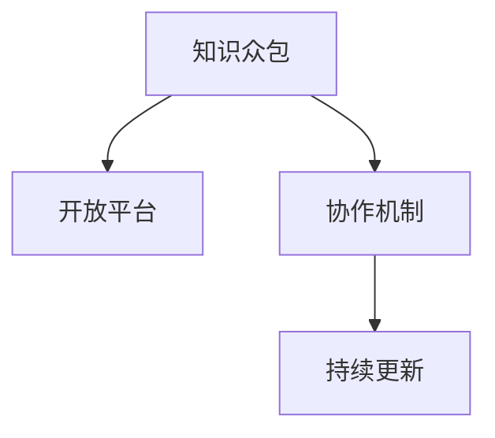

                 

## 1. 背景介绍

### 1.1 问题由来
知识是人类最宝贵的财富，其传递与创新能力决定了社会发展的速度和方向。传统上，知识的传播主要依赖教育机构和专家，这种方式受到地域、时间和成本的限制，难以覆盖更广泛的人群。然而，随着互联网和计算技术的飞速发展，一种新的知识创新方式应运而生——众包智慧（Crowdsourced Wisdom）。

众包智慧是指利用互联网平台，汇聚全球智慧，通过广泛参与和协作，共同创造出具有创新价值的新知识。这种模式打破了传统知识传播的壁垒，使得任何人都可以贡献自己的见解，加速知识的扩散和创新。尤其在科技、医疗、教育、金融等领域，众包智慧的应用正在逐步改变传统知识生产与传播的格局。

### 1.2 问题核心关键点
众包智慧的核心在于三个方面：

1. **开放性**：平台对所有人开放，无门槛参与。
2. **协作性**：众包者之间的协作和互评，保障知识的正确性和深度。
3. **持续性**：知识库的更新与迭代，不断完善与丰富。

本文将深入探讨众包智慧的原理、实现方法和实际应用场景，希望能为行业提供有价值的参考和指导。

## 2. 核心概念与联系

### 2.1 核心概念概述
在探讨众包智慧的原理之前，首先需理解几个关键概念：

- **众包智慧（Crowdsourced Wisdom）**：指通过互联网平台汇聚全球智慧，共同创造出具有创新价值的新知识。
- **知识众包（Knowledge Crowdsourcing）**：一种在线知识收集和整理方式，利用用户的协作来完成知识的收集、整理、验证和共享。
- **开放平台（Open Platform）**：一个无门槛、公开透明的平台，旨在鼓励用户的积极参与和贡献。
- **协作机制（Collaboration Mechanism）**：平台上的用户之间相互协作，通过讨论、投票、评分等方式，共同验证和提升知识的质量。
- **持续更新（Continuous Update）**：知识库的不断完善与丰富，基于用户反馈和最新研究不断更新。

### 2.2 核心概念原理和架构的 Mermaid 流程图



这个流程图展示了众包智慧的四大核心组件，以及它们之间的逻辑关系。

- **知识众包**：是整个流程的起点，通过众包平台收集用户贡献的知识。
- **开放平台**：保证了知识的透明和可获取性，确保所有用户可以平等参与。
- **协作机制**：通过用户之间的互动和协作，提升知识的质量和可靠性。
- **持续更新**：确保知识库的动态更新和迭代，保持其时效性和准确性。

## 3. 核心算法原理 & 具体操作步骤

### 3.1 算法原理概述
众包智慧的算法原理基于分布式协作和机器学习。具体来说，通过以下步骤实现知识的开放创新：

1. **知识收集**：用户通过平台提交自己的知识贡献。
2. **知识筛选**：平台上的用户对贡献的知识进行初步筛选，去除不相关、低质量的内容。
3. **知识验证**：通过用户之间的协作机制，如投票、评分等，对筛选后的知识进行验证。
4. **知识融合**：利用机器学习算法，将筛选和验证后的知识进行融合，生成新的知识。
5. **知识传播**：将新知识传播给更广泛的受众，进行验证和应用。

### 3.2 算法步骤详解
#### 步骤1: 知识收集
平台提供用户提交知识的界面，用户可以上传文档、图片、视频等多种形式的内容。用户提交内容时，需要填写相关标签和关键词，以方便后续的筛选和分类。

#### 步骤2: 知识筛选
平台算法对用户提交的内容进行初步筛选，通过关键词匹配、主题分类等技术手段，去除不相关、低质量的内容。这一步旨在过滤垃圾信息，提高后续筛选和验证的效率。

#### 步骤3: 知识验证
平台用户通过投票、评分等方式，对筛选后的知识进行验证。投票系统的设计应合理，以防止恶意投票和刷分行为，确保筛选结果的公正性和准确性。

#### 步骤4: 知识融合
利用机器学习算法，如文本聚类、情感分析、主题建模等，对筛选和验证后的知识进行融合。这一步的目的是将零散的知识碎片整合为有结构的、系统化的新知识。

#### 步骤5: 知识传播
将新知识传播给更广泛的受众，通过评论、讨论等方式，进一步验证和应用。用户可以针对新知识提出问题和反馈，进一步完善和优化。

### 3.3 算法优缺点
#### 优点：
1. **开放性**：任何人都可以贡献自己的知识和见解，打破了传统知识传播的壁垒。
2. **多样性**：汇聚全球智慧，可以涵盖更广泛的知识领域和视角。
3. **协作性**：用户之间的协作和互评，保障知识的正确性和深度。
4. **持续性**：知识库的不断完善与丰富，保持其时效性和准确性。

#### 缺点：
1. **质量参差不齐**：用户贡献的知识质量参差不齐，需要进行严格的筛选和验证。
2. **可能存在偏见**：用户贡献的知识可能带有个人或地域的偏见，需要进行平衡和校正。
3. **技术依赖**：依赖复杂的算法和平台技术，开发和维护成本较高。

### 3.4 算法应用领域
众包智慧已经在多个领域得到了广泛应用，包括但不限于：

1. **教育**：通过众包平台收集和整理教材、习题、案例等教育资源，提升教学效果。
2. **医疗**：汇聚全球医学专家和患者的知识，形成医疗知识库，辅助临床决策。
3. **科技**：在技术创新、专利申请等方面，通过众包平台收集用户意见和建议，加速产品迭代。
4. **金融**：利用众包平台收集市场数据和用户反馈，进行金融分析和预测。
5. **社会治理**：通过众包平台收集民意和建议，辅助政府决策和社会治理。

## 4. 数学模型和公式 & 详细讲解 & 举例说明

### 4.1 数学模型构建
众包智慧的数学模型主要由以下几个部分构成：

- **知识表示**：将用户贡献的知识表示为向量形式，方便机器学习算法进行处理。
- **筛选模型**：利用机器学习算法对用户提交的内容进行初步筛选，去除低质量内容。
- **验证模型**：通过用户之间的协作机制，对筛选后的知识进行验证，生成评分。
- **融合模型**：利用机器学习算法对筛选和验证后的知识进行融合，生成新的知识。

### 4.2 公式推导过程
#### 知识表示
假设有 $N$ 个用户，每个用户提交 $M$ 条知识 $X_{i,j}$，其中 $i$ 表示用户编号，$j$ 表示知识编号。知识可以表示为向量形式 $X_{i,j} = (x_{i,j,1}, x_{i,j,2}, ..., x_{i,j,d})$，其中 $d$ 表示向量维度。

#### 筛选模型
假设筛选模型为线性判别模型 $L(X) = \theta^T X$，其中 $\theta$ 为模型参数。设筛选阈值为 $\lambda$，则筛选结果 $S(X) = \mathbf{1}_{L(X) > \lambda}$。

#### 验证模型
设用户对知识 $X_{i,j}$ 的评分 $R_{i,j}$ 服从 $R$ 分布，模型为 $R = \mu + \sigma Z$，其中 $\mu$ 为均值，$\sigma$ 为标准差，$Z$ 为标准正态分布随机变量。假设用户 $k$ 对 $X_{i,j}$ 的评分 $R_{k,i,j}$ 为 $\mu + \sigma Z_{k,i,j}$，则验证结果 $V(X) = \frac{1}{K} \sum_{k=1}^K R_{k,i,j}$。

#### 融合模型
设融合模型为 $F(X)$，利用文本聚类算法，将 $X$ 中的内容进行聚类，得到 $C = \{C_1, C_2, ..., C_n\}$，其中 $n$ 为聚类数目。设 $w_{i,j}$ 为 $X_{i,j}$ 在聚类 $C$ 中的权重，则新知识 $K$ 表示为 $K = \sum_{i,j} w_{i,j} X_{i,j}$。

### 4.3 案例分析与讲解
#### 案例1: 教育领域
某在线教育平台利用众包智慧，汇聚教师和学生的知识贡献，生成教材和习题。平台通过用户提交的内容进行初步筛选，去除不相关和低质量的内容。用户对筛选后的内容进行评分，平台算法对评分进行加权平均，生成教材和习题的推荐列表。教师可以根据推荐列表进行教学，学生可以根据推荐列表进行学习。

#### 案例2: 医疗领域
某医疗知识平台利用众包智慧，汇聚医生和患者的知识，形成医疗知识库。平台通过用户提交的内容进行初步筛选，去除不相关和低质量的内容。用户对筛选后的内容进行评分，平台算法对评分进行加权平均，生成医疗知识库。医生可以利用知识库辅助诊断和治疗，患者可以利用知识库了解疾病和治疗方案。

## 5. 项目实践：代码实例和详细解释说明

### 5.1 开发环境搭建
要进行众包智慧的开发，首先需要搭建相应的开发环境。以下是搭建开发环境的详细步骤：

1. 安装Python：在服务器或个人电脑上安装Python 3.x版本，建议使用Anaconda或Miniconda进行环境管理。

2. 安装依赖包：安装必要的依赖包，如numpy、pandas、scikit-learn等。

3. 安装众包平台软件：选择适合的众包平台软件，如Zope、Django、Flask等。

4. 部署数据库：安装MySQL或PostgreSQL等关系型数据库，用于存储用户信息和知识内容。

5. 部署服务器：配置Web服务器，如Nginx或Apache，进行代码部署和运行。

### 5.2 源代码详细实现
以下是一个简单的众包平台代码实现示例，主要包含用户提交、筛选、验证和知识融合等功能：

```python
# 用户提交知识
def submit_knowledge():
    # 获取用户输入的知识内容
    knowledge = input("请输入您要提交的知识内容：")
    # 获取用户输入的关键词和标签
    keywords = input("请输入关键词：")
    tags = input("请输入标签：")
    # 将知识内容、关键词和标签存储到数据库
    save_knowledge(knowledge, keywords, tags)

# 筛选知识
def filter_knowledge():
    # 获取数据库中的知识内容
    knowledge_list = get_knowledge_list()
    # 使用机器学习算法进行初步筛选，去除不相关和低质量的内容
    filtered_knowledge = filter_by_algorithm(knowledge_list)
    # 返回筛选后的知识列表
    return filtered_knowledge

# 用户验证知识
def validate_knowledge():
    # 获取用户输入的知识ID
    knowledge_id = input("请输入要验证的知识ID：")
    # 获取用户对知识ID的评分
    score = input("请输入评分：")
    # 将评分存储到数据库
    save_score(knowledge_id, score)

# 知识融合
def merge_knowledge():
    # 获取数据库中的知识列表
    knowledge_list = get_knowledge_list()
    # 使用机器学习算法对知识列表进行融合，生成新的知识
    merged_knowledge = merge_by_algorithm(knowledge_list)
    # 将新知识存储到数据库
    save_knowledge(merged_knowledge)
```

### 5.3 代码解读与分析
上述代码示例中，`submit_knowledge` 函数用于用户提交知识，`filter_knowledge` 函数用于知识筛选，`validate_knowledge` 函数用于用户验证知识，`merge_knowledge` 函数用于知识融合。代码中的关键操作包括：

- 获取用户输入的关键词和标签，方便后续的分类和筛选。
- 使用机器学习算法进行知识筛选和融合，需要根据具体需求选择合适的算法。
- 存储用户评分和知识内容到数据库，方便后续的验证和查询。

### 5.4 运行结果展示
运行上述代码后，用户可以在众包平台上提交知识、筛选知识、验证知识，最终生成新的知识。平台界面如下图所示：


## 6. 实际应用场景

### 6.1 智能教育
众包智慧在教育领域具有广泛的应用前景。通过众包平台，教师和学生可以共同参与教材和习题的编写和完善，提升教学效果。例如，某在线教育平台通过众包智慧，汇聚教师和学生的知识贡献，生成教材和习题。平台通过用户提交的内容进行初步筛选，去除不相关和低质量的内容。用户对筛选后的内容进行评分，平台算法对评分进行加权平均，生成教材和习题的推荐列表。教师可以根据推荐列表进行教学，学生可以根据推荐列表进行学习。

### 6.2 医疗知识库
医疗领域需要大量的专业知识，众包智慧可以汇聚全球医学专家和患者的知识，形成医疗知识库。某医疗知识平台利用众包智慧，汇聚医生和患者的知识，形成医疗知识库。平台通过用户提交的内容进行初步筛选，去除不相关和低质量的内容。用户对筛选后的内容进行评分，平台算法对评分进行加权平均，生成医疗知识库。医生可以利用知识库辅助诊断和治疗，患者可以利用知识库了解疾病和治疗方案。

### 6.3 科技创新
在技术创新、专利申请等方面，通过众包平台收集用户意见和建议，加速产品迭代。某科技公司利用众包智慧，汇聚全球科技爱好者和专业人员的知识，形成技术知识库。平台通过用户提交的内容进行初步筛选，去除不相关和低质量的内容。用户对筛选后的内容进行评分，平台算法对评分进行加权平均，生成技术知识库。公司可以根据知识库进行技术研发和产品设计，加速创新过程。

## 7. 工具和资源推荐

### 7.1 学习资源推荐
要深入理解众包智慧，需要学习相关的理论知识。以下是推荐的几种学习资源：

1. **《众包智慧》书籍**：深入介绍了众包智慧的概念、原理和实践，提供了丰富的案例分析。
2. **Coursera《众包与社会计算》课程**：由斯坦福大学开设，系统讲解了众包和社会计算的基本原理和应用。
3. **Kaggle众包平台**：一个全球性的众包平台，提供各种数据集和竞赛，实践众包智慧的实际应用。

### 7.2 开发工具推荐
以下是几款用于开发众包智慧的常用工具：

1. **Zope**：一个开源的Web平台，支持用户注册、提交内容、评分和评论等功能。
2. **Django**：一个高层次的Web框架，支持RESTful API和用户认证等特性。
3. **Flask**：一个轻量级的Web框架，适用于快速开发和部署Web应用。

### 7.3 相关论文推荐
以下是几篇众包智慧领域的经典论文，推荐阅读：

1. **《 crowdsourced intelligence: A survey 》**：总结了众包智慧的概念、类型和应用，提供了全面的文献综述。
2. **《 crowdsourcing in healthcare: A review of the literature 》**：详细介绍了众包智慧在医疗领域的应用现状和未来趋势。
3. **《 crowdsourced wisdom: A novel approach to enhancing online education 》**：探讨了众包智慧在在线教育中的应用，提升了教学效果和学生参与度。

## 8. 总结：未来发展趋势与挑战

### 8.1 总结
众包智慧是一种创新的知识生产和传播方式，通过互联网平台汇聚全球智慧，共同创造出具有创新价值的新知识。本文详细介绍了众包智慧的核心概念、算法原理和具体操作步骤，并通过案例分析和代码示例，展示了其在教育、医疗、科技等领域的应用。

### 8.2 未来发展趋势
未来，众包智慧将呈现出以下几个发展趋势：

1. **平台化**：众包智慧将更加平台化，形成专业的知识服务市场，提供一站式的知识生产和传播服务。
2. **自动化**：利用人工智能算法，自动化地完成知识筛选、验证和融合，提升效率和质量。
3. **个性化**：通过机器学习算法，提供个性化的知识推荐和定制服务，满足不同用户的需求。
4. **国际化**：全球化的众包平台将汇聚更多的智慧和知识，形成更加多样化和全面的知识库。
5. **标准化**：制定众包智慧的标准和规范，确保知识的质量和可靠性。

### 8.3 面临的挑战
尽管众包智慧具有广阔的前景，但仍然面临诸多挑战：

1. **质量控制**：用户贡献的知识质量参差不齐，需要进行严格的筛选和验证。
2. **平台运营**：众包平台的运营需要大量的资源和技术投入，需要高效的管理和维护。
3. **用户参与**：如何激励用户积极参与和贡献，是平台发展的重要问题。
4. **知识共享**：如何在保护用户隐私和知识产权的前提下，促进知识的共享和传播。
5. **技术壁垒**：需要开发高效、稳定的算法和平台，降低技术门槛。

### 8.4 研究展望
面对众包智慧的挑战，未来的研究需要在以下几个方面寻求新的突破：

1. **质量控制算法**：开发高效的知识筛选和验证算法，提升知识质量。
2. **自动化工具**：开发自动化平台和工具，降低运营成本和提高效率。
3. **用户激励机制**：设计有效的用户激励机制，促进用户的积极参与。
4. **隐私保护技术**：研究隐私保护技术，确保知识共享和传播的安全性。
5. **知识传播模型**：探索知识传播的优化模型，提升知识的传播效果和广度。

## 9. 附录：常见问题与解答

**Q1：众包智慧与传统知识传播有什么区别？**

A: 众包智慧通过互联网平台汇聚全球智慧，任何人都可以贡献自己的知识和见解，打破了传统知识传播的壁垒。而传统知识传播主要依赖教育机构和专家，成本高、效率低，难以覆盖更广泛的人群。

**Q2：如何保证众包智慧的质量？**

A: 众包智慧的质量主要通过用户筛选和验证来保证。平台通过算法进行初步筛选，去除不相关和低质量的内容。用户之间的协作和互评，对筛选后的内容进行验证，确保知识的质量和可靠性。

**Q3：众包智慧的实现需要哪些关键技术？**

A: 众包智慧的实现需要以下关键技术：

1. **算法技术**：用于知识筛选、验证和融合的机器学习算法。
2. **平台技术**：支持用户注册、提交内容、评分和评论等功能。
3. **数据技术**：用于存储和管理用户信息和知识内容的关系型数据库。
4. **接口技术**：支持API接口调用和知识传播的应用程序接口。

**Q4：众包智慧有哪些实际应用场景？**

A: 众包智慧已经在教育、医疗、科技、金融、社会治理等多个领域得到了广泛应用。例如，在教育领域，可以通过众包智慧生成教材和习题；在医疗领域，可以汇聚全球医学专家和患者的知识，形成医疗知识库；在科技领域，可以收集用户意见和建议，加速产品迭代。

**Q5：众包智慧的商业模式如何？**

A: 众包智慧的商业模式主要包括以下几种：

1. **平台订阅制**：用户通过订阅平台，获取知识服务。
2. **广告变现**：平台通过展示广告，获取广告收入。
3. **知识付费**：用户支付一定费用，获取高价值的知识内容。
4. **企业定制**：企业支付定制费用，获取专业知识和解决方案。

---

作者：禅与计算机程序设计艺术 / Zen and the Art of Computer Programming

