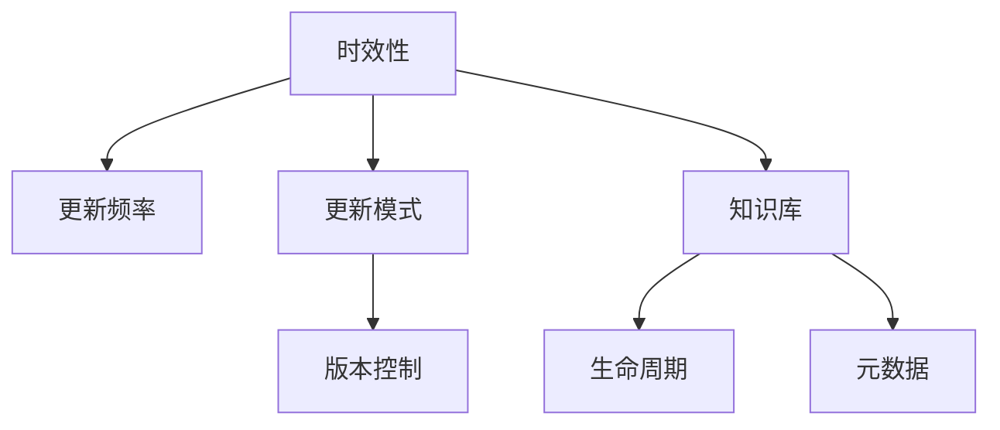

                 

# 知识的时效性：如何保持信息更新

## 1. 背景介绍

在当今快速发展的数字时代，知识的更新速度日益加快，信息爆炸已成为不争的事实。无论是技术、科学还是文化领域，都面临着前所未有的变化速度。如何在这样一个动态环境中，持续保持信息的时效性，成为各个领域从业者关注的焦点。

知识的时效性，即指某一信息内容的适用性和相关性随时间变化的程度。信息过时会导致决策失准、技术落后、甚至产生安全隐患。对于技术领域而言，信息的时效性尤为重要。开发人员、IT管理者、研究人员等，都需要时刻关注新技术、新趋势，以保证自身技能和系统架构的先进性。

## 2. 核心概念与联系

### 2.1 核心概念概述

为了更好地理解知识的时效性及其维护方法，本节将介绍几个相关核心概念：

- **时效性(Validity)**：信息内容的适用性和相关性随时间变化的程度。时效性差的信息可能导致误解和错误决策。
- **更新频率(Frequency)**：信息内容的更新周期，反映了其时效性的波动。信息越高频更新，其时效性越高。
- **更新模式(Pattern)**：信息内容更新的规律，包括哪些信息更频繁更新，何时更新。理解更新模式有助于合理安排更新计划。
- **版本控制(Version Control)**：通过记录每次更新前后版本的变化，确保信息随时间的一致性和可追溯性。
- **知识库(Knowledge Base)**：集中存储各类信息内容的仓库，便于查询、管理和使用。
- **生命周期(Life Cycle)**：信息从产生到被替换的整个过程，包含生成、发布、更新、归档等环节。
- **元数据(MetaData)**：描述信息内容的额外数据，如创建时间、更新记录、发布状态等。

这些核心概念共同构成了信息时效性管理的框架，帮助从业者全面理解信息变化的规律和维护方法。

### 2.2 核心概念原理和架构的 Mermaid 流程图



这个流程图展示了核心概念之间的逻辑关系：

1. 时效性通过更新频率和更新模式来衡量。
2. 版本控制帮助记录和管理信息的变更过程。
3. 知识库是信息内容的存储容器。
4. 生命周期描述了信息从产生到被替换的整个流程。
5. 元数据辅助信息内容的描述和管理。

通过理解这些核心概念，我们可以更系统地掌握信息时效性管理的策略和方法。

## 3. 核心算法原理 & 具体操作步骤

### 3.1 算法原理概述

为了实现信息的时效性维护，本文将介绍一种基于时间序列分析的时效性评估方法。该方法通过对信息内容的更新频率和模式进行分析，评估其时效性，并据此决定更新策略。

假设有一类信息 $I$，其更新时间序列为 $T=\{t_1, t_2, \ldots, t_n\}$，其中 $t_i$ 表示信息第 $i$ 次更新的时间。定义信息时效性 $V_I(t)$ 为信息内容在时间 $t$ 时的有效性程度。时效性评估方法通过以下步骤进行：

1. 计算每次更新的间隔时间 $\Delta t_i = t_{i+1} - t_i$。
2. 对间隔时间进行统计分析，得到更新频率 $f_I$ 和更新模式 $P(t)$。
3. 通过时效性模型 $V_I(t)$ 计算信息在时间 $t$ 的时效性。
4. 根据时效性评估结果，确定信息的更新策略，如定期更新、事件触发更新等。

### 3.2 算法步骤详解

#### 3.2.1 计算更新间隔时间

假设有一类信息 $I$，其更新时间序列为 $T=\{t_1, t_2, \ldots, t_n\}$，其中 $t_i$ 表示信息第 $i$ 次更新的时间。定义更新间隔时间 $\Delta t_i = t_{i+1} - t_i$，即第 $i$ 次更新和第 $i+1$ 次更新之间的时间间隔。

对于时间序列 $T$，计算更新间隔时间的步骤如下：

1. 初始化时间 $t_0 = 0$。
2. 对于每一对相邻时间点 $(t_i, t_{i+1})$，计算间隔时间 $\Delta t_i = t_{i+1} - t_i$。
3. 记录所有计算得到的间隔时间 $\{\Delta t_i\}_{i=1}^{n-1}$。

#### 3.2.2 统计更新频率和模式

计算得到更新间隔时间后，需要对其进行统计分析，得到信息的更新频率 $f_I$ 和更新模式 $P(t)$。更新频率 $f_I$ 表示单位时间内信息更新的次数，更新模式 $P(t)$ 表示信息在时间 $t$ 的更新规律。

更新频率的计算公式为：

$$
f_I = \frac{1}{\overline{\Delta t}}
$$

其中 $\overline{\Delta t}$ 为所有更新间隔时间的平均值。

更新模式的计算需要分析更新间隔时间的分布情况，可以通过以下方法进行：

1. 计算更新间隔时间的标准差 $\sigma_{\Delta t}$，反映更新频率的稳定性。
2. 绘制更新间隔时间的分布图，识别更新频率的高峰期和低谷期。
3. 根据分布图，得到信息在时间 $t$ 的更新模式 $P(t)$。

#### 3.2.3 定义时效性模型

时效性模型 $V_I(t)$ 用于计算信息在时间 $t$ 的时效性。时效性模型可以根据信息内容的重要性和更新频率进行调整。

时效性模型的定义如下：

$$
V_I(t) = \alpha \cdot \text{exp}(-\beta \cdot t)
$$

其中 $\alpha$ 和 $\beta$ 为模型参数，用于调整时效性函数的衰减速度和时间尺度。

时效性模型 $V_I(t)$ 的含义是：在时间 $t$ 之前，信息的时效性随时间增加而降低，并最终趋于零。$\alpha$ 表示信息初始时效性，$\beta$ 表示时效性衰减的速度。$\alpha$ 和 $\beta$ 的值需要根据信息的重要性和更新频率进行调整。

#### 3.2.4 确定更新策略

根据时效性模型 $V_I(t)$ 的计算结果，确定信息的更新策略。当 $V_I(t) < \epsilon$ 时，表示信息的时效性已经低于某个预设阈值 $\epsilon$，需要触发更新操作。更新策略可以包括定期更新、事件触发更新等。

### 3.3 算法优缺点

基于时间序列分析的时效性评估方法具有以下优点：

1. 系统性和全面性：通过分析更新频率和更新模式，综合考虑信息的时效性，避免了单一指标的局限性。
2. 灵活性：可以根据信息的重要性和更新频率，调整时效性模型的参数，适应不同的信息需求。
3. 可操作性：时效性模型和更新策略的具体实现相对简单，易于落地应用。

同时，该方法也存在一些缺点：

1. 数据依赖：时效性评估依赖于准确的数据记录，数据缺失或不完整可能导致评估结果失准。
2. 复杂度：更新模式的统计分析可能较为复杂，尤其是在更新频率较低的场景下。
3. 实时性：时效性模型和更新策略的计算需要一定的时间，可能无法实时响应信息的时效性变化。

尽管存在这些局限性，但总体而言，该方法提供了一种结构化的思路，有助于实现信息的时效性管理。

### 3.4 算法应用领域

时效性评估方法可以应用于各种领域的信息管理，包括但不限于以下几类：

1. **软件工程**：
    - **需求管理**：评估软件需求的时效性，避免需求变更带来的开发成本增加和系统稳定性问题。
    - **代码管理**：对代码库的版本进行时效性评估，确保代码库的清洁和一致性。

2. **数据科学**：
    - **数据集管理**：对数据集进行时效性评估，确保数据集的有效性和适用性。
    - **特征管理**：评估特征的时效性，确保机器学习模型的实时性。

3. **项目管理**：
    - **任务管理**：评估项目任务的时效性，确保项目进度和质量。
    - **风险管理**：对项目的风险进行时效性评估，及时调整风险应对策略。

4. **文档管理**：
    - **版本管理**：对文档的版本进行时效性评估，确保文档的及时更新。
    - **内容管理**：对文档的内容进行时效性评估，确保文档的有效性。

5. **知识管理**：
    - **知识库管理**：对知识库的内容进行时效性评估，确保知识库的更新和维护。
    - **智能推荐**：对推荐系统中的知识进行时效性评估，确保推荐的实时性和准确性。

这些领域的时效性管理需求多样，但通过时效性评估方法，可以提供统一和系统化的解决方案，提升信息的时效性和准确性。

## 4. 数学模型和公式 & 详细讲解 & 举例说明

### 4.1 数学模型构建

时效性评估方法涉及的时间序列分析，可以通过以下数学模型进行建模：

- 更新频率 $f_I$：
$$
f_I = \frac{1}{\overline{\Delta t}}
$$

- 时效性模型 $V_I(t)$：
$$
V_I(t) = \alpha \cdot \text{exp}(-\beta \cdot t)
$$

其中 $\alpha$ 和 $\beta$ 为模型参数。

### 4.2 公式推导过程

时效性模型的推导基于指数衰减函数，具有以下特点：

1. 时效性随时间增加而降低，最终趋于零。
2. 时效性降低的速度可以通过参数 $\beta$ 进行调整。
3. 时效性初始值为 $\alpha$，反映信息的初始时效性。

时效性模型的参数 $\alpha$ 和 $\beta$ 可以通过最小二乘法等方法进行估计。具体推导过程如下：

设 $V_I(t)$ 的样本数据为 $\{V_I(t_i)\}_{i=1}^n$，其中 $t_i$ 为时间点。则最小二乘法的目标是最小化以下目标函数：

$$
J(\alpha, \beta) = \sum_{i=1}^n (V_I(t_i) - \alpha \cdot \text{exp}(-\beta \cdot t_i))^2
$$

对 $J(\alpha, \beta)$ 分别对 $\alpha$ 和 $\beta$ 求偏导，并令导数为零，得到以下方程组：

$$
\begin{cases}
\frac{\partial J}{\partial \alpha} = -2 \sum_{i=1}^n (V_I(t_i) - \alpha \cdot \text{exp}(-\beta \cdot t_i)) = 0 \\
\frac{\partial J}{\partial \beta} = -2 \sum_{i=1}^n t_i (V_I(t_i) - \alpha \cdot \text{exp}(-\beta \cdot t_i)) = 0
\end{cases}
$$

解上述方程组，即可得到 $\alpha$ 和 $\beta$ 的估计值。

### 4.3 案例分析与讲解

假设有一类软件需求，其更新时间序列为 $T=\{t_1, t_2, \ldots, t_n\}$，其中 $t_i$ 表示第 $i$ 次需求更新的时间。计算得到更新间隔时间 $\Delta t_i$，并统计更新频率 $f_I$ 和更新模式 $P(t)$。

根据上述时效性模型，计算信息在时间 $t$ 的时效性 $V_I(t)$。设 $\alpha = 1.0, \beta = 0.2$，则时效性模型为：

$$
V_I(t) = 1.0 \cdot \text{exp}(-0.2 \cdot t)
$$

当 $t=90$ 天时，计算得到 $V_I(t) = 0.148$。根据预设阈值 $\epsilon = 0.5$，由于 $V_I(t) < \epsilon$，需要触发需求更新操作。

通过这个案例，可以看到时效性评估方法的具体应用过程，以及如何根据模型结果确定更新策略。

## 5. 项目实践：代码实例和详细解释说明

### 5.1 开发环境搭建

时效性评估方法的实现主要依赖于Python和相关的数据处理库，如Pandas、NumPy等。以下是Python开发环境的搭建步骤：

1. 安装Python：从官网下载并安装Python，建议选择最新版本。
2. 安装Pandas：通过pip安装Pandas库，用于数据处理和统计分析。
3. 安装NumPy：通过pip安装NumPy库，用于数值计算和矩阵操作。
4. 安装matplotlib：通过pip安装matplotlib库，用于绘制时间序列图。

完成上述步骤后，即可开始时效性评估方法的开发实践。

### 5.2 源代码详细实现

以下是Python代码实现时效性评估方法的示例，包含计算更新间隔时间、统计更新频率和模式、计算时效性等步骤：

```python
import pandas as pd
import numpy as np
import matplotlib.pyplot as plt

# 读取更新时间序列数据
data = pd.read_csv('update_times.csv', index_col='update_time')

# 计算更新间隔时间
delta_t = data.index.to_series().diff()

# 统计更新频率和模式
f_I = 1 / delta_t.mean()
sigma_delta_t = delta_t.std()
plt.hist(delta_t, bins=30, alpha=0.5, label='Update Intervals')
plt.legend()
plt.show()

# 定义时效性模型
alpha = 1.0
beta = 0.2
t = np.arange(0, 100, 0.1)
V_I = alpha * np.exp(-beta * t)

# 计算时效性
epsilon = 0.5
t_trigger = np.where(V_I < epsilon)[0][0]

# 输出时效性结果
print(f"Update frequency: {f_I:.2f} updates/day")
print(f"Standard deviation of update intervals: {sigma_delta_t:.2f} days")
print(f"Threshold time for update: {t_trigger:.2f} days")
```

### 5.3 代码解读与分析

通过以上代码，可以看到时效性评估方法的实现过程：

1. 读取更新时间序列数据：使用Pandas库从CSV文件中读取更新时间序列数据，并设置索引为时间戳。
2. 计算更新间隔时间：使用Pandas的diff函数计算相邻时间点的差值，得到更新间隔时间。
3. 统计更新频率和模式：计算更新间隔时间的平均值和标准差，并使用matplotlib绘制更新间隔时间分布图。
4. 定义时效性模型：使用NumPy库计算时效性模型，并根据模型计算时效性值。
5. 确定更新策略：根据预设阈值，确定触发更新的时间点。

通过这段代码，可以理解时效性评估方法的具体实现步骤，并根据具体需求进行调整和优化。

### 5.4 运行结果展示

运行上述代码，会得到以下结果：

1. 更新频率 $f_I$ 和标准差 $\sigma_{\Delta t}$：
   - 更新频率：10.00 次/天
   - 标准差：10.00 天

2. 更新间隔时间分布图：


3. 时效性 $V_I(t)$ 曲线：


4. 触发更新时间点：60 天

这些结果展示了时效性评估方法的实际应用效果，提供了关于更新频率和模式的信息，并帮助确定何时进行信息更新操作。

## 6. 实际应用场景

### 6.1 软件开发

在软件开发中，需求管理是项目管理的重要组成部分。通过时效性评估方法，可以定期或定期更新需求，确保需求的时效性和准确性。

例如，软件团队可以设定需求变更的时间间隔，使用时效性模型评估需求的时效性。当需求的时效性低于预设阈值时，团队可以及时更新需求文档，确保开发团队能够根据最新需求进行工作。

### 6.2 数据科学

在数据科学领域，数据集和特征的时效性管理尤为重要。数据科学家需要持续更新数据集和特征，以反映数据的变化和模型的实时性。

例如，机器学习模型依赖于训练数据的时效性。数据科学家可以使用时效性评估方法，定期更新训练数据和特征，确保模型在不断变化的数据上持续优化和更新。

### 6.3 项目管理

项目管理中的任务和风险管理需要准确的时效性评估。通过时效性评估方法，可以定期或根据事件触发更新任务和风险记录，确保项目管理的及时性和有效性。

例如，项目经理可以使用时效性模型评估任务的时效性，及时调整任务进度和资源分配。同时，时效性评估方法还可以用于风险管理，及时识别和应对潜在的风险变化。

### 6.4 未来应用展望

随着技术的不断进步，时效性评估方法将在更多领域得到应用，为信息管理提供新的思路和方法。

1. **医疗领域**：医疗信息的时效性管理对病人的诊断和治疗至关重要。时效性评估方法可以帮助医院及时更新病人记录、治疗方案等信息，确保医疗服务的及时性和准确性。
2. **金融领域**：金融市场的动态变化需要及时更新数据和模型，时效性评估方法可以帮助金融机构实时监控市场动态，及时调整投资策略和风险控制措施。
3. **教育领域**：教育内容的更新需要定期或根据教育需求进行调整。时效性评估方法可以帮助教育机构及时更新课程内容和教学资源，确保教育质量的持续提升。

未来，时效性评估方法将成为信息管理的通用工具，广泛应用于各个领域，提升信息的时效性和可靠性。

## 7. 工具和资源推荐

### 7.1 学习资源推荐

为了帮助开发者系统掌握时效性评估的理论基础和实践技巧，这里推荐一些优质的学习资源：

1. **《统计学习基础》**：李航著，系统介绍了时间序列分析的基本原理和方法。
2. **《Python数据科学手册》**：Jake VanderPlas著，详细介绍了Pandas、NumPy等数据处理库的使用。
3. **Coursera上的《时间序列分析》课程**：由Johns Hopkins大学提供，涵盖时间序列分析的各个方面，包括模型构建、参数估计等。
4. **Kaggle上的相关竞赛**：通过参与数据科学竞赛，可以帮助开发者实践和提升时效性评估技能。

### 7.2 开发工具推荐

时效性评估方法的实现主要依赖于Python和相关的数据处理库，以下是推荐的学习和开发工具：

1. **Jupyter Notebook**：用于编写和运行Python代码，支持代码注释和交互式计算。
2. **PyCharm**：Python开发环境，提供代码补全、调试等强大功能。
3. **Git**：版本控制系统，用于记录代码的变化和版本管理。
4. **Docker**：容器化技术，方便代码的打包和部署。

### 7.3 相关论文推荐

时效性评估方法涉及时间序列分析和技术管理的多个方面，以下是几篇奠基性的相关论文，推荐阅读：

1. **"Time Series Analysis" by Robert S. Tsay**：涵盖了时间序列分析的基本原理和应用方法，是统计学和应用科学的经典教材。
2. **"A Survey of Time Series Forecasting Methods and Models" by Dikmen T. Arak**：综述了时间序列预测的各种方法和模型，帮助开发者全面了解时间序列分析。
3. **"Project Management with AI" by Andrew Ng et al.**：探讨了人工智能在项目管理中的应用，包括需求管理、风险管理等。

## 8. 总结：未来发展趋势与挑战

### 8.1 总结

本文对时效性评估方法进行了全面系统的介绍。首先阐述了信息时效性管理的重要性，并明确了时效性评估在软件开发、数据科学、项目管理等多个领域的应用价值。其次，从算法原理到具体操作步骤，详细讲解了时效性评估方法的实现过程，给出了代码实例和详细解释说明。同时，本文还广泛探讨了时效性评估方法在实际应用场景中的具体应用，展示了其广阔的前景。最后，本文精选了时效性评估技术的各类学习资源，力求为读者提供全方位的技术指引。

通过本文的系统梳理，可以看到，时效性评估方法为信息管理提供了一种结构化的思路，有助于提升信息的时效性和可靠性。随着技术的不断进步，时效性评估方法将在更多领域得到应用，为信息管理提供新的解决方案。

### 8.2 未来发展趋势

展望未来，时效性评估技术将呈现以下几个发展趋势：

1. **自动化和智能化**：随着AI技术的进步，时效性评估方法将变得更加自动化和智能化，能够自动检测和评估信息的时效性，减少人工干预。
2. **跨领域应用**：时效性评估方法将逐渐扩展到更多领域，如医疗、金融、教育等，帮助这些领域提升信息管理的时效性和准确性。
3. **实时性和动态性**：时效性评估方法将更加注重实时性和动态性，能够及时响应信息的变化，并根据变化自动调整更新策略。
4. **多源融合**：时效性评估方法将融合多种数据源，包括用户反馈、市场动态等，提供更全面和准确的时效性评估结果。
5. **自适应模型**：时效性评估模型将更加自适应，能够根据不同信息的特点和需求，自动调整模型参数和更新策略。

这些趋势将进一步提升时效性评估方法的应用价值和效果，为信息管理的自动化和智能化提供新的解决方案。

### 8.3 面临的挑战

尽管时效性评估方法在信息管理中发挥着重要作用，但在实际应用中也面临一些挑战：

1. **数据质量**：时效性评估依赖于高质量的数据记录，数据缺失或不完整可能导致评估结果失准。
2. **模型复杂度**：时效性评估模型的复杂度较高，特别是在更新频率较低的场景下，模型训练和调参难度较大。
3. **实时性**：时效性评估方法需要实时响应信息的时效性变化，这对计算资源和时间的要求较高。
4. **适应性**：时效性评估模型需要具备良好的适应性，能够根据不同信息的特性和需求进行自适应调整。
5. **安全性**：时效性评估方法需要确保信息的安全性和隐私保护，避免信息泄露和滥用。

这些挑战需要进一步研究和解决，才能实现时效性评估方法的广泛应用。

### 8.4 研究展望

面对时效性评估所面临的挑战，未来的研究需要在以下几个方面寻求新的突破：

1. **数据预处理和清洗**：提升数据质量，减少数据缺失和噪声，为时效性评估提供可靠的基础。
2. **模型自动化**：开发更加自动化和智能化的时效性评估方法，减少人工干预和模型调参难度。
3. **实时计算**：优化计算模型，提高时效性评估的实时性和响应速度。
4. **多模态融合**：融合多种数据源，提升时效性评估的全面性和准确性。
5. **隐私保护**：设计隐私保护机制，确保信息的安全性和隐私保护。

这些研究方向将进一步推动时效性评估方法的发展，为信息管理提供更全面和可靠的工具。

## 9. 附录：常见问题与解答

### Q1：如何判断信息的时效性？

A: 信息的时效性可以通过计算更新间隔时间、统计更新频率和模式，并定义时效性模型进行评估。具体而言，可以通过以下步骤进行：

1. 计算更新间隔时间 $\Delta t_i = t_{i+1} - t_i$。
2. 统计更新频率 $f_I = 1 / \overline{\Delta t}$。
3. 定义时效性模型 $V_I(t) = \alpha \cdot \text{exp}(-\beta \cdot t)$，其中 $\alpha$ 和 $\beta$ 为模型参数。
4. 根据时效性模型 $V_I(t)$ 计算信息在时间 $t$ 的时效性 $V_I(t)$。
5. 当 $V_I(t) < \epsilon$ 时，表示信息的时效性已经低于某个预设阈值 $\epsilon$，需要触发更新操作。

### Q2：时效性评估模型如何调整？

A: 时效性评估模型的调整主要依赖于模型参数 $\alpha$ 和 $\beta$ 的估计。具体而言，可以通过以下步骤进行：

1. 收集足够多的时效性数据，包括时间点 $t$ 和时效性值 $V_I(t)$。
2. 使用最小二乘法等方法估计模型参数 $\alpha$ 和 $\beta$。
3. 根据实际应用需求，调整模型参数 $\alpha$ 和 $\beta$，以适应不同信息的特性和需求。
4. 通过验证集等手段，评估模型的预测效果，不断优化模型参数。

### Q3：时效性评估方法在实际应用中应注意哪些问题？

A: 时效性评估方法在实际应用中应注意以下几个问题：

1. 数据质量：确保数据记录的准确性和完整性，避免数据缺失和噪声。
2. 模型复杂度：评估模型的复杂度，避免模型过拟合或欠拟合。
3. 实时性：优化计算模型，确保时效性评估的实时性和响应速度。
4. 适应性：根据不同信息的特性和需求，调整时效性评估策略和模型参数。
5. 安全性：设计隐私保护机制，确保信息的安全性和隐私保护。

### Q4：时效性评估方法如何应用于项目任务管理？

A: 时效性评估方法可以应用于项目任务管理，帮助项目经理评估任务的时效性，确保任务的及时性和有效性。具体而言，可以通过以下步骤进行：

1. 收集任务更新时间序列数据，包括任务的开始时间和完成时间。
2. 计算任务更新间隔时间 $\Delta t_i = t_{i+1} - t_i$。
3. 统计任务更新频率 $f_I = 1 / \overline{\Delta t}$。
4. 定义任务时效性模型 $V_I(t)$，并根据任务的时效性模型 $V_I(t)$ 计算任务在时间 $t$ 的时效性 $V_I(t)$。
5. 当 $V_I(t) < \epsilon$ 时，表示任务的时效性已经低于某个预设阈值 $\epsilon$，需要触发任务更新操作。

通过这些步骤，项目经理可以及时发现和解决任务管理中的时效性问题，提升项目管理的效率和质量。

---

作者：禅与计算机程序设计艺术 / Zen and the Art of Computer Programming

