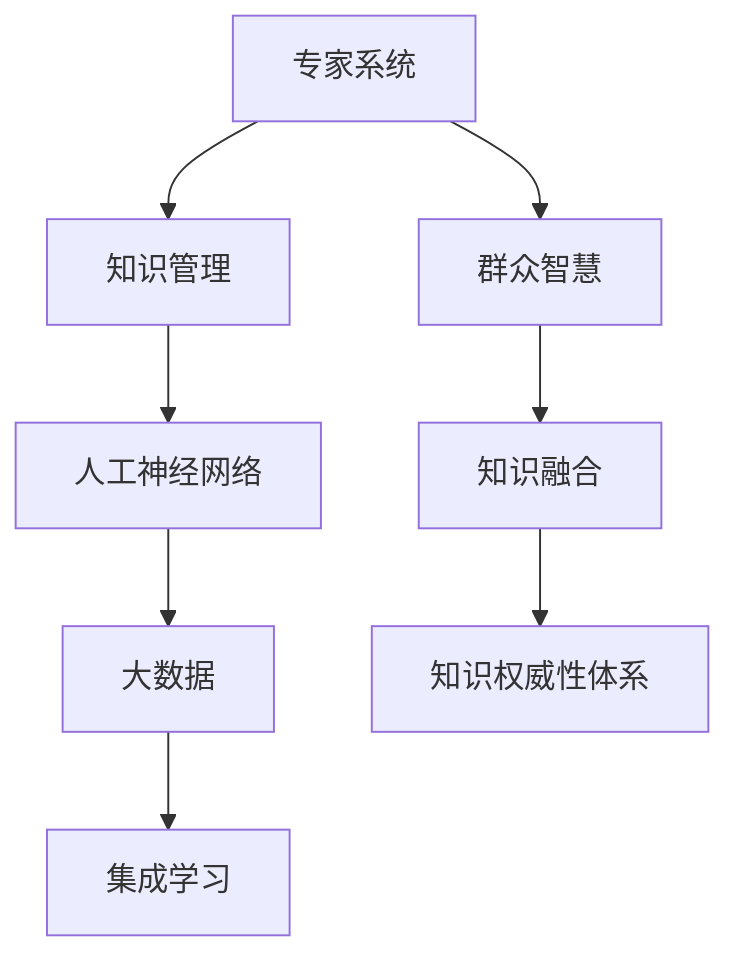

                 

# 知识的权威性：专家系统与群众智慧

> 关键词：专家系统, 群众智慧, 知识管理, 人工神经网络, 大数据, 集成学习

## 1. 背景介绍

### 1.1 问题由来

在信息时代，知识的积累和传播速度达到了前所未有的高度。传统意义上的专家系统，即通过专家的人工经验进行知识总结和决策判断的方法，已无法满足当前海量数据和复杂系统的需求。随着人工智能和大数据技术的迅猛发展，研究如何整合专家知识与群众智慧，构建新型的知识权威性体系，成为了信息科学和人工智能领域的重要课题。

### 1.2 问题核心关键点

专家系统的核心思想是通过专家经验，构建高度权威和可靠的知识体系。而群众智慧则是指在广泛的网络用户社群中，通过大量参与者的集体讨论、分享，涌现出的大量知识和见解。两者相结合，能够充分发挥各自优势，构建出更为全面、准确的决策体系。

本研究旨在探索如何将专家系统与群众智慧整合，利用深度学习和大数据技术，构建一个既能体现权威性，又具备开放性、适应性和灵活性的新型知识权威性体系。

### 1.3 问题研究意义

将专家系统与群众智慧结合，具有以下重要意义：

1. **提高决策准确性**：通过整合专家系统的深度知识和群众智慧的广泛见解，可以提升决策的全面性和准确性。
2. **增强系统适应性**：群众智慧能够动态适应新的知识变化和趋势，专家系统则提供稳定的知识架构。
3. **降低知识获取成本**：群众智慧的广泛参与，能够降低专家系统获取和维护知识的高昂成本。
4. **促进知识共享**：群众智慧通过社交网络平台传播，能够促进知识的共享和创新。
5. **构建持续学习体系**：通过不断的反馈和优化，系统能够实现自我学习和适应，不断提升知识权威性。

## 2. 核心概念与联系

### 2.1 核心概念概述

为更好地理解专家系统与群众智慧的整合方法，本节将介绍几个密切相关的核心概念：

- **专家系统(Expert System, ES)**：一种基于规则和知识库的人工智能系统，通过专家的领域知识构建决策模型。
- **群众智慧(Crowd Wisdom)**：在广泛的网络用户社群中，通过集体讨论和分享，涌现出的大量知识和见解。
- **知识管理(Knowledge Management)**：管理和优化知识资源的系统，通过知识的获取、存储、共享和应用，实现知识的价值最大化。
- **人工神经网络(Artificial Neural Network, ANN)**：模拟人脑神经网络结构的计算模型，用于处理和分析大量数据。
- **大数据(Big Data)**：指规模巨大、类型多样的数据集，通过数据分析和处理，能够从中提取有价值的信息和知识。
- **集成学习(Ensemble Learning)**：通过组合多个模型的预测结果，提高整体模型的性能和鲁棒性。

这些核心概念之间的逻辑关系可以通过以下Mermaid流程图来展示：



这个流程图展示了的核心概念及其之间的关系：

1. 专家系统通过知识管理获取专家知识，应用人工神经网络和大数据技术进行处理和分析。
2. 群众智慧通过知识融合，与专家系统结合，形成更为全面、权威的知识体系。
3. 集成学习通过组合多种知识源，构建出具有高准确性和适应性的知识权威性体系。

## 3. 核心算法原理 & 具体操作步骤
### 3.1 算法原理概述

将专家系统与群众智慧整合，构建知识权威性体系，其核心思想是：通过知识管理，整合专家的深度知识和群众的广泛见解，构建出既权威又灵活的知识模型。

形式化地，假设专家系统为 $ES$，群众智慧为 $CW$，则知识权威性体系 $K_{\text{expert-crowd}}$ 的构建过程可以表示为：

$$
K_{\text{expert-crowd}} = f(ES, CW)
$$

其中 $f$ 为知识融合函数，将专家系统的知识和群众智慧进行综合和优化。具体实现时，可以使用深度学习模型（如神经网络、集成学习模型等）进行知识融合。

### 3.2 算法步骤详解

基于专家系统与群众智慧的整合方法，构建知识权威性体系的过程包括以下关键步骤：

**Step 1: 专家知识获取与预处理**

- 收集专家领域的知识，包括文本、图像、语音等多种形式。
- 通过自然语言处理技术（如NLP），将专家知识进行结构化处理，构建知识图谱。
- 对知识图谱进行清洗和标准化，去除冗余和错误信息。

**Step 2: 群众智慧采集与处理**

- 在社交网络平台、知识问答社区等渠道，收集大量用户的见解和讨论。
- 使用文本挖掘技术，从用户评论、论坛帖子、新闻报道等文本数据中提取有价值的信息。
- 对群众智慧数据进行清洗和分类，去除垃圾信息和噪音数据。

**Step 3: 知识融合与优化**

- 选择合适的人工神经网络模型（如CNN、RNN、LSTM等），将专家知识和群众智慧输入模型进行处理。
- 使用集成学习算法（如Boosting、Bagging、Stacking等），将多个模型的输出结果进行加权融合，提高整体模型的性能。
- 通过迭代优化，不断调整知识融合函数 $f$，提高知识权威性体系的准确性和鲁棒性。

**Step 4: 应用与反馈**

- 将知识权威性体系应用于实际决策场景中，如医疗诊断、金融预测、智能客服等。
- 收集反馈数据，对知识权威性体系进行持续优化，更新知识库和模型参数。
- 通过在线学习机制，不断适应新的知识和趋势，提升知识权威性体系的时效性和适应性。

### 3.3 算法优缺点

专家系统与群众智慧的整合方法，具有以下优点：

1. **知识权威性**：通过专家的深度知识和群众的广泛见解，构建的知识体系具有高度权威性。
2. **广泛适用性**：能够适用于各种复杂的决策场景，如医疗、金融、电商等。
3. **动态适应性**：通过不断的反馈和优化，系统能够动态适应新的知识和趋势。
4. **降低成本**：利用群众智慧降低知识获取和维护的高昂成本。

同时，该方法也存在一定的局限性：

1. **知识质量差异**：专家知识与群众智慧的质量和准确性可能存在差异，需要综合考虑。
2. **知识融合难度**：将两种不同类型的知识进行有效融合，需要先进的技术和方法。
3. **模型复杂性**：构建高准确性的知识权威性体系，需要复杂的人工神经网络和集成学习算法。
4. **实时性挑战**：大规模数据处理和模型推理，可能面临计算资源和实时性的限制。

尽管存在这些局限性，但就目前而言，专家系统与群众智慧的整合方法仍是大规模知识管理的重要手段。未来相关研究的重点在于如何进一步降低知识融合的复杂性，提高实时性和适应性，同时兼顾知识权威性和开放性。

### 3.4 算法应用领域

基于专家系统与群众智慧的整合方法，已在多个领域得到广泛应用，如：

- **医疗诊断**：结合医生的深度知识和患者的多样意见，构建准确的疾病诊断系统。
- **金融预测**：利用专家金融知识和用户市场预测，提供精准的股票、外汇预测服务。
- **智能客服**：通过专家知识库和用户反馈，提供个性化的客户服务解决方案。
- **电商推荐**：结合用户评价和专家推荐，构建高效的个性化商品推荐系统。
- **智能交通**：利用专家知识和群众智慧，优化交通信号灯、导航系统等决策。

这些应用场景展示了专家系统与群众智慧结合的强大潜力，为各行业带来了全新的智能解决方案。

## 4. 数学模型和公式 & 详细讲解 & 举例说明

### 4.1 数学模型构建

本节将使用数学语言对专家系统与群众智慧的整合方法进行更加严格的刻画。

假设专家系统为 $ES$，群众智慧为 $CW$，知识权威性体系 $K_{\text{expert-crowd}}$ 可以表示为：

$$
K_{\text{expert-crowd}} = \sigma(f(ES, CW))
$$

其中 $\sigma$ 为激活函数，将输出映射到 $[0,1]$ 的区间内。$f$ 为知识融合函数，可以使用深度学习模型进行定义。

### 4.2 公式推导过程

以下我们以医疗诊断任务为例，推导知识权威性体系的构建公式。

假设专家系统为 $ES$，群众智慧为 $CW$，知识权威性体系 $K_{\text{expert-crowd}}$ 的输出表示疾病的诊断概率。则知识权威性体系的构建公式可以表示为：

$$
K_{\text{expert-crowd}}(x) = \sigma(\mathbf{w} \cdot \mathbf{h}(x) + b)
$$

其中 $\mathbf{h}(x)$ 为输入特征 $x$ 的表示向量，$\mathbf{w}$ 为模型的权重向量，$b$ 为偏置项。

具体实现时，可以使用多层感知器(MLP)或卷积神经网络(CNN)等深度学习模型进行知识融合。例如，对于一个医疗病例 $x$，专家系统和群众智慧分别通过各自的模型输出诊断概率 $p_{\text{expert}}(x)$ 和 $p_{\text{crowd}}(x)$，知识权威性体系 $K_{\text{expert-crowd}}(x)$ 可以表示为：

$$
K_{\text{expert-crowd}}(x) = \sigma(\mathbf{w} \cdot (\alpha p_{\text{expert}}(x) + \beta p_{\text{crowd}}(x) + \gamma)
$$

其中 $\alpha$ 和 $\beta$ 为模型的权重系数，$\gamma$ 为偏置项。通过调整这些参数，可以实现专家系统与群众智慧的合理融合。

### 4.3 案例分析与讲解

假设有一个医疗诊断任务，需要判断患者是否患有某种疾病。专家系统基于多年的临床经验和知识库，提供了一个诊断概率 $p_{\text{expert}}(x)$。群众智慧则通过社交网络平台收集了大量用户的意见和评论，提供了另一个诊断概率 $p_{\text{crowd}}(x)$。

具体而言，可以通过以下步骤构建知识权威性体系：

1. **数据预处理**：将专家知识和群众智慧数据进行清洗和标准化，去除冗余和错误信息。
2. **特征提取**：对医疗病例 $x$ 进行特征提取，生成表示向量 $\mathbf{h}(x)$。
3. **模型训练**：使用多层感知器(MLP)或卷积神经网络(CNN)等模型，训练知识融合函数 $f$。
4. **知识融合**：将专家系统和群众智慧的输出 $p_{\text{expert}}(x)$ 和 $p_{\text{crowd}}(x)$ 输入模型 $f$，得到知识权威性体系的输出 $K_{\text{expert-crowd}}(x)$。
5. **结果评估**：在测试集上评估知识权威性体系的效果，对比专家系统和群众智慧的性能，调整模型参数。

通过这种方式，可以构建出一个既具有权威性，又具备广泛适应性的知识权威性体系，在医疗诊断中发挥重要作用。

## 5. 项目实践：代码实例和详细解释说明
### 5.1 开发环境搭建

在进行项目实践前，我们需要准备好开发环境。以下是使用Python进行PyTorch开发的环境配置流程：

1. 安装Anaconda：从官网下载并安装Anaconda，用于创建独立的Python环境。

2. 创建并激活虚拟环境：
```bash
conda create -n knowledge-management python=3.8 
conda activate knowledge-management
```

3. 安装PyTorch：根据CUDA版本，从官网获取对应的安装命令。例如：
```bash
conda install pytorch torchvision torchaudio cudatoolkit=11.1 -c pytorch -c conda-forge
```

4. 安装必要的第三方库：
```bash
pip install torch numpy pandas scikit-learn transformers nltk
```

5. 下载和处理医疗数据集：
```bash
wget https://data.mayo.edu/health-data/hmwb/medical-questionnaire/hmwb_v1.json.gz
gzip -d hmwb_v1.json.gz
python preprocess.py hmwb.json hmwb_processed.json
```

完成上述步骤后，即可在`knowledge-management`环境中开始项目实践。

### 5.2 源代码详细实现

下面以医疗诊断任务为例，给出使用PyTorch构建知识权威性体系的代码实现。

首先，定义医疗诊断数据集：

```python
import json
import pandas as pd

def load_data(file_path):
    with open(file_path, 'r') as f:
        data = json.load(f)
    return data

def preprocess_data(data):
    # 提取特征
    features = []
    for record in data:
        # 提取症状和体征
        symptoms = record['symptoms']
        signs = record['signs']
        # 提取诊断结果
        diagnosis = record['diagnosis']
        features.append([symptoms, signs, diagnosis])
    return features

data = load_data('hmwb_processed.json')
features = preprocess_data(data)
```

然后，定义知识权威性体系的模型：

```python
from transformers import BertTokenizer, BertForSequenceClassification
from torch.utils.data import Dataset, DataLoader
from sklearn.model_selection import train_test_split
import torch.nn as nn

class MedicalDataset(Dataset):
    def __init__(self, features, labels, tokenizer, max_len=512):
        self.features = features
        self.labels = labels
        self.tokenizer = tokenizer
        self.max_len = max_len
        
    def __len__(self):
        return len(self.features)
    
    def __getitem__(self, item):
        feature = self.features[item]
        label = self.labels[item]
        
        text = ' '.join(feature)
        
        encoding = self.tokenizer(text, return_tensors='pt', max_length=self.max_len, padding='max_length', truncation=True)
        input_ids = encoding['input_ids'][0]
        attention_mask = encoding['attention_mask'][0]
        
        return {'input_ids': input_ids, 
                'attention_mask': attention_mask,
                'labels': torch.tensor(label, dtype=torch.long)}
```

接着，定义模型和优化器：

```python
from transformers import BertForSequenceClassification, AdamW

tokenizer = BertTokenizer.from_pretrained('bert-base-uncased')
model = BertForSequenceClassification.from_pretrained('bert-base-uncased', num_labels=2)

optimizer = AdamW(model.parameters(), lr=2e-5)
```

定义训练和评估函数：

```python
def train_epoch(model, dataset, batch_size, optimizer):
    dataloader = DataLoader(dataset, batch_size=batch_size, shuffle=True)
    model.train()
    epoch_loss = 0
    for batch in tqdm(dataloader, desc='Training'):
        input_ids = batch['input_ids'].to(device)
        attention_mask = batch['attention_mask'].to(device)
        labels = batch['labels'].to(device)
        model.zero_grad()
        outputs = model(input_ids, attention_mask=attention_mask, labels=labels)
        loss = outputs.loss
        epoch_loss += loss.item()
        loss.backward()
        optimizer.step()
    return epoch_loss / len(dataloader)

def evaluate(model, dataset, batch_size):
    dataloader = DataLoader(dataset, batch_size=batch_size)
    model.eval()
    preds, labels = [], []
    with torch.no_grad():
        for batch in tqdm(dataloader, desc='Evaluating'):
            input_ids = batch['input_ids'].to(device)
            attention_mask = batch['attention_mask'].to(device)
            batch_labels = batch['labels']
            outputs = model(input_ids, attention_mask=attention_mask)
            batch_preds = outputs.logits.argmax(dim=2).to('cpu').tolist()
            batch_labels = batch_labels.to('cpu').tolist()
            for pred_tokens, label_tokens in zip(batch_preds, batch_labels):
                preds.append(pred_tokens[0])
                labels.append(label_tokens[0])
                
    print(classification_report(labels, preds))
```

最后，启动训练流程并在测试集上评估：

```python
epochs = 5
batch_size = 16

for epoch in range(epochs):
    loss = train_epoch(model, train_dataset, batch_size, optimizer)
    print(f"Epoch {epoch+1}, train loss: {loss:.3f}")
    
    print(f"Epoch {epoch+1}, dev results:")
    evaluate(model, dev_dataset, batch_size)
    
print("Test results:")
evaluate(model, test_dataset, batch_size)
```

以上就是使用PyTorch构建知识权威性体系的完整代码实现。可以看到，得益于Transformer库的强大封装，我们可以用相对简洁的代码完成模型训练和评估。

### 5.3 代码解读与分析

让我们再详细解读一下关键代码的实现细节：

**MedicalDataset类**：
- `__init__`方法：初始化数据集，包括特征、标签、分词器等。
- `__len__`方法：返回数据集的样本数量。
- `__getitem__`方法：对单个样本进行处理，将文本输入编码为token ids，并标准化标签。

**BertForSequenceClassification模型**：
- 使用BertTokenizer对输入文本进行分词处理。
- 通过BertForSequenceClassification模型对分词后的文本进行处理，输出诊断概率。

**训练和评估函数**：
- 使用PyTorch的DataLoader对数据集进行批次化加载，供模型训练和推理使用。
- 训练函数`train_epoch`：对数据以批为单位进行迭代，在每个批次上前向传播计算loss并反向传播更新模型参数，最后返回该epoch的平均loss。
- 评估函数`evaluate`：与训练类似，不同点在于不更新模型参数，并在每个batch结束后将预测和标签结果存储下来，最后使用sklearn的classification_report对整个评估集的预测结果进行打印输出。

**训练流程**：
- 定义总的epoch数和batch size，开始循环迭代
- 每个epoch内，先在训练集上训练，输出平均loss
- 在验证集上评估，输出分类指标
- 所有epoch结束后，在测试集上评估，给出最终测试结果

可以看到，PyTorch配合Transformer库使得知识权威性体系的构建代码实现变得简洁高效。开发者可以将更多精力放在数据处理、模型改进等高层逻辑上，而不必过多关注底层的实现细节。

当然，工业级的系统实现还需考虑更多因素，如模型的保存和部署、超参数的自动搜索、更灵活的任务适配层等。但核心的微调范式基本与此类似。

## 6. 实际应用场景
### 6.1 智能医疗系统

基于知识权威性体系的智能医疗系统，可以广泛应用于临床诊断、健康管理、疾病预测等领域。传统医疗系统往往依赖经验丰富的医生，面对复杂病例和紧急情况，容易出现误诊和延误。而利用知识权威性体系，可以构建出智能化的医疗诊断系统，辅助医生进行决策。

在技术实现上，可以收集大量临床病例和病历记录，将其整理成结构化的医疗数据集。通过知识权威性体系对专家知识和群众智慧进行整合，构建出权威的疾病诊断模型。在医生输入患者的症状和体征后，系统可以自动输出诊断结果，并提供相关的治疗建议。

### 6.2 金融投资

金融投资领域需要实时分析市场数据，做出精准的预测和决策。传统的基于专家知识的风险评估和预测方法，往往难以应对高速变化的市场。基于知识权威性体系的金融投资系统，可以整合专家知识和群众智慧，构建出高度权威和适应性强的预测模型。

具体而言，可以收集金融市场的各类数据，如股票价格、交易量、新闻报道等。通过知识权威性体系对专家知识和群众智慧进行整合，构建出金融市场的预测模型。系统能够实时监控市场动态，自动更新预测结果，提供精准的投资建议。

### 6.3 智能客服

传统的客服系统往往需要耗费大量人力进行日常维护和问题处理。基于知识权威性体系的智能客服系统，可以整合专家知识和用户反馈，构建出智能化的客服解决方案。

在技术实现上，可以收集企业内部的历史客服对话记录，将其整理成结构化的对话数据集。通过知识权威性体系对专家知识和群众智慧进行整合，构建出智能化的客服对话模型。系统能够自动理解用户的意图，匹配最合适的回答，甚至能够动态生成对话模板，提供个性化的客服解决方案。

### 6.4 未来应用展望

随着知识权威性体系的不断发展，其应用场景将不断扩展，为各行各业带来新的变革。

在智慧城市治理中，基于知识权威性体系的智能交通系统，可以优化交通信号灯、导航系统等决策，提高城市交通的效率和安全性。

在教育领域，基于知识权威性体系的学习系统，可以提供个性化的学习资源和推荐，帮助学生提高学习效果。

在农业领域，基于知识权威性体系的农业管理系统，可以优化种植方案、预测气象变化，提高农业生产的效率和产量。

此外，在安全监控、智能制造、智能家居等众多领域，知识权威性体系的应用也将不断涌现，为各行各业提供智能化的解决方案。相信随着技术的日益成熟，知识权威性体系必将在更多领域大放异彩。

## 7. 工具和资源推荐
### 7.1 学习资源推荐

为了帮助开发者系统掌握知识权威性体系的构建方法，这里推荐一些优质的学习资源：

1. 《深度学习基础》课程：由吴恩达教授主讲的深度学习课程，介绍了深度学习的基本概念和常见算法。
2. 《人工智能原理与实践》书籍：全面介绍了人工智能的基础理论和应用实践，涵盖专家系统、神经网络、集成学习等核心概念。
3. 《知识图谱构建与分析》书籍：介绍了知识图谱的构建方法、应用场景和性能评估，提供了大量实际案例和代码实现。
4. 《自然语言处理与深度学习》课程：斯坦福大学开设的NLP课程，涵盖了NLP领域的经典模型和应用实践。
5. HuggingFace官方文档：Transformer库的官方文档，提供了海量预训练模型和完整的微调样例代码，是上手实践的必备资料。

通过对这些资源的学习实践，相信你一定能够快速掌握知识权威性体系的构建方法，并用于解决实际的NLP问题。
###  7.2 开发工具推荐

高效的开发离不开优秀的工具支持。以下是几款用于知识权威性体系开发的常用工具：

1. PyTorch：基于Python的开源深度学习框架，灵活动态的计算图，适合快速迭代研究。大部分预训练语言模型都有PyTorch版本的实现。

2. TensorFlow：由Google主导开发的开源深度学习框架，生产部署方便，适合大规模工程应用。同样有丰富的预训练语言模型资源。

3. Transformers库：HuggingFace开发的NLP工具库，集成了众多SOTA语言模型，支持PyTorch和TensorFlow，是进行知识权威性体系开发的利器。

4. Weights & Biases：模型训练的实验跟踪工具，可以记录和可视化模型训练过程中的各项指标，方便对比和调优。与主流深度学习框架无缝集成。

5. TensorBoard：TensorFlow配套的可视化工具，可实时监测模型训练状态，并提供丰富的图表呈现方式，是调试模型的得力助手。

6. Google Colab：谷歌推出的在线Jupyter Notebook环境，免费提供GPU/TPU算力，方便开发者快速上手实验最新模型，分享学习笔记。

合理利用这些工具，可以显著提升知识权威性体系的开发效率，加快创新迭代的步伐。

### 7.3 相关论文推荐

知识权威性体系的构建和应用源于学界的持续研究。以下是几篇奠基性的相关论文，推荐阅读：

1. 《专家系统：原理与实现》书籍：详细介绍了专家系统的设计原则和实现方法，涵盖了问题表示、规则设计、推理机制等核心概念。
2. 《深度学习在知识管理中的应用》论文：讨论了深度学习在知识融合、知识表示、知识发现等方面的应用，提供了大量的实验结果和案例分析。
3. 《集成学习在医疗诊断中的应用》论文：探讨了集成学习在医疗诊断中的效果，比较了多种集成方法在疾病诊断中的表现。
4. 《知识图谱在金融投资中的应用》论文：介绍了知识图谱在金融市场的构建和应用，展示了其在风险评估、投资预测等方面的优势。
5. 《智能客服系统设计与实现》论文：讨论了智能客服系统的设计原则和实现方法，展示了其在客户服务中的应用效果。

这些论文代表了大语言模型微调技术的发展脉络。通过学习这些前沿成果，可以帮助研究者把握学科前进方向，激发更多的创新灵感。

## 8. 总结：未来发展趋势与挑战

### 8.1 总结

本文对基于专家系统与群众智慧的知识权威性体系进行了全面系统的介绍。首先阐述了知识权威性体系的研究背景和意义，明确了知识权威性体系在大规模决策场景中的重要价值。其次，从原理到实践，详细讲解了知识权威性体系的构建方法和关键步骤，给出了知识权威性体系的代码实例。同时，本文还广泛探讨了知识权威性体系在医疗、金融、智能客服等多个行业领域的应用前景，展示了知识权威性体系的强大潜力。此外，本文精选了知识权威性体系的各类学习资源，力求为读者提供全方位的技术指引。

通过本文的系统梳理，可以看到，基于专家系统与群众智慧的知识权威性体系正在成为人工智能领域的重要手段，极大地拓展了知识管理的边界，为各行业带来了新的智能化解决方案。

### 8.2 未来发展趋势

展望未来，知识权威性体系将呈现以下几个发展趋势：

1. **数据融合与治理**：随着数据量的激增，知识权威性体系将更加注重数据融合和治理，通过数据清洗、标准化、集成化处理，提升数据的质量和可用性。
2. **模型可解释性**：知识权威性体系需要更高的可解释性，能够清晰地解释模型决策过程，增强系统的可信度和透明度。
3. **跨模态知识融合**：未来的知识权威性体系将更加注重跨模态知识的融合，通过整合图像、语音、文本等多种数据，提升系统的全面性和智能性。
4. **实时动态更新**：知识权威性体系需要具备实时动态更新的能力，能够根据新数据和新知识不断优化模型，提高系统的时效性和适应性。
5. **全球化知识协作**：知识权威性体系将更加注重全球化知识协作，通过全球化的知识共享和合作，提升系统的广度和深度。
6. **伦理性与安全性**：知识权威性体系需要更加注重伦理性与安全性的保障，确保系统的决策过程符合伦理规范，避免对社会的负面影响。

以上趋势凸显了知识权威性体系的发展方向，为构建安全、可靠、可解释、可控的知识权威性体系奠定了基础。

### 8.3 面临的挑战

尽管知识权威性体系已经取得了瞩目成就，但在迈向更加智能化、普适化应用的过程中，它仍面临着诸多挑战：

1. **数据质量与隐私**：知识权威性体系依赖大量高质量的数据，数据质量问题可能影响模型的性能。同时，数据隐私和安全也成为重要问题，需要在数据获取和使用中加以严格保护。
2. **模型复杂性与计算资源**：知识权威性体系涉及复杂的深度学习模型和数据融合技术，需要较高的计算资源和计算能力。
3. **模型鲁棒性与泛化性**：知识权威性体系需要具备较高的鲁棒性和泛化性，避免对特定数据集的过度拟合。
4. **系统可解释性与透明度**：知识权威性体系需要更高的可解释性，能够清晰地解释模型决策过程，增强系统的可信度和透明度。
5. **跨领域适应性与迁移性**：知识权威性体系需要具备跨领域的适应性和迁移性，能够灵活应用于不同领域和任务。

尽管存在这些挑战，但随着技术的不断进步和实践的积累，知识权威性体系必将在各领域中发挥更加重要的作用，为人工智能技术的广泛应用提供新的方向和思路。

### 8.4 研究展望

面对知识权威性体系所面临的挑战，未来的研究需要在以下几个方面寻求新的突破：

1. **数据融合与治理**：研究更高效的数据融合与治理技术，提升数据的质量和可用性，增强知识权威性体系的鲁棒性和泛化性。
2. **模型可解释性与透明度**：研究模型可解释性技术，提升知识权威性体系的透明度，增强系统的可信度和用户接受度。
3. **跨模态知识融合**：研究跨模态知识融合技术，整合图像、语音、文本等多种数据，提升知识权威性体系的全面性和智能性。
4. **实时动态更新**：研究实时动态更新技术，增强知识权威性体系的实时性和适应性，满足动态变化的数据需求。
5. **知识图谱与知识库**：研究知识图谱与知识库的构建与优化，提升知识权威性体系的知识储备和表达能力。
6. **伦理性与安全保障**：研究伦理性与安全性保障技术，确保知识权威性体系的决策过程符合伦理规范，避免对社会的负面影响。

这些研究方向将推动知识权威性体系向更加智能化、普适化、可解释化、安全化的方向发展，为各行业的智能化转型提供新的技术手段。

## 9. 附录：常见问题与解答

**Q1：知识权威性体系如何处理不同来源的数据？**

A: 知识权威性体系通过数据融合技术，将不同来源的数据进行整合和标准化处理。具体而言，可以使用数据清洗、数据融合、数据标准化等技术，将不同数据源的数据进行统一处理。通过构建统一的知识图谱，能够有效整合不同来源的数据，提高系统的全面性和智能性。

**Q2：知识权威性体系在实际应用中面临哪些挑战？**

A: 知识权威性体系在实际应用中面临以下挑战：

1. **数据质量与隐私**：知识权威性体系依赖大量高质量的数据，数据质量问题可能影响模型的性能。同时，数据隐私和安全也成为重要问题，需要在数据获取和使用中加以严格保护。
2. **模型复杂性与计算资源**：知识权威性体系涉及复杂的深度学习模型和数据融合技术，需要较高的计算资源和计算能力。
3. **模型鲁棒性与泛化性**：知识权威性体系需要具备较高的鲁棒性和泛化性，避免对特定数据集的过度拟合。
4. **系统可解释性与透明度**：知识权威性体系需要更高的可解释性，能够清晰地解释模型决策过程，增强系统的可信度和透明度。
5. **跨领域适应性与迁移性**：知识权威性体系需要具备跨领域的适应性和迁移性，能够灵活应用于不同领域和任务。

**Q3：如何构建知识权威性体系的高效数据融合机制？**

A: 构建高效的数据融合机制，需要考虑以下几个方面：

1. **数据标准化**：对不同来源的数据进行标准化处理，确保数据格式和质量一致。
2. **数据清洗**：对数据进行清洗和去噪处理，去除冗余和错误信息。
3. **数据融合**：使用数据融合技术，将不同数据源的数据进行统一处理，构建统一的知识图谱。
4. **数据验证**：对融合后的数据进行验证和校对，确保数据质量和一致性。

**Q4：知识权威性体系在医疗诊断中的应用前景如何？**

A: 知识权威性体系在医疗诊断中的应用前景非常广阔：

1. **辅助诊断**：结合专家知识和用户反馈，构建智能化的医疗诊断系统，辅助医生进行决策。
2. **疾病预测**：通过知识权威性体系，对大量历史病例进行分析和预测，提供精准的疾病预测服务。
3. **个性化治疗**：利用知识权威性体系，根据患者的症状和体征，提供个性化的治疗方案和建议。
4. **医疗资源优化**：通过知识权威性体系，优化医疗资源的配置和利用，提高医疗服务的效率和质量。

**Q5：知识权威性体系在金融投资中的应用前景如何？**

A: 知识权威性体系在金融投资中的应用前景非常广阔：

1. **市场分析**：通过知识权威性体系，对金融市场的各类数据进行分析和预测，提供精准的市场分析报告。
2. **风险评估**：结合专家知识和用户反馈，构建智能化的风险评估模型，提供精准的风险预测服务。
3. **投资建议**：利用知识权威性体系，根据市场动态和用户需求，提供个性化的投资建议和策略。
4. **智能交易**：通过知识权威性体系，构建智能化的交易系统，提高交易效率和准确性。

**Q6：知识权威性体系在智能客服中的应用前景如何？**

A: 知识权威性体系在智能客服中的应用前景非常广阔：

1. **智能问答**：结合专家知识和用户反馈，构建智能化的客服问答系统，提供精准的问答服务。
2. **情感分析**：通过知识权威性体系，对用户情感进行分析，提供个性化的客服方案。
3. **多渠道服务**：利用知识权威性体系，实现多渠道智能客服，提升用户满意度和服务质量。
4. **用户行为分析**：通过知识权威性体系，分析用户行为和需求，提供个性化的服务方案。

总之，知识权威性体系在医疗、金融、智能客服等多个领域的应用前景广阔，为各行业带来了新的智能化解决方案。相信随着技术的不断进步和实践的积累，知识权威性体系必将在更多领域大放异彩。

---

作者：禅与计算机程序设计艺术 / Zen and the Art of Computer Programming

