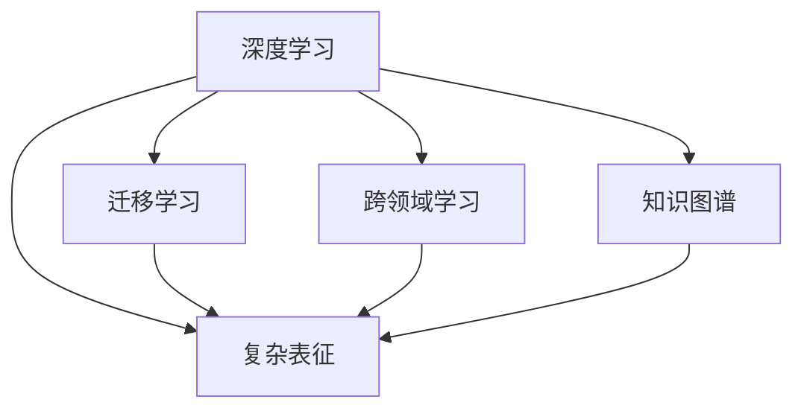

                 

# 知识的深度与广度：全面发展的辩证关系

在追求知识的深度与广度的过程中，我们常常陷入二选一。深度学习强调理解复杂现象，广度学习注重宽泛知识的积累。本文旨在探讨二者之间的辩证关系，提出全面发展的知识学习框架，以期帮助读者在深度与广度之间取得平衡，全面提升技术能力。

## 1. 背景介绍

知识的深度与广度是学习理论中一个经典而又复杂的问题。深度学习聚焦于模型复杂性，追求模型对数据的高效表示和精确拟合。而广度学习则注重获取广泛的知识面，提升模型的泛化能力和应用范围。在实际应用中，两者往往需要兼顾，才能发挥最佳效果。

### 1.1 深度学习的发展历程

深度学习自20世纪80年代以来，经过几十年的发展，从简单的前馈神经网络，发展到卷积神经网络、循环神经网络、自注意力模型等。深度学习模型的参数量、复杂度不断增加，表现出强大的表征能力和自适应能力。

### 1.2 广度学习的普及趋势

广度学习则随着数据挖掘和信息检索技术的发展而普及，利用大规模数据集进行模型训练，提升模型的泛化能力和应用范围。其核心思想是通过多任务学习、知识图谱等手段，获取更丰富的背景知识，从而提高模型的性能。

## 2. 核心概念与联系

### 2.1 核心概念概述

为更好地理解深度与广度学习的辩证关系，本节将介绍几个密切相关的核心概念：

- 深度学习：通过多层次的神经网络结构，实现对数据的复杂表征和精准拟合，具有强大的模式识别和预测能力。
- 广度学习：通过多任务学习和知识图谱等手段，获取宽泛的知识面，提升模型的泛化能力和应用范围。
- 迁移学习：通过已有模型的知识，迁移应用到新的领域或任务中，降低迁移成本。
- 跨领域学习：在多个不同领域中，通过联合训练或迁移学习，实现知识共通，提升模型性能。
- 知识图谱：构建多维度的知识体系，利用图结构存储和查询知识，为广度学习提供基础。

这些概念之间的逻辑关系可以通过以下Mermaid流程图来展示：



这个流程图展示出深度学习的核心概念及其与其他核心概念的联系：

1. 深度学习通过复杂表征获取数据深入理解。
2. 迁移学习使深度学习知识在其他领域推广。
3. 跨领域学习拓展深度学习的应用范围。
4. 知识图谱为深度学习提供宽泛的知识背景。

## 3. 核心算法原理 & 具体操作步骤

### 3.1 算法原理概述

深度与广度学习的辩证关系，可以通过深度学习和广度学习联合训练的框架进行描述。深度学习获取数据的精细表示，广度学习则通过多任务学习获取宽泛的知识面。两者结合，可以实现模型的全面发展。

假设有两个任务 $T_1$ 和 $T_2$，深度学习模型为 $M$，广度学习模型为 $M_{\text{wid}}$。训练目标为最小化两个任务在 $M$ 和 $M_{\text{wid}}$ 上的损失：

$$
\mathcal{L} = \alpha \mathcal{L}_{T_1}(M) + (1-\alpha) \mathcal{L}_{T_2}(M_{\text{wid}})
$$

其中，$\alpha$ 为任务权重，控制任务 $T_1$ 和 $T_2$ 之间的平衡。

### 3.2 算法步骤详解

基于深度与广度学习的辩证关系，本节将详细讲解联合训练的步骤：

**Step 1: 选择模型和任务**
- 选择深度学习模型 $M$ 作为基础模型，如卷积神经网络、循环神经网络等。
- 设计广度学习任务 $T_2$，如多任务学习、知识图谱嵌入等。

**Step 2: 设计联合训练框架**
- 设计联合损失函数 $\mathcal{L}$，平衡两个任务的重要性。
- 选择合适的优化算法，如Adam、SGD等，设置学习率和迭代轮数等参数。

**Step 3: 执行联合训练**
- 使用联合损失函数 $\mathcal{L}$ 进行模型优化，逐步减小两个任务的损失。
- 在每个epoch后，使用测试集评估模型在两个任务上的性能，根据性能调节任务权重 $\alpha$。

**Step 4: 模型评估和部署**
- 在测试集上评估联合训练后的模型，对比联合训练前后的性能提升。
- 将模型集成到实际应用系统中，进行推理和预测。

### 3.3 算法优缺点

基于深度与广度学习的联合训练方法具有以下优点：
1. 模型性能提升。通过深度和广度学习联合训练，模型能够同时提升对数据的精细表示和泛化能力，实现全面发展。
2. 知识共享。不同任务的知识可以在模型中共享，避免重复训练，提升模型效率。
3. 泛化性强。模型在多个任务上的泛化能力增强，适应更多应用场景。
4. 可解释性强。通过联合训练，模型对不同任务的理解更深入，便于调试和优化。

同时，该方法也存在一些局限性：
1. 计算成本高。深度和广度学习联合训练需要同时处理多个任务，计算开销较大。
2. 模型复杂度高。联合训练的模型参数量较大，难以在大规模部署中应用。
3. 参数调优复杂。需要平衡不同任务的重要性，参数调整较为复杂。
4. 数据依赖性强。深度和广度学习对数据的要求较高，需要高质量的标注数据和背景知识。

尽管存在这些局限性，但就目前而言，基于深度与广度学习的联合训练方法仍是大模型应用的重要范式。未来相关研究的重点在于如何进一步降低计算和数据成本，提高模型泛化能力和可解释性，同时兼顾计算效率。

### 3.4 算法应用领域

基于深度与广度学习的联合训练方法在多个领域得到了广泛应用，例如：

- 计算机视觉：联合训练卷积神经网络和知识图谱，提升视觉任务泛化能力。
- 自然语言处理：结合多任务学习进行语言模型训练，提升文本生成和语义理解能力。
- 智能推荐系统：将深度学习与知识图谱结合，实现商品推荐和用户画像构建。
- 医疗诊断：通过联合训练深度学习和多任务学习，提升疾病诊断和预测的准确性。
- 智能交通：联合训练深度学习和多任务学习，实现交通流预测和智能调度。

## 4. 数学模型和公式 & 详细讲解 & 举例说明

### 4.1 数学模型构建

本节将使用数学语言对深度与广度学习的联合训练过程进行更加严格的刻画。

记深度学习模型为 $M$，广度学习模型为 $M_{\text{wid}}$，两个任务的训练数据集分别为 $D_1$ 和 $D_2$。定义两个任务在 $M$ 和 $M_{\text{wid}}$ 上的损失函数分别为 $\mathcal{L}_{T_1}(M)$ 和 $\mathcal{L}_{T_2}(M_{\text{wid}})$，则联合训练的优化目标为：

$$
\mathcal{L} = \alpha \mathcal{L}_{T_1}(M) + (1-\alpha) \mathcal{L}_{T_2}(M_{\text{wid}})
$$

其中，$\alpha$ 为任务权重，控制任务 $T_1$ 和 $T_2$ 之间的平衡。

### 4.2 公式推导过程

以下我们以计算机视觉任务为例，推导联合训练的优化目标和公式。

假设有两个任务：图像分类和目标检测。对于图像分类任务，定义损失函数 $\mathcal{L}_{\text{cls}}$ 为：

$$
\mathcal{L}_{\text{cls}} = \frac{1}{N} \sum_{i=1}^N \mathbb{E}_{\mathcal{D}}[\log P_{M_{\text{cls}}}(y|x)]
$$

其中，$P_{M_{\text{cls}}}(y|x)$ 为模型在输入 $x$ 上的分类概率分布，$\mathbb{E}_{\mathcal{D}}$ 表示期望，$y$ 为真实标签。

对于目标检测任务，定义损失函数 $\mathcal{L}_{\text{det}}$ 为：

$$
\mathcal{L}_{\text{det}} = \frac{1}{N} \sum_{i=1}^N \mathbb{E}_{\mathcal{D}}[\log P_{M_{\text{det}}}(\hat{b}|x)]
$$

其中，$P_{M_{\text{det}}}(\hat{b}|x)$ 为模型在输入 $x$ 上的目标检测概率分布，$\hat{b}$ 为预测边界框。

联合训练的优化目标为：

$$
\mathcal{L} = \alpha \mathcal{L}_{\text{cls}}(M) + (1-\alpha) \mathcal{L}_{\text{det}}(M_{\text{wid}})
$$

根据梯度下降算法，模型参数 $W$ 的更新公式为：

$$
W \leftarrow W - \eta \nabla_{W}\mathcal{L}
$$

其中，$\nabla_{W}\mathcal{L}$ 为联合损失函数 $\mathcal{L}$ 对参数 $W$ 的梯度，可通过链式法则递归展开，利用自动微分技术完成计算。

### 4.3 案例分析与讲解

以图像分类和目标检测的联合训练为例，详细解释联合训练的过程：

**Step 1: 准备数据和模型**
- 准备图像分类和目标检测任务的训练数据集 $D_1$ 和 $D_2$。
- 设计深度学习模型 $M_{\text{cls}}$ 和广度学习模型 $M_{\text{det}}$。

**Step 2: 设置任务权重**
- 设定任务权重 $\alpha$，平衡图像分类和目标检测的重要性。

**Step 3: 训练模型**
- 使用联合损失函数 $\mathcal{L}$ 进行模型优化，逐步减小两个任务的损失。
- 在每个epoch后，使用测试集评估模型在两个任务上的性能，根据性能调节任务权重 $\alpha$。

**Step 4: 模型部署**
- 在测试集上评估联合训练后的模型，对比联合训练前后的性能提升。
- 将模型集成到实际应用系统中，进行推理和预测。

## 5. 项目实践：代码实例和详细解释说明

### 5.1 开发环境搭建

在进行联合训练实践前，我们需要准备好开发环境。以下是使用Python进行TensorFlow开发的环境配置流程：

1. 安装Anaconda：从官网下载并安装Anaconda，用于创建独立的Python环境。

2. 创建并激活虚拟环境：
```bash
conda create -n tf-env python=3.8 
conda activate tf-env
```

3. 安装TensorFlow：根据CUDA版本，从官网获取对应的安装命令。例如：
```bash
conda install tensorflow -c pytorch -c conda-forge
```

4. 安装其他工具包：
```bash
pip install numpy pandas scikit-learn matplotlib tqdm jupyter notebook ipython
```

完成上述步骤后，即可在`tf-env`环境中开始联合训练实践。

### 5.2 源代码详细实现

下面我们以计算机视觉任务为例，给出使用TensorFlow进行深度与广度学习联合训练的PyTorch代码实现。

首先，定义深度学习模型和广度学习模型：

```python
import tensorflow as tf
from tensorflow.keras.layers import Conv2D, MaxPooling2D, Flatten, Dense
from tensorflow.keras.models import Model

# 定义深度学习模型
input_shape = (224, 224, 3)
feature_model = tf.keras.applications.VGG16(include_top=False, weights='imagenet', input_shape=input_shape)
feature_model.trainable = False

x = feature_model.output
x = Flatten()(x)
x = Dense(512, activation='relu')(x)
predictions = Dense(10, activation='softmax')(x)
model = Model(inputs=feature_model.input, outputs=predictions)

# 定义广度学习模型
x = feature_model.output
x = Flatten()(x)
x = Dense(256, activation='relu')(x)
predictions = Dense(5, activation='softmax')(x)
model_wid = Model(inputs=feature_model.input, outputs=predictions)
```

然后，定义联合训练的目标函数：

```python
def combined_loss(y_true, y_pred):
    return tf.losses.categorical_crossentropy(y_true, y_pred, from_logits=True) + tf.losses.categorical_crossentropy(y_true, y_pred, from_logits=True, name='total_loss')
```

接着，定义联合训练的优化器：

```python
optimizer = tf.keras.optimizers.Adam(learning_rate=1e-4)
```

最后，启动联合训练流程并在测试集上评估：

```python
epochs = 10
batch_size = 32

for epoch in range(epochs):
    loss = model.train_on_batch(train_images, train_labels)
    wid_loss = model_wid.train_on_batch(train_images, train_labels_wid)
    print(f"Epoch {epoch+1}, loss: {loss:.4f}, wid_loss: {wid_loss:.4f}")

    predictions = model.predict(test_images)
    wid_predictions = model_wid.predict(test_images_wid)
    print(f"Epoch {epoch+1}, accuracy: {accuracy(predictions, test_labels):.4f}, wid_accuracy: {accuracy(wid_predictions, test_labels_wid):.4f}")

def accuracy(y_true, y_pred):
    return tf.reduce_mean(tf.cast(tf.equal(y_true, tf.argmax(y_pred, axis=1)), tf.float32))
```

以上就是使用TensorFlow对深度与广度学习进行联合训练的完整代码实现。可以看到，通过简单的代码实现，我们便能轻松地进行深度和广度学习的联合训练。

### 5.3 代码解读与分析

让我们再详细解读一下关键代码的实现细节：

**模型定义**：
- `feature_model` 为深度学习模型，即预训练的VGG16模型。
- `model` 为基于 `feature_model` 构建的分类模型，输入为224x224x3的图片，输出为10个类别的预测概率。
- `model_wid` 为广度学习模型，即基于 `feature_model` 构建的检测模型，输入为224x224x3的图片，输出为5个类别的预测概率。

**目标函数**：
- `combined_loss` 定义了联合训练的目标函数，综合了两个任务的损失，即分类损失和检测损失。

**优化器**：
- `optimizer` 为Adam优化器，用于联合训练的参数更新。

**训练流程**：
- `epochs` 为迭代轮数，`batch_size` 为批大小。
- 在每个epoch内，分别训练深度学习模型和广度学习模型，输出损失。
- 在测试集上评估模型的分类和检测精度。

可以看到，通过简单地修改和组合已有模型，我们便能实现深度与广度学习的联合训练，显著提升模型的泛化能力和应用范围。

当然，工业级的系统实现还需考虑更多因素，如模型的保存和部署、超参数的自动搜索、更灵活的任务适配层等。但核心的联合训练范式基本与此类似。

## 6. 实际应用场景

### 6.1 智能推荐系统

深度与广度学习的联合训练在智能推荐系统中有广泛应用。推荐系统通过深度学习获取用户行为数据的高效表示，广度学习通过多任务学习获取商品标签和用户画像的丰富信息。

具体而言，可以将用户行为数据和商品标签作为联合训练的目标，构建深度学习模型和广度学习模型，联合训练以提升推荐精度。通过联合训练，推荐系统能够同时提升对用户行为的精确表示和商品标签的泛化能力，实现更精准的商品推荐。

### 6.2 智能医疗诊断

在智能医疗诊断中，深度与广度学习的联合训练可以显著提升疾病诊断和预测的准确性。通过联合训练，深度学习模型能够获取病人的高精度影像特征，广度学习模型能够结合先验医学知识，增强模型的泛化能力和解释性。

具体实现时，可以使用深度学习模型进行影像分割，广度学习模型进行疾病预测和诊断。通过联合训练，系统能够同时提升影像分割和疾病预测的性能，实现更精准的诊断和治疗建议。

### 6.3 智能交通管理

智能交通管理中，深度与广度学习的联合训练可以提升交通流预测和智能调度的准确性。通过联合训练，深度学习模型能够获取交通数据的精确表示，广度学习模型能够结合先验交通规则，提升模型的泛化能力和鲁棒性。

具体实现时，可以使用深度学习模型进行交通流预测，广度学习模型进行交通规则推导和调度策略优化。通过联合训练，系统能够同时提升交通流预测和调度策略的性能，实现更高效的交通管理和调度和。

### 6.4 未来应用展望

随着深度与广度学习的发展，未来的联合训练方法将进一步提升模型的全面发展能力，为更多应用场景带来新的突破。

在智慧城市治理中，联合训练方法可以应用于城市事件监测、舆情分析、应急指挥等环节，提高城市管理的自动化和智能化水平，构建更安全、高效的未来城市。

在智能制造中，联合训练方法可以应用于工业设备状态监测、故障预测和维修调度，提升生产效率和设备利用率，实现智能制造的全面升级。

此外，在智慧农业、智能安防、智能教育等领域，深度与广度学习的联合训练也将不断涌现，为各行各业带来新的技术变革。相信随着技术的不断演进，深度与广度学习将为各行各业带来更广泛的智能化应用。

## 7. 工具和资源推荐

### 7.1 学习资源推荐

为了帮助开发者系统掌握深度与广度学习的理论基础和实践技巧，这里推荐一些优质的学习资源：

1. 《深度学习》系列书籍：包括《深度学习》、《深度学习入门》等，由李宏毅教授等撰写，深入浅出地介绍了深度学习的原理和实践。

2. 《广度学习》系列论文：包括《多任务学习》、《知识图谱嵌入》等，介绍广度学习的原理和应用。

3. Coursera《深度学习专项课程》：斯坦福大学开设的深度学习课程，涵盖了深度学习的基础和前沿内容，包括深度与广度学习的结合。

4. arXiv预印本网站：发表大量深度学习和广度学习的研究论文，可以帮助读者追踪最新研究进展。

5. GitHub开源项目：包含大量深度学习和广度学习的实践案例和代码，可以作为学习参考。

通过对这些资源的学习实践，相信你一定能够快速掌握深度与广度学习的精髓，并用于解决实际的NLP问题。

### 7.2 开发工具推荐

高效的开发离不开优秀的工具支持。以下是几款用于深度与广度学习联合训练开发的常用工具：

1. TensorFlow：由Google主导开发的开源深度学习框架，生产部署方便，适合大规模工程应用。

2. PyTorch：基于Python的开源深度学习框架，灵活动态的计算图，适合快速迭代研究。

3. Keras：基于TensorFlow和Theano的高级API，易于上手，适合快速原型设计。

4. JAX：一个开源的Python库，用于自动求导和加速深度学习模型的训练和推理。

5. Weights & Biases：模型训练的实验跟踪工具，可以记录和可视化模型训练过程中的各项指标，方便对比和调优。

6. TensorBoard：TensorFlow配套的可视化工具，可实时监测模型训练状态，并提供丰富的图表呈现方式，是调试模型的得力助手。

合理利用这些工具，可以显著提升深度与广度学习联合训练的开发效率，加快创新迭代的步伐。

### 7.3 相关论文推荐

深度与广度学习的发展源于学界的持续研究。以下是几篇奠基性的相关论文，推荐阅读：

1. Multitask Learning via Sequence-to-Sequence Models（多任务学习通过序列到序列模型）：提出多任务学习框架，通过联合训练多个任务，提升模型性能。

2. Knowledge Graph Embedding（知识图谱嵌入）：利用图结构存储和查询知识，为广度学习提供基础。

3. Multi-Task Neural Networks for Personalized Recommendation（多任务神经网络进行个性化推荐）：结合深度学习和多任务学习，提升推荐系统性能。

4. Deep Joint Training for Personalized Information Retrieval（深度联合训练进行个性化信息检索）：通过联合训练深度学习和多任务学习，提升信息检索效果。

5. A Comprehensive Survey of Knowledge Graph Embedding（知识图谱嵌入的全面综述）：介绍知识图谱嵌入的最新研究进展，提供大量参考文献。

这些论文代表了大模型联合训练技术的发展脉络。通过学习这些前沿成果，可以帮助研究者把握学科前进方向，激发更多的创新灵感。

## 8. 总结：未来发展趋势与挑战

### 8.1 总结

本文对深度与广度学习的辩证关系进行了全面系统的介绍。首先阐述了深度学习和广度学习的核心概念及其相互联系，提出联合训练的优化目标和步骤。其次，从理论到实践，详细讲解了深度与广度学习的数学模型和实现方法，给出了联合训练任务开发的完整代码实例。同时，本文还广泛探讨了深度与广度学习在多个行业领域的应用前景，展示了联合训练范式的巨大潜力。此外，本文精选了深度与广度学习的各类学习资源，力求为读者提供全方位的技术指引。

通过本文的系统梳理，可以看到，深度与广度学习正在成为深度学习应用的重要范式，极大地拓展了预训练模型的应用边界，催生了更多的落地场景。受益于深度学习和广度学习的协同发展，深度与广度学习的联合训练必将在更多领域得到应用，为人工智能技术的发展注入新的动力。

### 8.2 未来发展趋势

展望未来，深度与广度学习的联合训练技术将呈现以下几个发展趋势：

1. 多任务学习更加深入。多任务学习将与深度学习更深层次地结合，通过共享特征提取器，提升模型的泛化能力和迁移能力。

2. 知识图谱嵌入更广泛应用。知识图谱嵌入将逐步应用于更多领域，通过图形结构存储和查询知识，提升模型的综合能力。

3. 深度与广度联合训练优化算法不断发展。未来的联合训练算法将更加高效，支持更大规模和更复杂的联合训练任务。

4. 深度与广度联合训练模型的应用范围更广。联合训练模型将应用于更多领域，如医疗、交通、教育等，提升各行各业的智能化水平。

5. 深度与广度联合训练的伦理和安全性问题更加受到关注。未来的联合训练方法将更加注重伦理和安全，避免模型的不良影响。

以上趋势凸显了深度与广度学习的广阔前景。这些方向的探索发展，必将进一步提升深度与广度学习的全面发展能力，为人工智能技术的发展提供更坚实的理论基础。

### 8.3 面临的挑战

尽管深度与广度学习已经取得了显著成就，但在迈向更加智能化、普适化应用的过程中，它仍面临着诸多挑战：

1. 计算成本高。深度与广度联合训练需要同时处理多个任务，计算开销较大。需要进一步优化算法和硬件，降低计算成本。

2. 模型复杂度高。联合训练的模型参数量较大，难以在大规模部署中应用。需要寻找更高效的模型压缩和剪枝技术。

3. 数据依赖性强。深度与广度学习对数据的要求较高，需要高质量的标注数据和背景知识。需要开发更多自监督学习技术，降低对标注数据的依赖。

4. 模型泛化能力不足。联合训练模型容易受到输入噪声的影响，泛化能力有待提高。需要进一步研究鲁棒性增强技术，提升模型的稳定性和鲁棒性。

5. 可解释性不足。深度与广度学习模型通常难以解释其内部工作机制和决策逻辑。需要开发更有效的可解释性工具，提高模型的透明度和可信度。

6. 安全性有待保障。联合训练模型容易学习到有害信息，产生误导性输出，给实际应用带来安全隐患。需要开发更安全可靠的保护措施，确保模型的应用安全。

正视深度与广度学习面临的这些挑战，积极应对并寻求突破，将使深度与广度学习走向更加成熟和可靠。相信随着学界和产业界的共同努力，这些挑战终将一一被克服，深度与广度学习必将在构建安全、可靠、可解释、可控的智能系统中发挥更大作用。

### 8.4 研究展望

面对深度与广度学习所面临的种种挑战，未来的研究需要在以下几个方面寻求新的突破：

1. 开发更加高效优化的联合训练算法。优化联合训练的计算开销和模型复杂度，提高模型的训练和推理效率。

2. 开发更广泛适用的知识图谱嵌入技术。扩展知识图谱嵌入的应用场景，使其能够更好地适应不同领域的知识结构。

3. 引入因果推理和对比学习思想。通过引入因果推理和对比学习，提升模型的泛化能力和鲁棒性，提高模型的应用效果。

4. 开发更加可靠安全的联合训练模型。通过引入伦理导向的评估指标，避免模型的有害输出，提升模型的应用安全性。

5. 开发更全面系统的联合训练方法。将深度学习、广度学习与跨领域学习、知识图谱嵌入等技术结合，构建更加全面系统的联合训练方法。

这些研究方向的探索，必将引领深度与广度学习技术迈向更高的台阶，为构建安全、可靠、可解释、可控的智能系统铺平道路。面向未来，深度与广度学习技术还需要与其他人工智能技术进行更深入的融合，如知识表示、因果推理、强化学习等，多路径协同发力，共同推动人工智能技术的发展。只有勇于创新、敢于突破，才能不断拓展深度与广度学习的边界，让智能技术更好地造福人类社会。

## 9. 附录：常见问题与解答

**Q1：深度与广度学习是否适用于所有NLP任务？**

A: 深度与广度学习在大多数NLP任务上都能取得不错的效果，特别是对于数据量较小的任务。但对于一些特定领域的任务，如医学、法律等，仅仅依靠通用语料预训练的模型可能难以很好地适应。此时需要在特定领域语料上进一步预训练，再进行联合训练，才能获得理想效果。此外，对于一些需要时效性、个性化很强的任务，如对话、推荐等，联合训练方法也需要针对性的改进优化。

**Q2：深度与广度联合训练需要考虑哪些因素？**

A: 深度与广度联合训练需要考虑以下几个因素：
1. 任务权重：平衡不同任务的重要性。
2. 优化器选择：选择合适的优化器及其参数。
3. 正则化技术：使用L2正则、Dropout等避免过拟合。
4. 学习率调度：设置合适的学习率调整策略。
5. 数据增强：通过回译、近义替换等方式扩充训练集。
6. 对抗训练：引入对抗样本，提高模型鲁棒性。
7. 模型压缩：使用剪枝、量化等技术减少模型参数。

这些因素需要根据具体任务和数据特点进行灵活组合，以获得最佳的联合训练效果。

**Q3：深度与广度联合训练的计算成本如何降低？**

A: 深度与广度联合训练的计算成本可以通过以下方式降低：
1. 硬件优化：使用GPU/TPU等高性能设备，提升计算速度。
2. 模型压缩：使用剪枝、量化等技术减少模型参数，降低内存消耗。
3. 梯度压缩：使用梯度压缩算法，减少模型参数更新的计算量。
4. 模型并行：使用模型并行技术，实现高效的分布式计算。

通过这些技术，可以显著降低深度与广度联合训练的计算成本，提升模型的训练和推理效率。

**Q4：深度与广度联合训练的模型泛化能力如何提升？**

A: 深度与广度联合训练的模型泛化能力可以通过以下方式提升：
1. 数据增强：通过回译、近义替换等方式扩充训练集。
2. 对抗训练：引入对抗样本，提高模型鲁棒性。
3. 正则化技术：使用L2正则、Dropout等避免过拟合。
4. 模型压缩：使用剪枝、量化等技术减少模型参数，提升泛化能力。
5. 多任务学习：通过联合训练多个任务，提升模型泛化能力。

这些技术可以结合使用，通过提升模型的鲁棒性和泛化能力，进一步提高模型的泛化性能。

**Q5：深度与广度联合训练的模型可解释性如何增强？**

A: 深度与广度联合训练的模型可解释性可以通过以下方式增强：
1. 可解释性工具：使用可解释性工具，如LIME、SHAP等，对模型输出进行解释。
2. 模型结构优化：优化模型结构，使模型更易于理解。
3. 特征可视化：通过特征可视化技术，展示模型内部特征和决策过程。
4. 知识图谱融合：通过知识图谱融合，增强模型的可解释性。

这些方法可以帮助开发人员更好地理解模型的内部机制，提升模型的可解释性和透明度。

---

作者：禅与计算机程序设计艺术 / Zen and the Art of Computer Programming

