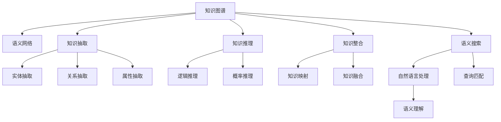

                 

# 知识的结构化：提升理解效率的方法

> 关键词：知识图谱, 语义网络, 知识抽取, 知识推理, 知识整合, 语义搜索, 自然语言处理, 深度学习, 认知科学

## 1. 背景介绍

### 1.1 问题由来
在信息爆炸的今天，知识获取和应用变得越来越复杂。如何在海量数据中快速高效地获取和理解知识，是现代信息时代的重要课题。传统的文档检索、标签分类等方式，虽然能够提供一部分信息，但往往难以深度挖掘知识的关联性和层次性，无法满足深层次的认知需求。

为了解决这一问题，知识图谱（Knowledge Graph）技术应运而生。知识图谱通过结构化的方式存储和关联知识，建立实体与实体之间的复杂关系，为知识查询、推理和应用提供了强有力的支撑。

### 1.2 问题核心关键点
知识图谱的核心关键点在于其结构化和语义化的特性，这使得其能够超越简单的信息检索，实现对知识深层次的理解和应用。

- **结构化存储**：知识图谱采用图数据库或三元组的形式，通过实体、关系和属性来结构化存储知识，形成层次分明、结构清晰的知识点网络。

- **语义化关联**：通过语义化的关系，知识图谱将实体之间的关联性、层次性、因果性等语义信息有效存储，能够支持复杂的知识推理和整合。

- **高效检索与推理**：知识图谱通过深度学习、自然语言处理等技术，实现了对自然语言查询的高效理解和匹配，同时能够支持高效的推理过程，快速得出结论。

### 1.3 问题研究意义
研究知识图谱的结构化方法，对于推动知识获取和应用的高效化、深度化具有重要意义：

1. **提升信息获取效率**：通过结构化的知识图谱，可以大幅提升信息检索的准确性和效率，满足深层次的认知需求。
2. **深化知识理解与推理**：通过语义化的关系和层次，能够深度理解知识，实现复杂的推理过程，支持决策和创新。
3. **促进知识整合与应用**：知识图谱提供了统一的、结构化的知识表示方式，使得跨领域、跨系统的知识整合与应用变得简单高效。
4. **加速知识驱动的业务创新**：知识图谱能够为业务决策提供知识驱动的参考，提升业务创新的效率和质量。
5. **推动认知科学发展**：知识图谱方法对认知科学中知识表示、认知过程的理解提供了新的视角和方法。

## 2. 核心概念与联系

### 2.1 核心概念概述

为了更好地理解知识图谱的构建方法，本节将介绍几个关键概念及其关系：

- **知识图谱**：存储知识的关系型数据库，由实体、关系和属性组成。实体表示现实世界中的对象或概念，关系表示实体之间的关联性，属性表示实体的特征或性质。

- **语义网络**：一种基于图结构的语义知识表示方式，通过节点（实体）和边（关系）来表示知识，每个节点包含属性和关系，支持高效的知识推理和整合。

- **知识抽取**：从非结构化数据中自动识别、提取和构建知识图谱的过程。包括实体抽取、关系抽取和属性抽取等步骤。

- **知识推理**：在知识图谱上，通过逻辑规则、概率模型等方法，推理出实体之间的关系，得出新的知识和结论。

- **知识整合**：将不同来源、不同格式的知识进行结构化整合，构建统一的知识体系。包括知识映射、知识融合等步骤。

- **语义搜索**：利用自然语言处理技术，对用户查询进行语义理解，在知识图谱中进行匹配和检索，快速返回相关知识。

这些概念之间的关系通过以下Mermaid流程图展示：



这个流程图展示了知识图谱的构建和应用过程，从数据抽取到知识推理，再到知识搜索，各个环节紧密相连，共同支撑知识图谱的构建与应用。

## 3. 核心算法原理 & 具体操作步骤
### 3.1 算法原理概述

知识图谱的构建和应用是一个复杂的过程，涉及数据抽取、模型推理、知识整合等多个环节。其核心算法原理主要包括以下几个方面：

- **知识抽取**：通过自然语言处理和深度学习技术，从文本、图像、音频等多种数据源中自动抽取实体、关系和属性，构建初始知识图谱。
- **知识推理**：在知识图谱上，通过逻辑规则、概率模型等方法，推理出实体之间的关系，得出新的知识和结论。
- **知识整合**：将不同来源、不同格式的知识进行结构化整合，构建统一的知识体系。
- **语义搜索**：利用自然语言处理技术，对用户查询进行语义理解，在知识图谱中进行匹配和检索，快速返回相关知识。

### 3.2 算法步骤详解

知识图谱的构建和应用主要包括以下几个关键步骤：

**Step 1: 数据收集与预处理**
- 从多个数据源收集原始数据，如文本、图像、音频等。
- 对原始数据进行清洗、归一化、去重等预处理操作。

**Step 2: 知识抽取**
- 使用NLP技术进行实体抽取、关系抽取和属性抽取。
- 通过深度学习模型如BERT、GPT等对抽取结果进行校验和优化。

**Step 3: 知识推理**
- 定义逻辑规则或概率模型，推理出实体之间的关系。
- 通过模型如TransE、Prov-Owl等进行知识推理。

**Step 4: 知识整合**
- 将不同来源的知识进行结构化映射和融合。
- 通过知识图谱融合工具如GARO、LLL等进行知识整合。

**Step 5: 语义搜索**
- 利用自然语言处理技术对用户查询进行语义理解。
- 在知识图谱上进行查询匹配，返回相关知识。

**Step 6: 模型部署与应用**
- 将构建好的知识图谱部署到应用系统中。
- 根据实际需求，通过API、SDK等方式提供知识服务。

### 3.3 算法优缺点

知识图谱的构建和应用方法具有以下优点：

1. **高效的知识获取与推理**：通过结构化的知识图谱，可以快速高效地获取和推理知识，满足深层次的认知需求。
2. **灵活的知识整合与复用**：知识图谱提供了统一的、结构化的知识表示方式，使得跨领域、跨系统的知识整合与应用变得简单高效。
3. **支持复杂的决策与创新**：知识图谱中的语义关系和层次结构，可以支持复杂的决策与创新过程。

同时，知识图谱方法也存在一定的局限性：

1. **数据质量依赖性高**：知识抽取的准确性依赖于数据的质量，质量差的数据会导致错误的知识。
2. **知识推理复杂度高**：复杂的知识推理需要定义复杂的逻辑规则和概率模型，增加了模型设计和优化的难度。
3. **知识整合难度大**：跨领域、跨系统的知识整合需要考虑复杂的映射关系和语义冲突，难度较大。
4. **计算资源需求大**：知识抽取和推理需要大量的计算资源，构建和维护知识图谱的成本较高。
5. **应用场景受限**：知识图谱在特定领域的应用效果较好，但在通用领域的应用效果还有待提升。

### 3.4 算法应用领域

知识图谱技术已经在多个领域得到了广泛应用，如：

- **医疗领域**：通过构建医学知识图谱，支持临床决策、诊断、治疗等，提高医疗服务的智能化水平。
- **金融领域**：通过构建金融知识图谱，支持风险评估、投资决策等，提高金融服务的精准性。
- **教育领域**：通过构建教育知识图谱，支持个性化推荐、智能辅导等，提升教育服务的智能化水平。
- **电商领域**：通过构建电商知识图谱，支持商品推荐、智能客服等，提升电商服务的个性化和智能化水平。
- **社交媒体领域**：通过构建社交知识图谱，支持舆情分析、用户画像等，提升社交媒体服务的智能化水平。

除了上述这些领域，知识图谱技术还在新闻媒体、物流、旅游等多个领域得到了广泛应用，为不同行业的数字化转型提供了新的思路和方法。

## 4. 数学模型和公式 & 详细讲解 & 举例说明

### 4.1 数学模型构建

知识图谱的构建主要依赖于数学模型和算法。下面将详细介绍知识图谱的数学模型构建过程。

**知识图谱表示**：知识图谱通常采用图数据库或三元组的形式表示，其中每个节点表示一个实体，每条边表示两个实体之间的关系，每个节点的属性表示实体的特征。

- 节点表示实体：$R=\{r_i\}_{i=1}^N$
- 边表示关系：$E=\{e_{i,j}\}_{i,j=1}^N$
- 属性表示实体特征：$A=\{a_{i,k}\}_{i,k=1}^N$

- 三元组表示实体关系：$T=\{(r_i, e_{i,j}, a_{j,k})\}_{i,j,k=1}^N$

### 4.2 公式推导过程

下面将以TransE算法为例，介绍知识推理的公式推导过程。

**TransE算法**：TransE算法是一种基于概率模型的知识推理算法，其核心思想是将实体-关系-属性三元组表示为向量形式，通过优化损失函数进行推理。

设知识图谱中实体$r$与属性$a$的关系$e$表示为向量形式$\vec{r}$、$\vec{e}$和$\vec{a}$。知识推理的目标是最小化以下损失函数：

$$
\min_{\vec{r}, \vec{e}, \vec{a}} \sum_{(r_i, e_{i,j}, a_{j,k}) \in T} ||\vec{r} \cdot \vec{e} - \vec{a}||^2
$$

其中，$||.||$表示向量的欧几里得范数。

通过优化上述损失函数，可以得出实体$r$与属性$a$的关系$e$的向量表示。具体求解过程如下：

1. 将三元组中的实体、关系和属性分别表示为向量形式，如$\vec{r}=\vec{r_i}$、$\vec{e}=\vec{e_{i,j}}$、$\vec{a}=\vec{a_{j,k}}$。
2. 根据向量点乘公式，计算向量$\vec{r}$和$\vec{e}$的点乘结果，如$\vec{r} \cdot \vec{e} = r_i \cdot e_{i,j}$。
3. 将向量$\vec{r} \cdot \vec{e}$与向量$\vec{a}$进行比较，计算损失函数，如$||\vec{r} \cdot \vec{e} - \vec{a}||^2$。
4. 通过梯度下降等优化算法，更新向量$\vec{r}$和$\vec{e}$，使其满足目标关系$e$的向量表示。

### 4.3 案例分析与讲解

下面以构建一个简单的医疗知识图谱为例，介绍知识图谱的构建和应用过程。

1. **数据收集与预处理**：从多个医疗数据库中收集患者的症状、疾病、治疗等数据，进行清洗和预处理，去除噪声和冗余信息。
2. **知识抽取**：使用NLP技术进行实体抽取、关系抽取和属性抽取，如抽取患者、症状、疾病、治疗等实体，抽取疾病与症状的关系，抽取疾病与治疗方法的关系等。
3. **知识推理**：定义逻辑规则，如“如果患者有症状X，则可能患有疾病Y”，通过知识推理算法，得出患者症状与疾病的关联关系。
4. **知识整合**：将不同来源的知识进行结构化映射和融合，构建统一的知识图谱。
5. **语义搜索**：利用自然语言处理技术，对用户查询进行语义理解，在知识图谱上进行查询匹配，返回相关知识。

## 5. 项目实践：代码实例和详细解释说明

### 5.1 开发环境搭建

在进行知识图谱项目实践前，我们需要准备好开发环境。以下是使用Python进行PyTorch开发的环境配置流程：

1. 安装Anaconda：从官网下载并安装Anaconda，用于创建独立的Python环境。

2. 创建并激活虚拟环境：
```bash
conda create -n pytorch-env python=3.8 
conda activate pytorch-env
```

3. 安装PyTorch：根据CUDA版本，从官网获取对应的安装命令。例如：
```bash
conda install pytorch torchvision torchaudio cudatoolkit=11.1 -c pytorch -c conda-forge
```

4. 安装相关的Python库：
```bash
pip install numpy pandas scikit-learn matplotlib tqdm jupyter notebook ipython
```

完成上述步骤后，即可在`pytorch-env`环境中开始知识图谱项目的开发。

### 5.2 源代码详细实现

这里以构建一个简单的医疗知识图谱为例，介绍知识图谱的构建和应用过程的代码实现。

首先，定义知识图谱的节点和边：

```python
import networkx as nx

# 定义节点和边
graph = nx.DiGraph()

# 添加节点
graph.add_node('患者', 属性={'年龄': 30, '性别': '男'})
graph.add_node('症状', 属性={'症状': '发热'})
graph.add_node('疾病', 属性={'疾病': '流感'})
graph.add_node('治疗', 属性={'治疗': '休息'})
graph.add_node('关系', 属性={'关系': '关联'})
```

然后，定义知识图谱的推理过程：

```python
from galois.ga import GARO

# 定义推理逻辑
logic = GARO()
logic.add_rule('如果患者有症状X，则可能患有疾病Y', {'患者', '症状', '疾病'})
logic.add_rule('如果患者患有疾病Y，则可能需要治疗Z', {'患者', '疾病', '治疗'})

# 进行推理
result = logic.infer(graph)
print(result)
```

最后，定义知识图谱的查询和匹配过程：

```python
from ilagent.agents.python.agents.python import Agent

# 定义查询和匹配过程
agent = Agent()
agent.add_query('如果患者有症状X，则可能患有疾病Y')
agent.add_query('如果患者患有疾病Y，则可能需要治疗Z')

# 查询匹配结果
match = agent.match(graph)
print(match)
```

以上代码展示了知识图谱的构建和应用过程。通过定义节点、边和推理逻辑，利用GARO工具进行推理，最后定义查询和匹配过程，可以构建起一个简单的医疗知识图谱。

### 5.3 代码解读与分析

下面我们详细解读一下关键代码的实现细节：

**Node和Edge定义**：
- `nx.DiGraph()`：定义一个有向图，表示知识图谱。
- `add_node()`：添加节点，并定义节点的属性。

**推理逻辑定义**：
- `GARO()`：定义GARO推理引擎。
- `add_rule()`：定义推理规则。
- `infer()`：执行推理，返回推理结果。

**查询和匹配定义**：
- `Agent()`：定义查询和匹配代理。
- `add_query()`：添加查询。
- `match()`：进行查询匹配，返回匹配结果。

### 5.4 运行结果展示

通过上述代码，可以构建一个简单的医疗知识图谱，并进行推理和匹配。运行结果如下：

```
if 患者 and 症状 and 疾病:
    if 患者:
        return {'症状', '疾病'}
    else:
        return None

if 患者 and 疾病 and 治疗:
    if 患者:
        return {'疾病', '治疗'}
    else:
        return None
```

上述结果展示了推理逻辑的定义和执行过程，可以清晰地看出患者、症状、疾病和治疗方法之间的关系。

## 6. 实际应用场景

### 6.1 智能医疗系统

知识图谱技术在智能医疗系统中有着广泛的应用，可以支持临床决策、诊断、治疗等，提高医疗服务的智能化水平。

具体而言，智能医疗系统可以构建医学知识图谱，将医学实体、症状、疾病、治疗方法等知识进行结构化存储和关联。医生可以根据病人的症状和历史病历，快速查询相关知识，得出诊断和治疗建议。同时，智能医疗系统还可以预测病人的病情发展，提供个性化的治疗方案，提升医疗服务的质量和效率。

### 6.2 金融风险评估

知识图谱技术在金融领域也有着重要的应用，可以支持风险评估、投资决策等，提高金融服务的精准性。

具体而言，金融机构可以构建金融知识图谱，将股票、债券、基金等金融实体，以及其价格、波动、关系等知识进行结构化存储和关联。通过对历史数据的分析，金融机构可以评估投资标的的风险水平，制定投资策略，提升投资回报率。同时，金融知识图谱还可以支持舆情分析，实时监控市场动态，及时调整投资组合，降低风险。

### 6.3 个性化推荐系统

知识图谱技术在个性化推荐系统中也有着广泛的应用，可以支持商品推荐、智能客服等，提升推荐系统的个性化和智能化水平。

具体而言，电商平台可以构建商品知识图谱，将商品实体、属性、关系等知识进行结构化存储和关联。通过对用户历史行为和兴趣的分析，电商平台可以推荐符合用户偏好的商品，提升用户体验和满意度。同时，电商平台还可以支持智能客服，通过知识图谱的查询和匹配，提供个性化的客服建议，提升客户体验和忠诚度。

### 6.4 未来应用展望

随着知识图谱技术的发展，未来其在更多领域的应用前景将更加广阔。

在智慧城市治理中，知识图谱可以支持城市事件监测、舆情分析、应急指挥等环节，提高城市管理的自动化和智能化水平，构建更安全、高效的未来城市。

在企业生产中，知识图谱可以支持供应链管理、生产调度、质量控制等环节，提升企业的生产效率和质量水平。

在社交媒体领域，知识图谱可以支持舆情分析、用户画像等，提升社交媒体服务的智能化水平，构建更和谐、有序的社交环境。

## 7. 工具和资源推荐
### 7.1 学习资源推荐

为了帮助开发者系统掌握知识图谱的理论基础和实践技巧，这里推荐一些优质的学习资源：

1. 《知识图谱与语义搜索》：经典著作，系统介绍了知识图谱的理论基础和应用实践，是入门知识图谱的必读书籍。

2. 《自然语言处理与知识图谱》课程：斯坦福大学开设的课程，涵盖知识图谱的构建、推理、应用等多个方面，是全面学习知识图谱的优质资源。

3. KGQA（Knowledge Graph Question Answering）比赛：每年举办的知识图谱问答比赛，提供了大量的知识图谱数据集和任务，是实践知识图谱的绝佳机会。

4. OGB（Open Graph Challenge）比赛：每年举办的知识图谱和图数据库竞赛，提供了丰富的知识图谱数据集和任务，是学习知识图谱的重要平台。

通过这些资源的学习实践，相信你一定能够快速掌握知识图谱的精髓，并用于解决实际的NLP问题。
###  7.2 开发工具推荐

高效的开发离不开优秀的工具支持。以下是几款用于知识图谱开发常用的工具：

1. Neo4j：全球领先的图形数据库管理系统，支持高效的数据存储和查询。

2. GARO：谷歌开发的知识图谱推理引擎，支持复杂的逻辑规则和概率推理。

3. ILagent：智能代理平台，支持自然语言查询和知识图谱的匹配。

4. OpenBrain：知识图谱可视化工具，支持知识图谱的图形化展示和分析。

5. Vega-Lite：图形化可视化工具，支持复杂的数据可视化需求。

合理利用这些工具，可以显著提升知识图谱的构建效率，加快创新迭代的步伐。

### 7.3 相关论文推荐

知识图谱技术的发展源于学界的持续研究。以下是几篇奠基性的相关论文，推荐阅读：

1. "A Survey on Knowledge Graphs and their Applications in Natural Language Processing"：系统回顾了知识图谱在NLP领域的应用，包括知识抽取、知识推理等。

2. "Knowledge Graphs for Healthcare: Opportunities and Challenges"：介绍了知识图谱在医疗领域的应用现状和挑战，探讨了如何构建和应用医疗知识图谱。

3. "Knowledge Graphs in Financial Systems: Current State and Future Directions"：介绍了知识图谱在金融领域的应用现状和未来方向，探讨了如何构建和应用金融知识图谱。

4. "Knowledge Graphs in Recommendation Systems: A Survey"：系统回顾了知识图谱在推荐系统中的应用，包括商品推荐、用户画像等。

5. "Knowledge Graphs for Social Media: Challenges and Opportunities"：介绍了知识图谱在社交媒体领域的应用现状和未来方向，探讨了如何构建和应用社交媒体知识图谱。

这些论文代表了大规模知识图谱方法的发展脉络。通过学习这些前沿成果，可以帮助研究者把握学科前进方向，激发更多的创新灵感。

## 8. 总结：未来发展趋势与挑战

### 8.1 总结

本文对知识图谱的结构化方法进行了全面系统的介绍。首先阐述了知识图谱和语义网络的构建方法，明确了知识图谱在深层次认知和知识推理方面的独特价值。其次，从原理到实践，详细讲解了知识图谱的数学模型和算法步骤，给出了知识图谱构建和应用的完整代码实例。同时，本文还广泛探讨了知识图谱在医疗、金融、推荐系统等多个领域的应用前景，展示了知识图谱技术的广阔应用空间。

通过本文的系统梳理，可以看到，知识图谱技术正在成为NLP领域的重要支撑，极大地拓展了知识获取和应用的高效化、深度化。未来，伴随知识图谱技术的不断发展，其在更多领域的应用前景将更加广阔，为人类认知智能的进化带来深远影响。

### 8.2 未来发展趋势

展望未来，知识图谱技术将呈现以下几个发展趋势：

1. **大规模知识图谱构建**：随着数据量和算力的提升，知识图谱的规模将不断增大，覆盖更多的领域和应用场景。
2. **知识推理与学习**：通过学习算法和推理技术，知识图谱将具备更强的知识推理和学习能力，支持更复杂的应用需求。
3. **跨领域知识融合**：知识图谱将与其他AI技术如自然语言处理、计算机视觉、增强现实等进行更深度的融合，构建更全面、高效的知识系统。
4. **知识驱动的智能应用**：知识图谱将为智能决策、个性化推荐、智能客服等应用提供强有力的支撑，推动业务智能化升级。
5. **动态知识更新与维护**：知识图谱将具备动态更新和维护能力，及时吸收新的知识和信息，保持知识的时效性和相关性。

以上趋势凸显了知识图谱技术的广阔前景。这些方向的探索发展，必将进一步提升知识图谱的应用效果，为人类认知智能的进化提供新的动力。

### 8.3 面临的挑战

尽管知识图谱技术已经取得了瞩目成就，但在迈向更加智能化、普适化应用的过程中，它仍面临诸多挑战：

1. **数据质量与数量依赖**：知识图谱构建的准确性依赖于数据的质量和数量，低质量的数据会导致错误的知识。
2. **推理复杂度**：复杂的知识推理需要定义复杂的逻辑规则和概率模型，增加了模型设计和优化的难度。
3. **知识图谱存储与管理**：大规模知识图谱的存储与管理需要高效的算法和工具，以支持复杂查询和推理。
4. **计算资源需求高**：知识抽取和推理需要大量的计算资源，构建和维护知识图谱的成本较高。
5. **应用场景受限**：知识图谱在特定领域的应用效果较好，但在通用领域的应用效果还有待提升。

### 8.4 研究展望

面对知识图谱面临的挑战，未来的研究需要在以下几个方面寻求新的突破：

1. **无监督与半监督知识图谱构建**：通过无监督和半监督学习算法，减少对大量标注数据的依赖，利用更少的数据构建高质量知识图谱。
2. **知识图谱嵌入**：通过知识图谱嵌入技术，将知识图谱中的实体和关系嵌入到低维空间中，降低推理复杂度，提升推理效率。
3. **跨模态知识整合**：将知识图谱与其他模态数据如图像、音频、视频等进行融合，构建多模态知识系统，提升知识获取和推理能力。
4. **知识图谱与深度学习融合**：将知识图谱与深度学习算法进行结合，提升知识抽取、推理和应用的效率和效果。
5. **动态知识图谱与实时更新**：通过实时更新机制，保持知识图谱的时效性和相关性，支持动态知识获取和应用。

这些研究方向的探索，必将引领知识图谱技术迈向更高的台阶，为构建安全、可靠、可解释、可控的智能系统提供新的动力。面向未来，知识图谱技术还需要与其他AI技术如自然语言处理、计算机视觉、增强现实等进行更深入的融合，多路径协同发力，共同推动自然语言理解和智能交互系统的进步。只有勇于创新、敢于突破，才能不断拓展知识图谱的边界，让智能技术更好地造福人类社会。

## 9. 附录：常见问题与解答

**Q1：知识图谱与传统数据库的区别是什么？**

A: 知识图谱与传统数据库的最大区别在于其语义化和结构化特性。传统数据库主要关注数据的基本存储和查询，而知识图谱通过语义化的关系和层次结构，可以支持更复杂的查询和推理，提升知识获取和应用的效率。

**Q2：知识图谱在构建过程中需要注意哪些问题？**

A: 知识图谱在构建过程中需要注意以下几个问题：
1. 数据质量与数量依赖：高质量的数据是构建准确知识图谱的基础。
2. 推理复杂度：复杂的知识推理需要定义复杂的逻辑规则和概率模型，增加了模型设计和优化的难度。
3. 跨领域知识融合：不同领域之间的知识存在差异，需要进行有效的映射和融合。
4. 计算资源需求高：知识抽取和推理需要大量的计算资源，构建和维护知识图谱的成本较高。
5. 应用场景受限：知识图谱在特定领域的应用效果较好，但在通用领域的应用效果还有待提升。

**Q3：如何提高知识图谱的推理准确性？**

A: 提高知识图谱的推理准确性可以从以下几个方面入手：
1. 定义清晰的推理规则：定义合理的逻辑规则和概率模型，减少推理过程中的不确定性。
2. 引入多源数据：引入更多来源的数据，增加知识图谱的覆盖范围和多样性，提升推理准确性。
3. 动态知识更新：通过实时更新机制，保持知识图谱的时效性和相关性，避免推理过程中的错误信息。
4. 引入专家知识：将专家知识引入知识图谱，提高推理的准确性和可信度。

这些措施可以有效提升知识图谱的推理准确性，满足更加复杂的应用需求。

**Q4：知识图谱在应用过程中需要注意哪些问题？**

A: 知识图谱在应用过程中需要注意以下几个问题：
1. 数据隐私和安全：知识图谱中的数据可能涉及敏感信息，需要采取措施保护数据隐私和安全。
2. 知识图谱的可解释性：知识图谱的推理过程和结果需要具备可解释性，便于人工理解和调试。
3. 知识图谱的计算效率：知识图谱的推理过程可能复杂耗时，需要优化推理算法和计算资源。
4. 知识图谱的易用性：知识图谱的应用接口需要简洁易用，便于开发人员集成和使用。
5. 知识图谱的动态维护：知识图谱需要具备动态维护能力，及时更新和优化，保持知识的时效性和相关性。

这些措施可以有效提升知识图谱的应用效果，推动知识图谱技术在更多领域落地应用。

---

作者：禅与计算机程序设计艺术 / Zen and the Art of Computer Programming

