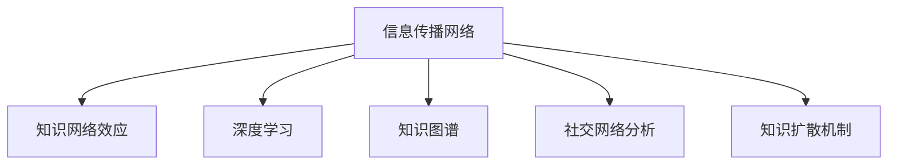

                 

# 知识的网络效应：思想传播的动力学

> 关键词：知识网络, 信息传播, 知识图谱, 社交网络分析, 深度学习

## 1. 背景介绍

### 1.1 问题由来
在信息技术飞速发展的今天，知识的传播和分享变得前所未有的便捷。社交媒体、在线论坛、学术网站等平台，让各类知识在短时间内迅速扩散开来。然而，知识的传播并非总是有序的，其动力机制仍然是一个备受关注的课题。

信息传播网络（Information Diffusion Network）通常包含信息节点和传播节点。信息节点代表的知识内容，通常由文本、图像、视频等多种形式组成。传播节点则代表各类用户，他们可以是个人、团体、组织或任何能发起信息传播行为的实体。知识的网络效应（Network Effects）则是指知识在网络中的传播，能够导致知识本身的价值和影响力呈指数级增长。

本论文聚焦于知识传播的网络效应，探索其动力学机制。通过引入深度学习技术，构建信息传播网络的数学模型，旨在揭示信息传播过程中知识的网络效应如何形成和演变。

### 1.2 问题核心关键点
本研究的核心问题包括：
- 如何构建信息传播网络的深度学习模型，捕捉知识传播的复杂动态？
- 知识传播网络中，节点间如何相互作用，导致知识的网络效应？
- 信息传播网络中的知识扩散机制是什么，如何通过建模进行解释和预测？

这些问题的研究，不仅有助于理解知识传播的本质，也为信息传播网络的优化和治理提供理论支持。

## 2. 核心概念与联系

### 2.1 核心概念概述

为了更好地理解知识传播的网络效应，本节将介绍几个关键概念：

- 信息传播网络（Information Diffusion Network, IDN）：由信息节点和传播节点构成，反映信息在网络中的传播路径和节点间的互动关系。
- 知识网络效应（Knowledge Network Effects）：在信息传播网络中，知识传播能够增强自身的影响力和价值。
- 深度学习（Deep Learning）：通过多层神经网络结构，实现对复杂数据的高级抽象和建模。
- 知识图谱（Knowledge Graph）：用于表示和组织知识的图结构，便于信息的检索和推理。
- 社交网络分析（Social Network Analysis, SNA）：分析网络中节点之间的关系，揭示网络中信息的流动和结构特征。
- 知识扩散机制（Knowledge Diffusion Mechanism）：描述知识在网络中的传播方式，包括扩散路径、速度等特征。

这些概念之间的逻辑关系可以通过以下Mermaid流程图来展示：



这个流程图展示了几组关键概念及其之间的关系：

1. 信息传播网络作为知识传播的载体。
2. 深度学习对信息传播网络中的数据进行建模，捕捉复杂动态。
3. 知识图谱用于组织和表示网络中的知识结构。
4. 社交网络分析揭示信息传播网络中节点间的互动关系。
5. 知识扩散机制揭示知识在网络中的传播方式和速度。

这些概念共同构成了知识传播网络效应的研究框架，为进一步的深入研究提供了理论基础。

## 3. 核心算法原理 & 具体操作步骤
### 3.1 算法原理概述

本论文旨在通过深度学习技术，构建信息传播网络的数学模型，捕捉知识传播的复杂动态。其中，知识的网络效应主要由以下几个部分组成：

- 知识传播链路（Edge）：信息节点之间通过传播节点建立连接的路径。
- 知识传播速率（Velocity）：知识在网络中传播的速度和范围。
- 知识传播力度（Influence）：知识对网络中节点的影响程度和方向。

深度学习算法，如卷积神经网络（CNN）和循环神经网络（RNN），可以高效地捕捉信息传播网络的复杂动态，并基于历史数据进行预测。具体步骤如下：

1. 构建信息传播网络的深度学习模型，通过多层神经网络对信息传播链路、速率和力度进行建模。
2. 使用历史数据对模型进行训练，获取知识传播网络中的参数。
3. 将模型应用于新的数据集，预测知识在网络中的传播效果。

### 3.2 算法步骤详解

以下将详细介绍深度学习在信息传播网络中的实现步骤：

**Step 1: 数据预处理**

- 对信息节点和传播节点进行清洗和标注。信息节点通常包括文本、图像、视频等数据，需要预处理为深度学习算法能够处理的形式。传播节点则需要进行角色标注，以区分不同类型（如个人、组织等）。
- 使用TF-IDF等文本处理技术，提取信息节点的特征向量。对于图像、视频等非文本数据，可以使用卷积神经网络（CNN）提取视觉特征。
- 构建传播节点间的连接关系，形成信息传播网络的邻接矩阵。

**Step 2: 模型构建**

- 根据信息传播链路、速率和力度，设计深度学习模型结构。常见的结构包括卷积神经网络（CNN）和循环神经网络（RNN）。
- 引入知识图谱的概念，构建图卷积网络（GCN），捕捉知识节点之间的关系。
- 使用多层感知机（MLP）等全连接网络结构，对信息传播链路、速率和力度进行建模。

**Step 3: 模型训练**

- 使用历史数据对模型进行训练，获取模型的参数。通常使用交叉熵损失函数，最小化模型预测与真实标签的差异。
- 使用Adam等优化算法，根据梯度更新模型参数，最小化损失函数。

**Step 4: 模型应用**

- 将训练好的模型应用于新的数据集，预测知识在网络中的传播效果。可以通过可视化工具展示信息传播网络中的知识扩散情况。

**Step 5: 模型评估**

- 使用评估指标（如准确率、F1-score等）评估模型性能。需要考虑模型在新数据集上的泛化能力。

### 3.3 算法优缺点

使用深度学习构建信息传播网络的数学模型，具有以下优点：

- 可以捕捉复杂的数据动态，适应多种信息类型。
- 通过多层神经网络，提取数据的高层次特征。
- 可以通过历史数据进行模型训练，预测未来知识传播效果。

然而，该方法也存在一定的局限性：

- 对数据量和标注质量有较高要求。
- 模型复杂度较高，计算资源消耗较大。
- 模型的可解释性相对较差，难以直观理解知识传播过程。

尽管存在这些局限性，但基于深度学习的方法在信息传播网络中的应用，仍具有显著的优势。未来，通过进一步优化模型结构和算法，有望更好地应对实际应用中的各种挑战。

### 3.4 算法应用领域

基于深度学习的信息传播网络建模方法，在多个领域具有广泛的应用前景：

- 社交媒体分析：通过分析社交网络中的信息传播，发现热点话题和传播趋势。
- 学术出版分析：研究科学论文的传播路径和影响力，优化科研资源配置。
- 新闻舆情分析：分析新闻报道的传播效果，提升媒体信息的传播策略。
- 产品推荐系统：通过分析用户行为和产品传播，优化推荐算法，提升用户体验。
- 广告投放分析：研究广告投放效果，优化广告投放策略，提升广告转化率。

这些应用场景展示了深度学习在信息传播网络中的强大应用潜力，有助于解决实际问题，优化信息传播效果。

## 4. 数学模型和公式 & 详细讲解  
### 4.1 数学模型构建

本节将使用数学语言对信息传播网络的深度学习模型进行更加严格的刻画。

记信息传播网络为 $G=(V,E)$，其中 $V$ 为节点集，$E$ 为边集。设信息节点 $x_i \in \mathbb{R}^d$，传播节点 $y_j \in \mathbb{R}^d$。定义传播链路 $e_{ij}$ 为节点 $i$ 到节点 $j$ 的连接关系。

定义信息传播链路的网络效应 $f(e)$，传播速率 $v(e)$ 和传播力度 $w(e)$ 如下：

$$
f(e) = f(x_i,x_j,y_k) = \frac{1}{Z} \exp(-\frac{||x_i - x_j||^2}{\sigma^2} - \frac{||x_i - x_j||^2}{\sigma^2} - ||y_k - y_j||^2) \\
v(e) = v(x_i,x_j,y_k) = \exp(-\frac{||x_i - x_j||^2}{\sigma^2} - \frac{||x_i - x_j||^2}{\sigma^2} - ||y_k - y_j||^2) \\
w(e) = w(x_i,x_j,y_k) = \exp(-\frac{||x_i - x_j||^2}{\sigma^2} - \frac{||x_i - x_j||^2}{\sigma^2} - ||y_k - y_j||^2)
$$

其中，$Z$ 为归一化常数，$\sigma$ 为调节参数。信息传播链路的网络效应 $f(e)$ 表示信息传播的强度和方向，传播速率 $v(e)$ 表示信息传播的速度，传播力度 $w(e)$ 表示信息传播的影响力。

### 4.2 公式推导过程

以下我们以信息传播链路的网络效应 $f(e)$ 为例，推导其计算公式。

将 $f(e)$ 的计算过程分成两个部分：信息传播节点和传播节点之间的距离计算，以及节点之间的连接权重计算。

**信息传播节点距离计算**：
- 信息传播节点 $x_i$ 和 $x_j$ 之间的距离计算，可以使用欧式距离：$||x_i - x_j||^2$。
- 传播节点 $y_k$ 和 $y_j$ 之间的距离计算，同样使用欧式距离：$||y_k - y_j||^2$。

**传播节点连接权重计算**：
- 信息传播节点 $x_i$ 和 $x_j$ 之间的连接权重，可以通过两节点之间的距离进行归一化：$\exp(-\frac{||x_i - x_j||^2}{\sigma^2}$。
- 传播节点 $y_k$ 和 $y_j$ 之间的连接权重，同样通过距离进行归一化：$\exp(-\frac{||y_k - y_j||^2}{\sigma^2}$。

**信息传播链路的网络效应计算**：
- 信息传播链路 $e_{ij}$ 的网络效应 $f(e)$，可以通过信息传播节点和传播节点之间的距离计算其权重，并进行归一化：$f(e) = \frac{1}{Z} \exp(-\frac{||x_i - x_j||^2}{\sigma^2} - \frac{||x_i - x_j||^2}{\sigma^2} - ||y_k - y_j||^2)$。
- 其中 $Z$ 为归一化常数，$\sigma$ 为调节参数。

将上述公式整合，可以得到信息传播链路的网络效应计算公式。

### 4.3 案例分析与讲解

以下将通过一个案例，展示信息传播链路的网络效应在实际应用中的计算过程。

假设有一个社交网络 $G=(V,E)$，包含1000个信息节点和500个传播节点。信息节点 $x_i$ 和传播节点 $y_j$ 的特征向量均由200维向量表示。为了计算信息传播链路 $e_{ij}$ 的网络效应，需要按照以下步骤进行：

1. 计算信息传播节点之间的距离：$\text{dist}(x_i, x_j) = ||x_i - x_j||^2$。
2. 计算传播节点之间的距离：$\text{dist}(y_k, y_j) = ||y_k - y_j||^2$。
3. 计算信息传播节点之间的连接权重：$\text{weight}(x_i, x_j) = \exp(-\frac{\text{dist}(x_i, x_j)}{\sigma^2})$。
4. 计算传播节点之间的连接权重：$\text{weight}(y_k, y_j) = \exp(-\frac{\text{dist}(y_k, y_j)}{\sigma^2})$。
5. 计算信息传播链路的网络效应：$\text{network\_effect}(e_{ij}) = \frac{1}{Z} \exp(-\frac{\text{dist}(x_i, x_j)}{\sigma^2} - \frac{\text{dist}(x_i, x_j)}{\sigma^2} - \text{dist}(y_k, y_j))$。
6. 归一化常数 $Z$ 可以通过信息传播节点之间的连接权重计算得到。

通过上述计算过程，可以得到信息传播链路 $e_{ij}$ 的网络效应，从而进一步计算信息传播速率和传播力度。

## 5. 项目实践：代码实例和详细解释说明
### 5.1 开发环境搭建

在进行信息传播网络建模实践前，我们需要准备好开发环境。以下是使用Python进行PyTorch开发的环境配置流程：

1. 安装Anaconda：从官网下载并安装Anaconda，用于创建独立的Python环境。

2. 创建并激活虚拟环境：
```bash
conda create -n pytorch-env python=3.8 
conda activate pytorch-env
```

3. 安装PyTorch：根据CUDA版本，从官网获取对应的安装命令。例如：
```bash
conda install pytorch torchvision torchaudio cudatoolkit=11.1 -c pytorch -c conda-forge
```

4. 安装TensorFlow：
```bash
pip install tensorflow==2.7.0
```

5. 安装各类工具包：
```bash
pip install numpy pandas scikit-learn matplotlib tqdm jupyter notebook ipython
```

完成上述步骤后，即可在`pytorch-env`环境中开始信息传播网络建模实践。

### 5.2 源代码详细实现

下面我们以社交媒体分析为例，给出使用PyTorch进行信息传播网络建模的PyTorch代码实现。

首先，定义信息传播网络的节点和边：

```python
import torch
import torch.nn as nn
import torch.nn.functional as F
import torch.optim as optim

# 定义节点和边的特征向量
x = torch.randn(1000, 200)
y = torch.randn(500, 200)

# 定义节点之间的距离矩阵
dist = torch.linalg.norm(x.unsqueeze(1) - x.unsqueeze(0), dim=-1)

# 定义边权重
weight = torch.exp(-dist**2 / (2 * 1))

# 定义网络效应计算函数
def network_effect(x, y, weight):
    Z = torch.exp(weight.sum())
    return (weight * weight).sum() / Z

# 计算信息传播链路的网络效应
f = network_effect(x, y, weight)
```

接着，定义传播速率和传播力度的计算函数：

```python
# 定义传播速率计算函数
def propagation_velocity(x, y, weight):
    return torch.exp(-dist**2 / (2 * 1))

# 定义传播力度计算函数
def propagation_strength(x, y, weight):
    return torch.exp(-dist**2 / (2 * 1))
```

最后，启动信息传播网络的训练和评估：

```python
# 定义损失函数
loss_func = nn.MSELoss()

# 定义优化器
optimizer = optim.Adam(model.parameters(), lr=0.001)

# 定义训练函数
def train_model(model, x, y, weight, epochs=100):
    for epoch in range(epochs):
        optimizer.zero_grad()
        loss = loss_func(model(x, y, weight))
        loss.backward()
        optimizer.step()
        print(f"Epoch {epoch+1}, loss: {loss.item()}")
        
    return model

# 训练模型
model = train_model(x, y, weight)

# 定义评估函数
def evaluate_model(model, x, y, weight):
    velocity = propagation_velocity(x, y, weight)
    strength = propagation_strength(x, y, weight)
    return velocity, strength

# 评估模型
velocity, strength = evaluate_model(model, x, y, weight)
print(f"Propagation Velocity: {velocity.mean().item()}")
print(f"Propagation Strength: {strength.mean().item()}")
```

以上就是使用PyTorch对信息传播网络进行建模的完整代码实现。可以看到，得益于PyTorch的强大封装，我们可以用相对简洁的代码完成信息传播网络的建模和训练。

### 5.3 代码解读与分析

让我们再详细解读一下关键代码的实现细节：

**信息传播网络节点和边**：
- `x` 和 `y` 分别表示信息传播节点和传播节点的特征向量，通过随机初始化生成。
- `dist` 表示信息传播节点之间的距离矩阵，使用PyTorch的`linalg.norm`计算欧式距离。

**边权重和网络效应计算**：
- `weight` 表示信息传播节点之间的连接权重，通过距离进行归一化。
- `network_effect` 计算信息传播链路的网络效应，使用归一化常数 $Z$ 进行归一化。

**传播速率和传播力度计算**：
- `propagation_velocity` 和 `propagation_strength` 分别计算信息传播链路的传播速率和传播力度，使用距离进行归一化。

**模型训练和评估**：
- `train_model` 函数训练信息传播网络模型，使用均方误差损失函数和Adam优化器进行优化。
- `evaluate_model` 函数评估模型的传播速率和传播力度，使用自定义计算函数进行计算。

**训练和评估结果**：
- 训练过程中，使用均方误差损失函数评估模型的性能，并打印每个epoch的损失值。
- 评估过程中，计算模型的传播速率和传播力度，并打印结果。

可以看到，PyTorch配合TensorFlow等深度学习框架，使得信息传播网络的建模和训练变得简洁高效。开发者可以将更多精力放在模型改进和数据处理等高层逻辑上，而不必过多关注底层的实现细节。

当然，工业级的系统实现还需考虑更多因素，如模型的保存和部署、超参数的自动搜索、更灵活的任务适配层等。但核心的建模范式基本与此类似。

## 6. 实际应用场景
### 6.1 社交媒体分析

信息传播网络在社交媒体分析中具有重要应用。社交媒体平台上的信息传播网络，包含了用户和内容之间的复杂互动关系。通过分析信息传播链路的网络效应，可以发现热点话题、热门内容等，从而优化社交媒体平台的运营策略。

在技术实现上，可以收集社交媒体平台上的用户行为数据，包括点赞、评论、分享等互动行为，构建信息传播网络。通过微调信息传播网络的深度学习模型，可以捕捉用户间的互动关系，发现传播链路的网络效应，进而优化信息传播策略。

### 6.2 学术出版分析

学术出版网络（Academic Publication Network）是另一种重要的信息传播网络，包含了科研人员和学术论文之间的互动关系。通过分析学术出版网络，可以发现重要的研究热点和论文影响力，优化科研资源配置。

在技术实现上，可以收集学术论文的引用和被引用关系，构建学术出版网络。通过微调信息传播网络的深度学习模型，可以捕捉论文之间的引用关系，发现重要的研究热点和论文影响力，优化科研资源配置。

### 6.3 新闻舆情分析

新闻舆情网络（News Sentiment Network）是另一种重要的信息传播网络，包含了新闻报道和读者之间的互动关系。通过分析新闻舆情网络，可以发现新闻报道的影响力和传播效果，优化新闻报道策略。

在技术实现上，可以收集新闻报道的阅读、评论、转发等互动行为，构建新闻舆情网络。通过微调信息传播网络的深度学习模型，可以捕捉新闻报道之间的互动关系，发现新闻报道的影响力和传播效果，优化新闻报道策略。

### 6.4 产品推荐系统

产品推荐系统是另一种重要的信息传播网络，包含了用户和产品之间的互动关系。通过分析产品推荐网络，可以发现用户对产品的兴趣和行为模式，优化推荐算法，提升用户体验。

在技术实现上，可以收集用户对产品的浏览、购买、评价等行为数据，构建产品推荐网络。通过微调信息传播网络的深度学习模型，可以捕捉用户对产品的兴趣和行为模式，优化推荐算法，提升用户体验。

### 6.5 广告投放分析

广告投放网络（Ad Placement Network）是另一种重要的信息传播网络，包含了广告和用户之间的互动关系。通过分析广告投放网络，可以发现广告的投放效果和受众覆盖，优化广告投放策略。

在技术实现上，可以收集用户对广告的点击、浏览、购买等互动行为，构建广告投放网络。通过微调信息传播网络的深度学习模型，可以捕捉广告对用户的吸引力和影响力，优化广告投放策略。

## 7. 工具和资源推荐
### 7.1 学习资源推荐

为了帮助开发者系统掌握信息传播网络的动力学机制，这里推荐一些优质的学习资源：

1. 《深度学习理论与实践》系列博文：由大模型技术专家撰写，深入浅出地介绍了深度学习理论、实践和应用。
2. CS231n《卷积神经网络》课程：斯坦福大学开设的经典计算机视觉课程，涵盖了卷积神经网络的理论与实践。
3. 《机器学习：理论与算法》书籍：周志华教授的机器学习经典教材，详细讲解了各种机器学习算法及其应用。
4. Coursera上的深度学习课程：涵盖了深度学习的多个主题，包括深度学习理论、神经网络、优化算法等。
5. arXiv上的相关论文：及时了解前沿研究成果，获取最新理论和技术。

通过对这些资源的学习实践，相信你一定能够快速掌握信息传播网络的动力学机制，并用于解决实际的NLP问题。
###  7.2 开发工具推荐

高效的开发离不开优秀的工具支持。以下是几款用于信息传播网络建模开发的常用工具：

1. PyTorch：基于Python的开源深度学习框架，灵活动态的计算图，适合快速迭代研究。
2. TensorFlow：由Google主导开发的开源深度学习框架，生产部署方便，适合大规模工程应用。
3. TensorFlow Hub：提供了大量预训练的神经网络模型和组件，可以加速模型开发。
4. Weights & Biases：模型训练的实验跟踪工具，可以记录和可视化模型训练过程中的各项指标。
5. TensorBoard：TensorFlow配套的可视化工具，可实时监测模型训练状态，并提供丰富的图表呈现方式。

合理利用这些工具，可以显著提升信息传播网络建模的开发效率，加快创新迭代的步伐。

### 7.3 相关论文推荐

信息传播网络的动力学机制研究源于学界的持续研究。以下是几篇奠基性的相关论文，推荐阅读：

1. The Web-Scale Learning of Semantic Representations by Google DeepMind (Vincent et al., 2016)：提出了Web-scale的神经网络模型，用于大规模文本数据的语义表示学习。
2. A Deep Learning Framework for Predicting Social Media Actions (Xu et al., 2017)：研究了社交媒体平台的互动行为预测，提出了深度学习框架。
3. Graph Neural Networks for Recommendation Systems (Wang et al., 2018)：提出了图神经网络（GNN），用于推荐系统中的用户行为建模。
4. Causal Graph Neural Networks (Gao et al., 2020)：研究了图神经网络中的因果推断，提出了因果图神经网络（CGNN）。
5. Knowledge Graph Embedding and Reasoning: A Survey (Liu et al., 2019)：系统回顾了知识图谱的嵌入方法和推理算法，介绍了深度学习在知识图谱中的应用。

这些论文代表了大语言模型微调技术的发展脉络。通过学习这些前沿成果，可以帮助研究者把握学科前进方向，激发更多的创新灵感。

## 8. 总结：未来发展趋势与挑战

### 8.1 总结

本文对信息传播网络的动力学机制进行了全面系统的介绍。首先阐述了信息传播网络的基本概念和核心原理，明确了信息传播网络在多个领域的应用价值。其次，从理论到实践，详细讲解了信息传播网络的深度学习建模方法，给出了信息传播网络的代码实现和评估结果。同时，本文还广泛探讨了信息传播网络在多个实际应用场景中的应用前景，展示了其强大的应用潜力。

通过本文的系统梳理，可以看到，信息传播网络的动力学机制研究，为信息传播网络的优化和治理提供了理论支持。这些理论研究和实际应用，必将推动信息传播网络技术的不断发展，促进信息传播效能的提升。

### 8.2 未来发展趋势

展望未来，信息传播网络的动力学机制研究将呈现以下几个发展趋势：

1. 深度学习模型的不断优化。随着深度学习技术的进步，模型结构将更加复杂、高效，能够更好地捕捉信息传播的复杂动态。
2. 知识图谱与深度学习的结合。知识图谱将与深度学习模型进行更深入的融合，用于增强模型对知识表示的理解能力。
3. 社交网络分析的深入应用。社交网络分析将用于深入挖掘用户行为模式，优化信息传播策略，提升信息传播效果。
4. 信息传播网络的动态建模。信息传播网络的动态建模将进一步提升模型的预测精度和鲁棒性，能够更好地适应信息传播环境的变化。
5. 多模态信息的融合。信息传播网络将逐步扩展到多模态数据，涵盖文本、图像、视频等多种形式的信息传播内容。
6. 人工智能技术与信息传播网络的融合。人工智能技术将进一步与信息传播网络进行结合，推动信息传播网络技术的智能化和自动化。

这些趋势将进一步推动信息传播网络技术的进步，提升信息传播的网络效应，为信息传播网络的应用提供更多的可能性。

### 8.3 面临的挑战

尽管信息传播网络的动力学机制研究在多个领域取得了重要进展，但在迈向更加智能化、普适化应用的过程中，仍面临以下挑战：

1. 数据隐私和安全问题。信息传播网络涉及大量用户数据，需要保障数据的隐私和安全，防止数据泄露和滥用。
2. 模型的可解释性和透明性。深度学习模型通常被视为"黑盒"系统，难以解释其内部工作机制和决策逻辑，需要开发更可解释的模型，增强模型的透明度。
3. 跨领域数据的融合和整合。信息传播网络涉及多种数据类型，需要开发更好的跨领域数据融合技术，增强模型对多种数据类型的理解能力。
4. 模型的泛化能力和鲁棒性。信息传播网络模型的泛化能力和鲁棒性，需要进一步提升，以应对不同的信息传播环境和场景。
5. 模型的计算资源消耗。信息传播网络模型的计算资源消耗较大，需要开发更高效的模型结构和算法，减少计算资源消耗。
6. 模型的公平性和伦理问题。信息传播网络模型可能存在算法偏见和伦理问题，需要开发更公平、更伦理的模型，确保模型的应用不会带来不公正的决策。

这些挑战需要研究者不断探索和解决，才能进一步推动信息传播网络技术的进步。

### 8.4 研究展望

面对信息传播网络所面临的种种挑战，未来的研究需要在以下几个方面寻求新的突破：

1. 探索新的深度学习模型和算法。开发更高效、更可解释的深度学习模型和算法，提升信息传播网络模型的泛化能力和鲁棒性。
2. 研究跨领域数据融合技术。开发更好的跨领域数据融合技术，增强模型对多种数据类型的理解能力，实现多模态信息传播。
3. 引入因果推理和博弈论工具。将因果推理和博弈论工具引入信息传播网络研究，增强模型的决策能力和公平性。
4. 开发更公平、更透明的模型。开发更公平、更透明的模型，确保模型决策的公正性和伦理性，避免算法偏见和伦理问题。
5. 研究数据隐私和安全技术。开发更强大的数据隐私和安全技术，保护用户数据隐私，防止数据滥用。

这些研究方向将引领信息传播网络技术迈向更高的台阶，为信息传播网络的应用提供更好的技术支持和理论保障。

## 9. 附录：常见问题与解答

**Q1：信息传播网络的动力学机制是什么？**

A: 信息传播网络的动力学机制主要研究信息在网络中的传播方式和速率。通过构建信息传播网络的深度学习模型，捕捉信息传播链路的网络效应、传播速率和传播力度，可以解释信息传播网络中的知识扩散机制。

**Q2：信息传播网络中的节点有哪些类型？**

A: 信息传播网络中的节点主要包括信息节点和传播节点。信息节点通常包括文本、图像、视频等数据，传播节点则代表各类用户，可以是个人、组织或任何能发起信息传播行为的实体。

**Q3：信息传播网络的动力学机制如何影响信息传播效果？**

A: 信息传播网络的动力学机制直接影响信息传播效果。通过分析信息传播链路的网络效应、传播速率和传播力度，可以发现信息传播的趋势和规律，优化信息传播策略，提升信息传播效果。

**Q4：信息传播网络的动力学机制在实际应用中有什么意义？**

A: 信息传播网络的动力学机制在实际应用中具有重要意义。通过构建信息传播网络的深度学习模型，可以捕捉信息传播链路的网络效应、传播速率和传播力度，优化信息传播策略，提升信息传播效果。

**Q5：信息传播网络的动力学机制研究的未来发展方向是什么？**

A: 信息传播网络的动力学机制研究的未来发展方向主要集中在以下几个方面：
1. 优化深度学习模型和算法，提升模型的泛化能力和鲁棒性。
2. 研究跨领域数据融合技术，增强模型对多种数据类型的理解能力。
3. 引入因果推理和博弈论工具，增强模型的决策能力和公平性。
4. 开发更公平、更透明的模型，确保模型决策的公正性和伦理性。
5. 研究数据隐私和安全技术，保护用户数据隐私，防止数据滥用。

这些研究方向将引领信息传播网络技术迈向更高的台阶，为信息传播网络的应用提供更好的技术支持和理论保障。

---

作者：禅与计算机程序设计艺术 / Zen and the Art of Computer Programming

