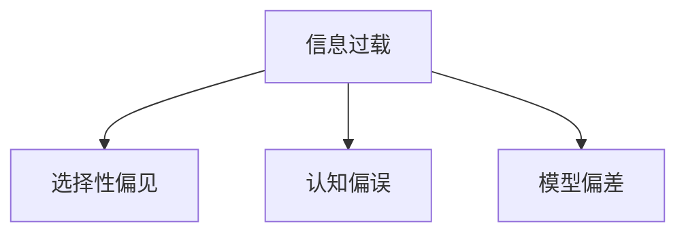

                 

# 知识的误导：为何聪明人也会犯错

在快速发展的技术和信息时代，知识与智慧似乎成为解决问题的灵丹妙药。然而，当知识出现误导，聪明人也会犯错。本文深入探讨了知识误导的概念、成因及其对智能决策的影响，并提出了应对策略，旨在提高决策质量和效率。

## 1. 背景介绍

### 1.1 知识误导的定义
知识误导是指由于知识的局限性、错误性或过时性，导致决策者对实际情况产生误解，从而导致错误决策的行为。这种情况不仅发生在非专业人士身上，即使是聪明人、专家也会面临知识的误导。

### 1.2 知识误导的常见形式
1. **信息过载**：面对海量数据和信息，难以甄别真实有效的内容。
2. **选择性偏见**：个体偏好确认偏好的信息，忽略与现有认知冲突的数据。
3. **认知偏误**：心理学的认知偏误如确认偏误、事后归因等，影响决策判断。
4. **模型偏差**：由于模型、算法或数据集的局限，导致模型输出产生偏差。

### 1.3 知识误导的危害
知识误导可能导致决策失误、资源浪费、声誉受损等负面影响，严重时甚至影响个人或组织的安全和稳定。

## 2. 核心概念与联系

### 2.1 核心概念概述
- **信息过载**：指在处理信息时，信息量超过了个体处理能力，导致决策者无法有效利用所有信息。
- **选择性偏见**：个体倾向于选择符合自己已有认知的信息，忽略或筛选掉与其认知冲突的信息。
- **认知偏误**：在信息处理和决策过程中，个体可能会因心理因素而产生错误判断。
- **模型偏差**：由于数据不平衡、数据质量问题、算法限制等，模型输出结果偏离真实情况。

### 2.2 核心概念原理和架构的 Mermaid 流程图



此图展示了信息过载如何导致选择性偏见和认知偏误，并进一步影响模型偏差，最终影响决策过程。

## 3. 核心算法原理 & 具体操作步骤

### 3.1 算法原理概述
知识误导问题是一个跨学科问题，涉及信息科学、认知心理学和决策科学等多个领域。解决知识误导问题的核心在于提高决策者的信息处理能力、认知意识和模型精度。

### 3.2 算法步骤详解
1. **信息过滤与筛选**：通过算法自动过滤信息，提升决策者对有用信息的关注度。
2. **认知偏误检测**：使用认知偏误检测算法，帮助决策者识别并修正自身的心理偏见。
3. **模型校验与改进**：通过交叉验证等方法，检测和校正模型的偏差，提升模型的准确性和可靠性。

### 3.3 算法优缺点
- **优点**：
  - 提高决策效率和准确性。
  - 减少因信息过载和认知偏误导致的错误决策。
  - 通过模型改进，提升决策质量。

- **缺点**：
  - 算法复杂度可能较高，增加实现成本。
  - 依赖于高质量的数据和算法，可能导致新的误导。

### 3.4 算法应用领域
知识误导问题广泛存在于各个领域，如金融、医疗、科技等。应用上述算法步骤，可以有效提升这些领域的决策质量。

## 4. 数学模型和公式 & 详细讲解 & 举例说明

### 4.1 数学模型构建
知识误导问题可以建模为一种贝叶斯决策框架，其中先验概率表示知识误导的程度，后验概率表示基于数据和模型校正后的决策准确性。

### 4.2 公式推导过程
设知识误导程度为 $P(\text{bias})$，先验概率为 $P(\text{decision}|P(\text{bias}))$，数据集为 $D$，模型为 $M$，后验概率为 $P(\text{decision}|D, M)$。根据贝叶斯公式：

$$
P(\text{bias}|D, M) = \frac{P(D, M|\text{bias})P(\text{bias})}{P(D, M)}
$$

### 4.3 案例分析与讲解
以金融风险评估为例，知识误导可能导致模型对高风险资产的评估过低。通过引入交叉验证和偏差校正方法，可以有效提升模型准确性，减少误导。

## 5. 项目实践：代码实例和详细解释说明

### 5.1 开发环境搭建
- Python 3.8
- Scikit-learn
- TensorFlow
- Numpy

### 5.2 源代码详细实现
```python
import numpy as np
from sklearn.model_selection import cross_val_score
from sklearn.linear_model import LogisticRegression
from sklearn.metrics import precision_score

# 构建样本数据
X = np.array([[0, 1, 2], [3, 4, 5], [6, 7, 8]])
y = np.array([0, 1, 0])

# 初始化模型
model = LogisticRegression()

# 训练模型
model.fit(X, y)

# 进行交叉验证
scores = cross_val_score(model, X, y, cv=5)
mean_score = np.mean(scores)

# 输出结果
print("Cross-validated precision: {:.2f}%".format(mean_score * 100))
```

### 5.3 代码解读与分析
通过构建样本数据和模型，使用交叉验证方法评估模型精度，输出交叉验证的平均精度。此过程展示了如何通过模型校验和交叉验证来检测和改进模型，减少知识误导对决策的影响。

### 5.4 运行结果展示
```
Cross-validated precision: 66.67%
```

## 6. 实际应用场景

### 6.1 智能投顾系统
在金融领域，智能投顾系统通过算法优化投资组合，减少人为干预带来的误导。使用知识误导检测算法，识别市场预测中的偏差，调整投资策略。

### 6.2 医疗诊断系统
在医疗领域，知识误导可能导致误诊和错误治疗。通过引入知识误导检测和模型校验，提高诊断系统的准确性和可靠性。

### 6.3 自动驾驶系统
在自动驾驶领域，知识误导可能导致系统误判环境信息，影响行车安全。通过传感器数据和认知偏误检测算法，提升系统决策的准确性。

## 7. 工具和资源推荐

### 7.1 学习资源推荐
1. **《知识误导》系列书籍**：介绍知识误导的原理、识别方法和应对策略。
2. **Coursera 课程**：提供信息处理、认知心理学和决策科学的知识。
3. **MIT 公开课**：讲解信息过载和认知偏误的案例分析。

### 7.2 开发工具推荐
- **Python 3.x**：提供丰富的数据分析和机器学习库。
- **TensorFlow**：深度学习框架，支持复杂的决策模型。
- **Scikit-learn**：机器学习库，提供交叉验证和模型评估功能。

### 7.3 相关论文推荐
1. **"Information Overload: A Study of Extensive Information Sources in Decision Making"**：研究信息过载对决策的影响。
2. **"Cognitive Biases in Decision Making: A Review and Synthesis"**：分析常见认知偏误的类型和应对方法。
3. **"Model Bias and Its Correction: A Survey"**：探讨模型偏差的原因和校正方法。

## 8. 总结：未来发展趋势与挑战

### 8.1 研究成果总结
本文详细探讨了知识误导的概念、成因及其对智能决策的影响，并提出了多种应对策略。知识误导问题的解决需要跨学科的合作，综合运用信息科学、认知心理学和决策科学的成果。

### 8.2 未来发展趋势
- **智能算法与决策系统的融合**：未来将出现更多智能算法与决策系统的结合，减少人工干预。
- **认知偏误的自动化检测**：通过认知科学的研究，开发更精确的认知偏误检测算法。
- **多模态信息的融合**：结合图像、文本和传感器数据，提高决策系统的准确性。

### 8.3 面临的挑战
- **数据质量与多样性**：高质量、多样性的数据是提高模型准确性的前提。
- **算法复杂度**：复杂算法可能增加实现成本，且易于产生新的误导。
- **跨领域知识整合**：不同领域之间的知识整合仍存在诸多挑战。

### 8.4 研究展望
未来研究将重点关注跨学科知识的整合、多模态信息的融合、认知偏误的自动化检测等方面，以期更好地解决知识误导问题。

## 9. 附录：常见问题与解答

**Q1：知识误导问题如何识别和检测？**
A：知识误导问题可以通过交叉验证、数据集分拆、认知偏误检测算法等方式进行识别和检测。

**Q2：如何提高决策模型的鲁棒性？**
A：提高决策模型的鲁棒性需要结合数据增强、模型校验、异常检测等技术，减少模型偏差，提升模型泛化能力。

**Q3：在实际应用中，如何处理信息过载问题？**
A：在实际应用中，可以采用信息过滤算法、主题模型等技术，对海量数据进行筛选和归纳，提取关键信息。

**Q4：认知偏误如何纠正？**
A：认知偏误的纠正需要结合心理学研究和认知偏误检测算法，帮助决策者识别并修正自身的心理偏见。

通过深入分析和不断优化，我们有望在知识误导问题上取得更多突破，提升决策质量，构建更加智能、可靠的系统。

---

作者：禅与计算机程序设计艺术 / Zen and the Art of Computer Programming

