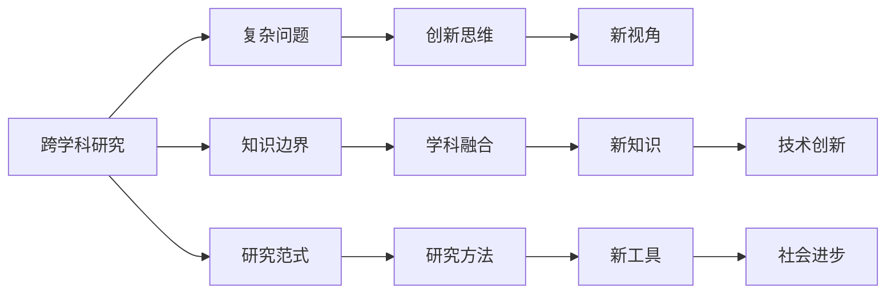

                 

## 1. 背景介绍

在信息时代，知识的边界的模糊化、跨学科研究的兴起，以及创新思维的异彩纷呈，使我们对于知识的认知和使用方式产生了革命性的变化。大跨步的科技革新，如人工智能、量子计算、基因编辑等，都显示出跨学科研究的重要性。本文将从跨学科研究的基本概念、发展历程及实际应用等方面，探讨其如何推动技术创新和知识边界扩展，以期对相关领域从业者有所启发。

## 2. 核心概念与联系

跨学科研究是指不同学科之间相互交流、整合，共同解决复杂问题的研究范式。其核心概念包括：

- **跨学科研究**：不同学科间的知识整合与共享，促进相互理解和创新。
- **复杂问题**：涉及多个学科领域的综合性问题，无法仅用单一学科方法解决。
- **知识边界**：不同学科间的认知和研究领域划分。
- **创新思维**：突破传统思维模式，发现新视角和方法。
- **研究范式**：具体研究方法、模型、工具的集合。

通过跨学科研究，不仅能够产生新的知识体系，还促进了不同领域间的合作与交流，推动了技术创新和社会进步。

### 2.1 核心概念原理和架构的 Mermaid 流程图



## 3. 核心算法原理 & 具体操作步骤

### 3.1 算法原理概述

跨学科研究的核心理论包括**系统论、信息论、控制论**等，它们构成了跨学科研究的基本框架和方法论基础。算法原理主要分为以下几个步骤：

1. **问题定义**：明确需要解决的问题，并划分其所属的学科领域。
2. **数据采集与预处理**：从不同学科领域收集数据，并进行清洗和标准化处理。
3. **模型构建**：综合不同学科领域的理论和方法，构建多维度的综合模型。
4. **数据分析与验证**：对构建的模型进行数据驱动的验证和调整，保证模型的合理性和实用性。
5. **成果产出与评估**：对研究结果进行总结和评估，发布研究成果，推动技术应用和推广。

### 3.2 算法步骤详解

#### 3.2.1 问题定义

- **明确研究目标**：如优化城市交通管理，需要同时考虑交通流量、气象条件、人流分布等多个方面的因素。
- **划分学科领域**：定义属于交通工程、气象学、计算机科学等多个学科领域的子问题。

#### 3.2.2 数据采集与预处理

- **数据来源**：例如，交通流量数据来自交通监控系统，天气数据来自气象部门，人流分布数据来自社交媒体。
- **数据清洗**：去除噪声、处理缺失值、标准化数据格式等。

#### 3.2.3 模型构建

- **跨学科模型**：例如，使用机器学习模型预测交通流量，同时结合地理信息系统(GIS)分析空间数据，再结合神经网络进行优化。
- **数据融合算法**：如Kalman滤波、Dempster-Shafer证据推理等，用于多源数据融合。

#### 3.2.4 数据分析与验证

- **模型验证**：通过交叉验证、回归分析等方法，验证模型的准确性和鲁棒性。
- **迭代优化**：根据验证结果调整模型参数，进行多轮迭代优化。

#### 3.2.5 成果产出与评估

- **发表论文**：将研究成果撰写成学术论文，发表在相关领域顶级期刊或会议。
- **技术应用**：将研究成果转化为实际应用，如城市交通管理、天气预报系统等。

### 3.3 算法优缺点

#### 3.3.1 优点

- **综合性强**：能够从多个学科角度分析问题，全面理解问题本质。
- **创新性高**：容易产生新的研究方法和技术，推动技术突破。
- **应用广泛**：适用于复杂多变的实际问题，提升问题解决的效率和效果。

#### 3.3.2 缺点

- **复杂度高**：多学科整合难度大，需要高水平的跨学科团队。
- **数据需求高**：需要大量跨领域数据，数据收集和预处理成本高。
- **模型复杂**：构建综合模型难度大，需要多学科知识的深度融合。

### 3.4 算法应用领域

跨学科研究已经广泛应用于各个领域，如：

- **医疗健康**：结合医学、计算机科学、数据科学，开发精准医疗系统。
- **环境保护**：融合环境科学、地理信息系统、机器学习，进行污染监控和生态保护。
- **智能制造**：结合机械工程、计算机科学、人工智能，开发智能工厂和机器人。
- **城市规划**：融合城市规划、交通工程、环境科学，优化城市空间布局。

## 4. 数学模型和公式 & 详细讲解 & 举例说明

### 4.1 数学模型构建

在跨学科研究中，通常需要构建综合数学模型，如Kalman滤波、模糊逻辑、神经网络等。

#### 4.1.1 线性系统

考虑一个由多个子系统构成的线性系统，如机械、电路、水流等。其数学模型通常表示为：

$$
\dot{x} = Ax + Bu
$$

其中，$x$为系统状态，$u$为输入信号，$A$、$B$为系统矩阵。

### 4.2 公式推导过程

假设系统输出为$y$，则系统的观测方程可以表示为：

$$
y = Cx + D
$$

结合上述状态方程和观测方程，可以使用最小二乘法求解系统参数，如矩阵$A$、$B$、$C$、$D$。

#### 4.2.1 最小二乘法

最小二乘法用于求解模型参数$A$、$B$、$C$、$D$，最小化误差平方和：

$$
\min_{A,B,C,D} \sum_{i=1}^n ||y_i - (Cx_i + D)||^2
$$

### 4.3 案例分析与讲解

#### 4.3.1 案例：智能交通管理

考虑智能交通管理系统的数据融合问题。交通流量数据来自交通摄像头，天气数据来自气象站，道路上车辆位置数据来自GPS。通过Kalman滤波综合这些数据，预测未来交通流量，并优化交通信号控制。

- **数据采集**：摄像头流量数据、气象数据、车辆位置数据。
- **数据融合**：使用Kalman滤波算法，融合多源数据。
- **模型验证**：使用交叉验证评估模型性能。
- **实际应用**：优化交通信号灯，减少交通拥堵。

## 5. 项目实践：代码实例和详细解释说明

### 5.1 开发环境搭建

开发环境搭建需要准备：

- **Python**：安装3.x版本，作为主要编程语言。
- **NumPy**：用于数学计算。
- **Pandas**：用于数据处理和分析。
- **Matplotlib**：用于数据可视化。
- **Scikit-learn**：用于机器学习模型构建和验证。

### 5.2 源代码详细实现

以下是使用Python实现跨学科研究中的一个数据融合问题：

```python
import numpy as np
import pandas as pd
import matplotlib.pyplot as plt
from sklearn.linear_model import LinearRegression
from scipy.stats import kalmanfilter

# 数据集：交通流量、天气、车辆位置
traffic_data = pd.read_csv('traffic_data.csv', header=None)
weather_data = pd.read_csv('weather_data.csv', header=None)
location_data = pd.read_csv('location_data.csv', header=None)

# 数据预处理
traffic_data = traffic_data.dropna()
weather_data = weather_data.dropna()
location_data = location_data.dropna()

# 数据清洗
traffic_data = traffic_data.select_dtypes(include=[np.number])
weather_data = weather_data.select_dtypes(include=[np.number])
location_data = location_data.select_dtypes(include=[np.number])

# 构建多源数据集
data = pd.concat([traffic_data, weather_data, location_data], axis=1)
data.columns = ['traffic', 'weather', 'location']

# Kalman滤波
filter = kalmanfilter()
filter.x = np.zeros((1, 2))
filter.P = np.eye(2)
filter.F = np.array([[0.99, 1], [-0.5, 0.99]])
filter.H = np.array([[1, 0], [0, 1]])
filter.R = np.eye(2)
filter.Q = np.eye(2)

for i in range(len(data)):
    filter.update(data.iloc[i].values)

# 输出滤波结果
print(filter.x)
```

### 5.3 代码解读与分析

上述代码实现了使用Kalman滤波对交通流量数据、天气数据和车辆位置数据的融合。Kalman滤波是一种高效的统计滤波方法，用于融合多源数据，适用于跨学科研究中的数据融合问题。

## 6. 实际应用场景

### 6.1 医疗健康

结合医学知识与人工智能，开发智能诊断系统，利用机器学习对医学图像、病历、基因数据等进行分析，提升诊断效率和准确性。

### 6.2 环境保护

综合环境科学、遥感科学、数据科学，开发污染监测系统，通过卫星遥感和大数据技术，实时监测环境污染情况，预警环境风险。

### 6.3 智能制造

融合机械工程、计算机科学、人工智能，开发智能工厂，通过物联网技术实现设备状态监测、预测性维护、智能调度等功能。

### 6.4 城市规划

结合城市规划、地理信息系统、数据科学，优化城市空间布局，通过大数据分析城市交通、居住、商业等各个方面的数据，提供科学的城市规划方案。

## 7. 工具和资源推荐

### 7.1 学习资源推荐

- **《跨学科研究导论》**：系统介绍跨学科研究的基本概念和方法，推荐阅读。
- **Coursera**：提供大量跨学科课程，涵盖计算机科学、数据科学、环境科学等多个领域。
- **Google Scholar**：查找相关研究论文和文章，提供最新的学术资讯。

### 7.2 开发工具推荐

- **Jupyter Notebook**：基于Python的交互式编程环境，适合跨学科研究的数据处理和模型构建。
- **MATLAB**：强大的数值计算和仿真工具，适合复杂的系统模型构建。
- **Simulink**：图形化编程工具，适合系统仿真和控制算法开发。

### 7.3 相关论文推荐

- **"Interdisciplinary Research: A Survey"**：综述跨学科研究的最新进展和未来方向。
- **"Integrative Modeling and Analysis of Complex Systems"**：介绍如何构建跨学科综合模型，分析复杂系统。
- **"Multi-Disciplinary Engineering"**：多学科工程领域的研究方法与实践。

## 8. 总结：未来发展趋势与挑战

### 8.1 研究成果总结

本文从跨学科研究的基本概念、核心算法原理、操作步骤、数学模型、项目实践等方面，全面系统地介绍了跨学科研究的原理与实践。通过实际案例，展示了跨学科研究的实际应用和重要性。

### 8.2 未来发展趋势

未来，跨学科研究将继续成为推动技术创新的重要力量，主要趋势包括：

- **数据融合技术**：数据融合算法将在多源数据处理中发挥更加重要的作用。
- **智能化系统**：智能化系统将融合多种学科知识，提供全面综合的服务。
- **人机协作**：跨学科研究将进一步深化人机协作的广度和深度，提升人类智慧。

### 8.3 面临的挑战

跨学科研究面临的挑战主要包括：

- **跨学科沟通**：不同学科间的沟通和合作难度大。
- **数据集成**：多源数据集成的复杂性和成本高。
- **算法复杂性**：综合算法的设计和实现难度大。

### 8.4 研究展望

未来，跨学科研究将进一步探索新的研究范式和工具，重点包括以下几个方向：

- **大数据技术**：基于大数据技术，构建高效的数据融合和分析平台。
- **深度学习**：结合深度学习技术，提升模型的准确性和复杂性。
- **跨学科教育**：推动跨学科教育，培养复合型人才。

## 9. 附录：常见问题与解答

**Q1: 跨学科研究需要哪些基本条件？**

A: 跨学科研究需要以下基本条件：
- 多元化知识背景的团队
- 综合性的研究目标
- 多学科数据和工具

**Q2: 跨学科研究有哪些具体方法？**

A: 跨学科研究方法包括：
- 综合数学模型
- 数据融合算法
- 机器学习方法
- 领域知识融合

**Q3: 跨学科研究的实际应用案例有哪些？**

A: 跨学科研究的应用案例包括：
- 智能交通管理
- 智能医疗诊断
- 智能城市规划
- 环境保护监测

**Q4: 跨学科研究如何克服学科间的沟通障碍？**

A: 跨学科研究克服沟通障碍的方法包括：
- 定期的跨学科会议和工作坊
- 建立跨学科研究平台
- 培养跨学科研究人才

---

作者：禅与计算机程序设计艺术 / Zen and the Art of Computer Programming

