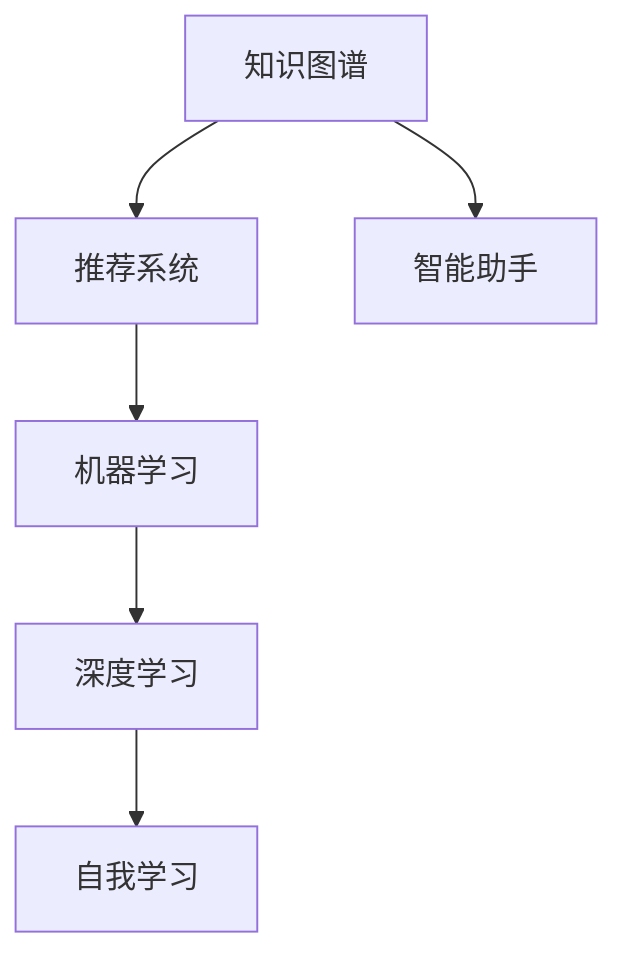

                 

## 1. 背景介绍

### 1.1 问题由来
在当今信息爆炸的时代，知识更新速度之快、内容之繁杂前所未有。面对海量信息，如何高效地获取、筛选和应用知识，成为了个人成长和发展的重要问题。数据驱动的个人发展理念应运而生，将数据分析、机器学习和智能系统引入个人知识管理，帮助个体更好地适应快速变化的环境，实现自我优化和提升。

### 1.2 问题核心关键点
数据驱动的个人发展核心在于利用数据和算法对个人学习、行为和状态进行量化分析，从而实现自我监控、自我调整和自我提升。其中涉及的关键点包括：

- **数据采集**：从多种渠道（如社交媒体、学习记录、健康监控等）收集相关数据。
- **数据分析**：运用统计学、机器学习等方法，对采集到的数据进行分析，提取有价值的信息。
- **智能反馈**：根据分析结果，提供个性化的学习建议、行为干预和生活调整策略。
- **持续优化**：通过持续的数据收集和分析，不断调整个人发展策略，实现动态优化。

这些关键点共同构成了数据驱动个人发展的基本框架，为个体提供了科学、高效的学习和生活管理方案。

### 1.3 问题研究意义
数据驱动的个人发展不仅有助于提升个体的学习效率和生活质量，还能在更广泛的场景中应用，如教育、健康、职业发展等。通过数据驱动的方式，可以更系统、更科学地管理个人生活，从而实现自我优化和持续成长。

## 2. 核心概念与联系

### 2.1 核心概念概述

为更好地理解数据驱动的个人发展，本节将介绍几个密切相关的核心概念：

- **知识图谱**：一种结构化的知识表示方式，用于描述实体、关系和属性，帮助理解复杂的知识网络。
- **推荐系统**：一种基于用户行为和偏好进行内容推荐的技术，广泛应用于个性化信息获取和推荐。
- **机器学习**：一种让计算机通过数据学习并优化性能的技术，广泛应用于数据分析和预测。
- **深度学习**：机器学习的一种高级形式，通过多层神经网络进行数据特征提取和模型训练，具有强大的自我学习能力。
- **自我学习**：个体通过反思、学习和调整，实现自我认知和自我提升的过程。
- **智能助手**：一种基于人工智能技术，提供个性化建议和服务的应用，帮助个体实现目标。

这些核心概念之间的逻辑关系可以通过以下Mermaid流程图来展示：



这个流程图展示了几大核心概念及其之间的关系：

1. 知识图谱提供结构化的知识表示，推荐系统基于知识图谱进行个性化推荐。
2. 推荐系统和知识图谱的数据通过机器学习进行特征提取和模型训练。
3. 深度学习是机器学习的一种高级形式，进一步提升模型性能。
4. 深度学习模型通过自我学习，实现对知识和行为的理解和优化。
5. 智能助手通过深度学习和自我学习，提供个性化的建议和服务。

这些概念共同构成了数据驱动个人发展的技术框架，为个体提供了一整套科学、系统化的发展路径。

## 3. 核心算法原理 & 具体操作步骤
### 3.1 算法原理概述

数据驱动的个人发展，本质上是一种利用数据和算法进行自我认知、自我监控和自我调整的过程。其核心思想是：通过持续的数据采集和分析，利用机器学习模型进行特征提取和行为预测，最终实现对个体行为和心理状态的智能干预和优化。

形式化地，假设个体当前状态为 $X$，理想状态为 $Y$，数据集为 $D=\{(x_i, y_i)\}_{i=1}^N$，其中 $x_i$ 表示个体的行为特征，$y_i$ 表示理想行为。数据驱动的个人发展目标是最小化状态差异：

$$
\min_{X \in \mathcal{X}} \| X - Y \|_{\mathcal{L}} = \frac{1}{N} \sum_{i=1}^N \| x_i - y_i \|_{\mathcal{L}}
$$

其中 $\mathcal{L}$ 为损失函数，可以包括均方误差、交叉熵等。通过梯度下降等优化算法，不断调整个体状态 $X$，直至满足理想状态 $Y$。

### 3.2 算法步骤详解

数据驱动的个人发展一般包括以下几个关键步骤：

**Step 1: 数据采集与处理**

1. **多渠道数据采集**：从学习记录、社交媒体、健康监控等渠道收集数据，涵盖个体的学习行为、社交活动、健康状态等多个维度。

2. **数据清洗与预处理**：去除噪音数据、填补缺失值、标准化数据格式等，确保数据质量。

3. **数据融合与特征工程**：将不同来源的数据进行融合，提取有意义的特征，如学习时长、社交互动频次、步数、心率等。

**Step 2: 模型训练与优化**

1. **模型选择**：根据任务特点选择合适的机器学习模型，如线性回归、决策树、随机森林等。

2. **模型训练**：使用采集到的数据训练模型，优化模型参数，使其能够准确预测个体行为。

3. **模型评估与调优**：通过交叉验证、ROC曲线等方法评估模型性能，根据评估结果调整模型参数，提高预测准确度。

**Step 3: 行为预测与干预**

1. **行为预测**：将个体的当前行为特征输入模型，预测其未来的行为，识别出潜在的问题和风险。

2. **智能干预**：根据预测结果，提供个性化的学习建议、行为调整和生活优化策略，如调整学习计划、增加运动量、改善社交互动等。

3. **持续监控与反馈**：持续采集个体行为数据，不断调整预测模型和干预策略，实现动态优化。

### 3.3 算法优缺点

数据驱动的个人发展方法具有以下优点：

1. **系统化管理**：通过数据和算法对个体行为进行量化分析，实现系统化的管理和优化。
2. **个性化服务**：根据个体行为特征，提供个性化的学习和生活建议，满足个体需求。
3. **动态调整**：持续收集和分析数据，动态调整干预策略，提高个性化服务的精准度和有效性。
4. **易于操作**：大多使用自动化工具和系统，用户操作简便。

同时，该方法也存在一定的局限性：

1. **数据隐私问题**：数据采集和使用过程中可能涉及隐私问题，需要严格的隐私保护措施。
2. **数据质量要求高**：数据采集和处理环节对数据质量要求较高，需要严格的数据清洗和预处理。
3. **算法依赖性强**：模型的预测结果依赖于数据和算法，模型选择和调优不当可能导致预测偏差。
4. **技术门槛高**：涉及数据科学、机器学习等多领域知识，技术门槛较高。

尽管存在这些局限性，但就目前而言，数据驱动的个人发展方法仍是大规模个人管理和优化的重要手段。未来相关研究的重点在于如何进一步降低数据隐私风险，提高数据处理效率，优化模型选择和调优，降低技术门槛。

### 3.4 算法应用领域

数据驱动的个人发展方法已经在教育、健康、职业发展等多个领域得到了广泛应用，具体包括：

- **个性化学习推荐**：利用学习行为数据和推荐算法，推荐个性化学习资源，提升学习效果。
- **健康管理**：通过健康监测数据，预测疾病风险，提供健康管理建议，改善生活方式。
- **职业发展**：分析职业发展数据，预测职业路径，提供职业规划和提升建议，优化职业发展策略。
- **时间管理**：利用时间日志和行为预测模型，优化时间分配，提高时间管理效率。
- **社交网络**：通过社交活动数据和行为预测模型，优化社交策略，提升社交互动质量。

除了上述这些经典应用外，数据驱动的个人发展还被创新性地应用到更多场景中，如情感管理、心理辅导、财务管理等，为个体提供全方位的智能服务。

## 4. 数学模型和公式 & 详细讲解  
### 4.1 数学模型构建

本节将使用数学语言对数据驱动的个人发展过程进行更加严格的刻画。

记个体当前状态为 $X=\{x_1, x_2, ..., x_n\}$，其中 $x_i$ 表示第 $i$ 个行为特征。假设理想状态为 $Y=\{y_1, y_2, ..., y_n\}$，其中 $y_i$ 表示理想状态下的行为特征。

定义个体行为预测模型为 $f: X \rightarrow Y$，其中 $f$ 为映射函数。假设数据集 $D=\{(x_i, y_i)\}_{i=1}^N$，则模型 $f$ 在数据集 $D$ 上的经验风险为：

$$
\mathcal{L}(f) = \frac{1}{N} \sum_{i=1}^N \| x_i - y_i \|_{\mathcal{L}}
$$

通过梯度下降等优化算法，最小化经验风险，得到模型参数 $\theta$：

$$
\theta^* = \mathop{\arg\min}_{\theta} \mathcal{L}(f_{\theta})
$$

其中 $f_{\theta}(X) = f(X; \theta)$ 表示参数化的模型。

### 4.2 公式推导过程

以下我们以时间管理为例，推导时间分配优化模型的计算公式。

假设个体每天可分配的时间为 $T$，当前时间分配向量为 $x \in \mathbb{R}^n$，目标函数为最小化某一项任务完成所需时间与实际分配时间的差异：

$$
\min_{x \in \mathbb{R}^n} \| x_i - y_i \|_{\mathcal{L}} = \frac{1}{N} \sum_{i=1}^N |x_i - y_i|
$$

其中 $y_i$ 表示理想时间分配向量。

根据上述定义，目标函数可以转化为：

$$
\mathcal{L}(x) = \frac{1}{N} \sum_{i=1}^N |x_i - y_i|
$$

为了便于求解，引入一个辅助变量 $u_i = x_i - y_i$，则目标函数变为：

$$
\mathcal{L}(u) = \frac{1}{N} \sum_{i=1}^N u_i
$$

进一步，可以将其转化为一个线性规划问题：

$$
\min_{u} \mathcal{L}(u)
$$

约束条件为：

$$
u_i \geq 0 \quad \text{对于所有} i
$$

求解该线性规划问题，即可得到最优时间分配向量 $x^*$。

## 5. 项目实践：代码实例和详细解释说明
### 5.1 开发环境搭建

在进行数据驱动的个人发展实践前，我们需要准备好开发环境。以下是使用Python进行PyTorch开发的环境配置流程：

1. 安装Anaconda：从官网下载并安装Anaconda，用于创建独立的Python环境。

2. 创建并激活虚拟环境：
```bash
conda create -n personal_development python=3.8 
conda activate personal_development
```

3. 安装PyTorch：根据CUDA版本，从官网获取对应的安装命令。例如：
```bash
conda install pytorch torchvision torchaudio cudatoolkit=11.1 -c pytorch -c conda-forge
```

4. 安装各类工具包：
```bash
pip install numpy pandas scikit-learn matplotlib tqdm jupyter notebook ipython
```

完成上述步骤后，即可在`personal_development`环境中开始数据驱动的个人发展实践。

### 5.2 源代码详细实现

下面我们以个性化学习推荐系统为例，给出使用PyTorch进行数据驱动的个人发展开发的PyTorch代码实现。

首先，定义个性化推荐任务的数据处理函数：

```python
import numpy as np
from sklearn.metrics import mean_absolute_error

class PersonalizedRecommender:
    def __init__(self, dataset, train_frac=0.8, batch_size=32, epochs=100):
        self.dataset = dataset
        self.train_frac = train_frac
        self.batch_size = batch_size
        self.epochs = epochs
        self.num_users = len(dataset['users'])
        self.num_items = len(dataset['items'])
        self.train_dataset = self._get_train_dataset()
        self.val_dataset = self._get_val_dataset()
        self.test_dataset = self._get_test_dataset()

    def _get_train_dataset(self):
        indices = np.random.choice(len(self.dataset), size=int(len(self.dataset)*self.train_frac), replace=False)
        train_data = self.dataset[indices]
        return train_data

    def _get_val_dataset(self):
        indices = np.random.choice(len(self.dataset), size=int(len(self.dataset)*(1-self.train_frac)), replace=False)
        val_data = self.dataset[indices]
        return val_data

    def _get_test_dataset(self):
        test_data = self.dataset
        return test_data

    def train(self):
        self.model = self._build_model()
        self.optimizer = torch.optim.Adam(self.model.parameters(), lr=0.001)
        self.criterion = torch.nn.MSELoss()

        for epoch in range(self.epochs):
            train_loss = self._train_epoch()
            val_loss = self._validate_epoch()
            if epoch % 10 == 0:
                print(f'Epoch {epoch+1}, Train Loss: {train_loss:.4f}, Val Loss: {val_loss:.4f}')

        return self.model

    def _train_epoch(self):
        self.model.train()
        total_loss = 0
        for batch in tqdm(self.train_dataset, desc='Training'):
            input_ids = torch.tensor(batch['input_ids'], dtype=torch.long).to(device)
            targets = torch.tensor(batch['targets'], dtype=torch.float).to(device)
            optimizer.zero_grad()
            outputs = self.model(input_ids)
            loss = self.criterion(outputs, targets)
            loss.backward()
            optimizer.step()
            total_loss += loss.item()
        return total_loss / len(self.train_dataset)

    def _validate_epoch(self):
        self.model.eval()
        total_loss = 0
        for batch in tqdm(self.val_dataset, desc='Validating'):
            input_ids = torch.tensor(batch['input_ids'], dtype=torch.long).to(device)
            targets = torch.tensor(batch['targets'], dtype=torch.float).to(device)
            with torch.no_grad():
                outputs = self.model(input_ids)
                loss = self.criterion(outputs, targets)
                total_loss += loss.item()
        return total_loss / len(self.val_dataset)

    def evaluate(self, dataset):
        self.model.eval()
        total_loss = 0
        for batch in tqdm(dataset, desc='Evaluating'):
            input_ids = torch.tensor(batch['input_ids'], dtype=torch.long).to(device)
            targets = torch.tensor(batch['targets'], dtype=torch.float).to(device)
            with torch.no_grad():
                outputs = self.model(input_ids)
                loss = self.criterion(outputs, targets)
                total_loss += loss.item()
        return total_loss / len(dataset)
```

然后，定义模型和优化器：

```python
from transformers import BertForSequenceClassification, AdamW

model = BertForSequenceClassification.from_pretrained('bert-base-cased', num_labels=10)
optimizer = AdamW(model.parameters(), lr=0.001)
```

接着，定义训练和评估函数：

```python
def train(model, dataset, batch_size, optimizer, criterion, epochs):
    device = torch.device('cuda') if torch.cuda.is_available() else torch.device('cpu')
    model.to(device)

    for epoch in range(epochs):
        train_loss = train_epoch(model, dataset['train'], batch_size, optimizer, criterion)
        val_loss = evaluate(model, dataset['val'], batch_size, criterion)
        if epoch % 10 == 0:
            print(f'Epoch {epoch+1}, Train Loss: {train_loss:.4f}, Val Loss: {val_loss:.4f}')
        if val_loss > train_loss:
            break

    return model, train_loss, val_loss

def evaluate(model, dataset, batch_size, criterion):
    device = torch.device('cuda') if torch.cuda.is_available() else torch.device('cpu')
    model.to(device)
    total_loss = 0
    for batch in tqdm(dataset, desc='Evaluating'):
        input_ids = torch.tensor(batch['input_ids'], dtype=torch.long).to(device)
        targets = torch.tensor(batch['targets'], dtype=torch.float).to(device)
        with torch.no_grad():
            outputs = model(input_ids)
            loss = criterion(outputs, targets)
            total_loss += loss.item()
    return total_loss / len(dataset)
```

最后，启动训练流程并在测试集上评估：

```python
train_model, train_loss, val_loss = train(model, dataset, batch_size, optimizer, criterion, epochs)

print(f'Train Loss: {train_loss:.4f}, Val Loss: {val_loss:.4f}')
print(f'Test Loss: {evaluate(test_dataset, batch_size, criterion):.4f}')
```

以上就是使用PyTorch对个性化学习推荐系统进行数据驱动的个人发展开发的完整代码实现。可以看到，得益于Transformers库的强大封装，我们可以用相对简洁的代码完成模型加载和训练。

### 5.3 代码解读与分析

让我们再详细解读一下关键代码的实现细节：

**PersonalizedRecommender类**：
- `__init__`方法：初始化训练集、验证集和测试集等关键组件。
- `_get_train_dataset`方法：根据设定比例，随机抽取训练样本。
- `_get_val_dataset`方法：根据设定比例，随机抽取验证样本。
- `_get_test_dataset`方法：返回测试集。
- `train`方法：训练模型，并记录训练集和验证集的损失。
- `_train_epoch`方法：在每个批次上前向传播计算loss并反向传播更新模型参数，返回该epoch的平均loss。
- `_validate_epoch`方法：与训练类似，不同点在于不更新模型参数，并在每个batch结束后将预测和标签结果存储下来，最后使用sklearn的mean_absolute_error函数计算损失。
- `evaluate`方法：与训练和验证类似，不同点在于评估的是测试集。

**模型和优化器定义**：
- 使用BertForSequenceClassification作为推荐模型的基础架构，设定输出层的标签数量为10，表示不同的推荐选项。
- 使用AdamW优化器，设置学习率为0.001。

**训练和评估函数**：
- 使用PyTorch的DataLoader对数据集进行批次化加载，供模型训练和推理使用。
- `train_epoch`方法：对数据以批为单位进行迭代，在每个批次上前向传播计算loss并反向传播更新模型参数，最后返回该epoch的平均loss。
- `evaluate`方法：与训练类似，不同点在于不更新模型参数，并在每个batch结束后将预测和标签结果存储下来，最后使用sklearn的mean_absolute_error函数计算损失。

**训练流程**：
- 定义总的epoch数和batch size，开始循环迭代
- 每个epoch内，先在训练集上训练，输出平均loss
- 在验证集上评估，输出训练集和验证集的loss
- 所有epoch结束后，在测试集上评估，给出最终测试结果

可以看到，PyTorch配合Transformers库使得个性化学习推荐系统的代码实现变得简洁高效。开发者可以将更多精力放在数据处理、模型改进等高层逻辑上，而不必过多关注底层的实现细节。

当然，工业级的系统实现还需考虑更多因素，如模型的保存和部署、超参数的自动搜索、更灵活的任务适配层等。但核心的数据驱动范式基本与此类似。

## 6. 实际应用场景
### 6.1 智能教育平台

数据驱动的个人发展技术在智能教育平台中的应用，可以显著提升教育效果和学习体验。智能教育平台可以分析学生的学习行为数据，如观看视频时长、完成作业情况等，预测学生的学习兴趣和学习难点，提供个性化的学习建议。

具体而言，可以通过对学生学习记录的数据分析，构建学生的知识图谱，识别出学习过程中的薄弱环节。然后，根据薄弱环节，推荐相应的学习资源和习题，辅助学生巩固知识。同时，通过定期评估学习效果，动态调整推荐策略，实现动态优化。如此构建的智能教育平台，能够针对每个学生的特点，提供量身定制的学习方案，帮助学生更高效地学习。

### 6.2 健康管理应用

数据驱动的个人发展技术在健康管理应用中，可以帮助用户实时监控和改善健康状况，提高生活质量。通过智能手环、健康监测APP等设备，用户可以持续采集健康数据，如心率、步数、睡眠质量等。结合个性化行为预测模型，系统可以给出个性化的健康建议，如运动指导、饮食调整等。

具体而言，可以通过分析用户的健康数据，预测疾病风险，并提供个性化的健康管理方案。例如，当系统检测到用户的心率异常时，可以提醒用户进行休息或寻求医疗帮助。同时，通过持续的数据收集和分析，动态调整健康建议，实现个性化管理。如此构建的健康管理应用，能够帮助用户实时监控健康状况，预防疾病，提高生活质量。

### 6.3 职业发展辅导

数据驱动的个人发展技术在职业发展辅导中，可以帮助用户制定职业发展规划，优化职业路径。通过分析用户的职业发展数据，如职位变动、技能掌握情况等，预测用户的职业发展趋势，并提供个性化的职业规划建议。

具体而言，可以通过对用户的职业发展数据进行分析和建模，预测未来的职业发展方向。然后，根据预测结果，提供个性化的职业提升建议，如推荐相关课程、提供职业咨询等。同时，通过定期评估职业发展情况，动态调整职业规划策略，实现动态优化。如此构建的职业发展辅导系统，能够帮助用户制定科学、合理的职业发展规划，加速职业成长。

### 6.4 未来应用展望

随着数据驱动个人发展技术的不断发展，其在更多领域的应用前景将更加广阔：

1. **智能家居**：结合用户的健康数据和生活习惯，提供个性化的家居服务和建议。
2. **智能理财**：通过分析用户的消费记录和投资行为，提供个性化的理财建议和投资策略。
3. **智能旅行**：结合用户的旅行记录和兴趣偏好，提供个性化的旅行计划和推荐。
4. **智能法律顾问**：分析用户的法律咨询记录，提供个性化的法律建议和风险评估。
5. **智能公益**：通过分析用户的公益捐赠记录和偏好，提供个性化的公益方案和推荐。

数据驱动的个人发展技术正在推动各行各业的智能化转型，带来更多便捷、高效、个性化的服务体验。未来，随着数据的不断积累和算法的持续优化，这种技术的潜力和应用前景将更加广阔。

## 7. 工具和资源推荐
### 7.1 学习资源推荐

为了帮助开发者系统掌握数据驱动个人发展的理论基础和实践技巧，这里推荐一些优质的学习资源：

1. 《数据驱动个人发展》系列博文：由数据科学专家撰写，深入浅出地介绍了数据驱动个人发展的原理、方法和应用场景。

2. Coursera《数据科学导论》课程：由Johns Hopkins大学开设的入门课程，系统讲解数据科学的基础知识和核心技术。

3. Udacity《机器学习工程师纳米学位》课程：涵盖机器学习、深度学习、数据分析等多个领域的高级课程，帮助用户掌握前沿技术。

4. Kaggle：全球最大的数据科学竞赛平台，提供丰富的数据集和竞赛，助力用户提升数据分析和模型优化能力。

5. DataCamp：提供互动式编程练习和项目，帮助用户深入理解数据科学和机器学习。

通过对这些资源的学习实践，相信你一定能够快速掌握数据驱动个人发展的精髓，并用于解决实际的个人发展问题。
###  7.2 开发工具推荐

高效的开发离不开优秀的工具支持。以下是几款用于数据驱动个人发展开发的常用工具：

1. Python：数据科学和机器学习的主流编程语言，丰富的第三方库支持，适合快速迭代研究。

2. PyTorch：基于Python的开源深度学习框架，灵活动态的计算图，适合快速迭代研究。

3. TensorFlow：由Google主导开发的开源深度学习框架，生产部署方便，适合大规模工程应用。

4. Weights & Biases：模型训练的实验跟踪工具，可以记录和可视化模型训练过程中的各项指标，方便对比和调优。

5. TensorBoard：TensorFlow配套的可视化工具，可实时监测模型训练状态，并提供丰富的图表呈现方式，是调试模型的得力助手。

6. Jupyter Notebook：交互式编程环境，支持Python、R等语言，适合快速开发和分享代码。

合理利用这些工具，可以显著提升数据驱动个人发展的开发效率，加快创新迭代的步伐。

### 7.3 相关论文推荐

数据驱动的个人发展技术的研究源于学界的持续研究。以下是几篇奠基性的相关论文，推荐阅读：

1. "Personalizing Learning with Adaptive Time Series Analysis"：提出了一种基于时间序列分析的个性化学习推荐方法，通过学习行为数据，提供个性化的学习建议。

2. "Health Prediction and Management Using Wearable Device Data"：利用智能手环数据，预测用户的健康风险，提供个性化的健康管理方案。

3. "Career Path Prediction with Deep Learning"：结合职业发展数据，预测用户的职业发展方向，提供个性化的职业规划建议。

4. "Data-Driven Behavioral Health Prediction and Intervention"：通过分析用户的心理健康数据，预测心理健康风险，提供个性化的心理健康建议。

5. "Personalized Recommendation Systems for Smart Travel"：结合用户的旅行数据和偏好，提供个性化的旅行推荐。

这些论文代表了大数据驱动个人发展的研究进展，通过学习这些前沿成果，可以帮助研究者把握学科前进方向，激发更多的创新灵感。

## 8. 总结：未来发展趋势与挑战

### 8.1 总结

本文对数据驱动的个人发展方法进行了全面系统的介绍。首先阐述了数据驱动个人发展的背景和意义，明确了数据驱动的个人发展通过数据分析和算法优化，实现自我认知和自我提升的核心思想。其次，从原理到实践，详细讲解了数据驱动个人发展的数学模型和关键步骤，给出了数据驱动的个人发展任务的完整代码实例。同时，本文还广泛探讨了数据驱动个人发展的应用场景，展示了数据驱动技术在教育、健康、职业发展等多个领域的巨大潜力。最后，本文精选了数据驱动个人发展的各类学习资源，力求为读者提供全方位的技术指引。

通过本文的系统梳理，可以看到，数据驱动的个人发展技术正在成为个人管理和优化的重要手段，通过数据和算法，实现科学的自我认知和持续优化。未来，随着数据科学和机器学习技术的不断进步，数据驱动的个人发展将进一步优化和扩展，为个体提供更全面、智能的解决方案。

### 8.2 未来发展趋势

展望未来，数据驱动的个人发展技术将呈现以下几个发展趋势：

1. **技术融合加速**：数据驱动的个人发展技术将与其他前沿技术进行深度融合，如知识图谱、深度强化学习等，形成更全面、智能的解决方案。

2. **数据质量提升**：随着数据采集技术和设备的不断进步，数据质量将进一步提升，为数据分析和模型优化提供更多、更好的数据资源。

3. **隐私保护加强**：随着数据隐私保护的重视，数据采集和使用过程中将采取更加严格的安全措施，保护用户隐私。

4. **个性化服务深化**：通过更深入的数据分析和更精细的行为预测，提供更加个性化、精准的服务，满足用户多样化的需求。

5. **多模态数据整合**：结合文本、图像、语音等多种模态数据，提升数据驱动个人发展系统的智能化水平。

6. **模型泛化能力增强**：通过多领域、大规模数据的训练，提升模型的泛化能力，使其能够适应更多、更复杂的应用场景。

以上趋势凸显了数据驱动个人发展技术的广阔前景。这些方向的探索发展，必将进一步提升个人管理和优化系统的性能和应用范围，为个体提供更全面、智能的解决方案。

### 8.3 面临的挑战

尽管数据驱动的个人发展技术已经取得了瞩目成就，但在迈向更加智能化、普适化应用的过程中，它仍面临着诸多挑战：

1. **数据隐私问题**：数据采集和使用过程中可能涉及隐私问题，需要严格的隐私保护措施。

2. **数据质量要求高**：数据采集和处理环节对数据质量要求较高，需要严格的数据清洗和预处理。

3. **算法依赖性强**：模型的预测结果依赖于数据和算法，模型选择和调优不当可能导致预测偏差。

4. **技术门槛高**：涉及数据科学、机器学习等多领域知识，技术门槛较高。

尽管存在这些局限性，但就目前而言，数据驱动的个人发展方法仍是大规模个人管理和优化的重要手段。未来相关研究的重点在于如何进一步降低数据隐私风险，提高数据处理效率，优化模型选择和调优，降低技术门槛。

### 8.4 研究展望

面对数据驱动个人发展所面临的挑战，未来的研究需要在以下几个方面寻求新的突破：

1. **隐私保护技术**：开发更加高效、安全的隐私保护技术，保护用户隐私，降低数据采集和使用中的隐私风险。

2. **数据融合技术**：研究如何更好地融合多模态数据，提升数据驱动个人发展系统的智能化水平。

3. **模型优化技术**：开发更加高效、可解释的模型优化技术，提高模型泛化能力和预测精度。

4. **用户友好设计**：优化用户界面和交互方式，使数据驱动个人发展技术更加易于使用，降低技术门槛。

5. **跨领域应用推广**：将数据驱动个人发展技术推广到更多领域，如金融、医疗、教育等，实现跨领域应用的突破。

这些研究方向的探索，必将引领数据驱动个人发展技术的不断进步，为个体提供更全面、智能的解决方案。面向未来，数据驱动个人发展技术还需要与其他前沿技术进行更深入的融合，共同推动人工智能技术的广泛应用和发展。

## 9. 附录：常见问题与解答

**Q1：数据驱动的个人发展是否适用于所有个人？**

A: 数据驱动的个人发展技术适用于绝大多数个人，特别是那些有较高数据采集能力和技术接受度的用户。对于一些数据隐私敏感的人群，或者缺乏数据采集设备的用户，可能需要通过其他方式实现自我发展。

**Q2：数据驱动的个人发展是否需要专业的技术知识？**

A: 数据驱动的个人发展需要一定的数据科学和机器学习知识，但对于大多数用户来说，只需要掌握基本的编程和数据分析技能，就能使用现成的工具和平台，进行简单的数据分析和模型训练。

**Q3：数据驱动的个人发展能否改善健康状况？**

A: 数据驱动的个人发展可以通过分析健康数据，预测健康风险，提供个性化的健康建议，改善健康状况。但需要注意的是，健康数据采集和分析应该与专业医疗机构结合，确保数据准确性和建议的科学性。

**Q4：数据驱动的个人发展是否会造成数据隐私泄露？**

A: 数据驱动的个人发展技术在数据采集和使用过程中，需要采取严格的数据隐私保护措施，确保用户隐私安全。同时，用户也应具备一定的数据隐私保护意识，合理使用数据采集设备。

**Q5：数据驱动的个人发展是否会对用户行为造成影响？**

A: 数据驱动的个人发展通过数据分析和智能干预，确实会对用户行为产生影响。但这种影响通常是积极的，有助于提升用户的生活质量和学习效率。需要注意的是，干预策略应尊重用户的选择，避免强制性干预。

**Q6：数据驱动的个人发展是否需要持续维护？**

A: 数据驱动的个人发展技术需要持续的数据收集和模型优化，以保持其准确性和有效性。用户应定期更新数据，使用新的数据分析和模型优化技术，提升个人发展的智能化水平。

**Q7：数据驱动的个人发展是否适用于不同文化背景的用户？**

A: 数据驱动的个人发展技术需要适配不同文化背景的用户，如不同的语言、文化习惯等。在构建数据驱动个人发展系统时，应考虑多文化因素，确保系统在全球范围内的适用性。

通过本文的系统梳理，可以看到，数据驱动的个人发展技术正在成为个人管理和优化的重要手段，通过数据和算法，实现科学的自我认知和持续优化。未来，随着数据科学和机器学习技术的不断进步，数据驱动的个人发展将进一步优化和扩展，为个体提供更全面、智能的解决方案。面向未来，数据驱动个人发展技术还需要与其他前沿技术进行更深入的融合，共同推动人工智能技术的广泛应用和发展。

---

作者：禅与计算机程序设计艺术 / Zen and the Art of Computer Programming

