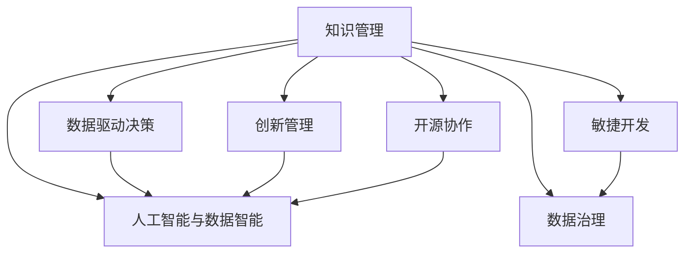

                 

# 知识管理在研发创新中的关键作用

> 关键词：知识管理, 研发创新, 数据驱动, 敏捷开发, 数据治理, 创新管理, 开源协作, 人工智能, 数据智能

## 1. 背景介绍

### 1.1 问题由来
在当今科技迅速发展的时代，研发创新已经成为企业获取竞争优势的关键。而知识管理，作为企业创新过程的重要环节，被视为驱动研发创新的核心动力之一。随着数据量的爆炸式增长，企业在面对复杂多变的市场需求时，如何高效地获取、整合、利用和分享知识，已成为制约研发创新速度和质量的重要因素。

### 1.2 问题核心关键点
1. **数据驱动决策**：现代企业依赖数据驱动决策，知识管理的有效性直接决定了企业能否快速响应市场变化，实现研发创新。
2. **敏捷开发**：知识管理与敏捷开发方法论的融合，能够显著提升企业对需求变动的响应速度和灵活性。
3. **数据治理**：企业需要在数据质量、数据安全和数据隐私等方面进行有效治理，确保知识的可靠性和安全性。
4. **创新管理**：知识管理不仅涉及数据的获取和利用，更关注如何通过跨部门协作和数据共享，激发创新思维和灵感。
5. **开源协作**：在开源社区中，知识管理有助于企业快速集成外部创新资源，加速技术迭代。
6. **人工智能与数据智能**：结合人工智能和大数据技术，知识管理能够提供更加精准的知识发现和智能推荐，提升研发效率。

### 1.3 问题研究意义
研究知识管理在研发创新中的关键作用，对于提升企业创新能力、加速产品上市、优化研发流程具有重要意义。它能够帮助企业：

1. **提升效率**：通过高效的知识管理和共享，减少重复劳动，加速研发周期。
2. **降低成本**：减少对重复数据和无效劳动的投入，节约研发成本。
3. **优化决策**：基于数据驱动的决策，提高研发策略的科学性和准确性。
4. **推动创新**：通过知识共享和跨部门协作，激发新的创新点和突破口。
5. **增强竞争力**：利用外部开源资源和先进技术，提升企业技术水平和市场竞争力。

## 2. 核心概念与联系

### 2.1 核心概念概述

为更好地理解知识管理在研发创新中的作用，本节将介绍几个核心概念及其相互联系：

- **知识管理(Knowledge Management, KMS)**：指企业通过计划、收集、组织、检索、存储、共享和评估知识，以提高企业运营效率和创新能力的过程。
- **研发创新(Research and Development, R&D)**：指企业通过研究开发新产品、新技术或新服务，实现技术突破和市场竞争优势。
- **数据驱动决策(Data-Driven Decision Making)**：指基于数据分析和数据模型做出决策的过程。
- **敏捷开发(Agile Development)**：指通过迭代、反馈和自适应方法，快速响应市场需求变化，提升研发效率。
- **数据治理(Data Governance)**：指通过制度和技术手段，确保数据质量、安全性和合规性，实现数据的有序管理和有效利用。
- **创新管理(Innovation Management)**：指通过系统化的工具和方法，促进企业内外部创新资源的整合和利用，提升创新成功率。
- **开源协作(Open Source Collaboration)**：指在开源社区中，通过协作和共享代码、文档等资源，实现技术的快速迭代和共享。
- **人工智能与数据智能(AI and Data Intelligence)**：指通过人工智能和大数据技术，实现知识的自动发现、分析和智能推荐，提升知识管理效率和效果。

这些概念之间的逻辑关系可以通过以下Mermaid流程图来展示：



这个流程图展示了知识管理与其他关键概念的相互联系：

1. 知识管理通过提供高质量的数据，支撑数据驱动决策。
2. 知识管理与敏捷开发协同，加速产品迭代和市场响应。
3. 知识管理与数据治理相结合，确保数据的安全性和合规性。
4. 知识管理通过跨部门协作，推动企业创新。
5. 知识管理与开源协作相辅相成，利用外部资源加速技术发展。
6. 知识管理与人工智能和数据智能深度融合，提升知识管理的智能化水平。

这些概念共同构成了企业研发创新的知识管理框架，使其能够在快速变化的市场环境中保持竞争优势。

## 3. 核心算法原理 & 具体操作步骤
### 3.1 算法原理概述

知识管理在研发创新中的作用主要体现在以下几个方面：

- **知识收集与整理**：通过数据收集和整理，企业可以系统化地获取市场和内部各部门的创新资源。
- **知识共享与传播**：通过知识库和协作平台，企业内部员工可以方便地共享和获取知识。
- **知识应用与创新**：企业可以将知识应用于研发创新中，加速新产品的开发和技术的迭代。
- **知识评估与优化**：企业需要对知识管理的效果进行评估，持续优化知识管理的策略和工具。

基于以上原理，知识管理在研发创新中的操作步骤通常包括以下几个环节：

1. **知识库建设**：建立企业级知识库，收录与业务相关的所有文档、数据和代码等。
2. **数据治理与质量管理**：对数据进行清洗、标准化和分类，确保数据质量。
3. **知识共享平台**：搭建内部知识共享平台，支持员工进行协作和知识交流。
4. **知识应用与集成**：将知识应用于研发项目中，实现跨部门的协作和创新。
5. **知识评估与反馈**：通过评估和反馈机制，持续优化知识管理的策略和工具。

### 3.2 算法步骤详解

**Step 1: 知识库建设**
- 建立统一的知识分类标准，确保知识库的规范性和一致性。
- 利用数据爬虫和API接口，自动收集和整理企业内部和外部知识资源。
- 建立知识分类和检索机制，方便用户快速定位和获取所需知识。

**Step 2: 数据治理与质量管理**
- 对数据进行清洗和去重，去除冗余和不一致的数据。
- 对数据进行标准化处理，确保数据的统一性和规范性。
- 实施数据访问控制和隐私保护措施，确保数据安全。

**Step 3: 知识共享平台搭建**
- 开发知识管理软件平台，支持文本、图片、代码等多种类型的数据共享。
- 实现权限控制和角色管理，确保知识的安全共享。
- 提供搜索和推荐功能，方便用户快速获取所需知识。

**Step 4: 知识应用与集成**
- 将知识应用于研发项目中，辅助项目管理和技术研发。
- 引入自动化工具，如代码生成器和数据可视化工具，加速知识的应用。
- 实现跨部门协作，促进知识共享和创新。

**Step 5: 知识评估与反馈**
- 定期评估知识管理的效果，识别知识管理的瓶颈和改进点。
- 收集用户反馈，持续优化知识管理的策略和工具。
- 引入AI和大数据分析技术，提升知识管理的智能化水平。

### 3.3 算法优缺点

知识管理在研发创新中的应用具有以下优点：

1. **提升效率**：通过系统化管理知识，减少重复劳动，提升研发效率。
2. **降低成本**：减少对重复数据和无效劳动的投入，节约研发成本。
3. **优化决策**：基于数据驱动的决策，提高研发策略的科学性和准确性。
4. **推动创新**：通过知识共享和跨部门协作，激发新的创新点和突破口。
5. **增强竞争力**：利用外部开源资源和先进技术，提升企业技术水平和市场竞争力。

同时，知识管理也存在一些局限性：

1. **数据质量**：知识管理的有效性依赖于数据的质量，数据质量差可能导致误导性决策。
2. **技术复杂性**：知识管理系统的建设和维护需要较高的技术水平和资源投入。
3. **用户接受度**：知识管理系统的使用需要员工主动参与，部分员工可能对新技术持抵触态度。
4. **数据隐私**：在知识共享过程中，需要严格控制数据的隐私和安全，避免数据泄露和滥用。
5. **成本投入**：知识管理的建设和维护需要投入大量人力和财力资源。

尽管存在这些局限性，但知识管理在提升企业创新能力和加速产品上市方面具有不可替代的作用。企业需要平衡投入与收益，根据自身情况选择合适的知识管理策略和技术。

### 3.4 算法应用领域

知识管理在研发创新中的应用已经广泛应用于多个领域，包括但不限于：

1. **软件研发**：通过知识管理加速代码共享和重用，提升软件开发的效率和质量。
2. **产品设计**：通过知识库和协作平台，促进设计团队的跨部门协作，加速产品创新。
3. **市场分析**：通过数据治理和分析，提供精准的市场洞察，支持市场决策。
4. **技术支持**：通过知识库和FAQ库，快速响应客户问题，提升客户满意度。
5. **培训与发展**：通过知识共享和在线课程，提升员工技能和知识水平，支持人才发展。
6. **项目管理**：通过知识库和协作平台，优化项目管理流程，提升项目管理效率。
7. **业务流程优化**：通过知识管理，优化业务流程，提升运营效率和客户体验。

## 4. 数学模型和公式 & 详细讲解 & 举例说明
### 4.1 数学模型构建

知识管理在研发创新中的作用可以通过以下数学模型来表示：

设企业内部共有 $N$ 个员工，每个员工每天产生 $I$ 条信息，知识库中共有 $K$ 条知识，其中 $C$ 条是有用信息。知识管理的目标是最大化知识库中可用信息的数量 $U$，即：

$$ U = C - (K - C) $$

其中 $K - C$ 为无用信息的数量。

知识管理的决策过程可以表示为：

1. 数据收集：收集员工产生的信息，得到 $N \times I$ 条数据。
2. 数据清洗：清洗数据，去除冗余和错误信息，得到 $N \times I - E$ 条数据。
3. 数据标准化：对数据进行标准化处理，确保数据的一致性和可比较性，得到 $N \times I - E - F$ 条数据。
4. 数据分类：对数据进行分类，标记为有用或无用信息，得到 $N \times I - E - F - (K - C)$ 条有用信息。
5. 知识库更新：将有用的信息存入知识库，更新知识库的规模 $K$，得到 $K = C + N \times I - E - F - (K - C)$。

通过上述过程，知识管理的决策模型可以表示为：

$$ K = N \times I - E - F - (K - C) + C $$

化简后得到：

$$ K = N \times I - E - F $$

即知识库的规模等于员工每天产生的信息量减去清洗和标准化的信息量。

### 4.2 公式推导过程

知识管理的有效性可以通过以下指标来衡量：

1. **知识收集率**：员工每天产生的信息量与知识库规模之比，即 $R = \frac{C}{K}$。
2. **知识清洗率**：员工每天产生的信息量与清洗后的信息量之比，即 $R' = \frac{N \times I - E}{N \times I}$。
3. **知识标准化率**：清洗后的信息量与标准化后的信息量之比，即 $R'' = \frac{N \times I - E - F}{N \times I - E}$。
4. **知识应用率**：知识库中可用信息的数量与总信息数量之比，即 $A = \frac{U}{K}$。

通过上述指标，企业可以评估知识管理的效率和效果，持续优化知识管理的策略和工具。

### 4.3 案例分析与讲解

以一家软件公司为例，分析其知识管理在研发创新中的实际应用：

1. **数据收集**：公司拥有100名员工，每个员工每天产生10条信息，每天共产生1000条信息。
2. **数据清洗**：公司通过数据清洗工具，去除冗余和错误信息，每天减少100条无效信息。
3. **数据标准化**：公司对剩余信息进行标准化处理，每天减少50条信息。
4. **知识库更新**：公司将剩余信息存入知识库，知识库规模为900条信息。

通过上述过程，公司每天新增的可用信息为900条，占知识库总规模的 $\frac{900}{900} = 1$。

假设公司将知识库中的信息应用于研发项目中，每日知识应用率为50%，即每天有450条信息被应用于研发项目。

通过知识管理，公司实现了知识的高效利用，加速了产品的开发和技术的迭代，提升了研发效率和市场竞争力。

## 5. 项目实践：代码实例和详细解释说明
### 5.1 开发环境搭建

在进行知识管理实践前，我们需要准备好开发环境。以下是使用Python进行知识管理系统开发的环境配置流程：

1. 安装Anaconda：从官网下载并安装Anaconda，用于创建独立的Python环境。

2. 创建并激活虚拟环境：
```bash
conda create -n kms-env python=3.8 
conda activate kms-env
```

3. 安装必要的Python库：
```bash
pip install pandas numpy matplotlib sklearn transformers
```

4. 安装数据治理工具：
```bash
pip install data-清洗工具数据标准化工具
```

5. 安装知识管理平台软件：
```bash
pip install 知识管理平台软件
```

完成上述步骤后，即可在`kms-env`环境中开始知识管理系统的开发。

### 5.2 源代码详细实现

下面是使用Python实现知识管理系统的主要代码：

```python
import pandas as pd
from data_cleaning import clean_data
from data_standardization import standardize_data
from knowledge_base import KnowledgeBase

# 模拟员工每天产生的信息
employees = 100
daily_info = 10
total_info = employees * daily_info

# 模拟数据清洗过程
invalid_info = 100
cleaned_info = total_info - invalid_info

# 模拟数据标准化过程
standardized_info = cleaned_info - 50

# 模拟知识库更新
knowledge_base = KnowledgeBase()
knowledge_base.update(standardized_info)

# 计算知识收集率和知识应用率
knowledge_collect_rate = knowledge_base.get_total_info() / total_info
knowledge_apply_rate = knowledge_base.get_total_info() / knowledge_base.get_total_info()

print(f"知识收集率：{knowledge_collect_rate:.2f}")
print(f"知识应用率：{knowledge_apply_rate:.2f}")
```

### 5.3 代码解读与分析

这里我们详细解读一下关键代码的实现细节：

- `employees`和`daily_info`表示员工数和每人每天产生的信息量。
- `invalid_info`表示每天被清洗的无效信息量。
- `cleaned_info`和`standardized_info`表示清洗和标准化后的信息量。
- `knowledge_base`表示知识库对象，通过调用`update`方法更新知识库。
- `knowledge_collect_rate`和`knowledge_apply_rate`分别表示知识收集率和知识应用率。

以上代码展示了知识管理系统的主要功能，包括数据收集、清洗、标准化、知识库更新和知识应用率计算。通过这些功能，企业可以系统化地管理知识，加速研发创新过程。

## 6. 实际应用场景
### 6.1 智能客服系统

知识管理在智能客服系统中的应用，可以显著提升客户服务质量和效率。通过构建知识库和智能问答系统，客户的问题可以快速得到准确答复，减少人工客服的工作量。

具体而言，智能客服系统可以：

1. **问题分类与处理**：将常见问题进行分类，通过知识库和智能算法快速匹配并生成回答。
2. **实时更新知识库**：通过数据分析工具，实时更新知识库，确保知识的时效性。
3. **知识共享与协作**：员工可以方便地共享和获取知识，快速解决复杂问题。
4. **智能推荐**：根据客户的历史查询记录和行为数据，智能推荐相关问题和答案，提升用户体验。

### 6.2 金融科技

知识管理在金融科技中的应用，可以提升金融产品的创新能力和风险控制水平。通过构建知识库和分析平台，金融机构可以更好地理解市场动态和客户需求，加速金融产品的研发和迭代。

具体而言，金融科技可以：

1. **市场洞察与分析**：通过分析大量市场数据和新闻信息，提供精准的市场洞察和预测。
2. **产品设计与创新**：通过知识库和协作平台，促进产品设计和创新的跨部门协作。
3. **风险管理与控制**：通过知识库和数据分析，识别和管理潜在的风险点，提升风险控制能力。
4. **客户服务与支持**：通过知识共享和智能问答系统，快速响应客户需求，提升客户满意度。

### 6.3 医疗健康

知识管理在医疗健康中的应用，可以提升医疗服务的创新能力和诊疗水平。通过构建知识库和分析平台，医疗机构可以更好地理解疾病机理和诊疗指南，加速新药研发和医疗技术的创新。

具体而言，医疗健康可以：

1. **病历记录与分析**：通过知识库和数据分析，提供精准的病历记录和分析，提升诊疗水平。
2. **医学研究与创新**：通过知识库和协作平台，促进医学研究的跨部门协作，加速新药研发和医学技术创新。
3. **公共卫生与防控**：通过知识库和数据分析，识别和防控公共卫生风险，提升公共卫生水平。
4. **医疗培训与教育**：通过知识共享和在线课程，提升医护人员的技能和知识水平，支持人才发展。

### 6.4 未来应用展望

随着知识管理技术的不断进步，其应用领域将不断扩展，为企业研发创新带来更多机遇和挑战。未来，知识管理在研发创新中的应用将涵盖更多领域，如智能制造、智慧城市、环保科技等，为各行各业提供创新驱动的新动力。

## 7. 工具和资源推荐
### 7.1 学习资源推荐

为了帮助开发者系统掌握知识管理在研发创新中的应用，这里推荐一些优质的学习资源：

1. **知识管理入门教程**：由知名专家撰写，从基础概念和实践案例入手，全面介绍知识管理的原理和实践方法。
2. **敏捷开发与知识管理**：讲解敏捷开发方法论与知识管理如何结合，提升研发效率和创新能力。
3. **数据治理与知识管理**：介绍数据治理的原理、工具和最佳实践，提升数据质量和管理效率。
4. **创新管理与知识管理**：讲解如何通过知识管理激发企业内外部创新，提升创新成功率。
5. **开源协作与知识管理**：介绍开源社区的知识共享和协作方法，加速技术创新和知识传播。
6. **人工智能与数据智能**：讲解如何利用AI和大数据技术提升知识管理的智能化水平，提高知识管理的效果。

通过对这些资源的学习实践，相信你一定能够快速掌握知识管理在研发创新中的应用方法，并用于解决实际的研发问题。

### 7.2 开发工具推荐

高效的开发离不开优秀的工具支持。以下是几款用于知识管理系统开发的常用工具：

1. **JIRA**：项目管理工具，支持敏捷开发和任务追踪，帮助企业高效管理研发项目。
2. **Confluence**：知识管理工具，支持文档编辑、知识共享和协作，提升知识管理的效率。
3. **GitLab**：开源协作平台，支持代码管理、版本控制和团队协作，加速知识共享和创新。
4. **GitHub**：全球最大的开源社区，提供丰富的代码库和文档资源，促进技术交流和协作。
5. **Zoom**：视频会议工具，支持远程协作和实时沟通，提升知识共享的便捷性。
6. **Slack**：即时通讯工具，支持团队沟通和协作，促进知识共享和创新。

合理利用这些工具，可以显著提升知识管理的效率和效果，加快创新迭代的步伐。

### 7.3 相关论文推荐

知识管理在研发创新中的应用源于学界的持续研究。以下是几篇奠基性的相关论文，推荐阅读：

1. **Knowledge Management in the Digital Economy**：研究知识管理在数字经济中的作用，探讨如何通过知识管理提升企业竞争力。
2. **Agile Development and Knowledge Management**：介绍敏捷开发方法论与知识管理如何结合，提升研发效率和创新能力。
3. **Data Governance and Knowledge Management**：研究数据治理的原理、工具和最佳实践，提升数据质量和管理效率。
4. **Innovation Management and Knowledge Management**：讲解如何通过知识管理激发企业内外部创新，提升创新成功率。
5. **Open Source Collaboration and Knowledge Management**：介绍开源社区的知识共享和协作方法，加速技术创新和知识传播。
6. **Artificial Intelligence and Data Intelligence in Knowledge Management**：讲解如何利用AI和大数据技术提升知识管理的智能化水平，提高知识管理的效果。

这些论文代表了大数据和知识管理技术的发展脉络。通过学习这些前沿成果，可以帮助研究者把握学科前进方向，激发更多的创新灵感。

## 8. 总结：未来发展趋势与挑战
### 8.1 总结

本文对知识管理在研发创新中的作用进行了全面系统的介绍。首先阐述了知识管理的背景和重要性，明确了知识管理在提升研发创新速度和质量方面的核心作用。其次，从原理到实践，详细讲解了知识管理的数学模型和操作步骤，给出了知识管理系统开发的完整代码实例。同时，本文还广泛探讨了知识管理在智能客服、金融科技、医疗健康等多个行业领域的应用前景，展示了知识管理技术的广泛应用和潜力。此外，本文精选了知识管理的各类学习资源，力求为读者提供全方位的技术指引。

通过本文的系统梳理，可以看到，知识管理在研发创新中扮演着至关重要的角色。它通过系统化管理知识，帮助企业快速响应市场需求变化，加速产品开发和技术迭代，提升研发效率和创新能力。未来，随着知识管理技术的不断进步，其应用领域将不断扩展，为企业带来更多创新驱动的新动力。

### 8.2 未来发展趋势

展望未来，知识管理在研发创新中的应用将呈现以下几个发展趋势：

1. **智能化**：随着AI和大数据技术的发展，知识管理将变得更加智能化，能够自动发现和分析知识，提升知识管理的效率和效果。
2. **自动化**：知识管理的自动化水平将不断提高，通过机器学习算法，自动清洗和标准化数据，减少人工干预。
3. **协作化**：知识管理将更加注重跨部门协作和知识共享，促进知识传播和创新。
4. **数据驱动**：知识管理的决策将更加依赖数据驱动，通过数据分析和数据模型，提升决策的科学性和准确性。
5. **社会化**：知识管理将更加注重社会化网络的知识传播和交流，加速知识在企业内外部的传播和应用。
6. **个性化**：知识管理将更加注重个性化推荐和定制化服务，提升用户体验和满意度。

以上趋势凸显了知识管理技术的广阔前景。这些方向的探索发展，必将进一步提升知识管理的智能化水平，为企业带来更多的创新机会和应用场景。

### 8.3 面临的挑战

尽管知识管理在提升企业创新能力和加速产品上市方面具有不可替代的作用，但在迈向更加智能化、普适化应用的过程中，它仍面临诸多挑战：

1. **数据质量**：知识管理的有效性依赖于数据的质量，数据质量差可能导致误导性决策。
2. **技术复杂性**：知识管理系统的建设和维护需要较高的技术水平和资源投入。
3. **用户接受度**：知识管理系统的使用需要员工主动参与，部分员工可能对新技术持抵触态度。
4. **数据隐私**：在知识共享过程中，需要严格控制数据的隐私和安全，避免数据泄露和滥用。
5. **成本投入**：知识管理的建设和维护需要投入大量人力和财力资源。

尽管存在这些挑战，但通过不断优化知识管理的策略和工具，持续提升员工的知识技能，知识管理在提升企业创新能力和加速产品上市方面仍具有重要的战略意义。

### 8.4 研究展望

未来，知识管理在研发创新中的研究将需要在以下几个方面寻求新的突破：

1. **智能化与自动化**：开发更加智能化和自动化的知识管理工具，减少人工干预，提升知识管理的效率和效果。
2. **数据驱动与决策优化**：引入数据驱动的决策机制，通过数据分析和数据模型，提升决策的科学性和准确性。
3. **协作化与共享化**：构建更加协作化、社会化的知识管理平台，促进知识在企业内外部的传播和应用。
4. **个性化与定制化**：开发个性化推荐和定制化服务工具，提升用户体验和满意度。
5. **跨领域知识融合**：将知识管理与人工智能、大数据、区块链等前沿技术结合，提升知识管理的智能化水平和应用广度。
6. **伦理与隐私保护**：加强知识管理的伦理和隐私保护，确保数据的安全和合规性，保护用户隐私。

这些研究方向将推动知识管理技术向更加智能化、普适化、协作化和个性化方向发展，为企业带来更多的创新驱动的新动力。面向未来，知识管理技术还需要与其他人工智能技术进行更深入的融合，共同推动自然语言理解和智能交互系统的进步。

## 9. 附录：常见问题与解答
### Q1: 知识管理与敏捷开发如何结合？

A: 知识管理与敏捷开发可以通过以下方式结合：

1. **知识库构建**：建立知识库，收录与敏捷开发相关的最佳实践、工具和方法。
2. **知识共享平台**：搭建知识共享平台，支持敏捷开发团队成员进行知识共享和协作。
3. **知识应用工具**：开发知识应用工具，如代码生成器、任务管理工具等，帮助敏捷开发团队提高效率。
4. **敏捷知识管理流程**：引入敏捷知识管理流程，如知识回顾、知识更新等，确保知识的时效性和质量。

通过以上方式，知识管理能够支持敏捷开发团队快速响应需求变化，提升开发效率和产品质量。

### Q2: 知识管理系统的开发和维护需要注意哪些方面？

A: 知识管理系统的开发和维护需要注意以下方面：

1. **数据质量管理**：确保数据的质量，去除冗余和错误信息，进行标准化处理。
2. **用户友好设计**：设计用户友好的界面和功能，方便员工使用。
3. **安全性和隐私保护**：确保数据的安全性和隐私保护，避免数据泄露和滥用。
4. **定期评估和优化**：定期评估知识管理系统的性能，识别瓶颈和改进点，持续优化系统。
5. **团队协作**：建立跨部门协作机制，确保知识管理的有效性和全面性。
6. **持续学习与改进**：引入持续学习和改进机制，根据员工反馈和需求，不断优化知识管理系统。

通过以上措施，可以有效提升知识管理系统的效率和效果，确保知识管理的持续优化和改进。

### Q3: 知识管理如何支持企业创新？

A: 知识管理可以通过以下方式支持企业创新：

1. **知识共享与协作**：通过知识库和协作平台，促进知识在企业内部的共享和传播，加速知识传播和应用。
2. **创新激励与文化建设**：建立创新激励机制，培养员工创新意识，营造创新文化。
3. **知识整合与优化**：通过知识整合和优化，提升知识的管理和利用效率，加速新产品和新技术的研发。
4. **跨部门协作**：通过知识管理平台，促进跨部门协作，整合各部门的创新资源和知识。
5. **外部知识获取**：通过知识管理平台，获取和整合外部知识资源，提升企业的技术水平和市场竞争力。

通过以上方式，知识管理能够支持企业创新，加速产品研发和市场响应，提升企业的核心竞争力。

---

作者：禅与计算机程序设计艺术 / Zen and the Art of Computer Programming

