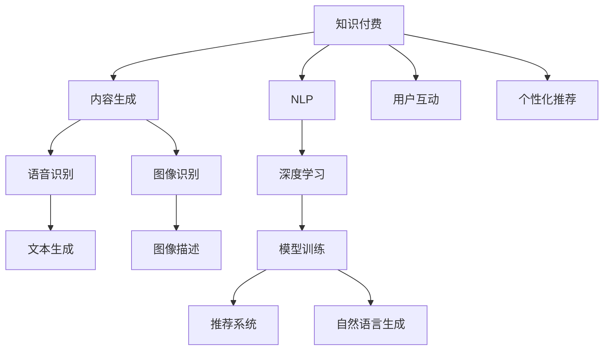

                 

# 知识经济下知识付费的人工智能内容生成技术

> 关键词：知识付费, 人工智能, 内容生成, 自然语言处理(NLP), 深度学习, 语音识别, 图像识别

## 1. 背景介绍

在知识经济时代，信息的传播方式正经历着翻天覆地的变化。随着互联网技术的普及，海量的信息被源源不断地生产出来，如何高效地检索、筛选、整合这些信息，并针对用户需求进行定制化内容生成，成为了信息时代的一个重要课题。

### 1.1 问题由来

知识付费作为一种新兴的商业模式，通过提供高质量、系统化的内容，吸引用户付费订阅，成为了内容生产者获取收入的重要渠道。然而，随着用户需求日益多样化和个性化，传统的内容生产方式难以满足用户日益增长的需求。人工智能(AI)技术，尤其是自然语言处理(NLP)和深度学习等领域的突破，为内容生成提供了新的可能。

### 1.2 问题核心关键点

- **内容生成**：如何利用AI技术，自动生成符合用户需求的内容。
- **个性化推荐**：如何根据用户偏好，推荐高质量、个性化的内容。
- **知识付费**：如何将内容生成技术商业化，实现知识变现。
- **用户互动**：如何通过内容生成技术提升用户互动和参与度。
- **模型训练**：如何高效、准确地训练内容生成模型，实现高质量内容的输出。

这些关键点共同构成了知识付费领域对AI内容生成技术的需求，驱动了相关研究的不断深入。

## 2. 核心概念与联系

### 2.1 核心概念概述

- **知识付费**：指用户为获取高质量、系统化的内容而支付费用的商业模式。
- **人工智能(AI)**：通过计算机算法模拟人类智能的技术体系，涵盖机器学习、深度学习、自然语言处理等领域。
- **内容生成**：自动生成文本、语音、图像等内容的过程，涵盖自然语言生成(NLG)、语音合成、图像描述等任务。
- **自然语言处理(NLP)**：研究计算机如何理解、处理和生成人类语言的技术。
- **深度学习**：一种基于神经网络的机器学习技术，通过多层神经元模拟人类大脑的工作方式。
- **语音识别**：将人类语音转换为文本的技术。
- **图像识别**：将图像转换为计算机可读格式的技术。

这些核心概念之间的逻辑关系可以通过以下Mermaid流程图来展示：



这个流程图展示了一个典型的知识付费应用场景，其中：

- 知识付费服务通过AI技术生成高质量内容，吸引用户订阅。
- 语音识别和图像识别技术使内容更加丰富多样。
- 深度学习算法训练高效的模型，实现内容自动生成。
- 用户互动和个性化推荐提升用户体验和满意度。

## 3. 核心算法原理 & 具体操作步骤
### 3.1 算法原理概述

AI内容生成技术主要基于深度学习，特别是循环神经网络(RNN)和变分自编码器(VAE)等模型。其核心原理是通过大量标注数据进行模型训练，学习生成特定类型的文本、语音或图像等内容。

对于文本生成任务，常见的方法包括：

- 序列到序列(Sequence-to-Sequence, Seq2Seq)模型：通过编码器将输入序列映射为中间表示，再通过解码器生成输出序列。
- 注意力机制(Attention)：帮助解码器关注输入序列中的重要部分，提高生成质量。
- 语言模型(Language Model)：基于给定前文预测后续词的概率分布，训练生成模型。

### 3.2 算法步骤详解

#### 3.2.1 数据准备

1. **数据收集**：从各种渠道收集大量标注数据，如书籍、文章、新闻、论坛帖子等。
2. **数据清洗**：处理数据中的噪声和错误，确保数据质量和一致性。
3. **数据划分**：将数据划分为训练集、验证集和测试集，确保模型在不同数据集上的泛化性能。

#### 3.2.2 模型设计

1. **选择模型架构**：根据任务需求选择合适的模型架构，如LSTM、GRU、Transformer等。
2. **确定参数设置**：设置模型的超参数，如学习率、批量大小、训练轮数等。
3. **选择合适的损失函数**：如交叉熵损失、均方误差损失等，用于衡量模型输出与真实标签之间的差异。

#### 3.2.3 模型训练

1. **搭建训练环境**：选择合适的深度学习框架，如TensorFlow、PyTorch等，搭建训练环境。
2. **编写训练代码**：根据选择的模型架构和超参数，编写训练代码。
3. **模型训练**：在训练集上使用反向传播算法训练模型，最小化损失函数。
4. **模型验证**：在验证集上评估模型性能，防止过拟合。
5. **模型测试**：在测试集上进一步评估模型性能，确保模型泛化能力。

#### 3.2.4 模型优化

1. **超参数调优**：使用网格搜索、随机搜索等方法优化超参数。
2. **模型剪枝**：去除不必要的神经元或层，减小模型尺寸，提高推理速度。
3. **模型融合**：将多个模型进行集成，提升生成效果。

### 3.3 算法优缺点

**优点**：

- 内容生成速度快，可以实时生成文本、语音、图像等内容。
- 生成内容质量高，能够模仿人类语言风格，生成连贯、自然的内容。
- 能够根据用户偏好生成个性化内容，提升用户体验。
- 减少内容生产成本，提高知识付费平台的内容供应效率。

**缺点**：

- 依赖高质量标注数据，数据收集和清洗成本高。
- 模型复杂，训练和推理计算资源消耗大。
- 生成内容可能缺乏创意，缺乏人类作者的深度思考。
- 生成内容的版权和道德问题，可能存在版权纠纷和伦理争议。

### 3.4 算法应用领域

基于深度学习的AI内容生成技术，已经在多个领域得到应用，包括：

- **知识付费平台**：通过AI技术生成课程、文章、解答等高质量内容，吸引用户订阅。
- **在线教育**：生成个性化的学习材料，提升学习效果。
- **新闻媒体**：自动生成新闻报道、分析文章，提高内容输出效率。
- **广告创意**：生成有创意的营销文案、广告视频，吸引用户关注。
- **客服自动化**：生成自动回复内容，提升客户服务效率。
- **游戏和娱乐**：生成故事情节、角色对话，丰富游戏和影视内容。

## 4. 数学模型和公式 & 详细讲解 & 举例说明

### 4.1 数学模型构建

对于文本生成任务，我们以Seq2Seq模型为例，构建其数学模型。

设输入序列为 $x=\{x_1, x_2, ..., x_n\}$，输出序列为 $y=\{y_1, y_2, ..., y_m\}$。模型的目标是最小化损失函数：

$$
\mathcal{L}(\theta) = -\sum_{i=1}^{n} \log P_{\theta}(y_i | x_{1:i})
$$

其中 $\theta$ 为模型参数，$P_{\theta}(y_i | x_{1:i})$ 为给定前文 $x_{1:i}$ 的条件下生成 $y_i$ 的概率分布。

### 4.2 公式推导过程

假设我们使用LSTM模型作为编码器，将输入序列 $x$ 映射为中间表示 $h$，使用RNN模型作为解码器，生成输出序列 $y$。则模型的前向传播过程为：

1. 编码器：将输入序列 $x$ 转换为中间表示 $h$。
   $$
   h_t = f(x_t, h_{t-1})
   $$
   其中 $f$ 为LSTM等非线性变换函数，$h_t$ 为时刻 $t$ 的隐藏状态。

2. 解码器：根据中间表示 $h$ 生成输出序列 $y$。
   $$
   y_t = g(h_t)
   $$
   其中 $g$ 为非线性变换函数，$y_t$ 为时刻 $t$ 的输出。

3. 损失函数：使用交叉熵损失函数衡量模型输出与真实标签之间的差异。
   $$
   \mathcal{L}(\theta) = -\sum_{i=1}^{n} \sum_{j=1}^{m} y_j \log P_{\theta}(y_j | y_1, ..., y_{j-1}, x_1, ..., x_n)
   $$

通过反向传播算法，计算损失函数对模型参数 $\theta$ 的梯度，使用优化算法如AdamW、SGD等更新参数，最小化损失函数。

### 4.3 案例分析与讲解

以Seq2Seq模型在文本生成任务中的应用为例，以下是具体的实现步骤：

1. **数据准备**：收集大量文本数据，如书籍、文章、新闻等，并进行预处理。
2. **模型选择**：选择LSTM或GRU作为编码器，RNN作为解码器，构建Seq2Seq模型。
3. **参数设置**：设置模型超参数，如学习率、批量大小、训练轮数等。
4. **模型训练**：在训练集上使用反向传播算法训练模型，最小化损失函数。
5. **模型验证**：在验证集上评估模型性能，防止过拟合。
6. **模型测试**：在测试集上进一步评估模型性能，确保模型泛化能力。

下面是一个简单的PyTorch代码示例：

```python
import torch
import torch.nn as nn
import torch.optim as optim

# 定义模型架构
class Seq2Seq(nn.Module):
    def __init__(self, input_size, hidden_size, output_size):
        super(Seq2Seq, self).__init__()
        self.encoder = nn.LSTM(input_size, hidden_size)
        self.decoder = nn.LSTM(hidden_size, hidden_size, batch_first=True)
        self.output = nn.Linear(hidden_size, output_size)
    
    def forward(self, input, target):
        # 编码器
        encoder_output, encoder_hidden = self.encoder(input)
        # 解码器
        decoder_output, decoder_hidden = self.decoder(encoder_output, encoder_hidden)
        # 输出层
        output = self.output(decoder_output)
        return output, decoder_hidden

# 定义训练函数
def train(model, input, target, loss_fn, optimizer):
    model.train()
    optimizer.zero_grad()
    output, decoder_hidden = model(input, target)
    loss = loss_fn(output, target)
    loss.backward()
    optimizer.step()
    return loss.item()

# 训练模型
model = Seq2Seq(input_size, hidden_size, output_size)
criterion = nn.CrossEntropyLoss()
optimizer = optim.Adam(model.parameters(), lr=0.001)

for epoch in range(epochs):
    for i in range(batch_size):
        input, target = ...
        loss = train(model, input, target, criterion, optimizer)
        print(f"Epoch {epoch+1}, Batch {i+1}, Loss: {loss:.3f}")
```

## 5. 项目实践：代码实例和详细解释说明
### 5.1 开发环境搭建

在进行AI内容生成项目开发前，我们需要准备好开发环境。以下是使用Python进行PyTorch开发的环境配置流程：

1. 安装Anaconda：从官网下载并安装Anaconda，用于创建独立的Python环境。

2. 创建并激活虚拟环境：
```bash
conda create -n pytorch-env python=3.8 
conda activate pytorch-env
```

3. 安装PyTorch：根据CUDA版本，从官网获取对应的安装命令。例如：
```bash
conda install pytorch torchvision torchaudio cudatoolkit=11.1 -c pytorch -c conda-forge
```

4. 安装TensorFlow：
```bash
pip install tensorflow
```

5. 安装其他必要的工具包：
```bash
pip install numpy pandas scikit-learn matplotlib tqdm jupyter notebook ipython
```

完成上述步骤后，即可在`pytorch-env`环境中开始项目开发。

### 5.2 源代码详细实现

下面以Seq2Seq模型在文本生成任务中的应用为例，给出完整的PyTorch代码实现。

首先，定义模型架构：

```python
import torch
import torch.nn as nn

class Seq2Seq(nn.Module):
    def __init__(self, input_size, hidden_size, output_size):
        super(Seq2Seq, self).__init__()
        self.encoder = nn.LSTM(input_size, hidden_size)
        self.decoder = nn.LSTM(hidden_size, hidden_size, batch_first=True)
        self.output = nn.Linear(hidden_size, output_size)
    
    def forward(self, input, target):
        encoder_output, encoder_hidden = self.encoder(input)
        decoder_output, decoder_hidden = self.decoder(encoder_output, encoder_hidden)
        output = self.output(decoder_output)
        return output, decoder_hidden
```

然后，定义训练函数：

```python
def train(model, input, target, loss_fn, optimizer):
    model.train()
    optimizer.zero_grad()
    output, decoder_hidden = model(input, target)
    loss = loss_fn(output, target)
    loss.backward()
    optimizer.step()
    return loss.item()
```

最后，进行模型训练：

```python
input_size = ...
hidden_size = ...
output_size = ...

model = Seq2Seq(input_size, hidden_size, output_size)
criterion = nn.CrossEntropyLoss()
optimizer = optim.Adam(model.parameters(), lr=0.001)

for epoch in range(epochs):
    for i in range(batch_size):
        input, target = ...
        loss = train(model, input, target, criterion, optimizer)
        print(f"Epoch {epoch+1}, Batch {i+1}, Loss: {loss:.3f}")
```

### 5.3 代码解读与分析

让我们再详细解读一下关键代码的实现细节：

**Seq2Seq类**：
- `__init__`方法：定义模型参数和结构，包括编码器、解码器和输出层。
- `forward`方法：实现前向传播过程，计算模型输出。

**train函数**：
- 将模型设置为训练模式。
- 使用Adam优化器进行梯度更新。
- 计算损失函数，并使用反向传播算法更新模型参数。

**训练循环**：
- 在每个epoch内，对每个batch进行训练。
- 记录训练损失，并在每个epoch结束时输出。

## 6. 实际应用场景
### 6.1 知识付费平台

基于AI内容生成技术，知识付费平台可以大幅提升内容生成效率，满足用户多样化的需求。具体而言，知识付费平台可以使用自动生成工具，根据用户订阅的主题和偏好，生成个性化课程、文章、解答等内容。这些内容可以用于提升用户满意度，增强平台粘性。

### 6.2 在线教育

在线教育平台可以利用AI技术，生成个性化学习材料，如练习题、教学视频、互动课程等，提升学习效果。例如，可以根据学生的学习进度和知识掌握情况，生成针对性的习题和复习材料。

### 6.3 新闻媒体

新闻媒体可以通过AI技术生成新闻报道、分析文章等，提高内容输出效率。例如，可以使用自动摘要技术，生成新闻文章的简短摘要，帮助用户快速了解新闻内容。

### 6.4 广告创意

广告创意生成是AI技术的重要应用场景之一。通过AI技术，可以自动生成有创意的营销文案、广告视频等，吸引用户关注。例如，可以基于用户浏览历史和行为数据，生成个性化的广告内容。

### 6.5 客服自动化

客服自动化是AI技术的另一重要应用场景。通过AI技术，可以自动生成自动回复内容，提升客户服务效率。例如，可以基于用户咨询的主题，生成合适的回复内容，减轻客服人员的工作负担。

### 6.6 游戏和娱乐

游戏和娱乐领域可以利用AI技术生成故事情节、角色对话等，丰富游戏和影视内容。例如，可以基于用户的选择和行为，生成个性化的故事情节和角色对话，提升用户沉浸感。

## 7. 工具和资源推荐
### 7.1 学习资源推荐

为了帮助开发者系统掌握AI内容生成技术的理论基础和实践技巧，这里推荐一些优质的学习资源：

1. **《深度学习》书籍**：Ian Goodfellow等人所著，全面介绍了深度学习的基本概念和算法。
2. **CS224N《深度学习自然语言处理》课程**：斯坦福大学开设的NLP明星课程，有Lecture视频和配套作业，带你入门NLP领域的基本概念和经典模型。
3. **《Transformer from Zero》系列博文**：由大模型技术专家撰写，深入浅出地介绍了Transformer原理、BERT模型、微调技术等前沿话题。
4. **《Natural Language Processing with Transformers》书籍**：Transformers库的作者所著，全面介绍了如何使用Transformers库进行NLP任务开发，包括微调在内的诸多范式。
5. **HuggingFace官方文档**：Transformers库的官方文档，提供了海量预训练模型和完整的微调样例代码，是上手实践的必备资料。
6. **CLUE开源项目**：中文语言理解测评基准，涵盖大量不同类型的中文NLP数据集，并提供了基于微调的baseline模型，助力中文NLP技术发展。

通过对这些资源的学习实践，相信你一定能够快速掌握AI内容生成技术的精髓，并用于解决实际的NLP问题。

### 7.2 开发工具推荐

高效的开发离不开优秀的工具支持。以下是几款用于AI内容生成开发的常用工具：

1. **PyTorch**：基于Python的开源深度学习框架，灵活动态的计算图，适合快速迭代研究。大部分预训练语言模型都有PyTorch版本的实现。
2. **TensorFlow**：由Google主导开发的开源深度学习框架，生产部署方便，适合大规模工程应用。同样有丰富的预训练语言模型资源。
3. **Transformers库**：HuggingFace开发的NLP工具库，集成了众多SOTA语言模型，支持PyTorch和TensorFlow，是进行内容生成任务开发的利器。
4. **Weights & Biases**：模型训练的实验跟踪工具，可以记录和可视化模型训练过程中的各项指标，方便对比和调优。与主流深度学习框架无缝集成。
5. **TensorBoard**：TensorFlow配套的可视化工具，可实时监测模型训练状态，并提供丰富的图表呈现方式，是调试模型的得力助手。
6. **Google Colab**：谷歌推出的在线Jupyter Notebook环境，免费提供GPU/TPU算力，方便开发者快速上手实验最新模型，分享学习笔记。

合理利用这些工具，可以显著提升AI内容生成任务的开发效率，加快创新迭代的步伐。

### 7.3 相关论文推荐

AI内容生成技术的发展源于学界的持续研究。以下是几篇奠基性的相关论文，推荐阅读：

1. **Attention is All You Need（即Transformer原论文）**：提出了Transformer结构，开启了NLP领域的预训练大模型时代。
2. **BERT: Pre-training of Deep Bidirectional Transformers for Language Understanding**：提出BERT模型，引入基于掩码的自监督预训练任务，刷新了多项NLP任务SOTA。
3. **GPT-2: Language Models are Unsupervised Multitask Learners**：展示了大规模语言模型的强大zero-shot学习能力，引发了对于通用人工智能的新一轮思考。
4. **Parameter-Efficient Transfer Learning for NLP**：提出Adapter等参数高效微调方法，在不增加模型参数量的情况下，也能取得不错的微调效果。
5. **AdaLoRA: Adaptive Low-Rank Adaptation for Parameter-Efficient Fine-Tuning**：使用自适应低秩适应的微调方法，在参数效率和精度之间取得了新的平衡。
6. **Prompt-based Learning**：引入基于连续型Prompt的微调范式，为如何充分利用预训练知识提供了新的思路。

这些论文代表了大模型内容生成技术的发展脉络。通过学习这些前沿成果，可以帮助研究者把握学科前进方向，激发更多的创新灵感。

## 8. 总结：未来发展趋势与挑战
### 8.1 总结

本文对基于深度学习的AI内容生成技术进行了全面系统的介绍。首先阐述了AI内容生成技术在知识经济下的重要性和应用背景，明确了其在大语言模型微调领域的独特价值。其次，从原理到实践，详细讲解了Seq2Seq模型的核心算法原理和具体操作步骤，给出了代码实例和详细解释说明。同时，本文还广泛探讨了AI内容生成技术在知识付费、在线教育、新闻媒体、广告创意、客服自动化、游戏娱乐等多个领域的应用前景，展示了其广阔的应用空间。此外，本文精选了相关学习资源、开发工具和相关论文，力求为读者提供全方位的技术指引。

通过本文的系统梳理，可以看到，基于深度学习的AI内容生成技术正在成为AI领域的重要范式，极大地拓展了预训练语言模型的应用边界，催生了更多的落地场景。受益于大规模语料的预训练和深度学习算法的突破，AI内容生成技术能够生成高质量、多样化的内容，极大地提升了用户满意度和平台粘性。未来，伴随技术的不断演进，AI内容生成技术将不断拓展应用范围，成为知识经济时代的重要支撑。

### 8.2 未来发展趋势

展望未来，AI内容生成技术将呈现以下几个发展趋势：

1. **生成质量提升**：通过引入更加复杂的模型架构和优化技术，生成内容的质量将进一步提升，更加连贯、自然、丰富。
2. **多样化内容生成**：除了文本生成，AI内容生成技术将拓展到语音、图像、视频等多模态内容生成，形成更为丰富的表达形式。
3. **个性化推荐增强**：通过更加智能的推荐算法，根据用户行为和偏好，生成更加个性化的内容，提升用户体验。
4. **跨领域知识融合**：通过与其他AI技术（如知识图谱、因果推理等）的融合，生成更加全面、准确的内容。
5. **互动性提升**：通过增强用户互动，生成更加符合用户需求的内容，提升用户参与度和满意度。
6. **实时生成能力增强**：通过模型优化和硬件加速，提高实时生成能力，实现更加灵活的应用场景。

以上趋势凸显了AI内容生成技术的广阔前景。这些方向的探索发展，必将进一步提升AI内容生成技术的性能和应用范围，为知识经济时代的数字化转型提供新的动力。

### 8.3 面临的挑战

尽管AI内容生成技术已经取得了瞩目成就，但在迈向更加智能化、普适化应用的过程中，它仍面临着诸多挑战：

1. **生成内容质量**：虽然生成内容的质量已经显著提升，但仍可能存在语法错误、逻辑漏洞等问题，需要通过进一步优化提高。
2. **版权和伦理问题**：生成内容的版权归属和伦理问题仍需深入研究，确保生成内容的合法性和道德性。
3. **用户交互体验**：如何增强用户互动和反馈机制，使得生成内容更加符合用户需求，仍需不断探索。
4. **数据隐私保护**：在内容生成过程中，如何保护用户隐私和数据安全，避免数据泄露和滥用，是一个重要课题。
5. **计算资源消耗**：生成高质量内容需要大量的计算资源，如何降低计算成本，提高模型效率，是未来的重要研究方向。

### 8.4 研究展望

面对AI内容生成技术所面临的种种挑战，未来的研究需要在以下几个方面寻求新的突破：

1. **多模态内容生成**：通过引入视觉、语音等多模态信息，提高内容生成效果。
2. **生成内容质量提升**：通过引入更加复杂的模型和优化技术，提升生成内容的自然度和连贯性。
3. **知识图谱融合**：将知识图谱与深度学习模型结合，生成更加全面、准确的内容。
4. **跨领域应用扩展**：将AI内容生成技术应用于更多领域，如医疗、金融、教育等，解决实际问题。
5. **实时生成能力增强**：通过模型优化和硬件加速，提高实时生成能力，实现更加灵活的应用场景。

这些研究方向的探索，必将引领AI内容生成技术迈向更高的台阶，为知识经济时代的数字化转型提供新的动力。面向未来，AI内容生成技术还需要与其他AI技术进行更深入的融合，如知识表示、因果推理、强化学习等，多路径协同发力，共同推动自然语言理解和智能交互系统的进步。只有勇于创新、敢于突破，才能不断拓展AI内容生成技术的边界，让智能技术更好地造福人类社会。

## 9. 附录：常见问题与解答

**Q1：AI内容生成是否适用于所有应用场景？**

A: AI内容生成技术可以在许多应用场景中发挥重要作用，但并非适用于所有场景。对于一些需要深度人类理解和创造力的任务，如复杂的艺术创作、医学诊断等，AI生成内容仍存在局限性。在这些场景中，可能需要结合人类专家的经验和智慧，共同完成高质量内容的生成。

**Q2：如何提高AI内容生成的质量？**

A: 提高AI内容生成的质量需要从多个方面入手：
1. 数据质量：确保训练数据的丰富性和多样性，提高模型的泛化能力。
2. 模型架构：选择更复杂的模型架构，如Transformer、GPT等，提升生成效果。
3. 优化算法：使用更加高效的优化算法，如Adam、Adafactor等，加快模型训练。
4. 数据增强：通过数据增强技术，如回译、近义替换等，提高生成内容的丰富度。

**Q3：如何应对AI内容生成的版权和伦理问题？**

A: 应对AI内容生成的版权和伦理问题，需要从以下几个方面入手：
1. 明确版权归属：在使用生成内容时，明确版权归属，避免侵权问题。
2. 遵守伦理规范：确保生成内容符合伦理规范，不传播有害信息，不侵犯个人隐私。
3. 用户反馈机制：建立用户反馈机制，及时处理用户投诉和问题。
4. 合规审核：加强内容合规审核，确保生成内容符合法律法规要求。

**Q4：如何降低AI内容生成的计算资源消耗？**

A: 降低AI内容生成的计算资源消耗需要从以下几个方面入手：
1. 模型优化：通过模型剪枝、量化加速等技术，降低计算成本。
2. 分布式训练：使用分布式训练技术，加快模型训练速度。
3. 硬件加速：使用GPU、TPU等硬件设备进行加速，提升计算效率。
4. 模型压缩：使用模型压缩技术，减小模型尺寸，降低存储和传输开销。

通过不断优化算法和硬件设施，AI内容生成技术可以在保持高质量的同时，降低计算资源消耗，实现更加灵活、高效的应用。

---

作者：禅与计算机程序设计艺术 / Zen and the Art of Computer Programming

