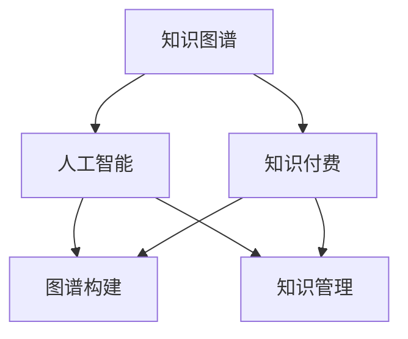

                 

# 知识经济下知识付费的人工智能知识图谱构建

> 关键词：知识图谱, 知识付费, 人工智能, 图谱构建, 数据驱动, 知识管理, 应用场景

## 1. 背景介绍

### 1.1 问题由来

随着互联网的迅猛发展和信息技术的不断进步，知识经济正逐渐成为推动全球经济增长的新引擎。在知识经济时代，信息、知识成为核心资源，知识付费成为了获取优质信息、知识的重要方式。人工智能(AI)技术的广泛应用，更是为知识付费的模式创新提供了新的契机。

在知识付费领域，传统的信息检索、内容推荐等技术已难以满足用户对知识深度、个性化、精准化的需求。近年来，人工智能知识图谱的构建，为知识付费带来了新的思路。通过构建知识图谱，可以有效整合知识资源，实现深度关联分析，提升知识检索和推荐的准确性和效率，提供个性化、智能化的知识服务。

### 1.2 问题核心关键点

知识图谱（Knowledge Graph）是一种结构化的语义知识表示方法，将现实世界中的实体、关系和属性等知识进行有机的组织，形成具有高度关联性的知识网络。在知识付费领域，构建高质量的知识图谱，不仅可以帮助用户快速获取到有价值的信息，还能通过深度学习、自然语言处理等技术，为用户提供更为精准的知识推荐服务。

知识图谱的构建涉及实体识别、关系抽取、属性填充等步骤，需要大量结构化数据和非结构化数据作为支撑。这些数据主要来源于互联网上的知识资源，包括学术论文、图书、百科、新闻、社区、博客等。在实际应用中，还需要考虑数据隐私、数据质量、数据更新等问题。

## 2. 核心概念与联系

### 2.1 核心概念概述

为更好地理解人工智能知识图谱在知识付费中的应用，本节将介绍几个密切相关的核心概念：

- **知识图谱(Knowledge Graph)**：一种结构化的语义知识表示方法，将现实世界中的实体、关系和属性等知识进行有机的组织，形成具有高度关联性的知识网络。
- **知识付费(Knowledge Paying)**：以付费形式提供深度知识、专业知识、技能培训等内容，满足用户对知识深度、个性化、精准化的需求。
- **人工智能(AI)**：利用计算机算法模拟人类智能行为的技术，包括机器学习、深度学习、自然语言处理等，为知识图谱的构建和知识付费应用提供技术支持。
- **图谱构建**：将大量非结构化数据转换为结构化的知识图谱，通过实体识别、关系抽取、属性填充等步骤，构建出具有高度关联性的知识网络。
- **知识管理**：对知识资源进行有效的组织、管理和应用，实现知识的深度关联和智能应用，提升知识服务的精准性和效率。

这些核心概念之间的逻辑关系可以通过以下Mermaid流程图来展示：



这个流程图展示了两者的核心概念及其之间的关系：

1. 知识图谱通过人工智能技术构建，具有高度关联性的知识网络。
2. 知识付费应用基于知识图谱，提供精准、智能的知识服务。
3. 知识图谱构建需要大量数据，而知识管理技术可以帮助更好地管理和应用这些数据。

## 3. 核心算法原理 & 具体操作步骤
### 3.1 算法原理概述

人工智能知识图谱的构建，本质上是将非结构化数据转换为结构化知识的过程。其核心算法主要包括实体识别、关系抽取、属性填充等步骤。在知识付费领域，这些步骤需要考虑数据隐私、数据质量、数据更新等问题，同时需要与用户交互，以获取更多的知识信息。

- **实体识别(Entity Recognition)**：从文本中识别出具体的实体，如人名、地名、组织机构名等。这是构建知识图谱的基础步骤，通过自然语言处理技术（如命名实体识别NER），可以识别出文本中的实体。

- **关系抽取(Relationship Extraction)**：确定实体之间的关系，如父子、同位、反义等。关系抽取可以通过分析句子结构、上下文语义等信息，构建实体之间的关联关系。

- **属性填充(Attribute Filling)**：为实体添加属性信息，如实体类型、时间、地点等。属性填充通过信息抽取、知识推理等技术，为实体提供更多背景信息。

### 3.2 算法步骤详解

人工智能知识图谱构建的详细步骤主要包括以下几个方面：

1. **数据收集**：从互联网上的知识资源中收集非结构化数据，包括学术论文、图书、百科、新闻、社区、博客等。数据来源需要经过严格筛选，确保数据质量。

2. **实体识别**：使用命名实体识别（NER）技术，从文本中识别出实体，并将实体映射到知识图谱中的节点。

3. **关系抽取**：通过语义分析、知识推理等技术，确定实体之间的关系，并将关系映射到知识图谱中的边。

4. **属性填充**：从文本中提取实体的属性信息，如实体类型、时间、地点等，并将属性映射到知识图谱中的节点属性。

5. **数据验证与清洗**：对识别出的实体、关系、属性进行验证和清洗，去除错误或冗余信息。

6. **知识融合与扩展**：将多源异构数据进行融合，并通过知识推理技术，扩展知识图谱的覆盖范围和深度。

7. **知识图谱存储与查询**：选择合适的数据库和查询语言，将构建好的知识图谱进行存储，并提供高效的查询接口。

### 3.3 算法优缺点

人工智能知识图谱构建在知识付费领域具有以下优点：

- **数据驱动**：知识图谱的构建基于大量数据，可以提供精准的知识服务。
- **深度关联**：通过构建高度关联性的知识网络，提供深度关联分析，提升知识检索和推荐的准确性。
- **智能推荐**：利用深度学习等技术，实现智能化的知识推荐，满足用户个性化需求。
- **高效应用**：通过结构化的知识图谱，可以快速检索和查询知识，提升应用效率。

同时，该方法也存在以下局限性：

- **数据隐私**：在构建知识图谱时，需要处理大量敏感数据，存在数据隐私问题。
- **数据质量**：非结构化数据的准确性、完整性、一致性等问题，可能导致数据质量不高，影响知识图谱的质量。
- **知识更新**：知识图谱需要定期更新，以保持知识的最新性，但更新过程复杂且耗时。
- **资源消耗**：知识图谱的构建和存储需要大量计算资源和存储空间，成本较高。
- **应用复杂**：知识图谱的应用需要考虑多种技术因素，如数据隐私、数据更新、查询效率等，技术实现较为复杂。

尽管存在这些局限性，但人工智能知识图谱构建在知识付费领域仍具有显著的优势和应用前景，需要不断优化和改进。

### 3.4 算法应用领域

人工智能知识图谱在知识付费领域的应用主要涉及以下几个方面：

- **知识检索与推荐**：基于知识图谱，为用户提供精准的知识检索和推荐服务，满足用户对知识深度、个性化、精准化的需求。
- **内容生成与编辑**：利用知识图谱，自动生成和编辑高质量的内容，提升知识付费平台的内容质量。
- **用户画像与分析**：通过知识图谱，分析用户行为、偏好等信息，提供个性化的知识服务。
- **内容审核与版权保护**：利用知识图谱，实现内容审核和版权保护，提升知识付费平台的内容安全和用户体验。
- **市场分析与决策**：通过知识图谱，分析市场趋势、用户需求等信息，帮助知识付费平台进行市场分析和决策。

## 4. 数学模型和公式 & 详细讲解 & 举例说明
### 4.1 数学模型构建

本节将使用数学语言对人工智能知识图谱在知识付费中的应用进行更加严格的刻画。

定义知识图谱为$G=(V,E)$，其中$V$为节点集合，表示实体；$E$为边集合，表示实体之间的关系。假设知识图谱中每个节点$v \in V$有$m$个属性$a_1, a_2, ..., a_m$，属性值存储在知识图谱的边$e_{v_i}$上。

知识图谱的构建过程可以通过以下步骤来描述：

1. **数据收集**：从互联网上的知识资源中收集非结构化数据。
2. **实体识别**：使用NER技术，从文本中识别出实体$e_i$，并映射到知识图谱中的节点$v_i$。
3. **关系抽取**：通过语义分析，确定实体$e_i$和$e_j$之间的关系$r_{ij}$，并映射到知识图谱中的边$e_{ij}$。
4. **属性填充**：从文本中提取实体的属性信息，如类型、时间、地点等，存储在知识图谱的边$e_{v_i}$上。

### 4.2 公式推导过程

以知识图谱中的实体识别和关系抽取为例，推导相关的数学公式。

**实体识别**：

假设文本中包含实体$e_i$，其文本表示为$x_i$。使用NER技术，将$x_i$中的实体部分提取出来，并映射到知识图谱中的节点$v_i$。假设实体识别模型为$f(x)$，其概率分布为$P(f(x))$。则实体识别的目标是最小化文本$x$和知识图谱节点$v_i$的匹配误差。

数学公式表示为：

$$
\min_{v_i} \sum_{x \in X} ||f(x) - v_i||^2
$$

其中$X$为文本集合，$||\cdot||$为欧式距离。

**关系抽取**：

假设实体$e_i$和$e_j$之间的关系为$r_{ij}$，其文本表示为$x_{ij}$。通过语义分析，确定$r_{ij}$的类型$y_{ij}$，并映射到知识图谱中的边$e_{ij}$。假设关系抽取模型为$g(x)$，其概率分布为$P(g(x))$。则关系抽取的目标是最小化文本$x_{ij}$和知识图谱边$e_{ij}$的匹配误差。

数学公式表示为：

$$
\min_{r_{ij}} \sum_{x_{ij} \in X_{ij}} ||g(x_{ij}) - r_{ij}||^2
$$

其中$X_{ij}$为文本集合，$||\cdot||$为欧式距离。

### 4.3 案例分析与讲解

以下是一个简单的案例，展示如何基于知识图谱进行知识检索和推荐：

假设知识图谱中包含以下实体和关系：

- 实体$e_1$：张三
- 实体$e_2$：李四
- 实体$e_3$：王五
- 关系$r_1$：同事
- 关系$r_2$：朋友

知识图谱构建完成后，可以基于用户输入的查询，通过深度学习算法进行知识检索和推荐。例如，用户输入“张三的同事有哪些”，可以查询知识图谱，得到关系$r_1$，进一步查询得到实体$e_2$和$e_3$，最终推荐结果为“李四和王五”。

## 5. 项目实践：代码实例和详细解释说明
### 5.1 开发环境搭建

在进行知识图谱构建实践前，我们需要准备好开发环境。以下是使用Python进行PyTorch开发的环境配置流程：

1. 安装Anaconda：从官网下载并安装Anaconda，用于创建独立的Python环境。

2. 创建并激活虚拟环境：
```bash
conda create -n knowledge-env python=3.8 
conda activate knowledge-env
```

3. 安装PyTorch：根据CUDA版本，从官网获取对应的安装命令。例如：
```bash
conda install pytorch torchvision torchaudio cudatoolkit=11.1 -c pytorch -c conda-forge
```

4. 安装相关库：
```bash
pip install transformers py2neo graph-tool sklearn pandas numpy
```

完成上述步骤后，即可在`knowledge-env`环境中开始知识图谱构建实践。

### 5.2 源代码详细实现

这里我们以构建一个简单的知识图谱为例，展示如何使用PyTorch进行实体识别和关系抽取。

首先，定义实体识别模型：

```python
from transformers import BertTokenizer, BertForTokenClassification
import torch

tokenizer = BertTokenizer.from_pretrained('bert-base-cased')
model = BertForTokenClassification.from_pretrained('bert-base-cased', num_labels=2)  # 2个类别：实体和非实体

def entity_recognition(text):
    tokens = tokenizer.tokenize(text)
    inputs = tokenizer.encode(tokens, return_tensors='pt')
    outputs = model(inputs)
    scores = outputs.logits
    labels = scores.argmax(dim=2)  # 获取分类概率最高的类别编号
    return [id2label[i] for i in labels]
```

然后，定义关系抽取模型：

```python
from transformers import T5Tokenizer, T5ForSequenceClassification
import torch

tokenizer = T5Tokenizer.from_pretrained('t5-small')
model = T5ForSequenceClassification.from_pretrained('t5-small', num_labels=3)  # 3个类别：朋友、同事、其他人

def relation_extraction(text):
    tokens = tokenizer.tokenize(text, return_tensors='pt')
    inputs = tokenizer.encode(tokens, return_tensors='pt')
    outputs = model(inputs)
    logits = outputs.logits
    label = logits.argmax(dim=2)  # 获取分类概率最高的类别编号
    return [id2label[i] for i in label]
```

接下来，构建知识图谱：

```python
from py2neo import Graph, Node, Relationship

graph = Graph("http://localhost:7474/db/data/")
graph.create(Node('张三', {'name': '张三'}))
graph.create(Node('李四', {'name': '李四'}))
graph.create(Node('王五', {'name': '王五'}))
graph.create(Relationship('张三', '同事', '李四'))
graph.create(Relationship('张三', '朋友', '王五'))
```

最后，查询和推荐：

```python
def query_and_recommend(text):
    entities = entity_recognition(text)
    relations = relation_extraction(text)
    recommendations = []
    for entity in entities:
        if entity != '非实体':
            for relation in relations:
                if relation in ('同事', '朋友'):
                    recommendations.append(f"{entity}和{graph.nodes[relation].name}")
    return recommendations
```

### 5.3 代码解读与分析

让我们再详细解读一下关键代码的实现细节：

**实体识别模型**：
- 定义BertTokenizer和BertForTokenClassification，用于构建实体识别模型。
- 定义`entity_recognition`函数，将输入文本转化为token ids，并使用模型进行分类，最终输出识别结果。

**关系抽取模型**：
- 定义T5Tokenizer和T5ForSequenceClassification，用于构建关系抽取模型。
- 定义`relation_extraction`函数，将输入文本转化为token ids，并使用模型进行分类，最终输出抽取结果。

**知识图谱构建**：
- 使用Py2neo库，定义知识图谱中的节点和关系。
- 使用`graph.create`方法，创建节点和关系。

**查询和推荐**：
- 定义`query_and_recommend`函数，基于实体识别和关系抽取的结果，进行知识查询和推荐。

可以看出，PyTorch和Py2neo的结合，使得知识图谱的构建和查询变得相对简单高效。开发者可以将更多精力放在模型优化和应用场景设计上，而不必过多关注底层的实现细节。

当然，工业级的系统实现还需考虑更多因素，如知识图谱的更新、存储和查询效率等。但核心的构建流程基本与此类似。

## 6. 实际应用场景
### 6.1 智能问答系统

基于人工智能知识图谱的智能问答系统，可以为用户提供精准的知识检索和推荐服务。例如，用户输入“如何提升编程技能”，系统可以通过知识图谱查询，推荐相关的编程书籍、在线课程、论坛帖子等信息。

在技术实现上，可以构建知识图谱，将编程相关的实体、关系和属性进行深度关联。用户查询时，系统通过深度学习算法，自动生成答案，提升用户的查询体验。

### 6.2 知识付费平台

知识付费平台可以利用人工智能知识图谱，为用户提供高质量的知识内容和服务。例如，通过知识图谱推荐，将相关的书籍、课程、文章等信息推荐给用户，提升用户的知识获取效率。

在实际应用中，知识图谱可以帮助平台进行内容推荐、知识检索、用户画像等，提升平台的用户黏性和商业价值。

### 6.3 在线教育

在线教育平台可以利用人工智能知识图谱，构建知识图谱和智能推荐系统，为用户提供个性化、智能化的学习资源和服务。例如，系统可以推荐与用户兴趣相关的课程、视频、文章等，提升学习效率和体验。

在技术实现上，知识图谱可以帮助平台进行学习路径规划、知识关联分析等，帮助用户更好地掌握知识。

### 6.4 未来应用展望

随着人工智能知识图谱技术的不断发展，其在知识付费领域的应用前景将更加广阔。未来，知识图谱将更加深度地融入各类应用场景，为知识付费提供更加精准、智能、高效的服务。

在智慧医疗领域，知识图谱可以用于构建医疗知识库，提升医疗服务的精准性和效率。在智能客服领域，知识图谱可以用于构建智能客服系统，提升客户服务体验。在智能金融领域，知识图谱可以用于构建金融知识图谱，提升金融服务的智能化水平。

## 7. 工具和资源推荐
### 7.1 学习资源推荐

为了帮助开发者系统掌握人工智能知识图谱的理论基础和实践技巧，这里推荐一些优质的学习资源：

1. **《知识图谱:从理论到应用》**：这本书系统介绍了知识图谱的理论基础和应用实践，适合初学者和进阶者学习。
2. **Google Knowledge Graph**：Google构建的知识图谱项目，提供了大量的数据和应用示例，是学习知识图谱的好材料。
3. **Neo4j官方文档**：Neo4j是知识图谱存储和查询的常用工具，其官方文档详细介绍了如何使用Neo4j构建和查询知识图谱。
4. **Transformers库文档**：Transformers库是深度学习领域的重要工具，其文档详细介绍了如何使用Transformer模型进行实体识别和关系抽取。
5. **Kaggle竞赛**：Kaggle上有许多知识图谱构建和应用的竞赛项目，通过参与竞赛，可以积累实战经验，提升技能水平。

通过对这些资源的学习实践，相信你一定能够快速掌握人工智能知识图谱的精髓，并用于解决实际的NLP问题。

### 7.2 开发工具推荐

高效的开发离不开优秀的工具支持。以下是几款用于人工智能知识图谱开发常用的工具：

1. **PyTorch**：基于Python的开源深度学习框架，灵活动态的计算图，适合快速迭代研究。
2. **TensorFlow**：由Google主导开发的开源深度学习框架，生产部署方便，适合大规模工程应用。
3. **Neo4j**：知识图谱存储和查询的常用工具，支持大规模知识图谱的构建和查询。
4. **PyTorch Geometric**：用于图网络研究的开源库，支持图数据结构的构建和处理。
5. **Dask**：用于分布式计算的库，适合处理大规模数据集和复杂模型。

合理利用这些工具，可以显著提升人工智能知识图谱开发和应用效率，加快创新迭代的步伐。

### 7.3 相关论文推荐

人工智能知识图谱的发展源于学界的持续研究。以下是几篇奠基性的相关论文，推荐阅读：

1. **《知识图谱:从理论到应用》**：这本书系统介绍了知识图谱的理论基础和应用实践，是知识图谱领域的经典之作。
2. **《知识图谱构建技术研究综述》**：这篇综述论文详细介绍了知识图谱构建的多种方法和技术，是学习知识图谱构建的重要参考资料。
3. **《利用深度学习构建知识图谱》**：这篇论文介绍了利用深度学习技术构建知识图谱的方法和效果，展示了深度学习在知识图谱构建中的强大能力。

这些论文代表了大语言模型微调技术的发展脉络。通过学习这些前沿成果，可以帮助研究者把握学科前进方向，激发更多的创新灵感。

## 8. 总结：未来发展趋势与挑战
### 8.1 总结

本文对人工智能知识图谱在知识付费中的应用进行了全面系统的介绍。首先阐述了知识图谱和知识付费的研究背景和意义，明确了知识图谱在知识付费中的重要地位。其次，从原理到实践，详细讲解了知识图谱的构建过程，给出了知识图谱构建的完整代码实例。同时，本文还广泛探讨了知识图谱在智能问答系统、知识付费平台、在线教育等诸多行业领域的应用前景，展示了知识图谱的广阔应用前景。

通过本文的系统梳理，可以看到，人工智能知识图谱在知识付费领域的应用具有巨大的潜力，能够为知识付费提供深度关联、精准智能的知识服务。未来，伴随知识图谱技术的不断演进，知识图谱必将在更多领域得到应用，为知识付费带来新的突破。

### 8.2 未来发展趋势

展望未来，人工智能知识图谱技术将呈现以下几个发展趋势：

1. **知识图谱规模扩大**：随着数据量的不断增长，知识图谱的规模将持续扩大，涵盖更多领域和主题，提供更加全面的知识服务。
2. **深度学习技术应用**：深度学习技术将进一步应用于知识图谱的构建和应用，提升知识图谱的准确性和深度。
3. **多模态知识融合**：知识图谱将整合视觉、语音、文本等多模态信息，提升知识服务的精准性和泛化能力。
4. **实时知识更新**：知识图谱将实时更新，保持知识的最新性和时效性，提升知识服务的即时性。
5. **智能推荐系统发展**：知识图谱将与智能推荐系统深度融合，为用户提供更加精准、智能的知识推荐服务。
6. **跨领域知识应用**：知识图谱将跨领域应用，提升各行业的知识服务水平和智能化水平。

以上趋势凸显了人工智能知识图谱技术的广阔前景。这些方向的探索发展，必将进一步提升知识服务的精准性和智能性，为知识付费带来新的突破。

### 8.3 面临的挑战

尽管人工智能知识图谱技术已经取得了显著成果，但在迈向更加智能化、普适化应用的过程中，仍面临诸多挑战：

1. **数据隐私问题**：在构建知识图谱时，需要处理大量敏感数据，存在数据隐私问题。
2. **数据质量问题**：非结构化数据的准确性、完整性、一致性等问题，可能导致数据质量不高，影响知识图谱的质量。
3. **知识图谱构建难度**：知识图谱构建需要大量数据和复杂算法，技术实现较为复杂。
4. **实时知识更新难度**：知识图谱需要实时更新，以保持知识的最新性，但更新过程复杂且耗时。
5. **计算资源消耗**：知识图谱的构建和存储需要大量计算资源和存储空间，成本较高。
6. **应用复杂性**：知识图谱的应用需要考虑多种技术因素，如数据隐私、数据更新、查询效率等，技术实现较为复杂。

这些挑战需要通过技术创新和工程优化，不断克服和解决。

### 8.4 研究展望

面对人工智能知识图谱面临的挑战，未来的研究需要在以下几个方面寻求新的突破：

1. **探索无监督和半监督构建方法**：摆脱对大量标注数据的依赖，利用自监督学习、主动学习等方法，最大限度利用非结构化数据，实现更加灵活高效的构建。
2. **优化知识图谱构建算法**：开发更加高效、易用的构建算法，降低技术门槛，提升构建效率和质量。
3. **引入更多先验知识**：将符号化的先验知识，如知识图谱、逻辑规则等，与神经网络模型进行巧妙融合，引导构建过程学习更准确、合理的知识图谱。
4. **多模态知识融合**：将视觉、语音、文本等多模态信息进行整合，提升知识服务的深度和泛化能力。
5. **跨领域知识应用**：将知识图谱跨领域应用，提升各行业的知识服务水平和智能化水平。

这些研究方向的探索，必将引领人工智能知识图谱技术迈向更高的台阶，为知识付费带来新的突破。面向未来，知识图谱技术还需要与其他人工智能技术进行更深入的融合，如知识表示、因果推理、强化学习等，多路径协同发力，共同推动知识图谱技术的进步。

## 9. 附录：常见问题与解答

**Q1：知识图谱构建需要哪些步骤？**

A: 知识图谱构建主要包括以下几个步骤：

1. **数据收集**：从互联网上的知识资源中收集非结构化数据，包括学术论文、图书、百科、新闻、社区、博客等。数据来源需要经过严格筛选，确保数据质量。
2. **实体识别**：使用命名实体识别（NER）技术，从文本中识别出实体，并将实体映射到知识图谱中的节点。
3. **关系抽取**：通过语义分析，确定实体之间的关系，并将关系映射到知识图谱中的边。
4. **属性填充**：从文本中提取实体的属性信息，如类型、时间、地点等，存储在知识图谱的边或节点上。
5. **数据验证与清洗**：对识别出的实体、关系、属性进行验证和清洗，去除错误或冗余信息。
6. **知识融合与扩展**：将多源异构数据进行融合，并通过知识推理技术，扩展知识图谱的覆盖范围和深度。
7. **知识图谱存储与查询**：选择合适的数据库和查询语言，将构建好的知识图谱进行存储，并提供高效的查询接口。

**Q2：如何提高知识图谱的构建效率？**

A: 提高知识图谱构建效率可以从以下几个方面入手：

1. **并行化处理**：利用多线程、分布式计算等技术，对数据进行处理，提高处理速度。
2. **算法优化**：优化实体识别、关系抽取等算法，提高处理效率。
3. **数据预处理**：对数据进行预处理，如分词、去除停用词等，提高处理速度和效果。
4. **数据集优化**：对数据进行优化，如去除冗余数据、合并相似数据等，提高处理效率和准确性。
5. **硬件加速**：使用GPU、TPU等高性能计算设备，加速处理过程。

**Q3：知识图谱的应用场景有哪些？**

A: 知识图谱在知识付费领域的应用场景主要涉及以下几个方面：

1. **知识检索与推荐**：基于知识图谱，为用户提供精准的知识检索和推荐服务，满足用户对知识深度、个性化、精准化的需求。
2. **内容生成与编辑**：利用知识图谱，自动生成和编辑高质量的内容，提升知识付费平台的内容质量。
3. **用户画像与分析**：通过知识图谱，分析用户行为、偏好等信息，提供个性化的知识服务。
4. **内容审核与版权保护**：利用知识图谱，实现内容审核和版权保护，提升知识付费平台的内容安全和用户体验。
5. **市场分析与决策**：通过知识图谱，分析市场趋势、用户需求等信息，帮助知识付费平台进行市场分析和决策。

这些应用场景展示了知识图谱在知识付费领域的广泛应用前景。

**Q4：知识图谱构建过程中需要注意哪些问题？**

A: 知识图谱构建过程中需要注意以下几个问题：

1. **数据隐私**：在构建知识图谱时，需要处理大量敏感数据，存在数据隐私问题。
2. **数据质量**：非结构化数据的准确性、完整性、一致性等问题，可能导致数据质量不高，影响知识图谱的质量。
3. **知识图谱构建难度**：知识图谱构建需要大量数据和复杂算法，技术实现较为复杂。
4. **实时知识更新难度**：知识图谱需要实时更新，以保持知识的最新性，但更新过程复杂且耗时。
5. **计算资源消耗**：知识图谱的构建和存储需要大量计算资源和存储空间，成本较高。
6. **应用复杂性**：知识图谱的应用需要考虑多种技术因素，如数据隐私、数据更新、查询效率等，技术实现较为复杂。

这些挑战需要通过技术创新和工程优化，不断克服和解决。

**Q5：如何利用知识图谱进行智能问答？**

A: 利用知识图谱进行智能问答，主要包括以下几个步骤：

1. **问题理解**：通过自然语言处理技术，理解用户输入的问题，提取关键词和实体。
2. **知识检索**：在知识图谱中检索与问题相关的实体和关系，找到相关的答案。
3. **答案生成**：根据检索结果，利用自然语言生成技术，生成精准的答案，并返回给用户。

在技术实现上，可以利用深度学习、自然语言处理等技术，提升问题理解和答案生成的准确性和流畅性。例如，可以使用Transformer模型进行问题理解和答案生成，使用BERT模型进行实体识别和关系抽取，利用知识图谱进行知识检索和推理。

通过以上步骤，可以构建一个高效、精准、智能的智能问答系统，为用户提供高质量的知识服务。

---

作者：禅与计算机程序设计艺术 / Zen and the Art of Computer Programming

