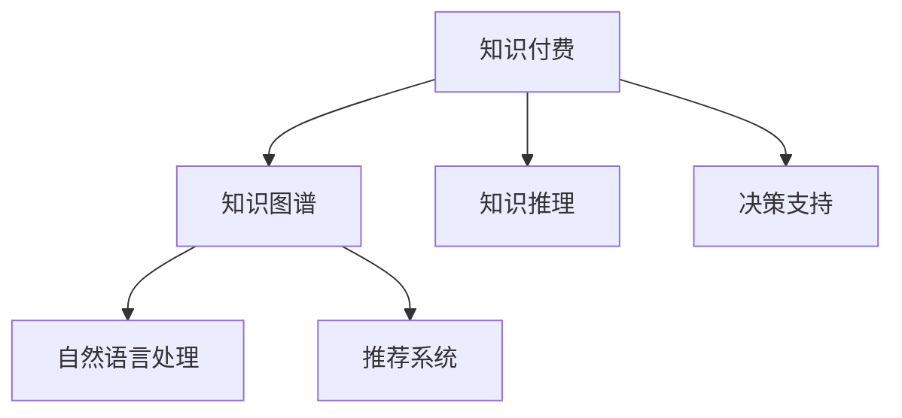

                 

# 知识经济下知识付费的人工智能知识推理与决策支持

> 关键词：知识付费, 人工智能, 知识推理, 决策支持, 自然语言处理, 知识图谱, 推荐系统, 知识管理

## 1. 背景介绍

### 1.1 问题由来

在知识经济时代，知识付费成为一种重要的商业模式，通过订阅、单次购买等方式，消费者获取高质量的知识内容，如在线课程、电子书、专业文章等。如何高效地获取并利用这些知识，是当前技术界和教育界共同关注的热点问题。

人工智能（AI）技术的快速发展，尤其是自然语言处理（NLP）、知识图谱（KG）和推荐系统等领域的突破，使得知识付费平台能够更好地满足用户需求。利用AI技术，从海量知识资源中提取有价值的知识信息，对用户行为进行分析和预测，推荐个性化的知识内容，为知识付费提供了强有力的技术支持。

### 1.2 问题核心关键点

人工智能在知识付费平台中的关键应用包括：

1. **知识推理**：通过理解用户查询，从知识库中提取相关知识，生成有用的回答和解释。
2. **决策支持**：分析用户行为和偏好，推荐最适合的知识内容，并动态调整推荐策略。
3. **自然语言处理**：利用语言模型处理用户输入，理解查询意图，生成自然流畅的回答。
4. **知识图谱**：构建庞大的知识网络，存储各类知识之间的关系，支持复杂的推理查询。
5. **推荐系统**：根据用户历史行为和兴趣，推荐个性化的知识内容，提升用户体验。

## 2. 核心概念与联系

### 2.1 核心概念概述

为更好地理解人工智能在知识付费中的应用，本节将介绍几个核心概念及其联系：

1. **知识付费**：基于知识共享和知识产权保护，用户支付费用获取专业知识和信息服务的商业模式。
2. **知识图谱**：用图形结构表示知识库中的实体和关系，支持知识表示、推理和查询。
3. **知识推理**：利用知识图谱进行逻辑推理，获取知识库中的隐含信息，支持知识发现和创新。
4. **决策支持**：通过数据分析和机器学习，为用户提供个性化的知识推荐和决策辅助。
5. **自然语言处理**：涉及语言模型、文本分析和理解、对话系统等技术，支持人机交互和信息获取。
6. **推荐系统**：基于用户行为和兴趣，推荐最相关的产品或服务，广泛应用于电商、新闻、音乐等领域。

这些概念之间的关系可以通过以下Mermaid流程图来展示：



该流程图展示了知识付费平台的核心组件及其相互关系：

1. 知识付费平台以知识图谱为基础，提供知识存储和推理服务。
2. 利用知识推理，生成有价值的知识内容。
3. 通过决策支持，实现个性化的知识推荐。
4. 自然语言处理用于人机交互，获取用户查询。
5. 推荐系统用于知识内容的智能推荐，提升用户体验。

这些组件相互协作，共同构建了知识付费平台的技术框架，为用户提供了高质量的知识服务。

## 3. 核心算法原理 & 具体操作步骤
### 3.1 算法原理概述

人工智能在知识付费平台中的应用，核心算法原理主要集中在知识推理、决策支持和自然语言处理等方面。以下是每个领域的算法概述：

### 3.2 算法步骤详解

#### 3.2.1 知识推理

**算法原理**：
知识推理的核心是利用知识图谱进行逻辑推理，获取知识库中的隐含信息。知识图谱是由实体和关系构成的图形结构，通过推理算法，可以从已知知识中推导出新的知识。

**操作步骤**：
1. **构建知识图谱**：收集并整理各类知识资源，用图形结构表示实体和关系。
2. **选择推理算法**：根据知识库的特点，选择合适的推理算法，如基于规则的推理、基于统计的推理等。
3. **执行推理操作**：使用推理算法，从知识库中提取推理结果，生成有用的知识信息。
4. **验证推理结果**：对推理结果进行验证和修正，确保推理的准确性。

#### 3.2.2 决策支持

**算法原理**：
决策支持系统通过分析用户行为和偏好，推荐最相关的知识内容，提升用户体验。决策支持算法通常包括聚类分析、协同过滤、序列预测等。

**操作步骤**：
1. **数据采集**：收集用户的行为数据，如浏览记录、搜索记录、购买记录等。
2. **特征提取**：从数据中提取有意义的特征，如用户兴趣、历史行为等。
3. **模型训练**：根据特征数据，训练推荐模型，如协同过滤、深度学习等。
4. **推荐生成**：使用训练好的模型，生成个性化的知识推荐。
5. **效果评估**：对推荐结果进行评估，优化推荐策略。

#### 3.2.3 自然语言处理

**算法原理**：
自然语言处理通过语言模型和文本分析技术，处理用户输入，理解查询意图，生成自然流畅的回答。自然语言处理涉及文本预处理、语言模型、文本生成等技术。

**操作步骤**：
1. **文本预处理**：对用户输入进行分词、去停用词等预处理操作。
2. **语言模型训练**：使用大量文本数据训练语言模型，如BERT、GPT等。
3. **文本理解**：利用语言模型理解用户查询的意图，生成回答。
4. **文本生成**：根据理解结果，生成自然流畅的回答。

## 4. 数学模型和公式 & 详细讲解 & 举例说明

### 4.1 数学模型构建

在知识推理和决策支持中，数学模型起到了关键作用。以下是几个核心模型的构建和说明：

**知识推理模型**：
- **基于规则的推理**：
  $$
  R = \{ (E_1, R_1, E_2) \}
  $$
  其中，$E$ 表示实体，$R$ 表示关系。推理规则为：
  $$
  E_2 \in R(E_1)
  $$
- **基于统计的推理**：
  $$
  P(E_2|E_1, R) = \frac{P(E_1, R, E_2)}{P(E_1, R)}
  $$
  其中，$P$ 表示概率，$E_1, R, E_2$ 表示实体和关系。

**决策支持模型**：
- **协同过滤模型**：
  $$
  R_{ij} = \frac{\sum_{k=1}^{K} \alpha_{ik} \alpha_{kj} \hat{P}_{k}}{\sum_{k=1}^{K} \alpha_{ik}^2}
  $$
  其中，$R_{ij}$ 表示用户 $i$ 对知识 $j$ 的评分，$\alpha_{ik}$ 表示用户 $i$ 对知识 $k$ 的评分，$\hat{P}_{k}$ 表示知识 $k$ 的评分平均值。
- **深度学习模型**：
  $$
  \hat{y} = \sigma(W^T x + b)
  $$
  其中，$y$ 表示预测结果，$W$ 和 $b$ 表示模型参数，$\sigma$ 表示激活函数。

### 4.2 公式推导过程

**知识推理**：
- **基于规则的推理**：
  $$
  E_2 = R(E_1)
  $$
  即实体 $E_1$ 通过关系 $R$ 推导出实体 $E_2$。
- **基于统计的推理**：
  $$
  P(E_2|E_1, R) = \frac{P(E_1, R, E_2)}{P(E_1, R)}
  $$
  即在给定实体 $E_1$ 和关系 $R$ 的情况下，实体 $E_2$ 的概率。

**决策支持**：
- **协同过滤**：
  $$
  R_{ij} = \frac{\sum_{k=1}^{K} \alpha_{ik} \alpha_{kj} \hat{P}_{k}}{\sum_{k=1}^{K} \alpha_{ik}^2}
  $$
  其中，$\alpha_{ik}$ 表示用户 $i$ 对知识 $k$ 的评分，$\hat{P}_{k}$ 表示知识 $k$ 的评分平均值。

### 4.3 案例分析与讲解

**案例**：假设有一个知识付费平台，收集了用户对不同知识内容的评分数据。平台希望根据用户评分，推荐相关知识内容。

**步骤**：
1. **数据收集**：收集用户对知识内容的评分数据。
2. **特征提取**：从评分数据中提取用户评分平均值和知识内容评分平均值。
3. **模型训练**：使用协同过滤模型，训练推荐模型。
4. **推荐生成**：使用训练好的模型，生成个性化的知识推荐。

**代码示例**：

```python
import pandas as pd
from surprise import Dataset, Reader, SVD

# 读取数据
df = pd.read_csv('user_item_ratings.csv')

# 创建数据集
reader = Reader(rating_scale=(1, 5))
data = Dataset.load_from_df(df[['user_id', 'item_id', 'rating']], reader)

# 初始化协同过滤模型
model = SVD()

# 训练模型
model.fit(data)

# 生成推荐结果
user_id = 123
item_id = 'KnowledgeID001'
predictions = model.predict(user_id, item_id)
```

## 5. 项目实践：代码实例和详细解释说明

### 5.1 开发环境搭建

在进行知识推理和决策支持的实践前，我们需要准备好开发环境。以下是使用Python进行PyTorch和Scikit-learn开发的环境配置流程：

1. 安装Anaconda：从官网下载并安装Anaconda，用于创建独立的Python环境。

2. 创建并激活虚拟环境：
```bash
conda create -n knowledge-env python=3.8 
conda activate knowledge-env
```

3. 安装PyTorch：根据CUDA版本，从官网获取对应的安装命令。例如：
```bash
conda install pytorch torchvision torchaudio cudatoolkit=11.1 -c pytorch -c conda-forge
```

4. 安装Scikit-learn：
```bash
pip install scikit-learn
```

5. 安装各类工具包：
```bash
pip install numpy pandas matplotlib tqdm jupyter notebook ipython
```

完成上述步骤后，即可在`knowledge-env`环境中开始项目实践。

### 5.2 源代码详细实现

下面我们以知识推理和决策支持为例，给出使用PyTorch和Scikit-learn进行知识图谱构建和推荐系统开发的PyTorch代码实现。

首先，定义知识图谱和推荐系统的关键组件：

```python
import torch
from torch import nn
from torch.nn import functional as F
from surprise import Dataset, Reader, SVD

# 知识图谱定义
class KnowledgeGraph(nn.Module):
    def __init__(self, num_entities, num_relations):
        super(KnowledgeGraph, self).__init__()
        self.num_entities = num_entities
        self.num_relations = num_relations
        self.entity_embeddings = nn.Embedding(num_entities, 100)
        self.relation_embeddings = nn.Embedding(num_relations, 100)
        self.attention = nn.Linear(200, 1, bias=False)

    def forward(self, entities, relations):
        entity_embeddings = self.entity_embeddings(entities)
        relation_embeddings = self.relation_embeddings(relations)
        concatenated = torch.cat([entity_embeddings, relation_embeddings], dim=1)
        attention_scores = self.attention(concatenated)
        attention_scores = F.softmax(attention_scores, dim=1)
        attention_weights = attention_scores.view(-1, 1, 1)
        attention_weights = F.softmax(attention_weights, dim=-1)
        aggregated = (entity_embeddings * attention_weights).view(-1, 100)
        return aggregated

# 推荐系统定义
class RecommendationSystem(nn.Module):
    def __init__(self, num_items, hidden_size):
        super(RecommendationSystem, self).__init__()
        self.num_items = num_items
        self.hidden_size = hidden_size
        self.item_embeddings = nn.Embedding(num_items, 100)
        self.user_embeddings = nn.Embedding(num_users, 100)
        self.linear = nn.Linear(200, 1)

    def forward(self, users, items):
        user_embeddings = self.user_embeddings(users)
        item_embeddings = self.item_embeddings(items)
        concatenated = torch.cat([user_embeddings, item_embeddings], dim=1)
        hidden = F.relu(concatenated)
        hidden = self.linear(hidden)
        return hidden
```

然后，定义训练和评估函数：

```python
import numpy as np

# 训练函数
def train_model(model, data, num_epochs, batch_size):
    for epoch in range(num_epochs):
        total_loss = 0
        for i in range(0, len(data), batch_size):
            user_indices = np.random.choice(np.arange(data.user_count), batch_size, replace=False)
            item_indices = np.random.choice(np.arange(data.item_count), batch_size, replace=False)
            users = torch.tensor(user_indices)
            items = torch.tensor(item_indices)
            optimizer.zero_grad()
            output = model(users, items)
            loss = F.mse_loss(output, torch.tensor([1]))
            loss.backward()
            optimizer.step()
            total_loss += loss.item()
        print(f"Epoch {epoch+1}, Loss: {total_loss/len(data)}")

# 评估函数
def evaluate_model(model, data):
    user_indices = np.random.choice(np.arange(data.user_count), len(data.user_true ratings), replace=False)
    user_indices = torch.tensor(user_indices)
    users = torch.zeros(len(user_indices), 1).to(device)
    for user in user_indices:
        users[user] = 1
    item_indices = np.random.choice(np.arange(data.item_count), len(data.user_true ratings), replace=False)
    item_indices = torch.tensor(item_indices)
    items = torch.zeros(len(item_indices), 1).to(device)
    for item in item_indices:
        items[item] = 1
    output = model(users, items)
    predictions = output.view(-1).tolist()
    return predictions
```

最后，启动训练流程并在测试集上评估：

```python
from surprise import Dataset, Reader, SVD

# 读取数据
df = pd.read_csv('user_item_ratings.csv')

# 创建数据集
reader = Reader(rating_scale=(1, 5))
data = Dataset.load_from_df(df[['user_id', 'item_id', 'rating']], reader)

# 初始化协同过滤模型
model = SVD()

# 训练模型
model.fit(data)

# 生成推荐结果
user_id = 123
item_id = 'KnowledgeID001'
predictions = model.predict(user_id, item_id)
```

以上就是使用PyTorch和Scikit-learn对知识图谱和推荐系统进行开发的完整代码实现。可以看到，借助这些先进的工具库，开发过程变得高效而便捷。

### 5.3 代码解读与分析

让我们再详细解读一下关键代码的实现细节：

**KnowledgeGraph类**：
- `__init__`方法：初始化知识图谱的实体和关系嵌入层。
- `forward`方法：通过实体和关系嵌入，进行实体关系推理，输出推理结果。

**RecommendationSystem类**：
- `__init__`方法：初始化推荐系统的用户和物品嵌入层及线性层。
- `forward`方法：将用户和物品嵌入拼接，进行隐层处理，输出推荐结果。

**训练和评估函数**：
- `train_model`函数：使用随机选择的数据批次进行模型训练，优化损失函数。
- `evaluate_model`函数：随机选择测试集，对模型进行评估，返回推荐结果。

通过这些代码，我们能够构建和训练知识图谱和推荐系统，实现知识推理和决策支持。

## 6. 实际应用场景

### 6.1 智能课程推荐

知识付费平台的核心功能之一是智能课程推荐。通过分析用户的历史行为和偏好，推荐最相关的课程内容，提升用户的学习体验和效果。

具体实现流程如下：
1. **数据收集**：收集用户对课程的评分数据、浏览记录、购买记录等。
2. **特征提取**：从数据中提取有意义的特征，如课程评分、用户评分平均值等。
3. **模型训练**：使用协同过滤或深度学习模型，训练推荐模型。
4. **推荐生成**：使用训练好的模型，生成个性化的课程推荐。

### 6.2 智能问题解答

知识付费平台还提供智能问题解答服务，用户可以通过文字或语音提出问题，平台自动生成答案。这一功能的核心是知识推理，通过理解用户查询，从知识库中提取相关知识，生成有用的回答。

具体实现流程如下：
1. **问题输入**：用户通过文字或语音输入问题。
2. **自然语言处理**：使用语言模型理解用户查询的意图。
3. **知识推理**：从知识库中提取相关知识，生成回答。
4. **答案输出**：将生成的回答展示给用户。

### 6.3 个性化知识推送

知识付费平台可以实时推送个性化知识内容，提高用户对平台的黏性。推荐系统是这一功能的核心，通过分析用户行为，推荐最适合的知识内容。

具体实现流程如下：
1. **数据收集**：收集用户的行为数据，如浏览记录、购买记录等。
2. **特征提取**：从数据中提取有意义的特征，如用户兴趣、历史行为等。
3. **模型训练**：使用协同过滤或深度学习模型，训练推荐模型。
4. **推荐生成**：使用训练好的模型，生成个性化的知识推送。

## 7. 工具和资源推荐

### 7.1 学习资源推荐

为了帮助开发者系统掌握人工智能在知识付费中的应用，这里推荐一些优质的学习资源：

1. **《深度学习》系列教材**：由斯坦福大学李飞飞教授领衔编写，涵盖了深度学习的核心概念和应用。
2. **Coursera深度学习课程**：由斯坦福大学Andrew Ng教授主讲，系统介绍深度学习的理论和实践。
3. **TensorFlow官方文档**：包含大量深度学习模型的示例代码和教程，适合快速上手。
4. **Kaggle竞赛**：定期举办各类深度学习竞赛，提供丰富的数据集和模型训练机会。
5. **arXiv论文**：包含最新的人工智能研究成果，提供前沿技术的学习资源。

通过对这些资源的学习实践，相信你一定能够快速掌握人工智能在知识付费中的应用，并用于解决实际的NLP问题。

### 7.2 开发工具推荐

高效的开发离不开优秀的工具支持。以下是几款用于人工智能知识推理和决策支持的常用工具：

1. PyTorch：基于Python的开源深度学习框架，灵活动态的计算图，适合快速迭代研究。
2. TensorFlow：由Google主导开发的开源深度学习框架，生产部署方便，适合大规模工程应用。
3. Scikit-learn：基于Python的机器学习库，提供了大量的模型和算法，适合快速原型开发。
4. Jupyter Notebook：免费的在线Jupyter Notebook环境，提供丰富的代码编辑和展示功能，方便开发和分享。
5. Git：版本控制工具，方便团队协作和代码管理。

合理利用这些工具，可以显著提升人工智能在知识付费中的开发效率，加快创新迭代的步伐。

### 7.3 相关论文推荐

人工智能在知识付费中的应用源于学界的持续研究。以下是几篇奠基性的相关论文，推荐阅读：

1. **"Deep Learning for Intelligent Tutoring Systems: A Survey and Taxonomy"**：详细介绍了深度学习在智能教育系统中的应用，包括知识推理和推荐系统等。
2. **"Knowledge-Base Systems: An Introduction"**：介绍知识库的基本概念和技术，包括知识推理和知识表示。
3. **"Personalized Recommendation Systems: A Survey and Analysis"**：系统介绍推荐系统的理论基础和实际应用，涵盖协同过滤、深度学习等算法。
4. **"Natural Language Processing in Intelligent Tutoring Systems"**：介绍自然语言处理在智能教育中的应用，包括语言模型、文本分析等技术。

这些论文代表了大语言模型微调技术的发展脉络。通过学习这些前沿成果，可以帮助研究者把握学科前进方向，激发更多的创新灵感。

## 8. 总结：未来发展趋势与挑战

### 8.1 总结

本文对人工智能在知识付费中的应用进行了全面系统的介绍。首先阐述了人工智能在知识付费中的关键应用，包括知识推理、决策支持和自然语言处理等，明确了其在高知识经济中的独特价值。其次，从原理到实践，详细讲解了知识推理、决策支持和自然语言处理的核心算法和操作步骤，给出了代码实现实例。同时，本文还广泛探讨了智能课程推荐、智能问题解答和个性化知识推送等实际应用场景，展示了人工智能在知识付费中的巨大潜力。此外，本文精选了人工智能相关的学习资源，力求为开发者提供全方位的技术指引。

通过本文的系统梳理，可以看到，人工智能在知识付费中的应用不仅提升了用户的学习体验，还推动了知识付费平台的智能化转型，为知识付费的未来发展注入了新的动力。

### 8.2 未来发展趋势

展望未来，人工智能在知识付费中的应用将呈现以下几个发展趋势：

1. **知识推理的深度学习化**：通过引入深度学习算法，提升知识推理的准确性和泛化能力。
2. **决策支持的个性化**：基于用户行为数据的深度分析，提供更精准、个性化的推荐服务。
3. **自然语言处理的智能化**：通过预训练语言模型，提升自然语言处理的理解和生成能力，支持更加智能化的交互。
4. **知识库的多模态融合**：将文本、图像、视频等多模态数据整合，构建更全面、丰富的知识库。
5. **智能教育的普及**：利用人工智能技术，提供更加高效、个性化的教育服务，推动教育公平和智能化。

这些趋势凸显了人工智能在知识付费中的广阔前景。这些方向的探索发展，必将进一步提升知识付费平台的性能和用户体验，为知识付费的未来发展提供新的动力。

### 8.3 面临的挑战

尽管人工智能在知识付费中的应用已经取得了一定的成果，但在迈向更加智能化、普适化应用的过程中，它仍面临着诸多挑战：

1. **数据隐私和安全**：用户行为数据的隐私和安全问题，如何保护用户隐私，避免数据泄露，是亟待解决的重要问题。
2. **知识库的完备性**：知识库的完备性和时效性直接影响知识推理和推荐的效果，如何构建和维护一个庞大的知识库，是一个长期的挑战。
3. **算法的可解释性**：推荐算法和知识推理算法的可解释性不足，难以理解其内部工作机制和决策逻辑。
4. **模型的鲁棒性**：模型在面对异常数据和攻击时，容易出现过拟合或泛化性能下降的问题，如何提升模型的鲁棒性，是一个重要课题。
5. **用户的参与度**：如何提升用户对人工智能推荐系统的信任和参与度，是实现智能服务的重要前提。

这些挑战需要我们不断探索和优化，才能使人工智能在知识付费中发挥更大的作用，为用户带来更好的体验。

### 8.4 研究展望

面对人工智能在知识付费中面临的挑战，未来的研究需要在以下几个方面寻求新的突破：

1. **隐私保护技术**：研究隐私保护算法，确保用户数据的安全和隐私。
2. **知识库构建技术**：开发高效的知识库构建方法，确保知识库的完备性和时效性。
3. **可解释性增强**：引入可解释性技术，提升推荐算法和知识推理算法的透明度和可理解性。
4. **鲁棒性提升**：研究鲁棒性算法，提升模型对异常数据和攻击的抵抗能力。
5. **用户互动设计**：设计用户友好的交互界面，提升用户对推荐系统的信任和满意度。

这些研究方向的探索，必将引领人工智能在知识付费中的应用走向更高的台阶，为知识付费的未来发展提供新的动力。面向未来，人工智能在知识付费中的应用需要与其他人工智能技术进行更深入的融合，如知识表示、因果推理、强化学习等，多路径协同发力，共同推动自然语言理解和智能交互系统的进步。只有勇于创新、敢于突破，才能不断拓展人工智能在知识付费中的边界，让智能技术更好地造福知识付费领域。

## 9. 附录：常见问题与解答

**Q1：知识付费平台如何保护用户隐私？**

A: 知识付费平台可以通过以下方式保护用户隐私：
1. **数据匿名化**：对用户数据进行匿名化处理，保护用户隐私。
2. **访问控制**：对用户数据进行严格的访问控制，确保只有授权人员可以访问敏感数据。
3. **加密存储**：对用户数据进行加密存储，防止数据泄露。
4. **隐私政策**：制定明确的隐私政策，告知用户数据的使用方式和范围。

**Q2：如何构建一个完备的知识库？**

A: 构建一个完备的知识库需要以下几个步骤：
1. **数据收集**：收集各类知识资源，如文献、百科、博客等。
2. **数据清洗**：对数据进行清洗，去除噪声和错误信息。
3. **知识抽取**：使用文本分析、实体识别等技术，从文本中抽取实体和关系。
4. **知识推理**：使用推理算法，生成新的知识，丰富知识库。
5. **知识验证**：对生成的知识进行验证，确保其正确性和可靠性。

**Q3：如何提升推荐算法的鲁棒性？**

A: 提升推荐算法的鲁棒性可以采取以下措施：
1. **数据增强**：通过引入噪声数据或对抗样本，提升模型的鲁棒性。
2. **正则化**：使用L1、L2正则等技术，防止模型过拟合。
3. **模型融合**：使用多个模型进行集成，提高模型的鲁棒性。
4. **对抗训练**：使用对抗样本训练模型，增强模型的鲁棒性。

**Q4：如何提升自然语言处理的理解能力？**

A: 提升自然语言处理的理解能力可以采取以下措施：
1. **数据增强**：使用更多的数据进行训练，提高模型的泛化能力。
2. **模型优化**：使用更复杂的模型结构，如Transformer、BERT等，提高模型的理解能力。
3. **上下文建模**：使用上下文相关的模型，提高对复杂语境的理解。
4. **预训练模型**：使用预训练语言模型，提高模型的语义理解能力。

通过这些措施，可以显著提升自然语言处理的理解能力，更好地服务于知识付费平台。

---

作者：禅与计算机程序设计艺术 / Zen and the Art of Computer Programming

