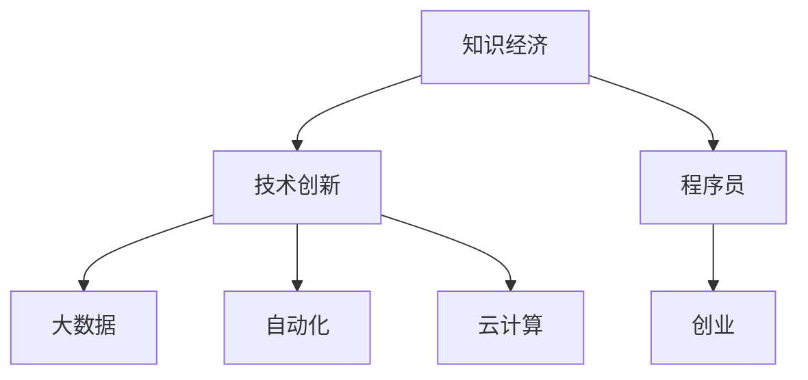

                 

# 知识经济下程序员的创业之路

> 关键词：知识经济,程序员,创业,编程,技术创新,人工智能,自动化,大数据,云计算

## 1. 背景介绍

在21世纪，信息技术已经深刻改变了我们的工作和生活方式，知识经济时代正迅速来临。程序员作为技术创新的主导力量，面临着前所未有的机遇和挑战。创业已经成为程序员实现自我价值、创造社会价值的重要途径。本文将深入探讨程序员在知识经济下的创业之路，揭示其中的核心概念、算法原理与操作步骤，分析数学模型和公式，并结合实际项目实践与案例，展望未来的发展趋势与面临的挑战。

## 2. 核心概念与联系

### 2.1 核心概念概述

为更好地理解程序员在知识经济下的创业之路，本节将介绍几个密切相关的核心概念：

- 知识经济：以知识为基础的经济形态，强调创新、技术进步、智力资源的利用。在知识经济中，程序员作为关键的生产要素，其创业活动将推动经济增长和产业转型。
- 程序员：从事计算机编程、软件开发、系统维护等技术性工作的专业人士，是技术创新和产业升级的驱动者。
- 创业：利用创新技术或商业模式，创造新价值、解决社会问题的过程。程序员可以通过创业将技术转化为社会生产力，实现个人价值与社会价值的统一。
- 技术创新：通过研发新技术、改进产品和服务，打破行业壁垒，提升竞争力的过程。程序员在技术创新中扮演着关键角色。
- 自动化：利用人工智能、机器学习等技术，替代重复性、低价值的任务，提升工作效率，释放创造力。
- 大数据：通过收集、分析和利用大规模数据，发现新的商业机会和洞察，指导决策。程序员在大数据应用中具有显著优势。
- 云计算：利用互联网提供计算资源和工具，支持远程协作和灵活部署，降低创业门槛。程序员在云计算平台上有广泛应用。

这些核心概念之间的逻辑关系可以通过以下Mermaid流程图来展示：



这个流程图展示的核心概念及其之间的关联：

1. 知识经济依赖技术创新，而程序员是技术创新的主力军。
2. 大数据、自动化和云计算等技术在知识经济中扮演重要角色，程序员在应用这些技术方面具有独特优势。
3. 创业是程序员将技术转化为社会价值的重要途径，在知识经济中获得新发展。

## 3. 核心算法原理 & 具体操作步骤

### 3.1 算法原理概述

程序员在知识经济下的创业之路，本质上是一种基于技术的创新创业模式。其核心思想是：利用最新的技术进展（如人工智能、大数据、云计算等），结合自身编程技能，开发创新产品或服务，解决实际问题，实现商业价值和社会价值的统一。

具体来说，包括以下几个步骤：

1. **问题识别与分析**：深入了解目标市场和用户需求，识别出待解决的核心问题。
2. **技术选型与集成**：选择合适的人工智能、大数据、云计算等技术，集成到解决方案中。
3. **产品设计与开发**：利用编程技能，设计开发出可用的产品或服务原型。
4. **用户验证与迭代**：通过用户反馈，不断优化和迭代产品，提升用户体验和系统性能。
5. **商业模式创新**：探索新的盈利模式，如SaaS、API服务等，实现商业模式的创新和可持续增长。

### 3.2 算法步骤详解

以下是程序员创业的一般步骤和关键技术：

**Step 1: 问题识别与分析**
- 市场调研：通过调查问卷、用户访谈等方式，深入了解目标市场和用户需求。
- 问题定义：明确待解决的核心问题，如提高效率、降低成本、提升服务质量等。
- 问题建模：将问题转化为数学模型，利用数据驱动的方法进行分析。

**Step 2: 技术选型与集成**
- 技术评估：评估不同技术方案的优势和局限，选择最适合的解决方案。
- 技术集成：将选定的技术集成到解决方案中，确保其高效运行。
- 测试验证：对技术方案进行充分测试，确保其稳定性和可靠性。

**Step 3: 产品设计与开发**
- 原型设计：利用UI/UX设计工具，快速设计出产品原型。
- 编程实现：利用编程语言和框架，实现产品核心功能。
- 集成测试：对产品进行全面的功能、性能和安全测试，确保产品质量。

**Step 4: 用户验证与迭代**
- 用户获取：通过社交媒体、邮件列表等方式，获取第一批用户。
- 用户反馈：收集用户反馈，分析用户需求和痛点。
- 产品迭代：根据用户反馈，不断优化产品功能和服务，提升用户体验。

**Step 5: 商业模式创新**
- 收入模型：设计可持续的收入模型，如订阅、广告、API服务等。
- 市场推广：利用社交媒体、SEO等手段，提升产品知名度。
- 扩展业务：探索新的业务领域，扩大市场份额。

### 3.3 算法优缺点

基于技术的创业模式具有以下优点：

1. **高效创新**：利用最新技术进展，可以快速开发出创新的产品或服务。
2. **市场潜力大**：技术在多个领域都有广泛应用，市场需求庞大。
3. **资金门槛低**：技术驱动的创业项目，往往不需要大量资金投入，降低了创业风险。
4. **可扩展性强**：基于技术的解决方案，可以灵活扩展和调整，适应市场变化。

同时，该模式也存在一些局限：

1. **技术依赖度高**：对技术选型和集成要求高，一旦技术方案选择不当，可能影响产品成败。
2. **用户获取难度大**：技术产品往往较为复杂，用户体验和学习成本较高。
3. **市场竞争激烈**：技术领域竞争激烈，需要持续创新和优化。
4. **知识产权风险**：技术创新可能面临知识产权纠纷，需要谨慎应对。

尽管存在这些局限，但总体而言，基于技术的创业模式具有较大的发展潜力和应用前景。

### 3.4 算法应用领域

基于技术的创业模式在多个领域都有广泛应用，以下是几个典型例子：

- **人工智能应用**：如自然语言处理、计算机视觉、智能推荐等，利用AI技术开发智能应用。
- **大数据分析**：如数据挖掘、用户行为分析、市场趋势预测等，利用大数据技术提供商业洞察。
- **云计算服务**：如云存储、云数据库、云平台服务等，利用云计算技术提供高效、灵活的服务。
- **自动化工具**：如自动化测试、自动化运维、自动化部署等，利用自动化技术提升工作效率。
- **区块链技术**：如数字货币、智能合约、供应链管理等，利用区块链技术构建去中心化的解决方案。
- **物联网应用**：如智能家居、智能城市、智能农业等，利用物联网技术实现设备互联和智能化管理。

这些领域的应用，展示了基于技术的创业模式在多个行业中的广泛应用和巨大潜力。

## 4. 数学模型和公式 & 详细讲解 & 举例说明

### 4.1 数学模型构建

为更好地描述程序员创业的技术选型与集成过程，我们将构建一个简化的数学模型。假设问题 $P$ 需要解决，可供选择的技术 $T$ 有 $n$ 种，每种技术的成本和效果分别用 $c_i$ 和 $e_i$ 表示，其中 $i \in \{1, 2, ..., n\}$。

令 $x_i$ 表示选择第 $i$ 种技术的决策变量，则总成本 $C$ 和总效果 $E$ 可以表示为：

$$
C = \sum_{i=1}^n c_i x_i
$$

$$
E = \sum_{i=1}^n e_i x_i
$$

目标是在约束条件 $\sum_{i=1}^n x_i = 1$（只选择一种技术）和 $x_i \geq 0$（不选择负值技术）下，最大化总效果 $E$：

$$
\max_{x_i} E = \sum_{i=1}^n e_i x_i
$$

### 4.2 公式推导过程

上述模型是一个典型的线性规划问题，可以使用单纯形法等算法求解。通过引入拉格朗日乘子 $\lambda$ 和 $\mu$，将目标函数和约束条件转化为拉格朗日函数：

$$
L(x_i, \lambda, \mu) = \sum_{i=1}^n e_i x_i + \lambda (\sum_{i=1}^n c_i x_i - C) + \mu (1 - \sum_{i=1}^n x_i)
$$

根据拉格朗日乘子法，求解偏导数等于零的条件，得到：

$$
\frac{\partial L}{\partial x_i} = e_i + \lambda c_i = 0
$$

$$
\frac{\partial L}{\partial \lambda} = \sum_{i=1}^n c_i x_i - C = 0
$$

$$
\frac{\partial L}{\partial \mu} = 1 - \sum_{i=1}^n x_i = 0
$$

解得：

$$
x_i = \frac{C}{\sum_{i=1}^n c_i} \cdot \frac{e_i}{\lambda c_i}
$$

$$
\lambda = \frac{1}{\sum_{i=1}^n c_i}
$$

$$
\mu = \sum_{i=1}^n x_i - 1
$$

最终选择的技术 $T$ 为：

$$
T = \arg\max_i e_i \cdot x_i
$$

### 4.3 案例分析与讲解

假设我们要开发一个智能推荐系统，可供选择的技术包括深度学习、协同过滤、内容过滤等。每种技术的成本和效果如下表所示：

| 技术 | 成本（万元） | 效果（推荐准确率） |
|------|--------------|-------------------|
| 深度学习 | 10 | 85% |
| 协同过滤 | 5 | 70% |
| 内容过滤 | 3 | 60% |

总成本为 $C=18$，总效果最大化为目标。根据上述模型，求解得到：

$$
x_1 = \frac{18}{10+5+3} \cdot \frac{85}{10 \cdot 85} = 0.49
$$

$$
x_2 = \frac{18}{10+5+3} \cdot \frac{70}{5 \cdot 70} = 0.21
$$

$$
x_3 = \frac{18}{10+5+3} \cdot \frac{60}{3 \cdot 60} = 0.3
$$

因此，选择深度学习和内容过滤两种技术，推荐准确率为 $85\% \cdot 0.49 + 60\% \cdot 0.3 = 77\%$。

## 5. 项目实践：代码实例和详细解释说明

### 5.1 开发环境搭建

在进行创业项目实践前，我们需要准备好开发环境。以下是使用Python进行Django开发的环境配置流程：

1. 安装Anaconda：从官网下载并安装Anaconda，用于创建独立的Python环境。

2. 创建并激活虚拟环境：
```bash
conda create -n myproject python=3.8 
conda activate myproject
```

3. 安装Django：
```bash
pip install django
```

4. 安装SQLite3：
```bash
pip install sqlite3
```

5. 初始化Django项目：
```bash
django-admin startproject myproject
```

6. 运行开发服务器：
```bash
python manage.py runserver
```

完成上述步骤后，即可在`myproject`环境中开始创业项目开发。

### 5.2 源代码详细实现

下面以一个智能推荐系统的Django项目为例，展示程序员在知识经济下的创业实践。

首先，定义模型和视图：

```python
from django.shortcuts import render
from django.http import HttpResponse
from .models import Recommendation

def index(request):
    recommendations = Recommendation.objects.all()
    return render(request, 'index.html', {'recommendations': recommendations})

def recommend(request):
    recommendations = Recommendation.objects.all()
    return HttpResponse(recommendations)
```

然后，创建数据库模型：

```python
from django.db import models

class Recommendation(models.Model):
    product = models.CharField(max_length=255)
    user = models.CharField(max_length=255)
    rating = models.FloatField()

    def __str__(self):
        return f'{self.product} by {self.user}'
```

接着，创建HTML模板：

```html
<!DOCTYPE html>
<html>
<head>
    <title>Recommendation</title>
</head>
<body>
    <h1>推荐产品</h1>
    <ul>
        
            <li>{{ recommendation }} - {{ recommendation.rating }}</li>
        
    </ul>
</body>
</html>
```

最后，运行项目，访问 `http://127.0.0.1:8000/`，即可看到推荐产品的列表。

### 5.3 代码解读与分析

让我们再详细解读一下关键代码的实现细节：

**Recommendation类**：
- `__init__`方法：初始化产品、用户和评分。
- `__str__`方法：定义类的字符串表示，方便输出。

**index视图**：
- 从数据库中获取所有推荐记录。
- 渲染模板，显示推荐列表。

**recommend视图**：
- 直接返回推荐列表，用于测试。

**index.html模板**：
- 定义简单的HTML结构，使用Django模板语言渲染推荐记录。

可以看到，使用Django进行创业项目开发，可以显著提高开发效率，减少代码量。Django提供的ORM、模板系统、表单处理等功能，大大简化了开发过程。

## 6. 实际应用场景

### 6.1 智慧医疗

在智慧医疗领域，程序员可以利用人工智能、大数据、云计算等技术，开发出一系列创新应用，提升医疗服务的智能化水平。

- **医疗问答系统**：通过自然语言处理技术，实时回答患者疑问，提高医疗服务的及时性和准确性。
- **病历分析系统**：利用机器学习技术，自动分析病历数据，提供诊断建议，提升医生的工作效率。
- **药物研发平台**：基于大数据分析，预测新药的潜在效果，加速药物研发进程。

### 6.2 智能教育

在智能教育领域，程序员可以利用人工智能技术，开发出智能辅导、个性化推荐等应用，提升教育质量和效率。

- **智能辅导系统**：通过自然语言处理和机器学习技术，自动解答学生问题，提供个性化辅导。
- **知识推荐系统**：利用大数据分析，推荐适合学生的学习资源，提高学习效率。
- **作业批改系统**：利用自然语言处理和深度学习技术，自动批改作业，减少教师负担。

### 6.3 智慧城市

在智慧城市治理中，程序员可以利用物联网、大数据、人工智能等技术，开发出智能监控、智能交通等应用，提升城市管理水平。

- **智能监控系统**：通过摄像头和传感器数据，实时监测城市运行状态，及时预警和处理突发事件。
- **智能交通系统**：利用大数据分析，优化交通流量，减少拥堵，提高出行效率。
- **应急指挥系统**：基于实时数据，快速响应各类紧急事件，保障城市安全。

### 6.4 未来应用展望

随着技术的不断进步，基于技术的创业模式将呈现以下发展趋势：

1. **智能化升级**：智能算法和模型将不断进步，应用场景将更加广泛和深入。
2. **跨领域融合**：跨领域的融合将不断涌现，技术边界将进一步模糊。
3. **可持续发展**：技术创新将更加注重社会责任和环境保护。
4. **人机协同**：技术将更加注重人机协同，提升用户体验和系统互动性。
5. **知识驱动**：数据和知识将驱动技术创新，带来更高的商业价值和社会影响力。
6. **全球化拓展**：技术的全球化拓展将带来新的市场机会和挑战。

## 7. 工具和资源推荐

### 7.1 学习资源推荐

为了帮助程序员系统掌握创业过程中的关键技术，这里推荐一些优质的学习资源：

1. **《创业维艰》系列博文**：深度解析创业过程中的核心问题和解决方法，适合创业新手。
2. **《精益创业》书籍**：介绍精益创业方法论，通过小步快跑，快速迭代，降低创业风险。
3. **Coursera《创业与创新》课程**：斯坦福大学教授主讲的创业课程，涵盖创业各阶段的关键技术和管理知识。
4. **Udacity《创业指导》课程**：提供创业项目开发、团队管理和商业策划的实战指导。
5. **Hacker News创业板块**：汇集全球创业资讯和经验，提供丰富的学习资源和灵感。

通过对这些资源的学习实践，相信程序员能够更好地掌握创业过程中所需的关键技术和方法。

### 7.2 开发工具推荐

高效的开发离不开优秀的工具支持。以下是几款用于程序员创业开发的常用工具：

1. **Django**：Python的Web框架，提供快速开发、可扩展性和高安全性。
2. **Flask**：轻量级Web框架，易于上手，适合快速开发原型。
3. **Docker**：容器化平台，方便应用程序的部署和迁移。
4. **Kubernetes**：容器编排平台，支持大规模分布式系统管理。
5. **Git**：版本控制系统，支持代码管理和团队协作。
6. **JIRA**：项目管理工具，支持任务分配、进度跟踪和问题管理。

合理利用这些工具，可以显著提升创业项目的开发效率，加速创新迭代的步伐。

### 7.3 相关论文推荐

程序员创业涉及到多个技术领域，以下是几篇奠基性的相关论文，推荐阅读：

1. **《深度学习入门》**：Ian Goodfellow等著，介绍深度学习的基本概念和算法。
2. **《大规模并行化深度学习》**：Geoffrey Hinton等著，介绍分布式深度学习技术。
3. **《大数据时代》**：Viktor Mayer-Schönberger等著，介绍大数据的采集、存储和分析方法。
4. **《云计算：理解和管理云平台》**：Robin Scott等著，介绍云计算的基本概念和实践。
5. **《区块链技术及应用》**：Eugen Hübler等著，介绍区块链技术和应用场景。
6. **《物联网基础》**：张宏江等著，介绍物联网的基本概念和应用技术。

这些论文代表了大数据、人工智能、云计算等技术的发展脉络，为程序员创业提供了重要的理论基础。

## 8. 总结：未来发展趋势与挑战

### 8.1 研究成果总结

本文对程序员在知识经济下的创业之路进行了全面系统的介绍。首先阐述了知识经济时代程序员面临的机遇和挑战，明确了创业在技术驱动下的独特价值。其次，从原理到实践，详细讲解了基于技术的创业模式的算法原理和操作步骤，分析了数学模型和公式，并结合实际项目实践与案例，展望了未来的发展趋势与面临的挑战。

通过本文的系统梳理，可以看到，基于技术的创业模式在知识经济时代具有广阔的前景和巨大的潜力。程序员可以通过掌握最新的技术进展，结合自身编程技能，开发出创新产品或服务，解决实际问题，实现商业价值和社会价值的统一。

### 8.2 未来发展趋势

展望未来，基于技术的创业模式将呈现以下几个发展趋势：

1. **智能化升级**：智能算法和模型将不断进步，应用场景将更加广泛和深入。
2. **跨领域融合**：跨领域的融合将不断涌现，技术边界将进一步模糊。
3. **可持续发展**：技术创新将更加注重社会责任和环境保护。
4. **人机协同**：技术将更加注重人机协同，提升用户体验和系统互动性。
5. **知识驱动**：数据和知识将驱动技术创新，带来更高的商业价值和社会影响力。
6. **全球化拓展**：技术的全球化拓展将带来新的市场机会和挑战。

这些趋势凸显了基于技术的创业模式的广阔前景，程序员需要不断学习和掌握新的技术，探索更多的创新点，才能在知识经济中取得成功。

### 8.3 面临的挑战

尽管基于技术的创业模式具有巨大的发展潜力，但在迈向更加智能化、普适化应用的过程中，仍面临着诸多挑战：

1. **技术选型风险**：技术选型不当可能影响项目成败，需要进行充分的市场调研和技术评估。
2. **人才短缺**：高水平的程序员和数据科学家人才短缺，可能制约项目的进展。
3. **市场竞争**：技术领域竞争激烈，需要持续创新和优化。
4. **知识产权风险**：技术创新可能面临知识产权纠纷，需要谨慎应对。
5. **用户体验**：技术产品往往较为复杂，用户体验和学习成本较高。
6. **资金风险**：创业初期资金紧张，需要进行合理的资金规划和融资。

尽管存在这些挑战，但总体而言，基于技术的创业模式具有较大的发展潜力和应用前景。程序员需要不断学习和积累经验，灵活应对各种挑战，才能在知识经济中获得成功。

### 8.4 研究展望

面对基于技术的创业模式面临的挑战，未来的研究需要在以下几个方面寻求新的突破：

1. **跨领域协同**：跨领域的协同将带来更大的创新潜力，推动技术边界模糊化。
2. **人机协同设计**：人机协同设计将提升用户体验和系统互动性，推动智能化升级。
3. **可持续性发展**：可持续性发展将带来社会责任和环境保护，推动技术创新。
4. **数据驱动决策**：数据驱动决策将带来更高的商业价值和社会影响力，推动知识驱动技术。
5. **全球化协作**：全球化协作将带来新的市场机会和挑战，推动技术全球化拓展。

这些研究方向的探索，将引领基于技术的创业模式迈向更高的台阶，为程序员创业带来更多的机会和挑战。

## 9. 附录：常见问题与解答

**Q1：程序员创业是否需要大量资金支持？**

A: 创业初期资金确实重要，但可以通过众筹、天使投资等方式获取。更重要的是找到一个好的商业模式，利用技术优势，实现低成本运营。

**Q2：创业过程中如何确保技术创新？**

A: 持续学习新技术，关注技术前沿，参与技术社区，及时调整技术方向。同时，保持灵活的市场调研和用户反馈，不断优化产品和技术。

**Q3：如何选择创业项目？**

A: 选择具有潜力的市场领域，结合自身技术优势，解决用户痛点。同时，进行充分的市场调研和用户需求分析，确保项目有良好的发展前景。

**Q4：如何应对技术选型风险？**

A: 进行充分的市场调研和技术评估，与行业专家进行交流，参考成功案例，综合考虑成本、效果和可持续性。

**Q5：如何吸引优秀人才？**

A: 提供有竞争力的薪酬和福利，营造良好的工作氛围，建立团队文化和价值观，吸引优秀人才。

---

作者：禅与计算机程序设计艺术 / Zen and the Art of Computer Programming

