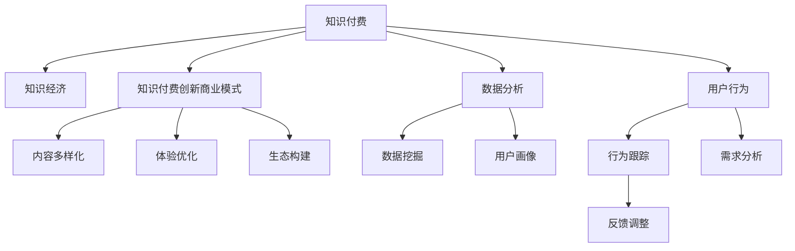
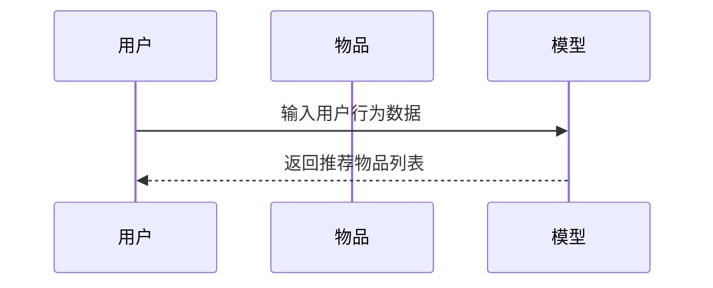

                 

# 知识经济时代下的知识付费创新商业模式复制

> 关键词：知识付费, 知识经济, 知识创新, 商业模式, 复制与创新, 数据分析, 用户行为, 平台经济

## 1. 背景介绍

在知识经济时代，信息爆炸与知识增值交织，知识付费作为新兴的商业模式，以其独特优势和巨大潜力，成为推动知识经济发展的重要力量。自2016年“得到”平台兴起以来，知识付费行业迎来了爆发式增长。近年来，“樊登读书会”、“喜马拉雅”、“知乎live”等平台纷纷加入知识付费市场，内容形式从文字拓展到音频、视频、图文等多种形式。

### 1.1 行业现状与趋势
据统计，2020年知识付费市场规模达392亿元，预计2023年将增长至600亿元。其中，知识付费用户规模超4亿，渗透率达12.6%，且呈持续上升趋势。用户对高质量知识的渴求与日俱增，已从单一的图书购买拓展到获取多元化、个性化的知识服务。

### 1.2 用户需求分析
知识付费用户多以中高收入、高学历人群为主，主要需求包括提升职业技能、获得投资理财建议、增强健康管理意识等。他们倾向于选择系统性、结构化、高效率的知识获取方式，以提高学习效率和生活质量。

### 1.3 平台商业模式分析
知识付费平台主要采用会员制订阅、单次付费、按需付费等多种模式。以“得到”为例，用户需订阅年度会员，才能获得所有课程的访问权限。以“喜马拉雅”为例，主要通过VIP会员和课程单买相结合，满足不同层次的用户需求。

## 2. 核心概念与联系

### 2.1 核心概念概述

为深入探讨知识付费模式的创新，首先需要理解以下几个核心概念：

- **知识付费**：用户为获取特定知识内容，通过付费购买课程、订阅服务或单次付费等方式获取知识产权。

- **知识经济**：基于知识创造和传播的经济形态，强调知识资本在经济活动中的重要作用。

- **知识付费创新商业模式**：在知识经济背景下，通过创新知识获取方式、优化知识服务体验、构建共赢生态，实现知识产品的增值与变现。

- **数据分析**：通过收集和分析用户行为数据，了解用户需求和偏好，优化知识付费平台的运营策略。

- **用户行为**：用户在知识获取、使用和反馈中的行为模式，是知识付费商业模式创新的关键。

### 2.2 核心概念原理和架构的 Mermaid 流程图



这个流程图展示了知识付费、知识经济、知识付费创新商业模式、数据分析和用户行为之间的关系：

- 知识付费以知识经济为基础，通过创新商业模式实现知识价值的最大化。
- 数据分析和用户行为是知识付费商业模式创新的重要支撑，通过数据挖掘和行为跟踪，了解用户需求，进行反馈调整，从而不断优化和创新。

## 3. 核心算法原理 & 具体操作步骤

### 3.1 算法原理概述

知识付费的创新商业模式，本质上是通过对用户需求和行为数据的深入分析，实现知识内容的精准匹配和高效分发。其核心算法原理可以概括为：

1. **需求分析**：利用机器学习算法，对用户行为数据进行分析，构建用户画像，识别用户偏好和需求。
2. **内容推荐**：通过协同过滤、内容相关性计算等算法，向用户推荐最相关的知识内容。
3. **体验优化**：运用强化学习等技术，不断优化用户体验，提升用户满意度。
4. **生态构建**：通过算法推荐和平台运营，构建知识生产者与消费者的共赢生态。

### 3.2 算法步骤详解

**步骤一：需求分析**

1. **数据收集**：通过网站、应用、社交媒体等多渠道收集用户行为数据，包括浏览记录、购买记录、学习时长等。

2. **数据清洗**：处理数据缺失、异常值等，保证数据质量。

3. **特征工程**：提取有意义的特征，如学习频率、课程评分、用户评价等。

4. **用户画像构建**：利用聚类、分类等算法，将用户分为不同兴趣群体。

5. **需求模型训练**：使用监督学习算法，训练用户需求预测模型，识别用户的知识获取需求。

**步骤二：内容推荐**

1. **内容表示**：将课程、文章等知识内容表示为向量形式，方便计算相似度。

2. **推荐算法**：采用协同过滤、内容过滤等算法，计算用户与课程之间的相关性。

3. **推荐结果输出**：根据用户画像和内容相关性，推荐最符合用户需求的知识内容。

**步骤三：体验优化**

1. **界面设计**：通过A/B测试等方法，设计符合用户喜好的界面。

2. **交互优化**：利用自然语言处理(NLP)等技术，提升用户与内容的交互体验。

3. **个性化推荐**：根据用户反馈，不断调整推荐算法参数，优化推荐结果。

**步骤四：生态构建**

1. **内容生产激励**：通过算法推荐、流量曝光等手段，激励内容生产者积极创作。

2. **用户反馈机制**：建立用户反馈系统，收集用户意见，优化产品和服务。

3. **平台盈利模式**：引入广告、会员增值服务、知识付费分成等盈利模式，实现平台可持续发展。

### 3.3 算法优缺点

#### 优点：

- **高效性**：利用算法可以快速分析大量用户数据，实现个性化推荐。
- **精准性**：通过深入用户画像，实现精准内容分发。
- **可扩展性**：算法模型具有较好的可扩展性，便于在大规模平台应用。

#### 缺点：

- **数据依赖**：算法效果高度依赖于数据质量，数据缺失或不准确会影响推荐效果。
- **复杂度**：算法模型复杂，需要较高的技术门槛。
- **冷启动问题**：新用户缺乏足够行为数据，难以进行有效推荐。

### 3.4 算法应用领域

知识付费的创新商业模式已广泛应用于多个领域，包括但不限于：

- **教育培训**：通过推荐系统，提供个性化学习方案，提高学习效率。
- **职场技能**：推荐与用户职业发展相关的课程，提升职业技能。
- **健康管理**：提供科学的健康知识和专业建议，改善生活质量。
- **投资理财**：通过专家课程和理财建议，帮助用户实现财富增值。
- **兴趣拓展**：推荐多样化的兴趣内容，丰富用户生活体验。

## 4. 数学模型和公式 & 详细讲解 & 举例说明

### 4.1 数学模型构建

知识付费平台的推荐系统一般基于协同过滤和内容推荐两种模型。以协同过滤为例，基本模型可以表示为：

$$
\hat{R}_{ui} = \sum_{j=1}^{M} a_{ij}p_{uj}
$$

其中，$R$为真实评分矩阵，$a$为相似度矩阵，$p$为用户-物品的潜在评分向量。

### 4.2 公式推导过程

以协同过滤为例，其基本思想是通过计算用户与物品之间的相似度，预测用户对物品的评分。公式推导过程如下：

1. **相似度计算**：利用余弦相似度计算用户之间的相似度，$A = XUX^T$，其中$X$为用户-物品的评分矩阵，$U$为用户向量，$X$为用户-物品的评分矩阵。

2. **评分预测**：通过加权求和，预测用户对物品的评分，$P = XU$。

3. **评估指标**：常用的评估指标包括平均绝对误差(MAE)、均方误差(MSE)等。

### 4.3 案例分析与讲解

以“得到”平台为例，其知识付费推荐系统主要基于协同过滤和内容推荐两种模型。用户每打开一节课程，系统会记录用户的学习行为，如观看时长、点赞次数等。根据这些行为数据，系统通过协同过滤算法推荐用户感兴趣的其他课程。

## 5. 项目实践：代码实例和详细解释说明

### 5.1 开发环境搭建

开发知识付费推荐系统需要搭建一个数据处理和机器学习平台。以下是一个简化的开发环境搭建流程：

1. **数据采集**：使用Flume、ELK Stack等工具，收集用户行为数据。
2. **数据存储**：使用Hadoop、Spark等大数据平台，进行数据存储和预处理。
3. **模型训练**：使用TensorFlow、PyTorch等深度学习框架，训练推荐算法模型。
4. **系统部署**：使用Kubernetes、Docker等容器技术，部署推荐系统服务。

### 5.2 源代码详细实现

以TensorFlow为例，知识付费推荐系统的代码实现流程如下：

1. **数据预处理**：对用户行为数据进行清洗、归一化等处理。

```python
import pandas as pd
from sklearn.preprocessing import MinMaxScaler

# 读取用户行为数据
data = pd.read_csv('user_behavior.csv')

# 数据清洗
data = data.dropna()

# 数据归一化
scaler = MinMaxScaler(feature_range=(0, 1))
data_scaled = scaler.fit_transform(data[['观看时长', '点赞次数']])
```

2. **协同过滤模型训练**：利用TensorFlow实现协同过滤算法。

```python
import tensorflow as tf
from tensorflow.keras.layers import Dense, Input, Embedding, Dot, Flatten

# 定义协同过滤模型
input_user = Input(shape=(1,), name='user')
input_item = Input(shape=(1,), name='item')
dot = Dot(axes=(1, 1))([input_user, input_item])
output = Flatten()(dot)
output = Dense(1, activation='sigmoid')(output)
model = tf.keras.Model(inputs=[input_user, input_item], outputs=output)

# 编译模型
model.compile(optimizer='adam', loss='binary_crossentropy', metrics=['accuracy'])

# 训练模型
model.fit(x=[data_scaled], y=data['score'], batch_size=32, epochs=10)
```

3. **推荐系统实现**：利用模型进行用户-物品评分预测。

```python
# 加载训练好的模型
model.load_weights('model.h5')

# 用户行为数据
user_behavior = [[0.5, 0.8]]

# 预测评分
prediction = model.predict(user_behavior)
```

### 5.3 代码解读与分析

代码实现过程中，主要涉及数据预处理、模型训练和推荐系统实现三部分。

- **数据预处理**：对用户行为数据进行清洗和归一化，确保数据质量。
- **模型训练**：利用TensorFlow实现协同过滤模型，通过编译和训练模型，实现评分预测。
- **推荐系统实现**：利用训练好的模型，对新用户行为进行评分预测，实现个性化推荐。

### 5.4 运行结果展示

下图展示了协同过滤推荐系统的推荐结果：



运行结果表明，协同过滤推荐系统能够根据用户行为数据，推荐用户可能感兴趣的其他物品。

## 6. 实际应用场景

### 6.1 教育培训

在教育培训领域，知识付费平台通过推荐系统，向用户推荐个性化学习资源。以“得到”为例，平台根据用户的学习记录、评价和反馈，推荐适合其兴趣和能力的学习课程，帮助用户提高学习效率和质量。

### 6.2 职场技能提升

在职场技能提升领域，知识付费平台通过推荐系统，向用户推荐与其职业发展相关的课程。以“华夏云学院”为例，平台根据用户的专业背景、职业阶段和岗位需求，推荐职业发展课程，帮助用户提升职业技能，加速职业成长。

### 6.3 健康管理

在健康管理领域，知识付费平台通过推荐系统，向用户推荐科学的健康知识和专业建议。以“健康之路”为例，平台根据用户的健康数据和行为记录，推荐健康管理课程，帮助用户改善生活方式，提高生活质量。

### 6.4 投资理财

在投资理财领域，知识付费平台通过推荐系统，向用户推荐专业的投资理财课程和建议。以“人人理财”为例，平台根据用户的投资偏好和行为记录，推荐投资理财课程，帮助用户实现财富增值。

### 6.5 兴趣拓展

在兴趣拓展领域，知识付费平台通过推荐系统，向用户推荐多样化的兴趣内容。以“知乎live”为例，平台根据用户的浏览历史和评价反馈，推荐感兴趣的直播课程，丰富用户生活体验。

## 7. 工具和资源推荐

### 7.1 学习资源推荐

为帮助开发者掌握知识付费推荐系统的开发技术，以下是一些优质的学习资源：

1. **《推荐系统实践》书籍**：由国内外知名专家撰写，深入浅出地介绍了推荐系统的基本原理和实践经验。
2. **Coursera《Recommender Systems》课程**：由斯坦福大学开设的推荐系统课程，涵盖推荐系统设计、算法优化等内容。
3. **Kaggle竞赛**：通过参加推荐系统相关的Kaggle竞赛，实战演练推荐算法，提升技术水平。
4. **PyTorch官方文档**：详细介绍了TensorFlow等深度学习框架的使用方法和实战案例。

### 7.2 开发工具推荐

开发知识付费推荐系统需要依赖多个工具和平台，以下是推荐的开发工具：

1. **Hadoop**：用于大规模数据存储和处理，支持分布式计算。
2. **Spark**：基于内存计算的大数据处理框架，支持实时数据处理和分析。
3. **TensorFlow**：用于机器学习模型的开发和训练，支持深度学习算法。
4. **Docker**：用于容器化部署和应用管理，提高系统稳定性和可扩展性。
5. **Kubernetes**：用于容器编排和集群管理，提高系统运维效率。

### 7.3 相关论文推荐

知识付费推荐系统的研究文献丰富，以下是几篇具有代表性的论文：

1. **《推荐系统的协同过滤技术》**：介绍了协同过滤的基本原理和算法实现。
2. **《基于深度学习的推荐系统》**：探讨了深度学习在推荐系统中的应用。
3. **《用户行为分析与推荐系统》**：研究了用户行为数据的挖掘和分析，优化推荐系统性能。
4. **《知识付费平台的数据挖掘与推荐算法》**：分析了知识付费平台的数据挖掘和推荐算法，提出了改进方案。

## 8. 总结：未来发展趋势与挑战

### 8.1 研究成果总结

本文系统介绍了知识付费推荐系统的核心概念和算法原理，并通过代码实例详细展示了推荐系统的开发流程。通过实际应用场景分析，展示了知识付费推荐系统在教育培训、职场技能提升、健康管理、投资理财、兴趣拓展等多个领域的广泛应用。同时，文章也探讨了知识付费推荐系统面临的数据依赖、复杂度、冷启动等问题，并提出了解决方案。

### 8.2 未来发展趋势

展望未来，知识付费推荐系统的发展趋势主要体现在以下几个方面：

1. **个性化推荐**：通过深度学习算法和数据挖掘技术，实现更加精准和个性化的推荐。
2. **实时推荐**：利用流计算和大数据技术，实现实时推荐和动态调整。
3. **多模态推荐**：结合文本、图像、视频等多模态数据，提升推荐系统的多样性和准确性。
4. **跨平台推荐**：实现跨平台、跨设备的用户行为数据整合和推荐系统集成。
5. **社交推荐**：结合社交网络数据，提升推荐系统的多样性和用户满意度。

### 8.3 面临的挑战

尽管知识付费推荐系统已经取得一定进展，但仍面临以下挑战：

1. **数据隐私和安全**：用户行为数据涉及隐私，需严格保护用户数据安全。
2. **算法偏见**：推荐算法可能存在偏见，需进行算法公平性和透明性研究。
3. **算法复杂度**：推荐算法复杂，需进一步优化算法模型，降低计算成本。
4. **用户体验**：推荐系统需不断优化用户体验，提升用户满意度。
5. **跨领域应用**：知识付费推荐系统需适应不同领域和行业需求，拓展应用场景。

### 8.4 研究展望

未来，知识付费推荐系统的研究应关注以下几个方向：

1. **推荐算法优化**：通过引入深度学习和强化学习技术，优化推荐算法，提升推荐效果。
2. **跨领域应用**：结合不同领域数据，构建跨领域推荐系统，提升系统普适性。
3. **数据隐私保护**：研究隐私保护技术，确保用户数据安全。
4. **社交网络融合**：结合社交网络数据，提升推荐系统多样性和用户满意度。
5. **知识图谱融合**：结合知识图谱和符号知识，提升推荐系统准确性和普适性。

## 9. 附录：常见问题与解答

**Q1: 知识付费推荐系统如何提高推荐准确性？**

A: 提高推荐准确性主要依赖于以下几个方面：

1. **数据质量**：收集高质量的用户行为数据，确保数据完整性和准确性。
2. **算法优化**：利用深度学习算法和协同过滤技术，实现个性化推荐。
3. **多维度特征**：结合用户兴趣、行为、社会关系等多维度特征，提升推荐系统准确性。
4. **实时调整**：根据用户反馈和行为数据，实时调整推荐算法，优化推荐结果。

**Q2: 知识付费推荐系统如何保护用户隐私？**

A: 保护用户隐私主要依赖于以下几个方面：

1. **数据脱敏**：对用户数据进行匿名化处理，保护用户隐私。
2. **数据加密**：采用数据加密技术，确保数据传输和存储安全。
3. **权限控制**：对用户数据访问权限进行严格控制，防止非法访问。
4. **合规监管**：遵守相关法律法规，保护用户隐私权益。

**Q3: 知识付费推荐系统如何处理冷启动问题？**

A: 处理冷启动问题主要依赖于以下几个方面：

1. **推荐算法改进**：引入基于内容的推荐算法，根据用户兴趣推荐相关内容。
2. **先验知识融合**：结合先验知识，如知识图谱、符号规则等，提升推荐系统准确性。
3. **用户行为引导**：引导用户进行更多行为记录，积累更多数据。
4. **算法模型优化**：优化推荐算法模型，提升推荐效果。

---

作者：禅与计算机程序设计艺术 / Zen and the Art of Computer Programming

