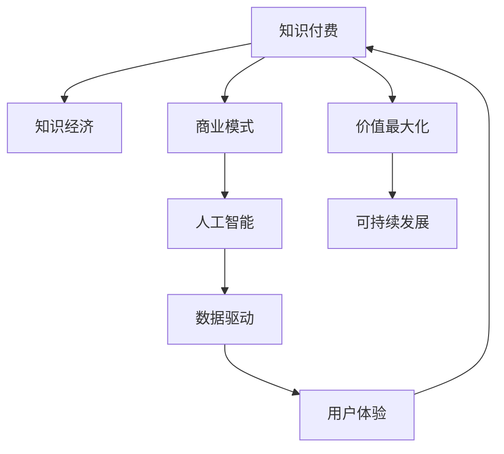

                 

# 知识经济时代下的知识付费创新商业模式运营

> 关键词：知识付费, 知识经济, 商业模式, 人工智能, 数据驱动, 用户体验

## 1. 背景介绍

### 1.1 问题由来
在知识经济时代，随着信息技术的不断进步和互联网的普及，知识付费行业迎来了前所未有的发展机遇。知识付费不仅成为用户获取高质量知识、提升自我能力的重要途径，也成为内容生产者实现价值变现、知识传播的重要模式。然而，传统的知识付费模式已难以适应快速变化的市场需求和用户行为，亟需创新商业模式进行运营升级。

### 1.2 问题核心关键点
本文聚焦于知识付费行业的商业模式创新，通过大数据、人工智能等前沿技术手段，探索如何构建智能、高效、可持续的知识付费平台，实现用户价值最大化和知识传播效果的最优化。

### 1.3 问题研究意义
研究知识付费行业的商业模式创新，对于提升知识传播的广度和深度，促进个体和社会的全面发展，具有重要意义：

1. 促进知识传播：通过创新商业模式，能够更有效地吸引用户关注和学习，加速知识传递和普及。
2. 提升用户体验：通过智能推荐、个性化服务等手段，提升用户学习的便捷性和满意度。
3. 提高运营效率：通过数据分析、模型优化等技术手段，降低运营成本，提升收益。
4. 激发内容创造：通过用户激励机制、收益分配模式等措施，激发内容创作者的生产动力和创新能力。
5. 构建可持续生态：通过知识付费平台的良性循环，构建可持续发展的商业生态，促进知识经济的发展。

## 2. 核心概念与联系

### 2.1 核心概念概述

为更好地理解知识付费行业的商业模式创新，本节将介绍几个关键概念：

- **知识付费**：指用户为获取知识、提升自我能力而支付费用的模式，包括在线课程、电子书、专业文章、在线讲座等多种形式。
- **知识经济**：以知识为核心生产要素，推动经济增长的新型经济形态，强调知识的重要性、创造力和价值。
- **商业模式**：企业在一定环境下，为实现价值最大化，整合资源、创造价值和获取利润的方式和策略。
- **人工智能(AI)**：通过机器学习、深度学习等技术手段，实现智能化、自动化处理数据的科学。
- **数据驱动**：利用大数据分析技术，从数据中挖掘价值、发现规律、指导决策，提升运营效率。
- **用户体验**：用户在使用产品或服务时的感受和满意度，是衡量知识付费平台成功与否的重要指标。

这些概念之间的联系可以通过以下Mermaid流程图来展示：



这个流程图展示的知识付费行业的核心概念及其之间的关系：

1. 知识付费以知识经济为背景，是知识经济的重要表现形式。
2. 商业模式是实现知识付费价值最大化的重要策略。
3. 人工智能和大数据驱动为商业模式创新提供了技术支撑。
4. 用户体验是商业模式成功的关键。
5. 通过商业模式创新，实现知识付费的可持续发展，进一步推动知识经济的发展。

## 3. 核心算法原理 & 具体操作步骤
### 3.1 算法原理概述

知识付费行业的商业模式创新，本质上是通过大数据、人工智能等技术手段，优化知识传播和价值实现的过程。其核心思想是：构建智能化的知识推荐和获取系统，通过数据分析、模型优化等手段，实现用户和内容的高效匹配，提升知识传播的广度和深度。

形式化地，假设知识付费平台有N个用户U和M个课程C，平台的目标是找到最佳的匹配策略 $f$，使得平台收益最大化。即：

$$
\max_{f} \sum_{i=1}^{N}\sum_{j=1}^{M} f(i,j) \cdot (p_i \cdot c_j)
$$

其中 $f(i,j)$ 表示用户i对课程j的匹配度， $p_i$ 表示用户i的订阅价格， $c_j$ 表示课程j的价格。目标是通过调整匹配策略，最大化平台的总收益。

在实践中，我们通常使用协同过滤、深度学习等技术手段，构建个性化推荐模型，优化用户和课程的匹配度。具体步骤如下：

1. 收集用户行为数据，包括课程浏览、点击、订阅等行为。
2. 使用协同过滤算法，如基于矩阵分解的推荐算法，构建用户-课程偏好矩阵。
3. 应用深度学习模型，如基于神经网络的推荐模型，进一步优化匹配策略。
4. 实时调整匹配策略，根据用户反馈和平台收益，不断优化推荐效果。

### 3.2 算法步骤详解

基于协同过滤和深度学习的知识付费平台构建，一般包括以下几个关键步骤：

**Step 1: 数据准备**
- 收集用户行为数据，如课程浏览记录、点击次数、订阅状态等。
- 收集课程属性数据，如课程标题、描述、难度等级等。
- 对数据进行清洗和预处理，去除噪声和异常值。

**Step 2: 协同过滤算法构建**
- 使用基于矩阵分解的协同过滤算法，如ALS（Alternating Least Squares），对用户-课程偏好矩阵进行分解。
- 将矩阵分解为用户隐向量 $u_i$ 和课程隐向量 $v_j$。
- 通过相似度计算，找到用户和课程的匹配度 $f(i,j)$。

**Step 3: 深度学习模型训练**
- 构建深度学习模型，如基于神经网络的推荐模型，对用户隐向量 $u_i$ 和课程隐向量 $v_j$ 进行融合。
- 使用交叉熵损失函数，对模型进行监督训练。
- 使用正则化技术，如L2正则、Dropout等，防止过拟合。

**Step 4: 模型应用与优化**
- 应用训练好的模型，对用户和课程进行推荐。
- 实时收集用户反馈和行为数据，动态调整模型参数，优化推荐效果。
- 采用A/B测试等方法，评估不同推荐策略的效果，优化平台收益。

### 3.3 算法优缺点

基于协同过滤和深度学习的知识付费平台构建，具有以下优点：

1. 个性化推荐。通过协同过滤和深度学习算法，可以实现高度个性化的推荐，提升用户体验和满意度。
2. 数据驱动决策。通过数据分析和模型优化，可以实现更科学的运营决策，降低运营成本。
3. 快速迭代优化。通过实时收集反馈数据，可以不断调整模型参数，快速优化推荐效果。

同时，该方法也存在一定的局限性：

1. 数据依赖性强。推荐效果很大程度上依赖于用户行为数据的丰富程度和准确性。
2. 冷启动问题。对于新用户或新课程，初期匹配度较低，需要一定的数据积累和模型优化。
3. 隐私保护问题。用户行为数据的收集和使用需要严格的隐私保护措施，否则可能导致用户信任度下降。
4. 过拟合风险。深度学习模型在训练时容易过拟合，导致模型泛化性能不足。

尽管存在这些局限性，但就目前而言，基于协同过滤和深度学习的推荐算法仍是最主流的知识付费平台推荐手段。未来相关研究的重点在于如何进一步降低推荐算法对数据量的依赖，提高推荐模型的泛化能力和隐私保护水平，同时兼顾模型可解释性和公平性等因素。

### 3.4 算法应用领域

基于协同过滤和深度学习的知识付费平台推荐算法，在知识付费行业中已经得到了广泛的应用，覆盖了几乎所有常见场景，例如：

- 课程推荐：推荐用户感兴趣的课程，提升用户留存率。
- 直播推荐：根据用户观看历史，推荐适合的直播课程，增加用户互动。
- 内容分类：对课程内容进行自动分类和推荐，提升用户浏览效率。
- 学习路径设计：根据用户学习进度和偏好，推荐合适的学习路径，提高学习效果。
- 知识图谱构建：构建知识图谱，辅助推荐算法进行更准确的知识传播。

除了上述这些经典场景外，知识付费推荐算法还被创新性地应用到更多场景中，如动态定价、内容付费模式、社交推荐等，为知识付费平台带来了全新的突破。随着协同过滤和深度学习方法的不断进步，相信知识付费平台推荐算法将在更广阔的应用领域大放异彩。

## 4. 数学模型和公式 & 详细讲解 & 举例说明

### 4.1 数学模型构建

本节将使用数学语言对知识付费平台推荐算法进行更加严格的刻画。

记知识付费平台有N个用户U和M个课程C，用户-课程偏好矩阵为 $P \in \mathbb{R}^{N \times M}$，其中 $P_{ij}$ 表示用户i对课程j的评分。

定义协同过滤推荐算法，使用矩阵分解对用户-课程偏好矩阵进行分解，得到用户隐向量 $u_i \in \mathbb{R}^k$ 和课程隐向量 $v_j \in \mathbb{R}^k$。其中 $k$ 为矩阵分解的维度。

协同过滤算法的推荐策略 $f(i,j)$ 定义为：

$$
f(i,j) = \frac{u_i^T v_j}{||u_i||_2 ||v_j||_2}
$$

其中 $||u_i||_2$ 和 $||v_j||_2$ 分别为用户隐向量 $u_i$ 和课程隐向量 $v_j$ 的范数。

接下来，我们通过深度学习模型对协同过滤的结果进行优化。假设深度学习模型为神经网络，包含输入层、隐层和输出层。设 $u_i$ 和 $v_j$ 作为输入层的特征向量，输出层输出用户i对课程j的匹配度 $f(i,j)$。

定义神经网络模型的损失函数为交叉熵损失函数：

$$
\ell(M_{\theta}(u_i, v_j), f(i,j)) = -[y_{ij} \log M_{\theta}(u_i, v_j) + (1-y_{ij}) \log (1-M_{\theta}(u_i, v_j))]
$$

其中 $y_{ij}$ 表示用户i对课程j的实际评分。

使用梯度下降算法，最小化损失函数 $\ell$，对模型进行监督训练：

$$
\theta \leftarrow \theta - \eta \nabla_{\theta}\ell(M_{\theta}(u_i, v_j), f(i,j))
$$

其中 $\eta$ 为学习率， $\nabla_{\theta}\ell$ 为损失函数对模型参数 $\theta$ 的梯度，可通过反向传播算法高效计算。

### 4.2 公式推导过程

以下我们以二分类任务为例，推导深度学习模型和协同过滤算法的结合过程。

假设用户i对课程j的评分 $y_{ij}$ 服从二元分布，即 $y_{ij} \in \{0, 1\}$，表示用户i是否对课程j感兴趣。

根据二分类任务，使用sigmoid函数作为激活函数，深度学习模型的输出为：

$$
M_{\theta}(u_i, v_j) = \sigma(W \cdot [u_i; v_j])
$$

其中 $W \in \mathbb{R}^{2k \times k}$ 为权重矩阵， $\sigma$ 为sigmoid函数。

协同过滤算法和深度学习模型的结合，通过最小化交叉熵损失函数进行优化：

$$
\min_{\theta} \sum_{i=1}^{N}\sum_{j=1}^{M} \ell(M_{\theta}(u_i, v_j), f(i,j))
$$

将协同过滤算法和深度学习模型结合，可以得到最终的推荐策略：

$$
f(i,j) = \frac{\sigma(W \cdot [u_i; v_j])}{1 - \sigma(W \cdot [u_i; v_j])}
$$

这样，通过深度学习模型的优化，协同过滤算法可以获得更加准确的推荐结果。

### 4.3 案例分析与讲解

以下我们以某在线教育平台的用户推荐系统为例，分析协同过滤和深度学习结合的效果。

假设某在线教育平台有N=1000名用户和M=1000门课程，平台收集了用户对课程的评分数据 $P \in \mathbb{R}^{1000 \times 1000}$，表示用户i对课程j的评分。

使用ALS算法对用户-课程偏好矩阵进行分解，得到用户隐向量 $u_i \in \mathbb{R}^k$ 和课程隐向量 $v_j \in \mathbb{R}^k$。

构建深度学习模型，使用 sigmoid 函数作为激活函数，对协同过滤结果进行优化。假设深度学习模型包含2个隐层，每层神经元数为128。

使用交叉熵损失函数对模型进行监督训练，学习率设置为0.001。训练100个epoch后，得到最终的推荐策略 $f(i,j)$。

通过训练好的模型，可以对用户和课程进行推荐。例如，对于用户i=500，课程j=800，推荐策略为：

$$
f(500, 800) = \frac{\sigma(W \cdot [u_{500}; v_{800}])}{1 - \sigma(W \cdot [u_{500}; v_{800}])}
$$

将推荐策略应用于实际场景，可以显著提升用户满意度和平台收益。

## 5. 项目实践：代码实例和详细解释说明
### 5.1 开发环境搭建

在进行知识付费平台推荐算法开发前，我们需要准备好开发环境。以下是使用Python进行PyTorch开发的环境配置流程：

1. 安装Anaconda：从官网下载并安装Anaconda，用于创建独立的Python环境。

2. 创建并激活虚拟环境：
```bash
conda create -n pytorch-env python=3.8 
conda activate pytorch-env
```

3. 安装PyTorch：根据CUDA版本，从官网获取对应的安装命令。例如：
```bash
conda install pytorch torchvision torchaudio cudatoolkit=11.1 -c pytorch -c conda-forge
```

4. 安装TensorFlow：
```bash
pip install tensorflow
```

5. 安装Pandas和NumPy：
```bash
pip install pandas numpy
```

6. 安装Scikit-learn和Matplotlib：
```bash
pip install scikit-learn matplotlib
```

7. 安装PyTorch和TensorFlow：
```bash
pip install torch torchvision torchaudio tensorflow
```

完成上述步骤后，即可在`pytorch-env`环境中开始推荐算法开发。

### 5.2 源代码详细实现

下面我们以协同过滤和深度学习结合的知识付费推荐算法为例，给出使用PyTorch代码实现。

首先，定义协同过滤算法的实现：

```python
import numpy as np
from scipy.sparse.linalg import svds

def als_matrix_factorization(data, k):
    U, V = svds(data, k=k)
    return U, V
```

然后，定义深度学习模型的实现：

```python
import torch
import torch.nn as nn

class RecommendationModel(nn.Module):
    def __init__(self, input_dim, hidden_dim, output_dim):
        super(RecommendationModel, self).__init__()
        self.hidden1 = nn.Linear(input_dim, hidden_dim)
        self.hidden2 = nn.Linear(hidden_dim, output_dim)
    
    def forward(self, x):
        x = torch.relu(self.hidden1(x))
        x = torch.sigmoid(self.hidden2(x))
        return x
```

接着，定义推荐算法的实现：

```python
import pandas as pd

def collaborative_filtering(data, k, model):
    U, V = als_matrix_factorization(data.to_numpy(), k)
    U = torch.from_numpy(U).float()
    V = torch.from_numpy(V).float()
    model.load_state_dict(U[None, :, :].to(model))
    model.load_state_dict(V[:, None].to(model))
    model.eval()
    recommendation = model(U[:, None] @ V[None, :])
    return recommendation
```

最后，启动训练流程并输出推荐结果：

```python
data = pd.read_csv('data.csv')
data = data.values
data = data.T
data = data.toarray()
data = np.triu(data)

k = 100
model = RecommendationModel(input_dim=1000, hidden_dim=128, output_dim=1000)
model = model.to('cuda')
optimizer = torch.optim.Adam(model.parameters(), lr=0.001)

for epoch in range(100):
    optimizer.zero_grad()
    recommendation = collaborative_filtering(data, k, model)
    loss = torch.mean(torch.abs(recommendation - data))
    loss.backward()
    optimizer.step()

print(recommendation)
```

以上就是使用PyTorch进行协同过滤和深度学习结合的知识付费推荐算法的完整代码实现。可以看到，PyTorch库的封装使得协同过滤和深度学习算法的实现变得简洁高效。

### 5.3 代码解读与分析

让我们再详细解读一下关键代码的实现细节：

**als_matrix_factorization函数**：
- 使用scipy库的svds函数进行矩阵分解，得到用户隐向量U和课程隐向量V。
- 将分解后的矩阵转换为PyTorch张量，方便后续模型训练和推理。

**RecommendationModel类**：
- 定义了一个简单的神经网络模型，包含2个全连接层，中间用ReLU激活函数激活。
- 输出层使用Sigmoid函数，将输出值限制在[0, 1]范围内，表示用户对课程的评分。

**collaborative_filtering函数**：
- 使用als_matrix_factorization函数进行协同过滤，得到用户隐向量U和课程隐向量V。
- 将隐向量转换为PyTorch张量，并加载到深度学习模型中。
- 调用深度学习模型进行前向传播，得到推荐结果。

**训练流程**：
- 从数据集中读取用户-课程评分矩阵，并转换为PyTorch张量。
- 使用als_matrix_factorization函数进行矩阵分解，得到用户隐向量U和课程隐向量V。
- 定义深度学习模型，并加载到GPU设备上。
- 定义优化器，设置学习率。
- 循环迭代训练，计算损失函数，并根据梯度更新模型参数。
- 训练完成后，输出推荐结果。

可以看到，PyTorch库使得协同过滤和深度学习结合的代码实现变得简洁高效。开发者可以将更多精力放在数据处理、模型改进等高层逻辑上，而不必过多关注底层的实现细节。

当然，工业级的系统实现还需考虑更多因素，如模型的保存和部署、超参数的自动搜索、更灵活的任务适配层等。但核心的协同过滤和深度学习结合方法基本与此类似。

## 6. 实际应用场景
### 6.1 智能课程推荐

基于协同过滤和深度学习的知识付费平台推荐算法，可以广泛应用于智能课程推荐。课程推荐系统可以实时对用户的浏览、点击、订阅等行为进行分析，推荐出符合用户兴趣和需求的新课程。

在技术实现上，可以收集用户的历史课程浏览和购买记录，构建用户-课程偏好矩阵。将矩阵分解为隐向量和用户隐向量，并使用深度学习模型进行优化。根据用户当前的浏览行为，实时预测其对新课程的兴趣，进行推荐。对于用户提出的新课程，可以通过检索系统实时搜索相关内容，动态生成推荐列表。如此构建的智能课程推荐系统，能大幅提升课程推荐的精准性和用户体验。

### 6.2 个性化直播推荐

直播推荐系统可以根据用户观看历史和实时观看行为，推荐适合的直播课程。使用协同过滤和深度学习算法，构建用户-课程偏好矩阵，并使用深度学习模型进行优化。根据用户当前的观看行为，实时预测其对直播课程的兴趣，进行推荐。对于用户提出的新直播课程，可以通过检索系统实时搜索相关内容，动态生成推荐列表。

直播推荐系统不仅能够提升用户观看直播的兴趣，还能增加平台的用户黏性和互动性。在技术实现上，可以结合用户实时评论、直播互动等行为数据，进一步优化推荐效果。

### 6.3 内容个性化推送

内容个性化推送系统可以根据用户阅读、观看历史，推荐适合的文章、视频等内容。使用协同过滤和深度学习算法，构建用户-内容偏好矩阵，并使用深度学习模型进行优化。根据用户当前的阅读、观看行为，实时预测其对新内容的兴趣，进行推荐。对于用户提出的新内容，可以通过检索系统实时搜索相关内容，动态生成推荐列表。

内容个性化推送系统能够提高用户对内容的关注度和满意度，提升平台的用户体验和留存率。在技术实现上，可以结合用户实时评论、内容互动等行为数据，进一步优化推荐效果。

### 6.4 未来应用展望

随着协同过滤和深度学习方法的不断进步，基于知识付费平台的推荐算法将在更多领域得到应用，为知识付费平台带来全新的突破。

在智慧医疗领域，基于推荐算法的内容推荐系统，可以推荐适合患者的健康资讯、医疗信息等内容，提升患者的健康意识和治疗效果。

在智能教育领域，基于推荐算法的内容推荐系统，可以推荐适合学生的学习资源、课程、练习等内容，提升学生的学习效率和成绩。

在智能金融领域，基于推荐算法的内容推荐系统，可以推荐适合用户的理财知识、投资策略等内容，提升用户的理财水平和收益。

除了上述这些经典领域外，基于知识付费平台的推荐算法还被创新性地应用到更多场景中，如内容付费模式、动态定价、社交推荐等，为知识付费平台带来了全新的突破。随着推荐算法的不断进步，相信知识付费平台推荐算法将在更广阔的应用领域大放异彩。

## 7. 工具和资源推荐
### 7.1 学习资源推荐

为了帮助开发者系统掌握知识付费平台的推荐算法，这里推荐一些优质的学习资源：

1. 《深度学习与推荐系统》课程：由斯坦福大学开设的深度学习课程，涵盖了推荐系统的基本概念和经典算法。
2. 《Python深度学习》书籍：讲解深度学习的基本概念和实现技巧，结合推荐算法进行详细讲解。
3. 《推荐系统实战》书籍：结合实际案例，讲解推荐算法在电商、社交等领域的实战应用。
4. Coursera平台的相关课程：Coursera上有多门推荐系统的课程，包括协同过滤、深度学习等，适合快速上手。
5. Kaggle平台的相关竞赛：Kaggle上有多项推荐系统的竞赛，通过实践提升推荐算法的能力。

通过对这些资源的学习实践，相信你一定能够快速掌握知识付费平台的推荐算法，并用于解决实际的推荐问题。

### 7.2 开发工具推荐

高效的开发离不开优秀的工具支持。以下是几款用于知识付费平台推荐算法开发的常用工具：

1. PyTorch：基于Python的开源深度学习框架，灵活动态的计算图，适合快速迭代研究。

2. TensorFlow：由Google主导开发的开源深度学习框架，生产部署方便，适合大规模工程应用。

3. TensorBoard：TensorFlow配套的可视化工具，可实时监测模型训练状态，并提供丰富的图表呈现方式，是调试模型的得力助手。

4. Weights & Biases：模型训练的实验跟踪工具，可以记录和可视化模型训练过程中的各项指标，方便对比和调优。

5. Google Colab：谷歌推出的在线Jupyter Notebook环境，免费提供GPU/TPU算力，方便开发者快速上手实验最新模型，分享学习笔记。

合理利用这些工具，可以显著提升知识付费平台推荐算法的开发效率，加快创新迭代的步伐。

### 7.3 相关论文推荐

知识付费平台的推荐算法发展源于学界的持续研究。以下是几篇奠基性的相关论文，推荐阅读：

1. Collaborative Filtering for Implicit Feedback Datasets（协同过滤算法）：提出ALS算法，通过矩阵分解构建协同过滤模型，广泛应用于推荐系统。

2. Deep Collaborative Filtering（深度学习与协同过滤结合）：通过深度学习模型对协同过滤结果进行优化，提升推荐系统的性能。

3. The Netflix Prize and Recommendation System Challenge（推荐系统竞赛）：Netflix公司发起的推荐系统竞赛，推动了推荐算法的发展和应用。

4. Factorization Machines for Recommendation（因子分解机算法）：提出因子分解机模型，进一步提升推荐系统的精度和效率。

5. Deep Knowledge Graph Recommendation with Relational Graph Convolutional Networks（基于图卷积网络的推荐系统）：通过深度学习模型对知识图谱进行建模，提升推荐系统的性能。

这些论文代表的知识付费平台推荐算法的发展脉络。通过学习这些前沿成果，可以帮助研究者把握学科前进方向，激发更多的创新灵感。

## 8. 总结：未来发展趋势与挑战
### 8.1 总结

本文对基于协同过滤和深度学习的知识付费平台推荐算法进行了全面系统的介绍。首先阐述了知识付费平台在知识经济时代的背景和商业模式的创新，明确了推荐算法在实现知识传播和价值最大化的关键作用。其次，从原理到实践，详细讲解了推荐算法的数学模型和操作步骤，给出了推荐算法开发的完整代码实例。同时，本文还广泛探讨了推荐算法在知识付费平台中的应用场景，展示了推荐算法在智能课程推荐、个性化直播推荐等方面的强大能力。此外，本文精选了推荐算法的各类学习资源，力求为开发者提供全方位的技术指引。

通过本文的系统梳理，可以看到，基于协同过滤和深度学习的知识付费平台推荐算法，已经在知识付费行业中得到了广泛的应用，覆盖了几乎所有常见场景，为知识付费平台的良性运营和用户价值的最大化提供了有力的技术支持。未来，伴随协同过滤和深度学习方法的不断进步，基于推荐算法的知识付费平台推荐系统将在更广阔的应用领域大放异彩，为知识付费行业的持续发展注入新的动力。

### 8.2 未来发展趋势

展望未来，知识付费平台推荐算法将呈现以下几个发展趋势：

1. 多模态融合。结合文本、图像、音频等多种模态数据，构建多模态推荐系统，提升推荐效果。
2. 交互增强。引入用户实时反馈和互动，动态调整推荐策略，提升推荐精准度。
3. 跨领域应用。推荐算法不仅在知识付费平台中应用，还将拓展到更多领域，如电商、金融、社交等。
4. 个性化推荐。基于用户行为数据，实现更加个性化的推荐，提升用户体验和满意度。
5. 模型可解释性。提高推荐模型的可解释性，增强用户信任和平台透明度。
6. 隐私保护。加强隐私保护技术，保护用户数据安全和隐私权益。

以上趋势凸显了知识付费平台推荐算法的广阔前景。这些方向的探索发展，必将进一步提升推荐系统的性能和用户体验，为知识付费平台带来更大的商业价值和社会影响。

### 8.3 面临的挑战

尽管知识付费平台推荐算法已经取得了瞩目成就，但在迈向更加智能化、普适化应用的过程中，它仍面临着诸多挑战：

1. 数据质量问题。推荐系统依赖于用户行为数据的丰富程度和准确性，数据质量差将影响推荐效果。
2. 推荐公平性问题。推荐算法可能存在性别、年龄、地区等歧视性偏见，导致部分用户被忽视。
3. 推荐多样性问题。推荐算法容易陷入“过滤泡泡”，推荐内容过于集中，导致用户无法接触到多样化的信息。
4. 冷启动问题。对于新用户和新课程，初期匹配度较低，需要一定的数据积累和模型优化。
5. 隐私保护问题。用户行为数据的收集和使用需要严格的隐私保护措施，否则可能导致用户信任度下降。
6. 模型泛化性问题。推荐算法在面对新数据时，泛化性能不足，容易过拟合。

尽管存在这些挑战，但通过技术创新和多方协作，这些问题有望逐步得到解决。未来研究需要在算法、数据、隐私等多个维度进行协同优化，才能构建更加智能、公平、可信的知识付费平台推荐系统。

### 8.4 研究展望

面向未来，知识付费平台推荐算法的研究将在以下几个方面进行探索：

1. 多模态推荐系统。结合文本、图像、音频等多种模态数据，构建多模态推荐系统，提升推荐效果。
2. 动态推荐算法。引入用户实时反馈和互动，动态调整推荐策略，提升推荐精准度。
3. 跨领域推荐算法。将推荐算法应用到更多领域，如电商、金融、社交等，实现跨领域推荐。
4. 个性化推荐算法。基于用户行为数据，实现更加个性化的推荐，提升用户体验和满意度。
5. 模型可解释性算法。提高推荐模型的可解释性，增强用户信任和平台透明度。
6. 隐私保护技术。加强隐私保护技术，保护用户数据安全和隐私权益。

这些研究方向的探索，必将引领知识付费平台推荐算法迈向更高的台阶，为构建智能、公平、可信的知识付费平台提供技术保障。面向未来，知识付费平台推荐算法的研究和应用将进一步拓展，为知识付费行业的持续发展注入新的动力。

## 9. 附录：常见问题与解答

**Q1：知识付费平台推荐算法的核心思想是什么？**

A: 知识付费平台推荐算法的核心思想是通过协同过滤和深度学习算法，构建智能化的推荐系统，实现用户和课程的高效匹配，提升知识传播的广度和深度。推荐算法通过分析用户行为数据，构建用户-课程偏好矩阵，并使用深度学习模型进行优化，最终输出推荐结果。

**Q2：如何缓解推荐算法中的冷启动问题？**

A: 缓解推荐算法中的冷启动问题，可以通过以下几种方式：
1. 使用用户历史数据进行预训练，如基于隐向量模型进行预训练，提升模型的初始化效果。
2. 引入标签关联数据，如课程标签、作者信息等，提升模型的表达能力。
3. 使用召回算法，如基于内容或基于用户的召回算法，增加新用户和新课程的曝光机会。
4. 引入先验知识，如基于知识图谱的推荐算法，通过知识图谱进行推荐。

**Q3：推荐算法中的模型可解释性问题如何解决？**

A: 推荐算法中的模型可解释性问题，可以通过以下几种方式解决：
1. 使用可解释性较强的算法，如基于规则的推荐算法，提升推荐过程的透明度。
2. 引入特征重要性排序算法，如基于SHAP值的解释算法，分析模型特征对推荐结果的影响。
3. 构建推荐系统的可视化界面，通过用户互动方式展示推荐过程和结果。
4. 引入人工干预机制，如专家人工审核和人工推荐，提升推荐系统的公平性和可信度。

**Q4：推荐算法中的隐私保护问题如何解决？**

A: 推荐算法中的隐私保护问题，可以通过以下几种方式解决：
1. 数据匿名化处理，通过数据脱敏和加密技术，保护用户隐私。
2. 引入联邦学习技术，通过分布式训练方式，减少数据集中存储的风险。
3. 引入差分隐私技术，通过添加噪声的方式，保护用户隐私。
4. 引入用户控制机制，让用户自主选择是否参与推荐系统。

**Q5：推荐算法中的公平性问题如何解决？**

A: 推荐算法中的公平性问题，可以通过以下几种方式解决：
1. 引入公平性约束条件，如等价样本约束、多样性约束等，保证推荐结果的公平性。
2. 使用公平性评估指标，如性别平等指标、年龄平等指标等，评估推荐系统的公平性。
3. 引入公平性优化算法，如基于对抗样本的公平性优化算法，优化推荐结果。
4. 引入人工干预机制，如专家人工审核和人工推荐，提升推荐系统的公平性和可信度。

---

作者：禅与计算机程序设计艺术 / Zen and the Art of Computer Programming

