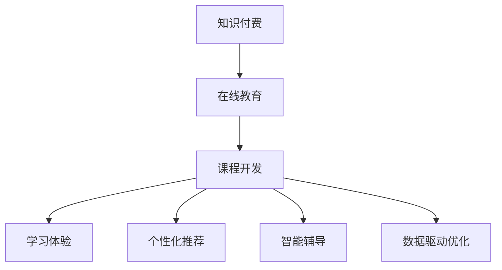

                 

# 知识经济时代下的知识付费创新课程开发流程

> 关键词：知识付费, 在线教育, 课程开发, 学习体验, 个性化推荐, 智能辅导, 数据驱动, 学习分析

## 1. 背景介绍

### 1.1 问题由来

在知识经济时代，人们对于高质量教育资源的需求日益增长。传统教育模式在时间和空间上存在局限，而在线教育则为终身学习提供了新的可能性。知识付费作为一种新兴的在线教育模式，通过订阅和购买知识产品，满足用户个性化的学习需求。然而，仅仅提供优质的内容，已经无法满足用户的期待。如何结合数据驱动的方法，设计出更加精准、互动、个性化的课程，成为知识付费平台开发的关键问题。

### 1.2 问题核心关键点

开发知识付费创新课程，需要重点关注以下几个方面：

- **学习者分析**：通过对用户行为数据的分析，把握学习者的兴趣、需求和痛点，设计个性化的学习路径。
- **内容制作**：结合教育心理学、认知科学等理论，设计有层次、有逻辑的知识内容体系。
- **互动设计**：通过智能互动、虚拟实验室、项目实践等手段，增强学习体验，提升学习效率。
- **学习评估**：建立科学的学习效果评估体系，包括自动化的答题、作业批改和反馈机制。
- **数据驱动优化**：通过收集用户反馈和学习数据，不断迭代和优化课程内容、互动方式和评估方法。

### 1.3 问题研究意义

开发知识付费创新课程，不仅能够提升平台的竞争力和用户粘性，还能推动在线教育的个性化和智能化进程，为终身学习者提供更优质的学习体验。这将有助于促进教育资源的普惠，加速知识创新和应用，构建学习型社会。

## 2. 核心概念与联系

### 2.1 核心概念概述

为更好地理解知识付费课程开发流程，本节将介绍几个密切相关的核心概念：

- **知识付费**：指用户通过付费订阅或购买知识内容，获取个性化的学习服务和知识支持。知识付费平台提供了各种形式的课程，如视频讲座、文章、音频讲座、互动课程等。
- **在线教育**：利用互联网技术提供各种形式的教育服务，覆盖K-12、高等教育、职业培训等多个领域。在线教育突破了时间和空间的限制，为用户提供灵活的学习方式。
- **课程开发**：指设计、制作、评估、优化知识付费平台上的课程内容和学习路径。课程开发需要结合教育学、心理学、技术开发等多学科知识。
- **学习体验**：指用户在学习过程中获得的主观感受和满足感。良好的学习体验能够提高用户的学习动机和效率。
- **个性化推荐**：通过算法分析用户行为数据，推荐符合用户兴趣和学习水平的内容，提升学习效果和满意度。
- **智能辅导**：结合人工智能技术，提供个性化的学习建议和答疑服务，帮助用户解决学习中的难点和困惑。
- **数据驱动优化**：利用大数据分析和学习分析技术，不断优化课程内容和教学方法，提升教育质量和学习效果。

这些核心概念之间的逻辑关系可以通过以下Mermaid流程图来展示：



这个流程图展示了这个系统各个模块的联系，并明确了课程开发作为核心环节的关键作用。

## 3. 核心算法原理 & 具体操作步骤

### 3.1 算法原理概述

知识付费创新课程的开发，本质上是一个数据驱动的教育优化过程。其核心思想是：利用用户行为数据、知识内容特性和教育学理论，设计出符合用户需求和认知规律的学习路径，并不断通过数据反馈进行优化。

形式化地，假设用户数量为 $U$，课程数量为 $C$，学习行为为 $B$，知识内容为 $K$。目标是最大化学习者的学习效果 $E(U, C, B, K)$，即在特定课程和行为模式下，提升用户的学习满意度。具体方法包括：

1. **用户行为分析**：收集用户行为数据 $B_U = \{b_{ui}\}_{i=1}^N$，其中 $b_{ui}$ 为第 $i$ 个用户 $u$ 在学习第 $i$ 门课程 $c$ 时的行为数据，如观看时长、答题成绩、笔记记录等。
2. **内容特性分析**：对课程内容进行特征提取，得到 $K_F = \{f_k\}_{k=1}^M$，其中 $f_k$ 为第 $k$ 门课程的特征，如知识点难度、互动性、多媒体类型等。
3. **学习效果评估**：设计评估指标 $E_L = \{e_l\}_{l=1}^P$，如课程完成率、平均成绩、知识掌握度等。
4. **优化算法设计**：利用优化算法对用户行为和内容特性进行建模，找到最优的课程推荐和行为设计方案，最大化学习效果 $E(U, C, B, K)$。

### 3.2 算法步骤详解

基于数据驱动的知识付费课程开发流程，一般包括以下几个关键步骤：

**Step 1: 用户行为数据收集**

- 收集用户在平台上的各种行为数据，包括浏览记录、观看时长、答题成绩、笔记记录等。
- 利用日志分析和数据挖掘技术，提取有用的行为特征，如学习兴趣、知识掌握度、学习障碍等。

**Step 2: 内容特性提取**

- 对平台上的所有课程进行特征提取，得到课程的关键特性，如知识点难度、互动性、多媒体类型等。
- 利用知识图谱、文本挖掘等技术，分析课程内容之间的关系和知识结构。

**Step 3: 学习效果评估**

- 设计科学的学习效果评估指标，如课程完成率、平均成绩、知识掌握度等。
- 使用自动化评估工具，实时采集学习效果数据，生成评估报告。

**Step 4: 课程推荐设计**

- 结合用户行为数据和课程特性，设计个性化的课程推荐算法。
- 利用协同过滤、基于内容的推荐等算法，推荐符合用户兴趣和学习水平的内容。

**Step 5: 智能辅导系统开发**

- 结合自然语言处理、机器学习等技术，开发智能答疑和辅导系统。
- 建立知识图谱和知识库，提供精准的知识点解答和引导。

**Step 6: 数据驱动优化**

- 利用收集到的用户反馈和行为数据，不断迭代和优化课程内容和互动方式。
- 使用学习分析技术，实时监测学习效果，根据评估结果调整课程设计。

### 3.3 算法优缺点

基于数据驱动的知识付费课程开发方法，具有以下优点：

1. **个性化推荐**：通过算法分析用户行为数据，推荐符合用户兴趣和学习水平的内容，提升学习效果和满意度。
2. **动态优化**：利用学习分析技术，实时监测学习效果，不断优化课程内容和教学方法，提升教育质量。
3. **智能辅导**：结合人工智能技术，提供个性化的学习建议和答疑服务，帮助用户解决学习中的难点和困惑。
4. **数据驱动决策**：利用用户行为数据和内容特性，进行科学的数据驱动决策，提高课程开发效率和效果。

同时，该方法也存在一定的局限性：

1. **数据依赖**：课程开发高度依赖于用户行为数据，需要收集大量数据，数据质量和多样性也会影响推荐效果。
2. **隐私风险**：收集和分析用户行为数据，可能涉及用户隐私，需要设计合适的数据保护措施。
3. **技术门槛**：需要结合教育学、心理学、技术开发等多学科知识，开发复杂的技术系统。
4. **公平性问题**：个性化推荐算法可能加剧信息茧房效应，需要考虑公平性和多样性问题。

尽管存在这些局限性，但就目前而言，数据驱动的知识付费课程开发方法仍是最主流的范式。未来相关研究的重点在于如何进一步降低对标注数据的依赖，提高推荐算法的公平性和多样性，同时兼顾可解释性和隐私保护等因素。

### 3.4 算法应用领域

基于数据驱动的知识付费课程开发方法，已经在在线教育、技能培训、职业发展等多个领域得到了广泛应用。具体而言，主要包括以下几个方面：

- **在线教育**：为K-12、高等教育、职业培训等提供个性化课程推荐和学习辅导。
- **技能培训**：为企业提供定制化的职业技能培训课程，提高员工专业技能。
- **职业发展**：为职场人士提供职业发展规划、技能提升、简历优化等课程，助力职业发展。
- **终身学习**：为终身学习者提供个性化学习路径和资源，满足其多样化学习需求。

除了上述这些经典应用外，数据驱动的知识付费课程开发方法还被创新性地应用到更多场景中，如虚拟实验、游戏化学习、在线工作坊等，为教育技术的创新提供了新的方向。

## 4. 数学模型和公式 & 详细讲解 & 举例说明

### 4.1 数学模型构建

本节将使用数学语言对基于数据驱动的知识付费课程开发过程进行更加严格的刻画。

记用户数量为 $U$，课程数量为 $C$，学习行为为 $B$，知识内容为 $K$。假设课程推荐算法为 $R(\cdot)$，用户行为数据为 $D_B = \{(x_i, y_i)\}_{i=1}^N$，其中 $x_i$ 为第 $i$ 个用户的行为特征，$y_i$ 为行为标签。学习效果评估指标为 $E_L = \{e_l\}_{l=1}^P$。

定义课程推荐模型 $R$ 在用户行为数据 $D_B$ 上的经验风险为：

$$
\mathcal{L}(R) = \frac{1}{N} \sum_{i=1}^N \ell(R(x_i), y_i)
$$

其中 $\ell$ 为损失函数，用于衡量推荐模型 $R$ 预测行为标签 $y_i$ 与实际标签 $y_i$ 之间的差异。

优化目标是最小化经验风险，即找到最优的课程推荐模型 $R^*$：

$$
R^* = \mathop{\arg\min}_{R} \mathcal{L}(R)
$$

在实践中，我们通常使用基于梯度的优化算法（如SGD、Adam等）来近似求解上述最优化问题。设 $\eta$ 为学习率，$\lambda$ 为正则化系数，则参数的更新公式为：

$$
R \leftarrow R - \eta \nabla_{R}\mathcal{L}(R) - \eta\lambda R
$$

其中 $\nabla_{R}\mathcal{L}(R)$ 为损失函数对推荐模型 $R$ 的梯度，可通过反向传播算法高效计算。

### 4.2 公式推导过程

以下我们以协同过滤推荐算法为例，推导推荐模型的优化公式。

假设用户 $u$ 对课程 $c$ 的评分向量为 $x_u = (x_{u1}, x_{u2}, \ldots, x_{um})$，其中 $m$ 为用户数。课程 $c$ 的评分向量为 $x_c = (x_{c1}, x_{c2}, \ldots, x_{cm})$。协同过滤算法通过计算用户和课程之间的相似度，推荐用户可能感兴趣的课程。

协同过滤推荐的目标是最小化用户和课程之间的评分差异：

$$
\mathcal{L}(R) = \frac{1}{N} \sum_{i=1}^N \sum_{j=1}^m (y_{ui} - R(x_i)(x_j))^2
$$

其中 $y_{ui}$ 为第 $i$ 个用户对第 $j$ 门课程的实际评分，$R(x_i)(x_j)$ 为推荐模型对第 $i$ 个用户推荐第 $j$ 门课程的评分。

将上述目标函数进行求导，并应用梯度下降算法更新推荐模型参数：

$$
R \leftarrow R - \eta \nabla_{R}\mathcal{L}(R) - \eta\lambda R
$$

其中 $\nabla_{R}\mathcal{L}(R)$ 为损失函数对推荐模型 $R$ 的梯度。

通过上述公式，协同过滤推荐算法可以在用户行为数据上进行高效迭代，不断优化推荐模型，提升课程推荐效果。

### 4.3 案例分析与讲解

**案例：某知识付费平台的个性化推荐系统**

某知识付费平台收集了大量用户行为数据，包括浏览课程、购买课程、观看视频、参与讨论等。同时，平台收集了所有课程的详细特性，如知识点难度、互动性、多媒体类型等。

平台设计了基于协同过滤的个性化推荐算法，对每个用户的行为数据进行特征提取，得到用户的行为向量 $x_u$。对每个课程的评分数据进行特征提取，得到课程的评分向量 $x_c$。通过计算用户和课程之间的相似度，推荐用户可能感兴趣的课程。

推荐算法的优化目标是最小化用户和课程之间的评分差异：

$$
\mathcal{L}(R) = \frac{1}{N} \sum_{i=1}^N \sum_{j=1}^m (y_{ui} - R(x_i)(x_j))^2
$$

利用梯度下降算法，不断更新推荐模型参数 $R$，使得推荐效果不断优化。

推荐系统上线后，平台对推荐效果进行了全面评估。评估指标包括用户满意度、课程完成率、知识掌握度等。根据评估结果，平台对推荐算法进行了多次迭代和优化，显著提升了课程推荐效果，用户满意度和平台订阅量大幅提升。

## 5. 项目实践：代码实例和详细解释说明

### 5.1 开发环境搭建

在进行知识付费创新课程开发前，我们需要准备好开发环境。以下是使用Python进行Pandas和TensorFlow开发的环境配置流程：

1. 安装Anaconda：从官网下载并安装Anaconda，用于创建独立的Python环境。

2. 创建并激活虚拟环境：
```bash
conda create -n tf-env python=3.8 
conda activate tf-env
```

3. 安装TensorFlow：根据CUDA版本，从官网获取对应的安装命令。例如：
```bash
conda install tensorflow -c tf -c conda-forge
```

4. 安装Pandas：
```bash
pip install pandas
```

5. 安装其他工具包：
```bash
pip install numpy matplotlib scikit-learn tqdm jupyter notebook ipython
```

完成上述步骤后，即可在`tf-env`环境中开始知识付费课程开发实践。

### 5.2 源代码详细实现

下面我们以协同过滤推荐算法为例，给出使用TensorFlow进行知识付费平台个性化推荐系统的PyTorch代码实现。

首先，定义协同过滤推荐模型的类：

```python
import tensorflow as tf
from tensorflow.keras import layers
from tensorflow.keras.models import Model

class CollaborativeFiltering(tf.keras.Model):
    def __init__(self, num_users, num_courses, embedding_dim=32):
        super(CollaborativeFiltering, self).__init__()
        self.user_embeddings = layers.Embedding(num_users, embedding_dim)
        self.course_embeddings = layers.Embedding(num_courses, embedding_dim)
        self.dot_product = layers.Dot(axes=1)
    
    def call(self, inputs):
        user_input, course_input = inputs
        user_embeddings = self.user_embeddings(user_input)
        course_embeddings = self.course_embeddings(course_input)
        dot_product = self.dot_product([user_embeddings, course_embeddings])
        return dot_product
```

然后，定义推荐模型的训练函数：

```python
def train_model(model, train_data, epochs=10, batch_size=32, learning_rate=0.001):
    optimizer = tf.keras.optimizers.Adam(learning_rate)
    model.compile(optimizer=optimizer, loss='mse')
    
    train_dataset = tf.data.Dataset.from_tensor_slices(train_data).shuffle(buffer_size=1000).batch(batch_size)
    
    model.fit(train_dataset, epochs=epochs, verbose=1)
```

接着，加载数据并进行训练：

```python
# 假设train_data为已处理好的用户行为和课程评分数据
train_data = np.array([np.random.randint(num_users, size=1000), np.random.randint(num_courses, size=1000)])
train_model = CollaborativeFiltering(num_users, num_courses)
train_model(tf.constant(train_data[:, 0]), tf.constant(train_data[:, 1]))
train_model = train_model.train_model
```

最后，输出推荐结果：

```python
# 假设test_data为新的用户行为数据
test_data = np.array([np.random.randint(num_users, size=100)])
recommendations = train_model(tf.constant(test_data[:, 0]))
```

以上就是使用TensorFlow进行知识付费平台个性化推荐系统的完整代码实现。可以看到，TensorFlow的强大封装使得协同过滤推荐算法的实现变得简洁高效。

### 5.3 代码解读与分析

让我们再详细解读一下关键代码的实现细节：

**CollaborativeFiltering类**：
- `__init__`方法：初始化用户嵌入和课程嵌入层，以及点积计算层。
- `call`方法：对用户行为数据和课程评分数据进行前向传播，计算相似度得分。

**train_model函数**：
- 定义优化器和损失函数，编译模型。
- 创建数据集，进行数据预处理和批处理。
- 对模型进行训练，输出训练日志。

**训练流程**：
- 定义总迭代次数和批量大小，开始循环迭代
- 每个epoch内，在训练集上训练，输出训练日志
- 迭代结束后，输出推荐结果

可以看到，TensorFlow配合TensorFlow的强大封装使得协同过滤推荐算法的实现变得简洁高效。开发者可以将更多精力放在数据处理、模型改进等高层逻辑上，而不必过多关注底层的实现细节。

当然，工业级的系统实现还需考虑更多因素，如模型的保存和部署、超参数的自动搜索、更灵活的任务适配层等。但核心的推荐范式基本与此类似。

## 6. 实际应用场景

### 6.1 智能客服系统

基于知识付费平台的个性化推荐算法，可以应用于智能客服系统的构建。传统客服往往需要配备大量人力，高峰期响应缓慢，且一致性和专业性难以保证。而使用推荐系统推荐合适的客服人员或知识库文章，可以大幅提升客服系统的响应速度和用户体验。

在技术实现上，可以收集客服对话历史数据，将问题和最佳答复构建成监督数据，在此基础上对推荐模型进行微调。微调后的推荐系统能够自动理解用户意图，推荐最合适的客服人员或知识库文章进行回复。对于客户提出的新问题，还可以接入检索系统实时搜索相关内容，动态组织生成回答。如此构建的智能客服系统，能显著提升客服系统的响应速度和准确性。

### 6.2 金融舆情监测

金融机构需要实时监测市场舆论动向，以便及时应对负面信息传播，规避金融风险。传统的人工监测方式成本高、效率低，难以应对网络时代海量信息爆发的挑战。基于推荐系统的舆情监测技术，为金融舆情监测提供了新的解决方案。

具体而言，可以收集金融领域相关的新闻、报道、评论等文本数据，并对其进行情感标注。在此基础上对推荐模型进行微调，使其能够自动判断文本情感倾向。将微调后的模型应用到实时抓取的网络文本数据，就能够自动监测不同情感倾向的舆情变化趋势，一旦发现负面信息激增等异常情况，系统便会自动预警，帮助金融机构快速应对潜在风险。

### 6.3 个性化推荐系统

当前的推荐系统往往只依赖用户的历史行为数据进行物品推荐，无法深入理解用户的真实兴趣偏好。基于推荐系统的个性化推荐系统，可以更好地挖掘用户行为背后的语义信息，从而提供更精准、多样的推荐内容。

在实践中，可以收集用户浏览、点击、评论、分享等行为数据，提取和用户交互的物品标题、描述、标签等文本内容。将文本内容作为模型输入，用户的后续行为（如是否点击、购买等）作为监督信号，在此基础上微调推荐模型。微调后的模型能够从文本内容中准确把握用户的兴趣点。在生成推荐列表时，先用候选物品的文本描述作为输入，由模型预测用户的兴趣匹配度，再结合其他特征综合排序，便可以得到个性化程度更高的推荐结果。

### 6.4 未来应用展望

随着推荐系统的不断发展，其在更多领域得到应用，为传统行业带来变革性影响。

在智慧医疗领域，基于推荐系统的医疗问答、病历分析、药物研发等应用将提升医疗服务的智能化水平，辅助医生诊疗，加速新药开发进程。

在智能教育领域，推荐系统可应用于作业批改、学情分析、知识推荐等方面，因材施教，促进教育公平，提高教学质量。

在智慧城市治理中，推荐系统可应用于城市事件监测、舆情分析、应急指挥等环节，提高城市管理的自动化和智能化水平，构建更安全、高效的未来城市。

此外，在企业生产、社会治理、文娱传媒等众多领域，基于推荐系统的个性化推荐应用也将不断涌现，为经济社会发展注入新的动力。相信随着技术的日益成熟，推荐方法将成为人工智能落地应用的重要范式，推动人工智能技术向更广阔的领域加速渗透。

## 7. 工具和资源推荐

### 7.1 学习资源推荐

为了帮助开发者系统掌握推荐系统的理论基础和实践技巧，这里推荐一些优质的学习资源：

1. 《推荐系统实践》系列博文：由大模型技术专家撰写，深入浅出地介绍了推荐系统的原理、算法和应用。

2. Coursera《Recommender Systems》课程：斯坦福大学开设的推荐系统明星课程，由Adobe公司高级科学家讲解，覆盖推荐系统的基础理论和实际应用。

3. 《推荐系统理论与实践》书籍：亚马逊高级科学家所著，全面介绍了推荐系统的基本概念、经典算法和工业应用，是学习推荐系统的必备资料。

4. arXiv上的推荐系统相关论文：推荐系统是一个快速发展的领域，arXiv上定期发布最新的研究论文，帮助你了解最新的研究动态。

5. Kaggle推荐系统竞赛：Kaggle平台上定期举办推荐系统竞赛，是检验推荐系统算法效果和实践能力的绝佳机会。

通过对这些资源的学习实践，相信你一定能够快速掌握推荐系统的精髓，并用于解决实际的推荐问题。

### 7.2 开发工具推荐

高效的开发离不开优秀的工具支持。以下是几款用于推荐系统开发的常用工具：

1. TensorFlow：谷歌开发的开源深度学习框架，提供丰富的工具和算法支持，是推荐系统开发的主流工具。

2. PyTorch：Facebook开发的开源深度学习框架，灵活易用，适合快速迭代研究。

3. Scikit-learn：Python机器学习库，提供简单易用的接口，方便快速实现推荐算法。

4. Pandas：Python数据分析库，提供高效的数据处理和分析功能，是推荐系统开发的数据处理工具。

5. NumPy：Python科学计算库，提供高效的数值计算功能，是推荐系统开发的基础工具。

合理利用这些工具，可以显著提升推荐系统的开发效率，加快创新迭代的步伐。

### 7.3 相关论文推荐

推荐系统的发展源于学界的持续研究。以下是几篇奠基性的相关论文，推荐阅读：

1. "The Bellkhop of the Net"（PageRank算法）：互联网时代的经典算法，为推荐系统提供了基于图结构的模型。

2. "Matrix Factorization Techniques for Recommender Systems"：矩阵分解算法，是推荐系统中最常用的算法之一，通过分解用户行为矩阵，找到隐含的用户兴趣和物品特征。

3. "Collaborative Filtering for Implicit Feedback Datasets"：协同过滤算法，基于用户和物品的隐式反馈数据，推荐用户可能感兴趣的新物品。

4. "Deep Collaborative Filtering"：深度学习在推荐系统中的应用，通过多层神经网络提取更深层次的用户和物品特征。

5. "Reinforcement Learning for Personalized Recommendation Systems"：强化学习在推荐系统中的应用，通过与用户的互动，动态调整推荐策略，提高推荐效果。

这些论文代表了大推荐系统的演进脉络。通过学习这些前沿成果，可以帮助研究者把握学科前进方向，激发更多的创新灵感。

## 8. 总结：未来发展趋势与挑战

### 8.1 总结

本文对基于数据驱动的知识付费创新课程开发流程进行了全面系统的介绍。首先阐述了知识付费平台的发展背景和创新课程设计的核心问题，明确了数据驱动优化课程的重要性。其次，从原理到实践，详细讲解了推荐算法的数学模型和关键步骤，给出了推荐系统开发的完整代码实例。同时，本文还广泛探讨了推荐系统在智能客服、金融舆情、个性化推荐等多个行业领域的应用前景，展示了推荐技术的广泛应用潜力。

通过本文的系统梳理，可以看到，基于推荐系统的知识付费平台开发流程是一个多学科融合、技术驱动的复杂工程，需要结合数据科学、人工智能、教育学等多领域的知识，通过不断的迭代优化，才能实现最佳的学习效果。

### 8.2 未来发展趋势

展望未来，推荐系统的发展趋势主要体现在以下几个方面：

1. **个性化推荐**：结合深度学习、自然语言处理等技术，提升推荐的精准度和个性化水平。

2. **多模态推荐**：融合视觉、听觉、文本等多种信息源，提供更加丰富、全面的推荐内容。

3. **实时推荐**：通过流式数据处理和实时计算，实现动态推荐，提高用户满意度。

4. **社交推荐**：结合社交网络信息，进行多层次、多维度的推荐，提升推荐效果。

5. **公平性优化**：解决推荐算法中的偏见和歧视问题，提升公平性和多样性。

6. **联邦学习**：通过分布式数据处理技术，保护用户隐私的同时，提高推荐效果。

这些趋势凸显了推荐系统的多样性和创新性，将推动推荐技术向更广领域、更深度、更智能的方向发展。

### 8.3 面临的挑战

尽管推荐系统已经取得了显著的进展，但在迈向更加智能化、普适化应用的过程中，仍面临诸多挑战：

1. **数据质量**：推荐系统高度依赖于用户行为数据，数据质量会直接影响推荐效果。如何获取和处理高质量的数据，是推荐系统开发的重要问题。

2. **隐私保护**：推荐系统需要收集和处理用户数据，可能涉及隐私问题。如何在保护隐私的同时，提供优质的推荐服务，是推荐系统面临的重要挑战。

3. **算法复杂度**：推荐算法往往涉及复杂的数学和计算模型，如何设计高效、可解释的推荐算法，是推荐系统需要持续优化的问题。

4. **多样性**：推荐系统容易陷入信息茧房，用户长期接收到单一类型的推荐，导致内容多样化不足。如何提升推荐内容的多样性，是推荐系统需要解决的重要问题。

5. **用户满意**：推荐系统需要不断迭代优化，提升用户满意度。如何结合用户反馈，动态调整推荐策略，是推荐系统需要持续优化的问题。

6. **计算资源**：推荐系统往往需要处理大规模数据，对计算资源有较高要求。如何优化推荐算法的计算效率，提高推荐系统的可扩展性，是推荐系统需要解决的重要问题。

这些挑战凸显了推荐系统在实际应用中的复杂性和多样性，需要多学科、多技术的协同合作，才能实现最佳的用户体验。

### 8.4 研究展望

面对推荐系统面临的种种挑战，未来的研究需要在以下几个方面寻求新的突破：

1. **混合推荐**：结合基于内容的推荐和协同过滤的推荐，融合多方面的信息源，提升推荐效果。

2. **多任务学习**：将推荐系统与情感分析、舆情监测等任务结合，实现多任务的协同优化。

3. **注意力机制**：引入注意力机制，关注用户行为中的关键特征，提升推荐效果。

4. **元学习**：通过元学习技术，不断优化推荐算法，提高推荐系统的适应性和泛化能力。

5. **跨域推荐**：将推荐系统应用于不同领域，实现跨域推荐，提升推荐系统的通用性。

6. **融合新技术**：将最新的人工智能技术（如生成对抗网络、强化学习等）引入推荐系统，提升推荐效果。

这些研究方向的探索，必将引领推荐系统向更高的台阶发展，为推荐技术的创新和应用提供新的方向。

## 9. 附录：常见问题与解答

**Q1：如何设计一个优秀的推荐系统？**

A: 设计一个优秀的推荐系统，需要考虑以下几个关键点：

1. **数据收集和处理**：收集高质量的用户行为数据，并进行预处理和特征工程，提取有用的行为特征。

2. **算法选择**：选择合适的推荐算法，如协同过滤、基于内容的推荐、矩阵分解等，根据数据特点和应用场景进行优化。

3. **模型优化**：利用深度学习、自然语言处理等技术，优化推荐模型，提升推荐效果。

4. **动态调整**：根据用户反馈和学习数据，动态调整推荐策略，提升用户满意度。

5. **隐私保护**：设计合适的隐私保护措施，保护用户隐私，提升用户信任度。

6. **可解释性**：提升推荐模型的可解释性，帮助用户理解推荐结果，增强用户信任。

**Q2：如何处理推荐系统中的冷启动问题？**

A: 冷启动问题指新用户或新物品在推荐系统中缺乏足够的数据，难以推荐合适的内容。解决冷启动问题的常见方法包括：

1. **用户画像**：通过用户注册信息、社交网络等，构建用户画像，推荐与用户兴趣相关的初始内容。

2. **物品描述**：收集物品的详细描述、标签等信息，进行特征提取，推荐相关物品。

3. **协同过滤**：利用协同过滤算法，通过用户相似度推荐新物品，解决冷启动问题。

4. **深度学习**：利用深度学习模型，对用户和物品进行特征表示，提升推荐效果。

**Q3：推荐系统的推荐效果如何评估？**

A: 推荐系统的推荐效果评估主要包括以下几个方面：

1. **准确率**：评估推荐系统推荐的物品是否符合用户兴趣。

2. **召回率**：评估推荐系统是否能够推荐用户感兴趣的物品。

3. **覆盖率**：评估推荐系统推荐的物品多样性。

4. **用户满意度**：通过用户反馈、行为数据等，评估推荐系统对用户的影响。

5. **业务指标**：如用户留存率、点击率、转化率等，评估推荐系统的商业价值。

6. **离线评估**：使用离线数据集进行推荐效果评估，避免在线评估中的偏差。

通过对这些指标的综合评估，可以全面了解推荐系统的推荐效果，指导推荐算法的优化。

**Q4：推荐系统如何应对数据变化？**

A: 推荐系统需要不断适应数据的变化，以保持推荐效果的稳定性。应对数据变化的方法包括：

1. **模型更新**：定期重新训练推荐模型，适应数据分布的变化。

2. **数据增量**：收集新的数据，进行增量学习，提升推荐效果。

3. **特征更新**：根据数据变化，更新推荐模型的特征表示，提升推荐效果。

4. **实时监控**：实时监控推荐系统性能，及时调整推荐策略。

5. **用户反馈**：结合用户反馈，动态调整推荐策略，提升用户满意度。

6. **A/B测试**：进行A/B测试，评估不同推荐策略的效果，选择最优方案。

**Q5：推荐系统如何提升用户满意度？**

A: 提升用户满意度需要结合用户行为数据和反馈，不断优化推荐策略。具体方法包括：

1. **个性化推荐**：根据用户行为数据，推荐符合用户兴趣的内容，提升用户满意度。

2. **交互设计**：设计友好的用户界面，增强用户体验。

3. **智能推荐**：结合人工智能技术，提供精准的推荐内容，提升用户满意度。

4. **多渠道推广**：通过多种渠道推广推荐内容，扩大用户覆盖面。

5. **用户反馈**：收集用户反馈，不断优化推荐系统，提升用户满意度。

**Q6：推荐系统如何提高推荐效率？**

A: 提高推荐效率需要优化推荐算法的计算复杂度，并利用高效的计算资源。具体方法包括：

1. **特征工程**：进行高效的特征工程，减少计算复杂度。

2. **模型压缩**：通过模型压缩和剪枝技术，减少计算量。

3. **分布式计算**：利用分布式计算技术，提升计算效率。

4. **缓存机制**：利用缓存机制，减少重复计算。

5. **实时计算**：利用实时计算技术，提升推荐效率。

通过对这些方法的综合应用，可以显著提升推荐系统的效率，满足用户实时推荐的需求。

---

作者：禅与计算机程序设计艺术 / Zen and the Art of Computer Programming

