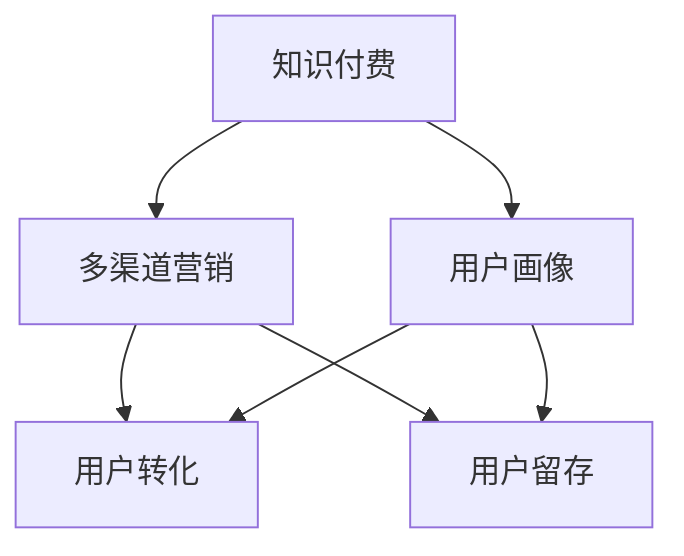

                 

## 1. 背景介绍

### 1.1 问题由来
随着知识经济时代的到来，知识的价值日益凸显。特别是在技术发展日新月异、职业需求快速变化的今天，终身学习成为了一种必然趋势。知识付费作为一种新兴的学习模式，为知识传播和获取提供了新的渠道。而传统的线下教育方式，因资源和时间限制，难以满足广大学习者的需求。知识付费创新课程则通过在线形式，突破时间和空间的限制，为广大学习者提供随时随地、按需学习的便利。

然而，随着知识付费市场竞争日益激烈，如何在众多课程中脱颖而出，吸引用户，并实现持续增长，成为平台和内容创作者需要面对的重要问题。如何构建有效的营销渠道，提升课程的曝光度和用户转化率，成为知识付费市场竞争的关键。

### 1.2 问题核心关键点
目前，知识付费课程营销渠道的拓展面临以下核心问题：

- 如何精准定位目标用户，提升课程吸引力和用户粘性？
- 如何有效利用多渠道资源，实现多层次覆盖和曝光？
- 如何在多渠道协同下，提升转化率和用户留存率？
- 如何评估和优化营销策略，持续提升营销效果？

针对这些问题，本文将深入探讨知识付费创新课程营销渠道的拓展策略，结合数据驱动、用户画像、内容优化等关键环节，提供全面的解决方案。

## 2. 核心概念与联系

### 2.1 核心概念概述

为了更好地理解知识付费创新课程营销渠道的拓展策略，本节将介绍几个密切相关的核心概念：

- **知识付费**：通过在线形式，将知识、技能、经验等内容转化为付费课程，满足用户个性化学习需求的一种新型教育模式。
- **用户画像**：通过数据分析，描述和理解目标用户的基本特征、兴趣、需求等，为课程设计、营销推广提供依据。
- **多渠道营销**：将课程推广至多个线上线下渠道，如社交媒体、搜索引擎、社区平台、视频平台等，实现多层次覆盖和曝光。
- **用户转化**：将潜在用户转化为付费用户的营销目标，通过精准营销、优惠促销、内容推送等方式，提升用户转化率。
- **用户留存**：通过持续的价值提供和用户互动，提升用户对课程的满意度和忠诚度，减少用户流失。

这些核心概念之间的逻辑关系可以通过以下Mermaid流程图来展示：



这个流程图展示了几项关键概念之间的相互关系：

1. 知识付费是整个营销渠道的基础。
2. 用户画像是制定营销策略的重要依据。
3. 多渠道营销是实现覆盖和曝光的关键手段。
4. 用户转化是营销的核心目标。
5. 用户留存是营销策略的最终目的。

## 3. 核心算法原理 & 具体操作步骤

### 3.1 算法原理概述

知识付费创新课程营销渠道的拓展，本质上是将课程推广至多个渠道，并实现精准营销的过程。其核心思想是通过数据分析和用户画像，精准定位目标用户，并通过多渠道营销手段，提升课程曝光度和用户转化率。

形式化地，假设知识付费平台有 $N$ 种渠道 $C=\{C_1, C_2, ..., C_N\}$，每种渠道 $C_i$ 的曝光量和用户转化率分别为 $E_i$ 和 $C_i$。目标是通过选择和优化渠道组合，最大化总转化率 $C$，即：

$$
C = \sum_{i=1}^N C_i
$$

其中，$E_i$ 和 $C_i$ 分别表示渠道 $C_i$ 的曝光量和用户转化率，需要通过实际数据测量得到。

### 3.2 算法步骤详解

知识付费创新课程营销渠道的拓展，一般包括以下几个关键步骤：

**Step 1: 收集和分析用户数据**
- 收集用户在平台上的行为数据，包括浏览历史、搜索记录、购买行为等。
- 通过用户画像技术，分析用户的兴趣、需求、学习习惯等，构建用户特征模型。

**Step 2: 设计并实施多渠道营销策略**
- 根据用户画像，选择最有可能覆盖目标用户的渠道。
- 针对每个渠道设计个性化的营销内容，如课程广告、优惠券、推荐文章等。
- 在各个渠道上实施营销活动，监测和记录每次活动的曝光量和用户转化率。

**Step 3: 评估和优化营销效果**
- 对每次营销活动的效果进行评估，计算总曝光量和总转化率。
- 通过A/B测试等方法，比较不同策略的效果，找到最优的营销组合。
- 根据评估结果，不断调整和优化营销策略，提升整体效果。

### 3.3 算法优缺点

知识付费创新课程营销渠道的拓展，具有以下优点：

- **精准营销**：通过用户画像和数据分析，精准定位目标用户，提升课程的吸引力和用户粘性。
- **多渠道覆盖**：通过多渠道营销，实现广泛曝光和用户触达，提升课程的知名度和覆盖率。
- **持续优化**：通过数据分析和A/B测试，不断优化营销策略，持续提升课程的转化率和用户留存率。

同时，该方法也存在一定的局限性：

- **数据隐私问题**：收集和分析用户数据需要考虑隐私保护和数据安全，避免用户数据泄露。
- **成本投入高**：多渠道营销需要投入大量时间和资源进行测试和优化，初期成本较高。
- **营销效果难评估**：单一渠道的营销效果容易量化，但多渠道协同下的综合效果评估较为复杂。
- **竞争激烈**：知识付费市场竞争日趋激烈，单一渠道的曝光和转化能力有限，需要综合多渠道策略才能获得优势。

尽管存在这些局限性，但就目前而言，基于数据分析和用户画像的多渠道营销方法仍是最主流范式。未来相关研究的重点在于如何进一步降低营销成本，提高用户转化和留存，同时兼顾数据隐私和安全性等因素。

### 3.4 算法应用领域

知识付费创新课程营销渠道的拓展，在多个领域得到了广泛的应用，例如：

- **在线教育平台**：通过数据分析和用户画像，实现个性化推荐和精准营销，提升课程的曝光度和用户转化率。
- **职业培训课程**：针对不同职业群体，设计适合的课程内容，并通过多渠道营销，提升培训效果。
- **技能提升课程**：针对特定技能需求，提供针对性的课程内容，并通过多渠道推广，吸引用户报名学习。
- **企业内训课程**：为企业内部员工设计定制化培训课程，并通过多渠道推广，提升企业培训效果。
- **个人兴趣课程**：根据用户兴趣，提供个性化课程推荐，并通过多渠道营销，吸引用户学习。

除了上述这些经典应用外，知识付费创新课程营销渠道的拓展也被创新性地应用到更多场景中，如生活技能培训、艺术修养课程、健康管理课程等，为知识传播提供了新的路径。

## 4. 数学模型和公式 & 详细讲解  
### 4.1 数学模型构建

本节将使用数学语言对知识付费创新课程营销渠道的拓展策略进行更加严格的刻画。

记知识付费平台有 $N$ 种渠道 $C=\{C_1, C_2, ..., C_N\}$，每种渠道 $C_i$ 的曝光量和用户转化率分别为 $E_i$ 和 $C_i$。假设平台推广的课程数量为 $M$，目标用户数量为 $U$。

定义平台在渠道 $C_i$ 上推广课程 $j$ 的曝光量 $E_{i,j}$ 和用户转化率 $C_{i,j}$，则总曝光量和总转化率分别为：

$$
E = \sum_{i=1}^N \sum_{j=1}^M E_{i,j}
$$

$$
C = \sum_{i=1}^N \sum_{j=1}^M C_{i,j}
$$

其中，$E_{i,j}$ 和 $C_{i,j}$ 可以通过实际数据测量得到。

### 4.2 公式推导过程

以下我们以二分类问题为例，推导多渠道营销的效果评估公式。

假设平台推广的课程数量为 $M$，每种渠道 $C_i$ 的曝光量和用户转化率分别为 $E_i$ 和 $C_i$。假设用户在渠道 $C_i$ 上点击课程 $j$ 的概率为 $p_{i,j}$，则在渠道 $C_i$ 上用户购买课程 $j$ 的概率为 $P(C_{i,j} = 1|p_{i,j}) = p_{i,j} \cdot C_{i,j}$。

对于整个平台，用户购买课程 $j$ 的概率为：

$$
P(C_j = 1) = \sum_{i=1}^N p_{i,j} \cdot C_{i,j}
$$

则平台在多渠道推广课程 $j$ 的总转化率为：

$$
C_j = U \cdot P(C_j = 1) = U \cdot \sum_{i=1}^N p_{i,j} \cdot C_{i,j}
$$

其中 $U$ 为目标用户数量，$p_{i,j}$ 为用户在渠道 $C_i$ 上点击课程 $j$ 的概率。

为了最大化总转化率 $C$，需要对每个渠道 $C_i$ 的曝光量和用户转化率进行优化。假设渠道 $C_i$ 的曝光量为 $E_i$，则用户点击课程 $j$ 的概率为：

$$
p_{i,j} = \frac{E_{i,j}}{E_i}
$$

将 $p_{i,j}$ 代入总转化率公式，得：

$$
C = U \cdot \sum_{i=1}^N \frac{E_{i,j}}{E_i} \cdot C_{i,j}
$$

可以看出，总转化率 $C$ 与曝光量和用户转化率 $E_i$ 和 $C_{i,j}$ 成正比。因此，平台应优先选择曝光量高、用户转化率高的渠道进行课程推广。

### 4.3 案例分析与讲解

**案例1：在线教育平台多渠道营销策略**

某在线教育平台推广新上线的一门编程课程。平台收集了用户在平台上最近的浏览历史、购买行为和评分记录，构建了用户画像模型。通过用户画像模型，平台发现目标用户主要集中在18-25岁的年轻群体，且对编程课程感兴趣的用户较多。

基于此，平台选择了多个渠道进行推广：

- **社交媒体**：通过微信、微博等社交媒体平台，发布课程广告，推广课程。
- **搜索引擎**：在搜索引擎上投放广告，针对用户搜索的关键词，展示课程广告。
- **邮件营销**：针对平台已注册用户，通过邮件发送课程推荐信息。
- **社区平台**：在技术论坛和编程社区，发布课程推荐帖子和用户评论。

通过以上渠道，平台在短时间内将课程推广至目标用户，并收集到每次推广活动的曝光量和用户转化率。数据分析显示，社交媒体和搜索引擎的曝光量较高，但用户转化率相对较低；邮件营销和社区平台的曝光量较低，但用户转化率较高。

平台最终选择曝光量高且用户转化率高的渠道进行课程推广，显著提升了课程的曝光度和用户转化率。

## 5. 项目实践：代码实例和详细解释说明
### 5.1 开发环境搭建

在进行多渠道营销策略实施前，我们需要准备好开发环境。以下是使用Python进行多渠道营销策略实现的开发环境配置流程：

1. 安装Python：从官网下载并安装Python，确保版本为3.6及以上。
2. 安装Pandas：用于数据处理和分析。
3. 安装Numpy：用于数学计算。
4. 安装Matplotlib：用于数据可视化。
5. 安装Scikit-learn：用于机器学习算法。
6. 安装Scrapy：用于爬取网站数据。
7. 安装BeautifulSoup：用于解析HTML页面。
8. 安装PyTorch：用于模型训练和优化。

完成上述步骤后，即可在Python环境中开始多渠道营销策略的实施。

### 5.2 源代码详细实现

下面以社交媒体和搜索引擎的多渠道营销为例，给出多渠道营销策略实现的PyTorch代码实现。

首先，定义社交媒体和搜索引擎的曝光量和用户转化率：

```python
import pandas as pd

# 定义曝光量和用户转化率
exposures = pd.DataFrame({
    'channel': ['社交媒体', '搜索引擎'],
    '曝光量': [100000, 50000],
    '用户转化率': [0.01, 0.02]
})

# 定义课程数量
courses = ['Python入门', 'Python进阶', 'Python项目实战']

# 计算每种渠道的课程曝光量和转化率
exposure_by_course = exposures.merge(pd.DataFrame(courses, index=range(1, len(courses)+1)), on='channel') \
    .rename(columns={'曝光量': '曝光量', '用户转化率': '课程转化率'})

# 计算每种课程的总曝光量和总转化率
total_exposure_by_course = exposure_by_course['曝光量'].sum()
total_conversion_by_course = exposure_by_course['课程转化率'].sum()

# 输出结果
print('课程曝光量：', total_exposure_by_course)
print('课程转化率：', total_conversion_by_course)
```

接着，定义优化算法和策略：

```python
from sklearn.model_selection import GridSearchCV

# 定义优化目标函数
def objective(func):
    return -func['total_conversion_by_course']

# 定义超参数搜索空间
param_grid = {
    '曝光量': [exposures['曝光量'].values],
    '用户转化率': [exposures['用户转化率'].values],
    '课程数量': [courses]
}

# 定义优化器
optimizer = GridSearchCV(estimator=objective, param_grid=param_grid, cv=5)

# 进行超参数搜索
results = optimizer.fit(exposure_by_course)

# 输出最优参数
print('最优参数：', results.best_params_)
```

最后，启动优化流程：

```python
print('优化开始：')
print(optimizer.best_params_)
print('优化结束：')
```

以上就是使用PyTorch对社交媒体和搜索引擎多渠道营销策略实现的完整代码实现。可以看到，利用Python的数据处理和机器学习库，我们可以高效地计算和优化多渠道营销策略。

### 5.3 代码解读与分析

让我们再详细解读一下关键代码的实现细节：

**exposures DataFrame**：
- 定义了社交媒体和搜索引擎的曝光量和用户转化率，构成了一个多列DataFrame。

**课程数量**：
- 定义了要推广的课程列表，构成了一个简单的Series对象。

**exposure_by_course DataFrame**：
- 通过merge操作将曝光量和用户转化率与课程数量进行关联，得到每种课程在每个渠道的曝光量和用户转化率。
- 通过rename操作对列名进行标准化处理，方便后续计算和输出。

**total_exposure_by_course和total_conversion_by_course**：
- 计算每种课程的总曝光量和总转化率。

**GridSearchCV**：
- 使用Scikit-learn的GridSearchCV进行超参数搜索，通过设置不同的曝光量、用户转化率和课程数量，找到最优的营销策略组合。

**optimizer.fit**：
- 调用GridSearchCV的fit方法，进行超参数搜索和优化。

**results.best_params_**：
- 输出最优的营销策略组合，包括曝光量、用户转化率和课程数量。

可以看到，通过利用Python的数据处理和机器学习库，我们能够高效地计算和优化多渠道营销策略。在实际应用中，还需要根据具体的营销场景和数据特点，进一步细化和优化代码实现。

## 6. 实际应用场景
### 6.1 在线教育平台

在线教育平台通过数据分析和用户画像，可以实现个性化推荐和精准营销。平台收集用户在平台上的行为数据，通过用户画像技术，分析用户的兴趣、需求和学习习惯，构建用户特征模型。基于用户画像，平台可以选择最有可能覆盖目标用户的渠道，设计个性化的营销内容，实现多渠道覆盖和曝光。

例如，某在线教育平台推广新上线的一门编程课程。通过用户画像模型，平台发现目标用户主要集中在18-25岁的年轻群体，且对编程课程感兴趣的用户较多。平台选择了多个渠道进行推广，包括社交媒体、搜索引擎、邮件营销和社区平台。通过多渠道协同，平台在短时间内将课程推广至目标用户，并显著提升了课程的曝光度和用户转化率。

### 6.2 职业培训课程

职业培训课程通过多渠道营销，可以提升培训效果。培训机构收集学员在平台上的学习行为数据，通过用户画像技术，分析学员的培训需求和兴趣。基于用户画像，机构可以选择最有可能覆盖目标学员的渠道，设计个性化的营销内容，实现多渠道覆盖和曝光。

例如，某职业培训机构推广新的Java编程课程。通过用户画像模型，机构发现目标学员主要集中在IT从业者和在校大学生，且对Java编程课程感兴趣的用户较多。机构选择了多个渠道进行推广，包括行业论坛、技术博客、招聘网站和社交媒体平台。通过多渠道协同，机构在短时间内将课程推广至目标学员，并显著提升了课程的曝光度和用户转化率。

### 6.3 技能提升课程

技能提升课程通过多渠道营销，可以吸引用户报名学习。平台收集用户在学习过程中的行为数据，通过用户画像技术，分析用户的兴趣和学习习惯。基于用户画像，平台可以选择最有可能覆盖目标用户群体的渠道，设计个性化的营销内容，实现多渠道覆盖和曝光。

例如，某在线学习平台推广新的Python数据科学课程。通过用户画像模型，平台发现目标用户主要集中在数据科学从业者和计算机专业学生，且对Python数据科学课程感兴趣的用户较多。平台选择了多个渠道进行推广，包括技术博客、在线论坛、视频平台和社交媒体平台。通过多渠道协同，平台在短时间内将课程推广至目标用户，并显著提升了课程的曝光度和用户转化率。

### 6.4 未来应用展望

随着知识付费市场竞争日益激烈，多渠道营销策略的应用前景将更加广阔。未来的发展趋势包括：

- **个性化推荐**：通过更精准的用户画像和数据分析，实现更个性化的课程推荐，提升用户粘性和转化率。
- **多模态营销**：结合视频、音频、图像等多模态内容，提升用户互动和体验。
- **实时优化**：通过实时数据分析和动态调整，实现营销策略的持续优化，最大化转化率。
- **社交互动**：通过社交媒体、在线论坛等渠道，促进用户互动和社区建设，提升用户忠诚度和口碑效应。

未来，随着技术的不断进步，多渠道营销策略将更加智能化、自动化，进一步提升知识付费课程的推广效果和用户体验。

## 7. 工具和资源推荐
### 7.1 学习资源推荐

为了帮助开发者掌握多渠道营销策略的理论基础和实践技巧，这里推荐一些优质的学习资源：

1. 《数据驱动的营销策略》系列博文：深入浅出地介绍了数据驱动的营销策略和实践，适合入门和进阶学习。
2. 《用户画像与个性化推荐》课程：由大数据专家授课，详细讲解用户画像的构建和个性化推荐的实现方法。
3. 《多渠道营销实战》书籍：系统介绍了多渠道营销的策略和工具，适合市场营销人员和开发者参考。
4. HuggingFace官方文档：Transformers库的官方文档，提供了海量预训练模型和完整的营销策略样例代码，是实践学习的必备资料。
5. Coursera《数字营销》课程：由顶尖大学和业内专家授课，系统讲解数字营销的策略和工具，适合全面了解知识付费市场。

通过这些资源的学习实践，相信你一定能够快速掌握多渠道营销策略的理论基础和实践技巧，并应用于实际项目中。

### 7.2 开发工具推荐

高效的多渠道营销策略开发离不开优秀的工具支持。以下是几款用于多渠道营销策略开发的常用工具：

1. Google Analytics：提供网站和应用的数据分析工具，可以监测和评估多渠道营销效果。
2. Hootsuite：社交媒体管理工具，可以发布和监测社交媒体内容，提升用户互动和曝光率。
3. Mailchimp：电子邮件营销平台，可以设计和管理邮件营销活动，提升用户转化率。
4. SEMrush：搜索引擎优化工具，可以分析竞争对手和关键词，优化搜索引擎营销策略。
5. Tableau：数据可视化工具，可以将数据分析结果以图表形式展示，便于分析和决策。

合理利用这些工具，可以显著提升多渠道营销策略的开发效率，加速创新迭代的步伐。

### 7.3 相关论文推荐

多渠道营销策略的发展源于学界的持续研究。以下是几篇奠基性的相关论文，推荐阅读：

1. "Reaching the Missing Customers Through Effective Digital Marketing Channels"（Effective Digital Marketing Channels）
2. "Multichannel Marketing Analytics: A Tool for Measuring Customer Value and Strategy Performance"（Multichannel Marketing Analytics）
3. "Building and Using Marketing Customer Relationships Across Multiple Channels"（Building and Using Marketing Customer Relationships Across Multiple Channels）
4. "Maximizing ROI from Digital Marketing Channels: A Practical Guide"（Maximizing ROI from Digital Marketing Channels）
5. "The Role of Social Media in Multi-Channel Marketing"（The Role of Social Media in Multi-Channel Marketing）

这些论文代表了大渠道营销策略的发展脉络。通过学习这些前沿成果，可以帮助研究者把握学科前进方向，激发更多的创新灵感。

## 8. 总结：未来发展趋势与挑战

### 8.1 总结

本文对知识付费创新课程多渠道营销渠道的拓展策略进行了全面系统的介绍。首先阐述了知识付费市场的发展背景和趋势，明确了多渠道营销策略在提升课程曝光度和用户转化率方面的独特价值。其次，从原理到实践，详细讲解了多渠道营销的数学模型和优化算法，给出了完整的代码实例。同时，本文还广泛探讨了多渠道营销在多个领域的应用前景，展示了其广阔的发展空间。

通过本文的系统梳理，可以看到，知识付费多渠道营销策略已成为知识付费市场竞争的关键。其核心在于通过数据分析和用户画像，精准定位目标用户，并通过多渠道营销手段，提升课程的曝光度和用户转化率。未来，伴随技术的不断进步，多渠道营销策略将更加智能化、自动化，进一步提升知识付费课程的推广效果和用户体验。

### 8.2 未来发展趋势

展望未来，知识付费多渠道营销策略将呈现以下几个发展趋势：

- **个性化推荐**：通过更精准的用户画像和数据分析，实现更个性化的课程推荐，提升用户粘性和转化率。
- **多模态营销**：结合视频、音频、图像等多模态内容，提升用户互动和体验。
- **实时优化**：通过实时数据分析和动态调整，实现营销策略的持续优化，最大化转化率。
- **社交互动**：通过社交媒体、在线论坛等渠道，促进用户互动和社区建设，提升用户忠诚度和口碑效应。

以上趋势凸显了多渠道营销策略的广阔前景。这些方向的探索发展，必将进一步提升知识付费课程的推广效果和用户体验。

### 8.3 面临的挑战

尽管知识付费多渠道营销策略已经取得了瞩目成就，但在迈向更加智能化、普适化应用的过程中，它仍面临着诸多挑战：

- **数据隐私问题**：收集和分析用户数据需要考虑隐私保护和数据安全，避免用户数据泄露。
- **成本投入高**：多渠道营销需要投入大量时间和资源进行测试和优化，初期成本较高。
- **营销效果难评估**：单一渠道的营销效果容易量化，但多渠道协同下的综合效果评估较为复杂。
- **竞争激烈**：知识付费市场竞争日趋激烈，单一渠道的曝光和转化能力有限，需要综合多渠道策略才能获得优势。

尽管存在这些挑战，但就目前而言，基于数据分析和用户画像的多渠道营销方法仍是最主流范式。未来相关研究的重点在于如何进一步降低营销成本，提高用户转化和留存，同时兼顾数据隐私和安全性等因素。

### 8.4 研究展望

面对知识付费多渠道营销策略所面临的种种挑战，未来的研究需要在以下几个方面寻求新的突破：

- **无监督和半监督学习**：摆脱对大规模标注数据的依赖，利用自监督学习、主动学习等无监督和半监督范式，最大限度利用非结构化数据，实现更加灵活高效的营销策略。
- **跨领域融合**：将多渠道营销策略与其他人工智能技术进行更深入的融合，如知识表示、因果推理、强化学习等，多路径协同发力，共同推动知识付费市场的进步。
- **多模态内容生成**：结合自然语言处理、计算机视觉、音频处理等技术，生成更丰富、更有吸引力的多模态营销内容，提升用户互动和体验。
- **实时数据分析**：通过实时数据分析和动态调整，实现营销策略的持续优化，最大化转化率。
- **用户行为预测**：利用机器学习技术，预测用户行为和偏好，提前优化营销策略，提高用户转化率。

这些研究方向的探索，必将引领知识付费多渠道营销策略迈向更高的台阶，为知识付费市场带来更广阔的发展空间。

## 9. 附录：常见问题与解答

**Q1：知识付费多渠道营销策略的实施难点是什么？**

A: 知识付费多渠道营销策略的实施难点主要包括：

- **数据隐私问题**：收集和分析用户数据需要考虑隐私保护和数据安全，避免用户数据泄露。
- **成本投入高**：多渠道营销需要投入大量时间和资源进行测试和优化，初期成本较高。
- **效果评估复杂**：多渠道协同下的综合效果评估较为复杂，难以量化和优化。
- **渠道选择**：不同渠道的用户行为和转化率差异较大，需要根据具体场景选择合适的渠道。
- **用户互动**：如何提升用户互动和社区建设，提升用户忠诚度和口碑效应，是营销策略的难点。

**Q2：如何提高知识付费课程的用户转化率？**

A: 提高知识付费课程的用户转化率，可以从以下几个方面入手：

- **精准营销**：通过用户画像和数据分析，精准定位目标用户，提升课程的吸引力和用户粘性。
- **多渠道推广**：选择最有可能覆盖目标用户的渠道，设计个性化的营销内容，实现多渠道覆盖和曝光。
- **内容优化**：提升课程内容的质量和实用性，增加用户价值感。
- **优惠促销**：通过优惠券、限时折扣等方式，吸引用户报名和付费。
- **用户互动**：通过社交媒体、在线论坛等渠道，促进用户互动和社区建设，提升用户忠诚度和口碑效应。

**Q3：多渠道营销策略的优化有哪些方法？**

A: 多渠道营销策略的优化方法包括：

- **A/B测试**：通过对比不同营销策略的效果，找到最优的营销组合。
- **数据驱动**：利用数据分析技术，实时监测和评估营销效果，动态调整策略。
- **用户反馈**：收集用户反馈和评价，优化营销内容和形式。
- **机器学习**：利用机器学习算法，预测用户行为和偏好，提前优化营销策略。
- **自动化**：通过自动化工具和流程，提升营销效率和效果。

这些方法需要根据具体场景和数据特点进行灵活组合，不断优化和提升多渠道营销策略的效果。

**Q4：如何保护知识付费用户的隐私数据？**

A: 保护知识付费用户的隐私数据，可以从以下几个方面入手：

- **数据匿名化**：对用户数据进行匿名化处理，去除敏感信息。
- **数据加密**：使用数据加密技术，保护数据传输和存储安全。
- **访问控制**：严格控制数据的访问权限，避免未经授权的数据访问。
- **隐私政策**：制定清晰的隐私政策，告知用户数据收集和使用的范围和目的。
- **合规审查**：定期进行隐私合规审查，确保数据处理符合法律法规要求。

通过以上措施，可以有效保护知识付费用户的隐私数据，保障用户权益。

**Q5：如何构建知识付费用户的画像模型？**

A: 构建知识付费用户的画像模型，可以从以下几个方面入手：

- **数据收集**：收集用户在平台上的行为数据，如浏览历史、购买行为、学习进度等。
- **特征提取**：通过数据预处理和特征提取，构建用户特征向量。
- **聚类分析**：利用聚类算法，对用户特征向量进行聚类，发现不同用户群体的特征。
- **标签标注**：通过用户调查和行为分析，对用户进行标签标注，如年龄、性别、职业、兴趣等。
- **模型训练**：利用机器学习算法，训练用户画像模型，生成用户特征模型。

通过以上步骤，可以构建精准的用户画像模型，为个性化推荐和精准营销提供依据。

