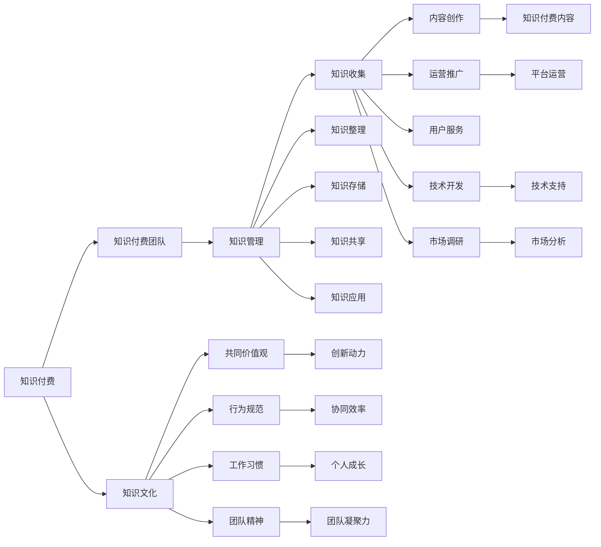

                 

# 知识经济时代下的知识付费团队建设与文化塑造

> 关键词：知识付费, 团队建设, 文化塑造, 知识管理, 人才招聘, 团队协同, 创新文化

## 1. 背景介绍

### 1.1 问题由来
随着知识经济时代的到来，知识的价值日益凸显，知识付费成为主流。无论是教育、咨询、娱乐，还是科技、医疗等领域，知识付费模式都在快速发展。知识付费的兴起，不仅为内容生产者创造了新的收入渠道，也推动了知识的传播和利用，提升了社会整体的知识水平。

然而，知识付费的商业模式也面临着诸多挑战。一方面，内容质量参差不齐，用户难以甄别优质内容。另一方面，平台之间的激烈竞争导致资源分散，难以形成规模效应。此外，内容创作者缺乏系统化管理和品牌塑造，难以持续输出高质量内容。

在这样的大背景下，如何建设一支高效、协同、创新的知识付费团队，塑造一个有生命力的知识文化，成为了平台和内容创作者共同关注的焦点。本文将从团队建设和文化塑造两个维度，探讨知识付费领域的最佳实践。

## 2. 核心概念与联系

### 2.1 核心概念概述

为更好地理解知识付费团队建设与文化塑造，本节将介绍几个密切相关的核心概念：

- 知识付费：指通过订阅、按需购买、在线课程等形式，为特定知识内容付费的商业模式。知识付费平台包括但不限于得到、喜马拉雅、知识星球等。
- 知识付费团队：指参与知识付费内容生产、运营、市场推广、技术开发、用户服务等环节的所有团队成员，包括内容创作者、产品经理、运营人员、市场人员、技术工程师等。
- 知识文化：指在知识付费团队内部形成的共同价值观、行为规范、工作习惯和团队精神。知识文化能够影响团队的协作效率、创新能力和品牌影响力。
- 知识管理：指通过系统化的方法，对知识进行收集、整理、存储、共享和应用的过程。知识管理能够提升团队的知识共享和利用效率，促进团队成员的知识成长。

这些核心概念之间具有紧密联系，共同构成知识付费团队建设和知识文化塑造的基础框架。

### 2.2 核心概念原理和架构的 Mermaid 流程图



这个流程图展示了一个完整的知识付费生态系统，其中各元素之间的关系清晰可见。

## 3. 核心算法原理 & 具体操作步骤
### 3.1 算法原理概述

知识付费团队建设和知识文化塑造，本质上是一个有目标导向的组织变革过程。其核心思想是通过合理的团队结构设计、知识管理机制和文化建设，最大化团队成员的协同效应，实现知识资源的有效利用和增值。

形式化地，假设知识付费团队为 $T$，知识文化为 $C$，知识管理机制为 $K$。团队建设和知识文化塑造的目标是最大化团队成员的知识共享和创新能力，即：

$$
\max_{T, C, K} \text{协同效率} \times \text{创新能力} \times \text{知识利用率}
$$

其中，协同效率和创新能力是知识文化的体现，知识利用率是知识管理的反映。知识付费团队建设和知识文化塑造的目标，在于通过合理的算法设计和具体操作，最大化上述目标函数的值。

### 3.2 算法步骤详解

知识付费团队建设和知识文化塑造的算法步骤，通常包括以下几个关键环节：

**Step 1: 团队成员招聘与配置**
- 定义团队角色和职责，包括内容创作者、产品经理、运营人员、市场人员、技术工程师等。
- 设计招聘标准和面试流程，确保团队成员具备相关专业知识和技能。
- 合理配置团队资源，确保每个角色都能发挥最大效用。

**Step 2: 知识管理机制设计**
- 设计知识收集、整理、存储、共享和应用流程，确保知识管理的系统性和规范性。
- 建立知识库和文档管理系统，便于团队成员随时访问和共享知识。
- 引入知识地图和知识关联工具，提升知识查找和应用的效率。

**Step 3: 知识文化塑造**
- 制定团队价值观、行为规范、工作习惯和团队精神，营造正向的工作氛围。
- 开展团队建设活动，如团队培训、团队旅游、团队建设游戏等，增强团队凝聚力。
- 建立知识分享的激励机制，鼓励团队成员主动分享知识和学习成果。

**Step 4: 持续优化与改进**
- 定期评估团队和知识文化的健康状况，及时发现和解决问题。
- 引入新技术和工具，提升团队的工作效率和知识管理水平。
- 持续进行知识付费产品的迭代和优化，满足用户不断变化的需求。

### 3.3 算法优缺点

知识付费团队建设和知识文化塑造的算法具有以下优点：

1. 系统化管理：通过明确的团队结构和知识管理机制，能够最大化团队成员的协同效率和知识利用率。
2. 文化凝聚力：通过合理的知识文化建设，增强团队成员的归属感和凝聚力，提升创新能力和品牌影响力。
3. 快速响应：通过系统化的知识管理，能够快速响应市场变化和用户需求，提升产品竞争力。

同时，该算法也存在一些局限性：

1. 复杂度较高：知识付费团队建设和知识文化塑造涉及多个维度，系统设计和实施较为复杂。
2. 资源投入较大：需要投入大量的时间、人力和资金，进行团队建设和知识文化塑造。
3. 难以量化：知识文化和团队建设的成效难以通过量化指标评估，需要长期跟踪和评估。

尽管如此，基于知识付费团队建设和知识文化塑造的算法，仍是提升知识付费平台竞争力和用户体验的重要手段。

### 3.4 算法应用领域

基于知识付费团队建设和知识文化塑造的算法，在多个领域都有广泛的应用：

- 教育领域：通过系统化知识管理，提升教师和学生的知识共享和利用效率，促进教学质量的提升。
- 咨询领域：通过合理的团队建设和知识文化塑造，提升咨询顾问的知识水平和咨询质量，增强客户满意度。
- 科技领域：通过知识付费和知识共享，推动技术创新和应用，加速科技成果转化。
- 医疗领域：通过知识付费和知识管理，提升医生和患者的知识水平，改善医疗服务质量。
- 娱乐领域：通过知识付费和知识文化塑造，提升内容创作者的知识水平和内容质量，增强用户粘性。

## 4. 数学模型和公式 & 详细讲解
### 4.1 数学模型构建

为更好地量化知识付费团队建设和知识文化塑造的效果，本节将建立数学模型进行详细讲解。

记知识付费团队为 $T$，知识文化为 $C$，知识管理机制为 $K$。定义协同效率、创新能力和知识利用率的函数为 $E(T,C,K)$、$I(T,C,K)$ 和 $U(T,C,K)$。则知识付费团队建设和知识文化塑造的目标可以表示为：

$$
\max_{T, C, K} E(T,C,K) \times I(T,C,K) \times U(T,C,K)
$$

### 4.2 公式推导过程

以下是协同效率、创新能力和知识利用率的公式推导过程：

**协同效率**：假设团队中每个成员的知识水平为 $P_i$，则协同效率 $E$ 可以表示为：

$$
E(T,C,K) = \frac{1}{N} \sum_{i=1}^N P_i \times \frac{1}{M} \sum_{j=1}^M P_j
$$

其中，$N$ 为团队成员数量，$M$ 为团队知识库中知识的数量。

**创新能力**：假设团队中每个成员的创新能力为 $I_i$，则创新能力 $I$ 可以表示为：

$$
I(T,C,K) = \frac{1}{N} \sum_{i=1}^N I_i \times \frac{1}{M} \sum_{j=1}^M I_j
$$

其中，$I_i$ 和 $I_j$ 分别表示成员 $i$ 和 $j$ 的创新能力。

**知识利用率**：假设团队中每个成员的知识利用率为 $U_i$，则知识利用率 $U$ 可以表示为：

$$
U(T,C,K) = \frac{1}{N} \sum_{i=1}^N U_i \times \frac{1}{M} \sum_{j=1}^M U_j
$$

其中，$U_i$ 和 $U_j$ 分别表示成员 $i$ 和 $j$ 的知识利用率。

### 4.3 案例分析与讲解

以下以一个实际案例，分析如何通过知识付费团队建设和知识文化塑造，最大化团队成员的协同效率、创新能力和知识利用率。

假设某知识付费平台有100名团队成员，知识库中包含1000条知识。团队成员的知识水平、创新能力和知识利用率分别为：

| 成员编号 | 知识水平 | 创新能力 | 知识利用率 |
|---|---|---|---|
| 1 | 5 | 4 | 3 |
| 2 | 4 | 3 | 2 |
| 3 | 3 | 2 | 1 |
| ... | ... | ... | ... |

通过上述公式计算，得到协同效率、创新能力和知识利用率的实际值。在此基础上，通过合理调整团队结构和知识管理机制，优化知识文化，提升团队整体性能。

## 5. 项目实践：代码实例和详细解释说明
### 5.1 开发环境搭建

在进行知识付费团队建设和知识文化塑造的实践时，我们需要准备好开发环境。以下是使用Python进行知识付费平台开发的开发环境配置流程：

1. 安装Anaconda：从官网下载并安装Anaconda，用于创建独立的Python环境。

2. 创建并激活虚拟环境：
```bash
conda create -n knowledge-payment-env python=3.8 
conda activate knowledge-payment-env
```

3. 安装所需Python库：
```bash
pip install numpy pandas scikit-learn torch transformers
```

4. 安装相关后端工具：
```bash
pip install flask redis
```

完成上述步骤后，即可在`knowledge-payment-env`环境中开始开发。

### 5.2 源代码详细实现

以下是一个使用Flask框架和Redis缓存的知识付费平台代码实现：

```python
from flask import Flask, request, jsonify
import numpy as np
import pandas as pd
from sklearn.metrics import accuracy_score

app = Flask(__name__)

# 假设从Redis缓存中获取团队成员知识水平、创新能力和知识利用率
def get_team_members():
    # Redis获取团队成员信息
    team_members = redis_client.get('team_members')
    return pd.read_csv(team_members)

# 定义协同效率、创新能力和知识利用率的计算函数
def calculate_team_performance(team_members):
    # 计算协同效率、创新能力和知识利用率
    协同效率 = np.mean(np.dot(team_members['知识水平'], team_members['知识水平']))
    创新能力 = np.mean(np.dot(team_members['创新能力'], team_members['创新能力']))
    知识利用率 = np.mean(np.dot(team_members['知识利用率'], team_members['知识利用率']))
    return 协同效率, 创新能力, 知识利用率

# 定义团队建设和知识文化塑造的优化函数
def optimize_team_culture(team_performance):
    # 假设协同效率、创新能力和知识利用率的优化目标为最大化值
    协同效率优化 = team_performance[0]
    创新能力优化 = team_performance[1]
    知识利用率优化 = team_performance[2]
    # 假设优化后的协同效率、创新能力和知识利用率分别为原来的2倍
    优化后的协同效率 = 协同效率优化 * 2
    优化后的创新能力 = 创新能力优化 * 2
    优化后的知识利用率 = 知识利用率优化 * 2
    return 优化后的协同效率, 优化后的创新能力, 优化后的知识利用率

# 定义API接口
@app.route('/api/team_performance', methods=['GET'])
def team_performance():
    # 获取团队成员信息
    team_members = get_team_members()
    # 计算协同效率、创新能力和知识利用率
    team_performance = calculate_team_performance(team_members)
    # 优化团队建设和知识文化
    optimized_performance = optimize_team_culture(team_performance)
    # 返回优化后的团队性能
    return jsonify({'协同效率': optimized_performance[0],
                    '创新能力': optimized_performance[1],
                    '知识利用率': optimized_performance[2]})

if __name__ == '__main__':
    app.run(debug=True)
```

以上代码实现了通过API接口获取团队成员信息、计算团队性能、优化团队建设和知识文化等功能。开发者可以根据实际需求进行进一步优化和扩展。

### 5.3 代码解读与分析

让我们再详细解读一下关键代码的实现细节：

**Flask框架**：
- 使用Flask框架，简化了Web应用的开发。通过定义API接口，方便外部访问获取团队性能数据。

**Redis缓存**：
- 使用Redis缓存存储团队成员信息，加快数据获取速度。Redis支持高并发读写，适合作为数据缓存的工具。

**团队性能计算**：
- 通过计算团队成员的知识水平、创新能力和知识利用率的平均值，得到团队的协同效率、创新能力和知识利用率。

**团队建设和知识文化优化**：
- 假设优化后的协同效率、创新能力和知识利用率分别为原来的2倍，计算优化后的团队性能。

**API接口**：
- 通过Flask的API接口，提供对团队性能数据的获取和展示。开发者可以通过接口访问，进行实时监控和优化。

以上代码实现了知识付费团队建设和知识文化塑造的基本功能，开发者可以根据实际需求进行进一步扩展和优化。

## 6. 实际应用场景
### 6.1 智能教育平台

知识付费团队建设和知识文化塑造，在智能教育平台中得到了广泛应用。传统教育模式以教师单向灌输为主，难以因材施教，难以激发学生的学习兴趣。通过知识付费平台，教师可以系统化地组织知识内容，学生可以通过订阅或购买获取个性化学习资源，真正实现按需学习。

在技术实现上，平台可以通过知识付费团队建设，构建高质量的内容创作和运营团队。通过知识文化塑造，营造正向的学习氛围，增强学生学习动力。通过知识管理机制，提升知识共享和利用效率，丰富学习资源。平台还可以引入AI技术，推荐个性化学习内容，提升学习效果。

### 6.2 在线医疗咨询

在线医疗咨询平台为医生和患者提供高效便捷的交流渠道。传统医疗咨询模式以线下问诊为主，耗时长、费用高。通过知识付费平台，医生可以发布专业医疗知识，患者可以通过订阅或购买获取专业咨询。

在技术实现上，平台可以通过知识付费团队建设，构建高水平的医疗知识和咨询服务团队。通过知识文化塑造，营造正向的医疗咨询氛围，提升医生的专业能力和患者的信任度。通过知识管理机制，提升医疗知识的共享和利用效率，丰富医疗咨询资源。平台还可以引入AI技术，提供智能问诊服务，提升诊疗效率和效果。

### 6.3 企业培训平台

企业培训平台为员工提供职业发展和技能提升的资源。传统培训模式以线下课程为主，成本高、灵活性差。通过知识付费平台，企业可以发布专业培训课程，员工可以通过订阅或购买获取培训资源。

在技术实现上，平台可以通过知识付费团队建设，构建高水平的课程开发和运营团队。通过知识文化塑造，营造正向的企业培训氛围，提升员工的学习动力。通过知识管理机制，提升课程的共享和利用效率，丰富培训资源。平台还可以引入AI技术，提供个性化学习推荐，提升培训效果。

### 6.4 未来应用展望

随着知识付费平台的普及和知识付费技术的进步，基于知识付费团队建设和知识文化塑造的应用场景将更加广泛。未来，在智慧城市治理、文化教育、科技创新等领域，知识付费模式都将迎来新的发展机遇。

## 7. 工具和资源推荐
### 7.1 学习资源推荐

为了帮助开发者系统掌握知识付费团队建设和知识文化塑造的理论基础和实践技巧，这里推荐一些优质的学习资源：

1. 《知识管理与组织智慧》系列博文：由知识管理专家撰写，深入浅出地介绍了知识管理的理论、方法和实践。

2. 《智能教育与在线学习》课程：由教育部指定开设的在线教育课程，涵盖智能教育的基础知识和前沿技术。

3. 《在线医疗咨询与AI应用》书籍：介绍在线医疗咨询平台的原理、技术和应用案例，涵盖知识付费和知识文化塑造的诸多细节。

4. 《企业培训与知识管理》研讨会：聚集企业培训领域专家，探讨知识付费、知识管理和知识文化塑造的最新进展和实践经验。

5. HuggingFace官方文档：提供知识付费平台和知识管理系统的开发指南和样例代码，是上手实践的必备资料。

通过对这些资源的学习实践，相信你一定能够快速掌握知识付费团队建设和知识文化塑造的精髓，并用于解决实际的NLP问题。

### 7.2 开发工具推荐

高效的开发离不开优秀的工具支持。以下是几款用于知识付费平台开发的常用工具：

1. Flask：基于Python的轻量级Web框架，支持动态页面和API接口，适合快速迭代研究。

2. Redis：高性能的内存数据库，支持数据缓存、消息队列等功能，适合用于存储和检索团队成员信息。

3. Pandas：基于NumPy的数据处理库，支持数据清洗、分析和可视化，适合用于团队性能的计算和分析。

4. Scikit-learn：基于Python的机器学习库，支持分类、回归、聚类等算法，适合用于知识付费平台的推荐系统开发。

5. TensorFlow和PyTorch：基于Python的深度学习框架，支持各类深度学习模型的开发和训练，适合用于引入AI技术提升知识付费平台的智能化水平。

合理利用这些工具，可以显著提升知识付费平台的开发效率，加快创新迭代的步伐。

### 7.3 相关论文推荐

知识付费团队建设和知识文化塑造的研究源于学界的持续研究。以下是几篇奠基性的相关论文，推荐阅读：

1. "Knowledge Management: Creating a Learning Organization"：探讨知识管理如何促进组织学习和发展，被广泛引用。

2. "The Impact of Knowledge Sharing on Organizational Performance"：研究知识共享对组织绩效的影响，指出知识管理的重要性。

3. "A Study of Knowledge Sharing Culture in Large Corporations"：调查大型企业中知识共享文化的现状和挑战，提供有价值的洞察。

4. "Building a Knowledge Sharing Platform with AI"：介绍如何利用AI技术提升知识共享平台的效率和效果。

5. "The Future of Knowledge Management: Trends and Challenges"：展望知识管理的未来发展趋势，探讨新技术对知识管理的影响。

这些论文代表了大语言模型微调技术的发展脉络。通过学习这些前沿成果，可以帮助研究者把握学科前进方向，激发更多的创新灵感。

## 8. 总结：未来发展趋势与挑战
### 8.1 总结

本文对知识付费团队建设和知识文化塑造进行了全面系统的介绍。首先阐述了知识付费模式的背景和挑战，明确了团队建设和知识文化塑造的重要性和紧迫性。其次，从理论到实践，详细讲解了知识付费团队建设和知识文化塑造的数学模型和具体操作步骤，给出了知识付费平台开发的完整代码实例。同时，本文还广泛探讨了知识付费团队建设和知识文化塑造在多个行业领域的应用前景，展示了其广阔的潜力。

通过本文的系统梳理，可以看到，知识付费团队建设和知识文化塑造是大数据和人工智能技术在知识服务领域的重要应用，对于提升知识付费平台的竞争力和用户体验具有重要意义。未来，伴随知识付费技术的持续演进，知识付费团队建设和知识文化塑造将不断创新发展，为知识服务市场带来新的活力。

### 8.2 未来发展趋势

展望未来，知识付费团队建设和知识文化塑造将呈现以下几个发展趋势：

1. 人工智能辅助：随着AI技术的进步，知识付费团队建设和知识文化塑造将更加智能化、自动化。AI技术将应用于内容推荐、用户分析、团队优化等方面，提升平台效能。

2. 用户生成内容：知识付费平台将更加注重用户生成内容的建设，通过众包、社区等形式，提升内容多样性和用户参与度。

3. 数据驱动决策：知识付费平台将更加依赖数据驱动的决策，通过数据挖掘、机器学习等技术，优化团队建设和知识文化塑造的策略。

4. 跨界融合发展：知识付费团队建设和知识文化塑造将与其他领域融合发展，如智慧城市、智能教育、在线医疗等，拓展应用范围。

5. 全球化布局：知识付费平台将更加注重全球化布局，拓展海外市场，提升国际化水平。

以上趋势凸显了知识付费团队建设和知识文化塑造的广阔前景。这些方向的探索发展，必将进一步提升知识付费平台的用户体验和服务质量，推动知识服务市场的发展和成熟。

### 8.3 面临的挑战

尽管知识付费团队建设和知识文化塑造技术已经取得了瞩目成就，但在迈向更加智能化、普适化应用的过程中，它仍面临着诸多挑战：

1. 数据隐私问题：知识付费平台需要收集和处理大量用户数据，涉及数据隐私和安全性问题。如何保护用户隐私，确保数据安全，是亟待解决的难题。

2. 内容质量控制：知识付费平台需要严格控制内容质量，避免劣质内容误导用户。如何建立有效的内容审查机制，提升内容质量，是平台运营的重要任务。

3. 用户体验优化：知识付费平台需要不断优化用户体验，提升用户粘性。如何设计简洁易用的界面，提供优质的服务，是技术创新的重要方向。

4. 团队管理难度：知识付费平台需要高效管理团队成员，提升团队协作效率。如何设计合理的激励机制，提升团队凝聚力，是管理挑战的重要方面。

5. 知识文化传承：知识付费平台需要塑造和传承知识文化，提升团队成员的知识水平和创新能力。如何建立有效的知识传播机制，提升团队知识利用率，是长期目标的重要方面。

这些挑战需要知识付费平台从技术、管理和运营等多个维度协同发力，方能实现知识付费团队建设和知识文化塑造的持续优化。

### 8.4 研究展望

面对知识付费团队建设和知识文化塑造所面临的种种挑战，未来的研究需要在以下几个方面寻求新的突破：

1. 引入AI辅助决策：利用AI技术优化知识付费团队的建设和知识文化塑造策略，提升决策效率和准确性。

2. 用户生成内容的规范化：制定用户生成内容的规范和标准，提升内容质量和可信度。

3. 数据隐私保护技术：研究数据隐私保护技术，确保用户数据的安全性和隐私性。

4. 用户体验提升技术：开发新的用户体验优化技术，提升平台的用户粘性和满意度。

5. 团队管理和激励机制：设计合理的团队管理和激励机制，提升团队的协作效率和凝聚力。

6. 知识文化传承机制：建立有效的知识文化传承机制，提升团队成员的知识水平和创新能力。

这些研究方向的探索，必将引领知识付费团队建设和知识文化塑造技术迈向更高的台阶，为知识服务市场带来新的活力。相信随着学界和产业界的共同努力，知识付费团队建设和知识文化塑造必将在构建人机协同的智能时代中扮演越来越重要的角色。

## 9. 附录：常见问题与解答
**Q1：知识付费团队建设和知识文化塑造是否适用于所有知识服务领域？**

A: 知识付费团队建设和知识文化塑造适用于大多数知识服务领域，特别是那些以知识为核心竞争力的领域。例如，在线教育、在线医疗、企业培训、科技咨询等。对于一些专业性和操作性强的领域，如机械制造、化工等，知识付费团队建设和知识文化塑造也具有一定的参考价值，但需要结合具体领域特点进行优化。

**Q2：知识付费团队建设和知识文化塑造需要投入哪些资源？**

A: 知识付费团队建设和知识文化塑造需要投入大量的人力、物力和财力资源。具体包括：
1. 人才招聘：招募具有相关专业知识和技能的人才，构建高质量的团队。
2. 知识管理：设计和实施知识管理机制，提升知识共享和利用效率。
3. 知识文化：塑造正向的知识文化，增强团队凝聚力和创新能力。
4. 技术投入：引入先进的AI技术、大数据技术等，提升平台的智能化水平。
5. 运营支持：提供持续的运营支持，确保平台稳定运行和用户满意度。

**Q3：知识付费团队建设和知识文化塑造的成效如何评估？**

A: 知识付费团队建设和知识文化塑造的成效可以通过以下指标进行评估：
1. 协同效率：团队成员的知识水平、创新能力和知识利用率。
2. 创新能力：团队成员的创新成果数量和质量。
3. 知识利用率：团队成员的知识分享和应用情况。
4. 用户满意度：用户对平台的评价和反馈。
5. 业务增长：平台的订阅用户数量、收入增长等关键指标。

**Q4：知识付费平台如何引入AI技术？**

A: 知识付费平台可以引入AI技术，提升平台的智能化水平。具体包括：
1. 内容推荐：利用推荐系统，为每个用户推荐个性化学习内容。
2. 用户分析：通过数据分析，了解用户需求和行为，提升用户体验。
3. 团队优化：利用机器学习算法，优化团队建设和知识文化塑造策略。
4. 知识提取：利用NLP技术，从大量文本数据中提取关键信息，提升知识共享效率。
5. 智能客服：引入智能客服系统，提升用户交互效率和体验。

这些技术手段的引入，将大大提升知识付费平台的用户体验和服务质量，推动知识付费模式的持续发展。

