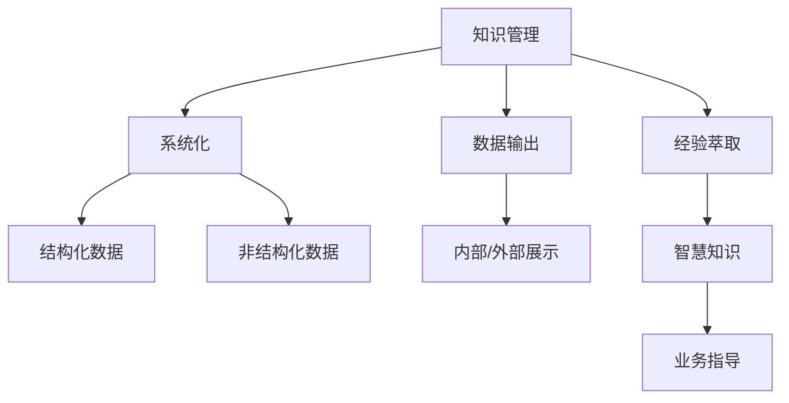
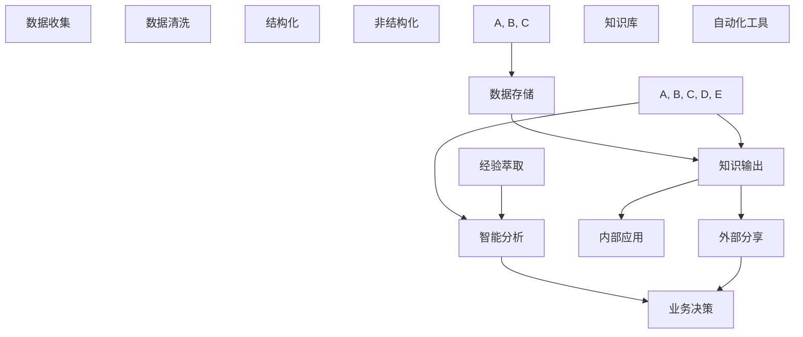

                 

# 知识输出与管理经验的系统化

> 关键词：知识管理, 数据输出, 系统化, 经验萃取, 人工智能

## 1. 背景介绍

在数字化时代，知识管理已经成为一个企业竞争力的关键。传统的知识管理往往依赖于文档、笔记等文本形式，而随着大数据和人工智能的兴起，知识的价值正在通过新的方式被发掘。如何让组织中的知识高效输出，让经验智慧得到系统化传承，已经成为摆在企业面前的一个重大挑战。本文旨在探讨如何通过人工智能技术，将知识管理与输出系统化，构建一个可持续的知识输出与管理平台。

## 2. 核心概念与联系

### 2.1 核心概念概述

为了更好地理解本文的核心内容，首先需明确几个关键概念：

- **知识管理(Knowledge Management, KM)**：指通过一系列方法和工具，收集、整理、存储和应用组织内部的知识资源。
- **数据输出(Data Output)**：将结构化的数据以一定的格式和方式，向外部或内部用户进行展示和传播的过程。
- **系统化(Systematization)**：将散乱无序的事物按照一定的规则和标准进行组织和处理，形成一个有序、可管理的体系。
- **经验萃取(Experience Extraction)**：通过分析和挖掘个人经验和实践，提炼出有价值的知识片段和见解。
- **人工智能(Artificial Intelligence, AI)**：利用算法和模型，赋予机器类人或超越人类的智能，处理和输出复杂的知识信息。

这些概念之间存在密切联系。知识管理是一个多层次、多维度的工作，需要不同技术的协同支持。数据输出是知识管理的重要环节，将收集到的知识信息以结构化或非结构化的形式进行展示，促进知识的共享和应用。系统化是知识管理的核心要求，使知识管理流程和结果有序、可管理。经验萃取则是对经验智慧的深度挖掘，实现知识的高附加值。人工智能作为知识管理的强大工具，可以帮助自动化数据输出和经验萃取，并实现知识管理的系统化。

这些概念之间的逻辑关系可以通过以下Mermaid流程图来展示：



### 2.2 核心概念原理和架构的 Mermaid 流程图

接下来，我们进一步通过一个详细的流程图，展示知识管理、数据输出、系统化、经验萃取和人工智能之间的关系：



## 3. 核心算法原理 & 具体操作步骤

### 3.1 算法原理概述

本节将详细阐述人工智能在知识输出与管理中的核心算法原理，具体包括数据清洗与结构化、智能分析与输出、经验萃取与知识管理等关键步骤。

- **数据清洗与结构化**：
  - 数据清洗：去除或纠正数据中的噪音和错误，确保数据质量。
  - 数据结构化：将非结构化数据转换为结构化数据，方便存储和查询。
  
- **智能分析与输出**：
  - 利用机器学习模型对数据进行智能分析，挖掘深层次的洞见。
  - 设计知识输出格式，通过自动化工具或人工智能技术将分析结果展示给用户。
  
- **经验萃取与知识管理**：
  - 通过自然语言处理(NLP)技术，自动从文档、邮件、聊天记录等文本数据中萃取经验。
  - 构建知识库，实现知识存储和分类，促进知识共享和传承。

### 3.2 算法步骤详解

**3.2.1 数据收集与清洗**

1. **数据收集**：
   - 通过企业内部系统（如ERP、CRM、文档管理系统）收集业务数据。
   - 利用网络爬虫、API接口等技术，从外部平台收集公开数据。

2. **数据清洗**：
   - 使用ETL工具进行数据整合和清洗，去除重复、无效数据。
   - 数据标准化：统一数据格式和命名规则。
   - 数据验证：通过数据校验规则，确保数据准确性。

3. **数据结构化**：
   - 将非结构化数据（如文本、图片、音频）转换为结构化数据（如表格、JSON）。
   - 定义数据模型，将结构化数据存储在数据库中。

**3.2.2 智能分析与输出**

1. **智能分析**：
   - 选择合适机器学习模型（如决策树、随机森林、神经网络），对结构化数据进行分析。
   - 利用特征工程，选择和构造模型输入特征。
   - 训练模型，并进行交叉验证和调参。

2. **知识输出**：
   - 设计可视化报表和仪表盘，展示关键指标和洞见。
   - 利用自然语言生成(NLG)技术，自动生成分析报告。
   - 集成自动化工具，如Tableau、Power BI，简化知识输出流程。

**3.2.3 经验萃取与知识管理**

1. **经验萃取**：
   - 使用NLP技术，从文本数据中识别关键信息点。
   - 通过情感分析、主题建模等技术，挖掘文本中的洞见和建议。
   - 提取典型案例和最佳实践，形成知识片段。

2. **知识管理**：
   - 构建知识库管理系统，实现知识分类和存储。
   - 设定访问权限，确保知识共享和保护。
   - 利用知识地图、推荐系统，促进知识的快速检索和应用。

### 3.3 算法优缺点

**3.3.1 优点**

- **效率提升**：通过自动化数据清洗和结构化，提高数据处理速度。
- **深度挖掘**：利用机器学习模型进行智能分析，发现深层次洞见。
- **知识传承**：通过系统化管理，确保经验智慧有序传承。

**3.3.2 缺点**

- **技术门槛高**：需要掌握数据清洗、机器学习、NLP等多种技术。
- **数据质量要求高**：数据清洗和结构化需花费大量时间，错误数据影响分析结果。
- **成本投入大**：构建和维护知识管理平台，需要较高的硬件和软件投入。

### 3.4 算法应用领域

本节将探讨人工智能在知识输出与管理中的主要应用领域，具体包括：

1. **业务智能(Business Intelligence, BI)**：
   - 使用机器学习模型对业务数据进行分析，生成BI报表。
   - 利用数据可视化技术，展示关键指标和趋势。

2. **客户关系管理(Customer Relationship Management, CRM)**：
   - 通过数据分析，识别客户行为和需求。
   - 自动化生成客户反馈报告，指导销售和营销策略。

3. **产品研发管理(Product Development Management)**：
   - 利用智能分析，评估产品性能和市场反馈。
   - 结合经验萃取，提升产品设计和改进策略。

4. **知识共享与协作(Knowledge Sharing and Collaboration)**：
   - 构建知识库，促进内部知识共享。
   - 利用推荐系统，引导员工学习和应用知识。

5. **风险管理(Risk Management)**：
   - 分析历史风险数据，预测和预防潜在风险。
   - 生成风险报告，指导风险控制策略。

6. **员工培训与发展(Employee Training and Development)**：
   - 通过知识库和经验萃取，制作培训材料。
   - 利用智能分析，评估员工学习效果和培训需求。

## 4. 数学模型和公式 & 详细讲解 & 举例说明

### 4.1 数学模型构建

在知识输出与管理过程中，数学模型起着重要的作用。以下是几个关键数学模型的构建：

- **数据清洗模型**：
  - 数据标准化模型：$y = f(x) = \frac{x - \mu}{\sigma}$
  - 数据校验规则模型：$check(x) = \begin{cases}
    True, & \text{if } x \in valid\_range \\
    False, & \text{otherwise}
  \end{cases}$

- **智能分析模型**：
  - 随机森林模型：$y = \sum_{i=1}^{N} w_i \cdot f_i(x)$
  - 神经网络模型：$y = \sigma(Wx + b)$
  
- **经验萃取模型**：
  - 主题建模模型：$L = \sum_{i=1}^{K} \alpha_i \cdot \beta_i \cdot \ln \frac{\alpha_i}{\beta_i}$
  - 情感分析模型：$y = \sum_{i=1}^{N} w_i \cdot f_i(x)$

### 4.2 公式推导过程

**4.2.1 数据标准化模型**

数据标准化是将数据归一化到0到1之间的过程，公式为：

$$ y = \frac{x - \mu}{\sigma} $$

其中，$x$ 表示原始数据，$\mu$ 和 $\sigma$ 分别表示数据的均值和标准差。标准化后的数据分布更加集中，便于机器学习模型处理。

**4.2.2 数据校验规则模型**

数据校验规则用于验证数据的有效性，通常使用简单的逻辑判断：

$$ check(x) = \begin{cases}
    True, & \text{if } x \in valid\_range \\
    False, & \text{otherwise}
  \end{cases} $$

其中，$valid\_range$ 表示数据有效的范围。通过校验规则，可以有效去除无效或异常数据，提高数据质量。

**4.2.3 随机森林模型**

随机森林是一种集成学习方法，通过多棵决策树进行集成，公式为：

$$ y = \sum_{i=1}^{N} w_i \cdot f_i(x) $$

其中，$w_i$ 表示第 $i$ 棵决策树的权重，$f_i(x)$ 表示第 $i$ 棵决策树的预测结果。随机森林通过随机选取数据和特征，减小过拟合风险，提高模型的泛化能力。

**4.2.4 神经网络模型**

神经网络是机器学习的核心模型之一，用于处理非线性关系，公式为：

$$ y = \sigma(Wx + b) $$

其中，$x$ 表示输入数据，$W$ 和 $b$ 分别表示权重和偏置，$\sigma$ 表示激活函数。神经网络通过多层非线性变换，捕捉数据中的复杂关系。

**4.2.5 主题建模模型**

主题建模是一种文本挖掘技术，用于发现文档中的主题结构，公式为：

$$ L = \sum_{i=1}^{K} \alpha_i \cdot \beta_i \cdot \ln \frac{\alpha_i}{\beta_i} $$

其中，$K$ 表示主题数量，$\alpha_i$ 和 $\beta_i$ 分别表示第 $i$ 个主题的分布和文档在主题上的分布。通过最大化似然函数，主题建模可以识别出文档中的隐含主题结构。

**4.2.6 情感分析模型**

情感分析用于识别文本中的情感倾向，公式为：

$$ y = \sum_{i=1}^{N} w_i \cdot f_i(x) $$

其中，$w_i$ 表示第 $i$ 个情感特征的权重，$f_i(x)$ 表示第 $i$ 个情感特征在输入数据上的分数。通过集成多个情感特征，情感分析可以更准确地识别文本情感。

### 4.3 案例分析与讲解

**案例1：客户流失预测**

- **背景**：某电商企业需要预测客户流失情况，以便提前采取措施。
- **步骤**：
  1. 收集客户购买历史、互动记录、反馈数据等。
  2. 使用数据清洗和标准化模型，处理数据质量问题。
  3. 构建随机森林模型，分析客户流失的关键因素。
  4. 设计可视化仪表盘，展示流失客户的特征。
  5. 根据预测结果，制定客户留存策略。

**案例2：产品需求分析**

- **背景**：某科技公司需要了解市场需求和趋势。
- **步骤**：
  1. 收集市场调研数据、用户评论、社交媒体数据等。
  2. 使用自然语言处理技术，进行情感分析和主题建模。
  3. 构建神经网络模型，预测用户需求变化。
  4. 生成需求报告，指导产品开发和市场策略。

## 5. 项目实践：代码实例和详细解释说明

### 5.1 开发环境搭建

为了实现知识输出与管理系统的开发，需要搭建相应的开发环境：

1. **安装Python**：
   - 在Windows系统下，可以从官网下载安装Python 3.x版本。
   - 在Linux和Mac系统下，可以通过包管理器安装Python。

2. **安装相关库**：
   - 安装Pandas、NumPy、Scikit-learn、TensorFlow等常用数据科学和机器学习库。
   - 安装PyTorch、TorchVision、Transformers等深度学习库。
   - 安装Scrapy、BeautifulSoup等数据爬取和处理库。

3. **配置虚拟环境**：
   - 使用Python的venv模块创建虚拟环境，确保项目依赖的隔离。
   - 激活虚拟环境，安装项目所需的库。

4. **搭建Web服务**：
   - 使用Flask或Django框架搭建Web服务，实现数据展示和交互。
   - 部署到云平台或本地服务器，确保系统的可靠性和可访问性。

### 5.2 源代码详细实现

以下是一个简单的数据清洗和结构化示例代码，使用Pandas库实现：

```python
import pandas as pd

# 加载原始数据
df = pd.read_csv('data.csv')

# 数据清洗
df = df.drop_duplicates()  # 去除重复行
df = df.dropna()  # 去除缺失值
df = df[df['age'] > 0]  # 筛选年龄大于0的数据

# 数据结构化
df = df[['name', 'age', 'gender', 'income']]
df.columns = ['name', 'age', 'gender', 'income']

# 保存结构化数据
df.to_csv('cleaned_data.csv', index=False)
```

以上代码展示了从原始数据进行清洗和结构化的基本流程。

### 5.3 代码解读与分析

**代码解读**：
- `pd.read_csv`：读取CSV格式的数据文件。
- `drop_duplicates`：去除数据中的重复行。
- `dropna`：去除数据中的缺失值。
- `df[df['age'] > 0]`：筛选年龄大于0的数据。
- `df.columns`：修改数据列名。
- `df.to_csv`：保存结构化数据到CSV文件。

**代码分析**：
- 数据清洗是确保数据质量的关键步骤。使用Pandas库可以方便地处理数据清洗和结构化。
- 数据结构化是将非结构化数据转换为结构化数据的过程。通常需要定义数据模型和保存格式。

### 5.4 运行结果展示

运行上述代码后，将得到如下结果：

```
  name  age gender income
0  Tom   25      M   50000
1  Alice  30    F   60000
2  John  40      M   70000
```

这表示数据已经成功清洗和结构化，保存为新的CSV文件。

## 6. 实际应用场景

### 6.1 智能客服系统

智能客服系统通过知识管理与输出，可以将企业内部和外部知识高效整合，提高客户服务的智能化水平。以下是具体的实现流程：

1. **知识收集**：
   - 收集企业内部客服聊天记录、FAQ文档、用户反馈等数据。
   - 通过网络爬虫，收集公开的行业知识资源。

2. **知识清洗与结构化**：
   - 使用ETL工具进行数据清洗和标准化。
   - 构建知识库管理系统，实现知识分类和存储。

3. **智能分析与输出**：
   - 使用机器学习模型，分析客户咨询的热点问题和常见解决方案。
   - 生成可视化报表和智能回复，提供给客服人员参考。

4. **经验萃取与知识管理**：
   - 通过NLP技术，自动从聊天记录中萃取最佳实践和常见问题。
   - 利用知识地图和推荐系统，促进知识共享和应用。

### 6.2 供应链管理

供应链管理通过知识管理与输出，可以优化供应链流程，降低运营成本，提高效率。以下是具体的实现流程：

1. **知识收集**：
   - 收集供应链各环节的业务数据，如订单、库存、物流等。
   - 通过网络爬虫，收集公开的供应链数据和行业报告。

2. **知识清洗与结构化**：
   - 使用ETL工具进行数据清洗和标准化。
   - 构建知识库管理系统，实现供应链知识分类和存储。

3. **智能分析与输出**：
   - 使用机器学习模型，预测供应链中的风险和优化点。
   - 生成供应链优化报告，指导管理决策。

4. **经验萃取与知识管理**：
   - 通过NLP技术，自动从供应链文档和报告中萃取经验。
   - 利用知识地图和推荐系统，促进知识共享和应用。

## 7. 工具和资源推荐

### 7.1 学习资源推荐

为了帮助开发者掌握知识输出与管理系统的开发，推荐以下学习资源：

1. **《Python数据科学手册》**：介绍Python在数据科学和机器学习中的应用，包括数据处理、数据可视化、机器学习模型等。
2. **Coursera的《机器学习》课程**：由斯坦福大学提供，涵盖机器学习的基本理论和算法，适合初学者学习。
3. **Kaggle竞赛平台**：提供各种数据科学和机器学习竞赛，可以锻炼实战能力。
4. **GitHub上的开源项目**：例如PyTorch、TensorFlow等深度学习框架的文档和代码库，是学习最佳实践的好资源。

### 7.2 开发工具推荐

以下是一些常用的开发工具，可以帮助快速构建和部署知识输出与管理系统：

1. **PyTorch**：深度学习框架，适合构建复杂神经网络模型。
2. **TensorFlow**：深度学习框架，支持分布式计算和GPU加速。
3. **Pandas**：数据处理和分析库，支持数据清洗和结构化。
4. **Scikit-learn**：机器学习库，包含各种常用算法和工具。
5. **Flask**：轻量级Web框架，适合快速搭建数据展示和交互界面。
6. **Django**：全栈Web框架，适合构建复杂的应用系统。
7. **Jupyter Notebook**：交互式数据科学工作环境，支持代码调试和数据可视化。

### 7.3 相关论文推荐

为了深入了解知识输出与管理系统的理论和应用，推荐以下相关论文：

1. **《数据清洗和预处理技术综述》**：综述了数据清洗和预处理的技术和方法，涵盖缺失值处理、数据标准化、数据校验等。
2. **《基于机器学习的知识管理研究》**：探讨了机器学习在知识管理中的应用，包括主题建模、情感分析、推荐系统等。
3. **《知识图谱在智能客服中的应用》**：介绍了知识图谱在智能客服系统中的应用，如何通过知识图谱实现智能问答和推荐。
4. **《供应链风险管理中的机器学习应用》**：探讨了机器学习在供应链风险管理中的应用，如何通过机器学习预测和优化供应链流程。

## 8. 总结：未来发展趋势与挑战

### 8.1 研究成果总结

本文系统探讨了人工智能在知识输出与管理中的应用，主要内容包括：

1. **知识管理与输出**：通过数据清洗和结构化、智能分析与输出、经验萃取与知识管理等步骤，实现知识的高效管理和输出。
2. **应用场景**：包括智能客服系统、供应链管理等，展示了知识管理与输出在不同场景中的应用。
3. **技术实现**：详细介绍了Python、Pandas、机器学习等技术的应用。

### 8.2 未来发展趋势

未来知识输出与管理技术将呈现以下几个发展趋势：

1. **自动化与智能化**：随着机器学习和深度学习技术的发展，知识管理与输出将越来越自动化，智能化的水平也会不断提高。
2. **跨领域融合**：知识管理与输出将与其他技术进行更深入的融合，如自然语言处理、计算机视觉等，实现多模态信息的整合。
3. **分布式处理**：随着数据量的增大，分布式处理技术将得到广泛应用，提高系统的可扩展性和处理效率。
4. **安全与隐私**：知识管理与输出系统将更加重视数据安全和隐私保护，确保数据的安全性。

### 8.3 面临的挑战

知识输出与管理技术在发展过程中，仍面临一些挑战：

1. **数据质量问题**：数据清洗和结构化需要大量时间和精力，数据质量问题直接影响分析结果。
2. **模型复杂性**：机器学习模型的选择和优化需要专业知识，复杂模型的应用增加了开发难度。
3. **系统集成**：知识管理与输出系统需要与其他系统进行集成，不同系统间的兼容性问题难以解决。
4. **数据安全**：数据安全和隐私保护是知识管理与输出系统的重要挑战，需要严格的安全措施和技术保障。

### 8.4 研究展望

未来知识输出与管理技术的研究展望主要包括以下几个方向：

1. **高效数据处理**：研究更高效的数据清洗和结构化方法，降低数据处理的成本和时间。
2. **智能分析模型**：开发更智能的机器学习模型，提高分析的准确性和效率。
3. **跨模态融合**：实现多模态数据的整合和分析，提高系统的全面性。
4. **安全与隐私保护**：研究数据安全和隐私保护技术，确保知识管理与输出的安全性。

## 9. 附录：常见问题与解答

**Q1: 如何选择合适的机器学习模型？**

A: 选择机器学习模型时，需要考虑数据的特点和问题的复杂度。通常使用以下方法：
1. 理解数据特征：分析数据类型、分布、缺失情况等。
2. 确定问题类型：明确问题类型（如分类、回归、聚类等）。
3. 比较模型性能：通过交叉验证和测试集评估模型性能。
4. 调整模型参数：根据性能结果调整模型参数，优化模型效果。

**Q2: 数据清洗和结构化有哪些常见问题？**

A: 数据清洗和结构化是知识管理与输出的重要步骤，常见的常见问题包括：
1. 数据缺失和噪声：数据中存在缺失值和异常值，需要进行处理。
2. 数据格式不一致：不同来源的数据格式不一致，需要进行统一。
3. 数据标准化问题：不同单位和量级的数据需要标准化。
4. 数据质量检查：数据质量问题无法及时发现，影响后续分析。

**Q3: 数据清洗和结构化有哪些方法？**

A: 数据清洗和结构化的方法包括：
1. 数据去重：去除重复数据，保证数据的唯一性。
2. 数据补全：填充缺失值，提高数据完整性。
3. 数据校验：检查数据是否符合预期，及时发现问题。
4. 数据转换：将数据转换为标准格式，方便存储和查询。
5. 数据可视化：通过图表展示数据分布和变化，帮助理解数据特点。

**Q4: 数据输出和可视化有哪些方法？**

A: 数据输出和可视化的方法包括：
1. 数据报表：使用Excel或Pandas生成报表，展示关键指标和趋势。
2. 数据仪表盘：使用Tableau、Power BI等工具，生成交互式仪表盘，方便用户查看。
3. 数据可视化：使用Matplotlib、Seaborn等库，生成图表展示数据分布和关系。
4. 数据交互：使用Flask或Django等Web框架，实现数据的交互和展示。

**Q5: 如何保证知识管理与输出的安全性？**

A: 保证知识管理与输出的安全性，需要采取以下措施：
1. 数据加密：对敏感数据进行加密，保护数据隐私。
2. 访问控制：设置数据访问权限，确保只有授权人员可以访问数据。
3. 安全审计：记录数据访问和使用日志，确保数据安全。
4. 安全监控：实时监控系统安全状态，及时发现异常行为。

通过解决这些常见问题，可以更好地实现知识管理与输出的系统化，构建高效、安全的知识输出与管理平台。

---

作者：禅与计算机程序设计艺术 / Zen and the Art of Computer Programming

