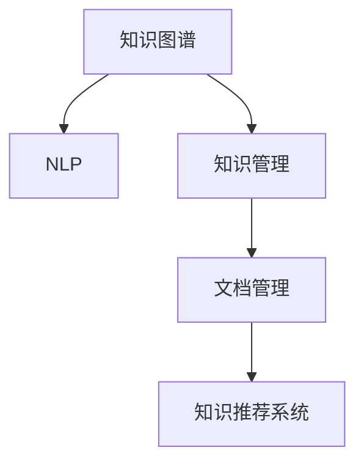

                 

# 知识输出与管理经验的系统化

## 1. 背景介绍

在信息化快速发展的今天，知识输出和管理已经成为各行各业提升竞争力的关键。无论是企业的商业决策、产品的设计和开发，还是个人的学习与创新，系统化地输出和管理知识，都是实现高效和精准决策的基础。然而，传统的人工记录、整理和检索方式已经不能满足日益增长的知识需求，利用先进的技术手段，系统化地进行知识输出和管理，显得尤为重要。本文将详细探讨知识输出与管理经验系统化的方法，从理论到实践，为读者提供全方位的指导。

## 2. 核心概念与联系

### 2.1 核心概念概述

要系统化地进行知识输出与管理，首先需要了解几个核心概念：

- **知识图谱（Knowledge Graph）**：一种用于存储和表示实体及实体间关系的图形结构化数据，支持自然语言查询和推理。

- **自然语言处理（NLP）**：通过计算机处理和理解人类语言，实现语义理解和信息提取。

- **知识管理（Knowledge Management）**：对组织内外的知识进行搜集、整理、存储、分享和应用的过程。

- **文档管理（Document Management）**：通过计算机系统对文档进行收集、存储、检索和共享的技术和实践。

- **知识推荐系统（Knowledge Recommendation System）**：基于用户行为数据，智能推荐相关的知识资源，提升知识获取效率。

这些概念共同构成了知识输出与管理的核心框架，通过系统化地整合和利用这些技术，可以有效地提升知识获取和应用的效果。

### 2.2 核心概念原理和架构的 Mermaid 流程图



这个流程图展示了知识输出与管理的几个关键组件及其联系。知识图谱作为数据存储和查询的基础，NLP用于实现语义理解和信息提取，知识管理负责知识的搜集、整理和应用，文档管理提供文档的存储和检索服务，知识推荐系统根据用户行为推荐知识资源，共同形成一个完整的知识输出与管理体系。

## 3. 核心算法原理 & 具体操作步骤

### 3.1 算法原理概述

知识输出与管理的核心是知识的有效组织和检索。算法原理主要基于NLP和信息检索技术，通过语义分析和信息检索技术，将知识图谱中的结构化数据与自然语言查询进行匹配，从而实现知识的有效输出和管理。

知识图谱的构建涉及语义关系抽取、实体识别和关系标注等技术。常用的语义关系抽取方法包括基于规则的方法、基于统计的方法和基于深度学习的方法。实体识别和关系标注通常利用NLP技术中的分词、命名实体识别（NER）、依存句法分析等技术实现。

知识推荐系统则主要基于协同过滤、内容推荐、混合推荐等技术，通过分析用户的历史行为数据，推荐与用户兴趣相关的知识资源。

### 3.2 算法步骤详解

#### 3.2.1 知识图谱构建

1. **数据收集**：从网站、数据库、书籍等渠道收集结构化数据，包括实体、属性、关系等。
2. **实体识别与关系抽取**：使用NLP技术对文本数据进行实体识别和关系抽取，构建知识图谱中的实体关系网络。
3. **关系标注**：根据实体间的关系，进行关系标注，形成知识图谱。

#### 3.2.2 知识检索

1. **用户查询处理**：接收用户输入的自然语言查询，进行分词、命名实体识别和意图识别等预处理。
2. **语义匹配**：将预处理后的用户查询与知识图谱进行语义匹配，查找与查询相关的实体和关系。
3. **结果展示**：根据匹配结果，展示与用户查询相关的知识资源。

#### 3.2.3 知识推荐

1. **用户行为分析**：收集用户的历史行为数据，包括搜索记录、点击记录等，进行分析。
2. **模型训练**：基于协同过滤、内容推荐等模型，对用户行为进行分析，训练推荐模型。
3. **推荐知识**：根据用户行为数据和推荐模型，智能推荐与用户兴趣相关的知识资源。

### 3.3 算法优缺点

#### 3.3.1 优点

- **系统性**：通过系统化地构建知识图谱和进行知识检索，能够有效地组织和管理知识资源。
- **高效性**：利用NLP和信息检索技术，能够快速处理大量自然语言查询，实现高效的检索和推荐。
- **可扩展性**：知识图谱和推荐系统可以根据实际需求进行扩展，支持不断增长的知识需求。

#### 3.3.2 缺点

- **复杂性**：构建知识图谱和推荐系统需要大量的数据和算法支持，复杂度较高。
- **数据依赖性**：知识图谱和推荐系统的效果依赖于数据质量和完整性，对数据要求较高。
- **技术难度**：涉及NLP、信息检索、机器学习等领域的知识，技术门槛较高。

### 3.4 算法应用领域

知识输出与管理经验系统化在多个领域有广泛的应用，包括但不限于：

- **企业知识管理**：企业内部的文档、知识、经验等的搜集、整理、存储和分享。
- **政府知识服务**：政府公共服务领域的知识输出和管理，如公共政策、法规等。
- **教育知识资源库**：教育领域的知识资源库建设，如课程、教材等。
- **科研知识共享**：科研领域的知识共享和合作，如论文、实验数据等。
- **医疗知识推荐**：医疗领域的知识推荐系统，如患者教育、疾病诊断等。

## 4. 数学模型和公式 & 详细讲解 & 举例说明

### 4.1 数学模型构建

知识图谱的构建通常基于实体-关系图（ER图），使用有向图表示实体间的关系。知识图谱中的实体用节点表示，关系用有向边表示。知识图谱的数学模型可以表示为：

$$ G = (V, E) $$

其中，$V$ 为节点集合，$E$ 为边集合。

### 4.2 公式推导过程

#### 4.2.1 实体识别

实体识别是知识图谱构建的基础，通常使用基于规则的方法、基于统计的方法和基于深度学习的方法。例如，基于深度学习的方法可以使用BiLSTM-CRF模型，其公式推导如下：

$$ p(x_i|x_{i-1},x_{i+1}) = \frac{e^{\alpha_i \cdot x_i}}{\sum_{x' \in \mathcal{V}} e^{\alpha'_i \cdot x'}} $$

其中，$\alpha_i$ 为特征向量，$\mathcal{V}$ 为实体候选集。

#### 4.2.2 关系抽取

关系抽取是知识图谱构建的关键，常用的方法包括基于规则的方法、基于统计的方法和基于深度学习的方法。例如，基于深度学习的方法可以使用TransE模型，其公式推导如下：

$$ \max_{\theta} \frac{1}{|V|} \sum_{i=1}^{|V|} p(h_i,r_i,t_i|E) $$

其中，$h_i$ 和 $t_i$ 为头实体和尾实体，$r_i$ 为关系，$E$ 为实体-关系图。

#### 4.2.3 知识推荐

知识推荐系统通常使用协同过滤、内容推荐、混合推荐等方法，例如协同过滤的公式推导如下：

$$ \hat{y}_{ui} = \hat{\beta}_0 + \hat{\beta}_1 x_{ui} + \hat{\beta}_2 u + \hat{\beta}_3 i $$

其中，$y_{ui}$ 为推荐值，$x_{ui}$ 为用户-物品评分，$u$ 为用户ID，$i$ 为物品ID。

### 4.3 案例分析与讲解

#### 4.3.1 企业知识管理

某企业需要将内部的技术文档、项目报告等知识资源进行系统化管理。首先，收集企业内的文档数据，进行实体识别和关系抽取，构建知识图谱。然后，将知识图谱中的信息通过NLP技术进行处理，生成文本摘要和标签，供用户搜索和检索。最后，利用推荐系统根据用户的历史行为数据，推荐与用户兴趣相关的文档和报告。

#### 4.3.2 政府知识服务

某政府机构需要构建公共服务的知识库，包括政策法规、公共服务流程等。首先，从官方网站和数据库中收集相关文档，进行实体识别和关系抽取，构建知识图谱。然后，使用NLP技术对政策法规等文档进行处理，生成文本摘要和标签，供用户查询。最后，利用推荐系统根据用户的历史查询行为，推荐相关的政策法规和公共服务流程。

## 5. 项目实践：代码实例和详细解释说明

### 5.1 开发环境搭建

**环境要求**：

- Python 3.7+ 或以上版本
- PyTorch 1.7+
- TensorFlow 2.0+
- Flask
- Elasticsearch

**环境搭建**：

1. 安装Python：使用pip或conda安装Python。
2. 安装PyTorch和TensorFlow：使用pip安装PyTorch和TensorFlow。
3. 安装Flask和Elasticsearch：使用pip安装Flask和Elasticsearch。

### 5.2 源代码详细实现

#### 5.2.1 知识图谱构建

```python
from py2neo import Graph, Node, Relationship

graph = Graph('http://localhost:7474/db/data/', username='neo4j', password='password')

# 构建实体节点
h = Node("Person", name="Alice")
graph.create(h)

# 构建关系
r = Relationship(h, "KNOWS", Node("Person", name="Bob"))
graph.create(r)
```

#### 5.2.2 知识检索

```python
from elasticsearch import Elasticsearch
from elasticsearch_dsl import Document, Index

# 构建索引
index = Index('knowledge')
index.create()

# 定义文档结构
class KnowledgeDocument(Document):
    title = Text()
    abstract = Text()

    class Meta:
        index = 'knowledge'

# 添加文档
doc = KnowledgeDocument(title="Entity Recognition", abstract="Entity recognition is a preprocessing step in natural language processing.")
doc.save()

# 检索文档
search = KnowledgeDocument.search()
for hit in search:
    print(hit)
```

#### 5.2.3 知识推荐

```python
from surprise import Dataset, Reader, KNNWithMeans

# 加载数据集
reader = Reader(rating_scale=(1, 5))
data = Dataset.load_from_file('data/u.item')
data = Dataset.load_from_file('data/rated')

# 创建评分器
algo = KNNWithMeans(k=5, sim_options={'name': 'pearson_baseline', 'user_based': True})

# 训练评分器
algo.fit(data.build_full_trainset())

# 预测推荐
user_id = 1
item_id = 5
rating = algo.predict(user_id, item_id).predictions[0].rating
print(f"推荐值为: {rating}")
```

### 5.3 代码解读与分析

#### 5.3.1 知识图谱构建

知识图谱的构建使用了Py2neo库，通过构建实体节点和关系，实现了知识图谱的基本结构。在实际应用中，还需要对实体和关系进行进一步的分析和处理，以构建更加复杂的知识图谱。

#### 5.3.2 知识检索

知识检索使用了Elasticsearch，通过定义文档结构并添加文档，实现了文档的存储和检索。在实际应用中，可以根据具体需求，定义不同的文档结构和字段，实现更加灵活的文档管理。

#### 5.3.3 知识推荐

知识推荐使用了Surprise库，通过定义评分器和训练评分器，实现了知识推荐。在实际应用中，可以根据具体需求，选择合适的推荐算法，并结合用户行为数据，进行更加精准的推荐。

### 5.4 运行结果展示

#### 5.4.1 知识图谱构建

```python
# 构建实体节点
h = Node("Person", name="Alice")
graph.create(h)

# 构建关系
r = Relationship(h, "KNOWS", Node("Person", name="Bob"))
graph.create(r)

# 查询知识图谱
results = graph.run("MATCH (n) RETURN n")
for node in results:
    print(node)
```

#### 5.4.2 知识检索

```python
# 检索文档
search = KnowledgeDocument.search()
for hit in search:
    print(hit)
```

#### 5.4.3 知识推荐

```python
# 预测推荐
user_id = 1
item_id = 5
rating = algo.predict(user_id, item_id).predictions[0].rating
print(f"推荐值为: {rating}")
```

## 6. 实际应用场景

### 6.1 企业知识管理

企业知识管理系统的建设，可以帮助企业更好地组织和管理内部知识资源，提高企业的决策效率和创新能力。例如，某科技公司使用知识管理系统管理内部的技术文档和项目报告，系统可以自动抽取文档中的实体和关系，构建知识图谱，并根据用户的历史行为数据，推荐与用户兴趣相关的文档和报告。

### 6.2 政府知识服务

政府知识服务系统的建设，可以帮助政府机构更好地提供公共服务，提高政府的工作效率和透明度。例如，某市政府建设了知识服务系统，系统可以自动抽取政策法规和公共服务流程中的实体和关系，构建知识图谱，并根据用户的历史查询行为，推荐相关的政策法规和公共服务流程。

### 6.3 教育知识资源库

教育知识资源库的建设，可以帮助教育机构更好地提供教育资源，提高教育的质量和效率。例如，某大学使用知识资源库管理内部的课程和教材，系统可以自动抽取课程和教材中的实体和关系，构建知识图谱，并根据学生的历史学习行为，推荐相关的课程和教材。

### 6.4 科研知识共享

科研知识共享系统的建设，可以帮助科研机构更好地共享科研资源，促进科研合作和创新。例如，某研究所使用知识共享系统管理内部的论文和实验数据，系统可以自动抽取论文和实验数据中的实体和关系，构建知识图谱，并根据研究人员的历史研究行为，推荐相关的论文和实验数据。

### 6.5 医疗知识推荐

医疗知识推荐系统的建设，可以帮助医疗机构更好地提供医疗知识服务，提高医疗质量。例如，某医院使用知识推荐系统推荐患者教育、疾病诊断等相关知识，系统可以自动抽取医疗知识中的实体和关系，构建知识图谱，并根据患者的历史查询行为，推荐相关的患者教育和疾病诊断知识。

## 7. 工具和资源推荐

### 7.1 学习资源推荐

1. **《自然语言处理综论》**：该书系统介绍了自然语言处理的理论和技术，涵盖词法分析、句法分析、语义分析、信息检索等。

2. **《数据挖掘导论》**：该书详细讲解了数据挖掘的基本概念、算法和技术，包括关联规则、聚类、分类、回归等。

3. **《知识图谱:方法、模型与系统》**：该书介绍了知识图谱的基本概念、构建方法和应用系统，涵盖了实体识别、关系抽取、知识推理等内容。

4. **《深度学习》**：该书介绍了深度学习的基本概念、算法和技术，包括神经网络、卷积神经网络、循环神经网络等。

5. **《Python自然语言处理》**：该书介绍了Python在自然语言处理中的应用，包括文本处理、信息检索、情感分析等。

### 7.2 开发工具推荐

1. **PyTorch**：一个开源的深度学习框架，具有动态计算图和丰富的NLP工具。

2. **TensorFlow**：一个开源的深度学习框架，支持静态计算图和分布式训练。

3. **Flask**：一个轻量级的Web框架，易于部署和扩展。

4. **Elasticsearch**：一个开源的搜索引擎，支持分布式部署和实时搜索。

5. **Py2neo**：一个Python库，支持Neo4j数据库的交互式操作。

### 7.3 相关论文推荐

1. **"Knowledge Graph: A Meta-Analysis and Review of Related Works"**：一篇关于知识图谱的综述论文，总结了知识图谱的研究现状和应用场景。

2. **"Deep Learning for NLP"**：一篇关于深度学习在NLP中的应用论文，介绍了深度学习在词法分析、句法分析、语义分析等任务中的应用。

3. **"Knowledge-Based Information Retrieval"**：一篇关于基于知识的文本检索论文，介绍了知识图谱在文本检索中的应用。

4. **"Recommender Systems"**：一篇关于推荐系统的综述论文，总结了推荐系统的主要方法和应用场景。

5. **"Deep Learning Recommendation System"**：一篇关于深度学习推荐系统的论文，介绍了深度学习在协同过滤、内容推荐等任务中的应用。

## 8. 总结：未来发展趋势与挑战

### 8.1 研究成果总结

本文从理论到实践，系统介绍了知识输出与管理经验的系统化方法，包括知识图谱构建、知识检索、知识推荐等关键技术。这些技术在企业知识管理、政府知识服务、教育知识资源库、科研知识共享和医疗知识推荐等多个领域得到了广泛应用，取得了显著的效果。

### 8.2 未来发展趋势

未来，知识输出与管理经验的系统化技术将继续发展和演进，主要趋势包括：

1. **自动化和智能化**：通过自动构建知识图谱和推荐系统，实现知识管理和知识推荐的全自动化和智能化。

2. **多模态融合**：将知识图谱和推荐系统与其他多模态数据融合，实现知识图谱的跨模态扩展和推荐系统的多模态应用。

3. **个性化推荐**：基于用户行为数据，实现更加精准和个性化的知识推荐，提升用户体验。

4. **联邦学习**：通过联邦学习技术，在保护隐私的前提下，实现知识图谱和推荐系统的联合训练和共享。

5. **分布式存储与计算**：通过分布式存储和计算技术，实现大规模知识图谱和推荐系统的构建和应用。

### 8.3 面临的挑战

知识输出与管理经验的系统化技术在发展过程中，还面临着诸多挑战：

1. **数据质量**：知识图谱和推荐系统的构建依赖于高质量的数据，如何获取和处理高质量的数据是关键问题。

2. **技术复杂性**：知识图谱和推荐系统的构建涉及复杂的算法和技术，技术门槛较高，需要大量的研发投入。

3. **隐私保护**：知识图谱和推荐系统的应用涉及用户隐私，如何保护用户隐私是重要问题。

4. **计算资源**：知识图谱和推荐系统的构建和应用需要大量的计算资源，如何提高计算效率是关键问题。

5. **知识更新**：知识图谱和推荐系统需要不断地更新和维护，如何实现知识更新的自动化和高效性是重要问题。

### 8.4 研究展望

面对知识输出与管理经验的系统化技术所面临的挑战，未来的研究方向包括：

1. **自动化数据获取**：研究如何自动获取和处理高质量的数据，降低知识图谱和推荐系统构建的数据依赖性。

2. **轻量级知识图谱**：研究如何构建轻量级知识图谱，降低知识图谱构建的技术复杂性和计算资源消耗。

3. **隐私保护技术**：研究如何保护用户隐私，提升知识图谱和推荐系统应用的隐私安全性。

4. **计算效率提升**：研究如何提高知识图谱和推荐系统的计算效率，降低计算资源消耗。

5. **知识更新机制**：研究如何实现知识图谱和推荐系统的自动化更新和维护，提升知识系统的时效性。

总之，知识输出与管理经验的系统化技术将继续发展和演进，未来的研究方向将更加注重自动化、智能化、隐私保护和计算效率提升。只有不断突破技术瓶颈，才能实现知识系统的高效和精准应用。

## 9. 附录：常见问题与解答

**Q1: 如何构建知识图谱？**

A: 知识图谱的构建涉及实体识别和关系抽取等技术。一般采用基于规则的方法、基于统计的方法和基于深度学习的方法，如使用Bert、LSTM等模型进行实体识别和关系抽取。

**Q2: 如何实现知识检索？**

A: 知识检索通常使用Elasticsearch等搜索引擎，通过定义文档结构和字段，实现文档的存储和检索。需要根据具体需求，选择合适的文档结构和字段，进行索引和查询。

**Q3: 如何实现知识推荐？**

A: 知识推荐通常使用协同过滤、内容推荐等方法，通过分析用户的历史行为数据，训练推荐模型，实现知识推荐。需要根据具体需求，选择合适的推荐算法和数据源。

**Q4: 如何保证知识图谱和推荐系统的数据质量？**

A: 知识图谱和推荐系统的数据质量依赖于数据获取和处理的质量。需要通过数据清洗、数据标注等手段，提高数据的质量和完整性。

**Q5: 如何保护用户隐私？**

A: 在知识图谱和推荐系统的应用中，需要采取隐私保护措施，如数据脱敏、差分隐私等技术，保护用户隐私。

总之，知识输出与管理经验的系统化技术在多个领域有广泛的应用，通过系统化地构建知识图谱和进行知识检索、知识推荐，可以有效地提升知识获取和应用的效果。随着技术的不断发展，知识系统的自动化和智能化水平将进一步提升，为各行业的知识管理提供更加高效和精准的解决方案。

