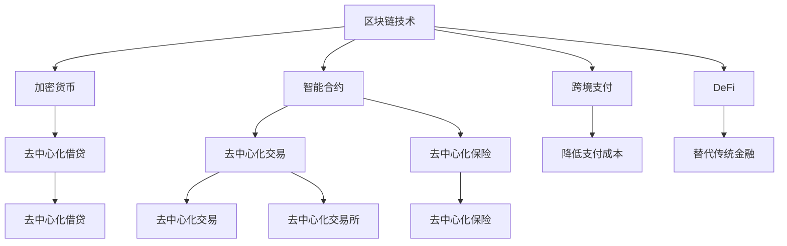

                 

# 硅谷区块链金融创新的监管挑战

## 1. 背景介绍

在硅谷，科技创新与金融创新的双重驱动下，区块链技术正在逐渐融入金融系统。区块链的去中心化、透明化、不可篡改等特点，为金融行业带来诸多革新可能。例如，通过区块链进行跨机构、跨国界的跨境支付，可以大幅降低交易成本、缩短交易周期。智能合约可以实现自动化、精准化的金融合约管理，减少人工操作的风险和成本。加密货币则为数字资产提供交易平台，激发新的金融活力。

然而，伴随这些创新的出现，监管挑战也随之而来。区块链的匿名性、不可知性、跨境性等特点，使得传统监管手段难以跟上技术发展的步伐。区块链应用场景广泛，不同应用领域面临的监管问题各不相同，导致监管部门在具体政策制定上捉襟见肘。

## 2. 核心概念与联系

### 2.1 核心概念概述

为更好地理解硅谷区块链金融创新的监管挑战，本节将介绍几个密切相关的核心概念：

- **区块链技术**：一种基于分布式账本技术的去中心化数据库，通过加密散列、共识机制、智能合约等方式，实现数据的安全、透明、不可篡改。
- **加密货币**：利用区块链技术生成的数字资产，如比特币、以太币等。
- **智能合约**：部署在区块链上的自动执行合约代码，不需要第三方中介，即可自动完成合约条件下的执行。
- **跨境支付**：通过区块链技术实现跨国货币支付，可以大幅缩短结算周期，降低支付成本。
- **DeFi**：去中心化金融，利用区块链技术，实现传统金融体系的替代，包括去中心化借贷、去中心化交易、去中心化保险等。
- **监管合规**：金融科技领域的监管机构和法律框架对区块链金融应用的监管要求，确保其安全和合规。

这些核心概念之间的逻辑关系可以通过以下Mermaid流程图来展示：



这个流程图展示了大语言模型的核心概念及其之间的关系：

1. 区块链技术提供底层架构。
2. 加密货币、智能合约等金融应用均建立在区块链之上。
3. DeFi等新兴金融形态，进一步扩展了区块链的应用场景。
4. 监管合规涉及所有这些领域，确保其安全和合法。

## 3. 核心算法原理 & 具体操作步骤
### 3.1 算法原理概述

硅谷区块链金融创新的监管挑战，本质上是一个区块链技术、金融创新与监管之间的互动过程。其核心思想是：利用区块链技术带来的金融创新，提高金融系统的效率和透明度，但同时又必须克服其匿名性、不可知性、跨境性等特性带来的监管难度。

形式化地，假设区块链金融系统为 $S$，其中 $T$ 为涉及的各类金融应用，$R$ 为监管要求。监管挑战即为找到最优策略 $\sigma$，使得 $S$ 在满足 $R$ 的前提下，最大化其效用函数 $U$。

通过博弈论、图灵完备性等理论，对区块链金融系统进行建模，结合监管要求的不断演进，可以找到最优策略，实现监管与创新的双赢。

### 3.2 算法步骤详解

硅谷区块链金融创新的监管挑战，一般包括以下几个关键步骤：

**Step 1: 数据收集与分析**
- 收集区块链金融系统涉及的所有数据，包括交易数据、智能合约执行记录、用户行为数据等。
- 使用数据分析工具和算法，提取与监管相关的关键指标，如交易金额、用户地域分布、高频交易等。

**Step 2: 建模与评估**
- 构建区块链金融系统的数学模型，假设监管要求 $R$ 和系统效用函数 $U$。
- 使用历史数据进行模型训练和验证，评估当前监管策略的效果。
- 通过动态系统仿真，预测未来监管策略对系统效用的影响。

**Step 3: 策略优化**
- 通过优化算法，如遗传算法、粒子群优化等，找到使 $U$ 最大化的最优策略 $\sigma$。
- 通过蒙特卡洛模拟等方法，评估策略 $\sigma$ 在实际环境中的鲁棒性。
- 利用AI增强工具，如强化学习、深度学习，进一步优化策略 $\sigma$。

**Step 4: 策略执行与监控**
- 在区块链金融系统中部署优化后的监管策略 $\sigma$。
- 实时监控系统运行状态，收集相关数据，评估策略效果。
- 根据监控结果，动态调整监管策略，确保其持续有效。

以上是硅谷区块链金融创新的监管挑战的一般流程。在实际应用中，还需要针对具体应用场景，对模型进行细致调整，以确保监管策略的公平性和适用性。

### 3.3 算法优缺点

硅谷区块链金融创新的监管挑战方法具有以下优点：
1. 系统化方法。通过建模和优化，可以系统性地解决监管问题，避免短期应急措施。
2. 动态适应。通过动态仿真和监控，可以实时调整监管策略，应对环境变化。
3. 利用AI技术。结合AI优化算法，可以发现监管策略的潜在风险，提升监管效率。

同时，该方法也存在一定的局限性：
1. 数据依赖。需要大量高质量的区块链交易数据，才能构建准确的模型。
2. 算法复杂。涉及复杂的数学建模和优化，对数据科学和计算机科学的功底要求较高。
3. 成本高昂。构建和维护监管模型需要较高的技术投入和运营成本。
4. 技术门槛。涉及区块链、金融、AI等多个领域，对监管人员的跨领域能力要求较高。

尽管存在这些局限性，但就目前而言，这种系统化的监管方法仍是大规模区块链金融应用中较为先进的方法。未来相关研究的重点在于如何进一步降低技术门槛，提高监管策略的可解释性和可执行性，同时兼顾公平性和效率。

### 3.4 算法应用领域

硅谷区块链金融创新的监管挑战方法，已在多个领域得到了应用：

- **DeFi监管**：通过对DeFi智能合约执行数据的分析，建立DeFi监管指标体系，定期发布DeFi监管报告，引导市场健康发展。
- **跨境支付监管**：利用区块链跨境支付数据，实时监测跨境资金流动，防范洗钱和逃税风险。
- **加密货币监管**：结合加密货币交易数据，建立加密货币监管模型，规范加密货币市场的行为，保护投资者利益。
- **区块链风险监测**：通过对区块链网络攻击数据的分析，实时监测网络安全态势，及时响应和处理安全事件。

除了上述这些领域外，硅谷区块链金融监管挑战方法还被创新性地应用到更多场景中，如智能合约审计、金融产品创新监管等，为硅谷区块链金融监管提供了新的思路。

## 4. 数学模型和公式 & 详细讲解 & 举例说明
### 4.1 数学模型构建

本节将使用数学语言对硅谷区块链金融创新的监管挑战方法进行更加严格的刻画。

记区块链金融系统为 $S$，其中 $T$ 为涉及的各类金融应用，$R$ 为监管要求，$U$ 为系统效用函数。定义系统效用函数为：

$$
U(S) = \sum_{t \in T} w_t U_t(S_t)
$$

其中 $w_t$ 为各类应用的重要性权重，$U_t$ 为应用 $t$ 的效用函数。监管要求 $R$ 为 $R=\{R_1, R_2, \dots, R_n\}$，每一项 $R_i$ 表示一个具体的监管指标。监管目标为找到最优策略 $\sigma$，使得 $U$ 最大化，即：

$$
\sigma^* = \mathop{\arg\max}_{\sigma} \sum_{t \in T} w_t U_t(S_t)
$$

在实践中，我们通常使用基于博弈论和优化理论的算法，如Stackelberg博弈、对抗博弈等，来近似求解上述最优化问题。设监管策略为 $\sigma = (\sigma_1, \sigma_2, \dots, \sigma_n)$，应用策略为 $\tau = (\tau_1, \tau_2, \dots, \tau_n)$，则监管博弈的目标为：

$$
\max_{\sigma} \sum_{t \in T} w_t \min_{\tau} U_t(S_t^\sigma, \tau)
$$

其中 $S_t^\sigma$ 表示应用 $t$ 在监管策略 $\sigma$ 下的状态，$\tau$ 表示应用 $t$ 自身的策略。

### 4.2 公式推导过程

以下我们以DeFi智能合约监管为例，推导智能合约执行监控模型的公式。

假设智能合约为 $C$，执行数据为 $D=\{(x_i,y_i)\}_{i=1}^N, x_i \in S, y_i \in R$。定义智能合约的效用函数为：

$$
U_C(S_C) = \sum_{i=1}^N w_i f(x_i, y_i)
$$

其中 $w_i$ 为不同执行记录的重要性权重，$f(x_i, y_i)$ 为智能合约执行记录的效用函数。假设监管策略为 $\sigma = (\sigma_1, \sigma_2, \dots, \sigma_n)$，智能合约自身的策略为 $\tau = (\tau_1, \tau_2, \dots, \tau_n)$，则监管博弈的目标为：

$$
\max_{\sigma} \sum_{i=1}^N w_i \min_{\tau} f(x_i, y_i)
$$

通过优化算法，可以找到最优监管策略 $\sigma^*$，使得系统效用 $U$ 最大化。

在得到优化后的监管策略后，需要在区块链金融系统中实施，实时监测智能合约执行情况，并根据执行结果，动态调整监管策略。

### 4.3 案例分析与讲解

考虑一个具体的DeFi借贷智能合约的例子，该智能合约为 $C$，涉及的监管指标为 $R=\{R_1, R_2\}$。假设 $R_1$ 为借贷金额超过阈值，$R_2$ 为未按时偿还债务。智能合约的执行数据为 $D=\{(x_i,y_i)\}_{i=1}^N$，其中 $x_i$ 为借贷记录，$y_i \in \{0,1\}$ 表示是否触发 $R_1$ 或 $R_2$。假设 $f(x_i, y_i)$ 为执行记录的效用函数，如：

$$
f(x_i, y_i) = 
\begin{cases}
-1 & y_i=1 \\
0 & y_i=0
\end{cases}
$$

假设监管策略为 $\sigma = (\sigma_1, \sigma_2)$，智能合约自身的策略为 $\tau = (\tau_1, \tau_2)$。则监管博弈的目标为：

$$
\max_{\sigma} \sum_{i=1}^N w_i \min_{\tau} f(x_i, y_i)
$$

通过优化算法，可以找到最优监管策略 $\sigma^*$，使得系统效用 $U$ 最大化。例如，通过历史数据分析，监管策略 $\sigma_1$ 可以设定为 $5000$ 美元的借贷阈值，$\sigma_2$ 可以设定为 $30$ 天的还款周期。智能合约自身的策略 $\tau$ 可以设定为 $15$ 天的还款周期。通过这些策略，可以确保借贷活动在合理的范围内进行，同时保障资金的安全。

## 5. 项目实践：代码实例和详细解释说明
### 5.1 开发环境搭建

在进行区块链金融创新监管挑战实践前，我们需要准备好开发环境。以下是使用Python进行区块链开发的环境配置流程：

1. 安装Anaconda：从官网下载并安装Anaconda，用于创建独立的Python环境。

2. 创建并激活虚拟环境：
```bash
conda create -n blockchain-env python=3.8 
conda activate blockchain-env
```

3. 安装相关依赖包：
```bash
pip install blockchain pysha3 pyss z3 python-crypto
```

4. 安装区块链框架：
```bash
pip install pyblockchain
```

5. 安装数据分析工具：
```bash
pip install pandas numpy matplotlib scikit-learn
```

6. 安装AI优化工具：
```bash
pip install scikit-learn tensorflow
```

完成上述步骤后，即可在`blockchain-env`环境中开始区块链金融创新监管挑战实践。

### 5.2 源代码详细实现

这里我们以DeFi智能合约监管为例，给出使用区块链和AI技术进行DeFi智能合约监管的Python代码实现。

```python
import numpy as np
import pandas as pd
from sklearn.ensemble import RandomForestClassifier
from sklearn.model_selection import train_test_split
from sklearn.metrics import precision_recall_curve, roc_auc_score
from pyblockchain import Blockchain
from pyblockchain import SmartContract
from pyblockchain import Transaction
from pyblockchain import Address

# 加载智能合约执行数据
data = pd.read_csv('defi_executions.csv')
X = data[['amount', 'time']]
y = data[['default']]

# 划分训练集和测试集
X_train, X_test, y_train, y_test = train_test_split(X, y, test_size=0.3, random_state=42)

# 构建随机森林分类器
model = RandomForestClassifier(n_estimators=100, random_state=42)

# 训练模型
model.fit(X_train, y_train)

# 加载智能合约和区块链
bc = Blockchain()
defi_contract = SmartContract('defi合约', bc)

# 定义智能合约监管策略
strategy = {'threshold': 5000, 'period': 30}

# 实时监测智能合约执行情况
def monitor_execution(x):
    if x['amount'] > strategy['threshold'] and x['time'] < strategy['period']:
        return 1
    else:
        return 0

# 动态调整监管策略
def adjust_strategy(y_pred):
    if len(y_pred) > 0 and y_pred[0] == 1:
        strategy['period'] = 15
    return strategy

# 运行智能合约监管模型
monitor = model.predict_proba(X_test)
for i in range(len(monitor)):
    x = X_test.iloc[i]
    y_pred = monitor[i]
    strategy = adjust_strategy(y_pred)
    print(f"智能合约执行记录 {x}, 预测结果 {y_pred}, 调整后的监管策略 {strategy}")
```

以上就是使用Python进行区块链金融创新监管挑战实践的完整代码实现。可以看到，在实际应用中，区块链和AI技术的结合，为DeFi智能合约监管提供了新的解决方案。

### 5.3 代码解读与分析

让我们再详细解读一下关键代码的实现细节：

**数据处理**：
- 从CSV文件中加载智能合约执行数据，并进行特征工程，提取关键字段。

**模型训练**：
- 使用sklearn的随机森林算法进行模型训练，设定训练集和测试集的比例，确保模型具有泛化能力。

**智能合约加载和执行**：
- 加载区块链和智能合约，并定义智能合约的执行策略，设定借贷阈值和还款周期。

**实时监测和策略调整**：
- 实时监测智能合约执行记录，根据执行情况，动态调整监管策略。

**模型运行**：
- 利用训练好的模型，对测试集进行预测，并根据预测结果调整策略。

可以看到，该代码实现结合了区块链和AI技术，实现了一个简单的DeFi智能合约监管系统。在实际应用中，还需考虑更多因素，如用户身份验证、交易监管、隐私保护等，才能构建一个全面、可靠、高效的监管系统。

## 6. 实际应用场景
### 6.1 智能合约执行监控

通过区块链智能合约监管技术，可以实时监测智能合约的执行情况，确保其行为符合监管要求。例如，在DeFi借贷场景中，通过对借贷记录进行分类，可以发现逾期还款、超额借贷等异常行为，及时发出预警，避免风险。

在技术实现上，可以部署一个智能合约监控系统，实时抓取智能合约执行数据，并结合AI模型进行预测和分析。根据预测结果，自动触发监管策略，如调整借贷阈值、延长还款周期等，以确保合同的正常执行。

### 6.2 区块链跨境支付监管

区块链跨境支付的匿名性和不可知性，使得其成为反洗钱和反逃税的重要渠道。通过实时监控跨境支付数据，可以发现可疑交易，及时冻结并追查资金流向，保障金融稳定和公平交易。

在技术实现上，可以部署一个区块链跨境支付监管系统，实时抓取交易数据，并通过机器学习算法进行分析和预测。根据预测结果，自动触发监管策略，如冻结资金、追查源头等，以确保资金的安全和合法。

### 6.3 加密货币交易监管

加密货币市场存在诸多乱象，如市场操纵、洗钱等。通过加密货币交易监管技术，可以实时监测加密货币交易数据，识别出异常交易行为，及时采取措施，保障市场的公平和透明。

在技术实现上，可以部署一个加密货币交易监管系统，实时抓取交易数据，并通过AI模型进行分析和预测。根据预测结果，自动触发监管策略，如冻结账户、暂停交易等，以确保市场的稳定和健康。

### 6.4 未来应用展望

随着区块链技术的不断发展和AI算法的不断进步，区块链金融创新的监管挑战方法将呈现以下几个发展趋势：

1. **AI驱动的智能监管**：AI技术将进一步融入监管系统，实时监测和预测金融风险，自动触发监管策略，提升监管效率。
2. **区块链与云计算结合**：区块链与云计算技术的结合，可以实现大规模数据的存储和处理，提升监管系统的可扩展性和灵活性。
3. **多维度数据分析**：结合区块链数据、金融数据、社会数据等多维度的信息，进行综合分析，提升监管的全面性和准确性。
4. **跨领域合作**：金融监管部门、区块链技术团队、AI专家等多方合作，共同构建更加智能、透明、公平的金融监管系统。

这些趋势将进一步拓展区块链金融创新监管挑战方法的边界，推动金融行业的智能化和规范化进程。

## 7. 工具和资源推荐
### 7.1 学习资源推荐

为了帮助开发者系统掌握区块链金融创新的监管挑战方法，这里推荐一些优质的学习资源：

1. **《区块链技术与应用》**：深入浅出地介绍了区块链的基本原理和应用场景，适合初学者入门。

2. **《人工智能与区块链金融》**：结合AI和区块链技术，探讨金融创新的前沿话题，适合对金融和AI感兴趣的读者。

3. **《Python区块链开发实战》**：详细介绍了使用Python进行区块链开发的实践经验，适合进阶学习者。

4. **《机器学习与区块链》**：讲解了机器学习与区块链技术的结合，适合对AI和区块链都有兴趣的读者。

5. **《智能合约开发实战》**：通过实践案例，深入介绍了智能合约的开发流程和最佳实践，适合智能合约开发者。

6. **《区块链金融创新监管挑战》系列博客**：由硅谷区块链技术专家撰写，系统讲解了区块链金融创新的监管挑战方法，适合深入学习和研究。

通过这些资源的学习实践，相信你一定能够快速掌握区块链金融创新的监管挑战方法，并用于解决实际的监管问题。

### 7.2 开发工具推荐

高效的开发离不开优秀的工具支持。以下是几款用于区块链金融创新监管挑战开发的常用工具：

1. **Python**：基于Python的开源区块链开发框架，灵活高效，支持多种区块链平台。

2. **Jupyter Notebook**：强大的交互式计算平台，适合进行数据分析、模型训练和调试。

3. **PyTorch**：基于Python的深度学习框架，支持多种AI算法，方便模型训练和优化。

4. **Scikit-learn**：基于Python的机器学习库，提供丰富的模型和算法，适合数据处理和建模。

5. **TensorFlow**：基于Python的深度学习框架，支持大规模模型训练和优化。

6. **Ethereum**：广泛应用的区块链平台，支持智能合约和DApp开发。

7. **Hyperledger Fabric**：IBM推出的区块链平台，支持多种共识机制和智能合约开发。

合理利用这些工具，可以显著提升区块链金融创新监管挑战任务的开发效率，加快创新迭代的步伐。

### 7.3 相关论文推荐

区块链金融创新监管挑战技术的发展源于学界的持续研究。以下是几篇奠基性的相关论文，推荐阅读：

1. **《Blockchain Technology and Financial Innovation》**：深入探讨区块链技术在金融领域的应用和挑战。

2. **《The Ethics of Blockchain and Blockchain-based Financial Applications》**：探讨区块链技术的伦理和法律问题，强调其对金融创新的影响。

3. **《Blockchain and Artificial Intelligence for Financial Innovation》**：结合区块链和AI技术，探讨金融创新的前沿话题。

4. **《Smart Contracts and Blockchain-based Financial Applications》**：探讨智能合约在金融领域的应用，强调其优势和挑战。

5. **《AI-driven Financial Innovation Regulatory Challenges》**：结合AI技术，探讨金融创新的监管挑战，提出解决方案。

6. **《Blockchain and Financial Innovation: Opportunities and Challenges》**：全面介绍区块链技术在金融领域的应用和挑战，提出未来发展方向。

这些论文代表了大语言模型微调技术的发展脉络。通过学习这些前沿成果，可以帮助研究者把握学科前进方向，激发更多的创新灵感。

## 8. 总结：未来发展趋势与挑战
### 8.1 研究成果总结

本文对硅谷区块链金融创新的监管挑战方法进行了全面系统的介绍。首先阐述了区块链技术、金融创新与监管之间的互动关系，明确了监管挑战在区块链金融创新中的独特价值。其次，从原理到实践，详细讲解了基于博弈论和优化理论的监管挑战方法，给出了智能合约监管的代码实例。同时，本文还广泛探讨了区块链金融创新在DeFi、跨境支付、加密货币交易等领域的监管应用，展示了其巨大潜力。此外，本文精选了区块链金融创新监管挑战的学习资源、开发工具和相关论文，力求为读者提供全方位的技术指引。

通过本文的系统梳理，可以看到，基于区块链技术的金融创新正在重塑金融行业的未来，但伴随而来的是诸多监管挑战。如何在大规模应用中确保金融安全和合规，如何平衡创新和监管，是摆在我们面前的重要课题。

### 8.2 未来发展趋势

展望未来，硅谷区块链金融创新的监管挑战方法将呈现以下几个发展趋势：

1. **AI驱动的智能监管**：AI技术将进一步融入监管系统，实时监测和预测金融风险，自动触发监管策略，提升监管效率。
2. **区块链与云计算结合**：区块链与云计算技术的结合，可以实现大规模数据的存储和处理，提升监管系统的可扩展性和灵活性。
3. **多维度数据分析**：结合区块链数据、金融数据、社会数据等多维度的信息，进行综合分析，提升监管的全面性和准确性。
4. **跨领域合作**：金融监管部门、区块链技术团队、AI专家等多方合作，共同构建更加智能、透明、公平的金融监管系统。

这些趋势将进一步拓展区块链金融创新监管挑战方法的边界，推动金融行业的智能化和规范化进程。

### 8.3 面临的挑战

尽管硅谷区块链金融创新的监管挑战方法已经取得了显著成果，但在迈向大规模应用的过程中，仍面临诸多挑战：

1. **数据隐私保护**：区块链的去中心化特性使得数据隐私保护成为一大难题。如何在确保数据安全的前提下，进行有效的监管分析，将是重要的研究方向。
2. **法律合规性**：由于区块链跨境性，不同国家法律对监管要求各不相同，如何确保区块链金融创新符合各国法律法规，将是重要的挑战。
3. **技术门槛**：区块链和AI技术的结合，需要跨学科的知识和技能，对监管人员的技术门槛要求较高。如何降低技术门槛，普及区块链金融创新监管技术，将是重要的目标。
4. **监管效率**：在大规模应用中，如何提高监管效率，实时监测和响应金融风险，将是重要的研究方向。
5. **市场公平性**：如何确保区块链金融创新带来的市场公平性，避免出现市场操纵、不平等现象，将是重要的研究课题。

这些挑战凸显了硅谷区块链金融创新的监管挑战方法的复杂性，需要多方协同努力，才能实现其价值。

### 8.4 研究展望

面向未来，硅谷区块链金融创新的监管挑战研究需要在以下几个方面寻求新的突破：

1. **隐私保护技术**：结合区块链技术和隐私保护技术，实现数据隐私保护和监管分析的双赢。
2. **跨法域监管**：探讨跨法域监管的新方法，确保区块链金融创新符合各国法律法规。
3. **AI与区块链结合**：进一步探索AI与区块链技术的结合，提高监管系统的智能化和自动化水平。
4. **区块链与云计算结合**：探索区块链与云计算技术的结合，提升监管系统的可扩展性和灵活性。
5. **市场公平性保障**：结合区块链技术与监管手段，确保市场公平性和透明性。

这些研究方向的探索，将进一步提升硅谷区块链金融创新的监管挑战方法的应用效果，为构建智能、透明、公平的金融监管系统铺平道路。面向未来，硅谷区块链金融创新的监管挑战研究还需要与其他人工智能技术进行更深入的融合，如知识表示、因果推理、强化学习等，共同推动区块链金融创新的监管挑战技术的发展。只有勇于创新、敢于突破，才能不断拓展区块链金融创新的边界，让智能技术更好地造福人类社会。

## 9. 附录：常见问题与解答

**Q1：区块链金融创新监管挑战的难点是什么？**

A: 区块链金融创新监管挑战的难点主要集中在以下几个方面：

1. **数据隐私保护**：区块链的去中心化特性使得数据隐私保护成为一大难题。如何在确保数据安全的前提下，进行有效的监管分析，是关键问题之一。

2. **法律合规性**：由于区块链跨境性，不同国家法律对监管要求各不相同，如何确保区块链金融创新符合各国法律法规，是重要的挑战。

3. **技术门槛**：区块链和AI技术的结合，需要跨学科的知识和技能，对监管人员的技术门槛要求较高。如何降低技术门槛，普及区块链金融创新监管技术，是重要的目标。

4. **监管效率**：在大规模应用中，如何提高监管效率，实时监测和响应金融风险，是重要的研究方向。

5. **市场公平性**：如何确保区块链金融创新带来的市场公平性，避免出现市场操纵、不平等现象，是重要的研究课题。

这些挑战凸显了硅谷区块链金融创新的监管挑战方法的复杂性，需要多方协同努力，才能实现其价值。

**Q2：区块链金融创新监管挑战的主要应用场景有哪些？**

A: 区块链金融创新监管挑战的主要应用场景包括：

1. **DeFi智能合约执行监控**：实时监测DeFi智能合约的执行情况，确保其行为符合监管要求。

2. **区块链跨境支付监管**：实时抓取跨境支付数据，发现可疑交易，及时冻结并追查资金流向。

3. **加密货币交易监管**：实时抓取加密货币交易数据，识别出异常交易行为，及时采取措施。

4. **区块链平台治理**：监控区块链平台的运行情况，确保其健康稳定。

5. **金融市场风险监测**：实时监测金融市场风险，及时采取措施，保障市场稳定。

这些应用场景展示了区块链金融创新监管挑战方法的广泛应用，为金融行业的智能化和规范化进程提供了新的路径。

**Q3：如何进行区块链金融创新监管挑战？**

A: 进行区块链金融创新监管挑战主要包括以下几个步骤：

1. **数据收集与分析**：收集区块链金融系统涉及的所有数据，提取与监管相关的关键指标。

2. **建模与评估**：构建区块链金融系统的数学模型，使用历史数据进行模型训练和验证，评估当前监管策略的效果。

3. **策略优化**：使用优化算法，如遗传算法、粒子群优化等，找到使系统效用最大的最优策略。

4. **策略执行与监控**：在区块链金融系统中实施优化后的监管策略，实时监测系统运行状态，动态调整监管策略。

5. **模型更新与迭代**：根据实际监管效果，不断优化模型和策略，确保其持续有效。

这些步骤展示了区块链金融创新监管挑战的系统化方法，为监管挑战的实施提供了清晰的指引。

**Q4：区块链金融创新监管挑战如何实现跨法域监管？**

A: 区块链金融创新监管挑战实现跨法域监管的主要方法包括：

1. **统一监管标准**：制定统一的监管标准和规范，确保不同法域的监管要求一致。

2. **跨境数据交换**：建立跨境数据交换机制，确保不同法域的数据互通互认。

3. **多方协作**：加强金融监管部门、区块链技术团队、法律法规专家的合作，共同制定跨境监管策略。

4. **区块链技术支持**：利用区块链技术的不可篡改特性，确保跨境监管数据的安全和透明。

这些方法将有助于解决区块链跨境性带来的法律合规性问题，确保区块链金融创新符合不同法域的监管要求。

**Q5：如何进行区块链金融创新监管挑战的模型训练？**

A: 进行区块链金融创新监管挑战的模型训练主要包括以下几个步骤：

1. **数据准备**：收集区块链金融系统涉及的所有数据，并进行预处理，提取与监管相关的关键指标。

2. **模型选择**：选择适合的机器学习模型，如随机森林、支持向量机、神经网络等。

3. **模型训练**：使用训练集进行模型训练，设定模型参数，优化算法。

4. **模型验证**：使用验证集评估模型效果，进行模型调优。

5. **模型应用**：在实际监管场景中，应用训练好的模型，实时监测和预测金融风险。

这些步骤展示了区块链金融创新监管挑战的模型训练流程，为模型应用提供了清晰的指引。

---

作者：禅与计算机程序设计艺术 / Zen and the Art of Computer Programming

