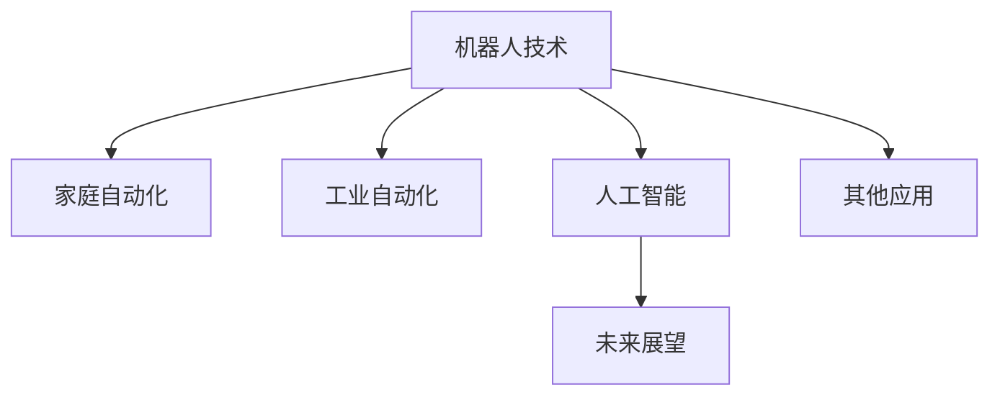

                 

# 硅谷机器人发展:家庭服务与工业自动化

> 关键词：机器人技术,家庭自动化,工业自动化,硅谷,科技创新,人工智能,未来展望

## 1. 背景介绍

### 1.1 问题由来

随着科技的飞速发展，机器人技术已经渗透到社会生活的方方面面。从家庭服务到工业生产，从医疗护理到教育培训，机器人正逐渐改变我们的生活方式和工作模式。特别是硅谷，作为全球科技创新中心，机器人在该地区的发展尤为迅猛。

硅谷拥有大量的科技公司和研究机构，聚集了顶尖的工程师和科学家。这里的机器人技术不仅在学术研究上取得了突破，还在实际应用中不断创新，推动了整个行业的发展。本文将系统介绍硅谷在机器人技术领域的研究现状和发展趋势，探讨机器人在家庭服务和工业自动化中的应用前景。

### 1.2 问题核心关键点

硅谷机器人技术的核心关键点主要包括以下几个方面：

- **机器人技术**：包括机器人硬件设计、机械结构、传感器、执行器等基础技术。
- **家庭自动化**：利用机器人技术实现家庭环境的智能化和自动化，如家庭清洁、安防监控、娱乐服务等。
- **工业自动化**：利用机器人技术优化工业生产流程，提高生产效率和质量，减少人力成本。
- **人工智能**：与机器人技术紧密结合，实现机器人的智能化和自主决策能力。
- **未来展望**：探讨机器人技术在未来的发展方向和可能的应用场景。

## 2. 核心概念与联系

### 2.1 核心概念概述

为了更好地理解硅谷机器人技术的发展，我们首先介绍一些核心概念：

- **机器人技术**：指使用人工智能、计算机技术、机械技术等方法，设计和制造的自动化系统，可以执行各种任务，如搬运、装配、监测、清洁等。
- **家庭自动化**：指利用传感器、执行器、控制器等设备，实现家庭环境的智能化控制，提升居住的舒适性和安全性。
- **工业自动化**：指在工业生产中，通过自动化技术实现生产的连续化、智能化，提高生产效率和产品质量。
- **人工智能**：指利用机器学习、深度学习等方法，使计算机具备一定的智能决策能力，能够自主完成任务。
- **未来展望**：基于当前的技术基础和研究趋势，预测未来机器人技术可能的发展方向和应用场景。

这些概念之间的逻辑关系可以通过以下Mermaid流程图来展示：



这个流程图展示了机器人技术与其他概念之间的联系：

1. 机器人技术是家庭自动化、工业自动化和人工智能的基础。
2. 家庭自动化、工业自动化和人工智能都是机器人技术的下游应用场景。
3. 未来展望基于当前的技术基础和应用场景，展望未来机器人技术的发展方向。

## 3. 核心算法原理 & 具体操作步骤

### 3.1 算法原理概述

硅谷在机器人技术的研究中，广泛应用了监督学习、强化学习、深度学习等算法。这些算法使得机器人能够从数据中学习，从而具备智能决策和自主执行任务的能力。

以监督学习为例，机器人可以通过对大量有标注数据的学习，掌握不同任务的规则和模式。在执行任务时，机器人根据输入数据和已学习的模型，输出相应的动作或决策。监督学习的核心思想是通过已有标注数据，训练机器人的模型，使其能够在新数据上表现良好。

### 3.2 算法步骤详解

以下是基于监督学习的机器人技术微调步骤详解：

1. **数据收集**：收集机器人执行任务的数据，如环境传感器数据、执行器数据等，并将其标注化。

2. **模型选择**：选择合适的机器人模型，如基于深度学习的神经网络模型、基于强化学习的决策树模型等。

3. **模型训练**：使用收集到的标注数据，训练机器人模型。在训练过程中，使用交叉验证等技术，避免过拟合。

4. **模型评估**：使用测试数据集，评估训练好的机器人的性能。通常使用准确率、召回率、F1分数等指标进行评估。

5. **模型微调**：根据评估结果，对模型进行微调。微调过程中，可以使用数据增强、正则化、迁移学习等技术，提高模型的泛化能力。

6. **实际应用**：将微调后的机器人模型应用到实际任务中，进行性能测试和优化。

### 3.3 算法优缺点

硅谷机器人技术在监督学习、强化学习、深度学习等方面取得了显著成果，但也存在一些不足：

**优点**：

- **智能决策**：监督学习和深度学习使得机器人能够从数据中学习，具备智能决策能力。
- **适应性强**：模型微调技术使得机器人能够适应不同的应用场景。
- **自动化程度高**：通过自动化技术，机器人能够自主执行任务，减少人工干预。

**缺点**：

- **数据依赖**：机器人技术需要大量的有标注数据进行训练，获取数据成本较高。
- **模型复杂**：复杂的模型结构可能导致计算资源消耗大，推理速度慢。
- **模型泛化能力有限**：在某些特定场景下，机器人可能无法泛化到新的数据。

### 3.4 算法应用领域

硅谷机器人技术在多个领域得到了广泛应用，包括但不限于：

- **医疗护理**：机器人用于手术辅助、康复护理、药物配送等。
- **教育培训**：机器人用于语言教学、编程训练、科学实验等。
- **家庭服务**：机器人用于家庭清洁、安全监控、娱乐互动等。
- **工业制造**：机器人用于自动化装配、物流搬运、质量检测等。
- **农业种植**：机器人用于精准农业、智能施肥、病虫害防治等。

## 4. 数学模型和公式 & 详细讲解 & 举例说明

### 4.1 数学模型构建

在机器人技术中，常用的数学模型包括线性回归、逻辑回归、决策树、支持向量机等。这些模型都可以用于机器人智能决策的训练和优化。

以线性回归模型为例，假设机器人执行任务的目标是预测一个二分类问题，输入数据为 $(x_1, x_2, ..., x_n)$，输出为 $y \in \{0,1\}$。线性回归模型的目标是最小化预测值与真实值之间的误差。其数学模型如下：

$$
\min_{w, b} \frac{1}{2N} \sum_{i=1}^N (y_i - (w \cdot x_i + b))^2
$$

其中 $w$ 为模型参数，$b$ 为偏置项，$N$ 为样本数量。

### 4.2 公式推导过程

线性回归模型的推导过程如下：

1. **模型假设**：假设线性回归模型为 $y = w \cdot x + b$，其中 $w$ 为模型参数，$b$ 为偏置项。

2. **目标函数**：目标是最小化预测值与真实值之间的平方误差，即 $\frac{1}{2N} \sum_{i=1}^N (y_i - (w \cdot x_i + b))^2$。

3. **梯度下降**：通过梯度下降算法，求出最小化目标函数的模型参数 $w$ 和 $b$。

4. **模型评估**：使用测试数据集，评估训练好的模型的性能。通常使用准确率、召回率、F1分数等指标进行评估。

### 4.3 案例分析与讲解

以机器人执行清洁任务为例，假设机器人需要根据环境传感器数据，判断是否需要开启清洁设备。我们可以使用基于监督学习的算法，训练一个分类模型。输入为传感器数据，输出为开启清洁设备（1）或关闭清洁设备（0）。

具体步骤如下：

1. **数据收集**：收集机器人执行清洁任务的数据，如温度、湿度、灰尘浓度等传感器数据，并将其标注化。

2. **模型选择**：选择合适的分类模型，如支持向量机、决策树等。

3. **模型训练**：使用收集到的标注数据，训练分类模型。在训练过程中，使用交叉验证等技术，避免过拟合。

4. **模型评估**：使用测试数据集，评估训练好的分类模型的性能。通常使用准确率、召回率、F1分数等指标进行评估。

5. **模型微调**：根据评估结果，对模型进行微调。微调过程中，可以使用数据增强、正则化、迁移学习等技术，提高模型的泛化能力。

6. **实际应用**：将微调后的分类模型应用到实际任务中，进行性能测试和优化。

## 5. 项目实践：代码实例和详细解释说明

### 5.1 开发环境搭建

在进行机器人技术开发前，我们需要准备好开发环境。以下是使用Python进行PyTorch开发的环境配置流程：

1. 安装Anaconda：从官网下载并安装Anaconda，用于创建独立的Python环境。

2. 创建并激活虚拟环境：
```bash
conda create -n robot-env python=3.8 
conda activate robot-env
```

3. 安装PyTorch：根据CUDA版本，从官网获取对应的安装命令。例如：
```bash
conda install pytorch torchvision torchaudio cudatoolkit=11.1 -c pytorch -c conda-forge
```

4. 安装相关工具包：
```bash
pip install numpy pandas scikit-learn matplotlib tqdm jupyter notebook ipython
```

完成上述步骤后，即可在`robot-env`环境中开始机器人技术开发。

### 5.2 源代码详细实现

这里以机器人执行清洁任务为例，给出使用PyTorch进行监督学习微调的PyTorch代码实现。

首先，定义清洁任务的数据处理函数：

```python
from torch.utils.data import Dataset
import torch

class CleaningDataset(Dataset):
    def __init__(self, sensor_data, labels):
        self.sensor_data = sensor_data
        self.labels = labels
        
    def __len__(self):
        return len(self.sensor_data)
    
    def __getitem__(self, item):
        sensor_data = self.sensor_data[item]
        label = self.labels[item]
        
        # 对传感器数据进行归一化处理
        # 将数据转换为Tensor格式
        sensor_data_tensor = torch.tensor(sensor_data, dtype=torch.float32)
        
        # 将标签转换为Tensor格式
        label_tensor = torch.tensor(label, dtype=torch.long)
        
        return {'sensor_data': sensor_data_tensor, 
                'labels': label_tensor}
```

然后，定义模型和优化器：

```python
from torch.nn import Linear, Sigmoid
from torch.optim import Adam

# 定义模型结构
model = Linear(in_features=5, out_features=1)
model.sigmoid_()

# 定义优化器
optimizer = Adam(model.parameters(), lr=0.001)
```

接着，定义训练和评估函数：

```python
from torch.utils.data import DataLoader
from sklearn.metrics import accuracy_score

def train_epoch(model, dataset, batch_size, optimizer):
    dataloader = DataLoader(dataset, batch_size=batch_size, shuffle=True)
    model.train()
    epoch_loss = 0
    for batch in dataloader:
        sensor_data = batch['sensor_data']
        labels = batch['labels']
        model.zero_grad()
        outputs = model(sensor_data)
        loss = outputs.sigmoid() - labels
        epoch_loss += loss.item()
        loss.backward()
        optimizer.step()
    return epoch_loss / len(dataloader)

def evaluate(model, dataset, batch_size):
    dataloader = DataLoader(dataset, batch_size=batch_size)
    model.eval()
    preds, labels = [], []
    with torch.no_grad():
        for batch in dataloader:
            sensor_data = batch['sensor_data']
            labels = batch['labels']
            outputs = model(sensor_data)
            preds.append(outputs.sigmoid() > 0.5)
            labels.append(labels)
    
    accuracy = accuracy_score(labels, preds)
    print(f"Accuracy: {accuracy:.3f}")
```

最后，启动训练流程并在测试集上评估：

```python
epochs = 10
batch_size = 32

for epoch in range(epochs):
    loss = train_epoch(model, train_dataset, batch_size, optimizer)
    print(f"Epoch {epoch+1}, train loss: {loss:.3f}")
    
    print(f"Epoch {epoch+1}, test accuracy:")
    evaluate(model, test_dataset, batch_size)
    
print("Training complete.")
```

以上就是使用PyTorch对机器人执行清洁任务进行监督学习微调的完整代码实现。可以看到，得益于PyTorch的强大封装，我们可以用相对简洁的代码完成机器人的训练和评估。

### 5.3 代码解读与分析

让我们再详细解读一下关键代码的实现细节：

**CleaningDataset类**：
- `__init__`方法：初始化传感器数据和标签，并进行数据预处理。
- `__len__`方法：返回数据集的样本数量。
- `__getitem__`方法：对单个样本进行处理，将传感器数据和标签转换为Tensor格式，供模型训练使用。

**模型结构**：
- 使用线性回归模型，输入为传感器数据，输出为开启清洁设备（1）或关闭清洁设备（0）。
- 使用sigmoid函数将输出转换为概率值，表示开启清洁设备的概率。

**训练和评估函数**：
- 使用PyTorch的DataLoader对数据集进行批次化加载，供模型训练和推理使用。
- 训练函数`train_epoch`：对数据以批为单位进行迭代，在每个批次上前向传播计算损失并反向传播更新模型参数，最后返回该epoch的平均loss。
- 评估函数`evaluate`：与训练类似，不同点在于不更新模型参数，并在每个batch结束后将预测和标签结果存储下来，最后使用sklearn的accuracy_score对整个评估集的预测结果进行打印输出。

**训练流程**：
- 定义总的epoch数和batch size，开始循环迭代
- 每个epoch内，先在训练集上训练，输出平均loss
- 在测试集上评估，输出分类准确率
- 所有epoch结束后，给出最终训练结果

可以看到，PyTorch配合深度学习框架使得机器人执行清洁任务的监督学习微调的代码实现变得简洁高效。开发者可以将更多精力放在数据处理、模型改进等高层逻辑上，而不必过多关注底层的实现细节。

当然，工业级的系统实现还需考虑更多因素，如模型的保存和部署、超参数的自动搜索、更灵活的任务适配层等。但核心的微调范式基本与此类似。

## 6. 实际应用场景

### 6.1 家庭服务

家庭服务是机器人技术应用最广泛的场景之一。硅谷在这方面的研究也处于全球领先地位。以下列举几个典型应用：

1. **智能清洁机器人**：机器人利用传感器数据，自动规划清洁路径，执行清洁任务。用户可以通过智能手机或语音助手控制机器人的工作状态。

2. **家庭安防监控**：机器人安装摄像头和传感器，实时监控家庭环境，检测异常情况并报警。同时，机器人可以根据用户指令进行自主巡逻和视频回放。

3. **智能厨房助手**：机器人帮助用户完成准备食材、烹饪等任务，节省时间和体力。用户可以通过语音或触屏交互，告诉机器人具体需求。

### 6.2 工业自动化

工业自动化是机器人技术的重要应用领域。硅谷在该领域的创新和应用也相当活跃。以下列举几个典型应用：

1. **自动化装配线**：机器人用于汽车、电子产品等生产线的装配和测试。机器人能够高效、精确地执行复杂装配任务，减少人工错误和生产成本。

2. **智能仓储系统**：机器人用于自动化仓库的货物搬运和分拣。机器人能够自主导航和识别货物，提升仓储效率和准确性。

3. **质量检测**：机器人用于产品生产中的质量检测，如表面缺陷检测、尺寸测量等。机器人能够实时检测产品，减少人工检测成本和误判率。

### 6.3 医疗护理

医疗护理是机器人技术在公共卫生和健康领域的重要应用场景。硅谷在这方面的研究也得到了广泛关注。以下列举几个典型应用：

1. **手术辅助机器人**：机器人辅助医生进行手术，提供精准的机械手操作和导航支持。机器人能够提高手术的精确性和安全性，减少手术风险。

2. **康复护理机器人**：机器人用于老年人和残疾人的康复护理，帮助他们进行日常活动和康复训练。机器人能够提供个性化的护理方案，提升患者的生活质量。

3. **药物配送机器人**：机器人用于医院和养老院的药物配送，提供准确、及时的药物供应。机器人能够减少人工错误和药物误用，提升药物管理的效率和可靠性。

### 6.4 教育培训

教育培训是机器人技术在教育领域的重要应用场景。硅谷在该领域的研究也取得了不少成果。以下列举几个典型应用：

1. **智能教学机器人**：机器人用于教育机构的课堂教学和辅导。机器人能够提供个性化的教学方案，帮助学生更好地理解和掌握知识。

2. **编程训练机器人**：机器人用于编程教育和训练，帮助学生学习编程语言和编程技能。机器人能够提供实时的代码反馈和指导，提升学生的编程能力。

3. **科学实验机器人**：机器人用于科学实验和研究，帮助学生进行实验设计和数据采集。机器人能够提供精确的实验操作和数据分析，提升科学研究的效率和准确性。

### 6.5 未来应用展望

随着机器人技术的发展，未来将有更多的应用场景得到拓展，如智能家居、智慧城市、智慧交通等。以下列举几个未来应用趋势：

1. **智能家居**：机器人用于家居环境的智能化控制，如智能家电控制、智能安防监控、智能温控系统等。机器人能够提供舒适、便捷、安全的生活环境。

2. **智慧城市**：机器人用于城市环境的智能化管理，如交通监控、垃圾处理、环境监测等。机器人能够提升城市的智能化水平，提高城市管理的效率和质量。

3. **智慧交通**：机器人用于交通管理和调度，如自动驾驶、智能交通信号控制、交通流量监测等。机器人能够优化交通流量，减少交通拥堵，提升交通系统的效率和安全性。

## 7. 工具和资源推荐

### 7.1 学习资源推荐

为了帮助开发者系统掌握机器人技术的研究基础和应用技术，这里推荐一些优质的学习资源：

1. **《机器人学导论》**：清华大学出版社，该书系统介绍了机器人的基础理论和应用技术，适合初学者阅读。

2. **Coursera《Robotics Specialization》**：斯坦福大学开设的机器人学系列课程，有视频讲座和配套作业，涵盖机器人技术和应用。

3. **《机器人学原理》**：David A. Klein所著，该书深入浅出地介绍了机器人的机械结构、传感器、控制系统等基础知识。

4. **ArXiv机器人领域论文**：ArXiv网站提供了大量机器人领域的学术论文，涵盖最新研究进展和前沿技术。

5. **Robotics for everyone**：A free online textbook on robotics and artificial intelligence，涵盖机器人技术的各个方面，适合自学者阅读。

通过对这些资源的学习实践，相信你一定能够快速掌握机器人技术的研究基础和应用技巧，并用于解决实际问题。

### 7.2 开发工具推荐

高效的开发离不开优秀的工具支持。以下是几款用于机器人技术开发的常用工具：

1. **Robot Operating System (ROS)**：一个开源的机器人操作系统，提供了强大的数据管理、通信和控制系统，适合机器人开发和调试。

2. **Gazebo**：一个基于物理模拟的开源仿真平台，用于机器人运动和感知的仿真测试，适合机器人设计与调试。

3. **Rviz**：一个用于可视化机器人状态和环境的开源工具，提供丰富的图形界面，适合机器人调试和监控。

4. **ROS Bag Viewer**：用于回放和分析机器人仿真或实际应用中的传感器数据，适合机器人系统调试和优化。

5. **ROS-Net**：用于网络机器人控制和监控的开源工具，适合网络环境下机器人开发和测试。

6. **AURIN（Advanced Unmanned Robotics and Intelligent Networks）**：由ETH Zurich开发的开源机器人平台，支持多种机器人设备和传感器，适合复杂机器人系统的开发和测试。

合理利用这些工具，可以显著提升机器人技术开发的效率，加快创新迭代的步伐。

### 7.3 相关论文推荐

机器人技术的发展离不开学界的持续研究。以下是几篇奠基性的相关论文，推荐阅读：

1. **“Robot Learning from Demonstration”**：Andrew Ng等，提出基于示范学习的机器人技术，使得机器人能够通过观察人类操作，学习执行复杂任务。

2. **“A Survey of Robot Manipulation and Automation”**：Christian Voss等，全面综述了机器人操作和自动化的最新进展，涵盖机器人设计和控制等各个方面。

3. **“Learning with Partially Observed Control Constraints”**：Andrew Ng等，提出基于部分可观测控制约束的机器人学习技术，使得机器人能够在不确定环境下自主决策。

4. **“Control of Robot Manipulators by Learning from Demonstration”**：Arthur Marianetti等，提出基于示范学习的机器人控制技术，使得机器人能够通过观察人类操作，学习执行复杂任务。

5. **“Robust Manipulation of Objects with Robust Manipulation Grasps”**：Zachary Gaze等，提出基于鲁棒抓取技术的机器人操作技术，使得机器人能够准确、安全地执行抓取任务。

这些论文代表了大语言模型微调技术的发展脉络。通过学习这些前沿成果，可以帮助研究者把握学科前进方向，激发更多的创新灵感。

## 8. 总结：未来发展趋势与挑战

### 8.1 研究成果总结

硅谷在机器人技术的研究中，取得了显著的成果，涵盖了家庭服务、工业自动化、医疗护理等多个领域。通过监督学习、强化学习、深度学习等算法，机器人技术已经具备了智能决策和自主执行任务的能力。未来，随着技术的不断进步，机器人将在更多的应用场景中得到应用，提升人类的生活质量和工作效率。

### 8.2 未来发展趋势

展望未来，硅谷机器人技术将呈现以下几个发展趋势：

1. **更加智能化的机器人**：未来机器人将具备更强大的自主决策和自适应能力，能够在更加复杂和动态的环境中执行任务。

2. **多模态机器人**：未来机器人将能够整合视觉、听觉、触觉等多种感知信息，提升对环境的理解和适应能力。

3. **人机协同的机器人**：未来机器人将能够更好地与人类协作，提升系统的可靠性和安全性。

4. **更加广泛的应用场景**：未来机器人将在更多领域得到应用，如智慧城市、智慧交通、智慧农业等。

5. **更加灵活和可定制的机器人**：未来机器人将具备更高的可定制性，用户可以根据需求定制机器人功能和界面。

### 8.3 面临的挑战

尽管硅谷机器人技术已经取得了显著进展，但在迈向更加智能化、普适化应用的过程中，仍面临诸多挑战：

1. **高成本**：机器人的设计和制造需要大量的资金和技术投入，普通用户难以负担。

2. **安全性**：机器人在执行任务时，可能存在安全隐患，如碰撞、误操作等。

3. **可靠性和稳定性**：机器人在复杂环境下可能出现故障，影响任务的完成。

4. **伦理和隐私问题**：机器人的广泛应用可能涉及隐私和伦理问题，需要制定相应的政策和规范。

5. **算法复杂性**：机器人的算法复杂，难以快速迭代和优化。

### 8.4 研究展望

面向未来，机器人技术需要解决以上挑战，实现更加智能化、普适化应用。未来的研究方向包括：

1. **低成本、易用化的机器人**：研发更加经济实惠、易于使用的机器人，降低普通用户的使用门槛。

2. **高安全性的机器人**：提高机器人的安全性，保障用户的人身和财产安全。

3. **高可靠性和稳定性**：提高机器人的可靠性和稳定性，确保在复杂环境下能够稳定执行任务。

4. **伦理和隐私保护的机器人**：制定机器人使用的伦理和隐私保护规范，确保机器人行为符合人类价值观和伦理道德。

5. **高效的算法和模型**：研发高效的算法和模型，提升机器人的学习能力和推理速度。

6. **多模态、人机协同的机器人**：开发多模态感知技术和人机协同算法，提升机器人的环境理解和任务执行能力。

总之，未来机器人技术需要从硬件设计、软件算法、用户体验等多个维度协同发力，才能真正实现智能化、普适化的应用，为人类社会带来更多便利和创新。

