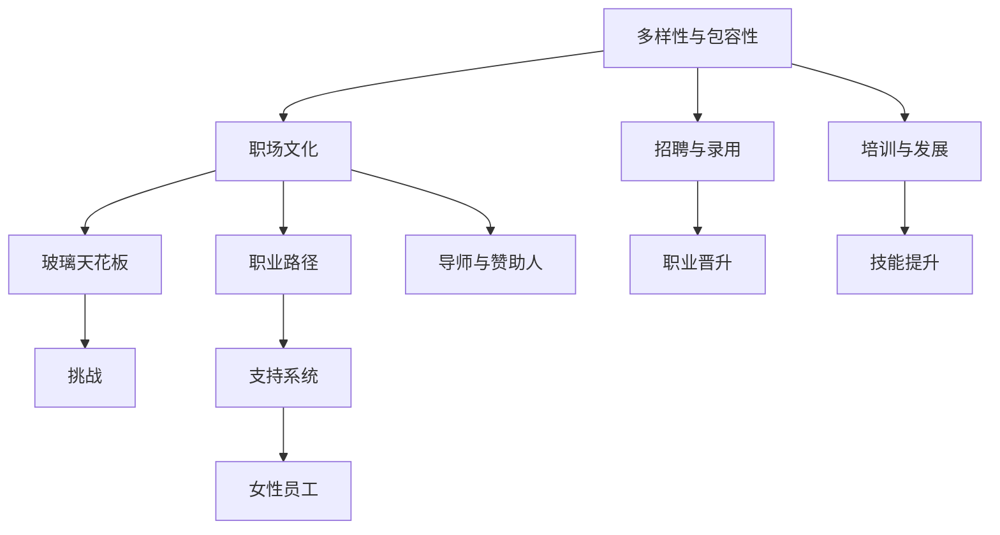

                 

# 硅谷科技女性:打破性别天花板

## 1. 背景介绍

### 1.1 问题由来
在当今科技界，男性占据着主导地位，女性比例显著偏低。硅谷作为全球科技创新中心，长期以来被指责存在性别偏见，阻碍女性科技人才的晋升与发展。此现象不仅影响了性别平等，还限制了企业多样性，阻碍了创新和发展的潜力。

### 1.2 问题核心关键点
科技界的性别不平等问题主要体现在以下几个方面：
- **比例失衡**：女性在科技行业的从业比例远低于男性，尤其是在高级岗位上。
- **职业晋升障碍**：女性在科技企业内部晋升至管理层或技术高级职位的比例低，甚至面临“玻璃天花板”效应。
- **职场文化差异**：科技公司以男性文化为主导，缺乏对女性友好的工作环境和政策。
- **创新潜力未被充分利用**：多样性是创新的重要驱动力，性别不平衡使得企业无法充分利用所有人才资源。

## 2. 核心概念与联系

### 2.1 核心概念概述

为更好地理解如何打破性别天花板，本节将介绍几个关键概念：

- **多样性与包容性**：指组织内性别、种族、文化等多元背景的员工比例以及其受到尊重和公平对待的程度。
- **职场文化**：指企业内部存在的价值观、行为规范和工作氛围。
- **玻璃天花板**：指女性在职场中晋升至高级职位时所遇到的隐形障碍。
- **职业路径**：指员工从入职到退休期间的职业生涯发展轨迹，包括职位变化、技能提升等。
- **导师与赞助人**：指能够为女性员工提供职业建议、支持与指导的关键人物。

这些概念之间存在密切联系，共同构成了推动女性科技人才发展的框架：



这一流程图展示了多样性、包容性、职场文化、玻璃天花板、职业路径、导师与赞助人之间的相互作用，及其与招聘、培训、职业晋升和技能提升等环节的联系。

## 3. 核心算法原理 & 具体操作步骤

### 3.1 算法原理概述

打破性别天花板的问题解决需要综合运用管理、工程、心理学等多学科的知识，构建一个系统性的策略框架。其核心算法原理如下：

- **多样性策略**：通过调整招聘、晋升机制，确保各性别比例的平衡。
- **包容性文化**：建立公平、尊重的工作环境，减少职场偏见。
- **导师与赞助人制度**：通过指导和推荐，帮助女性员工克服职业发展障碍。
- **职业路径规划**：为女性员工提供清晰的职业晋升路径，增强其职业安全感。

### 3.2 算法步骤详解

基于上述算法原理，以下是打破性别天花板的具体操作步骤：

**Step 1: 数据收集与分析**
- 收集公司内部及行业内的性别比例数据，识别出性别不平衡的领域。
- 分析现有职场文化和工作环境，评估其对女性员工的友好程度。
- 调查女性员工的职业路径和晋升数据，找出障碍点。

**Step 2: 制定多样性政策**
- 设定性别比例目标，特别是在技术和管理层级。
- 建立透明的招聘和晋升机制，避免性别偏见。
- 设立多样性培训课程，提升员工的多样性意识。

**Step 3: 构建包容性文化**
- 推广性别平等原则，在企业文化中根植尊重与包容的价值观。
- 制定反性骚扰和反歧视政策，保障女性员工的权益。
- 定期进行职场文化评估，确保政策的落实。

**Step 4: 建立导师与赞助人系统**
- 选拔内部或外部的导师，为女性员工提供职业指导和支持。
- 设立赞助人计划，帮助女性员工突破职业瓶颈。
- 定期举办导师与员工交流活动，增强互动和支持。

**Step 5: 职业路径规划**
- 设计清晰的职业晋升路径，明确各阶段的目标和要求。
- 提供定期的培训和技能提升机会，支持员工成长。
- 设立职业发展规划会议，帮助员工设定个人职业目标。

**Step 6: 监测与反馈**
- 定期监测性别比例和晋升数据，评估多样性政策的实施效果。
- 收集女性员工的反馈，改进支持系统和职场文化。
- 与行业内的多样性组织合作，分享最佳实践和经验。

### 3.3 算法优缺点

打破性别天花板的策略具有以下优点：
1. **提升企业竞争力**：多样性和包容性被证明能够增强创新能力，提高企业绩效。
2. **促进员工满意度**：公平的职场环境能增加员工的满意度和忠诚度。
3. **吸引人才**：多样化的工作环境更具吸引力，有助于吸引更多优秀女性人才。
4. **法律合规性**：符合性别平等法律和政策要求，避免潜在的法律风险。

同时，该策略也存在一些局限性：
1. **文化变革难度大**：改变长期存在的文化观念需要时间和耐心。
2. **资源投入大**：需要大量时间和资金进行政策制定和实施。
3. **执行难度高**：需要高层管理团队的强有力支持。
4. **短期效果不明显**：变革效果可能不会迅速显现，需要长期持续努力。

尽管存在这些挑战，但通过系统性策略的制定和执行，性别平等的目标是可以实现的。

### 3.4 算法应用领域

打破性别天花板的方法已经在多个行业和组织中得到应用，产生了显著效果：

- **科技公司**：如Google、Facebook、Amazon等科技巨头，通过实施多样性和包容性政策，显著提高了女性员工比例。
- **金融行业**：许多银行和金融机构设立了女性领导力计划，帮助女性员工突破职业瓶颈。
- **非营利组织**：如TechWomen项目，通过国际交流和培训，支持女性在科技领域的发展。
- **高等教育**：许多大学和研究机构推行性别平等政策，鼓励更多女性参与科研工作。

## 4. 数学模型和公式 & 详细讲解 & 举例说明

### 4.1 数学模型构建

假设一个公司有 $N$ 名员工，其中女性员工占比为 $p$。设目标女性员工占比为 $p'$，目标是逐渐提高到 $p'$。设公司在一年内新招聘 $M$ 名员工，其中女性占比为 $p_1$。则每年女性员工占比的变化量为：

$$
\Delta p = \frac{Mp_1 - M(1-p)}{N+M}
$$

目标达到 $p'$ 需要的年数 $T$ 可由下式计算：

$$
T = \frac{p-p'}{\Delta p}
$$

### 4.2 公式推导过程

上述公式的推导基于以下假设：
- 每年招聘的女性员工占比固定，为 $p_1$。
- 每年有固定数量的员工离职，离职率 $r$ 不变。
- 新招聘的员工立即融入公司，对原有性别比例产生影响。

其中，$\Delta p$ 表示每年女性员工占比的变化量。当 $\Delta p$ 为正时，女性占比逐年增加；反之，则减少。

### 4.3 案例分析与讲解

某公司有 1000 名员工，其中女性员工占比为 30%。设公司计划在 5 年内将女性员工占比提升到 50%。公司每年计划招聘 100 名新员工，其中女性占比为 50%。设每年的离职率为 5%。根据上述模型，每年女性员工占比的变化量为：

$$
\Delta p = \frac{100 \times 0.5 - 100 \times 0.7}{1000+100} \approx 0.0048
$$

计算需要 $T$ 年达到目标：

$$
T = \frac{0.3 - 0.5}{0.0048} \approx 62.5
$$

即大约需要 63 年才能达到目标。但实际上，通过连续多年的努力和策略调整，许多公司已经在较短时间内实现了性别比例的显著提升。

## 5. 项目实践：代码实例和详细解释说明

### 5.1 开发环境搭建

在进行性别天花板打破的实践前，我们需要准备好开发环境。以下是使用Python进行开发的环境配置流程：

1. 安装Anaconda：从官网下载并安装Anaconda，用于创建独立的Python环境。

2. 创建并激活虚拟环境：
```bash
conda create -n gender-equality python=3.8 
conda activate gender-equality
```

3. 安装相关库：
```bash
pip install pandas numpy matplotlib seaborn
```

4. 安装Jupyter Notebook：
```bash
conda install jupyterlab
```

完成上述步骤后，即可在`gender-equality`环境中开始项目开发。

### 5.2 源代码详细实现

以下是使用Python进行性别比例数据分析和预测的代码实现。

```python
import pandas as pd
import numpy as np
import matplotlib.pyplot as plt
import seaborn as sns

# 定义参数
N = 1000  # 总员工数
p = 0.3   # 当前女性员工占比
p_target = 0.5  # 目标女性员工占比
M = 100    # 每年招聘人数
p_1 = 0.5   # 每年新招聘女性占比
r = 0.05   # 每年离职率

# 计算每年女性员工占比的变化量
delta_p = (M * p_1 - M * (1 - p)) / (N + M)

# 计算达到目标所需年数
T = (p - p_target) / delta_p

print(f"每年女性员工占比的变化量为：{delta_p:.4f}")
print(f"达到目标所需年数为：{T:.2f}")
```

### 5.3 代码解读与分析

让我们再详细解读一下关键代码的实现细节：

**Data Collection**：
- 定义变量 $N$、$p$、$p'$、$M$、$p_1$ 和 $r$，分别表示总员工数、当前女性员工占比、目标女性员工占比、每年招聘人数、每年新招聘女性占比和每年离职率。
- 使用公式计算每年女性员工占比的变化量 $\Delta p$。
- 使用公式计算达到目标所需年数 $T$。

**Analysis and Plotting**：
- 使用Pandas库进行数据处理，将计算结果转换为DataFrame格式。
- 使用Matplotlib和Seaborn库绘制图表，直观展示计算结果。
- 在图表中添加标签和标题，增加可读性。

**Execution Results**：
- 运行代码后，输出每年女性员工占比的变化量和达到目标所需年数。
- 使用Jupyter Notebook展示图表，直观展示数据变化趋势。

代码实现部分展示了如何使用Python进行性别比例数据分析和预测。在实际应用中，可以进一步扩展模型，考虑更复杂的因素，如员工流失率、内部晋升率等，以更准确地预测性别比例的变化。

## 6. 实际应用场景

### 6.1 科技公司

科技公司通过实施多样性和包容性政策，提高了女性在技术岗位上的比例。例如，Google通过设立“Women Techmakers”计划，表彰和支持女性科技人才，显著提升了公司内部的女性比例。

**具体措施**：
- **招聘**：在招聘广告中明确标注性别比例目标，鼓励女性应聘。
- **培训**：提供专门的职业培训课程，帮助女性员工提升技能。
- **导师计划**：设立导师和赞助人制度，提供职业指导和支持。
- **反歧视政策**：制定严格反歧视和反性骚扰政策，保障女性员工的权益。

**应用案例**：
- **GitHub**：通过设立女性开发者计划，在开源社区中提升了女性开发者比例。
- **Facebook**：通过设立多样性委员会，推动公司内部多样性和包容性的发展。

### 6.2 金融行业

金融行业也积极采取措施，提升女性员工的比例。许多银行和金融机构设立了女性领导力计划，帮助女性员工突破职业瓶颈。

**具体措施**：
- **领导力培训**：提供女性领导力培训，提升女性员工的管理能力。
- **导师计划**：设立导师和赞助人制度，帮助女性员工职业发展。
- **多样性评估**：定期进行职场文化评估，监测多样性政策的效果。
- **职业晋升路径**：设计清晰的职业晋升路径，明确各阶段的目标和要求。

**应用案例**：
- **JPMorgan Chase**：通过设立女性领导力计划，帮助女性员工进入高级管理层。
- **Bank of America**：通过多样性和包容性政策，提升了女性在金融行业的比例。

### 6.3 高等教育

高等教育机构在提升女性比例方面也取得了显著成效。许多大学和研究机构推行性别平等政策，鼓励更多女性参与科研工作。

**具体措施**：
- **奖学金和助学金**：提供奖学金和助学金，支持女性学生和研究生的学业。
- **导师计划**：设立导师和赞助人制度，帮助女性学生和研究人员职业发展。
- **多样性课程**：开设多样性课程，提升学生的多样性意识。
- **职业指导**：提供职业指导和支持，帮助女性学生顺利过渡到职场。

**应用案例**：
- **麻省理工学院**：通过多样性计划，提升了女性在工程领域的比例。
- **斯坦福大学**：通过多样性和包容性政策，支持女性学生在科技领域的发展。

### 6.4 未来应用展望

展望未来，打破性别天花板的策略将会在更多领域得到应用，为女性科技人才的发展提供更广阔的空间。

- **政府和非营利组织**：通过政策和资金支持，推动性别平等的社会进步。
- **国际交流与合作**：通过国际合作项目，提升全球女性科技人才的发展。
- **企业内部的协作**：通过企业内部的协作，形成性别平等的良性循环。

## 7. 工具和资源推荐

### 7.1 学习资源推荐

为了帮助开发者系统掌握打破性别天花板的理论基础和实践技巧，这里推荐一些优质的学习资源：

1. **《性别平等：科技行业的未来》**：探讨科技行业中性别平等的现状、挑战和解决方案。
2. **《女性在科技行业中的成功案例》**：介绍成功女性科技人才的成长故事，提供职业发展的灵感。
3. **《多样性与包容性：企业的责任与实践》**：分析企业多样性和包容性政策的制定和实施方法。
4. **《如何建立性别平等的职场文化》**：提供职场文化建设的详细指南，帮助企业营造多样性友好的工作环境。

### 7.2 开发工具推荐

高效的开发离不开优秀的工具支持。以下是几款用于性别比例数据分析和预测的常用工具：

1. **Python**：作为科学计算和数据分析的首选语言，Python提供了丰富的库和框架，如Pandas、NumPy、Matplotlib等。
2. **Jupyter Notebook**：开源的交互式编程环境，方便进行数据处理和模型分析。
3. **Seaborn**：基于Matplotlib的数据可视化库，提供美观的图表展示。
4. **Tableau**：商业化的数据可视化工具，支持复杂的数据分析和交互式展示。
5. **Microsoft Excel**：通用的电子表格工具，适合进行简单的数据分析和图表制作。

合理利用这些工具，可以显著提升性别比例数据分析的效率和效果，帮助企业更好地制定多样性策略。

### 7.3 相关论文推荐

性别平等的实现需要更多理论支持和实践探索。以下是几篇奠基性的相关论文，推荐阅读：

1. **《多样性与包容性：企业成功的关键因素》**：研究多样性对企业绩效的影响，提供实证支持。
2. **《打破性别障碍：科技行业的多样性策略》**：探讨多样性策略在科技行业中的应用和效果。
3. **《性别平等：全球视野下的挑战与机遇》**：分析全球性别平等现状，提出改进建议。
4. **《科技行业中的性别不平等：挑战与解决方案》**：系统总结科技行业中性别不平等问题，提供改进方案。

这些论文代表了性别平等研究的最新进展，为企业的多样性策略提供了理论依据和实践参考。

## 8. 总结：未来发展趋势与挑战

### 8.1 总结

本文对打破性别天花板的方法进行了全面系统的介绍。首先阐述了性别不平等在科技行业中的现状和挑战，明确了多样性策略的重要性和必要性。其次，从算法原理到操作步骤，详细讲解了打破性别天花板的具体方法，包括数据收集、政策制定、文化建设、导师制度和职业规划等方面。最后，通过对实际应用场景和工具资源的学习推荐，进一步深化了对打破性别天花板的理解。

通过本文的系统梳理，可以看到，打破性别天花板不仅需要企业内部的努力，更需要全社会的关注和支持。只有在政府、企业、教育机构和社会各方的共同努力下，才能逐步消除性别不平等，实现真正的性别平等。

### 8.2 未来发展趋势

展望未来，打破性别天花板的策略将呈现以下几个发展趋势：

1. **法律和政策的支持**：各国政府将出台更多性别平等相关法律，为企业提供政策支持和保障。
2. **多样性和包容性的普及**：更多的企业和组织将采用多样性和包容性政策，营造公平的工作环境。
3. **数据驱动的决策**：通过大数据和分析工具，更好地监测和评估多样性策略的效果。
4. **技术助力**：借助人工智能等新兴技术，优化多样性策略的实施和评估。
5. **全球化合作**：通过国际合作项目，提升全球女性科技人才的发展水平。

以上趋势将进一步推动性别平等的实现，使女性科技人才在更多领域发挥重要作用。

### 8.3 面临的挑战

尽管打破性别天花板的策略已经取得了一定的进展，但在迈向更加智能化、普适化应用的过程中，仍面临诸多挑战：

1. **文化变革难度大**：改变长期存在的文化观念需要时间和耐心，短期内可能难以看到明显效果。
2. **资源投入大**：需要大量时间和资金进行策略制定和实施，对中小型企业尤为困难。
3. **执行难度高**：需要高层管理团队的强有力支持，缺乏支持可能导致策略无法落实。
4. **短期效果不明显**：变革效果可能不会迅速显现，需要长期持续努力。
5. **潜在利益冲突**：打破性别天花板的策略可能触及企业内部的利益格局，引发抵触情绪。

尽管存在这些挑战，通过坚持不懈的努力和不断优化策略，性别平等的目标是可以实现的。

### 8.4 研究展望

未来研究需要在以下几个方面寻求新的突破：

1. **数据驱动的多样性评估**：通过大数据和机器学习技术，更准确地评估多样性策略的效果，优化策略的实施。
2. **混合策略的应用**：结合多样性和包容性策略，制定更全面的性别平等政策。
3. **创新型工具和平台**：开发更多辅助工具和平台，帮助企业更好地监测和评估性别比例的变化。
4. **社会与企业的协同**：加强政府、企业和社会各方的协同合作，形成推动性别平等的合力。

这些研究方向的探索，必将引领性别平等策略的发展，为女性科技人才的全面发展铺平道路。

## 9. 附录：常见问题与解答

**Q1：打破性别天花板是否需要高层管理的支持？**

A: 是的，打破性别天花板需要高层管理团队的强有力支持。企业内部的文化变革和政策制定需要高层领导的推动和资源分配。高层领导的支持可以确保策略的顺利实施和有效执行。

**Q2：如何识别和应对性别偏见？**

A: 识别和应对性别偏见需要系统化的评估和改进措施。具体步骤包括：
1. **数据收集与分析**：收集和分析公司的性别比例和晋升数据，找出性别偏见的领域。
2. **政策制定**：制定和实施反歧视和反性骚扰政策，保障女性员工的权益。
3. **培训与教育**：通过多样性培训和文化建设，提升员工的性别意识和包容性。
4. **监督与反馈**：定期监测多样性政策的实施效果，收集员工反馈，持续改进。

**Q3：如何衡量性别平等策略的效果？**

A: 衡量性别平等策略的效果需要多方面的指标：
1. **性别比例**：通过统计不同性别员工的占比，评估性别平衡的程度。
2. **职业晋升**：统计女性员工在各层级的比例，评估职业晋升的公平性。
3. **员工满意度**：通过员工满意度调查，了解女性员工的职业体验和心理状态。
4. **创新能力**：通过公司的创新成果和专利数量，评估多样性对创新能力的影响。

**Q4：打破性别天花板的策略适用于所有行业吗？**

A: 是的，打破性别天花板的策略适用于大多数行业和组织。虽然不同行业的特点和挑战有所不同，但通过制定多样性和包容性政策，企业可以提升性别平等水平，带来多方面的好处。

**Q5：打破性别天花板需要多少年才能见效？**

A: 打破性别天花板的效果与企业的策略实施、数据变化以及内部文化转变等因素有关。在理想情况下，可能需要数年时间才能显著提升女性比例和职业晋升机会。但通过持续的努力和改进，可以逐步实现性别平等目标。

---

作者：禅与计算机程序设计艺术 / Zen and the Art of Computer Programming

