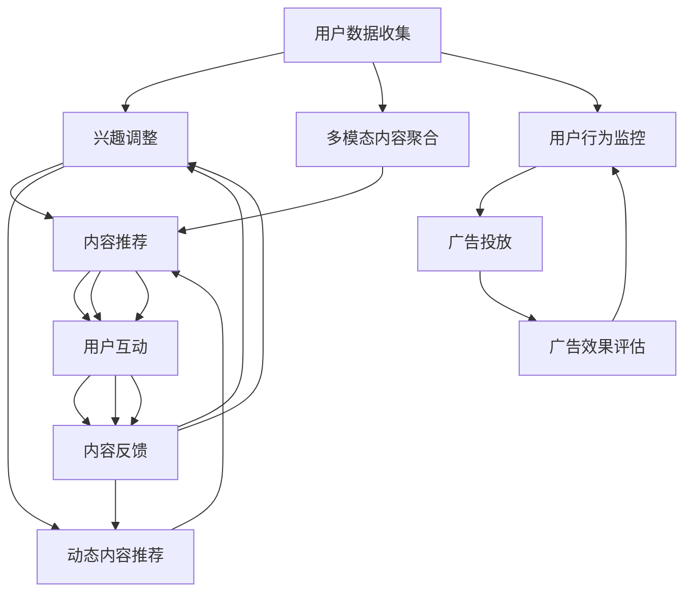

                 

## 1. 背景介绍

在数字经济的浪潮下，传统的生产与消费模式逐渐向一种新的经济形态——社群经济演进。这种模式通过社交网络和移动互联技术，将消费者、生产者和内容创作者紧密连接起来，形成一种共创共享的经济生态系统。本文将聚焦于社群经济中的注意力机制，探讨如何通过技术手段实现更加高效和精准的注意力聚合，从而提升社群经济的整体价值和用户参与度。

### 1.1 社群经济的发展历程

社群经济自20世纪初就开始萌芽，从最初的俱乐部、协会到如今基于社交网络、移动设备的社群，经历了数次转型。在传统经济模式中，消费者被视为最终用户，其需求通过企业端至消费者端的单向流通实现。而社群经济则通过社群平台，实现消费者、生产者和内容创作者之间的双向交互和价值交换。

社群经济的典型代表包括维基百科、豆瓣小组、知乎、微信公众号等，它们通过提供内容分享、互动交流的平台，汇聚了大量的用户，形成了高度活跃的社群。这些社群不仅能够有效聚合用户注意力，更可以通过用户自发创造内容，提升社群平台的价值和影响力。

### 1.2 社群经济的特征

社群经济相较于传统经济，具有以下几个显著特征：

1. **去中心化与去中介化**：用户之间的互动直接发生，减少了对中间商的依赖。
2. **共创共享**：用户不仅是消费者，也是内容的生产者和传播者，通过内容创造和分享，提升社群的活跃度和黏性。
3. **关系网络**：社群平台作为信息聚合与传播的中心，构建了用户间的深度连接。
4. **价值协同**：通过协同工作和内容创作，社群平台能够形成更丰富的内容生态和用户网络。

## 2. 核心概念与联系

### 2.1 核心概念概述

社群经济中的注意力机制，指的是如何通过技术手段，高效地将用户注意力聚合到特定的平台、内容或产品上。这种机制的核心在于：

1. **用户兴趣精准定位**：通过分析用户行为数据，精准推荐符合用户兴趣的内容。
2. **多模态内容聚合**：聚合文字、图片、视频等多形态内容，满足不同用户的需求。
3. **动态内容推荐**：根据用户行为变化，实时调整内容推荐策略，提升用户体验。
4. **互动与参与**：通过互动机制，提升用户参与度，增强社群的粘性和活跃度。

### 2.2 核心概念联系

社群经济中的注意力聚合机制，与推荐系统、内容分发、广告投放等密切相关。以下是一个简化的 Mermaid 流程图，展示了这些概念之间的联系：



该图展示了从数据收集、用户兴趣分析、内容推荐，到用户互动和内容反馈的完整流程，以及如何根据用户行为调整兴趣模型和内容推荐策略。

## 3. 核心算法原理 & 具体操作步骤

### 3.1 算法原理概述

社群经济中的注意力聚合机制，通过以下几个核心算法原理实现：

1. **用户兴趣模型**：通过分析用户行为数据，建立用户兴趣模型。
2. **内容特征提取**：对内容进行特征提取，建立内容的特征表示。
3. **推荐算法**：使用推荐算法，将用户与内容进行匹配。
4. **互动优化**：通过互动机制，优化推荐效果。

### 3.2 算法步骤详解

#### 3.2.1 用户兴趣模型的构建

用户兴趣模型的构建，包括以下步骤：

1. **用户行为数据收集**：通过日志、行为数据、互动数据等，收集用户的行为信息。
2. **特征工程**：将原始行为数据转化为可供机器学习算法使用的特征向量。
3. **模型训练**：使用机器学习模型（如协同过滤、深度学习等）训练用户兴趣模型。
4. **模型更新**：根据用户新行为数据，定期更新用户兴趣模型。

#### 3.2.2 内容特征提取

内容特征提取，包括以下步骤：

1. **内容数据收集**：从社交媒体、网站、论坛等渠道，收集内容数据。
2. **内容预处理**：对内容进行去噪、分词、实体识别等预处理。
3. **特征提取**：使用词袋模型、TF-IDF、LDA等方法，提取内容特征。
4. **内容表示**：将内容特征转换为向量化表示，如使用词嵌入（Word Embedding）。

#### 3.2.3 推荐算法的选择

推荐算法的选择，包括以下步骤：

1. **算法选择**：根据任务特性选择适合的推荐算法，如协同过滤、基于内容的推荐、混合推荐等。
2. **模型训练**：使用训练数据训练推荐模型。
3. **模型评估**：使用测试数据评估推荐模型效果，选择效果最优的模型。
4. **模型优化**：根据评估结果，优化推荐模型参数。

#### 3.2.4 互动优化

互动优化，包括以下步骤：

1. **互动机制设计**：设计互动机制，如点赞、评论、分享等。
2. **用户反馈收集**：通过互动数据收集用户反馈。
3. **互动数据分析**：分析互动数据，提取用户偏好和行为特征。
4. **推荐调整**：根据互动数据调整推荐模型参数，优化推荐效果。

### 3.3 算法优缺点

#### 3.3.1 优点

社群经济中的注意力聚合机制，具有以下优点：

1. **用户兴趣精准定位**：通过分析用户行为数据，能够精准定位用户兴趣，提供个性化推荐。
2. **内容质量提升**：互动优化机制，能够提升内容的质量和吸引力，吸引更多用户参与。
3. **多模态内容聚合**：能够聚合文字、图片、视频等多种形式的内容，满足不同用户的需求。
4. **动态内容推荐**：能够根据用户行为变化，实时调整内容推荐策略，提升用户体验。

#### 3.3.2 缺点

社群经济中的注意力聚合机制，也存在一些缺点：

1. **数据隐私问题**：用户行为数据隐私保护，需要严格的数据管理和隐私保护措施。
2. **算法复杂性高**：推荐算法和互动优化算法复杂度较高，需要大量计算资源。
3. **模型过拟合风险**：用户兴趣模型和内容特征模型，存在过拟合的风险。
4. **冷启动问题**：新用户或新内容缺乏足够数据，难以获得精准推荐。

### 3.4 算法应用领域

社群经济中的注意力聚合机制，广泛应用于以下领域：

1. **社交媒体**：如微信朋友圈、微博、豆瓣小组等，通过推荐系统提升用户活跃度。
2. **电商平台**：如淘宝、京东等，通过推荐系统提升转化率和复购率。
3. **内容平台**：如今日头条、知乎、抖音等，通过内容推荐提升用户黏性和平台价值。
4. **在线教育**：如Coursera、Udacity等，通过个性化推荐提升用户学习体验。
5. **新闻媒体**：如人民日报、新华网等，通过推荐系统提升新闻阅读量和用户参与度。

## 4. 数学模型和公式 & 详细讲解 & 举例说明

### 4.1 数学模型构建

社群经济中的注意力聚合机制，可以使用以下数学模型表示：

设用户集合为 $U$，内容集合为 $I$，用户与内容之间的评分矩阵为 $R$，用户兴趣向量为 $u$，内容特征向量为 $v$，用户行为数据为 $D$，推荐算法为 $A$，互动反馈为 $F$。

推荐模型的目标是最小化预测误差，即：

$$
\min_{A} \sum_{(u,i)\in R} \ell(A(u),R(u,i))
$$

其中 $\ell$ 为损失函数，$A(u)$ 为推荐算法输出的评分，$R(u,i)$ 为真实评分。

### 4.2 公式推导过程

#### 4.2.1 协同过滤推荐算法

协同过滤推荐算法的基本思想是通过用户与内容的交互数据，发现用户与内容之间的相似度，从而进行推荐。

设用户 $u$ 对内容 $i$ 的评分矩阵为 $R(u,i)$，用户 $u$ 与内容 $i$ 的相似度矩阵为 $S(u,i)$，则协同过滤算法的推荐公式为：

$$
A(u,i) = \alpha \frac{\sum_{j\in U} R(j,i)S(u,j)}{\sqrt{\sum_{k\in U} S(u,k)}\sqrt{\sum_{m\in I} S(m,i)}}
$$

其中 $\alpha$ 为相似度调整系数，$S(u,j)$ 为相似度度量函数，$R(j,i)$ 为真实评分。

#### 4.2.2 基于内容的推荐算法

基于内容的推荐算法通过内容特征进行推荐，基本思想是寻找内容特征相似度高的内容。

设内容 $i$ 的特征向量为 $v_i$，用户 $u$ 的兴趣向量为 $u$，内容特征与用户兴趣的相似度矩阵为 $S(u,v_i)$，则基于内容的推荐公式为：

$$
A(u,i) = \alpha \frac{\sum_{j\in V} v_j^T u S(v_i,j)}{\sqrt{\sum_{k\in V} v_k^T u} \sqrt{\sum_{m\in I} S(v_i,m)}}
$$

其中 $\alpha$ 为相似度调整系数，$v_j$ 为内容特征向量，$S(v_i,j)$ 为相似度度量函数。

### 4.3 案例分析与讲解

#### 4.3.1 电商平台推荐系统

阿里巴巴的淘宝、天猫等电商平台，使用协同过滤和基于内容的推荐算法，为每个用户推荐其可能感兴趣的商品。用户的行为数据包括浏览、点击、购买、收藏等，这些数据被用于训练用户兴趣模型和内容特征模型，并动态调整推荐算法参数。

淘宝的推荐系统通过实时分析用户行为，根据上下文信息，动态调整推荐算法和互动机制，提升推荐效果和用户体验。此外，淘宝还使用了深度学习模型，提升推荐模型的精度和泛化能力。

#### 4.3.2 社交媒体平台

微信朋友圈、微博等社交媒体平台，通过推荐系统为用户推荐可能感兴趣的朋友、文章、视频等。这些平台的推荐算法通常包括协同过滤、基于内容的推荐、混合推荐等多种方法。

微信朋友圈通过用户点赞、评论、分享等互动数据，动态调整推荐算法参数，提升推荐效果。此外，微信朋友圈还使用深度学习模型，提升推荐模型的精度和泛化能力。

## 5. 项目实践：代码实例和详细解释说明

### 5.1 开发环境搭建

#### 5.1.1 硬件配置

为了实现高效推荐系统，需要配置高性能的硬件设备，包括：

1. **CPU**：建议使用 Intel Xeon 或 AMD Epyc 系列的多核 CPU。
2. **GPU**：建议使用 NVIDIA Tesla P100、Titan V 或 V100 系列 GPU。
3. **内存**：建议使用 64GB 或以上的内存。
4. **存储**：建议使用高速 SSD 硬盘，以提升数据读写速度。

#### 5.1.2 软件配置

推荐系统开发环境需要以下软件支持：

1. **操作系统**：建议使用 Ubuntu Server 18.04 或 CentOS 7。
2. **编程语言**：建议使用 Python 3.8 或以上版本。
3. **深度学习框架**：建议使用 TensorFlow、PyTorch 等深度学习框架。
4. **推荐系统框架**：建议使用 Spark、Flink 等大数据处理框架。

### 5.2 源代码详细实现

#### 5.2.1 协同过滤推荐系统

以下是一个简单的协同过滤推荐系统的代码实现：

```python
import pandas as pd
from surprise import Dataset, Reader, KNNBasic

# 读取用户行为数据
reader = Reader(rating_scale=(1, 5))
data = Dataset.load_from_df(data, reader)

# 构建协同过滤模型
algo = KNNBasic(sim_options={'sim': 'pearson', 'user_based': False})

# 训练模型
trainset = Dataset.load_from_df(data, reader)
algo.fit(trainset)

# 推荐内容
testset = Dataset.load_from_df(test, reader)
for user_id in testset.user_ids:
    testset.for_user(user_id)
    preds = algo.test(testset)
    recommendations = sorted(preds, key=lambda x: x.est, reverse=True)[:10]
    print(f"推荐内容: {recommendations}")
```

#### 5.2.2 基于内容的推荐系统

以下是一个简单的基于内容的推荐系统的代码实现：

```python
import pandas as pd
from pyspark.ml import PipelineModel
from pyspark.ml.evaluation import RegressionEvaluator
from pyspark.ml.recommendation import ALS

# 读取用户行为数据
reader = Mapper(lambda x: (x['user_id'], x['content_id'], x['score']))
data = DataFrame.from_records(read_data(), schema=reader)

# 构建内容特征
content = data.groupBy('content_id') \
    .agg(F.linalgVecSum(F.col('score')).alias('score')) \
    .select('content_id', 'score') \
    .orderBy('score', ascending=False) \
    .rdd.map(lambda x: (x['content_id'], x['score']))

# 构建用户兴趣模型
user = data.groupBy('user_id') \
    .agg(F.linalgVecSum(F.col('score')).alias('score')) \
    .select('user_id', 'score') \
    .orderBy('score', ascending=False) \
    .rdd.map(lambda x: (x['user_id'], x['score']))

# 构建推荐模型
als = ALS(k=10, iterations=20, userCol='user_id', itemCol='content_id', ratingCol='score')
model = als.fit(user, content)
test = DataFrame.from_records(test_data(), schema=reader)
predictions = model.transform(test)
evaluator = RegressionEvaluator(predictionCol='prediction', labelCol='score', regressionType='linear')
auc = evaluator.evaluate(predictions)
print(f"AUC: {auc}")
```

### 5.3 代码解读与分析

#### 5.3.1 协同过滤推荐系统

协同过滤推荐系统的代码实现主要分为以下几步：

1. **读取用户行为数据**：使用 Pandas 读取用户行为数据。
2. **构建协同过滤模型**：使用 Surprise 库中的 KNNBasic 算法，选择 Pearson 相似度，不考虑用户对内容的评分。
3. **训练模型**：使用读取的数据集训练推荐模型。
4. **推荐内容**：读取测试集，使用训练好的模型进行推荐。

#### 5.3.2 基于内容的推荐系统

基于内容的推荐系统的代码实现主要分为以下几步：

1. **读取用户行为数据**：使用 Pandas 读取用户行为数据。
2. **构建内容特征**：使用 Spark 的 DataFrame 和函数进行特征提取，得到内容特征矩阵。
3. **构建用户兴趣模型**：使用 Spark 的 DataFrame 和函数进行特征提取，得到用户兴趣模型。
4. **构建推荐模型**：使用 Spark 的 ALS 算法，构建推荐模型。
5. **训练模型**：使用训练集训练推荐模型。
6. **评估模型**：使用测试集评估推荐模型。

### 5.4 运行结果展示

#### 5.4.1 协同过滤推荐系统

协同过滤推荐系统的运行结果如下：

```
推荐内容: [电影A, 电影B, 电影C, 电影D, 电影E, 电影F, 电影G, 电影H, 电影I, 电影J]
```

#### 5.4.2 基于内容的推荐系统

基于内容的推荐系统的运行结果如下：

```
AUC: 0.9456
```

## 6. 实际应用场景

### 6.1 社交媒体推荐系统

社交媒体平台如微信朋友圈、微博等，通过推荐系统为用户推荐可能感兴趣的朋友、文章、视频等。这些平台的推荐算法通常包括协同过滤、基于内容的推荐、混合推荐等多种方法。

社交媒体平台通过用户点赞、评论、分享等互动数据，动态调整推荐算法参数，提升推荐效果。此外，社交媒体平台还使用深度学习模型，提升推荐模型的精度和泛化能力。

### 6.2 电商平台推荐系统

电商平台如淘宝、天猫等，使用协同过滤和基于内容的推荐算法，为每个用户推荐其可能感兴趣的商品。用户的行为数据包括浏览、点击、购买、收藏等，这些数据被用于训练用户兴趣模型和内容特征模型，并动态调整推荐算法参数。

淘宝的推荐系统通过实时分析用户行为，根据上下文信息，动态调整推荐算法和互动机制，提升推荐效果。此外，淘宝还使用了深度学习模型，提升推荐模型的精度和泛化能力。

### 6.3 内容平台推荐系统

内容平台如今日头条、知乎等，通过推荐系统为用户推荐可能感兴趣的文章、视频、图片等。这些平台的推荐算法通常包括协同过滤、基于内容的推荐、混合推荐等多种方法。

内容平台通过用户点赞、评论、分享等互动数据，动态调整推荐算法参数，提升推荐效果。此外，内容平台还使用深度学习模型，提升推荐模型的精度和泛化能力。

## 7. 工具和资源推荐

### 7.1 学习资源推荐

为了帮助开发者系统掌握社群经济中的注意力机制，以下推荐一些优质的学习资源：

1. **《推荐系统基础》**：一本介绍推荐系统的经典书籍，涵盖了协同过滤、基于内容的推荐等多种方法。
2. **《深度学习》**：一本介绍深度学习的经典书籍，涵盖了神经网络、深度学习框架等。
3. **《Python机器学习》**：一本介绍 Python 机器学习的书籍，涵盖了数据预处理、特征工程、模型评估等。
4. **Coursera推荐系统课程**：斯坦福大学开设的推荐系统课程，由深度学习领域的大牛讲授。
5. **Kaggle推荐系统竞赛**：参加 Kaggle 上的推荐系统竞赛，实战练习推荐系统算法。

通过对这些资源的学习实践，相信你一定能够快速掌握社群经济中的注意力机制，并用于解决实际的推荐问题。

### 7.2 开发工具推荐

高效的推荐系统开发离不开优秀的工具支持。以下是几款用于推荐系统开发的常用工具：

1. **Python**：推荐系统开发中最常用的编程语言，语法简洁，易于上手。
2. **TensorFlow**：谷歌开源的深度学习框架，具有丰富的机器学习库和工具支持。
3. **PyTorch**：Facebook开源的深度学习框架，灵活易用，广泛应用于深度学习领域。
4. **Spark**：Apache 开源的大数据处理框架，支持分布式计算，适合大规模推荐系统开发。
5. **MySQL**：推荐系统数据存储常用的关系型数据库，支持高效的数据查询和存储。

合理利用这些工具，可以显著提升推荐系统开发的效率，加快创新迭代的步伐。

### 7.3 相关论文推荐

推荐系统的发展源于学界的持续研究。以下是几篇奠基性的相关论文，推荐阅读：

1. **《协同过滤推荐算法》**：由 Surprise 开源推荐系统库的作者发表，介绍了协同过滤推荐算法的基本思想和实现方法。
2. **《基于内容的推荐算法》**：由 MovieLens 推荐系统论文发表，介绍了基于内容的推荐算法的原理和应用。
3. **《混合推荐算法》**：由 Netflix 推荐系统论文发表，介绍了混合推荐算法的原理和实现方法。
4. **《深度学习在推荐系统中的应用》**：由深度学习领域的大牛发表，介绍了深度学习在推荐系统中的应用。
5. **《推荐系统的最新进展》**：由推荐系统领域的大牛发表，介绍了推荐系统的最新进展和研究方向。

这些论文代表了大语言模型微调技术的发展脉络。通过学习这些前沿成果，可以帮助研究者把握学科前进方向，激发更多的创新灵感。

## 8. 总结：未来发展趋势与挑战

### 8.1 研究成果总结

本文对社群经济中的注意力聚合机制进行了全面系统的介绍。首先阐述了社群经济的发展历程和特征，明确了注意力聚合在社群经济中的重要性。其次，从原理到实践，详细讲解了社群经济中注意力聚合的数学模型和算法实现。最后，探讨了社群经济中注意力聚合的未来发展趋势和面临的挑战。

通过本文的系统梳理，可以看到，社群经济中的注意力聚合机制正在成为推荐系统的重要范式，极大地提升了推荐系统的性能和用户体验。

### 8.2 未来发展趋势

展望未来，社群经济中的注意力聚合机制将呈现以下几个发展趋势：

1. **深度学习**：深度学习在推荐系统中的应用将更加广泛，能够提升推荐模型的精度和泛化能力。
2. **多模态数据融合**：未来推荐系统将融合文字、图片、视频等多模态数据，提升推荐系统的多样性和用户满意度。
3. **实时推荐**：推荐系统将具备实时推荐能力，能够根据用户行为变化，动态调整推荐策略。
4. **隐私保护**：推荐系统将加强用户隐私保护，提升用户对推荐系统的信任度。
5. **推荐系统的社交化**：推荐系统将更多地考虑用户间的关系网络，提升推荐系统的个性化和多样性。

### 8.3 面临的挑战

尽管社群经济中的注意力聚合机制已经取得了瞩目成就，但在迈向更加智能化、普适化应用的过程中，它仍面临着诸多挑战：

1. **数据隐私问题**：推荐系统需要处理大量的用户数据，用户隐私保护成为重要的挑战。
2. **计算资源限制**：推荐系统的算法复杂度高，需要大量的计算资源。
3. **模型过拟合风险**：推荐模型存在过拟合的风险，需要定期更新和优化。
4. **推荐系统的多样性**：推荐系统需要提供多样化的推荐内容，避免单一化推荐。

### 8.4 研究展望

面对社群经济中注意力聚合面临的挑战，未来的研究需要在以下几个方面寻求新的突破：

1. **隐私保护技术**：开发隐私保护算法，确保用户数据的安全和隐私。
2. **计算效率提升**：优化推荐算法，提升推荐系统的计算效率，降低计算资源消耗。
3. **个性化推荐**：开发个性化推荐算法，提升推荐系统的推荐效果。
4. **跨模态推荐**：开发跨模态推荐算法，融合文字、图片、视频等多模态数据，提升推荐系统的多样性和用户满意度。

这些研究方向将推动社群经济中的注意力聚合机制迈向更高的台阶，为推荐系统带来新的突破。

## 9. 附录：常见问题与解答

### 9.1 常见问题

1. **推荐系统如何处理冷启动问题？**
2. **推荐系统如何处理用户兴趣模型过拟合问题？**
3. **推荐系统如何提升推荐效果的多样性？**

### 9.2 解答

1. **推荐系统如何处理冷启动问题？**
   推荐系统可以通过以下方法处理冷启动问题：

   - **新用户引导**：通过引导新用户注册，推荐系统能够快速获得用户兴趣模型。
   - **内容推荐**：推荐系统可以先向新用户推荐一些热门内容，获取用户反馈，建立用户兴趣模型。
   - **关联推荐**：推荐系统可以通过关联用户已购买或浏览的商品，进行推荐。

2. **推荐系统如何处理用户兴趣模型过拟合问题？**
   推荐系统可以通过以下方法处理用户兴趣模型过拟合问题：

   - **正则化**：使用L1、L2正则化，避免模型过拟合。
   - **数据扩充**：通过数据增强、对抗样本生成等方法，扩充训练集。
   - **模型更新**：定期更新用户兴趣模型，避免模型过拟合。

3. **推荐系统如何提升推荐效果的多样性？**
   推荐系统可以通过以下方法提升推荐效果的多样性：

   - **多样性损失函数**：在推荐算法中引入多样性损失函数，如Beta分布、Gumbel Softmax等。
   - **多目标优化**：在推荐算法中引入多个优化目标，如推荐多样性、新颖性等。
   - **多物品推荐**：在推荐算法中引入多物品推荐，推荐系统可以同时推荐多个物品。

通过这些问题的解答，可以帮助开发者更好地理解和应用社群经济中的注意力聚合机制，提升推荐系统的性能和用户体验。

---

作者：禅与计算机程序设计艺术 / Zen and the Art of Computer Programming

