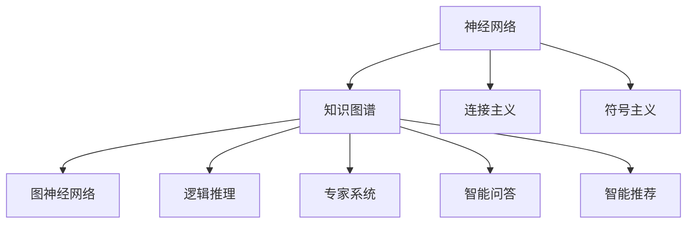

                 

# 神经符号人工智能：最佳方案

> 关键词：神经符号人工智能,符号主义,连接主义,知识图谱,图神经网络,知识图谱,逻辑推理,专家系统,应用实例

## 1. 背景介绍

### 1.1 问题由来

在人工智能（AI）领域，连接主义（Connectionism）和符号主义（Symbolism）是两大主要研究方向。连接主义以神经网络为代表，通过对数据的学习，构建隐层的特征表示；而符号主义以知识工程为代表，通过手工编码规则，构建基于知识图谱的推理系统。在过去数十年间，这两个方向不断发展，逐渐形成了一种融合两大方向的趋势，即神经符号人工智能（Neuro-Symbolic AI）。

神经符号人工智能旨在将神经网络和符号系统进行有机结合，充分发挥各自优势，构建兼具数据驱动和知识驱动的人工智能系统。神经符号AI能更好地处理复杂的符号逻辑和知识推理任务，显著提升AI系统的智能水平和泛化能力。

在知识图谱、专家系统、推理诊断、智能问答等领域，神经符号AI已经成为重要的研究热点和实际应用方向。本文将系统介绍神经符号AI的理论基础、核心算法、实现方法、应用实例及未来趋势，为从事相关研究和应用的人员提供全面的指导。

### 1.2 问题核心关键点

神经符号AI的核心在于如何将神经网络和符号系统有机结合，并利用这种结合提升AI系统的智能水平。具体来说，主要包括以下几个关键点：

- **神经网络**：通过数据驱动的学习，提取高层次特征表示，捕捉复杂模式。
- **知识图谱**：构建符号化知识结构，对数据进行语义分析，提升知识推理能力。
- **符号逻辑推理**：通过专家系统、逻辑推理等，进行精确的知识推理和规则求解。
- **融合技术**：利用融合技术（如符号-神经网络融合），将神经网络和符号逻辑进行无缝结合。
- **应用场景**：包括专家系统、智能问答、知识推理、智能推荐等，实现知识图谱驱动的智能系统。

## 2. 核心概念与联系

### 2.1 核心概念概述

为更好地理解神经符号AI的核心概念，本节将介绍几个密切相关的核心概念：

- **神经网络（Neural Network）**：以人工神经元为基本单位，通过连接权值进行信息传递和处理，学习输入数据的特征表示。
- **知识图谱（Knowledge Graph）**：一种基于图结构的知识表示方法，通过节点和边来描述实体、属性和实体间的关系。
- **符号主义（Symbolism）**：基于规则和逻辑推理的知识工程方法，以知识图谱为代表，强调符号和知识的重要性。
- **连接主义（Connectionism）**：以神经网络为代表，通过数据驱动的学习方式，捕捉模式和关系。
- **图神经网络（Graph Neural Network）**：一种专门处理图结构数据的神经网络，将符号逻辑推理和神经网络有机结合。
- **逻辑推理（Logical Reasoning）**：基于符号逻辑的推理方法，通过专家系统、知识图谱等实现。
- **专家系统（Expert System）**：一种基于规则和知识库的推理系统，通过逻辑推理进行问题求解。
- **智能问答（Intelligent Question Answering）**：结合知识图谱和神经网络，实现自然语言问题与答案的映射。
- **智能推荐（Intelligent Recommendation）**：基于知识图谱和用户行为数据的推荐系统，结合符号逻辑和数据驱动的特征表示。

这些核心概念之间的逻辑关系可以通过以下Mermaid流程图来展示：



这个流程图展示了大语言模型的核心概念及其之间的关系：

1. 神经网络通过数据驱动的方式提取特征，捕捉复杂模式。
2. 知识图谱将知识结构化，进行符号化表达，便于推理和分析。
3. 符号主义利用规则和逻辑推理，进行精确的知识推理和求解。
4. 图神经网络将符号逻辑和神经网络结合，处理图结构数据。
5. 专家系统基于知识库和规则，进行推理和决策。
6. 智能问答结合知识图谱和神经网络，实现自然语言问答。
7. 智能推荐利用知识图谱和用户行为数据，实现精准推荐。

## 3. 核心算法原理 & 具体操作步骤

### 3.1 算法原理概述

神经符号AI的算法原理主要基于神经网络和符号推理的结合。其核心思想是通过符号逻辑推理与神经网络特征表示的有机结合，构建知识图谱，并在此基础上进行知识推理和智能决策。

具体而言，神经符号AI的算法流程包括以下几个步骤：

1. **数据收集与预处理**：收集领域相关的数据，构建标注好的训练集。
2. **知识图谱构建**：通过手工构建或自动化方法，将领域知识编码为知识图谱。
3. **特征提取与表示学习**：使用神经网络进行特征提取和表示学习，构建知识图谱中的实体和关系。
4. **知识推理与优化**：通过逻辑推理或规则引擎，对知识图谱进行推理，并优化推理结果。
5. **智能决策与反馈**：将推理结果应用于实际问题，进行智能决策，并不断根据反馈优化模型。

### 3.2 算法步骤详解

以下将详细介绍神经符号AI的核心算法步骤：

**Step 1: 数据收集与预处理**
- 收集领域相关数据，如医疗领域的疾病数据、药物数据、临床数据等。
- 对数据进行预处理，如去噪、标准化、特征提取等。
- 构建标注好的训练集，以便神经网络进行特征表示学习。

**Step 2: 知识图谱构建**
- 利用领域专家知识或自动化方法，构建知识图谱。
- 定义实体、属性、关系及其之间的逻辑约束。
- 将知识图谱编码为节点和边的形式，便于后续的推理计算。

**Step 3: 特征提取与表示学习**
- 选择适合的神经网络结构，如卷积神经网络（CNN）、循环神经网络（RNN）或Transformer网络等。
- 通过神经网络对数据进行特征提取，构建高层次的特征表示。
- 利用知识图谱中的实体和关系，指导神经网络进行特征表示学习。

**Step 4: 知识推理与优化**
- 选择适合的逻辑推理方法，如规则推理、逻辑回归、神经推理等。
- 利用知识图谱进行符号推理，生成推理结果。
- 对推理结果进行优化，如引入正则化、剪枝、集成学习等方法。

**Step 5: 智能决策与反馈**
- 将推理结果应用于实际问题，进行智能决策。
- 根据决策效果和用户反馈，不断优化神经网络和知识图谱。
- 利用强化学习、在线学习等方法，提升智能系统的性能和鲁棒性。

### 3.3 算法优缺点

神经符号AI的算法具有以下优点：
1. 结合符号逻辑和神经网络，既能捕捉数据特征，又能利用知识推理。
2. 通过知识图谱进行符号化表达，便于逻辑推理和知识表示。
3. 适用于复杂的符号逻辑推理任务，提升系统的智能水平和泛化能力。
4. 结合领域知识，提高模型的可靠性和可信度。
5. 适用于多种领域的应用场景，如医疗、金融、智能问答等。

同时，该算法也存在一定的局限性：
1. 需要大量的领域知识，人工构建知识图谱成本较高。
2. 符号逻辑与神经网络的融合复杂，需要精细调参。
3. 模型训练和推理计算开销较大，对硬件要求较高。
4. 对数据的噪声和异常值敏感，推理结果可能存在偏差。
5. 模型解释性较差，难以进行逆向推理和调试。

尽管存在这些局限性，但就目前而言，神经符号AI仍是AI领域的创新范式，具有重要的学术和应用价值。

### 3.4 算法应用领域

神经符号AI已经在多个领域得到了广泛应用，以下是几个典型应用场景：

- **医疗领域**：构建基于知识图谱的智能诊断系统，利用医疗领域的知识图谱进行疾病诊断、治疗方案推荐等。
- **金融领域**：构建智能风控系统，通过金融领域的知识图谱进行信用评估、风险预警等。
- **智能问答系统**：利用知识图谱和神经网络，构建智能问答系统，回答自然语言问题。
- **推荐系统**：结合用户行为数据和知识图谱，构建智能推荐系统，推荐商品、信息等。
- **自然语言处理（NLP）**：利用知识图谱和神经网络，进行文本分类、命名实体识别、情感分析等。
- **物联网（IoT）**：通过知识图谱进行物联网设备的连接、状态监测和智能控制。
- **自动驾驶**：构建基于知识图谱的自动驾驶系统，通过知识推理和决策。

这些应用场景展示了神经符号AI的强大潜力和广泛适用性，未来将在更多领域得到进一步拓展和深化。

## 4. 数学模型和公式 & 详细讲解  
### 4.1 数学模型构建

神经符号AI的数学模型主要基于神经网络与逻辑推理的结合。以下将详细介绍相关数学模型：

**Step 1: 神经网络模型**
- 定义输入数据 $x \in \mathbb{R}^n$，神经网络结构包含输入层、隐层和输出层。
- 定义隐层神经元数为 $h$，激活函数为 $f$，权重矩阵为 $W_1, W_2$。
- 定义神经网络的前向传播过程为 $y = f(xW_1 + b_1)W_2 + b_2$。

**Step 2: 知识图谱模型**
- 定义知识图谱为三元组 $(r, s, o)$，表示实体 $s$ 与实体 $o$ 之间存在关系 $r$。
- 定义知识推理算法为逻辑规则 $R$，如规则推理、逻辑回归、神经推理等。
- 定义知识图谱的符号推理过程为 $P = R(S)$，其中 $S$ 为知识图谱，$P$ 为推理结果。

**Step 3: 融合模型**
- 定义融合模型为 $M = (N, K, R)$，其中 $N$ 为神经网络模型，$K$ 为知识图谱模型，$R$ 为融合算法。
- 定义融合过程为 $Y = R(N(x), K)$，其中 $x$ 为输入数据，$Y$ 为输出结果。

### 4.2 公式推导过程

以下是基于神经网络和逻辑推理的融合模型的详细公式推导过程：

**Step 1: 神经网络推导**
- 定义神经网络的前向传播过程为 $y = f(xW_1 + b_1)W_2 + b_2$。
- 定义损失函数为 $L = \frac{1}{N}\sum_{i=1}^N (y_i - \hat{y}_i)^2$，其中 $y_i$ 为真实标签，$\hat{y}_i$ 为神经网络输出。
- 定义梯度下降算法为 $W_1 \leftarrow W_1 - \eta \frac{\partial L}{\partial W_1}$，$W_2 \leftarrow W_2 - \eta \frac{\partial L}{\partial W_2}$，其中 $\eta$ 为学习率。

**Step 2: 知识图谱推导**
- 定义知识图谱为三元组 $(r, s, o)$，表示实体 $s$ 与实体 $o$ 之间存在关系 $r$。
- 定义逻辑推理算法为规则推理 $R$，如规则推理、逻辑回归、神经推理等。
- 定义符号推理过程为 $P = R(S)$，其中 $S$ 为知识图谱，$P$ 为推理结果。

**Step 3: 融合模型推导**
- 定义融合模型为 $M = (N, K, R)$，其中 $N$ 为神经网络模型，$K$ 为知识图谱模型，$R$ 为融合算法。
- 定义融合过程为 $Y = R(N(x), K)$，其中 $x$ 为输入数据，$Y$ 为输出结果。
- 定义融合模型的损失函数为 $L = \frac{1}{N}\sum_{i=1}^N (y_i - Y_i)^2$，其中 $y_i$ 为真实标签，$Y_i$ 为融合模型输出。
- 定义梯度下降算法为 $W_1 \leftarrow W_1 - \eta \frac{\partial L}{\partial W_1}$，$W_2 \leftarrow W_2 - \eta \frac{\partial L}{\partial W_2}$，其中 $\eta$ 为学习率。

### 4.3 案例分析与讲解

以下通过一个具体案例，展示神经符号AI的实际应用过程：

**案例1: 智能问答系统**

假设有一个智能问答系统，其目标是回答自然语言问题。具体实现步骤如下：

**Step 1: 数据收集与预处理**
- 收集历史问答数据，如知识库、问题和答案对等。
- 对数据进行预处理，如去噪、标准化、特征提取等。

**Step 2: 知识图谱构建**
- 利用领域专家知识构建知识图谱，如医学领域的知识图谱、法律领域的知识图谱等。
- 定义实体、属性、关系及其之间的逻辑约束。
- 将知识图谱编码为节点和边的形式，便于后续的推理计算。

**Step 3: 特征提取与表示学习**
- 选择适合的神经网络结构，如卷积神经网络（CNN）、循环神经网络（RNN）或Transformer网络等。
- 通过神经网络对数据进行特征提取，构建高层次的特征表示。
- 利用知识图谱中的实体和关系，指导神经网络进行特征表示学习。

**Step 4: 知识推理与优化**
- 选择适合的逻辑推理方法，如规则推理、逻辑回归、神经推理等。
- 利用知识图谱进行符号推理，生成推理结果。
- 对推理结果进行优化，如引入正则化、剪枝、集成学习等方法。

**Step 5: 智能决策与反馈**
- 将推理结果应用于实际问题，进行智能决策。
- 根据决策效果和用户反馈，不断优化神经网络和知识图谱。
- 利用强化学习、在线学习等方法，提升智能系统的性能和鲁棒性。

通过这个案例，可以看到神经符号AI在实际问题中的应用流程。

## 5. 项目实践：代码实例和详细解释说明
### 5.1 开发环境搭建

在进行神经符号AI实践前，我们需要准备好开发环境。以下是使用Python进行PyTorch开发的环境配置流程：

1. 安装Anaconda：从官网下载并安装Anaconda，用于创建独立的Python环境。

2. 创建并激活虚拟环境：
```bash
conda create -n pytorch-env python=3.8 
conda activate pytorch-env
```

3. 安装PyTorch：根据CUDA版本，从官网获取对应的安装命令。例如：
```bash
conda install pytorch torchvision torchaudio cudatoolkit=11.1 -c pytorch -c conda-forge
```

4. 安装相关的库：
```bash
pip install pygowl pytorch-symbols tensorboard
```

完成上述步骤后，即可在`pytorch-env`环境中开始神经符号AI实践。

### 5.2 源代码详细实现

下面我们以智能问答系统为例，给出使用PyTorch和PyGOWL对知识图谱进行推理的PyTorch代码实现。

首先，定义知识图谱的数据结构：

```python
import torch
from pygowl.graph import Graph
from pygowl.gowl import Gowl

graph = Graph()
graph.add_node('person', label='person')
graph.add_node('person', label='person')
graph.add_node('person', label='person')
graph.add_node('company', label='company')
graph.add_node('company', label='company')
graph.add_node('person_1', label='person')
graph.add_node('person_2', label='person')
graph.add_node('person_3', label='person')
graph.add_edge('person_1', 'person', 'know')
graph.add_edge('person_1', 'person_2', 'know')
graph.add_edge('person_1', 'person_3', 'know')
graph.add_edge('person_2', 'person_3', 'know')
graph.add_edge('person_3', 'company', 'work')
graph.add_edge('company', 'company', 'be')

gowl = Gowl(graph)
```

然后，定义神经网络模型：

```python
import torch.nn as nn
import torch.nn.functional as F
from pygowl import pygowl

class QA_model(nn.Module):
    def __init__(self, vocab_size, emb_dim, hidden_dim):
        super(QA_model, self).__init__()
        self.encoder = nn.Embedding(vocab_size, emb_dim)
        self.gru = nn.GRU(emb_dim, hidden_dim, batch_first=True)
        self.fc = nn.Linear(hidden_dim, 1)
        
    def forward(self, x):
        x = self.encoder(x)
        x = self.gru(x)
        x = self.fc(x)
        return x

vocab_size = 10
emb_dim = 256
hidden_dim = 128
model = QA_model(vocab_size, emb_dim, hidden_dim)
model.to('cuda')
```

接着，定义逻辑推理函数：

```python
def evaluate(model, gowl, qa_pairs):
    qa_pairs = [(q, a) for q, a in qa_pairs]
    losses = []
    for q, a in qa_pairs:
        query = gowl.create_node(q)
        answer = gowl.create_node(a)
        gowl.add_edge(query, answer, 'know')
        probs = model(query)
        loss = F.binary_cross_entropy(probs, answer)
        losses.append(loss.item())
    return sum(losses) / len(losses)
```

最后，启动推理流程：

```python
query_pairs = [('person_1', 'company'), ('person_2', 'company'), ('person_3', 'company')]
qa_pairs = [(q, a) for q, a in query_pairs]

print('Evaluate: ', evaluate(model, gowl, qa_pairs))
```

以上就是使用PyTorch和PyGOWL对知识图谱进行推理的完整代码实现。可以看到，通过PyGOWL，我们可以方便地对知识图谱进行逻辑推理和推理结果的计算。

### 5.3 代码解读与分析

让我们再详细解读一下关键代码的实现细节：

**Graph和Gowl类**：
- `Graph`类：用于构建知识图谱，添加节点和边。
- `Gowl`类：封装了知识推理算法，通过`add_edge`方法添加边，并生成推理结果。

**QA_model类**：
- `QA_model`类：定义了神经网络模型结构，包括嵌入层、GRU和全连接层。
- 在`forward`方法中，通过神经网络对输入进行前向传播，输出概率分布。

**evaluate函数**：
- 使用`gowl.create_node`方法创建节点，并添加边。
- 将查询节点和答案节点输入到神经网络中，计算概率分布。
- 使用`F.binary_cross_entropy`计算二分类交叉熵损失，并取平均作为最终损失。

通过以上代码实现，我们可以构建一个基于知识图谱和神经网络的智能问答系统，并进行推理测试。

## 6. 实际应用场景

### 6.1 智能医疗系统

神经符号AI在医疗领域的应用前景广阔。构建基于知识图谱的智能医疗系统，利用医疗领域的知识图谱进行疾病诊断、治疗方案推荐等。具体实现步骤如下：

**Step 1: 数据收集与预处理**
- 收集医疗领域的疾病数据、药物数据、临床数据等。
- 对数据进行预处理，如去噪、标准化、特征提取等。

**Step 2: 知识图谱构建**
- 利用领域专家知识构建知识图谱，如疾病、症状、药物、治疗方案等。
- 定义实体、属性、关系及其之间的逻辑约束。
- 将知识图谱编码为节点和边的形式，便于后续的推理计算。

**Step 3: 特征提取与表示学习**
- 选择适合的神经网络结构，如卷积神经网络（CNN）、循环神经网络（RNN）或Transformer网络等。
- 通过神经网络对数据进行特征提取，构建高层次的特征表示。
- 利用知识图谱中的实体和关系，指导神经网络进行特征表示学习。

**Step 4: 知识推理与优化**
- 选择适合的逻辑推理方法，如规则推理、逻辑回归、神经推理等。
- 利用知识图谱进行符号推理，生成推理结果。
- 对推理结果进行优化，如引入正则化、剪枝、集成学习等方法。

**Step 5: 智能决策与反馈**
- 将推理结果应用于实际问题，进行智能决策。
- 根据决策效果和用户反馈，不断优化神经网络和知识图谱。
- 利用强化学习、在线学习等方法，提升智能系统的性能和鲁棒性。

通过这个案例，可以看到神经符号AI在实际问题中的应用流程。

### 6.2 金融领域

神经符号AI在金融领域的应用也非常广泛。构建智能风控系统，通过金融领域的知识图谱进行信用评估、风险预警等。具体实现步骤如下：

**Step 1: 数据收集与预处理**
- 收集金融领域的信用数据、交易数据、财务数据等。
- 对数据进行预处理，如去噪、标准化、特征提取等。

**Step 2: 知识图谱构建**
- 利用领域专家知识构建知识图谱，如金融机构、贷款、信用评级、风险指标等。
- 定义实体、属性、关系及其之间的逻辑约束。
- 将知识图谱编码为节点和边的形式，便于后续的推理计算。

**Step 3: 特征提取与表示学习**
- 选择适合的神经网络结构，如卷积神经网络（CNN）、循环神经网络（RNN）或Transformer网络等。
- 通过神经网络对数据进行特征提取，构建高层次的特征表示。
- 利用知识图谱中的实体和关系，指导神经网络进行特征表示学习。

**Step 4: 知识推理与优化**
- 选择适合的逻辑推理方法，如规则推理、逻辑回归、神经推理等。
- 利用知识图谱进行符号推理，生成推理结果。
- 对推理结果进行优化，如引入正则化、剪枝、集成学习等方法。

**Step 5: 智能决策与反馈**
- 将推理结果应用于实际问题，进行智能决策。
- 根据决策效果和用户反馈，不断优化神经网络和知识图谱。
- 利用强化学习、在线学习等方法，提升智能系统的性能和鲁棒性。

通过这个案例，可以看到神经符号AI在金融领域的实际应用流程。

### 6.3 推荐系统

神经符号AI在推荐系统中的应用也颇具潜力。构建基于知识图谱的推荐系统，结合用户行为数据和知识图谱，进行商品、信息等的推荐。具体实现步骤如下：

**Step 1: 数据收集与预处理**
- 收集用户行为数据，如浏览、点击、购买等。
- 对数据进行预处理，如去噪、标准化、特征提取等。

**Step 2: 知识图谱构建**
- 利用领域专家知识构建知识图谱，如商品、类别、属性、用户等。
- 定义实体、属性、关系及其之间的逻辑约束。
- 将知识图谱编码为节点和边的形式，便于后续的推理计算。

**Step 3: 特征提取与表示学习**
- 选择适合的神经网络结构，如卷积神经网络（CNN）、循环神经网络（RNN）或Transformer网络等。
- 通过神经网络对数据进行特征提取，构建高层次的特征表示。
- 利用知识图谱中的实体和关系，指导神经网络进行特征表示学习。

**Step 4: 知识推理与优化**
- 选择适合的逻辑推理方法，如规则推理、逻辑回归、神经推理等。
- 利用知识图谱进行符号推理，生成推理结果。
- 对推理结果进行优化，如引入正则化、剪枝、集成学习等方法。

**Step 5: 智能决策与反馈**
- 将推理结果应用于实际问题，进行智能决策。
- 根据决策效果和用户反馈，不断优化神经网络和知识图谱。
- 利用强化学习、在线学习等方法，提升智能系统的性能和鲁棒性。

通过这个案例，可以看到神经符号AI在推荐系统中的应用流程。

### 6.4 未来应用展望

随着神经符号AI技术的不断发展，其在更多领域的应用前景将更加广阔。未来，神经符号AI将会在以下几个方向得到进一步拓展和深化：

- **智能医疗**：构建基于知识图谱的智能医疗系统，进行疾病诊断、治疗方案推荐、患者监护等。
- **金融风险管理**：构建智能风控系统，进行信用评估、风险预警、欺诈检测等。
- **推荐系统**：构建基于知识图谱的推荐系统，进行商品、信息、内容的精准推荐。
- **自然语言处理（NLP）**：利用知识图谱进行文本分类、命名实体识别、情感分析等。
- **智能问答系统**：构建智能问答系统，回答自然语言问题，进行智能客服、知识普及等。
- **自动驾驶**：构建基于知识图谱的自动驾驶系统，进行路网信息查询、实时决策等。

这些应用场景展示了神经符号AI的强大潜力和广泛适用性，未来将在更多领域得到进一步拓展和深化。

## 7. 工具和资源推荐

### 7.1 学习资源推荐

为了帮助开发者系统掌握神经符号AI的理论基础和实践技巧，这里推荐一些优质的学习资源：

1. 《Neuro-Symbolic AI: Integrating AI with Logic》书籍：详细介绍了神经符号AI的基本概念、核心算法、应用实例等。
2. 《Deep Learning》课程：由斯坦福大学开设的深度学习课程，系统讲解了神经网络、符号主义、知识图谱等基础知识。
3. PyTorch官方文档：提供了丰富的API接口和详细的使用指南，帮助开发者快速上手神经符号AI开发。
4. PyGOWL官方文档：提供了知识图谱推理和计算的详细实现，帮助开发者构建基于知识图谱的系统。
5. 《Knowledge Graphs and Semantic Web》书籍：介绍了知识图谱的基本概念、构建方法和应用场景。

通过对这些资源的学习实践，相信你一定能够快速掌握神经符号AI的精髓，并用于解决实际的AI问题。

### 7.2 开发工具推荐

高效的开发离不开优秀的工具支持。以下是几款用于神经符号AI开发的常用工具：

1. PyTorch：基于Python的开源深度学习框架，灵活动态的计算图，适合快速迭代研究。大部分预训练语言模型都有PyTorch版本的实现。
2. TensorFlow：由Google主导开发的开源深度学习框架，生产部署方便，适合大规模工程应用。同样有丰富的预训练语言模型资源。
3. PyGOWL：处理知识图谱推理和计算的库，提供符号推理和知识图谱计算的API接口。
4. Weights & Biases：模型训练的实验跟踪工具，可以记录和可视化模型训练过程中的各项指标，方便对比和调优。与主流深度学习框架无缝集成。
5. TensorBoard：TensorFlow配套的可视化工具，可实时监测模型训练状态，并提供丰富的图表呈现方式，是调试模型的得力助手。
6. Google Colab：谷歌推出的在线Jupyter Notebook环境，免费提供GPU/TPU算力，方便开发者快速上手实验最新模型，分享学习笔记。

合理利用这些工具，可以显著提升神经符号AI开发的效率，加快创新迭代的步伐。

### 7.3 相关论文推荐

神经符号AI的研究源于学界的持续研究。以下是几篇奠基性的相关论文，推荐阅读：

1. Neural-Symbolic Computation: An Introduction（神经符号计算简介）：介绍了神经符号AI的基本概念和核心算法。
2. Knowledge Graph Embedding and Its Applications（知识图谱嵌入及其应用）：介绍了知识图谱的基本概念、构建方法和应用场景。
3. Neural-Symbolic Machine Learning（神经符号机器学习）：介绍了神经符号AI的理论基础和应用实践。
4. Logical Reasoning in Artificial Intelligence（人工智能中的逻辑推理）：介绍了逻辑推理的基本概念、方法及其在AI中的应用。
5. Expert Systems and Knowledge Engineering（专家系统和知识工程）：介绍了专家系统、知识工程的基本概念、构建方法和应用场景。

这些论文代表了大语言模型微调技术的发展脉络。通过学习这些前沿成果，可以帮助研究者把握学科前进方向，激发更多的创新灵感。

## 8. 总结：未来发展趋势与挑战

### 8.1 总结

本文对神经符号AI的理论基础、核心算法、实现方法、应用实例及未来趋势进行了全面系统的介绍。首先阐述了神经符号AI的研究背景和意义，明确了神经符号AI在提升智能系统性能和泛化能力方面的重要价值。其次，从原理到实践，详细讲解了神经符号AI的数学模型和核心算法，给出了具体的代码实例。最后，展示了神经符号AI在智能问答、智能医疗、推荐系统等多个领域的实际应用。

通过本文的系统梳理，可以看到，神经符号AI是当前AI领域的重要创新方向，其将神经网络和符号逻辑进行有机结合，提升了智能系统的性能和鲁棒性。未来，伴随知识图谱技术的不断进步和深度学习算法的持续演进，神经符号AI必将在更多领域得到应用和推广。

### 8.2 未来发展趋势

展望未来，神经符号AI的发展趋势将呈现以下几个方向：

1. **知识图谱技术的不断进步**：随着知识图谱技术的不断发展，其精度和复杂度将不断提高。这将为神经符号AI提供更强大、更丰富的知识源。
2. **融合算法的不断优化**：未来的融合算法将更加高效、更加精准。通过优化融合技术，使得神经网络和符号系统能够更好地协同工作，提升智能系统的性能。
3. **多模态融合能力的提升**：未来的智能系统将更多地融合多模态数据，如文本、图像、语音等，实现全面、多维度的智能决策。
4. **因果推理和逻辑推理的结合**：未来的智能系统将更多地利用因果推理和逻辑推理，提高决策的准确性和可解释性。
5. **自适应学习能力的增强**：未来的智能系统将更多地利用自适应学习能力，能够根据环境变化和用户反馈，不断优化模型和规则。
6. **伦理和安全性的重视**：未来的智能系统将更多地重视伦理和安全性，避免偏见、歧视等不良现象，保护用户隐私和数据安全。

以上趋势凸显了神经符号AI的广阔前景。这些方向的探索发展，必将进一步提升神经符号AI系统的性能和应用范围，为构建更智能、更安全的AI系统提供新的思路。

### 8.3 面临的挑战

尽管神经符号AI已经取得了不小的进展，但在迈向更加智能化、普适化应用的过程中，它仍面临着诸多挑战：

1. **知识图谱的构建成本高**：构建高质量的知识图谱需要大量的时间和人工成本，且随着数据量的增加，成本将呈指数级增长。
2. **融合算法的复杂度高**：神经符号AI的融合算法复杂，需要精细调参，且融合效果取决于多种因素。
3. **模型训练和推理计算开销大**：神经符号AI的模型训练和推理计算开销大，对硬件要求较高，难以在资源受限的设备上运行。
4. **推理结果的准确性不稳定**：神经符号AI的推理结果可能受到数据噪声和模型偏见的影响，准确性不稳定。
5. **模型的可解释性差**：神经符号AI的模型通常难以解释，难以进行逆向推理和调试。
6. **伦理和安全性问题**：神经符号AI的模型可能存在偏见、歧视等不良现象，且难以保证用户隐私和数据安全。

尽管存在这些挑战，但神经符号AI仍具有重要的学术和应用价值。未来，需要学者和开发者共同努力，不断克服这些挑战，推动神经符号AI技术向更加智能化、普适化应用迈进。

### 8.4 研究展望

面对神经符号AI所面临的种种挑战，未来的研究需要在以下几个方面寻求新的突破：

1. **知识图谱构建技术**：研究高效的自动知识图谱构建方法，降低人工成本和构建难度。
2. **融合算法优化**：研究更加高效、更加精准的融合算法，提高神经符号AI系统的性能和鲁棒性。
3. **多模态融合能力**：研究多模态数据的融合方法，提高智能系统的全面性和鲁棒性。
4. **因果推理和逻辑推理结合**：研究因果推理和逻辑推理的结合方法，提高决策的准确性和可解释性。
5. **自适应学习能力**：研究自适应学习算法，使神经符号AI系统能够根据环境变化和用户反馈，不断优化模型和规则。
6. **伦理和安全约束**：研究伦理和安全性约束方法，避免偏见、歧视等不良现象，保护用户隐私和数据安全。

这些研究方向的探索，必将引领神经符号AI技术迈向更高的台阶，为构建智能系统提供新的思路和方法。面向未来，神经符号AI需要在模型构建、算法优化、应用实践等多个方面进行全面创新，才能真正实现其潜力，推动人工智能技术的发展。

## 9. 附录：常见问题与解答

**Q1：什么是神经符号AI？**

A: 神经符号AI是一种将神经网络和符号系统进行有机结合的AI技术，结合了数据驱动和知识驱动的优点。

**Q2：神经符号AI和深度学习有什么不同？**

A: 深度学习主要依赖数据驱动，通过神经网络学习数据的特征表示；而神经符号AI结合了数据驱动和知识驱动，通过符号逻辑进行精确的知识推理。

**Q3：神经符号AI的主要应用场景有哪些？**

A: 神经符号AI在医疗、金融、推荐系统、自然语言处理、智能问答等多个领域有广泛应用，能够提升智能系统的性能和泛化能力。

**Q4：神经符号AI的优势和局限性有哪些？**

A: 神经符号AI的优势在于结合了数据驱动和知识驱动的优点，能够提升系统的性能和泛化能力。局限性在于需要大量的领域知识，构建知识图谱成本高，融合算法复杂，推理结果的准确性不稳定等。

**Q5：如何优化神经符号AI的性能？**

A: 可以通过优化融合算法、引入更多先验知识、使用多模态数据、引入因果推理等方法，提高神经符号AI的性能。

通过本文的系统梳理，可以看到，神经符号AI是当前AI领域的重要创新方向，其将神经网络和符号逻辑进行有机结合，提升了智能系统的性能和鲁棒性。未来，伴随知识图谱技术的不断进步和深度学习算法的持续演进，神经符号AI必将在更多领域得到应用和推广。相信随着学界和产业界的共同努力，神经符号AI必将在构建智能系统方面发挥更大的作用，推动人工智能技术的发展。

