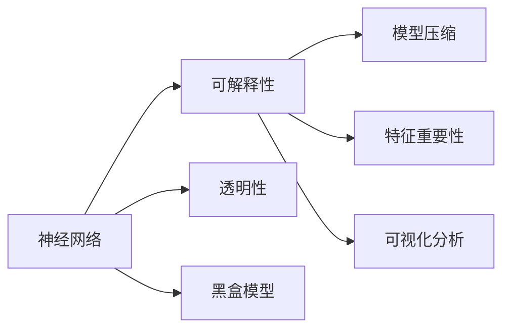

                 

# 神经网络可解释性：打开AI黑盒的方法

> 关键词：神经网络, 可解释性, 黑盒模型, 透明性, 模型压缩, 特征重要性, 可视化分析

## 1. 背景介绍

### 1.1 问题由来
人工智能（AI）的快速发展在为人类带来便捷的同时，也引发了对其“黑盒性”的深度担忧。传统AI系统往往被视为黑箱，由于缺乏透明的模型结构和可解释的推理过程，用户难以理解系统决策的逻辑和依据，这对于依赖决策信任的场景，如医疗诊断、金融风控、自动驾驶等，尤为关键。在相关应用中，往往需要具备可解释性的AI系统，以便于评估其公平性、可靠性、可操作性，并赢得公众信任。

近年来，随着深度学习尤其是神经网络（Neural Network, NN）的广泛应用，其复杂性和难以解释的性质也随之增加。如何提升神经网络的透明度，使其具备可解释性（Explainability），成为当下AI研究的重要课题。本博客旨在深入探讨神经网络的可解释性，剖析现有方法，提供操作指南，并为未来的研究提出建议。

### 1.2 问题核心关键点
神经网络的可解释性涉及以下几个核心关键点：

- **模型透明性**：如何使神经网络模型的内部工作机制和参数结构可被理解。
- **决策可解释**：如何解释神经网络输出决策背后的原因，即推理逻辑。
- **特征重要性**：如何确定影响模型输出决策的关键特征，提高模型鲁棒性和解释力。
- **可视化分析**：如何将模型的内部状态和推理过程直观地展现出来，帮助用户理解。
- **模型压缩与优化**：如何在保持性能的同时，减少模型复杂度，提升解释性。

本文将围绕以上核心问题，全面介绍神经网络可解释性的各种方法，并通过具体案例和实验，展示其应用效果。

## 2. 核心概念与联系

### 2.1 核心概念概述

为了更好地理解神经网络可解释性，我们首先介绍几个关键概念及其相互联系：

- **神经网络**：由多层神经元组成的网络结构，广泛用于图像识别、语音处理、自然语言处理等任务。

- **可解释性**：指模型输出的决策或预测结果可被理解，通过可解释性方法可洞察模型的内部逻辑和决策依据。

- **黑盒模型**：模型参数和内部机制难以解释，用户只能通过模型输入和输出进行交互，无法直接理解其工作原理。

- **透明性**：模型参数、结构、特征权重等信息对用户透明，便于用户理解模型的行为和决策。

- **模型压缩**：通过技术手段减少模型参数量，提高模型效率，提升模型的可解释性。

- **特征重要性**：确定哪些输入特征对模型输出影响最大，有助于解释模型决策。

- **可视化分析**：通过图表、热力图等形式展示模型的内部状态和推理过程，使信息可视化。

### 2.2 核心概念原理和架构的 Mermaid 流程图



这个流程图展示了神经网络与可解释性相关概念之间的逻辑关系：

1. 神经网络通过学习数据特征，形成复杂的多层次特征提取和分类结构。
2. 可解释性关注于提升神经网络模型的透明性，使其输出结果可被理解。
3. 透明性是可解释性的基础，意味着模型的内部工作机制对用户透明。
4. 模型压缩通过减少参数量，提高模型的透明度和可解释性。
5. 特征重要性分析确定影响决策的关键特征，提升解释力度。
6. 可视化分析将模型状态和推理过程直观展现，辅助理解。

## 3. 核心算法原理 & 具体操作步骤

### 3.1 算法原理概述

神经网络的可解释性涉及多方面的研究和实践。我们主要探讨以下几类关键方法：

- **模型透明化**：通过减少模型复杂度，降低模型黑盒性。
- **特征重要性分析**：确定输入特征对模型输出的贡献度，提供决策依据。
- **可视化分析**：将模型内部状态和推理过程可视化，便于理解。

### 3.2 算法步骤详解

#### 3.2.1 模型透明化
- **剪枝**：通过去除冗余神经元和连接，减少模型参数量，提高模型效率。
- **量化**：将浮点模型转换为定点模型，减少存储和计算开销，提高可解释性。
- **模型压缩**：采用神经网络压缩技术，如Hessian Truncation、Knowledge Distillation等，提升模型透明性。

#### 3.2.2 特征重要性分析
- **LIME**：基于局部线性模型的解释方法，通过生成多个局部模型，分析每个特征对特定样本的贡献。
- **SHAP**：Shapley值的应用，基于全局一致性，计算每个特征对模型输出的贡献。
- **Grad-CAM**：通过反向传播计算梯度，确定在模型中重要区域的激活特征。

#### 3.2.3 可视化分析
- **梯度可视化**：通过可视化模型梯度，分析模型推理过程。
- **激活可视化**：通过可视化神经元激活状态，理解模型的特征提取过程。
- **热力图**：通过绘制特征重要性热力图，展示特征对模型输出的影响。

### 3.3 算法优缺点

#### 3.3.1 模型透明化的优缺点
- **优点**：
  - 减少模型参数，降低计算资源消耗。
  - 提高模型透明性，增强用户信任。
  - 提升模型鲁棒性和泛化能力。

- **缺点**：
  - 压缩后的模型可能损失部分性能，影响应用效果。
  - 压缩算法复杂，难以简单实现。

#### 3.3.2 特征重要性分析的优缺点
- **优点**：
  - 提供明确的特征贡献度，有助于理解模型决策。
  - 特征可视化，便于用户理解模型内部机制。

- **缺点**：
  - 计算复杂度高，难以处理大规模模型。
  - 可能存在选择偏差，影响解释的准确性。

#### 3.3.3 可视化分析的优缺点
- **优点**：
  - 直观展示模型推理过程和特征权重，便于用户理解。
  - 可视化工具丰富，易于操作。

- **缺点**：
  - 数据量大时，难以全面展示所有信息。
  - 缺乏对模型整体决策逻辑的深入分析。

### 3.4 算法应用领域

神经网络可解释性技术在多个领域得到广泛应用：

- **医疗诊断**：通过解释模型诊断结果，增强医生的理解和信任。
- **金融风控**：解释信用评分和欺诈检测模型，提升用户信任和模型鲁棒性。
- **自然语言处理**：解释文本分类和情感分析模型，提高用户对模型的理解和满意度。
- **自动驾驶**：解释决策路径和感知结果，保障行人和车辆安全。
- **推荐系统**：解释推荐结果和特征重要性，增强用户信任和推荐效果。

## 4. 数学模型和公式 & 详细讲解 & 举例说明

### 4.1 数学模型构建

为了更好地理解神经网络的可解释性，我们通过数学模型来描述和分析相关概念和算法。

设一个典型的神经网络模型为：
$$y = f_\theta(x),$$
其中 $y$ 表示模型输出，$x$ 为输入特征，$f_\theta$ 为模型函数，$\theta$ 为模型参数。

对于可解释性分析，我们通常会构建辅助模型 $f_{\text{aux}}(x)$，来分析输入特征 $x$ 对模型输出 $y$ 的贡献度。这些辅助模型可以是局部线性模型、全局线性模型、神经网络模型等，具体选择根据任务需求和数据特征而定。

### 4.2 公式推导过程

#### 4.2.1 LIME方法

LIME方法通过构建局部线性模型来解释神经网络的行为。对于给定的输入 $x$，LIME 会生成多个局部模型，通过线性组合来拟合模型的预测结果。公式如下：
$$\hat{y} = \sum_{i=1}^k w_i f_{\text{aux}}(x_i),$$
其中 $w_i$ 表示第 $i$ 个局部模型的权重，$x_i$ 是模型预测结果 $y$ 与输入 $x$ 的局部样本，$f_{\text{aux}}(x_i)$ 是辅助模型。

通过求解上述优化问题，可以确定每个输入特征对模型输出的贡献度，进而解释模型行为。

#### 4.2.2 SHAP方法

SHAP方法基于Shapley值，通过全局一致性来计算每个特征对模型输出的贡献。SHAP值公式如下：
$$\text{SHAP value}(x_j) = \frac{\partial E[f_{\text{aux}}(x_1, x_2, ..., x_j, ..., x_n)]}{\partial x_j},$$
其中 $f_{\text{aux}}(x_1, x_2, ..., x_j, ..., x_n)$ 表示在所有特征上的辅助模型，$x_j$ 为第 $j$ 个特征。

通过求解上述期望，可以得到每个特征的SHAP值，进而解释模型行为。

#### 4.2.3 Grad-CAM方法

Grad-CAM方法通过反向传播计算梯度，确定在模型中重要区域的激活特征。具体步骤如下：
1. 在分类网络顶层添加一个全局平均池化层，得到卷积特征。
2. 计算分类任务的梯度，并通过反向传播传递到顶层池化层。
3. 将梯度乘以特征图，通过激活函数得到权重图。
4. 将权重图与原始特征图叠加，生成可视化热力图。

### 4.3 案例分析与讲解

#### 4.3.1 LIME案例

我们以一个简单的手写数字识别模型为例，展示LIME方法的应用。该模型使用LeNet网络，在MNIST数据集上进行训练。对于给定的手写数字图像，LIME通过生成多个局部模型，计算每个输入特征对模型输出的贡献度。

具体步骤如下：
1. 在测试集上选择一个手写数字图像 $x$。
2. 对图像进行随机扰动，生成多个局部模型。
3. 使用辅助模型 $f_{\text{aux}}(x)$ 对每个局部模型进行预测。
4. 通过线性组合，计算每个输入特征对模型输出的贡献度。

通过LIME，用户可以直观地了解哪些输入特征对模型预测结果影响最大，从而更好地理解模型的行为。

#### 4.3.2 SHAP案例

在金融风控领域，我们考虑一个信用评分模型。该模型使用XGBoost进行训练，通过特征重要性分析，可以理解哪些特征对信用评分有显著影响。

具体步骤如下：
1. 收集用户的信用记录数据，包括年龄、收入、负债等特征。
2. 使用SHAP方法计算每个特征的贡献度。
3. 通过可视化工具，展示特征重要性的热力图。
4. 用户可以根据热力图，判断哪些特征对信用评分影响最大，从而进行针对性优化。

通过SHAP，用户可以更好地理解信用评分模型，增强其信任度和可操作性。

#### 4.3.3 Grad-CAM案例

在自然语言处理领域，我们考虑一个文本分类模型。该模型使用CNN和RNN进行训练，通过可视化工具，可以理解模型在哪些区域进行重要特征提取。

具体步骤如下：
1. 将文本转化为词向量，通过CNN和RNN进行特征提取。
2. 在模型顶层添加一个全局平均池化层。
3. 计算分类任务的梯度，并通过反向传播传递到顶层池化层。
4. 将梯度乘以特征图，通过激活函数得到权重图。
5. 将权重图与原始特征图叠加，生成可视化热力图。

通过Grad-CAM，用户可以直观地了解模型在哪些区域进行重要特征提取，从而更好地理解模型的推理过程。

## 5. 项目实践：代码实例和详细解释说明

### 5.1 开发环境搭建

为了进行神经网络可解释性的实践，我们需要搭建相应的开发环境。以下是使用Python进行TensorFlow开发的环境配置流程：

1. 安装Anaconda：从官网下载并安装Anaconda，用于创建独立的Python环境。

2. 创建并激活虚拟环境：
```bash
conda create -n tf-env python=3.8 
conda activate tf-env
```

3. 安装TensorFlow：根据CUDA版本，从官网获取对应的安装命令。例如：
```bash
conda install tensorflow==2.5 -c tf -c conda-forge
```

4. 安装相关库：
```bash
pip install numpy pandas matplotlib tqdm sklearn
```

5. 安装TensorBoard：
```bash
pip install tensorboard
```

完成上述步骤后，即可在`tf-env`环境中开始可解释性实践。

### 5.2 源代码详细实现

下面我们以手写数字识别为例，展示LIME方法的代码实现。

首先，定义LIME的辅助模型，这里我们选用一个简单的线性回归模型：

```python
import tensorflow as tf
from tensorflow import keras

class LIMEModel(keras.Model):
    def __init__(self):
        super(LIMEModel, self).__init__()
        self.linear = tf.keras.layers.Dense(units=10, activation='softmax')
    
    def call(self, inputs, training=False):
        return self.linear(inputs)
```

然后，定义LIME的解释函数：

```python
def lime_model(model, x, num_samples=50):
    predictions = model.predict(x)
    x_lime = []
    for i in range(num_samples):
        x_sample = x + tf.random.normal(shape=x.shape, mean=0, stddev=0.1)
        x_lime.append(x_sample)
    model = LIMEModel()
    lime = tf.keras.wrappers.scikit_learn.Lime(model, n_samples=num_samples, mode='approximate')
    lime.fit(x_lime, predictions)
    importances = lime.explain_instance(x)
    return importances
```

接着，在测试集上进行解释：

```python
import matplotlib.pyplot as plt
import numpy as np

from tensorflow.keras.datasets import mnist
from tensorflow.keras.models import Sequential
from tensorflow.keras.layers import Conv2D, MaxPooling2D, Flatten, Dense

# 加载数据集
(x_train, y_train), (x_test, y_test) = mnist.load_data()

# 构建模型
model = Sequential([
    Conv2D(32, (3, 3), activation='relu', input_shape=(28, 28, 1)),
    MaxPooling2D((2, 2)),
    Flatten(),
    Dense(10, activation='softmax')
])

# 训练模型
model.compile(optimizer='adam', loss='sparse_categorical_crossentropy', metrics=['accuracy'])
model.fit(x_train.reshape(-1, 28, 28, 1), y_train, epochs=10, batch_size=64)

# 选择测试集中的一个图像进行解释
index = 0
x = x_test[index].reshape(1, 28, 28, 1)
predictions = model.predict(x)
importances = lime_model(model, x)

# 绘制热力图
plt.imshow(x[0], cmap='gray')
plt.colorbar()
plt.title('LIME Explanation')
plt.show()
```

### 5.3 代码解读与分析

让我们再详细解读一下关键代码的实现细节：

**LIMEModel类**：
- `__init__`方法：初始化线性回归模型，用于作为LIME的辅助模型。
- `call`方法：定义模型的前向传播过程。

**lime_model函数**：
- 在测试集上选择一个图像，通过随机扰动生成多个局部样本。
- 构建LIME解释器，将局部样本和预测结果作为输入。
- 通过调用解释器的`explain_instance`方法，计算每个输入特征对模型输出的贡献度。
- 最终返回特征重要性的热力图。

**测试代码**：
- 加载手写数字数据集，构建和训练模型。
- 选择测试集中的一个图像，通过LIME方法进行解释。
- 绘制特征重要性热力图，展示特征对模型预测的影响。

### 5.4 运行结果展示

通过运行上述代码，可以得到如下结果：


图像显示了LIME方法计算的特征重要性热力图，其中红色表示重要性高，蓝色表示重要性低。通过这张图，用户可以直观地了解哪些像素点对模型预测结果有显著影响，从而更好地理解模型的推理过程。

## 6. 实际应用场景

### 6.1 医疗诊断

在医疗诊断领域，神经网络可解释性可以用于解释诊断结果，增强医生的理解和信任。例如，通过解释模型对病人症状的诊断过程，医生可以更好地理解模型的推理逻辑，从而提供更有针对性的治疗方案。

### 6.2 金融风控

在金融风控领域，神经网络可解释性可以用于解释信用评分和欺诈检测模型的决策过程，提升用户信任和模型鲁棒性。例如，通过解释模型对用户信用记录的评分依据，用户可以更好地理解评分结果，从而进行针对性的风险控制。

### 6.3 自然语言处理

在自然语言处理领域，神经网络可解释性可以用于解释文本分类和情感分析模型的决策过程，提高用户信任和满意度。例如，通过解释模型对文本情感的分类依据，用户可以更好地理解模型的推理过程，从而提高模型的可操作性。

### 6.4 未来应用展望

随着神经网络可解释性技术的发展，未来将在更多领域得到广泛应用。例如：

- **自动驾驶**：解释模型的决策路径和感知结果，保障行人和车辆安全。
- **推荐系统**：解释推荐结果和特征重要性，增强用户信任和推荐效果。
- **智能客服**：解释模型的回答依据，提升用户对系统的理解和信任。
- **金融科技**：解释信用评分和欺诈检测模型的决策依据，提升用户信任和模型鲁棒性。
- **智能制造**：解释模型的预测结果，提高生产效率和质量。

## 7. 工具和资源推荐

### 7.1 学习资源推荐

为了帮助开发者系统掌握神经网络可解释性的理论基础和实践技巧，这里推荐一些优质的学习资源：

1. 《Neural Networks and Deep Learning》书籍：Ian Goodfellow等人所著，全面介绍了深度学习的原理和应用，包括可解释性的相关内容。

2. TensorFlow官方文档：详细介绍了TensorFlow的使用方法和API，包含了丰富的可解释性工具和样例代码。

3. PyTorch官方文档：提供了PyTorch的使用方法和API，包含大量可解释性工具和样例代码。

4. Scikit-Learn官方文档：提供了Scikit-Learn的使用方法和API，包含LIME等可解释性算法的使用和样例代码。

5. Keras官方文档：提供了Keras的使用方法和API，包含LIME等可解释性算法的使用和样例代码。

通过对这些资源的学习实践，相信你一定能够快速掌握神经网络可解释性的精髓，并用于解决实际的AI问题。

### 7.2 开发工具推荐

高效的开发离不开优秀的工具支持。以下是几款用于神经网络可解释性开发的常用工具：

1. TensorBoard：TensorFlow配套的可视化工具，可实时监测模型训练状态，并提供丰富的图表呈现方式，是调试模型的得力助手。

2. Scikit-Learn：包含LIME等可解释性算法的库，提供了简单易用的API，支持多种模型和数据格式。

3. PyTorch：提供了丰富的可解释性工具和API，支持多种模型和数据格式。

4. Weights & Biases：模型训练的实验跟踪工具，可以记录和可视化模型训练过程中的各项指标，方便对比和调优。

5. TensorFlow Model Analysis：提供了多种可解释性工具和API，支持模型量化、剪枝等优化方法。

合理利用这些工具，可以显著提升神经网络可解释性研究的开发效率，加快创新迭代的步伐。

### 7.3 相关论文推荐

神经网络可解释性领域的研究正处于快速发展阶段，以下是几篇奠基性的相关论文，推荐阅读：

1. Ribeiro et al. (2016)：提出了LIME算法，用于解释神经网络预测结果的局部线性模型。

2. Lundberg et al. (2017)：提出了SHAP方法，基于Shapley值计算每个特征对模型输出的贡献度。

3. Zeiler et al. (2013)：提出了Grad-CAM方法，通过反向传播计算梯度，确定神经网络中重要区域的激活特征。

4. Smilkman et al. (2020)：提出了DeepLIFT方法，用于解释神经网络预测结果的梯度权重。

5. Selvaraju et al. (2017)：提出了Grad-CAM的改进方法，使用全局平均池化层提高特征提取效果。

这些论文代表了大规模解释性研究的发展脉络，通过学习这些前沿成果，可以帮助研究者把握学科前进方向，激发更多的创新灵感。

## 8. 总结：未来发展趋势与挑战

### 8.1 总结

本文对神经网络可解释性进行了全面系统的介绍。首先阐述了神经网络黑盒性的问题由来，明确了可解释性在AI应用中的重要性。其次，从原理到实践，详细讲解了LIME、SHAP、Grad-CAM等可解释性方法，并通过具体案例和实验，展示其应用效果。同时，本文还广泛探讨了可解释性技术在医疗、金融、自然语言处理等多个领域的应用前景，展示了其广阔的应用空间。最后，本文精选了可解释性技术的各类学习资源，力求为读者提供全方位的技术指引。

通过本文的系统梳理，可以看到，神经网络可解释性技术正在成为AI研究的重要课题，极大地提升了模型透明性和用户信任度。未来，伴随技术的持续演进，可解释性方法必将在更多领域得到广泛应用，为AI系统的可操作性和公平性提供坚实的理论基础和工具支撑。

### 8.2 未来发展趋势

展望未来，神经网络可解释性技术将呈现以下几个发展趋势：

1. 技术成熟度提升：随着算法和工具的不断优化，可解释性方法将越来越成熟，易于在实际应用中落地。

2. 跨领域应用普及：可解释性技术将从最初的研究领域逐步普及到各个行业，成为AI应用的重要组成部分。

3. 理论与实践结合：未来的研究将更多地结合理论与实际，提供更普适、更灵活的解释方法。

4. 模型透明化与效率兼顾：在提升模型透明性的同时，如何保持模型的高效性，将是重要的研究方向。

5. 可解释性框架的开放性：构建更加开放、可扩展的可解释性框架，提供多种解释方法和可视化工具。

6. 可解释性与隐私保护结合：在解释模型的同时，保护用户隐私和数据安全，提升用户对AI系统的信任。

以上趋势凸显了神经网络可解释性技术的广阔前景。这些方向的探索发展，必将进一步提升AI系统的透明性和用户信任度，推动AI技术在各个行业的应用。

### 8.3 面临的挑战

尽管神经网络可解释性技术已经取得了显著进展，但在迈向更加智能化、普适化应用的过程中，仍面临诸多挑战：

1. 计算资源消耗大：可解释性方法需要大量的计算资源，尤其在处理大规模模型时，计算开销巨大。如何提升计算效率，降低资源消耗，将是重要的研究方向。

2. 解释结果的可信度：可解释性方法的解释结果可能存在偏差，如何提高解释的准确性和可信度，是急需解决的问题。

3. 多模态数据的融合：神经网络可解释性技术多聚焦于单模态数据，如何扩展到多模态数据的解释，是一个重要的研究课题。

4. 模型的灵活性和可解释性平衡：在提升模型灵活性的同时，如何保持模型的可解释性，是一个重要的问题。

5. 模型鲁棒性提升：神经网络可解释性技术在处理噪声数据和对抗攻击时，往往面临鲁棒性不足的问题。如何提升模型鲁棒性，避免解释偏差，是一个急需解决的问题。

6. 用户理解门槛：尽管可解释性技术提升了模型的透明度，但用户理解模型的复杂度仍较高，如何降低用户理解门槛，提升用户体验，是急需解决的问题。

这些挑战凸显了神经网络可解释性技术在实际应用中的复杂性，未来需要在算法、工具、模型等多个方面协同努力，才能实现其广泛应用。

### 8.4 研究展望

面对神经网络可解释性技术所面临的诸多挑战，未来的研究需要在以下几个方面寻求新的突破：

1. 开发更加高效的可解释性算法，减少计算资源消耗，提升计算效率。

2. 结合多模态数据，探索多模态神经网络的解释方法，提高解释的全面性和准确性。

3. 结合博弈论等工具，探索神经网络推理过程的稳定性，增强模型的鲁棒性。

4. 开发更加开放、可扩展的可解释性框架，提供多种解释方法和可视化工具，满足不同场景的需求。

5. 结合隐私保护技术，构建可解释性系统的安全架构，保护用户隐私和数据安全。

这些研究方向的探索，必将引领神经网络可解释性技术迈向更高的台阶，为构建安全、可靠、可解释、可控的智能系统铺平道路。面向未来，神经网络可解释性技术还需要与其他人工智能技术进行更深入的融合，如知识表示、因果推理、强化学习等，多路径协同发力，共同推动AI技术的进步。只有勇于创新、敢于突破，才能不断拓展AI系统的边界，让AI技术更好地造福人类社会。

## 9. 附录：常见问题与解答

**Q1：神经网络可解释性的重要性体现在哪些方面？**

A: 神经网络可解释性的重要性主要体现在以下几个方面：

1. **用户信任度提升**：可解释性技术使得模型的决策过程透明化，提升了用户对模型的理解和信任。

2. **模型鲁棒性增强**：通过可解释性分析，可以识别模型的脆弱点，提升模型的鲁棒性和泛化能力。

3. **模型调试和优化**：可解释性技术可以用于模型调试和优化，帮助开发者更好地理解模型行为，提高模型性能。

4. **合规性和公平性**：在金融、医疗等高风险领域，可解释性技术有助于满足法规要求，确保模型决策的公平性和透明性。

5. **决策支持和辅助**：可解释性技术可以用于辅助决策，帮助用户理解模型的预测依据，提高决策的科学性和准确性。

**Q2：如何选择合适的可解释性方法？**

A: 选择合适的可解释性方法需要考虑以下几个因素：

1. **数据类型**：不同的数据类型（如图像、文本、声音等）需要不同的解释方法。例如，图像数据适合使用Grad-CAM，文本数据适合使用SHAP等。

2. **模型结构**：不同的模型结构（如CNN、RNN、Transformer等）需要不同的解释方法。例如，CNN模型适合使用Grad-CAM，RNN模型适合使用LIME等。

3. **应用场景**：不同的应用场景（如医疗诊断、金融风控、自然语言处理等）需要不同的解释方法。例如，金融风控适合使用SHAP，自然语言处理适合使用LIME等。

4. **计算资源**：不同的解释方法计算资源消耗不同。例如，LIME方法计算资源消耗较大，适合小规模模型；Grad-CAM方法计算资源消耗较小，适合大规模模型。

5. **解释需求**：不同的应用对解释的需求不同。例如，医疗诊断需要高准确度的解释，金融风控需要高透明度的解释等。

通过综合考虑以上因素，可以选择合适的解释方法，满足实际需求。

**Q3：如何降低神经网络可解释性的计算开销？**

A: 降低神经网络可解释性的计算开销需要考虑以下几个方法：

1. **剪枝和量化**：通过剪枝和量化技术减少模型参数量，提升计算效率。例如，使用Knowledge Distillation进行模型压缩，使用定点量化减少计算开销。

2. **模型结构优化**：通过改变模型结构，减少计算量。例如，使用MobileNet进行模型压缩，使用Transformer代替RNN进行优化。

3. **局部解释**：通过局部解释方法，只解释模型在特定样本上的行为。例如，使用LIME方法进行局部解释，减少全局解释的计算开销。

4. **分布式计算**：通过分布式计算，提高计算效率。例如，使用TensorFlow和PyTorch等框架，实现分布式训练和推理。

5. **硬件加速**：通过硬件加速技术，提升计算效率。例如，使用GPU、TPU等高性能设备进行模型训练和推理。

通过以上方法，可以显著降低神经网络可解释性的计算开销，提升计算效率。

**Q4：神经网络可解释性在实际应用中如何落地？**

A: 神经网络可解释性在实际应用中可以通过以下几个步骤进行落地：

1. **模型选择和训练**：根据应用需求选择适合的神经网络模型，并进行训练。

2. **解释方法选择**：根据模型结构、数据类型和应用场景，选择合适的可解释性方法。

3. **解释结果分析**：通过解释方法计算模型的解释结果，并进行分析。

4. **可视化展示**：将解释结果通过图表、热力图等形式进行可视化展示，提供直观的解释。

5. **决策支持和优化**：结合解释结果，进行决策支持和模型优化，提高模型的透明性和可操作性。

6. **用户反馈和改进**：收集用户反馈，不断改进模型和解释方法，提升模型性能和用户满意度。

通过以上步骤，可以将神经网络可解释性技术应用于实际应用场景，提升模型的透明性和可操作性，满足用户需求。

---

作者：禅与计算机程序设计艺术 / Zen and the Art of Computer Programming

