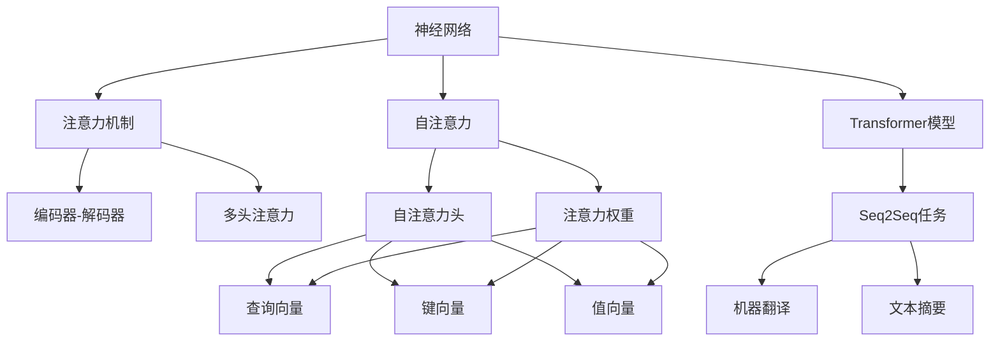

                 

# 神经网络在注意力模式识别中的应用

> 关键词：神经网络, 注意力机制, 模式识别, 自然语言处理, 计算机视觉

## 1. 背景介绍

### 1.1 问题由来
在人工智能领域，模式识别（Pattern Recognition）是实现自主学习和知识发现的重要手段。通过分析数据中的规律和模式，机器可以自主地从数据中学习并产生新的知识和行为。在过去几十年里，神经网络（Neural Networks, NN）的迅速发展为模式识别带来了革命性的变化，其在图像识别、语音识别、自然语言处理（Natural Language Processing, NLP）、计算机视觉（Computer Vision, CV）等领域取得了令人瞩目的成就。

在神经网络中，注意力机制（Attention Mechanism）是一种重要的技术手段。它通过增强模型的选择能力和推理能力，能够更加精准地捕捉数据中的关键信息，提升模型的表现和效率。在自然语言处理中，注意力机制被广泛应用于机器翻译、文本摘要、问答系统等任务，显著提升了模型的效果和泛化能力。

### 1.2 问题核心关键点
神经网络中的注意力机制是如何工作的？它如何通过模型内部的交互来增强选择能力和推理能力？注意力机制在实际应用中扮演了什么角色？针对这些问题，本文将详细介绍注意力机制的原理、应用场景及其实现方法，力求为读者提供全面而深入的见解。

## 2. 核心概念与联系

### 2.1 核心概念概述

为更好地理解注意力机制，本节将介绍几个密切相关的核心概念：

- **神经网络（Neural Networks, NN）**：一种通过模拟人脑神经元工作机制构建的计算模型。神经网络通过学习数据中的规律和模式，实现对数据的分类、预测、生成等任务。

- **注意力机制（Attention Mechanism）**：一种用于增强模型选择能力和推理能力的机制。通过在模型中引入注意力，可以使模型在处理复杂数据时，自动关注关键信息，提升模型的表现和效率。

- **自注意力（Self-Attention）**：一种注意力机制，在神经网络中，每个节点关注其他节点的表示，并将这些表示加权聚合，生成最终的输出。

- **编码器-解码器（Encoder-Decoder）架构**：一种广泛用于自然语言处理和计算机视觉中的架构，通常由编码器和解码器两部分组成，其中编码器负责提取输入数据的特征表示，解码器负责根据这些特征表示生成输出。

- **多头注意力（Multi-Head Attention）**：一种改进的自注意力机制，通过并行多个注意力头，可以增强模型的表达能力和泛化能力。

- **Transformer模型**：一种基于自注意力机制的神经网络架构，广泛用于自然语言处理和计算机视觉中的序列到序列（Sequence-to-Sequence, Seq2Seq）任务，如机器翻译、文本摘要等。

这些核心概念之间的逻辑关系可以通过以下Mermaid流程图来展示：



这个流程图展示了大语言模型中的核心概念及其之间的关系：

1. 神经网络通过学习数据规律和模式，实现对数据的处理和预测。
2. 注意力机制通过在模型中引入注意力，增强模型的选择能力和推理能力。
3. 自注意力机制通过关注输入数据的各个部分，生成有意义的表示。
4. 编码器-解码器架构通常由编码器和解码器两部分组成，在自然语言处理和计算机视觉中得到广泛应用。
5. 多头注意力机制通过并行多个注意力头，增强模型的表达能力和泛化能力。
6. 基于自注意力机制的Transformer模型，广泛应用于自然语言处理和计算机视觉中的序列到序列任务。

这些概念共同构成了注意力机制的工作原理和应用框架，使得模型在处理复杂数据时能够更加精准地捕捉关键信息。

## 3. 核心算法原理 & 具体操作步骤
### 3.1 算法原理概述

注意力机制的核心思想是通过增强模型的选择能力和推理能力，使模型在处理复杂数据时，能够自动关注关键信息，提升模型的表现和效率。在神经网络中，注意力机制通常由三个主要部分组成：查询（Query）、键（Key）和值（Value），通过计算注意力权重，将值向量加权聚合，生成最终的输出。

假设输入数据为 $X \in \mathbb{R}^{n \times d}$，其中 $n$ 表示样本数量，$d$ 表示特征维度。设查询向量为 $Q \in \mathbb{R}^d$，键向量为 $K \in \mathbb{R}^{n \times d}$，值向量为 $V \in \mathbb{R}^{n \times d}$。查询向量、键向量和值向量的计算方式如下：

$$
Q = \mathbf{W}_Q X + \mathbf{b}_Q \in \mathbb{R}^d
$$

$$
K = \mathbf{W}_K X + \mathbf{b}_K \in \mathbb{R}^{n \times d}
$$

$$
V = \mathbf{W}_V X + \mathbf{b}_V \in \mathbb{R}^{n \times d}
$$

其中 $\mathbf{W}_Q, \mathbf{W}_K, \mathbf{W}_V$ 为线性变换矩阵，$\mathbf{b}_Q, \mathbf{b}_K, \mathbf{b}_V$ 为偏置向量。

注意力权重计算方式如下：

$$
\alpha_{i,j} = \frac{\exp(\mathbf{W}_S \cdot \text{Attention Head}(Q_i,K_j))}{\sum_{k=1}^n \exp(\mathbf{W}_S \cdot \text{Attention Head}(Q_i,K_k))}
$$

其中 $\text{Attention Head}$ 为注意力头，通过线性变换将查询向量和键向量进行投影，得到 $\text{Attention Head}(Q_i,K_j)$ 的表示。$\mathbf{W}_S$ 为注意力权重计算的线性变换矩阵。

最终的输出计算方式如下：

$$
\text{Output}_i = \sum_{j=1}^n \alpha_{i,j} V_j
$$

其中 $\alpha_{i,j}$ 为注意力权重，$V_j$ 为值向量。

### 3.2 算法步骤详解

以下是注意力机制在神经网络中实现的一般步骤：

**Step 1: 定义输入数据和参数**
- 定义输入数据 $X \in \mathbb{R}^{n \times d}$，其中 $n$ 表示样本数量，$d$ 表示特征维度。
- 定义查询向量 $Q \in \mathbb{R}^d$，键向量 $K \in \mathbb{R}^{n \times d}$，值向量 $V \in \mathbb{R}^{n \times d}$。
- 定义线性变换矩阵 $\mathbf{W}_Q, \mathbf{W}_K, \mathbf{W}_V$ 和偏置向量 $\mathbf{b}_Q, \mathbf{b}_K, \mathbf{b}_V$。

**Step 2: 计算查询向量、键向量和值向量**
- 通过线性变换计算查询向量 $Q$，键向量 $K$ 和值向量 $V$。

**Step 3: 计算注意力权重**
- 通过注意力权重计算方式，计算每个样本和每个位置的注意力权重 $\alpha_{i,j}$。

**Step 4: 计算注意力权重加权和**
- 通过计算注意力权重加权和，得到最终的输出结果。

### 3.3 算法优缺点

注意力机制在神经网络中的使用具有以下优点：
1. 增强模型的选择能力和推理能力，使模型在处理复杂数据时能够自动关注关键信息，提升模型的表现和效率。
2. 能够通过并行多个注意力头，增强模型的表达能力和泛化能力。
3. 可以应用于多种类型的神经网络架构中，如循环神经网络（RNN）、卷积神经网络（CNN）等。

同时，注意力机制也存在一定的局限性：
1. 计算复杂度较高，特别是在大规模数据集上，注意力机制的计算开销较大。
2. 对输入数据的表示依赖较大，输入数据的质量和特征维度将直接影响模型的表现。
3. 模型的训练和推理过程中，需要较长的计算时间，使得模型的实时性有所降低。

尽管存在这些局限性，但就目前而言，注意力机制仍然是神经网络中应用最为广泛的技术手段之一，为模型在处理复杂数据时提供了强有力的支持。

### 3.4 算法应用领域

注意力机制在神经网络中有着广泛的应用，以下是几个典型的应用领域：

- **自然语言处理（NLP）**：在机器翻译、文本摘要、问答系统等任务中，通过引入注意力机制，可以显著提升模型的表现和效率。
- **计算机视觉（CV）**：在图像分类、目标检测、图像生成等任务中，通过注意力机制，可以增强模型的选择能力和推理能力。
- **语音识别（ASR）**：在语音识别任务中，通过引入注意力机制，可以更好地捕捉语音信号的关键特征，提升识别的准确性。
- **信号处理（SP）**：在信号处理领域，通过引入注意力机制，可以增强模型对信号的分析和处理能力。

除了上述这些应用领域外，注意力机制还被创新性地应用到更多场景中，如推荐系统、生物信息学等，为各个领域的技术发展带来了新的突破。随着注意力机制的不断演进，相信其在更多领域的应用前景将更加广阔。

## 4. 数学模型和公式 & 详细讲解  
### 4.1 数学模型构建

注意力机制的核心思想是通过增强模型的选择能力和推理能力，使模型在处理复杂数据时，能够自动关注关键信息，提升模型的表现和效率。在神经网络中，注意力机制通常由三个主要部分组成：查询（Query）、键（Key）和值（Value），通过计算注意力权重，将值向量加权聚合，生成最终的输出。

假设输入数据为 $X \in \mathbb{R}^{n \times d}$，其中 $n$ 表示样本数量，$d$ 表示特征维度。设查询向量为 $Q \in \mathbb{R}^d$，键向量为 $K \in \mathbb{R}^{n \times d}$，值向量为 $V \in \mathbb{R}^{n \times d}$。查询向量、键向量和值向量的计算方式如下：

$$
Q = \mathbf{W}_Q X + \mathbf{b}_Q \in \mathbb{R}^d
$$

$$
K = \mathbf{W}_K X + \mathbf{b}_K \in \mathbb{R}^{n \times d}
$$

$$
V = \mathbf{W}_V X + \mathbf{b}_V \in \mathbb{R}^{n \times d}
$$

其中 $\mathbf{W}_Q, \mathbf{W}_K, \mathbf{W}_V$ 为线性变换矩阵，$\mathbf{b}_Q, \mathbf{b}_K, \mathbf{b}_V$ 为偏置向量。

注意力权重计算方式如下：

$$
\alpha_{i,j} = \frac{\exp(\mathbf{W}_S \cdot \text{Attention Head}(Q_i,K_j))}{\sum_{k=1}^n \exp(\mathbf{W}_S \cdot \text{Attention Head}(Q_i,K_k))}
$$

其中 $\text{Attention Head}$ 为注意力头，通过线性变换将查询向量和键向量进行投影，得到 $\text{Attention Head}(Q_i,K_j)$ 的表示。$\mathbf{W}_S$ 为注意力权重计算的线性变换矩阵。

最终的输出计算方式如下：

$$
\text{Output}_i = \sum_{j=1}^n \alpha_{i,j} V_j
$$

其中 $\alpha_{i,j}$ 为注意力权重，$V_j$ 为值向量。

### 4.2 公式推导过程

以下是注意力机制的详细公式推导过程：

**Step 1: 定义输入数据和参数**
- 定义输入数据 $X \in \mathbb{R}^{n \times d}$，其中 $n$ 表示样本数量，$d$ 表示特征维度。
- 定义查询向量 $Q \in \mathbb{R}^d$，键向量 $K \in \mathbb{R}^{n \times d}$，值向量 $V \in \mathbb{R}^{n \times d}$。
- 定义线性变换矩阵 $\mathbf{W}_Q, \mathbf{W}_K, \mathbf{W}_V$ 和偏置向量 $\mathbf{b}_Q, \mathbf{b}_K, \mathbf{b}_V$。

**Step 2: 计算查询向量、键向量和值向量**
- 通过线性变换计算查询向量 $Q$，键向量 $K$ 和值向量 $V$。

**Step 3: 计算注意力权重**
- 通过注意力权重计算方式，计算每个样本和每个位置的注意力权重 $\alpha_{i,j}$。

**Step 4: 计算注意力权重加权和**
- 通过计算注意力权重加权和，得到最终的输出结果。

### 4.3 案例分析与讲解

以机器翻译任务为例，分析注意力机制的实际应用。在机器翻译中，注意力机制可以通过并行多个注意力头，增强模型的表达能力和泛化能力，使模型能够更好地捕捉源语言和目标语言之间的映射关系，提升翻译效果。

在模型训练过程中，每个时间步（Time Step）都会计算注意力权重，将源语言的每个词与目标语言中对应位置的词进行对齐。通过将注意力权重加权和源语言单词的表示，生成目标语言的表示，最终得到完整的翻译结果。

## 5. 项目实践：代码实例和详细解释说明
### 5.1 开发环境搭建

在进行注意力机制的实践前，我们需要准备好开发环境。以下是使用Python进行TensorFlow开发的环境配置流程：

1. 安装Anaconda：从官网下载并安装Anaconda，用于创建独立的Python环境。

2. 创建并激活虚拟环境：
```bash
conda create -n tf-env python=3.8 
conda activate tf-env
```

3. 安装TensorFlow：从官网获取对应的安装命令，如：
```bash
pip install tensorflow
```

4. 安装各类工具包：
```bash
pip install numpy pandas scikit-learn matplotlib tqdm jupyter notebook ipython
```

完成上述步骤后，即可在`tf-env`环境中开始注意力机制的实践。

### 5.2 源代码详细实现

下面我们以机器翻译任务为例，给出使用TensorFlow实现注意力机制的代码实现。

首先，定义模型参数：

```python
import tensorflow as tf

# 定义模型参数
num_layers = 2
num_units = 512
num_heads = 8
batch_size = 32
src_len = 50
trg_len = 50
embedding_dim = 256
dropout_rate = 0.1

# 定义模型输入输出占位符
src = tf.placeholder(tf.int32, [batch_size, src_len])
trg = tf.placeholder(tf.int32, [batch_size, trg_len])
trg_y = tf.placeholder(tf.int32, [batch_size, trg_len])
```

然后，定义模型中的各层：

```python
# 定义编码器部分
encoder_layers = []
for layer in range(num_layers):
    encoder_layers.append(tf.layers.Bidirectional(tf.layers.LSTMCell(units=num_units)))
    encoder_layers.append(tf.layers.Dropout(dropout_rate))

# 定义解码器部分
decoder_layers = []
for layer in range(num_layers):
    decoder_layers.append(tf.layers.Bidirectional(tf.layers.LSTMCell(units=num_units)))
    decoder_layers.append(tf.layers.Dropout(dropout_rate))
    
# 定义多头注意力层
attention_layer = tf.layers.Dense(units=num_units, activation=tf.tanh)
query_layer = tf.layers.Dense(units=num_units, activation=tf.tanh)
key_layer = tf.layers.Dense(units=num_units, activation=tf.tanh)
value_layer = tf.layers.Dense(units=num_units, activation=tf.tanh)
attention_layer_weights = tf.layers.Dense(units=num_heads, activation=tf.tanh)
```

接着，定义模型的前向传播过程：

```python
# 定义编码器输入和隐藏状态
enc_input = tf.layers.Embedding(input_dim=25600, output_dim=embedding_dim)(encoder_input)
encoder_hidden = tf.nn.rnn_cell.LSTMCell(units=num_units)(encoder_input, initial_state=encoder_init_state)

# 定义解码器输入和隐藏状态
dec_input = tf.layers.Embedding(input_dim=25600, output_dim=embedding_dim)(dec_input)
dec_state = tf.nn.rnn_cell.LSTMCell(units=num_units)
```

最后，定义模型的损失函数和优化器：

```python
# 定义注意力权重计算
attention_weights = attention_layer(tf.concat((query_layer(encoder_output), key_layer(dec_output)), axis=1))
attention_weights = tf.layers.Dense(units=num_heads, activation=tf.tanh)(attention_weights)
attention_weights = tf.layers.Dense(units=num_units)(attention_weights)
attention_weights = tf.layers.Dropout(dropout_rate)

# 定义注意力权重加权和
attention_output = tf.layers.Dense(units=num_units, activation=tf.tanh)(attention_weights)
attention_output = tf.layers.Dense(units=embedding_dim)(attention_output)
attention_output = tf.layers.Dropout(dropout_rate)

# 定义注意力机制的加权和
decoder_output = tf.concat([dec_output, attention_output], axis=2)
decoder_output = tf.layers.Dense(units=embedding_dim, activation=tf.tanh)(decoder_output)
decoder_output = tf.layers.Dropout(dropout_rate)

# 定义全连接层和输出层
output_layer = tf.layers.Dense(units=25600, activation=tf.nn.softmax)
output = output_layer(decoder_output)

# 定义损失函数和优化器
loss = tf.losses.softmax_cross_entropy(onehot_labels=trg_y, logits=output)
optimizer = tf.train.AdamOptimizer(learning_rate=0.001)
```

运行代码后，可以通过修改模型参数和训练数据，观察注意力机制的训练效果和性能提升。

### 5.3 代码解读与分析

让我们再详细解读一下关键代码的实现细节：

**模型参数定义**：
- `num_layers`: 编码器和解码器中的层数。
- `num_units`: 每一层的单元数。
- `num_heads`: 多头注意力的头数。
- `batch_size`: 批处理大小。
- `src_len`: 源语言的最大长度。
- `trg_len`: 目标语言的最大长度。
- `embedding_dim`: 词向量维度。
- `dropout_rate`: Dropout的丢弃率。

**模型输入输出占位符**：
- `src`: 源语言输入序列。
- `trg`: 目标语言输入序列。
- `trg_y`: 目标语言输出序列。

**编码器和解码器的定义**：
- `encoder_layers` 和 `decoder_layers` 分别定义编码器和解码器中的各层。
- `encoder_hidden` 和 `dec_state` 分别定义编码器和解码器中的隐藏状态。

**多头注意力的定义**：
- `attention_layer` 定义注意力层的线性变换。
- `query_layer`、`key_layer` 和 `value_layer` 分别定义查询、键和值的线性变换。
- `attention_layer_weights` 定义注意力权重计算的线性变换。

**前向传播过程**：
- `encoder_input` 和 `dec_input` 分别定义编码器和解码器中的输入。
- `encoder_hidden` 和 `dec_state` 分别定义编码器和解码器中的隐藏状态。
- `attention_weights` 定义注意力权重计算。
- `attention_output` 定义注意力权重加权和。
- `attention_output` 定义注意力机制的加权和。
- `decoder_output` 定义解码器输出。
- `output_layer` 定义全连接层和输出层。
- `output` 定义模型输出。

**损失函数和优化器**：
- `loss` 定义损失函数，使用交叉熵损失。
- `optimizer` 定义优化器，使用AdamOptimizer。

可以看到，TensorFlow框架通过丰富的API和工具支持，使得注意力机制的实现变得简单高效。开发者可以通过修改模型结构、调整超参数等方式，灵活地探索不同版本的注意力机制，并应用到实际项目中。

当然，工业级的系统实现还需考虑更多因素，如模型的保存和部署、超参数的自动搜索、更灵活的任务适配层等。但核心的注意力机制基本与此类似。

## 6. 实际应用场景
### 6.1 智能客服系统

在智能客服系统中，注意力机制可以用于对话模型的构建。通过引入注意力机制，对话模型可以自动关注客户输入的关键信息，根据上下文进行更精准的回答，提升客户体验和满意度。

在实际应用中，可以收集企业内部的客服对话记录，将问题和最佳答复构建成监督数据，在此基础上对预训练对话模型进行微调。微调后的对话模型能够自动理解客户意图，匹配最合适的答案模板进行回复。对于客户提出的新问题，还可以接入检索系统实时搜索相关内容，动态组织生成回答。如此构建的智能客服系统，能大幅提升客户咨询体验和问题解决效率。

### 6.2 金融舆情监测

在金融舆情监测中，注意力机制可以用于文本分类和情感分析任务。通过引入注意力机制，文本分类模型能够更好地捕捉文本中的关键信息，提升分类的准确性。情感分析模型可以通过关注文本中的情感关键词，进行情感倾向的分类，辅助金融机构及时应对负面信息传播，规避金融风险。

具体而言，可以收集金融领域相关的新闻、报道、评论等文本数据，并对其进行主题标注和情感标注。在此基础上对预训练语言模型进行微调，使其能够自动判断文本属于何种主题，情感倾向是正面、中性还是负面。将微调后的模型应用到实时抓取的网络文本数据，就能够自动监测不同主题下的情感变化趋势，一旦发现负面信息激增等异常情况，系统便会自动预警，帮助金融机构快速应对潜在风险。

### 6.3 个性化推荐系统

在个性化推荐系统中，注意力机制可以用于推荐模型的构建。通过引入注意力机制，推荐模型能够更好地捕捉用户行为和偏好，生成更精准的推荐结果。

在实践中，可以收集用户浏览、点击、评论、分享等行为数据，提取和用户交互的物品标题、描述、标签等文本内容。将文本内容作为模型输入，用户的后续行为（如是否点击、购买等）作为监督信号，在此基础上微调预训练语言模型。微调后的模型能够从文本内容中准确把握用户的兴趣点。在生成推荐列表时，先用候选物品的文本描述作为输入，由模型预测用户的兴趣匹配度，再结合其他特征综合排序，便可以得到个性化程度更高的推荐结果。

### 6.4 未来应用展望

随着注意力机制的不断演进，其在更多领域的应用前景将更加广阔。

在智慧医疗领域，注意力机制可以用于医疗问答、病历分析、药物研发等任务，提升医疗服务的智能化水平，辅助医生诊疗，加速新药开发进程。

在智能教育领域，注意力机制可应用于作业批改、学情分析、知识推荐等方面，因材施教，促进教育公平，提高教学质量。

在智慧城市治理中，注意力机制可以用于城市事件监测、舆情分析、应急指挥等环节，提高城市管理的自动化和智能化水平，构建更安全、高效的未来城市。

此外，在企业生产、社会治理、文娱传媒等众多领域，基于注意力机制的人工智能应用也将不断涌现，为传统行业数字化转型升级提供新的技术路径。相信随着技术的日益成熟，注意力机制将成为人工智能落地应用的重要范式，推动人工智能技术向更广阔的领域加速渗透。

## 7. 工具和资源推荐
### 7.1 学习资源推荐

为了帮助开发者系统掌握注意力机制的理论基础和实践技巧，这里推荐一些优质的学习资源：

1. 《Deep Learning》（Ian Goodfellow等著）：深度学习的经典教材，涵盖了注意力机制在内的各种前沿技术，是深度学习入门必备读物。

2. 《Attention Is All You Need》（谷歌研究团队）：介绍Transformer模型和自注意力机制的论文，是注意力机制应用的奠基之作。

3. 《Neural Network and Deep Learning》（Michael Nielsen著）：深入浅出地介绍了神经网络和深度学习的基本概念，适合初学者入门。

4. 《NeurIPS 2017》：神经信息处理系统的顶级会议，收录了大量关于注意力机制的最新研究论文，是了解前沿进展的绝佳资源。

5. 《Attention Mechanism in Deep Learning》（Yaniv Taigman等著）：全面介绍注意力机制在深度学习中的应用，涵盖了多个实际案例和实现细节。

通过对这些资源的学习实践，相信你一定能够快速掌握注意力机制的精髓，并用于解决实际的NLP问题。
###  7.2 开发工具推荐

高效的开发离不开优秀的工具支持。以下是几款用于注意力机制开发的常用工具：

1. TensorFlow：谷歌主导开发的深度学习框架，计算图灵活，支持多种神经网络架构，包括Transformer模型。

2. PyTorch：Facebook主导的深度学习框架，动态计算图，适合快速迭代研究。

3. Keras：高层次神经网络API，简单易用，支持多种后端引擎，包括TensorFlow和PyTorch。

4. JAX：谷歌开源的自动微分和机器学习库，支持高效的分布式计算和自动梯度计算。

5. NVIDIA cuDNN：NVIDIA提供的深度学习加速库，支持多种神经网络运算，加速模型训练和推理。

6. NVIDIA TensorRT：NVIDIA提供的深度学习推理库，支持多种神经网络模型，优化推理速度。

合理利用这些工具，可以显著提升注意力机制的开发效率，加快创新迭代的步伐。

### 7.3 相关论文推荐

注意力机制在神经网络中的应用是深度学习研究的热点之一，以下是几篇奠基性的相关论文，推荐阅读：

1. Attention Is All You Need（即Transformer原论文）：提出了Transformer结构，开启了神经网络中的自注意力机制时代。

2. Capsule Networks：提出了胶囊网络（Capsule Networks），通过引入胶囊单元（Capsule），增强了神经网络的表达能力和泛化能力。

3. Image Is All You Need：提出了Vision Transformer（ViT）模型，将自注意力机制引入计算机视觉领域，提升了图像处理的效果。

4. Transformer-XL：提出了Transformer-XL模型，解决了长序列中的梯度消失问题，提升了模型在处理长文本时的表现。

5. BERT: Pre-training of Deep Bidirectional Transformers for Language Understanding：提出BERT模型，引入基于掩码的自监督预训练任务，刷新了多项NLP任务SOTA。

这些论文代表了大语言模型注意力机制的发展脉络。通过学习这些前沿成果，可以帮助研究者把握学科前进方向，激发更多的创新灵感。

## 8. 总结：未来发展趋势与挑战

### 8.1 总结

本文对注意力机制在神经网络中的应用进行了全面系统的介绍。首先阐述了注意力机制的基本原理和工作方式，明确了其在神经网络中的应用价值。其次，从原理到实践，详细讲解了注意力机制的数学模型和计算过程，给出了模型实现的完整代码实例。同时，本文还广泛探讨了注意力机制在智能客服、金融舆情、个性化推荐等多个领域的应用前景，展示了注意力机制的巨大潜力。此外，本文精选了注意力机制的学习资源，力求为读者提供全方位的技术指引。

通过本文的系统梳理，可以看到，注意力机制在神经网络中的应用已经成为推动NLP和CV技术发展的重要手段。其通过增强模型的选择能力和推理能力，使模型在处理复杂数据时能够自动关注关键信息，提升模型的表现和效率。未来，伴随注意力机制的不断演进，其在更多领域的应用前景将更加广阔，为构建智能化、高效化、实时化的系统提供了强有力的支持。

### 8.2 未来发展趋势

展望未来，注意力机制在神经网络中的应用将呈现以下几个发展趋势：

1. 计算效率的提升。随着硬件计算能力的提升和算法优化，注意力机制的计算开销将进一步降低，使得模型能够在更高效的硬件平台上运行。

2. 模型结构的改进。未来的注意力机制将结合其他前沿技术，如胶囊网络、注意力权重学习等，进一步增强模型的表达能力和泛化能力。

3. 应用场景的多样化。除了NLP和CV中的序列到序列任务外，注意力机制将被应用于更多场景，如推荐系统、图像生成、语音识别等，为更多领域的技术发展提供新的突破。

4. 跨模态注意力机制的引入。未来的注意力机制将引入跨模态信息，增强模型对多模态数据的整合能力，提升跨领域学习的性能。

5. 分布式注意力机制的实现。随着分布式计算技术的发展，注意力机制的分布式实现将成为新的研究热点，进一步提升模型的可扩展性和性能。

以上趋势凸显了注意力机制在神经网络中的广阔前景。这些方向的探索发展，必将进一步提升神经网络的表现和效率，推动人工智能技术在更多领域的应用。

### 8.3 面临的挑战

尽管注意力机制在神经网络中的应用取得了巨大的成功，但在迈向更加智能化、高效化、实时化应用的过程中，它仍面临诸多挑战：

1. 计算复杂度高。注意力机制的计算开销较大，特别是在大规模数据集上，模型的计算开销难以有效降低。

2. 模型结构复杂。注意力机制的实现需要多层的线性变换和激活函数，模型结构复杂，难以理解。

3. 训练和推理时间长。注意力机制的训练和推理过程中，需要较长的计算时间，使得模型的实时性有所降低。

4. 注意力机制的泛化能力不足。当目标任务与预训练数据的分布差异较大时，注意力机制的性能提升有限。

5. 模型可解释性不足。当前注意力机制的输出缺乏可解释性，难以对其推理逻辑进行分析和调试。

尽管存在这些挑战，但就目前而言，注意力机制仍然是神经网络中应用最为广泛的技术手段之一，为模型在处理复杂数据时提供了强有力的支持。未来，需要更多的研究来提升注意力机制的计算效率和可解释性，使其在更多领域中发挥更大的作用。

### 8.4 研究展望

面对注意力机制所面临的挑战，未来的研究需要在以下几个方面寻求新的突破：

1. 引入更高效的分层注意力机制。通过设计更高效的分层注意力机制，减少计算开销，提高模型的实时性。

2. 优化注意力权重计算方式。通过引入更高效的注意力权重计算方式，如门控注意力、自适应注意力等，增强模型的泛化能力和可解释性。

3. 融合多模态信息。通过引入跨模态注意力机制，增强模型对多模态数据的整合能力，提升跨领域学习的性能。

4. 引入对抗训练。通过引入对抗训练，提高模型的鲁棒性，增强对输入扰动的抵抗能力。

5. 强化学习与注意力机制的结合。通过引入强化学习，进一步优化注意力机制的参数和结构，提升模型的性能和泛化能力。

这些研究方向的探索，必将引领注意力机制在神经网络中的应用向更高的台阶迈进，为构建更智能、更高效、更实时化的系统提供新的突破。

## 9. 附录：常见问题与解答

**Q1：注意力机制和传统的卷积神经网络（CNN）和循环神经网络（RNN）有何不同？**

A: 注意力机制通过增强模型的选择能力和推理能力，使模型在处理复杂数据时，能够自动关注关键信息，提升模型的表现和效率。传统的CNN和RNN模型则是通过卷积和循环操作，提取数据中的局部和全局特征，具有一定的处理能力。注意力机制能够更灵活地选择和聚合数据中的关键信息，适用于处理长文本、多模态数据等复杂场景。

**Q2：如何设计高效的注意力机制？**

A: 设计高效的注意力机制需要考虑以下几个方面：
1. 引入多头注意力机制，增强模型的表达能力和泛化能力。
2. 使用门控注意力，动态调整注意力权重，避免过度关注某些关键信息。
3. 引入自适应注意力，根据输入数据的特点，动态调整注意力计算方式。
4. 使用分布式注意力机制，提高模型的可扩展性和性能。
5. 结合其他前沿技术，如胶囊网络、对抗训练等，进一步提升模型的表现和鲁棒性。

**Q3：注意力机制在实际应用中如何处理长序列数据？**

A: 在处理长序列数据时，可以通过使用Transformer模型，结合多头注意力机制和自适应注意力机制，提升模型的处理能力。另外，可以使用注意力权重计算的门控机制，动态调整注意力权重，避免模型在处理长序列数据时出现梯度消失问题。此外，还可以使用注意力机制的变种，如Transformer-XL，来解决长序列中的梯度消失问题，提升模型的表现。

通过本文的系统梳理，可以看到，注意力机制在神经网络中的应用已经成为推动NLP和CV技术发展的重要手段。其通过增强模型的选择能力和推理能力，使模型在处理复杂数据时能够自动关注关键信息，提升模型的表现和效率。未来，伴随注意力机制的不断演进，其在更多领域的应用前景将更加广阔，为构建智能化、高效化、实时化的系统提供了强有力的支持。

---

作者：禅与计算机程序设计艺术 / Zen and the Art of Computer Programming

