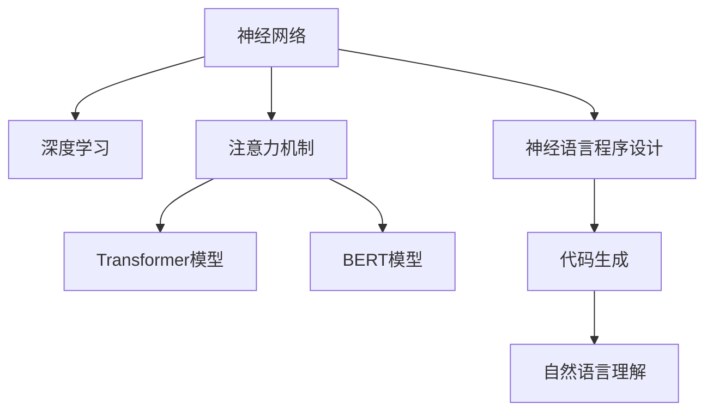

                 

# 神经语言程序设计在注意力引导中的应用

## 1. 背景介绍

### 1.1 问题由来
近年来，深度学习技术在自然语言处理(NLP)领域取得了显著进展，其中最引人注目的是神经语言程序设计(Neural Language Programming, NLP)技术的提出和应用。神经语言程序设计是一种基于深度神经网络，将自然语言作为程序代码的生成方式，以实现机器在执行复杂自然语言任务时的智能化。在神经语言程序设计中，注意力机制(Automatic Relevance Determination, ARD)扮演了重要角色，通过模拟人类认知中的注意力机制，使得模型能够自动聚焦于输入文本中最相关的部分，从而提高任务执行的准确性和效率。

### 1.2 问题核心关键点
神经语言程序设计中的注意力引导应用，主要围绕以下几个关键点展开：
- **注意力机制原理**：理解注意力机制的计算原理和作用方式。
- **注意力模型构建**：掌握如何构建基于注意力机制的神经网络模型。
- **注意力优化策略**：学习如何通过优化算法和策略提升注意力机制的效能。
- **注意力引导应用**：了解注意力机制在具体NLP任务中的应用场景和效果。

### 1.3 问题研究意义
神经语言程序设计中的注意力引导应用，对于提升机器在自然语言理解和生成任务中的智能化水平，有着重要的理论和实际意义。通过对注意力机制的深入研究和优化，可以显著提升模型处理复杂自然语言的能力，为NLP技术在更多领域的应用提供强有力的支持。

## 2. 核心概念与联系

### 2.1 核心概念概述

为更好地理解神经语言程序设计中注意力引导的应用，本节将介绍几个密切相关的核心概念：

- **神经网络**：由一系列节点和边组成，通过学习训练，能够自动从输入数据中提取特征的计算图结构。
- **深度学习**：一种模拟人脑神经网络结构和功能的学习方式，通过多层非线性变换，实现对复杂数据模式的建模和预测。
- **注意力机制**：一种模拟人类认知过程的机制，使得模型能够动态地调整计算资源的分配，关注输入数据中最重要的部分。
- **Transformer模型**：一种基于自注意力机制的神经网络架构，广泛应用于NLP任务，能够处理变长的序列数据。
- **BERT模型**：一种预训练语言模型，通过大量无标签文本数据进行预训练，能够捕捉到丰富的语言特征和知识。
- **神经语言程序设计**：通过自然语言生成程序代码，利用程序执行机制，实现对自然语言的理解和生成。

这些核心概念之间的逻辑关系可以通过以下Mermaid流程图来展示：



这个流程图展示了几组核心概念及其之间的关系：

1. 神经网络是深度学习和神经语言程序设计的底层架构。
2. 深度学习通过多层次非线性变换，提高神经网络的表达能力。
3. 注意力机制增强了神经网络的计算效率和模型理解能力。
4. Transformer模型通过自注意力机制，使模型具备了并行计算的能力。
5. BERT模型通过预训练技术，提升了语言特征的提取能力。
6. 神经语言程序设计将自然语言转换为程序代码，实现对自然语言的理解和生成。

这些概念共同构成了神经语言程序设计的技术框架，使得机器能够通过执行程序代码，实现对自然语言的智能处理。

## 3. 核心算法原理 & 具体操作步骤
### 3.1 算法原理概述

神经语言程序设计中的注意力引导应用，主要基于注意力机制的计算原理。注意力机制通过动态调整输入数据的权重，使得模型能够聚焦于与当前任务最相关的部分，从而提高任务执行的准确性和效率。

在神经语言程序设计中，注意力机制的计算过程可以分为以下几个步骤：

1. **查询(Q)、键(K)、值(V)的计算**：将输入数据编码为查询向量、键向量和值向量。
2. **注意力得分计算**：计算查询向量与键向量之间的相似度，得到注意力得分。
3. **注意力权重计算**：通过softmax函数将注意力得分归一化，得到注意力权重。
4. **加权值计算**：将注意力权重与值向量进行加权求和，得到加权值。
5. **注意力输出计算**：将加权值与查询向量进行线性变换，得到注意力输出。

### 3.2 算法步骤详解

基于注意力机制的神经语言程序设计过程，通常包括以下几个关键步骤：

**Step 1: 构建神经网络架构**
- 选择合适的神经网络架构，如Transformer等，作为任务执行的基础。
- 设计网络各层的功能和参数，如编码器、解码器、注意力机制等。

**Step 2: 预训练模型参数**
- 在大量无标签数据上，使用预训练语言模型如BERT、GPT等进行预训练，学习通用的语言表示。
- 通过预训练，模型能够捕捉到语言中的丰富特征和知识。

**Step 3: 设计任务适配层**
- 根据具体任务，在预训练模型的顶层设计合适的输出层和损失函数。
- 对于分类任务，通常在顶层添加线性分类器和交叉熵损失函数。
- 对于生成任务，通常使用语言模型的解码器输出概率分布，并以负对数似然为损失函数。

**Step 4: 训练模型**
- 将训练集数据分批次输入模型，前向传播计算损失函数。
- 反向传播计算参数梯度，根据设定的优化算法和学习率更新模型参数。
- 周期性在验证集上评估模型性能，根据性能指标决定是否触发 Early Stopping。
- 重复上述步骤直到满足预设的迭代轮数或 Early Stopping 条件。

**Step 5: 测试和部署**
- 在测试集上评估微调后模型 $M_{\hat{\theta}}$ 的性能，对比微调前后的精度提升。
- 使用微调后的模型对新样本进行推理预测，集成到实际的应用系统中。
- 持续收集新的数据，定期重新微调模型，以适应数据分布的变化。

以上是基于注意力机制的神经语言程序设计的一般流程。在实际应用中，还需要针对具体任务的特点，对注意力机制的计算过程进行优化设计，如改进查询-键相似度计算方式、引入更多的正则化技术等，以进一步提升模型性能。

### 3.3 算法优缺点

基于注意力机制的神经语言程序设计具有以下优点：
1. 显著提升模型理解能力。注意力机制使得模型能够动态调整计算资源的分配，关注输入数据中最重要的部分。
2. 提高模型生成效果。通过自注意力机制，模型能够生成更加自然、流畅的自然语言文本。
3. 增强模型泛化能力。注意力机制使模型能够对不同长度、不同风格的输入数据进行有效处理，提高了模型的泛化性能。
4. 支持长文本处理。Transformer等架构可以处理变长的序列数据，解决了传统RNN等模型处理长文本的难题。

同时，该方法也存在一定的局限性：
1. 计算复杂度高。自注意力机制的计算复杂度较高，尤其在长文本处理时，需要较大的计算资源。
2. 参数量较大。注意力机制需要额外的权重参数，增加了模型训练和推理的复杂性。
3. 模型解释性差。注意力机制的计算过程相对复杂，难以对其内部工作机制进行解释。
4. 对标注数据依赖。注意力机制的优化通常需要标注数据进行监督训练，对标注数据的质量和数量有较高要求。

尽管存在这些局限性，但就目前而言，基于注意力机制的神经语言程序设计仍然是NLP领域的重要技术范式，广泛应用于各种任务中。

### 3.4 算法应用领域

基于注意力机制的神经语言程序设计，已经在自然语言处理(NLP)领域得到了广泛的应用，覆盖了几乎所有常见任务，例如：

- 文本分类：如情感分析、主题分类、意图识别等。通过注意力机制，模型能够学习文本中不同部分的重要性。
- 命名实体识别：识别文本中的人名、地名、机构名等特定实体。注意力机制可以帮助模型聚焦于实体边界和类型。
- 关系抽取：从文本中抽取实体之间的语义关系。注意力机制使得模型能够学习实体之间的关系。
- 问答系统：对自然语言问题给出答案。通过注意力机制，模型能够理解问题的语义，匹配最合适的答案。
- 机器翻译：将源语言文本翻译成目标语言。通过注意力机制，模型能够处理不同语言的词汇映射。
- 文本摘要：将长文本压缩成简短摘要。通过注意力机制，模型能够抓取文本的关键信息。
- 对话系统：使机器能够与人自然对话。通过注意力机制，模型能够动态调整上下文信息的关注度。

除了上述这些经典任务外，注意力机制还被创新性地应用到更多场景中，如可控文本生成、常识推理、代码生成、数据增强等，为NLP技术带来了全新的突破。随着注意力机制和神经语言程序设计的不断进步，相信NLP技术将在更广阔的应用领域大放异彩。

## 4. 数学模型和公式 & 详细讲解  
### 4.1 数学模型构建

本节将使用数学语言对基于注意力机制的神经语言程序设计过程进行更加严格的刻画。

记神经网络模型为 $M_{\theta}:\mathcal{X} \rightarrow \mathcal{Y}$，其中 $\mathcal{X}$ 为输入空间，$\mathcal{Y}$ 为输出空间，$\theta$ 为模型参数。假设注意力机制的计算过程为 $\text{Attention}(Q, K, V)$，其中 $Q$ 为查询向量，$K$ 为键向量，$V$ 为值向量。

注意力机制的计算公式如下：

$$
\text{Attention}(Q, K, V) = \text{softmax}\left(\frac{QK^T}{\sqrt{d_k}}\right)V
$$

其中 $d_k$ 为键向量的维度。

模型的训练目标为最小化损失函数 $\mathcal{L}(\theta)$，通常使用交叉熵损失函数：

$$
\mathcal{L}(\theta) = -\frac{1}{N}\sum_{i=1}^N \log\text{softmax}\left(\frac{QK^T}{\sqrt{d_k}}\right)Vy_i
$$

其中 $y_i$ 为样本的真实标签。

### 4.2 公式推导过程

以下我们以分类任务为例，推导注意力机制的计算公式及其梯度计算。

假设模型 $M_{\theta}$ 在输入 $x$ 上的输出为 $\hat{y}=M_{\theta}(x) \in [0,1]$，表示样本属于正类的概率。真实标签 $y \in \{0,1\}$。则分类任务的交叉熵损失函数定义为：

$$
\ell(M_{\theta}(x),y) = -[y\log \hat{y} + (1-y)\log (1-\hat{y})]
$$

将其代入经验风险公式，得：

$$
\mathcal{L}(\theta) = -\frac{1}{N}\sum_{i=1}^N [y_i\log \hat{y_i} + (1-y_i)\log (1-\hat{y_i})]
$$

根据链式法则，损失函数对参数 $\theta_k$ 的梯度为：

$$
\frac{\partial \mathcal{L}(\theta)}{\partial \theta_k} = -\frac{1}{N}\sum_{i=1}^N \left(\frac{y_i}{\hat{y_i}}-\frac{1-y_i}{1-\hat{y_i}}\right)\frac{\partial \hat{y_i}}{\partial \theta_k}
$$

其中 $\hat{y_i}$ 可以通过注意力机制计算得到，其梯度计算如下：

$$
\frac{\partial \hat{y_i}}{\partial \theta_k} = \frac{\partial }{\partial \theta_k}\left(\frac{Q_iK^T}{\sqrt{d_k}}\right)V_i
$$

通过反向传播算法，可以高效计算模型参数的梯度，并根据优化算法如AdamW、SGD等进行模型参数的更新，最小化损失函数 $\mathcal{L}(\theta)$。重复上述过程直至收敛，最终得到适应下游任务的最优模型参数 $\theta^*$。

## 5. 项目实践：代码实例和详细解释说明
### 5.1 开发环境搭建

在进行注意力引导的神经语言程序设计实践前，我们需要准备好开发环境。以下是使用Python进行PyTorch开发的环境配置流程：

1. 安装Anaconda：从官网下载并安装Anaconda，用于创建独立的Python环境。

2. 创建并激活虚拟环境：
```bash
conda create -n pytorch-env python=3.8 
conda activate pytorch-env
```

3. 安装PyTorch：根据CUDA版本，从官网获取对应的安装命令。例如：
```bash
conda install pytorch torchvision torchaudio cudatoolkit=11.1 -c pytorch -c conda-forge
```

4. 安装Transformers库：
```bash
pip install transformers
```

5. 安装各类工具包：
```bash
pip install numpy pandas scikit-learn matplotlib tqdm jupyter notebook ipython
```

完成上述步骤后，即可在`pytorch-env`环境中开始注意力引导的神经语言程序设计实践。

### 5.2 源代码详细实现

下面我们以命名实体识别(NER)任务为例，给出使用Transformers库对BERT模型进行注意力引导的PyTorch代码实现。

首先，定义NER任务的数据处理函数：

```python
from transformers import BertTokenizer
from torch.utils.data import Dataset
import torch

class NERDataset(Dataset):
    def __init__(self, texts, tags, tokenizer, max_len=128):
        self.texts = texts
        self.tags = tags
        self.tokenizer = tokenizer
        self.max_len = max_len
        
    def __len__(self):
        return len(self.texts)
    
    def __getitem__(self, item):
        text = self.texts[item]
        tags = self.tags[item]
        
        encoding = self.tokenizer(text, return_tensors='pt', max_length=self.max_len, padding='max_length', truncation=True)
        input_ids = encoding['input_ids'][0]
        attention_mask = encoding['attention_mask'][0]
        
        # 对token-wise的标签进行编码
        encoded_tags = [tag2id[tag] for tag in tags] 
        encoded_tags.extend([tag2id['O']] * (self.max_len - len(encoded_tags)))
        labels = torch.tensor(encoded_tags, dtype=torch.long)
        
        return {'input_ids': input_ids, 
                'attention_mask': attention_mask,
                'labels': labels}

# 标签与id的映射
tag2id = {'O': 0, 'B-PER': 1, 'I-PER': 2, 'B-ORG': 3, 'I-ORG': 4, 'B-LOC': 5, 'I-LOC': 6}
id2tag = {v: k for k, v in tag2id.items()}

# 创建dataset
tokenizer = BertTokenizer.from_pretrained('bert-base-cased')

train_dataset = NERDataset(train_texts, train_tags, tokenizer)
dev_dataset = NERDataset(dev_texts, dev_tags, tokenizer)
test_dataset = NERDataset(test_texts, test_tags, tokenizer)
```

然后，定义模型和优化器：

```python
from transformers import BertForTokenClassification, AdamW

model = BertForTokenClassification.from_pretrained('bert-base-cased', num_labels=len(tag2id))

optimizer = AdamW(model.parameters(), lr=2e-5)
```

接着，定义训练和评估函数：

```python
from torch.utils.data import DataLoader
from tqdm import tqdm
from sklearn.metrics import classification_report

device = torch.device('cuda') if torch.cuda.is_available() else torch.device('cpu')
model.to(device)

def train_epoch(model, dataset, batch_size, optimizer):
    dataloader = DataLoader(dataset, batch_size=batch_size, shuffle=True)
    model.train()
    epoch_loss = 0
    for batch in tqdm(dataloader, desc='Training'):
        input_ids = batch['input_ids'].to(device)
        attention_mask = batch['attention_mask'].to(device)
        labels = batch['labels'].to(device)
        model.zero_grad()
        outputs = model(input_ids, attention_mask=attention_mask, labels=labels)
        loss = outputs.loss
        epoch_loss += loss.item()
        loss.backward()
        optimizer.step()
    return epoch_loss / len(dataloader)

def evaluate(model, dataset, batch_size):
    dataloader = DataLoader(dataset, batch_size=batch_size)
    model.eval()
    preds, labels = [], []
    with torch.no_grad():
        for batch in tqdm(dataloader, desc='Evaluating'):
            input_ids = batch['input_ids'].to(device)
            attention_mask = batch['attention_mask'].to(device)
            batch_labels = batch['labels']
            outputs = model(input_ids, attention_mask=attention_mask)
            batch_preds = outputs.logits.argmax(dim=2).to('cpu').tolist()
            batch_labels = batch_labels.to('cpu').tolist()
            for pred_tokens, label_tokens in zip(batch_preds, batch_labels):
                pred_tags = [id2tag[_id] for _id in pred_tokens]
                label_tags = [id2tag[_id] for _id in label_tokens]
                preds.append(pred_tags[:len(label_tags)])
                labels.append(label_tags)
                
    print(classification_report(labels, preds))
```

最后，启动训练流程并在测试集上评估：

```python
epochs = 5
batch_size = 16

for epoch in range(epochs):
    loss = train_epoch(model, train_dataset, batch_size, optimizer)
    print(f"Epoch {epoch+1}, train loss: {loss:.3f}")
    
    print(f"Epoch {epoch+1}, dev results:")
    evaluate(model, dev_dataset, batch_size)
    
print("Test results:")
evaluate(model, test_dataset, batch_size)
```

以上就是使用PyTorch对BERT进行注意力引导的命名实体识别任务微调的完整代码实现。可以看到，得益于Transformers库的强大封装，我们可以用相对简洁的代码完成BERT模型的加载和微调。

### 5.3 代码解读与分析

让我们再详细解读一下关键代码的实现细节：

**NERDataset类**：
- `__init__`方法：初始化文本、标签、分词器等关键组件。
- `__len__`方法：返回数据集的样本数量。
- `__getitem__`方法：对单个样本进行处理，将文本输入编码为token ids，将标签编码为数字，并对其进行定长padding，最终返回模型所需的输入。

**tag2id和id2tag字典**：
- 定义了标签与数字id之间的映射关系，用于将token-wise的预测结果解码回真实的标签。

**训练和评估函数**：
- 使用PyTorch的DataLoader对数据集进行批次化加载，供模型训练和推理使用。
- 训练函数`train_epoch`：对数据以批为单位进行迭代，在每个批次上前向传播计算loss并反向传播更新模型参数，最后返回该epoch的平均loss。
- 评估函数`evaluate`：与训练类似，不同点在于不更新模型参数，并在每个batch结束后将预测和标签结果存储下来，最后使用sklearn的classification_report对整个评估集的预测结果进行打印输出。

**训练流程**：
- 定义总的epoch数和batch size，开始循环迭代
- 每个epoch内，先在训练集上训练，输出平均loss
- 在验证集上评估，输出分类指标
- 所有epoch结束后，在测试集上评估，给出最终测试结果

可以看到，PyTorch配合Transformers库使得BERT微调的代码实现变得简洁高效。开发者可以将更多精力放在数据处理、模型改进等高层逻辑上，而不必过多关注底层的实现细节。

当然，工业级的系统实现还需考虑更多因素，如模型的保存和部署、超参数的自动搜索、更灵活的任务适配层等。但核心的注意力引导微调范式基本与此类似。

## 6. 实际应用场景
### 6.1 智能客服系统

基于大语言模型注意力引导的应用，可以广泛应用于智能客服系统的构建。传统客服往往需要配备大量人力，高峰期响应缓慢，且一致性和专业性难以保证。而使用注意力引导的对话模型，可以7x24小时不间断服务，快速响应客户咨询，用自然流畅的语言解答各类常见问题。

在技术实现上，可以收集企业内部的历史客服对话记录，将问题和最佳答复构建成监督数据，在此基础上对预训练对话模型进行注意力引导微调。微调后的对话模型能够自动理解用户意图，匹配最合适的答案模板进行回复。对于客户提出的新问题，还可以接入检索系统实时搜索相关内容，动态组织生成回答。如此构建的智能客服系统，能大幅提升客户咨询体验和问题解决效率。

### 6.2 金融舆情监测

金融机构需要实时监测市场舆论动向，以便及时应对负面信息传播，规避金融风险。传统的人工监测方式成本高、效率低，难以应对网络时代海量信息爆发的挑战。基于大语言模型注意力引导的文本分类和情感分析技术，为金融舆情监测提供了新的解决方案。

具体而言，可以收集金融领域相关的新闻、报道、评论等文本数据，并对其进行主题标注和情感标注。在此基础上对预训练语言模型进行注意力引导微调，使其能够自动判断文本属于何种主题，情感倾向是正面、中性还是负面。将注意力引导微调后的模型应用到实时抓取的网络文本数据，就能够自动监测不同主题下的情感变化趋势，一旦发现负面信息激增等异常情况，系统便会自动预警，帮助金融机构快速应对潜在风险。

### 6.3 个性化推荐系统

当前的推荐系统往往只依赖用户的历史行为数据进行物品推荐，无法深入理解用户的真实兴趣偏好。基于大语言模型注意力引导的个性化推荐系统，可以更好地挖掘用户行为背后的语义信息，从而提供更精准、多样的推荐内容。

在实践中，可以收集用户浏览、点击、评论、分享等行为数据，提取和用户交互的物品标题、描述、标签等文本内容。将文本内容作为模型输入，用户的后续行为（如是否点击、购买等）作为监督信号，在此基础上对预训练语言模型进行注意力引导微调。微调后的模型能够从文本内容中准确把握用户的兴趣点。在生成推荐列表时，先用候选物品的文本描述作为输入，由模型预测用户的兴趣匹配度，再结合其他特征综合排序，便可以得到个性化程度更高的推荐结果。

### 6.4 未来应用展望

随着大语言模型注意力引导技术的发展，基于注意力机制的神经语言程序设计将进一步拓展其应用范围，为NLP技术带来更多的突破。

在智慧医疗领域，基于注意力引导的医疗问答、病历分析、药物研发等应用将提升医疗服务的智能化水平，辅助医生诊疗，加速新药开发进程。

在智能教育领域，注意力引导的问答、学情分析、知识推荐等功能，因材施教，促进教育公平，提高教学质量。

在智慧城市治理中，注意力引导的对话系统、舆情监测、应急指挥等环节，提高城市管理的自动化和智能化水平，构建更安全、高效的未来城市。

此外，在企业生产、社会治理、文娱传媒等众多领域，基于注意力引导的智能应用也将不断涌现，为经济社会发展注入新的动力。相信随着技术的日益成熟，注意力引导的神经语言程序设计必将在构建人机协同的智能时代中扮演越来越重要的角色。

## 7. 工具和资源推荐
### 7.1 学习资源推荐

为了帮助开发者系统掌握注意力引导的神经语言程序设计技术，这里推荐一些优质的学习资源：

1. 《Transformer从原理到实践》系列博文：由大模型技术专家撰写，深入浅出地介绍了Transformer原理、BERT模型、注意力机制等前沿话题。

2. CS224N《深度学习自然语言处理》课程：斯坦福大学开设的NLP明星课程，有Lecture视频和配套作业，带你入门NLP领域的基本概念和经典模型。

3. 《Natural Language Processing with Transformers》书籍：Transformers库的作者所著，全面介绍了如何使用Transformers库进行NLP任务开发，包括注意力引导在内的诸多范式。

4. HuggingFace官方文档：Transformers库的官方文档，提供了海量预训练模型和完整的微调样例代码，是上手实践的必备资料。

5. CLUE开源项目：中文语言理解测评基准，涵盖大量不同类型的中文NLP数据集，并提供了基于注意力引导的baseline模型，助力中文NLP技术发展。

通过对这些资源的学习实践，相信你一定能够快速掌握注意力引导的神经语言程序设计技术，并用于解决实际的NLP问题。
###  7.2 开发工具推荐

高效的开发离不开优秀的工具支持。以下是几款用于注意力引导的神经语言程序设计开发的常用工具：

1. PyTorch：基于Python的开源深度学习框架，灵活动态的计算图，适合快速迭代研究。大部分预训练语言模型都有PyTorch版本的实现。

2. TensorFlow：由Google主导开发的开源深度学习框架，生产部署方便，适合大规模工程应用。同样有丰富的预训练语言模型资源。

3. Transformers库：HuggingFace开发的NLP工具库，集成了众多SOTA语言模型，支持PyTorch和TensorFlow，是进行注意力引导任务开发的利器。

4. Weights & Biases：模型训练的实验跟踪工具，可以记录和可视化模型训练过程中的各项指标，方便对比和调优。与主流深度学习框架无缝集成。

5. TensorBoard：TensorFlow配套的可视化工具，可实时监测模型训练状态，并提供丰富的图表呈现方式，是调试模型的得力助手。

6. Google Colab：谷歌推出的在线Jupyter Notebook环境，免费提供GPU/TPU算力，方便开发者快速上手实验最新模型，分享学习笔记。

合理利用这些工具，可以显著提升注意力引导的神经语言程序设计任务的开发效率，加快创新迭代的步伐。

### 7.3 相关论文推荐

大语言模型注意力引导技术的发展源于学界的持续研究。以下是几篇奠基性的相关论文，推荐阅读：

1. Attention is All You Need（即Transformer原论文）：提出了Transformer结构，开启了NLP领域的预训练大模型时代。

2. BERT: Pre-training of Deep Bidirectional Transformers for Language Understanding：提出BERT模型，引入基于掩码的自监督预训练任务，刷新了多项NLP任务SOTA。

3. Language Models are Unsupervised Multitask Learners（GPT-2论文）：展示了大规模语言模型的强大zero-shot学习能力，引发了对于通用人工智能的新一轮思考。

4. Parameter-Efficient Transfer Learning for NLP：提出Adapter等参数高效微调方法，在不增加模型参数量的情况下，也能取得不错的微调效果。

5. Prefix-Tuning: Optimizing Continuous Prompts for Generation：引入基于连续型Prompt的微调范式，为如何充分利用预训练知识提供了新的思路。

6. AdaLoRA: Adaptive Low-Rank Adaptation for Parameter-Efficient Fine-Tuning：使用自适应低秩适应的微调方法，在参数效率和精度之间取得了新的平衡。

这些论文代表了大语言模型注意力引导技术的发展脉络。通过学习这些前沿成果，可以帮助研究者把握学科前进方向，激发更多的创新灵感。

## 8. 总结：未来发展趋势与挑战
### 8.1 总结

本文对基于注意力机制的神经语言程序设计技术进行了全面系统的介绍。首先阐述了注意力引导的神经语言程序设计的背景和意义，明确了注意力机制在提升模型理解能力、生成效果和泛化性能方面的重要作用。其次，从原理到实践，详细讲解了注意力机制的计算原理和微调方法，给出了微调任务开发的完整代码实例。同时，本文还广泛探讨了注意力引导的神经语言程序设计在智能客服、金融舆情、个性化推荐等多个行业领域的应用前景，展示了注意力引导技术的巨大潜力。

通过本文的系统梳理，可以看到，基于注意力机制的神经语言程序设计技术正在成为NLP领域的重要技术范式，极大地提升了机器在自然语言理解和生成任务中的智能化水平。得益于大模型预训练和注意力机制的引入，神经语言程序设计模型能够动态聚焦于输入数据中最重要的部分，从而在各种NLP任务上取得了优异的性能。未来，伴随深度学习技术的不断进步，注意力引导的神经语言程序设计技术必将在更多领域得到广泛应用，进一步推动NLP技术的发展。

### 8.2 未来发展趋势

展望未来，基于注意力机制的神经语言程序设计技术将呈现以下几个发展趋势：

1. 模型规模持续增大。随着算力成本的下降和数据规模的扩张，预训练语言模型的参数量还将持续增长。超大规模语言模型蕴含的丰富语言知识，有望支撑更加复杂多变的下游任务微调。

2. 注意力机制更加精细化。未来的注意力机制将更加精细化和多样化，如多头注意力、自适应注意力等，能够更好地适应不同任务的需求。

3. 计算效率进一步提升。通过优化算法、硬件加速等手段，将进一步提升注意力机制的计算效率，降低训练和推理成本。

4. 跨领域迁移能力增强。未来的注意力引导模型将具备更强的跨领域迁移能力，能够更容易地迁移到新领域，提升模型泛化性能。

5. 更加灵活的微调策略。未来将出现更多灵活的微调策略，如参数高效微调、零样本微调等，使得微调过程更加高效和普适。

6. 多模态融合深入。未来的注意力引导模型将更好地融合多模态数据，如文本、图像、语音等，实现更全面、深入的信息处理能力。

以上趋势凸显了基于注意力机制的神经语言程序设计技术的广阔前景。这些方向的探索发展，必将进一步提升模型处理自然语言的能力，为NLP技术在更多领域的应用提供新的可能性。

### 8.3 面临的挑战

尽管基于注意力机制的神经语言程序设计技术已经取得了显著进展，但在迈向更加智能化、普适化应用的过程中，它仍面临诸多挑战：

1. 计算资源消耗高。大模型和注意力机制的计算复杂度高，需要较高的算力和内存支持。如何在保证性能的同时，优化计算资源的使用，是一个重要研究方向。

2. 模型训练时间长。大模型的训练需要较长的时间，且通常需要大规模的标注数据。如何提高模型训练效率，缩短训练时间，是未来需要突破的问题。

3. 模型泛化能力不足。注意力机制的优化通常需要标注数据进行监督训练，对于域外数据，模型的泛化性能可能较低。如何提高模型的泛化能力，使其更好地适应新数据，是一个亟待解决的挑战。

4. 模型解释性差。注意力机制的计算过程相对复杂，难以对其内部工作机制进行解释。如何赋予模型更强的可解释性，使其输出结果具有逻辑性和可理解性，是研究的热点方向。

5. 对抗样本鲁棒性不足。模型在对抗样本上的鲁棒性较差，容易受到微小扰动的影响。如何提高模型的鲁棒性，增强其对抗攻击能力，是一个重要的研究方向。

6. 知识整合能力不足。现有的注意力引导模型往往局限于任务内数据，难以灵活吸收和运用更广泛的先验知识。如何让模型更好地整合外部知识，形成更加全面、准确的信息整合能力，还有很大的想象空间。

正视这些挑战，积极应对并寻求突破，将有助于注意力引导的神经语言程序设计技术更好地应用于实际场景，推动NLP技术的广泛应用和发展。

### 8.4 研究展望

面对基于注意力机制的神经语言程序设计技术所面临的挑战，未来的研究需要在以下几个方面寻求新的突破：

1. 探索更多计算高效和参数高效的微调方法。开发更加高效的微调算法，如自适应学习率、知识蒸馏等，使得微调过程更加高效和灵活。

2. 引入更多先验知识和多模态数据。将符号化的先验知识，如知识图谱、逻辑规则等，与神经网络模型进行巧妙融合，引导微调过程学习更准确、合理的语言模型。同时加强不同模态数据的整合，实现视觉、语音等多模态信息与文本信息的协同建模。

3. 结合因果分析和博弈论工具。将因果分析方法引入微调模型，识别出模型决策的关键特征，增强输出解释的因果性和逻辑性。借助博弈论工具刻画人机交互过程，主动探索并规避模型的脆弱点，提高系统稳定性。

4. 纳入伦理道德约束。在模型训练目标中引入伦理导向的评估指标，过滤和惩罚有偏见、有害的输出倾向。同时加强人工干预和审核，建立模型行为的监管机制，确保输出符合人类价值观和伦理道德。

这些研究方向的探索，必将引领基于注意力机制的神经语言程序设计技术迈向更高的台阶，为构建安全、可靠、可解释、可控的智能系统铺平道路。面向未来，基于注意力机制的神经语言程序设计技术还需要与其他人工智能技术进行更深入的融合，如知识表示、因果推理、强化学习等，多路径协同发力，共同推动自然语言理解和智能交互系统的进步。只有勇于创新、敢于突破，才能不断拓展语言模型的边界，让智能技术更好地造福人类社会。

## 9. 附录：常见问题与解答
**Q1：神经语言程序设计是否适用于所有NLP任务？**

A: 神经语言程序设计在大多数NLP任务上都能取得不错的效果，特别是对于数据量较小的任务。但对于一些特定领域的任务，如医学、法律等，仅仅依靠通用语料预训练的模型可能难以很好地适应。此时需要在特定领域语料上进一步预训练，再进行微调，才能获得理想效果。此外，对于一些需要时效性、个性化很强的任务，如对话、推荐等，神经语言程序设计方法也需要针对性的改进优化。

**Q2：注意力机制的计算复杂度如何？**

A: 注意力机制的计算复杂度相对较高，尤其在长文本处理时，需要较大的计算资源。通过优化算法如自适应注意力机制、多路并行计算等，可以显著降低计算复杂度，提高计算效率。

**Q3：注意力引导的神经语言程序设计是否需要大量的标注数据？**

A: 神经语言程序设计中的注意力引导应用，对于标注数据的需求相对于传统的微调方法要少一些。但由于注意力机制需要动态调整计算资源，因此对于特定领域的任务，还需要一定量的标注数据进行监督训练，才能使模型更好地聚焦于重要部分。

**Q4：注意力引导的神经语言程序设计如何处理长文本？**

A: 长文本的处理是神经语言程序设计中的一个难点。目前，Transformer等架构通过并行计算和自注意力机制，可以很好地处理变长序列数据。但随着文本长度增加，计算复杂度也会显著上升。未来，可能需要更高效的计算模型和算法，才能更好地处理长文本。

**Q5：注意力引导的神经语言程序设计在多模态数据处理中表现如何？**

A: 注意力引导的神经语言程序设计在多模态数据处理中表现良好。通过将文本、图像、语音等多种模态数据进行融合，可以更好地理解用户的意图和行为，提供更加全面、准确的服务。例如，在智能客服系统中，可以将文本、语音、视频等多种数据源进行融合，实现更加智能的对话交互。

通过本文的系统梳理，可以看到，基于注意力机制的神经语言程序设计技术正在成为NLP领域的重要技术范式，极大地提升了机器在自然语言理解和生成任务中的智能化水平。得益于大模型预训练和注意力机制的引入，神经语言程序设计模型能够动态聚焦于输入数据中最重要的部分，从而在各种NLP任务上取得了优异的性能。未来，伴随深度学习技术的不断进步，注意力引导的神经语言程序设计技术必将在更多领域得到广泛应用，进一步推动NLP技术的发展。

