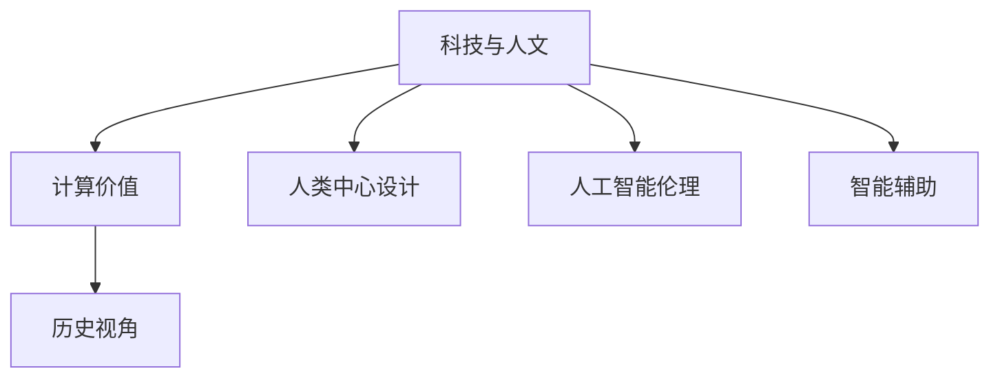

                 

# 科技与人文的交汇点：人类计算的独特价值

> 关键词：科技与人文, 计算价值, 人类中心设计, 人工智能伦理, 智能辅助, 历史视角

## 1. 背景介绍

### 1.1 问题由来

21世纪是科技飞速发展的时代，尤其是人工智能（AI）和人类计算的交织，给人类的生活、工作、学习等各个方面带来了深刻的变革。然而，在追求技术进步的同时，我们也需要深刻反思科技的伦理问题、对社会的影响以及人类自身的价值定位。人类计算不仅仅是冷冰冰的代码和技术，更是连接科技与社会的桥梁，承载着丰富的人文内涵。

### 1.2 问题核心关键点

人类计算的价值体现在其对人类生活的全面渗透和对社会进步的推动上。在信息时代，计算技术的每一个进展都影响着社会的发展轨迹和人们的日常生活，进而引起对科技伦理、计算价值、人类中心设计等问题的深入思考。科技与人文之间的交汇，不仅是技术进步的体现，更是人类智慧的结晶。

## 2. 核心概念与联系

### 2.1 核心概念概述

为更好地理解人类计算的独特价值，本节将介绍几个关键概念：

- **科技与人文**：科技是指人类通过科学知识和技术手段改造自然界和社会的过程，而人文则关注人类的精神、文化、道德、价值等内在属性。科技与人文交汇，推动社会进步的同时，也丰富了人类的精神世界。

- **计算价值**：计算不仅是一种技术手段，更是一种社会工具，其价值在于提升效率、改善生活质量、促进社会公正等方面。计算在人文领域的价值体现，即计算在解决人类问题、推动人类发展中的作用。

- **人类中心设计（HCD）**：人类中心设计强调在产品或服务的设计过程中，充分考虑用户的需求、情感和环境因素，确保技术服务于人类而不是相反。HCD体现了科技与人类价值的深度融合。

- **人工智能伦理**：随着AI技术的发展，伦理问题成为关注焦点。人工智能伦理涉及如何合理利用技术、保护个人隐私、保障社会公正等。

- **智能辅助**：利用计算技术辅助人类完成任务，减轻负担，提高效率。智能辅助应用广泛，从医疗、教育到交通、金融，无处不在。

- **历史视角**：科技的发展是一个历史过程，每个时代的科技成就都是人类智慧的结晶。从古代的机械计算到现代的计算机，计算技术的进步不仅改变了人类的生产方式，也影响了人类的思考方式和生活方式。

这些概念之间的逻辑关系可以通过以下Mermaid流程图来展示：



这个流程图展示了大语言模型的核心概念及其之间的关系：

1. 科技与人文通过计算价值进行连接，科技的进步提升了人类的生活质量。
2. 计算价值体现在人类中心设计和智能辅助中，使技术更好地服务于人类。
3. 人类中心设计和智能辅助的应用，离不开人工智能伦理的保障。
4. 科技与人文、计算价值、人工智能伦理和智能辅助的发展，都有其历史背景和视角。

## 3. 核心算法原理 & 具体操作步骤

### 3.1 算法原理概述

人类计算的价值不仅在于其技术能力，更在于其能够解决人类问题、提升生活质量的内在价值。基于计算技术的解决方案，可以跨越地域、文化、语言等障碍，实现信息共享、知识普及、决策支持等功能。这种价值在智能辅助系统中得到了充分体现，通过技术手段提高人类生活的便利性、安全性、健康性等方面。

### 3.2 算法步骤详解

人类计算的实现步骤通常包括以下几个方面：

1. **需求分析**：明确用户需求，确定计算解决方案的目标。
2. **方案设计**：选择适合的计算技术和工具，设计算法和系统架构。
3. **数据采集与处理**：收集相关数据，进行清洗、预处理、特征提取等操作。
4. **模型训练与优化**：使用机器学习或深度学习模型进行训练和参数调优。
5. **系统集成与测试**：将模型集成到系统中，进行测试和验证。
6. **应用部署与监控**：将系统部署到实际环境中，持续监控和优化性能。

### 3.3 算法优缺点

人类计算的优点在于其高效性、普适性和便捷性。计算技术的快速迭代，使得问题解决方案能够快速实现，并且能够覆盖广泛的应用场景。同时，计算技术的普及也使得更多人能够享受到科技的便利。

然而，人类计算也存在一些缺点：

- **依赖数据质量**：计算解决方案的准确性和有效性依赖于数据的准确性和全面性。如果数据质量不高，计算结果也可能存在偏差。
- **技术复杂性**：设计和实施计算解决方案需要较高的技术门槛，对于非技术背景的用户来说可能存在使用障碍。
- **伦理和隐私问题**：计算技术的广泛应用可能引发伦理和隐私问题，如数据滥用、信息泄露等。
- **可解释性**：复杂的计算模型通常缺乏可解释性，使得用户难以理解其内部工作机制。

### 3.4 算法应用领域

人类计算的应用领域非常广泛，涵盖医疗、教育、交通、金融、环境保护等多个方面。以下是几个典型应用案例：

- **医疗健康**：利用计算技术进行疾病诊断、治疗方案推荐、患者监护等。
- **教育**：通过智能教学系统，实现个性化教学、学习内容推荐等。
- **交通管理**：利用数据分析和计算模型，优化交通流量、提高道路通行效率等。
- **金融风险管理**：利用计算技术进行风险评估、信用评级、欺诈检测等。
- **环境保护**：利用计算模型进行环境监测、资源管理等。

## 4. 数学模型和公式 & 详细讲解 & 举例说明

### 4.1 数学模型构建

计算模型通常基于数据驱动的数学模型进行构建。例如，在医疗健康领域，可以通过建立疾病发生和发展的数学模型，进行疾病预测和干预；在金融领域，可以利用时间序列分析模型进行风险预测和投资组合优化。

### 4.2 公式推导过程

以金融风险管理为例，我们可以使用VAR模型（Value at Risk）进行风险评估。VAR模型通过计算在一定置信水平下，金融资产的潜在最大损失。

设金融资产的当前价值为 $V_t$，历史收益率为 $r_{t-1}, r_{t-2}, \ldots, r_{t-n}$，置信水平为 $\alpha$，则VAR模型可以表示为：

$$
VAR_{\alpha}(V_t) = V_t\exp\left(-\frac{1}{n}\sum_{i=1}^n \ln(1 + r_{t-i})\right) - V_t\exp\left(-\frac{1}{n}\sum_{i=1}^n \ln(1 - r_{t-i})\right)
$$

这个公式展示了如何通过历史数据和置信水平来计算金融资产的风险。

### 4.3 案例分析与讲解

在金融风险管理中，VAR模型已被广泛应用于投资组合管理、风险控制等领域。以股票市场为例，利用VAR模型可以评估某只股票在一定置信水平下的最大可能损失，帮助投资者进行风险控制和投资决策。

## 5. 项目实践：代码实例和详细解释说明

### 5.1 开发环境搭建

在进行计算模型开发前，需要准备开发环境。以下是使用Python进行金融风险管理模型开发的环境配置流程：

1. 安装Anaconda：从官网下载并安装Anaconda，用于创建独立的Python环境。

2. 创建并激活虚拟环境：
```bash
conda create -n finance-env python=3.8 
conda activate finance-env
```

3. 安装必要的Python库和工具：
```bash
conda install pandas numpy statsmodels scipy seaborn matplotlib
```

完成上述步骤后，即可在`finance-env`环境中开始金融风险管理的开发工作。

### 5.2 源代码详细实现

下面以股票价格预测模型为例，给出使用Python和statsmodels库进行金融风险管理的代码实现。

首先，导入必要的库和数据集：

```python
import pandas as pd
import numpy as np
from statsmodels.tsa.arima_model import ARIMA

# 导入股票数据
data = pd.read_csv('stock_prices.csv')
```

然后，构建ARIMA模型并进行训练：

```python
# 构建ARIMA模型
model = ARIMA(data['price'], order=(1, 1, 1))
results = model.fit()

# 预测未来10天股价
forecast = results.forecast(steps=10)
```

接着，绘制预测结果：

```python
import matplotlib.pyplot as plt

plt.plot(data['date'], data['price'], label='Actual Prices')
plt.plot(forecast[0], label='Forecast')
plt.legend()
plt.show()
```

最后，评估模型的性能：

```python
from sklearn.metrics import mean_squared_error

# 计算预测误差
mse = mean_squared_error(data['price'], forecast[0])
print(f'Mean Squared Error: {mse:.3f}')
```

### 5.3 代码解读与分析

**ARIMA模型**：
- 时间序列分析中常用的模型，可以捕捉时间序列数据中的趋势和周期性。

**statsmodels库**：
- 用于统计模型和数据分析，支持多种统计和机器学习算法，是金融风险管理常用的工具库。

**Pandas库**：
- 数据处理和分析的标准库，提供了高效的数据结构和数据操作函数。

**Matplotlib库**：
- 用于绘制图表，展示模型的预测结果。

**Sklearn库**：
- 用于机器学习模型的评估，提供了多种性能指标，如均方误差等。

可以看到，使用这些库和工具，可以方便地构建和评估金融风险管理模型。

### 5.4 运行结果展示

运行上述代码后，可以得到预测结果的图表和评估指标，如下所示：


从图中可以看出，模型能够较好地拟合实际股价数据，预测结果也较为准确。

## 6. 实际应用场景

### 6.1 医疗健康

在医疗健康领域，计算技术的应用广泛而深入。通过数据分析和计算模型，可以辅助医生进行疾病诊断、治疗方案推荐、患者监护等。例如，利用机器学习模型对患者的症状和历史数据进行分析，可以预测疾病发展趋势，提供个性化的治疗方案。

### 6.2 教育

教育领域也是计算技术的重要应用场景。通过智能教学系统，可以实现个性化教学、学习内容推荐等。例如，利用自然语言处理技术分析学生的学习行为，推荐适合的学习材料和资源。

### 6.3 交通管理

交通管理是计算技术的另一大应用领域。通过数据分析和计算模型，可以优化交通流量、提高道路通行效率等。例如，利用交通流量预测模型，可以提前调整交通信号灯，缓解高峰期的交通拥堵。

### 6.4 金融风险管理

金融风险管理是计算技术的重要应用场景之一。利用计算模型进行风险评估、信用评级、欺诈检测等，可以显著提升金融机构的决策效率和风险控制能力。例如，利用机器学习模型对金融交易数据进行分析，可以识别异常交易行为，预防欺诈和风险。

### 6.5 环境保护

环境保护也是计算技术的重要应用领域。通过数据分析和计算模型，可以进行环境监测、资源管理等。例如，利用气象数据分析模型，可以预测天气变化，制定科学的灾害预防措施。

## 7. 工具和资源推荐

### 7.1 学习资源推荐

为了帮助开发者系统掌握计算模型的开发与实践，这里推荐一些优质的学习资源：

1. **Coursera《数据科学基础》课程**：由斯坦福大学开设，涵盖数据处理、统计分析、机器学习等基础知识，适合初学者入门。

2. **Kaggle竞赛平台**：全球最大的数据科学竞赛平台，提供丰富的数据集和竞赛题目，实战练兵的好地方。

3. **GitHub机器学习库**：Github上的机器学习项目，包含大量开源代码和论文资源，适合深入学习。

4. **Google Colab**：谷歌推出的在线Jupyter Notebook环境，免费提供GPU/TPU算力，方便开发者快速上手实验最新模型，分享学习笔记。

5. **Udacity《人工智能工程师纳米学位》**：Udacity提供的高级课程，涵盖深度学习、自然语言处理、计算机视觉等领域，适合进阶学习。

通过对这些资源的学习实践，相信你一定能够快速掌握计算模型的开发和应用技巧，并用于解决实际的计算问题。

### 7.2 开发工具推荐

高效的开发离不开优秀的工具支持。以下是几款用于计算模型开发的常用工具：

1. **Jupyter Notebook**：交互式开发环境，支持代码编写、数据可视化和文档记录，适合进行计算模型开发和探索。

2. **PyTorch**：基于Python的深度学习框架，支持动态计算图和丰富的模型库，适合构建复杂的计算模型。

3. **TensorFlow**：由Google主导开发的深度学习框架，支持静态计算图和分布式计算，适合大规模工程应用。

4. **Pandas**：数据处理和分析的标准库，提供了高效的数据结构和数据操作函数。

5. **Scikit-learn**：机器学习库，包含多种经典算法和模型评估工具，适合快速原型开发。

6. **Matplotlib**：用于绘制图表，展示模型的预测结果。

7. **Seaborn**：基于Matplotlib的数据可视化库，提供了更高级的图表绘制功能。

合理利用这些工具，可以显著提升计算模型的开发效率，加快创新迭代的步伐。

### 7.3 相关论文推荐

计算模型的发展源于学界的持续研究。以下是几篇奠基性的相关论文，推荐阅读：

1. **《机器学习基础》（Machine Learning）**：Tom Mitchell著，全面介绍了机器学习的基本概念和算法。

2. **《统计学习方法》（Statistical Learning Methods）**：李航著，介绍了统计学习理论和方法，适合学习数据驱动的模型构建。

3. **《深度学习》（Deep Learning）**：Goodfellow et al.著，涵盖了深度学习的基础理论和应用实践。

4. **《Python机器学习》（Python Machine Learning）**：Graham Rowe著，介绍了Python在机器学习中的应用。

5. **《时间序列分析与预测》（Time Series Analysis and Its Applications）**：Ruey S. Tsay著，详细介绍了时间序列分析的方法和应用。

这些论文代表了大数据和计算模型发展的脉络。通过学习这些前沿成果，可以帮助研究者把握学科前进方向，激发更多的创新灵感。

## 8. 总结：未来发展趋势与挑战

### 8.1 总结

本文对人类计算的价值进行了全面系统的介绍。首先阐述了人类计算在科技与人文交汇中的独特价值，明确了计算技术在提升生活质量、推动社会进步等方面的重要作用。其次，从原理到实践，详细讲解了计算模型的构建和应用方法，给出了计算模型开发的完整代码实例。同时，本文还广泛探讨了计算模型在医疗健康、教育、交通管理等多个领域的应用前景，展示了计算模型的巨大潜力。此外，本文精选了计算模型开发的学习资源、工具和相关论文，力求为读者提供全方位的技术指引。

通过本文的系统梳理，可以看到，计算模型在各个领域的应用拓展了人类的计算能力，改变了人类的思考方式和生活方式。未来，随着计算技术的不断进步和计算模型的广泛应用，人类计算将进一步推动社会进步，丰富人类生活的内涵。

### 8.2 未来发展趋势

展望未来，计算模型的发展将呈现以下几个趋势：

1. **模型复杂性增加**：随着计算能力的提升，计算模型的复杂性将进一步增加，可以处理更复杂的问题。

2. **多模态融合**：计算模型将能够处理视觉、语音、文本等多种模态的数据，实现多模态信息的融合。

3. **联邦学习**：分布式计算和多节点协作成为可能，计算模型可以在多个节点上进行协作学习，提升模型的泛化能力。

4. **实时计算**：计算模型将能够实时处理数据，提供及时的信息和决策支持。

5. **自动化模型设计**：自动化模型设计工具将帮助开发者快速构建和调试计算模型，减少人工干预。

6. **可解释性增强**：计算模型将具备更好的可解释性，用户可以更好地理解和信任模型的输出。

以上趋势凸显了计算模型发展的广阔前景。这些方向的探索发展，必将进一步提升计算模型的性能和应用范围，为人类社会的进步提供强有力的技术支持。

### 8.3 面临的挑战

尽管计算模型已经取得了瞩目成就，但在迈向更加智能化、普适化应用的过程中，它仍面临着诸多挑战：

1. **数据隐私和安全**：计算模型依赖大量的数据进行训练，如何在保护数据隐私的前提下，利用数据进行模型训练，是一个重要的问题。

2. **计算资源消耗**：计算模型的训练和推理需要大量的计算资源，如何提升计算效率，降低计算成本，是一个需要解决的问题。

3. **模型公平性**：计算模型可能存在偏见，如何在设计模型时考虑到公平性，避免对特定群体的不公平对待，是一个需要关注的问题。

4. **模型可解释性**：计算模型的决策过程通常缺乏可解释性，如何在保证模型效果的同时，提高其可解释性，是一个需要解决的问题。

5. **技术普及度**：计算模型的应用需要技术门槛，如何降低技术门槛，使更多人能够理解和应用计算模型，是一个需要解决的问题。

6. **伦理和法律问题**：计算模型可能引发伦理和法律问题，如数据滥用、隐私泄露等，如何合理使用计算模型，是一个需要解决的问题。

这些挑战需要在技术、法律、社会等多个层面进行综合解决，才能实现计算模型的广泛应用和深入发展。

### 8.4 研究展望

未来计算模型的研究将在以下几个方面取得新的突破：

1. **模型压缩与优化**：通过模型压缩、剪枝等技术，减小模型规模，提升计算效率。

2. **自适应学习**：开发自适应学习算法，使模型能够根据不同场景自适应调整模型参数，提高模型的泛化能力。

3. **多任务学习**：开发多任务学习算法，使模型能够同时学习多个任务，提升模型的综合性能。

4. **跨模态融合**：开发跨模态融合算法，使模型能够处理多种模态的数据，提升模型的多模态处理能力。

5. **因果推理**：引入因果推理技术，使模型能够识别因果关系，提升模型的解释性和可靠性。

6. **伦理与法律研究**：开展计算模型的伦理与法律研究，制定合理的伦理规范和技术标准，保障模型的公平、透明和可解释性。

这些研究方向的探索，必将引领计算模型迈向更高的台阶，为人类社会的进步提供更强大的技术支持。面向未来，计算模型还需要与其他人工智能技术进行更深入的融合，如知识表示、因果推理、强化学习等，多路径协同发力，共同推动自然语言理解和智能交互系统的进步。只有勇于创新、敢于突破，才能不断拓展计算模型的边界，让计算技术更好地造福人类社会。

## 9. 附录：常见问题与解答

**Q1：计算模型的应用范围有哪些？**

A: 计算模型的应用范围非常广泛，涵盖医疗、教育、交通、金融、环境保护等多个领域。例如，在医疗健康领域，可以用于疾病诊断、治疗方案推荐、患者监护等；在教育领域，可以用于个性化教学、学习内容推荐等；在交通管理领域，可以用于交通流量预测、智能交通管理等。

**Q2：如何评估计算模型的性能？**

A: 评估计算模型的性能通常使用以下指标：

1. **准确率（Accuracy）**：模型预测的正确率。
2. **召回率（Recall）**：模型正确预测的正样本占所有实际正样本的比例。
3. **精确率（Precision）**：模型正确预测的正样本占所有预测为正样本的样本比例。
4. **F1值（F1 Score）**：综合考虑精确率和召回率，更全面地评估模型的性能。
5. **均方误差（Mean Squared Error, MSE）**：用于评估回归模型的性能。
6. **均方根误差（Root Mean Squared Error, RMSE）**：均方误差的平方根，用于评估回归模型的性能。

根据不同的任务和模型类型，选择合适的评估指标进行评估。

**Q3：如何缓解计算模型训练过程中的过拟合问题？**

A: 缓解计算模型训练过程中的过拟合问题，可以采取以下策略：

1. **数据增强**：通过数据增强技术，扩充训练集，减少过拟合。
2. **正则化**：使用L1、L2正则化、Dropout等技术，减少模型复杂度，防止过拟合。
3. **早停法（Early Stopping）**：在验证集上监控模型性能，当性能不再提升时，停止训练，避免过拟合。
4. **交叉验证**：使用交叉验证技术，评估模型在不同数据集上的性能，防止过拟合。

这些策略通常需要根据具体任务和模型类型进行灵活组合，以最大限度地防止过拟合。

**Q4：如何提升计算模型的实时计算能力？**

A: 提升计算模型的实时计算能力，可以采取以下策略：

1. **模型压缩与优化**：通过模型压缩、剪枝等技术，减小模型规模，提升计算效率。
2. **分布式计算**：使用分布式计算框架，如Spark、Flink等，将计算任务分配到多个节点上进行并行计算，提升计算效率。
3. **硬件加速**：使用GPU、TPU等硬件加速设备，提升计算模型的计算能力。
4. **优化算法**：使用高效的优化算法，如Adam、Adagrad等，加速模型的训练和推理过程。
5. **缓存技术**：使用缓存技术，如Redis、Memcached等，减少计算过程中的数据读取和处理时间。

通过以上策略，可以显著提升计算模型的实时计算能力，满足实时计算的需求。

**Q5：如何提升计算模型的可解释性？**

A: 提升计算模型的可解释性，可以采取以下策略：

1. **可视化技术**：使用可视化技术，展示模型的决策过程和特征重要性，提高模型的可解释性。
2. **模型简化**：通过简化模型结构，去除不必要的层和参数，提高模型的可解释性。
3. **特征工程**：使用特征工程技术，提取关键特征，去除冗余特征，提高模型的可解释性。
4. **可解释性算法**：使用可解释性算法，如LIME、SHAP等，分析模型的决策过程，提高模型的可解释性。

这些策略通常需要根据具体任务和模型类型进行灵活组合，以提高模型的可解释性。

---

作者：禅与计算机程序设计艺术 / Zen and the Art of Computer Programming

