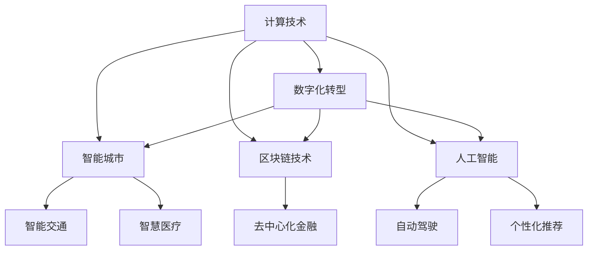

                 

## 1. 背景介绍

在人类历史的长河中，计算技术的演进始终扮演着至关重要的角色。从早期的机械计算器到现代的超级计算机，计算能力的每一次飞跃都深刻地改变了社会的面貌。随着计算技术在各个领域的广泛应用，它不仅促进了科学发现和技术进步，还深刻地影响了人类社会的组织、文化和价值观。

### 1.1 计算与人类社会的演变

计算技术的演进与人类社会的演变紧密相连。从早期的农业革命到工业革命，再到信息革命，每一次技术变革都伴随着人类社会生产方式和生活方式的根本转变。计算技术的进步，尤其是计算机的出现，不仅极大地加速了信息处理的速度，还带来了全新的商业模式和社会结构。

### 1.2 计算技术的社会影响

计算技术对社会的影响是多方面、深远的。它不仅改变了经济模式，推动了全球化和数字化进程，还促进了科学研究和教育方式的变革。此外，计算技术在医疗、交通、能源等领域的广泛应用，极大地提升了这些领域的效率和效益，改善了人们的生活质量。

然而，计算技术的快速发展也带来了新的挑战和风险。数据隐私、网络安全、算法偏见等问题逐渐成为社会关注的焦点。如何平衡技术进步与社会责任，确保计算技术造福全人类，是一个亟待解决的重要课题。

## 2. 核心概念与联系

### 2.1 核心概念概述

为更好地理解计算技术对社会的影响，我们引入以下核心概念：

- **计算技术**：从早期算盘、机械计算器到现代计算机、人工智能，计算技术的进步一直是推动社会发展的关键因素。

- **数字化转型**：数字化转型是指企业或组织通过信息技术的应用，实现业务流程、产品和服务方式的全面优化，提升运营效率和市场竞争力。

- **智能城市**：智能城市是指通过信息通信技术(ICT)的应用，实现城市治理、公共服务和市民生活的全面智能化，提升城市管理效率和市民生活质量。

- **区块链技术**：区块链是一种去中心化的分布式账本技术，具有透明、可追溯、不可篡改等特性，被广泛应用于金融、供应链、医疗等多个领域。

- **人工智能(AI)**：人工智能是指通过计算机模拟人类智能行为，实现自动推理、决策、学习等功能的高级技术。

这些概念之间的逻辑关系可以通过以下Mermaid流程图来展示：



这个流程图展示出计算技术通过多种途径深刻影响社会：

1. 通过数字化转型推动企业升级。
2. 通过智能城市提升城市管理效率。
3. 通过区块链技术实现信息安全。
4. 通过人工智能优化服务体验。

这些概念共同构成了计算技术对社会的影响框架，有助于我们全面理解其多维度的影响。

## 3. 核心算法原理 & 具体操作步骤

### 3.1 算法原理概述

计算技术的进步基于一系列算法原理的突破。这些算法原理不仅推动了计算性能的提升，还为社会的各个领域带来了革命性的变化。

- **分治算法**：分治算法通过将复杂问题分解为多个子问题，并行处理，极大地提升了计算效率。如MapReduce算法在分布式计算中的应用，极大地加速了大数据处理。

- **优化算法**：优化算法通过寻找问题的最优解，提高计算资源的利用效率。如遗传算法在生物信息学中的应用，加速了基因序列比对的计算。

- **机器学习算法**：机器学习算法通过数据驱动的学习，实现模型自动优化和预测，推动了人工智能的进步。如深度学习算法在图像识别、自然语言处理等领域的应用，极大地提升了技术精度和效率。

### 3.2 算法步骤详解

以深度学习算法为例，其核心步骤包括：

1. **数据预处理**：对原始数据进行清洗、归一化、分词等处理，以便于模型训练。
2. **模型构建**：选择合适的神经网络结构，设置合适的层数、节点数、激活函数等参数。
3. **训练优化**：使用反向传播算法更新模型参数，优化损失函数，提高模型精度。
4. **模型评估**：使用测试集评估模型性能，调整超参数，提高模型泛化能力。
5. **模型应用**：将训练好的模型应用于实际问题，实现自动化预测、分类等任务。

### 3.3 算法优缺点

深度学习算法的优点包括：

- **高精度**：深度神经网络可以通过多层次的特征提取，实现复杂的非线性映射，提升预测精度。
- **自动学习**：深度学习算法能够自动提取数据中的特征，减少手动特征工程的工作量。
- **广泛应用**：深度学习算法在图像识别、自然语言处理、语音识别等领域取得了广泛的应用，推动了技术进步。

同时，深度学习算法也存在一些缺点：

- **计算资源消耗大**：深度神经网络需要大量的计算资源进行训练，对硬件要求较高。
- **数据依赖性强**：深度学习算法的效果很大程度上依赖于训练数据的数量和质量，数据获取和标注成本较高。
- **模型复杂度高**：深度神经网络的复杂结构增加了模型的可解释性难度，难以解释其内部工作机制。

### 3.4 算法应用领域

深度学习算法在各个领域都有广泛的应用：

- **自然语言处理**：如机器翻译、文本分类、情感分析等。
- **计算机视觉**：如图像识别、物体检测、视频分析等。
- **语音识别**：如语音转文本、语音合成等。
- **推荐系统**：如商品推荐、内容推荐等。
- **智能驾驶**：如自动驾驶、辅助驾驶等。

## 4. 数学模型和公式 & 详细讲解

### 4.1 数学模型构建

深度学习算法的核心是神经网络模型。以卷积神经网络(CNN)为例，其数学模型可以表示为：

$$ y = Wx + b $$

其中，$y$ 为输出向量，$x$ 为输入向量，$W$ 为权重矩阵，$b$ 为偏置向量。

### 4.2 公式推导过程

卷积神经网络的公式推导过程包括：

1. **卷积操作**：对输入图像进行卷积操作，提取局部特征。
2. **池化操作**：对卷积后的特征图进行池化操作，减少计算量和特征维度。
3. **全连接层**：将池化后的特征图输入全连接层，进行分类或回归。

### 4.3 案例分析与讲解

以图像分类任务为例，卷积神经网络通过多层卷积和池化操作，提取图像的局部特征，并将其映射到不同的类别。在训练过程中，通过反向传播算法更新权重矩阵和偏置向量，优化损失函数，最终实现对新图像的分类。

## 5. 项目实践：代码实例和详细解释说明

### 5.1 开发环境搭建

为了实现深度学习算法，我们需要安装Python和相关的开发工具。以下是安装步骤：

1. 安装Anaconda：
```bash
wget https://repo.anaconda.com/miniconda/Miniconda3-latest-Linux-x86_64.sh
bash Miniconda3-latest-Linux-x86_64.sh
source ~/.bashrc
conda init
```

2. 创建虚拟环境：
```bash
conda create -n myenv python=3.8
conda activate myenv
```

3. 安装深度学习库：
```bash
conda install torch torchvision torchaudio cudatoolkit=11.1 -c pytorch -c conda-forge
pip install tensorflow scikit-learn pandas matplotlib
```

4. 安装可视化工具：
```bash
pip install tensorboard matplotlib
```

### 5.2 源代码详细实现

以手写数字识别为例，使用TensorFlow实现卷积神经网络。代码如下：

```python
import tensorflow as tf
from tensorflow.keras import datasets, layers, models

# 加载手写数字数据集
(train_images, train_labels), (test_images, test_labels) = datasets.mnist.load_data()

# 数据预处理
train_images = train_images / 255.0
test_images = test_images / 255.0

# 构建卷积神经网络
model = models.Sequential([
    layers.Conv2D(32, (3, 3), activation='relu', input_shape=(28, 28, 1)),
    layers.MaxPooling2D((2, 2)),
    layers.Conv2D(64, (3, 3), activation='relu'),
    layers.MaxPooling2D((2, 2)),
    layers.Flatten(),
    layers.Dense(64, activation='relu'),
    layers.Dense(10)
])

# 编译模型
model.compile(optimizer='adam',
              loss=tf.keras.losses.SparseCategoricalCrossentropy(from_logits=True),
              metrics=['accuracy'])

# 训练模型
model.fit(train_images, train_labels, epochs=5, validation_data=(test_images, test_labels))

# 评估模型
test_loss, test_acc = model.evaluate(test_images,  test_labels, verbose=2)
print('Test accuracy:', test_acc)
```

### 5.3 代码解读与分析

1. **数据加载**：使用`mnist.load_data()`加载手写数字数据集，并进行预处理。

2. **模型构建**：使用`Sequential`模型，依次添加卷积层、池化层、全连接层等，构建卷积神经网络。

3. **模型编译**：选择`adam`优化器和`SparseCategoricalCrossentropy`损失函数，设置`accuracy`指标。

4. **模型训练**：使用`fit`函数进行模型训练，设置训练轮数为5轮。

5. **模型评估**：使用`evaluate`函数评估模型性能，输出测试集的准确率。

## 6. 实际应用场景

### 6.1 医疗影像分析

计算技术在医疗影像分析中发挥了重要作用。深度学习算法可以通过图像识别技术，自动识别和分析医学影像，辅助医生进行疾病诊断。

以乳腺癌诊断为例，卷积神经网络可以通过分析乳腺X光片，自动识别乳腺癌肿瘤区域，辅助医生进行诊断决策。该技术已经在多个医疗机构中得到应用，显著提高了诊断的准确性和效率。

### 6.2 智能交通

智能交通系统通过计算技术，实现了对交通数据的实时监测和分析。深度学习算法可以通过分析交通视频，自动识别交通违规行为，优化交通信号控制，提高道路通行效率。

以自动驾驶为例，深度学习算法可以通过分析道路环境，自动识别交通标志、车道线、行人等，实现自动驾驶决策。该技术已经在多个自动驾驶测试项目中得到应用，显著提高了行车安全性和效率。

### 6.3 金融风险管理

计算技术在金融风险管理中发挥了重要作用。深度学习算法可以通过分析历史交易数据，自动识别金融市场的波动趋势，辅助投资者进行风险控制和资产配置。

以股票价格预测为例，卷积神经网络可以通过分析历史股价数据，预测未来股价变化趋势。该技术已经在多个投资机构中得到应用，显著提高了投资决策的准确性和效率。

## 7. 工具和资源推荐

### 7.1 学习资源推荐

为了帮助开发者系统掌握计算技术的应用，以下是一些优质的学习资源：

1. 《深度学习》(周志华)：该书详细介绍了深度学习的基本原理、算法、应用，适合初学者入门。

2. Coursera《深度学习专项课程》：由Andrew Ng教授讲授，涵盖深度学习的基础理论和实践技巧，是学习深度学习的经典课程。

3. Kaggle：一个开源数据科学竞赛平台，提供丰富的数据集和竞赛项目，可以实战练习深度学习算法。

4. TensorFlow官方文档：详细介绍了TensorFlow框架的使用方法，适合开发者参考学习。

5. PyTorch官方文档：详细介绍了PyTorch框架的使用方法，适合开发者参考学习。

### 7.2 开发工具推荐

以下是一些常用的计算技术开发工具：

1. Anaconda：一个开源的Python发行版，提供了虚拟环境管理、包管理等功能，适合开发者搭建开发环境。

2. TensorFlow：由Google主导开发的深度学习框架，提供了丰富的深度学习算法和工具，适合开发者实现深度学习模型。

3. PyTorch：由Facebook主导开发的深度学习框架，提供了灵活的动态计算图和高效的模型构建工具，适合开发者实现深度学习模型。

4. Keras：一个高层次的深度学习框架，提供了简洁的API接口，适合开发者快速实现深度学习模型。

5. Jupyter Notebook：一个开源的交互式编程环境，支持多种编程语言和工具，适合开发者编写和测试代码。

### 7.3 相关论文推荐

以下是一些经典的研究论文，推荐阅读：

1. AlexNet：ImageNet图像分类竞赛的冠军算法，展示了深度学习在图像分类任务上的强大能力。

2. GoogleNet：提出了Inception网络结构，进一步提升了深度学习在图像分类任务上的精度和效率。

3. VGGNet：提出了VGG网络结构，通过增加网络层数和节点数，显著提升了深度学习在图像分类任务上的性能。

4. ResNet：提出了残差网络结构，解决了深度学习模型训练过程中的梯度消失问题，进一步提升了深度学习模型的深度和精度。

5. Transformer：提出了Transformer网络结构，通过自注意力机制实现了自然语言处理任务的显著提升。

6. GAN：提出了生成对抗网络，通过对抗训练实现了高质量的图像生成和增强。

## 8. 总结：未来发展趋势与挑战

### 8.1 研究成果总结

计算技术的发展已经深刻改变了社会的各个方面，其影响之广、之深令人惊叹。从早期的算盘、计算机到现在的深度学习、人工智能，每一次技术进步都为人类社会带来了巨大的变革。计算技术的进步不仅推动了科学研究和技术的进步，还改善了人们的生活质量，推动了社会进步。

### 8.2 未来发展趋势

未来，计算技术的发展将继续引领社会的变革。以下是一些未来发展趋势：

1. **人工智能**：人工智能将成为未来科技发展的重要方向，推动各个领域的智能化进程。

2. **量子计算**：量子计算具有巨大的潜力，有望在未来解决传统计算难以处理的复杂问题。

3. **边缘计算**：边缘计算通过在数据源附近进行计算，极大地提升了数据处理的效率和安全性。

4. **区块链技术**：区块链技术具有去中心化、透明、不可篡改等特性，被广泛应用于金融、供应链等领域。

5. **智能城市**：智能城市通过信息通信技术的应用，实现城市治理、公共服务和市民生活的全面智能化。

6. **可穿戴设备**：可穿戴设备通过实时监测和分析，提升人们的生活质量，推动健康医疗的发展。

### 8.3 面临的挑战

尽管计算技术的发展带来了巨大的变革，但仍面临一些挑战：

1. **数据隐私**：数据隐私问题日益突出，如何保护用户隐私成为重要课题。

2. **算法偏见**：算法偏见问题可能导致不公正的决策，需要进一步研究和解决。

3. **计算资源**：计算资源的不足可能限制了计算技术的应用和发展。

4. **伦理问题**：计算技术的应用可能引发伦理问题，如隐私侵犯、道德冲突等。

5. **安全性**：计算技术的安全性问题日益突出，需要进一步研究和保护。

### 8.4 研究展望

未来的研究需要在以下几个方面进一步突破：

1. **计算资源优化**：通过硬件优化、算法优化等方式，提高计算效率，降低计算成本。

2. **隐私保护技术**：研究隐私保护技术，确保数据使用的安全性和隐私性。

3. **算法公平性**：研究算法公平性，减少算法偏见，推动技术公正应用。

4. **伦理监管机制**：建立伦理监管机制，确保计算技术的合法合规应用。

## 9. 附录：常见问题与解答

**Q1：计算技术的发展对社会有哪些影响？**

A: 计算技术的发展对社会的影响是多方面的。它不仅推动了科学研究和技术的进步，还改善了人们的生活质量，推动了社会进步。以下是一些具体的影响：

1. **提升生产力**：计算技术极大地提升了各个行业的生产效率，降低了生产成本。

2. **改善生活质量**：计算技术改善了医疗、教育、交通等领域的服务质量，提高了人们的生活便利性和舒适度。

3. **推动经济发展**：计算技术推动了数字经济的发展，带来了新的商业模式和就业机会。

4. **推动科学研究**：计算技术推动了科学研究的进步，加速了新理论和新发现的出现。

5. **促进社会治理**：计算技术推动了社会治理的智能化，提高了政府治理效率和社会管理水平。

**Q2：计算技术在医疗领域有哪些应用？**

A: 计算技术在医疗领域有许多重要的应用，以下是一些典型的应用：

1. **医学影像分析**：通过深度学习算法，计算技术可以自动分析和解读医学影像，辅助医生进行疾病诊断和治疗决策。

2. **药物研发**：计算技术可以模拟和预测药物的药效和副作用，加速新药的研发进程。

3. **基因组学研究**：计算技术可以分析和解读基因序列数据，揭示基因与疾病之间的关系，推动个性化医疗的发展。

4. **健康监测**：可穿戴设备和计算技术可以实时监测和分析人体健康数据，提高疾病预防和诊断的效率和准确性。

**Q3：计算技术在智能交通领域有哪些应用？**

A: 计算技术在智能交通领域有许多重要的应用，以下是一些典型的应用：

1. **自动驾驶**：通过深度学习算法，计算技术可以实现自动驾驶，提高行车安全和效率。

2. **交通信号控制**：通过计算技术，可以实现智能交通信号控制，优化交通流量，减少交通拥堵。

3. **路况分析**：通过计算技术，可以实现对道路状况的实时监测和分析，提高交通安全性和效率。

4. **车辆追踪**：通过计算技术，可以实现对车辆的实时追踪和监控，提高城市管理水平。

**Q4：计算技术在金融领域有哪些应用？**

A: 计算技术在金融领域有许多重要的应用，以下是一些典型的应用：

1. **风险管理**：通过计算技术，可以实现对金融市场的实时监测和分析，预测市场趋势，进行风险控制和资产配置。

2. **欺诈检测**：通过计算技术，可以实现对金融欺诈行为的实时监测和识别，提高金融安全性和稳定性。

3. **投资决策**：通过计算技术，可以实现对投资组合的优化和调整，提高投资回报率和风险控制。

4. **信用评估**：通过计算技术，可以实现对信用评估模型的构建和优化，提高信用评估的准确性和公平性。

**Q5：计算技术的发展面临哪些挑战？**

A: 计算技术的发展虽然带来了巨大的变革，但仍面临一些挑战：

1. **数据隐私**：数据隐私问题日益突出，如何保护用户隐私成为重要课题。

2. **算法偏见**：算法偏见问题可能导致不公正的决策，需要进一步研究和解决。

3. **计算资源**：计算资源的不足可能限制了计算技术的应用和发展。

4. **伦理问题**：计算技术的应用可能引发伦理问题，如隐私侵犯、道德冲突等。

5. **安全性**：计算技术的安全性问题日益突出，需要进一步研究和保护。

这些挑战需要在未来的研究和实践中不断克服，才能充分发挥计算技术的潜力，推动社会的进步。

---

作者：禅与计算机程序设计艺术 / Zen and the Art of Computer Programming

