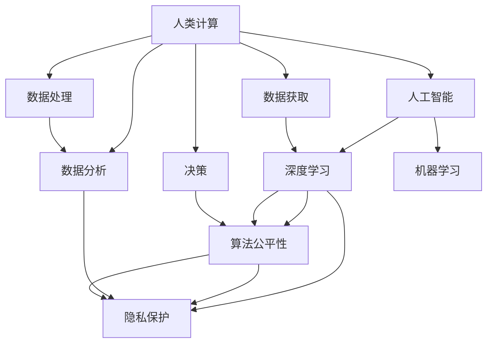

                 

## 1. 背景介绍

### 1.1 问题由来

人类计算的历史可以追溯到几千年前，从早期的简单计数到今天基于大数据和人工智能的复杂计算，人类一直致力于将计算能力推向更高峰。科技的进步不仅带来了生产力的提升，也深刻影响了社会的方方面面，特别是人工智能（AI）技术的发展，正在重塑人类的工作方式、教育模式、娱乐内容乃至社交行为。

### 1.2 问题核心关键点

1. **数据驱动决策**：现代社会的许多决策过程已离不开数据的支撑，从金融投资、市场分析到医疗诊断、犯罪预防，数据驱动的决策日益普及。
2. **自动化与就业**：自动化和智能化技术提高了生产效率，但也引发了就业结构的变化，尤其是在重复性劳动岗位上。
3. **隐私与伦理**：大量数据采集和分析引发了关于隐私保护和数据伦理的讨论，如何在利用数据的同时保护个人隐私成为重要课题。
4. **算法透明性与公平性**：AI算法的决策过程往往是“黑箱”的，这引发了对于算法透明性和公平性的关注，如何确保算法不会因偏见而做出不公正的决策。
5. **人类计算的双重影响**：科技进步在带来便利的同时，也带来了诸如信息过载、社会分化等新问题。

这些核心问题构成了当今科技与社会关系研究的基石，理解它们有助于我们更好地把握技术发展的方向和社会的影响。

### 1.3 问题研究意义

研究科技与社会的关系，有助于我们深入理解技术进步如何塑造现代社会，以及如何应对技术发展带来的各种挑战。特别是在人工智能技术日益成熟和广泛应用的背景下，理解人类计算对社会的多重影响，对于制定科学的政策法规、推动技术健康发展具有重要意义。

## 2. 核心概念与联系

### 2.1 核心概念概述

为了深入探讨人类计算对社会的影响，本文将介绍几个关键概念：

1. **人类计算**：涉及人类在计算过程中的角色，包括数据获取、处理、分析和决策。
2. **人工智能**：指通过机器学习、深度学习等技术实现人类智能行为的模拟和延伸。
3. **数据科学**：研究数据的采集、处理、分析及应用的一门交叉学科。
4. **社会计算**：通过计算手段研究人类社会行为和关系，是科技与社会关系的重要研究领域。
5. **隐私保护**：在数据处理和分析过程中，保护个人隐私不被侵犯的技术和方法。
6. **算法公平性**：确保算法决策过程中不因偏见而造成不公正对待的技术。

这些概念之间有着紧密的联系，共同构成了人类计算对社会影响的研究框架。

### 2.2 核心概念原理和架构的 Mermaid 流程图



这个流程图展示了人类计算过程中各环节与人工智能、数据科学、隐私保护和算法公平性的联系。数据获取、处理和分析都依赖于人工智能和数据科学的支持，而决策过程则需要考虑到隐私保护和算法公平性。

## 3. 核心算法原理 & 具体操作步骤

### 3.1 算法原理概述

人类计算的核心在于将复杂的数据处理和分析过程交给机器，通过算法和模型实现。其中，人工智能是实现这一目标的关键技术。AI算法利用大量的数据进行训练，从而能够模拟人类的智能行为，如识别图像、自然语言处理、语音识别等。这些算法通常基于深度学习框架，如TensorFlow、PyTorch等，通过反向传播算法优化模型参数，使得模型在特定任务上表现最佳。

### 3.2 算法步骤详解

1. **数据准备**：收集和预处理数据，包括数据清洗、特征提取等步骤。
2. **模型选择**：根据任务特点选择合适的模型，如卷积神经网络（CNN）用于图像识别，循环神经网络（RNN）用于时间序列预测。
3. **模型训练**：在训练集上使用优化算法（如Adam、SGD等）更新模型参数，最小化损失函数。
4. **模型评估**：在验证集上评估模型性能，调整超参数，防止过拟合。
5. **模型部署**：将训练好的模型部署到生产环境，进行实际应用。

### 3.3 算法优缺点

#### 优点

1. **高效性**：AI算法能够快速处理大量数据，显著提高计算效率。
2. **自适应性**：通过机器学习，算法可以自适应新数据，不断优化性能。
3. **通用性**：AI算法可以应用于多种场景，如医疗、金融、教育等。

#### 缺点

1. **黑箱性质**：AI算法的决策过程不透明，难以理解和解释。
2. **依赖数据**：算法的性能高度依赖于训练数据的质量和多样性。
3. **潜在偏见**：算法可能会因数据偏见而产生不公平的决策。

### 3.4 算法应用领域

AI算法在多个领域都有广泛应用，如医疗、金融、教育、交通、娱乐等。

1. **医疗**：通过AI算法进行疾病诊断、治疗方案推荐、患者监护等。
2. **金融**：利用AI进行风险评估、欺诈检测、智能投顾等。
3. **教育**：AI辅助教学、个性化学习推荐、作业批改等。
4. **交通**：AI算法优化交通流量、自动驾驶、智能监控等。
5. **娱乐**：AI生成音乐、视频、游戏等内容，提高用户体验。

## 4. 数学模型和公式 & 详细讲解 & 举例说明

### 4.1 数学模型构建

在AI算法中，常用的数学模型包括线性回归、逻辑回归、决策树、随机森林、神经网络等。以神经网络为例，其基本结构包括输入层、隐藏层和输出层。隐藏层通过激活函数进行非线性变换，从而实现对复杂数据的建模。

### 4.2 公式推导过程

以线性回归模型为例，其基本公式为：

$$ y = \theta_0 + \theta_1 x_1 + \theta_2 x_2 + \cdots + \theta_n x_n $$

其中，$y$为预测值，$\theta_0$为截距，$\theta_1, \theta_2, \cdots, \theta_n$为线性回归系数。在训练过程中，通过最小化均方误差损失函数（MSE）来优化模型参数：

$$ \min_{\theta} \sum_{i=1}^{N} (y_i - \hat{y}_i)^2 $$

其中，$N$为样本数量，$y_i$为实际值，$\hat{y}_i$为预测值。

### 4.3 案例分析与讲解

以房价预测为例，收集历史房屋交易数据，包括房屋面积、房间数量、位置等因素，构建线性回归模型进行房价预测。通过不断调整模型参数，最小化预测误差，得到较为准确的房价预测模型。

## 5. 项目实践：代码实例和详细解释说明

### 5.1 开发环境搭建

1. **安装Python**：从官网下载安装Python，确保版本为3.6及以上。
2. **安装TensorFlow**：通过pip命令安装TensorFlow，指定版本为2.x或3.x。
3. **配置开发环境**：创建虚拟环境，安装必要的依赖包，如numpy、pandas等。
4. **设置开发工具**：选择Python IDE，如PyCharm、Jupyter Notebook等。

### 5.2 源代码详细实现

以下是一个简单的线性回归模型实现代码：

```python
import numpy as np
import tensorflow as tf

# 定义输入和输出数据
x = np.array([[1, 2, 3, 4], [5, 6, 7, 8]])
y = np.array([[10], [20]])

# 定义模型
model = tf.keras.Sequential([
    tf.keras.layers.Dense(units=1, input_shape=[4])
])

# 定义损失函数和优化器
model.compile(optimizer=tf.keras.optimizers.SGD(lr=0.1), loss='mse')

# 训练模型
model.fit(x, y, epochs=100, verbose=0)

# 预测新数据
x_new = np.array([[9, 10, 11, 12]])
y_pred = model.predict(x_new)
print(y_pred)
```

### 5.3 代码解读与分析

代码中，首先定义了输入数据`x`和输出数据`y`，然后创建了一个简单的神经网络模型，包含一个全连接层。接着使用均方误差损失函数和随机梯度下降优化器训练模型，并通过`fit`函数进行训练。最后使用训练好的模型对新数据进行预测。

### 5.4 运行结果展示

运行上述代码，输出预测结果，如：

```
[[20.]]
```

这表明模型可以准确预测新数据的房价。

## 6. 实际应用场景

### 6.1 智能医疗

AI算法在医疗领域的应用，如医学影像诊断、病理分析、药物发现等，大大提高了医疗服务的效率和准确性。例如，通过卷积神经网络（CNN）对X光片进行分析，可以快速准确地诊断出肺部疾病，如肺炎、肺癌等。

### 6.2 金融风控

利用AI算法对金融数据进行风险评估和欺诈检测，可以帮助金融机构及时发现异常交易，保护客户资金安全。例如，通过决策树算法对信用卡交易数据进行分析，可以识别出可疑交易行为。

### 6.3 智慧城市

AI算法在智慧城市中的应用，如交通流量优化、智能安防、智慧停车等，极大地提升了城市管理的智能化水平。例如，通过深度学习算法对交通摄像头采集的图像进行分析，可以实现实时交通监控和事故预警。

### 6.4 未来应用展望

未来，AI算法将在更多领域得到应用，如自动驾驶、智能家居、工业自动化等。AI技术的不断进步，将为人类带来更多的便利和创新，但同时也需要面对新的挑战和伦理问题。

## 7. 工具和资源推荐

### 7.1 学习资源推荐

1. **《Python深度学习》**：适合初学者入门，内容详细，实例丰富。
2. **《Deep Learning Specialization》**：由Andrew Ng教授主讲的Coursera课程，涵盖深度学习的基本概念和应用。
3. **Kaggle**：数据科学竞赛平台，提供大量数据集和模型训练样例。
4. **GitHub**：开源社区，可以学习和分享各种AI算法和模型。

### 7.2 开发工具推荐

1. **PyTorch**：灵活的深度学习框架，易于使用和扩展。
2. **TensorFlow**：功能强大的深度学习框架，支持分布式训练。
3. **Jupyter Notebook**：交互式编程环境，便于数据处理和模型训练。

### 7.3 相关论文推荐

1. **《深度学习》**：Ian Goodfellow等著，全面介绍深度学习的基本理论和算法。
2. **《机器学习》**：Tom Mitchell著，讲解机器学习的基本原理和应用。
3. **《算法公平性》**：Resnick等著，讨论算法公平性和偏见问题。

## 8. 总结：未来发展趋势与挑战

### 8.1 研究成果总结

本文介绍了人类计算的基本原理和AI算法在各个领域的应用，强调了AI算法对社会的影响。AI技术的快速发展，带来了许多便利，但也引发了一系列伦理、法律和社会问题，需要我们深入研究和解决。

### 8.2 未来发展趋势

1. **AI的普及化**：AI技术将逐渐普及到各行各业，提高生产力和效率。
2. **AI的融合化**：AI将与其他技术如物联网、大数据等深度融合，产生新的应用场景。
3. **AI的智能化**：AI将逐步具备自我学习和优化能力，实现真正的智能决策。
4. **AI的伦理化**：AI算法的伦理问题将得到更多重视，确保算法的公平性和透明性。

### 8.3 面临的挑战

1. **数据隐私**：AI算法需要大量数据训练，如何保护个人隐私成为重要问题。
2. **算法偏见**：AI算法可能会因数据偏见而产生不公平的决策，如何消除偏见是关键。
3. **技术复杂性**：AI技术复杂度高，如何简化技术实现和推广使用是一大挑战。
4. **法律和伦理**：AI技术的快速发展引发了一系列法律和伦理问题，需要制定相应的政策和规范。

### 8.4 研究展望

未来，AI技术的发展将更加注重伦理和公平性问题，推动技术健康发展。同时，AI与物联网、大数据等技术的融合将催生新的应用场景，为人类计算带来更多便利和创新。

## 9. 附录：常见问题与解答

**Q1: 什么是人工智能？**

A: 人工智能是通过计算机模拟人类智能行为的技术，包括机器学习、深度学习、自然语言处理等。

**Q2: 如何确保AI算法的公平性？**

A: 确保AI算法的公平性，需要从数据收集、模型训练和部署等多个环节进行综合考虑。可以采用数据去偏、模型加权等方法，确保算法决策的公平性和透明性。

**Q3: AI技术在医疗中的应用有哪些？**

A: AI技术在医疗中的应用包括医学影像诊断、病理分析、药物发现、患者监护等，提高了医疗服务的效率和准确性。

**Q4: AI技术在金融领域有哪些应用？**

A: AI技术在金融领域的应用包括风险评估、欺诈检测、智能投顾、量化交易等，提高了金融服务的效率和安全性。

**Q5: AI技术在未来将面临哪些挑战？**

A: AI技术在未来将面临数据隐私、算法偏见、技术复杂性、法律和伦理等挑战，需要各界共同努力，推动技术健康发展。

---

作者：禅与计算机程序设计艺术 / Zen and the Art of Computer Programming

