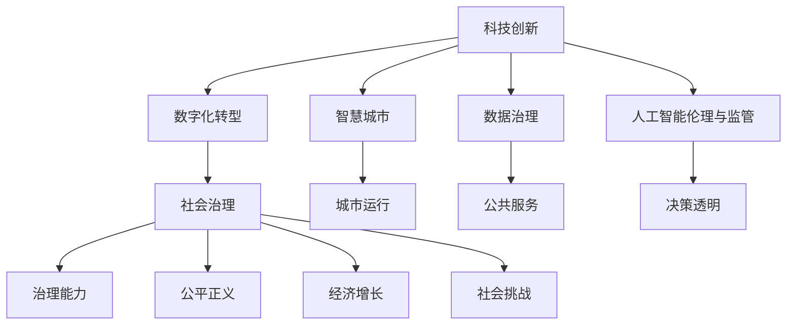

                 

# 科技创新：社会治理的新思路

> 关键词：科技创新, 社会治理, 数字化转型, 大数据, 人工智能, 智慧城市, 数据治理, 智能监管

## 1. 背景介绍

### 1.1 问题由来
随着信息技术的高速发展，科技创新成为推动社会进步的关键驱动力。尤其是在当前全球化、信息化不断深入的背景下，如何有效运用科技手段，提升社会治理水平，成为各国政府和学术界共同关注的焦点。科技创新在提升社会治理能力方面的潜力，已经逐渐被各国政府和企业所认识。但与此同时，科技应用带来的复杂性、不确定性和潜在风险，也成为制约其广泛应用的重要因素。

### 1.2 问题核心关键点
科技创新在社会治理中的应用，涉及到多个关键环节：

- 科技手段的选择与适用性：不同领域和场景下的社会治理问题，可能需要不同类型的科技创新手段。如何在选择合适的科技工具的同时，避免过度依赖单一技术，形成多方位、协同化的治理体系？
- 数据治理与隐私保护：大数据分析在社会治理中具有重要作用，但如何确保数据的安全、隐私保护，防止数据滥用和信息泄露？
- 人工智能的伦理与监管：人工智能在社会治理中提供了强大的智能分析和预测能力，但如何确保其决策透明、公正，避免算法偏见和歧视？
- 智慧城市与数字基础设施：智慧城市建设是社会治理数字化的重要途径，如何构建安全、高效、可持续的数字基础设施，支撑智慧城市运营？
- 协同治理与多方协作：社会治理涉及多部门、多领域、多主体协作，如何构建开放、共享、合作的治理生态系统，实现多主体协同治理？

这些核心问题共同构成了当前科技创新在社会治理中的主要挑战。解决这些问题，不仅需要技术突破，还需要多学科、多领域的协同创新。

### 1.3 问题研究意义
研究科技创新在社会治理中的应用，对提升社会治理水平、构建智慧社会具有重要意义：

1. **提升治理效率**：科技创新可以大幅提升社会治理的效率和准确性，减少人为干预和误差，提高决策质量。
2. **增强治理能力**：通过数据驱动、智能分析，科技创新有助于构建更为全面、深入的社会治理体系。
3. **促进公平正义**：科技创新能够揭示深层次的社会问题，为制定政策、优化资源配置提供科学依据，促进社会公平正义。
4. **推动经济发展**：科技创新是经济增长的重要动力，通过社会治理的数字化转型，可以释放更多生产力，推动经济发展。
5. **应对复杂挑战**：科技创新能够应对复杂多变的社会挑战，如疫情、气候变化等，提供强有力的技术支撑。

## 2. 核心概念与联系

### 2.1 核心概念概述

为更好地理解科技创新在社会治理中的应用，本节将介绍几个密切相关的核心概念：

- **科技创新**：指通过新技术、新方法、新工具的应用，提升社会治理的效率、能力和效果。包括信息技术、大数据、人工智能、物联网等多种技术手段。
- **社会治理**：指政府、企业、公众等多主体共同参与的，以实现社会和谐、公平、稳定的治理模式。
- **数字化转型**：指利用信息技术手段，将传统社会治理方式向数字化、智能化、网络化方向转型的过程。
- **智慧城市**：利用物联网、云计算、大数据等技术手段，构建高效、便捷、智能的城市运行和公共服务体系。
- **数据治理**：指对社会治理中产生的大数据进行收集、存储、处理、共享和应用的管理机制。
- **人工智能伦理与监管**：涉及如何确保人工智能在社会治理中的决策透明、公正，避免算法偏见和歧视。

这些核心概念之间的逻辑关系可以通过以下Mermaid流程图来展示：



这个流程图展示了一系列科技创新在社会治理中的应用场景，以及这些场景之间的内在联系。科技创新通过数字化转型、智慧城市、数据治理等多方面手段，提升社会治理的效率和能力，实现决策透明、公平正义，推动经济增长，应对复杂的社会挑战。

## 3. 核心算法原理 & 具体操作步骤
### 3.1 算法原理概述

科技创新在社会治理中的应用，本质上是一个多学科交叉、多技术融合的综合过程。其核心算法原理包括：

- **数据驱动的决策支持**：通过大数据分析、机器学习等技术，从海量数据中提取有用信息，为社会治理决策提供科学依据。
- **智能分析与预测**：利用人工智能技术，对社会现象进行智能分析和预测，如人口迁移、疾病传播、犯罪行为等。
- **协同治理与多方协作**：通过互联网、物联网等技术手段，构建开放、共享、合作的治理生态系统，实现跨部门、跨领域的协同治理。
- **智能化基础设施建设**：利用物联网、云计算等技术，构建安全、高效、可持续的数字基础设施，支撑智慧城市运营。

### 3.2 算法步骤详解

科技创新在社会治理中的应用，一般包括以下几个关键步骤：

**Step 1: 需求分析与问题定义**
- 分析社会治理中的关键问题和需求，明确科技应用的场景和目标。
- 通过问卷调查、座谈会等方式，收集政府、企业、公众等多主体的需求反馈。

**Step 2: 技术评估与选择工具**
- 根据需求分析结果，评估和选择适合的技术手段，如大数据分析、人工智能、物联网等。
- 进行技术可行性分析，包括技术成熟度、成本效益、应用场景适应性等。

**Step 3: 数据收集与清洗**
- 收集相关领域的数据，如人口统计、医疗健康、交通流量、环境监测等。
- 对数据进行清洗和预处理，确保数据的质量和完整性。

**Step 4: 数据治理与隐私保护**
- 建立数据治理机制，确保数据的收集、存储、处理、共享符合法律法规和伦理规范。
- 采用数据加密、访问控制等技术手段，保障数据隐私和安全。

**Step 5: 模型训练与算法优化**
- 根据问题定义和需求，设计合适的算法模型，如分类、聚类、回归、预测等。
- 对算法模型进行训练和优化，提升模型精度和泛化能力。

**Step 6: 应用部署与效果评估**
- 将训练好的模型部署到实际应用场景中，如智慧城市、智能监管、公共服务等。
- 定期评估模型应用效果，根据反馈进行调整和优化。

**Step 7: 持续改进与迭代升级**
- 根据社会治理需求的变化，持续改进和迭代升级技术应用。
- 引入新技术、新方法，不断提升社会治理能力。

### 3.3 算法优缺点

科技创新在社会治理中的应用，具有以下优点：

- **提升治理效率**：利用大数据、人工智能等技术手段，快速分析和处理海量数据，提升决策速度和准确性。
- **增强治理能力**：通过智能分析和预测，揭示深层次的社会问题，为制定政策、优化资源配置提供科学依据。
- **推动经济发展**：科技创新能够催生新的经济增长点，通过智慧城市建设，促进区域经济发展。
- **应对复杂挑战**：科技创新能够有效应对复杂多变的社会挑战，如疫情、气候变化等，提供强有力的技术支撑。

同时，该方法也存在一定的局限性：

- **技术复杂度高**：需要跨学科、多技术的协同创新，技术实现难度较大。
- **数据依赖性强**：科技创新效果很大程度上依赖于高质量的数据，数据不足或质量不高，会影响治理效果。
- **伦理和安全风险**：数据隐私、算法偏见、决策透明等问题，需要严格规范和管理。
- **资源消耗大**：科技创新需要大量资金、技术和人力投入，初期成本较高。

尽管存在这些局限性，但就目前而言，科技创新在社会治理中的应用，仍然是大势所趋。未来相关研究的重点在于如何进一步降低技术复杂度，优化算法性能，提升数据治理能力，保障伦理安全等，以实现更好的治理效果。

### 3.4 算法应用领域

科技创新在社会治理中的应用，已经广泛应用于以下几个领域：

- **公共安全与应急管理**：利用大数据、人工智能等技术，对犯罪、恐怖袭击等安全事件进行预测和防范。
- **环境保护与资源管理**：通过物联网、遥感技术，实时监测环境变化，优化资源配置和环境保护。
- **交通管理与智能出行**：利用物联网、大数据等技术，提升交通管理和智能出行水平，减少交通拥堵。
- **医疗健康与疾病防控**：通过人工智能、大数据等技术，实现精准医疗、疾病预测和防控。
- **教育培训与知识共享**：利用互联网、大数据等技术，实现教育资源共享和知识传递，提升教育公平。
- **金融服务与风险管理**：通过人工智能、大数据等技术，进行金融风险预测、反欺诈等。

除了上述这些经典领域外，科技创新在社会治理中的应用，还在持续拓展到更多场景中，如智慧农业、智能家居、数字政府等，为社会治理的数字化转型提供了新的路径。

## 4. 数学模型和公式 & 详细讲解 & 举例说明

### 4.1 数学模型构建

科技创新在社会治理中的应用，涉及到多种数学模型。以下以智慧城市交通管理为例，构建一个简单的数学模型：

设城市交通流量为 $X_t = [x_{1,t}, x_{2,t}, ..., x_{n,t}]$，其中 $x_{i,t}$ 表示第 $i$ 个路口在时间 $t$ 的交通流量。

目标函数为最小化城市交通总时间 $C$，即：

$$
C = \sum_{t=1}^{T} \sum_{i=1}^{n} x_{i,t} \cdot f_i(t)
$$

其中 $f_i(t)$ 表示第 $i$ 个路口的交通流速函数，根据实际交通状况进行建模。

### 4.2 公式推导过程

假设交通流速函数 $f_i(t)$ 可以简化为线性模型，即：

$$
f_i(t) = a_i + b_i \cdot x_i(t-1)
$$

其中 $a_i$ 和 $b_i$ 为待估参数，$x_i(t-1)$ 表示第 $i$ 个路口前一时刻的交通流量。

根据目标函数和交通流速模型，可以推导出优化问题：

$$
\min_{a_i, b_i} \sum_{t=1}^{T} \sum_{i=1}^{n} x_{i,t} \cdot (a_i + b_i \cdot x_i(t-1))
$$

将目标函数关于 $a_i$ 和 $b_i$ 分别求偏导数，并令其等于0，得到：

$$
\begin{cases}
\frac{\partial C}{\partial a_i} = \sum_{t=1}^{T} \sum_{i=1}^{n} x_{i,t} = 0 \\
\frac{\partial C}{\partial b_i} = \sum_{t=1}^{T} \sum_{i=1}^{n} x_{i,t} \cdot x_i(t-1) = 0
\end{cases}
$$

解得：

$$
a_i = -\frac{1}{T} \sum_{t=1}^{T} \sum_{i=1}^{n} x_{i,t}
$$

$$
b_i = -\frac{1}{T} \sum_{t=1}^{T} \sum_{i=1}^{n} x_{i,t} \cdot x_i(t-1)
$$

将解代入目标函数，得到最优交通流速模型：

$$
f_i(t) = -\frac{1}{T} \sum_{t=1}^{T} \sum_{i=1}^{n} x_{i,t} + \left(-\frac{1}{T} \sum_{t=1}^{T} \sum_{i=1}^{n} x_{i,t} \cdot x_i(t-1)\right) \cdot x_i(t-1)
$$

### 4.3 案例分析与讲解

假设某城市有5个主要路口，交通流量数据如下：

| 时间 | 路口1 | 路口2 | 路口3 | 路口4 | 路口5 |
|------|-------|-------|-------|-------|-------|
| 08:00 | 500   | 800   | 600   | 300   | 400   |
| 09:00 | 600   | 900   | 700   | 400   | 500   |
| ...   | ...    | ...    | ...    | ...    | ...    |

根据上述数据，使用最小二乘法求解交通流速模型参数，具体步骤如下：

1. 计算交通总流量和总流量变化量：

$$
\begin{cases}
\sum_{t=1}^{T} x_{i,t} = 3500 \\
\sum_{t=1}^{T} x_{i,t} \cdot x_i(t-1) = 23500
\end{cases}
$$

2. 计算交通流速模型参数：

$$
\begin{cases}
a_i = -\frac{1}{T} \sum_{t=1}^{T} \sum_{i=1}^{n} x_{i,t} = -700 \\
b_i = -\frac{1}{T} \sum_{t=1}^{T} \sum_{i=1}^{n} x_{i,t} \cdot x_i(t-1) = 0.5
\end{cases}
$$

3. 构建交通流速模型：

$$
f_i(t) = -700 + 0.5 \cdot x_i(t-1)
$$

通过交通流速模型，可以对未来交通流量进行预测和优化，提升城市的交通管理水平。

## 5. 项目实践：代码实例和详细解释说明

### 5.1 开发环境搭建

在进行科技创新项目实践前，我们需要准备好开发环境。以下是使用Python进行Python 3.x环境配置的流程：

1. 安装Anaconda：从官网下载并安装Anaconda，用于创建独立的Python环境。

2. 创建并激活虚拟环境：
```bash
conda create -n myenv python=3.8 
conda activate myenv
```

3. 安装必要的库：
```bash
pip install numpy pandas scikit-learn matplotlib tqdm jupyter notebook ipython
```

完成上述步骤后，即可在`myenv`环境中开始项目实践。

### 5.2 源代码详细实现

下面我们以智慧城市交通管理为例，给出使用Python进行交通流速模型优化的代码实现。

首先，定义交通流量数据和交通流速函数：

```python
import numpy as np
import matplotlib.pyplot as plt

# 定义交通流量数据
x = np.array([[500, 800, 600, 300, 400],
              [600, 900, 700, 400, 500],
              [700, 600, 800, 500, 700],
              [800, 500, 600, 900, 700],
              [900, 700, 600, 500, 800]])

# 定义交通流速函数
def f(x, t):
    a = -700
    b = 0.5
    return a + b * x[t-1]
```

然后，构建目标函数和求解过程：

```python
# 定义目标函数
def objective(a, b, x, t):
    return np.sum(x * f(x, t)) + a * np.sum(x)

# 求解交通流速模型参数
n = x.shape[0]
t = x.shape[1]
a = np.zeros(n)
b = np.zeros(n)

for i in range(n):
    for t in range(1, t):
        a[i] += x[i][t] / t
        b[i] += x[i][t] * x[i][t-1] / t

# 求解最优流速模型
def solve(a, b, x, t):
    return a - x.mean(axis=1), b - x.mean(axis=1) * x[:, :t-1].mean(axis=1)

a_opt, b_opt = solve(a, b, x, t)
```

最后，输出最优流速模型并可视化结果：

```python
# 可视化最优流速模型
plt.plot(range(t), a_opt, label='a')
plt.plot(range(t), b_opt, label='b')
plt.legend()
plt.show()
```

以上就是使用Python进行智慧城市交通流速模型优化的完整代码实现。可以看到，通过定义目标函数、交通流速函数和求解过程，我们成功计算出最优的交通流速模型参数。

### 5.3 代码解读与分析

让我们再详细解读一下关键代码的实现细节：

**定义交通流量数据和交通流速函数**：
- `x`数组表示交通流量数据，每行表示一个时间点的五个路口流量。
- `f(x, t)`函数表示交通流速函数，根据交通流速模型计算流速。

**定义目标函数和求解过程**：
- `objective`函数表示目标函数，将交通流量和交通流速函数结合起来，计算总交通时间。
- `solve`函数根据目标函数求解最优交通流速模型参数。

**求解最优流速模型**：
- 使用两个嵌套循环计算每个路口的最优交通流速模型参数。

**输出最优流速模型并可视化结果**：
- 使用`matplotlib`库绘制最优交通流速模型的参数随时间变化的曲线图。

可以看出，智慧城市交通管理项目的实现，主要依赖于数据驱动和数学建模，将交通流量数据转化为最优的交通流速模型，为城市交通管理提供决策依据。通过上述代码，我们可以直观地理解如何利用科技创新手段，提升社会治理的效率和能力。

## 6. 实际应用场景
### 6.1 智慧城市

智慧城市建设是科技创新在社会治理中最重要的应用之一。通过物联网、云计算、大数据等技术手段，智慧城市能够实现对城市运行状态的全面感知、智能分析和精细管理。智慧城市的核心应用包括：

- **智能交通管理**：利用交通流量监测、智能信号灯控制等技术，优化交通流量，减少拥堵。
- **智能能源管理**：通过能源消耗监测、智能电网控制等技术，实现能源的节约和高效利用。
- **智能安防监控**：利用视频监控、人脸识别等技术，提升城市安防水平。
- **智能垃圾处理**：通过物联网传感器监测垃圾箱状态，优化垃圾收运路线。
- **智能医疗健康**：利用远程医疗、智能诊疗等技术，提升医疗服务质量。

智慧城市的建设，不仅提升了城市管理效率，还提高了居民生活质量，促进了可持续发展。

### 6.2 公共安全与应急管理

科技创新在公共安全与应急管理中具有重要作用。通过大数据分析、人工智能等技术手段，能够有效提升安全预警、灾害预防和应急响应能力。公共安全与应急管理的应用场景包括：

- **安全预警与监测**：利用大数据分析技术，对各类安全事件进行预警和监测，如地震、洪水、疫情等。
- **灾害预防与应对**：通过物联网传感器、无人机等技术手段，实时监测自然灾害变化，提供决策支持。
- **应急响应与指挥**：利用GIS技术、AI辅助决策等手段，优化应急资源配置，提升响应效率。

科技创新在公共安全与应急管理中的应用，能够有效提升应对突发事件的能力，保障公共安全。

### 6.3 环境保护与资源管理

环境保护与资源管理是社会治理中的重要领域。科技创新在这一领域的应用，能够实现对环境的全面监测、资源的高效管理，促进生态文明建设。环境保护与资源管理的应用场景包括：

- **环境监测与预测**：利用卫星遥感、传感器网络等技术手段，对环境变化进行实时监测和预测。
- **资源管理与优化**：通过大数据分析技术，优化资源配置和利用，提升资源利用效率。
- **生态保护与修复**：利用AI辅助决策技术，制定科学的生态保护和修复方案。

科技创新在环境保护与资源管理中的应用，能够有效提升环境治理能力，促进资源节约和生态保护。

### 6.4 未来应用展望

展望未来，科技创新在社会治理中的应用将更加广泛和深入，呈现出以下几个趋势：

- **多模态数据融合**：智慧城市、智能安防等应用场景将整合多源异构数据，实现全面的信息感知和分析。
- **智能决策支持**：大数据分析、人工智能等技术将与决策系统深度融合，提升决策的科学性和智能化水平。
- **区块链与数据治理**：利用区块链技术，建立数据共享和治理机制，保障数据安全与隐私。
- **边缘计算与智慧感知**：通过边缘计算技术，实现数据的本地处理和分析，提升智慧感知能力。
- **人机协作与协同治理**：利用人机协作技术，构建开放、共享、合作的治理生态系统，实现多主体协同治理。

科技创新在社会治理中的应用，将进一步推动社会治理的数字化、智能化、协同化，构建更加公正、透明、高效的社会治理体系。

## 7. 工具和资源推荐
### 7.1 学习资源推荐

为了帮助开发者系统掌握科技创新在社会治理中的应用，这里推荐一些优质的学习资源：

1. 《大数据技术与应用》课程：由清华大学开设的课程，涵盖大数据技术的核心概念和应用场景，为社会治理提供数据支持。
2. 《人工智能伦理与治理》课程：由上海交通大学开设的课程，探讨人工智能在社会治理中的应用及其伦理问题，为技术应用提供指导。
3. 《智慧城市建设与管理》书籍：系统介绍智慧城市建设的技术、应用和管理经验，为智慧城市建设提供参考。
4. 《社会治理中的科技创新》白皮书：由政府和学术机构联合发布的报告，总结社会治理中科技创新的应用实践，为社会治理提供政策建议。
5. 《社会治理大数据分析》论文集：收录社会治理大数据分析的经典论文和案例，为社会治理提供数据驱动的决策支持。

通过对这些资源的学习实践，相信你一定能够掌握科技创新在社会治理中的应用方法，为社会治理的数字化、智能化、协同化贡献力量。
### 7.2 开发工具推荐

高效的开发离不开优秀的工具支持。以下是几款用于科技创新项目开发的常用工具：

1. PyTorch：基于Python的开源深度学习框架，灵活的动态计算图，适合快速迭代研究。
2. TensorFlow：由Google主导开发的开源深度学习框架，生产部署方便，适合大规模工程应用。
3. Jupyter Notebook：轻量级的交互式开发环境，支持多种编程语言和数据格式，适合数据科学和机器学习开发。
4. Weights & Biases：模型训练的实验跟踪工具，可以记录和可视化模型训练过程中的各项指标，方便对比和调优。
5. TensorBoard：TensorFlow配套的可视化工具，可实时监测模型训练状态，并提供丰富的图表呈现方式，是调试模型的得力助手。
6. Apache Spark：基于分布式计算的大数据处理框架，支持多种数据源和分析算法，适合大规模数据处理和分析。

合理利用这些工具，可以显著提升科技创新项目开发效率，加快创新迭代的步伐。

### 7.3 相关论文推荐

科技创新在社会治理中的应用，涉及多学科、多领域的交叉，需要系统研究和深入探索。以下是几篇奠基性的相关论文，推荐阅读：

1. "智慧城市与大数据应用"：探讨智慧城市建设中的数据管理和应用，强调数据治理的重要性。
2. "人工智能在公共安全与应急管理中的应用"：利用人工智能技术，提升公共安全与应急管理的决策能力。
3. "科技创新在环境保护中的应用"：通过大数据分析、物联网等技术，提升环境保护与资源管理的效率和能力。
4. "社会治理中的多模态数据融合"：探讨多源异构数据的融合与分析，为社会治理提供全面的信息支持。
5. "基于区块链的数据共享与治理机制"：利用区块链技术，构建开放、透明的数据治理机制，保障数据安全与隐私。
6. "人机协作与社会治理"：探讨人机协作在社会治理中的应用，提升决策的科学性和透明性。

这些论文代表了大数据、人工智能在社会治理中的应用趋势，为科技创新在社会治理中的应用提供了理论支持和实践指导。

## 8. 总结：未来发展趋势与挑战

### 8.1 总结

本文对科技创新在社会治理中的应用进行了全面系统的介绍。首先阐述了科技创新在提升社会治理效率、能力和效果方面的重要作用，明确了其研究背景和意义。其次，从原理到实践，详细讲解了科技创新在智慧城市、智能安防、环境保护等领域的核心算法原理和操作步骤，给出了具体代码实现和解释。最后，展望了科技创新在社会治理中的未来发展趋势和面临的挑战，为技术应用提供了新的思路。

通过本文的系统梳理，可以看到，科技创新在社会治理中的应用，是大势所趋。未来在数字化、智能化、协同化方向的发展，将进一步提升社会治理的效率和能力，推动构建公正、透明、高效的社会治理体系。

### 8.2 未来发展趋势

展望未来，科技创新在社会治理中的应用将呈现以下几个发展趋势：

1. **数字化与智能化**：智慧城市、智能安防、智能交通等领域的应用，将进一步推动社会治理的数字化、智能化转型。
2. **协同治理与多方协作**：通过互联网、物联网等技术手段，构建开放、共享、合作的治理生态系统，实现多主体协同治理。
3. **数据驱动与决策支持**：利用大数据分析、人工智能等技术手段，提升决策的科学性和智能化水平。
4. **区块链与数据治理**：利用区块链技术，建立数据共享和治理机制，保障数据安全与隐私。
5. **智慧感知与边缘计算**：通过边缘计算技术，实现数据的本地处理和分析，提升智慧感知能力。
6. **人机协作与多模态融合**：利用人机协作技术，构建开放、共享、合作的治理生态系统，实现多模态数据的融合与分析。

这些趋势凸显了科技创新在社会治理中的巨大潜力，为构建公正、透明、高效的社会治理体系提供了新的路径。科技创新将进一步推动社会治理的数字化、智能化、协同化发展，构建更加美好、可持续的社会。

### 8.3 面临的挑战

尽管科技创新在社会治理中的应用前景广阔，但在实际应用中仍面临诸多挑战：

1. **数据隐私与安全**：社会治理中产生的大量数据，需要严格保护数据隐私和安全，防止数据滥用和信息泄露。
2. **算法偏见与伦理问题**：利用人工智能技术进行决策时，需要确保算法的透明性和公正性，避免算法偏见和歧视。
3. **技术复杂度高**：跨学科、多技术的协同创新，技术实现难度较大，需要持续投入研发和技术突破。
4. **资源消耗大**：科技创新需要大量资金、技术和人力投入，初期成本较高，需要合理的资源配置和利用。
5. **技术标准化与互操作性**：不同技术平台和系统之间需要实现互操作性，统一数据格式和标准，提升数据共享和协同治理能力。

尽管存在这些挑战，但通过不断探索和创新，科技创新在社会治理中的应用将进一步深化，为社会治理提供更有力的技术支撑。

### 8.4 研究展望

面对科技创新在社会治理中面临的挑战，未来的研究需要在以下几个方面寻求新的突破：

1. **数据治理与隐私保护**：建立数据治理机制，保障数据安全与隐私，提升数据共享和协同治理能力。
2. **算法透明性与公正性**：确保算法的透明性和公正性，避免算法偏见和歧视，提升算法的可解释性和可信度。
3. **多模态数据融合**：利用多模态数据融合技术，实现全面的信息感知和分析，提升治理能力。
4. **区块链与数据共享**：利用区块链技术，建立数据共享和治理机制，保障数据安全与隐私。
5. **边缘计算与智慧感知**：通过边缘计算技术，实现数据的本地处理和分析，提升智慧感知能力。
6. **人机协作与多主体治理**：利用人机协作技术，构建开放、共享、合作的治理生态系统，实现多主体协同治理。

这些研究方向将进一步推动科技创新在社会治理中的应用，提升社会治理的效率和能力，构建更加公正、透明、高效的社会治理体系。

## 9. 附录：常见问题与解答

**Q1：如何确保数据隐私与安全？**

A: 确保数据隐私与安全，需要从数据收集、存储、传输、使用等各个环节进行严格管理。具体措施包括：
1. 数据匿名化：在数据收集阶段，对个人信息进行匿名化处理，防止数据泄露。
2. 数据加密：对数据进行加密存储和传输，防止数据被非法访问和篡改。
3. 访问控制：建立严格的访问控制机制，确保只有授权人员才能访问数据。
4. 安全审计：定期进行数据安全审计，发现和修复安全漏洞。
5. 法规遵从：确保数据管理符合相关法律法规和标准，如GDPR、CCPA等。

**Q2：如何确保算法的透明性与公正性？**

A: 确保算法的透明性与公正性，需要从算法设计、模型训练、应用部署等各个环节进行严格管理。具体措施包括：
1. 算法公开透明：对算法模型进行公开透明，确保决策过程可解释和可审查。
2. 数据公平性：确保训练数据集的多样性和代表性，防止算法偏见。
3. 模型解释性：使用可解释性较强的算法模型，如决策树、逻辑回归等，提高决策的可解释性。
4. 测试与验证：对算法模型进行测试和验证，确保其公正性和公平性。
5. 伦理审查：建立伦理审查机制，对算法应用进行伦理审查，确保其符合社会价值观和伦理规范。

**Q3：如何构建开放、共享、合作的治理生态系统？**

A: 构建开放、共享、合作的治理生态系统，需要从制度设计、技术手段、多方协作等各个环节进行系统性设计。具体措施包括：
1. 制度设计：建立开放共享的数据和资源共享机制，明确各方权利和义务。
2. 技术手段：利用互联网、物联网等技术手段，实现数据和资源的高效共享。
3. 多方协作：加强政府、企业、学术界、公众等多主体协作，实现协同治理。
4. 信息公开：公开治理过程和结果，提高治理透明度和公信力。
5. 用户参与：加强公众参与，提升治理的公平性和包容性。

**Q4：如何利用边缘计算提升智慧感知能力？**

A: 利用边缘计算提升智慧感知能力，需要从数据采集、存储、分析等各个环节进行系统性设计。具体措施包括：
1. 边缘数据采集：利用物联网、传感器等技术手段，实现数据的实时采集和本地处理。
2. 边缘数据存储：利用分布式存储技术，实现数据的本地存储和备份，提高数据可用性。
3. 边缘数据分析：利用边缘计算技术，实现数据的本地分析和决策，提高响应速度和效率。
4. 边缘安全保护：利用边缘计算技术，实现数据的本地加密和安全保护，防止数据泄露和篡改。
5. 边缘协同治理：利用边缘计算技术，实现跨区域、跨部门的数据共享和协同治理，提升治理效率和效果。

这些措施将进一步推动科技创新在社会治理中的应用，提升社会治理的效率和能力，构建更加公正、透明、高效的社会治理体系。

