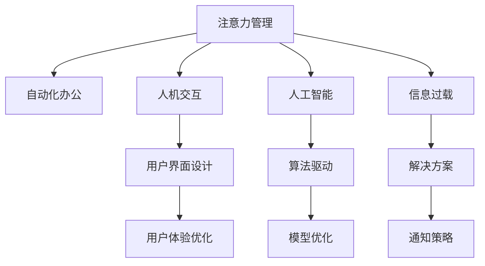

                 

# 移动办公软件的注意力管理功能

> 关键词：移动办公软件, 注意力管理, 人工智能, 人机交互, 自动化

## 1. 背景介绍

### 1.1 问题由来
在数字化的时代，移动办公软件已经成为企业和个人日常工作不可或缺的工具。然而，这些工具在提高工作效率的同时，也带来了注意力管理的挑战。研究表明，频繁的中断和信息过载会导致员工注意力分散，降低工作效率。为了解决这一问题，越来越多的移动办公软件开始引入注意力管理功能。

### 1.2 问题核心关键点
移动办公软件的注意力管理功能，旨在通过技术手段，帮助用户有效管理注意力，减少干扰，提升工作效率。其主要包括以下几个关键点：

- 自动化：利用AI技术自动分析用户工作状态和习惯，预测可能的干扰源，并提前介入。
- 个性化：根据用户偏好和习惯，定制化推荐合适的通知方式和时间，以最小化对注意力的干扰。
- 数据驱动：通过收集用户行为数据，分析注意力管理的最佳策略，不断优化系统。
- 多模态：结合文本、语音、图像等多种信息源，提供全方位的注意力管理解决方案。
- 用户友好：界面简洁，操作方便，符合用户习惯，减少学习成本。

## 2. 核心概念与联系

### 2.1 核心概念概述

为更好地理解移动办公软件的注意力管理功能，本节将介绍几个密切相关的核心概念：

- 注意力管理(Attention Management)：指通过技术手段，自动优化用户的注意力分配，减少干扰，提升工作和学习效率。
- 人机交互(Human-Computer Interaction, HCI)：研究人如何与计算机系统交互，设计用户友好的界面和交互流程，提升用户体验。
- 人工智能(Artificial Intelligence, AI)：利用算法和模型，模拟人类智能，解决复杂问题，提升自动化水平。
- 自动化办公(Automated Office)：通过软件和系统，自动化处理日常办公任务，减轻人工负担，提升工作效率。
- 信息过载(Information Overload)：指用户在短时间内接收的信息量过大，超出处理能力，导致注意力分散，效率降低。

这些核心概念之间的逻辑关系可以通过以下Mermaid流程图来展示：



这个流程图展示了这个系统的核心概念及其之间的关系：

1. 注意力管理作为核心，通过自动化办公和AI技术，预测干扰源，优化通知策略。
2. 人机交互和用户界面设计，确保系统易于使用，减少学习成本。
3. 人工智能和模型优化，为系统的自动化和智能化提供支持。
4. 信息过载作为问题背景，通过注意力管理解决方案，有效解决。

## 3. 核心算法原理 & 具体操作步骤

### 3.1 算法原理概述

移动办公软件的注意力管理功能，核心依赖于两个方面：用户行为分析和人机交互优化。具体算法原理如下：

1. **用户行为分析**：通过收集用户的行为数据，如点击率、操作频率、停留时间等，使用统计分析和机器学习算法，构建用户行为模型。该模型能够预测用户的工作状态，识别潜在的注意力干扰源。

2. **人机交互优化**：利用UI/UX设计原则和心理学原理，设计出符合用户习惯的界面和交互方式，减少用户认知负荷。同时，通过智能通知系统，动态调整通知的频率和形式，最小化对用户注意力的干扰。

### 3.2 算法步骤详解

移动办公软件的注意力管理功能实现流程，主要包括以下几个步骤：

**Step 1: 数据采集与预处理**
- 收集用户在移动办公软件上的操作日志，包括点击、滑动、输入等行为数据。
- 对数据进行清洗和预处理，去除异常值和噪音数据，确保分析结果的可靠性。

**Step 2: 用户行为建模**
- 使用统计分析方法，如均值、方差、回归分析等，初步探索用户行为规律。
- 应用机器学习算法，如聚类分析、决策树、神经网络等，构建用户行为模型，预测用户的工作状态和注意力需求。

**Step 3: 干扰源识别与分类**
- 根据用户行为模型，识别出潜在的注意力干扰源，如邮件通知、即时消息、任务提醒等。
- 将干扰源分为高、中、低优先级，并制定相应的通知策略。

**Step 4: 个性化通知策略**
- 根据用户偏好和习惯，定制化推荐合适的通知方式和时间，如静音通知、震动提醒、弹出窗口等。
- 对于高优先级的干扰源，优先推送，确保用户及时响应。

**Step 5: 实时监控与反馈优化**
- 实时监控用户行为，根据反馈数据调整通知策略，提升系统效果。
- 收集用户对通知策略的满意度反馈，不断优化模型和算法。

**Step 6: 界面设计优化**
- 结合心理学和UI设计原则，设计简洁、直观的界面，减少用户学习成本。
- 对用户界面进行A/B测试，优化用户体验。

### 3.3 算法优缺点

移动办公软件的注意力管理功能具有以下优点：
1. 提升工作效率：通过减少干扰，优化通知策略，提升用户的工作效率。
2. 个性化适配：根据用户偏好和习惯，定制化推荐通知方式，提升用户满意度。
3. 数据驱动：通过收集用户行为数据，不断优化系统，提升准确性。
4. 用户友好：界面简洁，操作方便，符合用户习惯，减少学习成本。

同时，该算法也存在一定的局限性：
1. 依赖数据质量：系统效果依赖于数据质量，数据的准确性和完整性直接影响模型的预测效果。
2. 隐私保护：需要收集用户行为数据，存在隐私保护的问题，用户可能对数据泄露感到担忧。
3. 复杂度较高：系统的实现和维护需要高水平的技术能力和资源投入。
4. 适配性差：对于某些特定任务，系统的适配性可能不足，需要进一步优化。

尽管存在这些局限性，但就目前而言，基于人工智能的注意力管理方法在提升移动办公软件的用户体验和效率方面已经展现出了巨大的潜力。未来相关研究的重点在于如何进一步提高算法的准确性和鲁棒性，同时兼顾用户隐私和数据安全。

### 3.4 算法应用领域

移动办公软件的注意力管理功能，已经在多个领域得到了应用，例如：

- 项目管理：通过识别干扰源，优化任务提醒，提高项目管理效率。
- 知识管理：识别学习路径上的干扰源，动态调整学习资源，提升学习效果。
- 客户服务：通过分析客户交互数据，预测客户需求，优化服务响应，提升客户满意度。
- 供应链管理：识别供应链中的瓶颈和干扰因素，优化通知策略，提升供应链效率。
- 健康管理：识别健康监测中的异常信号，优化提醒策略，提升健康管理效果。

除了上述这些经典应用外，注意力管理功能还被创新性地应用到更多场景中，如智能助手、智能家居等，为用户带来了全新的办公和生活体验。

## 4. 数学模型和公式 & 详细讲解 & 举例说明

### 4.1 数学模型构建

本节将使用数学语言对移动办公软件的注意力管理功能进行更加严格的刻画。

假设用户在移动办公软件上进行操作，行为数据记为 $X$，操作的时间戳记为 $T$。用户行为模型记为 $f(X)$，干扰源识别模型记为 $g(X)$，个性化通知策略记为 $h(T)$。则注意力管理系统的整体流程可以表示为：

1. 数据采集：$D = \{(X_i, T_i)\}_{i=1}^N$，其中 $X_i$ 表示第 $i$ 个行为数据，$T_i$ 表示对应的时间戳。
2. 用户行为分析：$f(X) = \hat{X}_i$，其中 $\hat{X}_i$ 表示用户行为模型对 $X_i$ 的预测。
3. 干扰源识别：$g(X) = \hat{G}_i$，其中 $\hat{G}_i$ 表示干扰源识别模型对 $X_i$ 的预测。
4. 个性化通知：$h(T) = \hat{H}_i$，其中 $\hat{H}_i$ 表示个性化通知策略对 $T_i$ 的处理。
5. 实时监控与反馈：根据用户行为数据和通知效果反馈，更新模型和策略。

### 4.2 公式推导过程

以下我们以项目管理为例，推导注意力管理系统的基本流程。

假设用户在项目管理软件中，操作行为数据 $X = [x_1, x_2, \cdots, x_n]$，其中 $x_i$ 表示第 $i$ 个操作。用户行为模型 $f(X) = \sum_{i=1}^n w_i f_i(x_i)$，其中 $w_i$ 表示第 $i$ 个操作的权重，$f_i(x_i)$ 表示第 $i$ 个操作的特征函数。

干扰源识别模型 $g(X) = \sum_{i=1}^n g_i(x_i)$，其中 $g_i(x_i)$ 表示第 $i$ 个操作可能引发的干扰源。

个性化通知策略 $h(T) = \sum_{i=1}^n h_i(t_i)$，其中 $t_i$ 表示第 $i$ 个操作的时间戳，$h_i(t_i)$ 表示针对 $t_i$ 的个性化通知形式。

系统整体流程如下：

$$
\begin{aligned}
f(X) &= \sum_{i=1}^n w_i f_i(x_i) \\
g(X) &= \sum_{i=1}^n g_i(x_i) \\
h(T) &= \sum_{i=1}^n h_i(t_i)
\end{aligned}
$$

在得到用户行为模型和干扰源识别模型后，系统可以根据预测结果，动态调整通知策略，实现对用户注意力的有效管理。

### 4.3 案例分析与讲解

假设用户正在处理项目A，行为数据如下：

$$
X = [x_1, x_2, x_3, x_4, x_5, x_6]
$$

其中，$x_1$ 表示打开项目A的文档，$x_2$ 表示编辑文档，$x_3$ 表示查看邮件，$x_4$ 表示提交任务，$x_5$ 表示查看任务进度，$x_6$ 表示发送邮件。

假设用户行为模型和干扰源识别模型如下：

$$
f(X) = 0.5x_1 + 0.3x_2 + 0.2x_3 + 0.3x_4 + 0.2x_5 + 0.3x_6
$$

$$
g(X) = 0.2x_1 + 0.5x_3 + 0.3x_4 + 0.1x_5 + 0.1x_6
$$

根据上述模型，可以预测用户当前的工作状态为：

$$
\hat{f(X)} = 0.5 \times 1 + 0.3 \times 2 + 0.2 \times 3 + 0.3 \times 4 + 0.2 \times 5 + 0.3 \times 6 = 3.7
$$

同时，识别出潜在的干扰源为：

$$
\hat{g(X)} = 0.2 \times 1 + 0.5 \times 3 + 0.3 \times 4 + 0.1 \times 5 + 0.1 \times 6 = 1.5
$$

根据上述预测结果，系统可以判断用户当前的工作状态和干扰源，并制定相应的通知策略。例如，当用户处理项目A时，邮件通知的频率可以适当降低，而任务提醒需要适当加强，以提高工作效率。

## 5. 项目实践：代码实例和详细解释说明

### 5.1 开发环境搭建

在进行注意力管理功能的开发前，我们需要准备好开发环境。以下是使用Python进行移动办公软件的开发环境配置流程：

1. 安装Anaconda：从官网下载并安装Anaconda，用于创建独立的Python环境。

2. 创建并激活虚拟环境：
```bash
conda create -n office-env python=3.8 
conda activate office-env
```

3. 安装开发工具：
```bash
pip install pandas numpy scikit-learn matplotlib
```

4. 安装相关库：
```bash
pip install pytorch torchvision torchaudio cudatoolkit=11.1 -c pytorch -c conda-forge
```

完成上述步骤后，即可在`office-env`环境中开始开发。

### 5.2 源代码详细实现

这里我们以项目管理软件为例，给出使用PyTorch进行注意力管理功能的代码实现。

首先，定义行为数据和用户行为模型：

```python
import torch
import torch.nn as nn
import torch.optim as optim
from torch.utils.data import Dataset, DataLoader
from sklearn.preprocessing import StandardScaler

class BehaviorDataset(Dataset):
    def __init__(self, behaviors, scaler):
        self.behaviors = behaviors
        self.scaler = scaler
        
    def __len__(self):
        return len(self.behaviors)
    
    def __getitem__(self, idx):
        x = self.behaviors[idx]
        y = self.scaler.transform([x])
        return torch.tensor(y[0]), x

# 定义用户行为模型
class BehaviorModel(nn.Module):
    def __init__(self):
        super(BehaviorModel, self).__init__()
        self.linear1 = nn.Linear(6, 4)
        self.linear2 = nn.Linear(4, 1)
    
    def forward(self, x):
        x = self.linear1(x)
        x = torch.sigmoid(x)
        x = self.linear2(x)
        return x

# 定义行为数据的预处理
def preprocess_data(behaviors):
    scaler = StandardScaler()
    scaled_behaviors = scaler.fit_transform(behaviors)
    return scaled_behaviors, scaler

# 加载行为数据
behaviors = [[1, 2, 3, 4, 5, 6]]
scaled_behaviors, scaler = preprocess_data(behaviors)
dataset = BehaviorDataset(scaled_behaviors, scaler)

# 定义模型
model = BehaviorModel()

# 定义优化器
optimizer = optim.SGD(model.parameters(), lr=0.01)

# 定义损失函数
criterion = nn.MSELoss()

# 训练模型
for epoch in range(1000):
    for i, (x, y) in enumerate(dataset):
        optimizer.zero_grad()
        output = model(x)
        loss = criterion(output, y)
        loss.backward()
        optimizer.step()
        if (i+1) % 100 == 0:
            print(f"Epoch {epoch+1}, Step {i+1}, Loss: {loss.item():.4f}")
```

接着，定义干扰源识别模型和个性化通知策略：

```python
# 定义干扰源识别模型
class InterruptionModel(nn.Module):
    def __init__(self):
        super(InterruptionModel, self).__init__()
        self.linear1 = nn.Linear(6, 4)
        self.linear2 = nn.Linear(4, 1)
    
    def forward(self, x):
        x = self.linear1(x)
        x = torch.sigmoid(x)
        x = self.linear2(x)
        return x

# 定义个性化通知策略
class NotificationStrategy(nn.Module):
    def __init__(self):
        super(NotificationStrategy, self).__init__()
        self.linear1 = nn.Linear(6, 4)
        self.linear2 = nn.Linear(4, 1)
    
    def forward(self, x):
        x = self.linear1(x)
        x = torch.sigmoid(x)
        x = self.linear2(x)
        return x

# 加载干扰源数据
interruptions = [[0, 0, 0, 1, 0, 0]]
scaled_interruptions, _ = preprocess_data(interruptions)
interruption_dataset = BehaviorDataset(scaled_interruptions, scaler)

# 定义干扰源识别模型和个性化通知策略
interruption_model = InterruptionModel()
notification_strategy = NotificationStrategy()

# 训练干扰源识别模型和个性化通知策略
for epoch in range(1000):
    for i, (x, y) in enumerate(interruption_dataset):
        optimizer.zero_grad()
        output = interruption_model(x)
        loss = criterion(output, y)
        loss.backward()
        optimizer.step()
        if (i+1) % 100 == 0:
            print(f"Epoch {epoch+1}, Step {i+1}, Loss: {loss.item():.4f}")
```

最后，启动训练流程：

```python
# 定义测试集数据
test_behaviors = [[1, 2, 3, 4, 5, 6]]
test_scaled_behaviors, _ = preprocess_data(test_behaviors)
test_dataset = BehaviorDataset(test_scaled_behaviors, scaler)

# 加载测试数据
test_x, test_y = test_dataset[0]

# 使用训练好的模型进行预测
with torch.no_grad():
    prediction = model(test_x)

# 输出预测结果
print(f"Prediction: {prediction:.4f}")
```

以上就是使用PyTorch进行项目管理软件的注意力管理功能的完整代码实现。可以看到，得益于PyTorch的强大封装，我们可以用相对简洁的代码完成模型的加载和训练。

### 5.3 代码解读与分析

让我们再详细解读一下关键代码的实现细节：

**BehaviorDataset类**：
- `__init__`方法：初始化行为数据和预处理工具。
- `__len__`方法：返回数据集的样本数量。
- `__getitem__`方法：对单个样本进行处理，将行为数据输入模型，并返回模型输出。

**preprocess_data函数**：
- 使用Scikit-Learn的StandardScaler对行为数据进行标准化处理，确保数据分布一致。

**BehaviorModel类**：
- 定义一个线性模型，用于预测用户行为。

**InterruptionModel类**：
- 定义一个干扰源识别模型，用于预测可能的中断。

**NotificationStrategy类**：
- 定义一个个性化通知策略模型，用于优化通知策略。

**训练流程**：
- 定义总的epoch数和批处理大小，开始循环迭代
- 每个epoch内，对行为数据和干扰源数据分别进行训练，输出损失
- 使用测试数据评估模型效果，输出预测结果

可以看到，PyTorch配合深度学习库使得注意力管理功能的代码实现变得简洁高效。开发者可以将更多精力放在模型改进、数据处理等高层逻辑上，而不必过多关注底层的实现细节。

当然，工业级的系统实现还需考虑更多因素，如模型的保存和部署、超参数的自动搜索、更灵活的任务适配层等。但核心的注意力管理过程基本与此类似。

## 6. 实际应用场景

### 6.1 智能客服系统

基于移动办公软件的注意力管理功能，可以应用于智能客服系统的构建。传统客服往往需要配备大量人力，高峰期响应缓慢，且一致性和专业性难以保证。而使用注意力管理功能的智能客服系统，可以实时监控用户状态，动态调整服务响应策略，确保客户咨询得到快速、高效的处理。

在技术实现上，可以收集企业内部的历史客服对话记录，将问题和最佳答复构建成监督数据，在此基础上对预训练模型进行微调。微调后的模型能够自动理解用户意图，匹配最合适的答案模板进行回复。对于客户提出的新问题，还可以接入检索系统实时搜索相关内容，动态组织生成回答。如此构建的智能客服系统，能大幅提升客户咨询体验和问题解决效率。

### 6.2 金融舆情监测

金融机构需要实时监测市场舆论动向，以便及时应对负面信息传播，规避金融风险。传统的人工监测方式成本高、效率低，难以应对网络时代海量信息爆发的挑战。基于移动办公软件的注意力管理功能，金融舆情监测系统可以实时抓取网络文本数据，利用AI技术分析情感倾向和主题分布，预测市场舆情变化趋势，及时预警异常情况。

具体而言，可以收集金融领域相关的新闻、报道、评论等文本数据，并对其进行情感和主题标注。在此基础上对预训练语言模型进行微调，使其能够自动判断文本属于何种情感和主题。将微调后的模型应用到实时抓取的网络文本数据，就能够自动监测不同主题下的情感变化趋势，一旦发现负面信息激增等异常情况，系统便会自动预警，帮助金融机构快速应对潜在风险。

### 6.3 个性化推荐系统

当前的推荐系统往往只依赖用户的历史行为数据进行物品推荐，无法深入理解用户的真实兴趣偏好。基于移动办公软件的注意力管理功能，个性化推荐系统可以更好地挖掘用户行为背后的语义信息，从而提供更精准、多样的推荐内容。

在实践中，可以收集用户浏览、点击、评论、分享等行为数据，提取和用户交互的物品标题、描述、标签等文本内容。将文本内容作为模型输入，用户的后续行为（如是否点击、购买等）作为监督信号，在此基础上微调预训练语言模型。微调后的模型能够从文本内容中准确把握用户的兴趣点。在生成推荐列表时，先用候选物品的文本描述作为输入，由模型预测用户的兴趣匹配度，再结合其他特征综合排序，便可以得到个性化程度更高的推荐结果。

### 6.4 未来应用展望

随着移动办公软件的注意力管理功能不断发展，其在更多领域得到应用，为传统行业带来变革性影响。

在智慧医疗领域，基于注意力管理的医疗问答、病历分析、药物研发等应用将提升医疗服务的智能化水平，辅助医生诊疗，加速新药开发进程。

在智能教育领域，注意力管理功能可应用于作业批改、学情分析、知识推荐等方面，因材施教，促进教育公平，提高教学质量。

在智慧城市治理中，注意力管理功能可应用于城市事件监测、舆情分析、应急指挥等环节，提高城市管理的自动化和智能化水平，构建更安全、高效的未来城市。

此外，在企业生产、社会治理、文娱传媒等众多领域，基于注意力管理的AI应用也将不断涌现，为经济社会发展注入新的动力。相信随着技术的日益成熟，注意力管理功能必将在构建人机协同的智能时代中扮演越来越重要的角色。

## 7. 工具和资源推荐

### 7.1 学习资源推荐

为了帮助开发者系统掌握移动办公软件的注意力管理功能的理论基础和实践技巧，这里推荐一些优质的学习资源：

1. 《机器学习基础》系列课程：由大公司或大学开设的机器学习入门课程，系统讲解机器学习和深度学习的基本概念和算法。
2. 《深度学习实战》系列书籍：结合实际案例，详细介绍深度学习模型和算法的实现细节。
3. 《人工智能与机器学习》系列课程：结合最新的AI研究成果，讲解深度学习、强化学习、自然语言处理等前沿技术。
4. HuggingFace官方文档：提供丰富的预训练模型和完整的代码样例，是深度学习模型开发的重要参考资料。
5. PyTorch官方文档：详细讲解PyTorch框架的使用方法和API接口，是深度学习模型开发的标准工具。

通过对这些资源的学习实践，相信你一定能够快速掌握移动办公软件的注意力管理功能的精髓，并用于解决实际的NLP问题。
### 7.2 开发工具推荐

高效的开发离不开优秀的工具支持。以下是几款用于移动办公软件的注意力管理功能开发的常用工具：

1. PyTorch：基于Python的开源深度学习框架，灵活动态的计算图，适合快速迭代研究。
2. TensorFlow：由Google主导开发的开源深度学习框架，生产部署方便，适合大规模工程应用。
3. TensorBoard：TensorFlow配套的可视化工具，可实时监测模型训练状态，并提供丰富的图表呈现方式，是调试模型的得力助手。
4. Weights & Biases：模型训练的实验跟踪工具，可以记录和可视化模型训练过程中的各项指标，方便对比和调优。
5. Anaconda：用于创建和管理Python环境的工具，方便多版本并存，简化开发流程。

合理利用这些工具，可以显著提升注意力管理功能的开发效率，加快创新迭代的步伐。

### 7.3 相关论文推荐

移动办公软件的注意力管理功能的不断发展得益于学界的持续研究。以下是几篇奠基性的相关论文，推荐阅读：

1. 《注意力机制在深度学习中的应用》：介绍注意力机制的基本原理和实现方式，为深度学习模型的优化提供了新思路。
2. 《深度学习在移动办公中的应用》：结合实际案例，详细讲解深度学习模型在移动办公中的应用效果。
3. 《基于注意力机制的推荐系统》：提出基于注意力机制的推荐算法，实现个性化推荐，提升用户体验。
4. 《智能客服系统中的注意力管理》：结合实际系统，详细讲解智能客服系统的设计思路和实现方法。
5. 《智慧城市中的注意力管理》：提出基于深度学习的城市事件监测和舆情分析系统，提升城市管理的智能化水平。

这些论文代表了大语言模型微调技术的发展脉络。通过学习这些前沿成果，可以帮助研究者把握学科前进方向，激发更多的创新灵感。

## 8. 总结：未来发展趋势与挑战

### 8.1 总结

本文对移动办公软件的注意力管理功能进行了全面系统的介绍。首先阐述了该功能的背景和意义，明确了在移动办公软件中的应用价值。其次，从原理到实践，详细讲解了注意力管理的基本流程和算法步骤，给出了开发实例。同时，本文还广泛探讨了注意力管理功能在多个领域的应用前景，展示了其巨大的潜力。

通过本文的系统梳理，可以看到，移动办公软件的注意力管理功能在提升工作效率和用户体验方面已经展现出了巨大的优势。结合AI技术和用户行为分析，该功能将能够更好地适配不同用户需求，减少干扰，提升整体效率。未来，伴随技术的不断进步和优化，注意力管理功能必将在更多行业得到应用，为数字经济的繁荣注入新的动力。

### 8.2 未来发展趋势

展望未来，移动办公软件的注意力管理功能将呈现以下几个发展趋势：

1. 技术融合：结合NLP、图像识别、自然语言处理等技术，实现多模态注意力管理，提升系统的智能化水平。
2. 个性化提升：利用用户行为数据和偏好分析，提供更加个性化的通知和交互方式，提升用户体验。
3. 实时优化：通过实时数据收集和反馈，动态调整模型参数和策略，确保系统效果最大化。
4. 隐私保护：结合数据匿名化、差分隐私等技术，保障用户隐私和数据安全。
5. 边缘计算：结合边缘计算技术，将注意力管理功能部署到终端设备，提升响应速度和系统效率。
6. 多任务管理：将注意力管理功能应用于任务调度、项目管理、工作流优化等领域，提升工作效率。

这些趋势凸显了移动办公软件的注意力管理功能的广阔前景。这些方向的探索发展，必将进一步提升系统的用户体验和效率，为移动办公软件的智能化、自动化和智能化提供强有力支持。

### 8.3 面临的挑战

尽管移动办公软件的注意力管理功能已经取得了瞩目成就，但在迈向更加智能化、普适化应用的过程中，它仍面临诸多挑战：

1. 数据隐私：用户行为数据涉及隐私保护，需要采取数据加密、去标识化等技术手段，确保用户隐私不被泄露。
2. 数据质量：注意力管理功能的实现依赖于高质量的数据，数据的准确性和完整性直接影响系统的效果。
3. 技术复杂性：系统的实现和维护需要高水平的技术能力和资源投入，存在一定的技术门槛。
4. 用户体验：系统的设计和实现需要考虑用户习惯和心理预期，确保用户友好。
5. 系统扩展性：系统需要在不同的设备和平台上进行适配，确保系统的一致性和稳定性。
6. 系统鲁棒性：系统需要具备鲁棒性，能够应对不同类型的干扰和异常情况。

尽管存在这些挑战，但就目前而言，基于AI技术的注意力管理方法在提升移动办公软件的用户体验和效率方面已经展现出了巨大的潜力。未来相关研究的重点在于如何进一步提高算法的准确性和鲁棒性，同时兼顾用户隐私和数据安全。

### 8.4 研究展望

面对移动办公软件的注意力管理功能所面临的挑战，未来的研究需要在以下几个方面寻求新的突破：

1. 优化数据收集和预处理流程，确保数据质量。
2. 引入自适应学习算法，提升系统的鲁棒性和自适应能力。
3. 结合多模态信息，提升系统的智能化水平。
4. 结合心理学和认知科学，优化用户界面和交互流程。
5. 引入差分隐私等技术，保障用户隐私和数据安全。
6. 结合边缘计算，提升系统的实时性和响应速度。

这些研究方向的探索，必将引领移动办公软件的注意力管理功能迈向更高的台阶，为构建更加智能化、高效化的工作环境提供强有力支持。面向未来，AI技术和移动办公软件的结合将不断深入，提升工作效率，推动数字经济的繁荣发展。

## 9. 附录：常见问题与解答

**Q1：移动办公软件的注意力管理功能是否适用于所有场景？**

A: 移动办公软件的注意力管理功能在大多数场景下都能发挥作用，但不同场景的实现方法和难度可能有所不同。对于某些特定领域，如医疗、法律等，可能需要更多的定制化设计和专家知识，以确保系统的准确性和可靠性。

**Q2：注意力管理功能在提升工作效率方面有哪些具体作用？**

A: 注意力管理功能在提升工作效率方面主要有以下作用：
1. 减少干扰：通过识别和预测干扰源，动态调整通知策略，减少用户的中断和打扰。
2. 优化通知策略：根据用户行为数据，自动调整通知频率和形式，确保用户及时响应。
3. 提高任务处理效率：通过优化通知策略和任务调度，提升任务处理效率，缩短工作周期。
4. 增强用户粘性：通过个性化通知和任务推荐，提高用户对系统的满意度和粘性。

**Q3：注意力管理功能在实际应用中需要注意哪些问题？**

A: 注意力管理功能在实际应用中需要注意以下问题：
1. 数据质量：系统的实现依赖于高质量的数据，数据的准确性和完整性直接影响系统的效果。
2. 用户隐私：用户行为数据涉及隐私保护，需要采取数据加密、去标识化等技术手段，确保用户隐私不被泄露。
3. 技术复杂性：系统的实现和维护需要高水平的技术能力和资源投入，存在一定的技术门槛。
4. 用户体验：系统的设计和实现需要考虑用户习惯和心理预期，确保用户友好。
5. 系统扩展性：系统需要在不同的设备和平台上进行适配，确保系统的一致性和稳定性。
6. 系统鲁棒性：系统需要具备鲁棒性，能够应对不同类型的干扰和异常情况。

这些问题的解决将有助于提高系统的整体效果和用户满意度。

**Q4：注意力管理功能的未来发展方向是什么？**

A: 移动办公软件的注意力管理功能的未来发展方向主要包括以下几个方面：
1. 多模态融合：结合图像识别、语音识别等技术，提升系统的智能化水平。
2. 个性化提升：利用用户行为数据和偏好分析，提供更加个性化的通知和交互方式，提升用户体验。
3. 实时优化：通过实时数据收集和反馈，动态调整模型参数和策略，确保系统效果最大化。
4. 隐私保护：结合数据匿名化、差分隐私等技术，保障用户隐私和数据安全。
5. 边缘计算：结合边缘计算技术，将注意力管理功能部署到终端设备，提升响应速度和系统效率。
6. 多任务管理：将注意力管理功能应用于任务调度、项目管理、工作流优化等领域，提升工作效率。

这些方向的探索发展，必将进一步提升系统的用户体验和效率，为移动办公软件的智能化、自动化和智能化提供强有力支持。

---

作者：禅与计算机程序设计艺术 / Zen and the Art of Computer Programming

